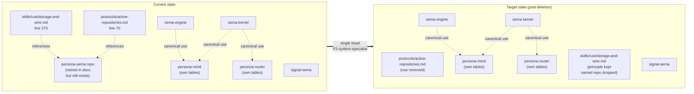

*Kind: Audit + plan · Topic: persona-sema retirement · Date: 2026-05-23*

# 2 — persona-sema audit + absorb + delete plan

## What this slice is

Intent record 309 (`component-shape` Decision, Maximum) directs:
"delete the `persona-sema` repo. It came from an older design
phase when there was thought to be a separate database crate
per component. Verify current contents first, absorb anything
useful into other repos (likely sema-engine, signal-sema, or
persona daemon code), then delete the repository from GitHub."

This slice verifies that today's `persona-sema` is in fact the
legacy design-phase residue the psyche described, identifies
anything worth absorbing, and writes the absorption-then-delete
plan.

Bottom line up front: **nothing worth absorbing; delete the
repo and clean two stale references.** The repo's authors already
formally retired it (README + ARCHITECTURE both say "retired"
in their first sentence), `persona-mind` has an enforcement test
forbidding any dependency on it, and zero sibling repos reference
it in their Cargo.toml, flake.nix, or Cargo.lock. The architectural
substance is gone; only the GitHub repo entry, two cleanup-target
references in primary, and the local checkout remain.

## persona-sema current contents

Full file inventory of `/git/github.com/LiGoldragon/persona-sema/`:

| File | Lines | Summary |
|---|---|---|
| `Cargo.toml` | 32 | Library `persona_sema` + scaffold bin `persona-sema-daemon`. Depends on `sema` (kernel), `signal-persona` (the retired combined contract), `rkyv`, `thiserror`. |
| `src/lib.rs` | 32 | Module re-exports + doc comment explicitly stating "this crate was introduced as if Persona had one shared storage layer... The shared abstraction is retired." |
| `src/error.rs` | 12 | Trivial `Error` enum wrapping `sema::Error`. |
| `src/main.rs` | 3 | `println!("persona-sema-daemon scaffold")`. Not a real daemon. |
| `src/schema.rs` | 20 | `SCHEMA_VERSION = 1` + `SCHEMA` constant carrying just the version. |
| `src/store.rs` | 44 | `PersonaSema` struct wrapping `sema::Sema`. Trivial open/path/handle wrapper; identical to opening `sema::Sema` directly with one helper line `TableSet::current().ensure(&sema)?`. |
| `src/tables.rs` | 75 | Eleven `Table<u64, T>` constants where each `T` is a `signal_persona::*` type (Message, Authorization, Delivery, Binding, Harness, Observation, Lock, StreamFrame, Deadline, DeadlineExpired, Transition) plus a `TableSet::ensure` that calls `Table::ensure` on each in one write transaction. |
| `tests/open.rs` | 106 | Smoke tests — open creates db, reopen succeeds, nested path creates parents, sema handle exposed, all 11 tables materialise. |
| `tests/tables.rs` | 93 | Writes a `signal_persona::Message` and two `signal_persona::Observation` variants, reads them back. Round-trip sanity. |
| `ARCHITECTURE.md` | 100 | Explicit retirement record. Opens with "*This repository is not part of the current Persona architecture.*" Diagram + table show each persona component owning its own Sema layer. |
| `README.md` | 12 | "Retired Persona storage-layer scaffold over the Sema kernel." |
| `AGENTS.md` | 7 | Three-sentence note: "Keep actor mailboxes, routing policy, workspace claim orchestration, and terminal injection out of this crate." |
| `skills.md` | 16 | "This repo is retired as a shared Persona storage layer. Work here only to maintain legacy scaffolding..." |
| `flake.nix` | 87 | Standard crane/fenix flake: build, test, test-open, test-doc, doc, fmt, clippy checks. |
| `flake.lock` | — | Standard. |
| `rust-toolchain.toml` | — | Standard. |
| `Cargo.lock` | — | Standard. |
| `.gitignore` | — | Standard. |

Source totals: 198 lines of Rust (six tiny files), 199 lines of
tests. The whole crate is a thin `sema::Sema` wrapper plus eleven
hard-coded `Table<u64, T>` constants pointing at types from the
*also-retired* `signal-persona` combined contract (see
`signal-persona/Cargo.toml` description: "Retired compatibility
shim for the former combined Persona signal contract.").

Last meaningful commit was 2026-05-11 ("architecture: remove
stale Persona shared-state wording"); since then the repo has
sat as documented retirement scaffolding. The work the psyche
described as "a design phase of trying to decide what things
were named" matches exactly — the repo's purpose was "Persona's
typed-storage layer over the sema kernel," precisely the
"separate database crate per component" framing the psyche
identified as obsolete.

## What to absorb (if anything)

Per-file decision:

| File | Decision | Rationale |
|---|---|---|
| `Cargo.toml` | retire | Crate identity itself is the obsolete abstraction. |
| `src/lib.rs` | retire | Pure re-exports + doc explaining retirement. |
| `src/error.rs` | retire | One-variant wrapper around `sema::Error`. No information. |
| `src/main.rs` | retire | Three-line scaffold; never built into a real daemon. |
| `src/schema.rs` | retire | `SchemaVersion::new(1)` constant; trivially recreatable. The schema-versioning *discipline* is already canonical in `sema-engine` + the future `sema-upgrade` design (designer/270). |
| `src/store.rs` | retire | `PersonaSema` is a one-field struct around `sema::Sema`; today's pattern is to open `sema::Sema` (or build an `Engine` from `sema-engine`) directly inside the owning component. `persona-mind/src/tables.rs` already does this without the wrapper. |
| `src/tables.rs` | retire | The eleven `Table<u64, T>` constants point at `signal-persona::*` types from a contract that is itself retired. Per the retirement ARCHITECTURE.md, each state-bearing component now owns its own tables (e.g. `persona-mind` owns its mind tables). Nothing to absorb — the *types* still exist in `signal-persona` only as part of that shim's own retirement window. |
| `tests/open.rs` | retire | Tests the wrapper, not the kernel. `sema` and `sema-engine` carry their own open / nested-path / table-materialisation tests already. |
| `tests/tables.rs` | retire | Tests round-trip of `signal-persona::Message` / `Observation` records through a wrapper that has no consumers. |
| `ARCHITECTURE.md` | retire (substance already migrated) | Its substance ("each component owns its own Sema layer, no shared persona-sema") is already canonical in `protocols/active-repositories.md` line 70 + `skills/rust/storage-and-wire.md` §"Why this discipline is strict" + `persona/ARCHITECTURE.md` line 1484 + `persona-mind/ARCHITECTURE.md` line 323. No new content to lift. |
| `README.md` / `AGENTS.md` / `skills.md` | retire | All three just restate retirement. |
| `flake.nix` | retire | Standard crane scaffolding; no novel build trick. |

**Nothing to absorb.** The shape the repo was meant to demonstrate
(typed `Table<K, V>` constants beside a wrapped `sema::Sema` handle)
is already the established pattern in `persona-mind/src/tables.rs`
and any other state-bearing daemon. The `Table::ensure` idiom is
upstream in `sema` itself. The "one Schema constant per database"
pattern is upstream in `sema`. The eleven `signal-persona` record
types it materialises are about to be retired alongside the
`signal-persona` shim.

The single piece of substance worth highlighting is **negative**: the
ARCHITECTURE.md retirement note explicitly warns against conflating
"today's sema (typed storage kernel; rename pending → `sema-db`)"
with "the eventual Sema (universal medium for meaning)." That
discipline already lives in `ESSENCE.md` §"Today and eventually
— different things, different names" and is referenced in
`protocols/active-repositories.md` lines 173-178. Nothing to lift.

## What to delete

Three deletion targets, in order:

1. **The GitHub repo `LiGoldragon/persona-sema`.** Command:
   `gh repo delete LiGoldragon/persona-sema --yes` (system-specialist
   authority; psyche-owned repo).
2. **The local checkout `/git/github.com/LiGoldragon/persona-sema/`.**
   Standard rm-rf after the GitHub delete is confirmed and any open
   jj branches inspected (`jj log` shows one detached `@` change
   `0ba70716` plus `main` at `feb1a47d` — no work in flight).
3. **Two references in primary:**
   - `protocols/active-repositories.md` line 70 — the "Retired /
     Cleanup Targets" table row. Drop the row entirely once the
     repo no longer exists; the table itself stays for future
     retired entries.
   - `skills/rust/storage-and-wire.md` line 373 — "In particular,
     `persona` is a meta project today; there is no shared
     `persona-sema` architecture." Rephrase to drop the named
     repo while keeping the principle ("there is no shared
     Persona-wide storage crate"). The principle is still
     load-bearing for future agents.

Other references that **stay** as historical context:
- `reports/operator/108/109/150-*` and `reports/second-designer/17`
  and `reports/designer/293-*/4-rkyv-0_7-to-0_8-audit.md` —
  reports are immutable history of past sessions; mentions are
  appropriate.
- `persona-mind/tests/weird_actor_truth.rs` lines 510-535 — the
  enforcement test "`mind_source_cannot_depend_on_persona_sema`"
  stays. Its job is to prevent regression; the obsoleted-by-deletion
  framing is exactly what the test prevents from creeping back in.
  (Optional follow-up: rephrase the comment to "no shared
  Persona-wide storage crate" once the repo is gone, since the
  named repo no longer exists. Minor.)
- `persona-mind/ARCHITECTURE.md` line 323 and `persona/ARCHITECTURE.md`
  line 1484 — these state the architectural principle; rephrase
  is optional cosmetic cleanup, not a blocker.

## Dependency check

Searched for `persona-sema` / `persona_sema` across all sibling
repo manifests and primary discipline files:

| Search location | Result |
|---|---|
| `/git/github.com/LiGoldragon/*/Cargo.toml` (excluding persona-sema itself) | **No matches.** No sibling crate depends on it. |
| `/git/github.com/LiGoldragon/*/flake.nix` (excluding persona-sema itself) | **No matches.** No sibling flake imports it. |
| `/git/github.com/LiGoldragon/*/flake.lock` (excluding persona-sema itself) | **No matches.** Not transitively pulled in. |
| `/git/github.com/LiGoldragon/*/Cargo.lock` (excluding persona-sema itself) | **No matches.** Not in any resolved dep tree. |
| `/home/li/primary/skills/` | One match — `rust/storage-and-wire.md` line 373 (deletion target above). |
| `/home/li/primary/protocols/` | One match — `active-repositories.md` line 70 (deletion target above). |
| `/home/li/primary/AGENTS.md`, `ESSENCE.md`, `INTENT.md`, `intent/` | **No matches.** Clean. |
| `persona-mind` source + tests | Three matches in `tests/weird_actor_truth.rs` (enforcement test, designed to stay). Two matches in ARCHITECTURE docs (principle statements; optional cosmetic rephrase). |
| `persona` ARCHITECTURE.md | One match (principle statement; optional cosmetic rephrase). |

**Verdict: zero live consumers.** The dependency surface is
already empty. Deletion will not break any build, lock file, or
import resolution. Only documentation references need touching,
and only the two flagged above are load-bearing (one in protocols
table, one in skills section).

## Sequencing

There is nothing to absorb, so the sequence collapses to one
operator-shaped step plus one system-specialist-shaped step:

1. **(skipped — nothing to absorb)** No absorption bead needed.
2. **Delete the repository + clean two references.** This is a
   single coherent piece of work — the GitHub deletion and the
   primary references should land together so the workspace
   never has the contradictory state "repo gone, references
   still point at it." Best filed as a system-specialist bead
   (gh delete + workspace doc edit).

If a later audit finds the cosmetic rephrases in `persona-mind`
ARCHITECTURE.md, `persona/ARCHITECTURE.md`, and the
`weird_actor_truth.rs` test comment worth doing, they would be
trivial follow-ups outside this bead. They do not need to gate
the deletion.

## Bead recommendations

Single bead — `persona-sema delete repo + primary references`,
P3, system-specialist (gh repo delete authority + primary doc
edits in scope).

No absorption bead — there's nothing to absorb. The Cargo.toml,
src/, and tests/ contents are either trivially recreatable or
already canonical elsewhere; absorbing them would be cargo-culting
a wrapper the architecture explicitly rejects.

Body for the deletion bead:

> Per intent 309 (component-shape Decision, Maximum, 2026-05-23):
> persona-sema is legacy design-phase residue from when each
> component was thought to need its own database crate. Audit
> (sub-report 2 of second-designer/161) confirms zero consumers:
> no sibling Cargo.toml / flake.nix / Cargo.lock references it,
> persona-mind has an enforcement test forbidding the dep, and
> the repo's own ARCHITECTURE.md + README declare it retired.
>
> Three actions:
> 1. `gh repo delete LiGoldragon/persona-sema --yes`.
> 2. Remove the persona-sema row from
>    `protocols/active-repositories.md` (currently line 70, in
>    the "Retired / Cleanup Targets" table).
> 3. In `skills/rust/storage-and-wire.md` (currently line 373),
>    rephrase the sentence to drop the named repo while keeping
>    the principle: "there is no shared Persona-wide storage
>    crate." The principle stays load-bearing.
>
> Local checkout cleanup: rm -rf
> `/git/github.com/LiGoldragon/persona-sema/` after GitHub
> deletion confirmed.
>
> Out of scope (optional cosmetic follow-ups for a later bead
> if anyone wants them): rephrase named-repo mentions in
> `persona-mind/ARCHITECTURE.md` (line 323),
> `persona/ARCHITECTURE.md` (line 1484), and the comment in
> `persona-mind/tests/weird_actor_truth.rs` lines 510-535. The
> enforcement test itself stays — its job is regression prevention.

## Diagram

## How it fits

- **Sub-report 3 (context maintenance sweep):** persona-sema
  deletion is one concrete obsolete-artifact removal. Cleanup
  rule for sub-report 3: anywhere the workspace docs name a
  retired repo by its exact identifier (vs stating the principle),
  the named reference should be reviewed when the repo actually
  goes away. The two flagged references here are the immediate
  cleanup; the optional cosmetic follow-ups in `persona-mind`
  and `persona` ARCHITECTURE docs are candidates for sub-report
  3's general inventory.
- **Sub-report 5 (intent refresh + manifestation gap audit):**
  intent 309 (this slice) is captured and now has a concrete
  delivery path. After the deletion bead lands, intent 309 is
  fully manifested. The principle behind it ("today's `sema-engine`
  + `signal-sema` is the per-component sema substrate; there is
  no shared per-persona storage crate") is already canonical
  workspace discipline.

## See also

- Intent 309 — component-shape Decision (Maximum), 2026-05-23.
  Captured in Spirit.
- `/git/github.com/LiGoldragon/persona-sema/ARCHITECTURE.md` —
  the in-repo retirement record (2026-05-11).
- `/home/li/primary/protocols/active-repositories.md` §"Retired
  / Cleanup Targets" — row to be deleted.
- `/home/li/primary/skills/rust/storage-and-wire.md` §"Why this
  discipline is strict" — sentence to be rephrased.
- `/git/github.com/LiGoldragon/persona-mind/tests/weird_actor_truth.rs`
  lines 510-535 — `mind_source_cannot_depend_on_persona_sema`
  enforcement test; stays as regression prevention.
- `/home/li/primary/reports/second-designer/160-persona-prefix-removal-coordinated-rename-2026-05-23.md`
  — listed `persona-sema` as ambiguous in the prefix-removal
  context. Intent 309 supersedes that ambiguity by deleting
  the repo outright.
- `/home/li/primary/reports/designer/270-sema-upgrade-component-design.md`
  — current canonical schema-upgrade design; explicitly orthogonal
  to the retired persona-sema scope.
