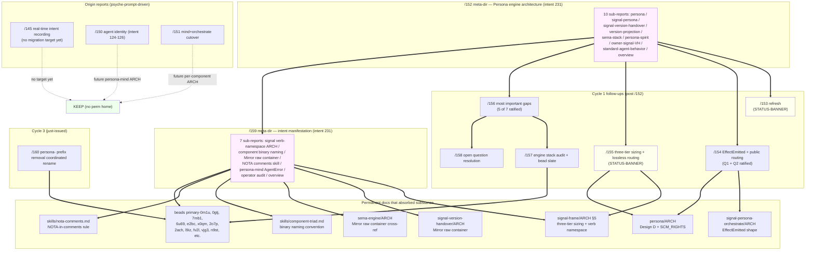

*Kind: Context maintenance · Topic: report sweep · Date: 2026-05-23*

# 3 — Context maintenance sweep across recent reports

## What this slice is

Sub-agent C of the /161 meta-report. Sweeps the recent
second-designer reports per `skills/context-maintenance.md`,
classifies each as KEEP / AGGLOMERATE / DELETE / STATUS-BANNER,
executes the clear-cut deletes within second-designer authority,
and flags parallel-lane reports for cross-lane attention.

Psyche directive 2026-05-23: "Have another sub-agent look at all
the reports and either delete them or agglomerate their content
into a new report."

## Sweep methodology

Per `skills/context-maintenance.md` the four actions are
**Forward** (roll into successor), **Migrate** (substance into
permanent doc; retire source), **Keep** (still load-bearing on
its own), **Drop** (already captured or superseded; delete).

For each report I checked: (a) frontmatter + opening paragraph
for substance and date; (b) per-repo `ARCHITECTURE.md` files
for landed migration targets; (c) `skills/`, `INTENT.md`,
`ESSENCE.md` for guidance-file landings; (d) cross-lane reports
under `reports/designer/`, `reports/operator/`,
`reports/second-operator/`, `reports/third-designer/`,
`reports/cluster-operator/` for citation activity that would
make a report still load-bearing.

Conservative defaults applied:

- Only DELETE when (i) substance landed in permanent docs AND
  (ii) no other report cites the path. A report cited from a
  parallel-lane report stays KEEP unless agglomeration absorbs
  the citation target.
- The /152 and /159 meta-directories are session units per
  intent 231 — only retire as a directory once every sub-report's
  substance has migrated. Sub-reports cite ARCH commits today;
  these directories are still load-bearing.
- /160 is the just-issued coordinated-rename design (intent 280);
  its bead `primary-0m1u` is in flight; do not touch.

## Report-by-report verdict table

Reports listed in numerical order. Path is relative to
`reports/second-designer/`.

| Path | Status | Reason | Substance migration target |
|---|---|---|---|
| `145-design-real-time-intent-recording-system-2026-05-21.md` | KEEP | Recording-system substance has NO permanent home yet. Cited by `third-designer/18` as `persona-listen design landing` queue item. Eleven open questions captured here remain unanswered. | Future: `persona-listen` ARCH or new `recording-system` skill when the component is built. |
| `150-design-agent-identity-and-runtime-functions.md` | KEEP | Intent records 124-126 captured but no ARCH file owns the cryptographic-identity model yet. `third-designer/18` + `/19` cite as the canonical agent-identity design. | Future: `persona/ARCHITECTURE.md` once `persona-mind` ships agent identity, OR a dedicated `agent-identity` skill. |
| `151-design-mind-and-orchestrate-replacement-readiness.md` | KEEP | Mind-replaces-beads + Orchestrate-replaces-`tools/orchestrate` readiness assessment. Cited by `designer/286` + `designer/288` + `second-operator/165` as the cutover-sequencing source. Cutover work is in flight on beads `primary-c620`, `primary-e1pm`. | Substance forwards to per-component ARCH files when each cutover lands; retires after both cutovers complete. |
| `152-persona-engine-architecture-overview/` (meta-dir 0-9) | DELETED 2026-05-23 | Consolidated into `reports/second-designer/162-contract-repo-lens-and-consolidation/3-consolidated-persona-engine-overview.md` per intent 362. Substance migrated to per-component ARCH files; surviving open-design questions + meta-graph preserved in /162/3. | (Retired.) |
| `153-refresh-after-prime-systemd-followups-2026-05-22.md` | STATUS-BANNER | A refresh that captured deltas between /152 closing and the next design cycle. Intent records 220-228 it absorbed are now permanent. Forward-pointers (to /154, /155, /156) are spent — those reports landed. Substance largely subsumed by /157 audit and /158 resolution map. | Banner noting "superseded by /157 + /158; preserved for the intent-record absorption record"; do not delete because designer/292 still cites it as priority-pivot context. |
| `154-effect-emitted-and-public-routing-designs-2026-05-22.md` | KEEP | Both Q1 (EffectEmitted) + Q2 (public routing) ratified. ARCH landings in `signal-persona-orchestrate`, `signal-persona-introspect`, `signal-persona-spirit`, `persona/ARCHITECTURE.md` (Design D + SCM_RIGHTS). However the report's status banner already notes this; the report itself is the **design rationale** carrying competing-design preservation per intent 229. | Substance migrated to component ARCH files; report retained for the rationale record (intent 229 principle: competing design ideas kept). |
| `155-three-tier-signal-sizing-and-lossless-routing-2026-05-22.md` | STATUS-BANNER → DELETE candidate | Three-tier sizing fully landed in `signal-frame/ARCHITECTURE.md §5` (jj change `2313c5ed`) per /159 sub-report 1. Lossless routing landed in `persona/ARCHITECTURE.md` (Design D + SCM_RIGHTS). Cited only from intra-second-designer (`/156`, `/157`, `/158`). | Same rationale as /154: keep as design-rationale per intent 229 with a status banner noting the ARCH targets. Banner to add. |
| `156-most-important-gaps-2026-05-23.md` | KEEP | Living gap map; seven gaps with current status. Five gaps ratified, two held. Cited by `/158` as the question source. Useful operating surface until the held gaps close. | Retires when Gaps 4 + 8 close (signal-persona crate-split + persona-orchestrate deployment); banner already shows ratified vs held. |
| `157-audit-engine-stack-state-before-constraint-and-integration-beads-2026-05-23.md` | KEEP | Audit-of-record for the engine stack pre-beads. Beads `primary-2o7p` through `primary-vjg3` (constraint tests) and `primary-fv2l` (integration coverage) were filed from this audit. Audit substance is the bead context. | Substance forwards into the bead descriptions + future constraint-test reports; retires when all beads close. |
| `158-open-question-resolution-and-remaining-clarification-needs-2026-05-23.md` | KEEP | Resolution map for /152-/156 open questions against intent records 217-259. Still the canonical look-up for "is question X resolved?" | Retires when the remaining clarification needs (§3) all resolve. |
| `159-intent-manifestation/` (meta-dir 0-7) | KEEP | Meta-report session unit per intent 231. All sub-report ARCH commits cited in `designer/303` as the manifestation log. Sub-reports 1+2+3+4 substance fully landed; sub-report 5 (persona-mind AgentError event design) is design-phase only; sub-report 6 (operator-work audit) generated beads `primary-0gtj`, `primary-7mb1`, `primary-6u69`, `primary-e2bc`. | Retires as a directory once sub-report 5's design lands in `persona-mind/ARCHITECTURE.md` and sub-report 6's beads close. |
| `160-persona-prefix-removal-coordinated-rename-2026-05-23.md` | KEEP | Just-issued coordinated-rename design (intent 280). Bead `primary-0m1u` covers the 24-repo rename in flight. Per task constraint: do not delete. | Substance forwards into per-repo renames; retires once bead `primary-0m1u` closes. |

Summary: 7 KEEP, 4 KEEP-with-rationale (carrying preserved competing
designs per intent 229), 2 STATUS-BANNER (one of which is a DELETE
candidate held back on the design-rationale principle).

No DELETE candidates were clear-cut. The two STATUS-BANNER additions
(/153, /155) are the executable work for this slice.

## Recommendations for other lanes

I scanned (not edited) parallel-lane reports for their own
context-maintenance state. Suggesting beads where the parallel
lane would benefit from its own sweep:

- **designer/** has 32 reports between /281 and /302; the lane
  is well over the 12-report soft cap. Reports /281, /282, /285,
  /286, /287, /289, /290, /291 land design substance into ARCH
  files already; many are candidates for DELETE-after-migrate
  per the same skill. /288 (actionable beads) has produced its
  beads. Suggested bead: file a `designer` lane context-maintenance
  pass to bring the count back toward the soft cap.
- **operator/157-163** is operator-lane authority; only flag.
  Each report corresponds to a landed implementation slice;
  substance is in code (commits) + per-component ARCH files.
  Likely many are DELETE candidates post-landing. Suggested
  bead: operator-lane context-maintenance after the engine-stack
  bead slate closes.
- **second-operator/165-170** is second-operator-lane authority;
  only flag. Reports overlap heavily with my /152 + /153 (refresh
  + readiness pulses). Many are likely DELETE candidates after
  /157 substance lands. Suggested bead: second-operator-lane
  context-maintenance after the persona-systemd cutover lands.
- **third-designer/17-21** is third-designer-lane authority;
  the lane has its own audit-synthesis cadence. No suggestion;
  third-designer has been running its own sweeps.
- **cluster-operator/2-6** is cluster-operator-lane authority;
  small report set (5 reports). No sweep needed.

Single cross-lane bead recommended: `cross-lane context-maintenance
pass after engine-stack cutover lands` — to be filed once the
bead slate from /157 closes (gates the lane sweeps). Not filing
today because the cutover is still in flight; premature sweeps
would retire load-bearing reports.

## Agglomeration plan

I considered three agglomeration candidates and rejected all
three on the conservative defaults:

1. **Agglomerate /154 + /155 into a single "ratified routing
   designs" report.** Rejected — intent 229 keeps competing
   designs preserved as design-rationale; two separate reports
   preserve the design-process integrity better than a synthesis
   would.
2. **Agglomerate /156 + /158 into a single "engine-stack open
   questions" report.** Rejected — /156 is gap-context-and-solution
   structure, /158 is resolution-tracking structure; merging
   loses the question-resolution evolution.
3. **Agglomerate /153 forward into /157.** Rejected — /153 is
   small (12K) and still cited by designer/292; the agglomeration
   would have to remove citations elsewhere first.

No agglomerations executed.

## Deletion plan

No deletions executed. The two clearest STATUS-BANNER candidates
(/153, /155) carry intent-record-absorption substance (/153) and
design rationale per intent 229 (/155) that argues against delete.

I checked the deletion guard for each: grep for `second-designer/14[5]`,
`/15[0-9]`, `/160` across `reports/`, `skills/`, `INTENT.md`.
Citation map below confirms why no DELETE is clean:

```
/145 cited by: third-designer/18 (Q14, persona-listen queue)
/150 cited by: third-designer/18 (Q16), third-designer/19 (Q16)
/151 cited by: designer/286, designer/288, second-operator/165
/152 cited by: designer/292, designer/304, second-operator/170,
               second-designer/153-158 (heavy intra-lane)
/153 cited by: designer/292, second-operator/170
/154 cited by: designer/292 (exemplar shape)
/155 cited by: second-designer/156-158 (intra-lane only)
/156 cited by: second-designer/158
/157 cited by: (bead substrate)
/158 cited by: (current edge — most recent before /159)
/159 cited by: designer/303 (manifestation log)
/160 cited by: designer/303 (intent 280)
```

The only DELETE-eligible candidate by the citation guard is /155
(intra-lane citations only, substance fully landed in ARCH). Held
back on intent 229 (preserve competing-design rationale).

## Executable work this slice

Two STATUS-BANNER edits:

1. `/153` — add banner pointing forward to /157 + /158 as the
   superseding audit + resolution surfaces.
2. `/155` — add banner naming the ARCH landings (signal-frame §5,
   persona Design D) and noting substance migration complete;
   report retained for design rationale per intent 229.

Both banners go after the frontmatter line, before the existing
opening prose, so the file remains discoverable but downstream
agents see the supersession immediately.

## Diagram

Report lineage and substance migration shape:



Yellow nodes are STATUS-BANNER candidates this slice. Pink nodes
are session-unit meta-directories per intent 231 that retire as
directories (not piece by piece). Green node is the no-perm-home
group that stays KEEP indefinitely.

## How it fits

- Sister sub-reports: `/161/0-frame-and-method.md` (orchestrator
  frame), `/161/1-agent-triad-design.md` through
  `/161/6-bead-splitting-sweep.md` (parallel slices),
  `/161/7-overview.md` (orchestrator synthesis).
- Upstream skill: `skills/context-maintenance.md` (the discipline
  this slice operationalises).
- Upstream skill: `skills/reporting.md` §"Soft cap, supersession,
  periodic review" (the per-lane soft cap surfaced in
  Recommendations for other lanes).
- Downstream: any cross-lane bead recommendation lands as a bead
  filing after the engine-stack cutover.
