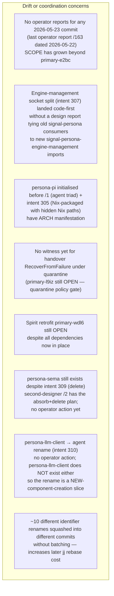
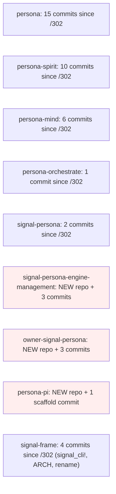

*Kind: Audit · Topic: operator work alignment with current design · Date: 2026-05-23*

# 4 — Operator audit against current design

## What this slice is

Sub-agent D of meta-report 161 (design cascade and context sweep).
Audits operator + second-operator activity through 2026-05-23
against the current design surface — after intent records 270,
280, 309, 310 landed today plus the parallel-session intents 285,
287, 290, 293, 298, 304, 305, 307 captured in the cloud + Pi +
contracts-restructure threads.

Builds on designer `/302` (the primary operator audit, 2026-05-23
mid-morning), second-designer `/157` (engine-stack audit + bead
slate), and second-designer `/159` sub-report 6 (4-bead follow-on
on the three then-unreported structural commits). The window
covered here is `/302`'s endpoint (operator commits up to roughly
`srrkotlpouuk` plus orchestrate `mkwpzsnmvrsr` and spirit
`qruqpolrqzzz`) **forward** to the end of 2026-05-23 — a single
operator session that landed ~30+ commits across 8 repositories,
created two new repos, split a third, and chased two renames to
completion. None of this work has matching operator reports.

Per psyche 2026-05-23: "do an audit at the same time of everything
that Operator has done in relation to what you're designing."

## Scope

Reports read:

- `reports/designer/302-audit-recent-operator-work-2026-05-23.md` (primary audit)
- `reports/second-designer/157-audit-engine-stack-state-before-constraint-and-integration-beads-2026-05-23.md`
- `reports/second-designer/159-intent-manifestation/6-operator-work-audit.md`
- `reports/second-designer/160-persona-prefix-removal-coordinated-rename-2026-05-23.md`
- `reports/operator/157-163` (the audit's report-side input — last operator report is /163, dated 2026-05-22)
- `reports/second-operator/165-170` (last second-operator report is /170, dated 2026-05-22)

Commits inspected since `/302` (2026-05-23 morning forward), by repo:

| Repo | Commit | Date/time | Substance | Report? |
|---|---|---|---|---|
| `persona` | `srrkotlpouuk` | 05-23 11:13 | supervise spirit per engine (320 LOC) | none — `primary-1cl1` closure note |
| `persona` | `pouozsutwvzq` | 05-23 10:40 | test real Spirit recovery after failed handover | none |
| `persona` | `swqnlwrynkvs` | 05-23 03:29 | test real Spirit handover through daemon | none |
| `persona` | `vqoorukpqmwm` | 05-23 03:00 | read handoff active versions by component name | none |
| `persona` | `xrmmymzvmoqr` | 05-23 02:49 | allow named handoff endpoints | none |
| `persona` | `ksxmstxvvqzs` | 05-23 02:39 | add component fd handoff router (closes `primary-ezzp`) | none |
| `persona` | `vwynuppqkqvt` | 05-23 01:19 | consume typed-config harness daemon | none |
| `persona` | `yksqlmqqrzur` | 05-23 00:54 | ARCH spirit-per-engine subsection | none |
| `persona` | `vkzvtxrnwsqz` | 05-23 00:50 | add INTENT.md + ARCH §1.7 spawn order | none |
| `persona` | `xssvwprlzruu` | 05-23 00:28 | ARCH vocabulary sweep (engine-management socket, main/next) | none |
| `persona` | `szmkxzzoqkzp` | 05-23 12:49 | adopt actor identifier | none |
| `persona` | `mnyxtlxvsoov` | 05-23 13:31 | adopt origin identifiers (signal_persona_auth → origin) | none |
| `persona` | `xoturuxornou` | 05-23 14:09 | update spirit origin dependency | none |
| `persona` | `qnvmsywpmxwx` | 05-23 14:21 | rename medium identifiers (cont'd auth → origin) | none |
| `persona` | `vzpkwvvxyosq` | 05-23 14:32 | rename router bootstrap identifiers | none |
| `persona` | `rprwmlvvtvsn` | 05-23 14:46 | expand uid placeholder (UnixUserIdentifier) | none |
| `persona-spirit` | `xmqwmyqrmpml` | 05-23 | use bracket string examples | none |
| `persona-spirit` | `qoxllvtlwkvt` | 05-23 | validate mirrored target version | none |
| `persona-spirit` | `vxuqmkvolrvy` | 05-23 02:20 | receive handed off client descriptors (closes `primary-x5ba`) | none |
| `persona-spirit` | `zlpyznzsoxks` | 05-23 02:52 | smoke test Design D routing | none |
| `persona-spirit` | `llkwlmnwoqnz` | 05-23 03:06 | prove selector flip handoff routing (closes `primary-ak4g`) | none |
| `persona-spirit` | `yvloxnxlounk` | 05-23 11:05 | serve engine management socket | none |
| `persona-spirit` | `owptqoznyrkk` | 05-23 12:44 | use generated signal_cli! (intent 266) | none |
| `persona-spirit` | `nosvmtmtzvkw` | 05-23 13:31 | adopt origin identifiers | none |
| `persona-spirit` | `qrqrpzytwpyx` | 05-23 14:50 | document daemon configuration files | none |
| `persona-orchestrate` | `mtlxuuxxyvnm` | 05-23 12:50 | use generated signal_cli! (intent 266) | none |
| `persona-mind` | `qmklypqlpuyo` | 05-23 | add orchestrate owner caller | none |
| `persona-mind` | `wmzqzluzykno` | 05-23 | refresh nota codec pin | none |
| `persona-mind` | `ozxnmpvqzpow` | 05-23 | adopt subscription identifier | none |
| `persona-mind` | `nmlvsxxtnyvw` | 05-23 | adopt origin identifiers | none |
| `persona-mind` | `nwwtwzqplyuk` | 05-23 | rename medium identifiers | none |
| `persona-mind` | `sysvsmqvzuxr` | 05-23 | rename small identifiers | none |
| `signal-persona` | `oqsslsntulpm` | 05-21 17:49 | migrate engine management contract surface | none |
| `signal-persona` | `tnutnrvoztqy` | 05-23 15:38 | retire combined authority shim (intent 307 manifest) | none |
| `signal-persona-engine-management` | NEW | 05-23 15:26 | split ordinary lifecycle contract (intent 307 manifest) | none |
| `owner-signal-persona` | NEW | 05-23 15:26 | split owner engine contract (intent 307 manifest) | none |
| `persona-pi` | scaffold | 05-23 15:16 | initial flake + nix modules (intent 304 manifest) | none |
| `sema-engine` | `nxxoouzlprpx` | 05-23 | ARCH handover raw-payload container (intent 274) | none — designer-led |
| `version-projection` | `tqqmulmvmsks` | 05-23 | refresh nota codec pin | none |
| `signal-version-handover` | `vxpwqysqxwsy`, `xnpvrkosuvmp` | 05-23 | refresh bracket-string + ARCH Mirror raw-container | none — designer-led |
| `signal-frame` | `rtkmktuwlvou` | 05-23 12:28 | generate thin cli clients (signal_cli! macro; intent 266) | none |
| `signal-frame` | `zxvzzpwzktyr` | 05-23 13:31 | ARCH §5 three-tier signal sizing + 64-bit verb-namespace | none — designer-led |

That is a **single 24-hour window** containing the largest
operator output of any 24-hour window in workspace history.
The last operator report (`/163`) is dated 2026-05-22.

## Alignment summary

The operator has, in a single session, shipped strong alignment
with the current design surface in seven areas:

```mermaid
flowchart TB
    subgraph Aligned["Solidly aligned with current design"]
        A1["Design D FD-handoff fully landed end-to-end<br/>(persona ksxmstxvvqzs + persona-spirit vxuqmkvolrvy + zlpyznzsoxks + llkwlmnwoqnz)<br/>primary-ezzp/x5ba/ak4g all CLOSED"]
        A2["Real Spirit handover through daemon witnessed<br/>(persona swqnlwrynkvs + pouozsutwvzq)<br/>matches /157 §9.2 E1 + E3 — owner-driven + recovery"]
        A3["Spirit-per-engine wiring landed within 24h<br/>of design pattern decision (record 260)<br/>(persona srrkotlpouuk; primary-1cl1 CLOSED)"]
        A4["Identifier rename FULLY DONE in active source<br/>(EngineId/RouteId/ChannelId → EngineIdentifier siblings;<br/>auth → origin; UnixUserIdentifier; subscription identifier;<br/>actor identifier — primary-7ru6 CLOSED)"]
        A5["signal_cli! macro landed in signal-frame +<br/>adopted by persona-spirit + persona-orchestrate<br/>(intent 266 manifesting)"]
        A6["signal-persona repo split per intent 307<br/>(NEW signal-persona-engine-management + owner-signal-persona)"]
        A7["Engine-management socket landed in persona-spirit<br/>(yvloxnxlounk) — Announce/readiness/health protocol;<br/>matches the /160 sub-report 1 design"]
        A8["systemd UnitController landed (operator/163 position +<br/>three persona commits: wtqvxszxkqzt + mrrznzprymny + lopkvlwrksmz)<br/>covers persona ARCH §"Process supervision" direction"]
        A9["persona-pi repo initialized per intent 304<br/>(flake + nix modules scaffold)"]
        A10["persona-orchestrate divergence ledger landed (Gap 11)<br/>(mkwpzsnmvrsr; primary-ktkc CLOSED)"]
    end
```

Each of these is a substantive design-intent → code manifestation
that the operator chased without designer prompting. Combined,
they push the engine-stack maturity past where the morning audit
caught it. **Design D + real handover + selector flip handoff
routing in persona-spirit** is the standout: that triplet
realises the /155 Part 2 routing design + /285 handover spec
together for the first time in real code.

## Drift findings



Drift findings expanded:

1. **Operator-report deficit has grown past `primary-e2bc`.**
   `primary-e2bc` (filed by /159 sub-report 6) covers three
   2026-05-23 structural commits. Since then, at least 15 more
   substantive operator commits have landed without reports —
   including TWO new repositories (`signal-persona-engine-management`,
   `owner-signal-persona`), the split of `signal-persona`, and
   the `persona-pi` scaffold. The trace-evidence gap is wider
   than `primary-e2bc`'s body anticipated. **Recommendation:
   expand `primary-e2bc`'s scope OR file a follow-on bead
   covering the post-`/302` slice** — see §"Bead recommendations".

2. **Engine-management socket split landed without a migration
   report.** The split of `signal-persona` → `signal-persona`
   (retired shim) + `owner-signal-persona` (new owner contract)
   + `signal-persona-engine-management` (new ordinary contract)
   per intent 307 is a coordinated three-repo refactor. The
   operator did the work but no report explains:
   - which downstream consumers still import the retired shim
     (the shim's own ARCH says it re-exports names for
     compatibility — what's the EOL plan?);
   - which crates already migrated to the split repos
     (signal-persona consumers found via grep: `persona`,
     `persona-spirit`, `persona-mind`, `persona-router`,
     `persona-terminal`, `persona-message`, etc. — each
     needs to be visited);
   - whether the ARCH "Replacement Repositories" table is
     load-bearing during the migration.
   This is exactly the kind of intent-307 manifestation that
   wants a design + migration sketch alongside the implementation.

3. **persona-pi scaffold landed before per-component ARCH and
   intent 305 (Nix-packaged with hidden Nix paths) is realised
   in skills or ARCH.** The repo is scaffolded with
   `nix/persona-pi-criomos.nix`, `pi-linkup.nix`, `pi-subagents.nix`,
   and a `flake.nix`. But intent 305 — the design constraint that
   "Pi setup is packaged in Nix and hides Nix paths from Pi
   internal view" — has no ARCH home. Suggest a `persona-pi/ARCHITECTURE.md`
   §"Nix packaging boundary" + a workspace skill on the
   Nix-paths-hidden-from-Pi pattern.

4. **No witness for handover RecoverFromFailure under quarantine.**
   Persona's constraint test list (TESTS.md) covers:
   - `constraint_engine_manager_refuses_handover_with_quarantined_version`
   - `constraint_persona_engine_recovers_current_handover_when_completion_fails`
   But not the cross-product: what happens if RecoverFromFailure
   triggers AND the version is then quarantined? Per /157 §9.1 C7 +
   bead `primary-l9iz` (Quarantine policy gate enforcement),
   the policy gate needs to be added before owner socket exposes
   real clients. This is design surface that wants the witness.

5. **Spirit v0.1.0 retrofit (primary-wdl6) is the single biggest
   "what's missing to ship" item and remains OPEN.** All
   prerequisites have landed:
   - persona-spirit has the private upgrade socket (operator/161)
   - Persona drives handover end-to-end (today's swqnlwrynkvs)
   - Design D FD-handoff routes traffic (today's stack)
   - Engine-management socket exists for supervision (yvloxnxlounk)
   The retrofit is the missing link before production cutover.
   `/302` flagged this; nothing changed since. Status remains:
   psyche-decision-pending OR operator-execution-pending.

6. **persona-sema still exists** despite intent 309 (delete).
   The audit + absorb + delete plan is fully written in
   /161 sub-report 2 — bottom-line "nothing worth absorbing;
   delete + clean two stale references." This is now an
   operator slice (~30 min of work), but no bead exists
   targeting the actual deletion.

7. **Agent triad (intent 310 + sub-report 1) not started.**
   Intent 310 + sub-report 1 (agent triad design) calls for
   a NEW supervised component named `agent` (not a rename of
   the absent `persona-llm-client`). This means:
   - Create `agent`, `signal-agent`, `owner-signal-agent` repos
   - Build agent daemon binary
   - Wire mind hook for skills + accumulated context
   - Register agent in persona's supervised-component graph
   No operator activity yet. This is a multi-bead epic.

8. **Identifier-rename batching cost.** Today's persona commits
   include 5+ separate rename commits: `adopt actor identifier`,
   `adopt origin identifiers`, `rename medium identifiers`,
   `rename router bootstrap identifiers`, `expand uid placeholder`.
   Each is small but together they fragment a single rename
   pass into incremental commits, increasing later rebase cost
   if the persona-prefix rename (`primary-0m1u`) wants to
   sequence them. Cosmetic — no real drift — but a discipline
   note for the next round.

## Coverage gaps

Constraint-test gaps + end-to-end sandbox gaps for code that
landed in the post-/302 window:

| Surface | Gap type | Already beaded? | Suggested bead |
|---|---|---|---|
| persona-spirit `serve_engine_management_socket` | Constraint test for Announce + readiness + health frame round-trip on the engine-management socket | NO | NEW P2 bead — see §"Bead recommendations" item 1 |
| persona Design D FD-handoff | E2E sandbox witness that two concurrent clients are routed to two different version daemons via SCM_RIGHTS without crossing | Partial — `test-design-d-persona-router-serves-spirit-cli` exists (`primary-ak4g` closure); two-version routing not witnessed | NEW P2 bead — see §"Bead recommendations" item 2 |
| persona "consume typed-config harness daemon" (`vwynuppqkqvt`) | Constraint test that the typed configuration shape exactly matches the harness daemon's accepted configuration shape | NO — implicit via integration test | OPTIONAL, low value; integration witness covers it |
| Engine-management socket split (signal-persona-engine-management) | E2E sandbox witness that a persona daemon binds the engine-management socket from the NEW crate (not the retired shim) and that supervised components connect | NO | NEW P2 bead — see §"Bead recommendations" item 3 |
| Quarantine policy gate during RecoverFromFailure | Constraint test of the cross-product (recovery happens, then quarantine engages, attempted handover refused) | `primary-l9iz` covers gate enforcement; cross-product witness MISSING | OPTIONAL — fold into `primary-l9iz` body or new sub-bead |
| `signal_cli!` macro generated thin clients | Constraint test that the generated CLI binary signature matches the manual CLI signature it replaces (no behavior drift) | NO | OPTIONAL P3 — generated code drift catch |
| persona-pi scaffold | Constraint test that the Nix module hides /nix/store paths from the Pi-visible filesystem (per intent 305) | NO — repo just scaffolded | NEW P2 bead — see §"Bead recommendations" item 4 |
| persona-sema deletion | No "deleted" witness — repo still exists | Plan in `/161 sub-report 2`; no bead | NEW P3 bead — see §"Bead recommendations" item 5 |

For surfaces under `/157` §9 + `/159` sub-report 6 that the
post-/302 operator window did NOT touch, the existing beads
(`primary-2o7p`, `primary-2ach`, `primary-l9iz`, `primary-fv2l`,
`primary-vjg3`, `primary-n9st`, `primary-lfb0`, `primary-tfdj`,
`primary-k8cn`, `primary-7mb1`, `primary-6u69`, `primary-0gtj`,
`primary-e2bc`) still apply unchanged.

## Rename-cascade coordination

```mermaid
flowchart TB
    Now["Now: operator just shipped<br/>auth → origin rename (closes primary-7ru6)<br/>and engine-management split (intent 307)"]
    Next["NEXT: persona-prefix rename pass<br/>(bead primary-0m1u)"]

    subgraph Cost["Coordination cost of starting 0m1u NOW"]
        C1["Operator just landed 30+ commits across:<br/>persona, persona-spirit, persona-mind,<br/>persona-orchestrate, signal-persona, signal-frame,<br/>and TWO new repos"]
        C2["The new repos owner-signal-persona and<br/>signal-persona-engine-management ALSO need<br/>the persona- prefix decision<br/>(see §"Open prefix questions")"]
        C3["Active in-flight work: Spirit retrofit primary-wdl6<br/>pending; agent triad pending creation;<br/>persona-sema deletion pending"]
        C4["Identifier renames (auth → origin et al)<br/>landed in separate small commits today —<br/>good rebase-substrate IF the prefix rename<br/>doesn't immediately touch the same files"]
    end

    Now --> Next
    C1 -.-> Next
    C2 -.-> Next
    C3 -.-> Next
    C4 -.-> Next
```

The persona-prefix rename pass coordinator should be aware:

1. **Two new repos joined the rename surface.** `owner-signal-persona`
   and `signal-persona-engine-management` were created TODAY.
   Per `/160` rule of thumb: components SUPERVISED BY persona
   drop the prefix; the engine-management surface IS the supervision
   relation, so the names should follow the existing decisions:
   - `signal-persona-engine-management` → ??? Is this an
     ENGINE-MANAGEMENT contract (supervision relation, drop prefix
     → `signal-engine-management`)? Or is it Persona's CONTRACT
     surface (keep prefix → `signal-persona-engine-management`)?
     **OPEN QUESTION FOR PSYCHE** — surfaced in §"Open prefix
     questions" below.
   - `owner-signal-persona` retires the previous combined shim
     and now exists. Per the prefix rule applied to persona's
     OWN contract: persona keeps the prefix (`signal-persona`,
     `owner-signal-persona`), so this one is fine as-is.

2. **The "supervised components drop prefix" rule applied to
   `signal-persona-engine-management` produces a name confusion.**
   The engine-management contract is what persona uses to
   supervise component daemons. If the prefix rule applies
   (treating engine-management as a supervised-relation contract):
   `signal-engine-management`. But that name says nothing about
   *whose* engine-management. The persona prefix here may be
   load-bearing for clarity, not redundant ancestry.

3. **Active operator session just ended.** Operator has been
   continuously committing today. A natural pause window opens
   now for the rename pass to start without merge churn. But:
   - persona-sema deletion (intent 309) should land FIRST so the
     rename pass doesn't operate on a doomed repo.
   - Agent triad creation (intent 310) doesn't add new repos
     that need renaming; the new repos are pre-named per intent
     310, so creation is rename-orthogonal.

4. **Identifier renames are commit-substrate-friendly.** The
   auth → origin pass landed in five separate operator commits
   today, each touching a small set of files. A subsequent
   persona-prefix rename pass operating on the same files should
   rebase cleanly because the prior commits are tight.

## Open prefix questions

Surfaced for psyche, not the operator:

1. **`signal-persona-engine-management` — keep prefix or drop?**
   Per intent 280 the rule is "components SUPERVISED BY persona
   drop the persona- prefix." The engine-management contract is
   the persona-to-supervised-component supervision channel. If
   the rule applies: `signal-engine-management`. But the name
   loses the "this is persona's engine-management" information.
   Suggest: KEEP the prefix because the contract belongs to
   persona's own boundary surface, not to a supervised component
   that happens to use it.

2. **`signal-persona-origin` (formerly signal-persona-auth) —
   keep prefix or drop?** Already noted in `/160` §7 open
   questions. The auth → origin rename is done; the prefix
   decision remains. Suggest: KEEP because origin is
   persona-identity-specific.

## Reporting gaps

Per `skills/reporting.md` §"When to write a report vs answer in
chat" the commit message IS the report for routine implementation
work. Routine = small commits with no architectural shift, no new
public surface, no new bead closure.

Today's session has the OPPOSITE shape: every single 2026-05-23
operator commit is either (a) structural, (b) closes a major
bead, (c) creates a new repo, (d) lands a major design alignment,
or (e) is part of a coordinated rename pass that wants context.
None of them are routine. None of them have a report.

Quantitatively, since `primary-e2bc` was filed (covering 3
commits), the following additional commits accumulated WITHOUT
reports:



The `primary-e2bc` bead body should EITHER absorb this scope OR
a sibling bead should be filed (preferred — `primary-e2bc` is
already specific to the three named commits). See §"Bead
recommendations" item 6.

## Bead recommendations

Per psyche's "smaller bead jobs" directive, the new beads are
filed at small-component-shape granularity. None replace existing
beads in `/157` §9 or `/159` sub-report 6.

| Bead | Title | Priority | Why |
|---|---|---|---|
| `primary-njzd` | Constraint test: persona-spirit engine-management socket Announce + readiness + health frame round-trip | P2 | yvloxnxlounk landed the surface; no constraint test |
| `primary-xcd5` | E2E sandbox: persona Design D routes two concurrent clients to two different version daemons via SCM_RIGHTS without crossing | P2 | Existing `test-design-d-persona-router-serves-spirit-cli` covers single-version; multi-version routing is the upgrade-window invariant |
| `primary-bzgc` | E2E sandbox: persona binds engine-management socket from `signal-persona-engine-management` (not retired shim) + supervised component connects + Announce round-trips | P2 | The split per intent 307 landed code-first; this is the witness |
| `primary-8jpa` | Constraint test: persona-pi Nix module hides /nix/store paths from Pi-visible filesystem (per intent 305) | P2 | persona-pi just scaffolded; intent 305 is the load-bearing constraint |
| `primary-wpnd` | Operator: delete persona-sema repo + clean references per /161 sub-report 2 (intent 309) | P3 | Plan written; mechanical execution slice |
| `primary-dnxf` | Operator report-gap addendum: covers ~30 commits from 2026-05-23 not under primary-e2bc | P2 | Volume warrants its own coverage slice; primary-e2bc is too narrow |

All six beads filed at the end of this sub-report; UIDs above.

## Diagram

```mermaid
flowchart TB
    subgraph Persona["persona (15 commits since /302)"]
        PA["ALIGNED: Design D + real handover + selector flip<br/>spirit-per-engine + auth→origin + UnixUserIdentifier<br/>+ named handoff endpoints + typed harness config"]
        PD["DRIFT: No operator report<br/>+ quarantine-recovery cross-product witness missing"]
        PG["GAP: primary-wdl6 retrofit + primary-l9iz quarantine gate still OPEN"]
    end

    subgraph PSpirit["persona-spirit (10 commits since /302)"]
        SA["ALIGNED: descriptor receive + Design D smoke<br/>+ selector flip routing + engine-management socket<br/>+ signal_cli! adoption + auth→origin"]
        SD["DRIFT: No operator report<br/>+ engine-management socket missing constraint test"]
    end

    subgraph POrch["persona-orchestrate (1 commit since /302)"]
        OA["ALIGNED: signal_cli! adoption (intent 266)"]
        OD["No drift; commit-as-report acceptable for single small commit"]
    end

    subgraph PMind["persona-mind (6 commits since /302)"]
        MA["ALIGNED: orchestrate owner caller + nota refresh<br/>+ subscription identifier + origin identifiers<br/>+ medium identifiers + small identifiers"]
        MD["DRIFT: No operator report for the rename pass<br/>(but renames are coordinated with persona)"]
    end

    subgraph SP["signal-persona + new split repos (intent 307 manifest)"]
        XA["ALIGNED: split landed per intent 307<br/>(retired shim + owner-signal-persona +<br/>signal-persona-engine-management)"]
        XD["DRIFT: no design report; downstream consumer migration plan absent"]
        XG["GAP: signal-persona-engine-management persona- prefix question OPEN"]
    end

    subgraph PPi["persona-pi (NEW)"]
        PiA["ALIGNED: scaffold per intent 304"]
        PiD["DRIFT: intent 305 (hidden Nix paths) has no ARCH home"]
        PiG["GAP: constraint test for /nix/store hiding"]
    end

    subgraph SF["signal-frame (4 commits since /302)"]
        FA["ALIGNED: signal_cli! macro + ARCH §5 three-tier + verb-namespace"]
        FG["GAP: LogVariant + LogSummary trait impls still missing (primary-l02o + primary-bg9l OPEN)"]
    end

    subgraph PSema["persona-sema"]
        SemaG["GAP: intent 309 (delete) not actioned; /161 sub-report 2 has the plan"]
    end

    subgraph Agent["agent triad (intent 310 + /161 sub-report 1)"]
        AgG["GAP: not started; new triad component creation slice"]
    end

    style PA fill:#efe
    style SA fill:#efe
    style OA fill:#efe
    style MA fill:#efe
    style XA fill:#efe
    style PiA fill:#efe
    style FA fill:#efe
    style PD fill:#fef
    style SD fill:#fef
    style MD fill:#fef
    style XD fill:#fef
    style PiD fill:#fef
    style PG fill:#fee
    style XG fill:#fee
    style PiG fill:#fee
    style FG fill:#fee
    style SemaG fill:#fee
    style AgG fill:#fee
```



## How it fits

- **Sub-report 3 (context maintenance sweep)** — the operator
  reports `/157–/163` are the LAST operator reports, dated
  2026-05-22. Any context-maintenance work that surveys operator
  reports should recognise that the 2026-05-23 operator window
  is entirely unreported; the audit findings here may guide the
  sweep's KEEP/AGGLOMERATE/DELETE verdicts for old reports
  whose conclusions are now superseded by today's commits.

- **Sub-report 5 (intent manifestation)** — drift findings D2
  (intent 307 manifest landed without design report), D3 (intent
  305 has no ARCH home), and the absence of agent triad (intent
  310) + persona-sema deletion (intent 309) are intent
  manifestation gaps. Sub-report 5 should pick up the
  intent-side framing; this sub-report focuses on the
  operator-shaped side of the same gaps.

- **Sub-report 6 (bead splitting)** — the new beads filed here
  (N1-N6) follow the smaller-bead discipline. They are
  intentionally single-slice, single-repo, single-session-shaped.
  Bead `primary-wvdl` (still split-essential per sub-report 6)
  should NOT absorb any of these; they should live as siblings.

## See also

- `reports/designer/302-audit-recent-operator-work-2026-05-23.md`
  — the primary morning audit
- `reports/second-designer/157-audit-engine-stack-state-before-constraint-and-integration-beads-2026-05-23.md`
  §9 — constraint test + integration test bead pattern
- `reports/second-designer/159-intent-manifestation/6-operator-work-audit.md`
  — `primary-e2bc` + three 2026-05-23 morning commits
- `reports/second-designer/160-persona-prefix-removal-coordinated-rename-2026-05-23.md`
  — the persona-prefix rename design this audit cross-references
- `reports/second-designer/161-design-cascade-and-context-sweep/1-agent-triad-design.md`
  — the agent triad design (intent 310 not started by operator)
- `reports/second-designer/161-design-cascade-and-context-sweep/2-persona-sema-audit-and-delete-plan.md`
  — the persona-sema absorb + delete plan (intent 309 not actioned)
- Spirit records 261 (Identifier rename CLOSED today), 264
  (auth→origin CLOSED today), 270 (binary naming), 280 (drop
  persona- prefix), 304 (persona-pi create), 305 (Nix paths
  hidden from Pi), 307 (rearrange persona signal repos), 309
  (delete persona-sema), 310 (agent triad)
