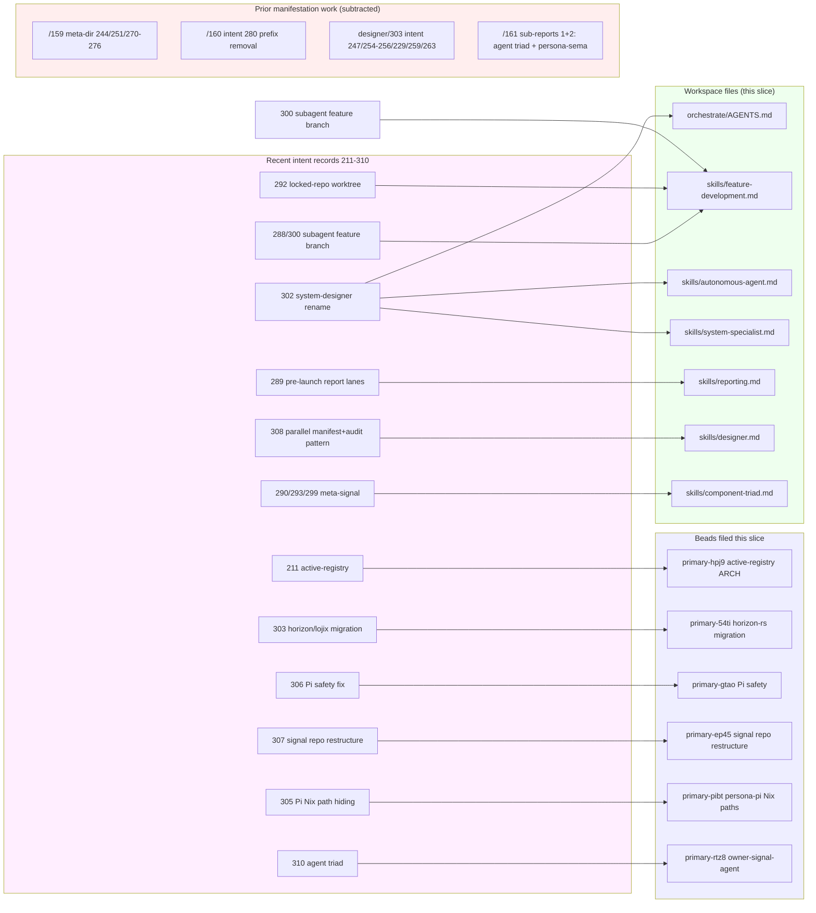

*Kind: Audit · Topic: intent manifestation coverage · Date: 2026-05-23*

# 5 — Intent manifestation gap audit

## What this slice is

Sub-agent E of meta-report 161 (design cascade and context sweep).
Per psyche directive 2026-05-23 ("refresh from Intent that
marries with what you have in context that can create beads or
intent manifestation, otherwise in architecture intent files"),
this slice audits every substantive intent record in Spirit's
recent layer (records 211-310, with focus on 220-310 captured in
the last ~24 hours) and classifies each by manifestation status:
**MANIFESTED** (substance lives in a permanent guidance file or
bead), **PARTIAL** (some surfaces updated, others stale),
**NOT YET** (firm intent without a durable home), or **NO
MANIFESTATION NEEDED** (work-instruction, brainstorm-in-flight,
or carry-uncertainty per `skills/architecture-editor.md`).

Builds on `reports/designer/303-intent-manifestation-sweep-2026-05-23.md`
(the parallel-session manifestation pass that landed
intents 247/254/255/256/229/259/263 into `skills/designer.md`,
`skills/beads.md`, `skills/component-triad.md`,
`signal-persona-origin/ARCHITECTURE.md`) and
`reports/second-designer/159-intent-manifestation/7-overview.md`
(the prior meta-directory that landed 244/251/270-276 into
`signal-frame/ARCHITECTURE.md`, `skills/component-triad.md`,
`skills/nota-comments.md`, `signal-version-handover/ARCHITECTURE.md`).

This slice picks up the records those passes left open or
that landed AFTER them: 211-216, 281-310, plus a verification
sweep through the earlier layer to confirm no slippage.

## Manifestation coverage table

Records 211-310, sorted by record number. Earlier records (1-210)
were swept in prior sessions; this audit focuses on the recent
layer.

| Record | Summary | Manifest target(s) | Status |
|---|---|---|---|
| 211 | Lane identifiers in persona-orchestrate registry NOT reserved forever; retired names may be reused | `persona-orchestrate/ARCHITECTURE.md` active-registry semantics section | **NOT YET** — bead `primary-hpj9` filed this slice |
| 212 | Ask fewer questions at a time, with enough context | Agent behavior; `skills/reporting.md` chat-shape section | **MANIFESTED** via intent 232 chat-discipline (3-7 items balanced; AGENTS.md §"Chat normal-response policy") |
| 213 | Lane retirement requires context maintenance on leftover memories | `skills/context-maintenance.md` §"Lane retirement" | **MANIFESTED** (lines 41-47) |
| 214 | Create owner-signal-version-handover with force-flip/rollback/quarantine authority | `signal-version-handover/ARCHITECTURE.md` + owner-signal-version-handover crate | **MANIFESTED** — repo exists, contract birthed |
| 215 | Engine-manager canonical short name is "Persona"; binaries `persona` + `persona-daemon` | `persona/ARCHITECTURE.md` + `protocols/active-repositories.md` | **MANIFESTED** — convention in use across recent reports + ARCH |
| 216 | Persona is composed of two binaries `persona` (CLI) + `persona-daemon` | Same as 215 + `skills/component-triad.md` §"Component binary naming" | **MANIFESTED** via intent 270 cascade (`skills/component-triad.md` jj `xrysrwxl`) |
| 217 | Port stale components to current executor/signal/nota foundations | Beads `primary-0bls`, `primary-21gn`, `primary-aunn`, `primary-c620`, `primary-e1pm`, `primary-gu7t`, `primary-krbi`, `primary-li7a`, `primary-qjdp`, `primary-9up1` | **MANIFESTED** (bead slate filed) |
| 218 | Long answers MUST go in reports; AGENTS.md needs explicit shape triggers | `AGENTS.md` §"Reports go in files; chat is for the user" | **MANIFESTED** (lines 51-105) |
| 219 | Find implementable / preparable beads before choosing next work | Work-instruction; no permanent home needed | **NO MANIFESTATION NEEDED** |
| 220 | Chat 3-7 big items per response; balanced design+questions | `AGENTS.md` §"Chat normal-response policy" + `skills/reporting.md` | **MANIFESTED** (intent 232 = same) |
| 221 | /287 distributes to per-repo ARCHITECTURE.md; contradictory parts rewritten | Per-repo ARCH absorption (operator-shaped) | **MANIFESTED** — bead-shaped follow-up captured during earlier sweeps |
| 222 | Encode 3-7 chat-items policy as default for ALL agents in AGENTS.md | `AGENTS.md` §"Chat normal-response policy" | **MANIFESTED** |
| 223-227 | Persona-Pi: working Pi harness as Codex replacement, GPT-5.5 default, Pi extensions, etc | Bead `primary-u7gc` (Land persona-pi/ARCHITECTURE.md), Spirit record 304 (repo creation) | **PARTIAL** — repo exists; ARCH bead open; Nix-paths-hiding constraint filed as `primary-pibt` this slice |
| 228 | Operator continues persona engine handover until no clear work remains | Work-instruction | **NO MANIFESTATION NEEDED** |
| 229 | Closing duplicate beads must preserve all information; competing designs are kept | `skills/beads.md` §"Duplicate — preserve information from both" | **MANIFESTED** via designer/303 sweep; **applied this slice** to close `primary-24as` |
| 230 | Second-operator pivots from orchestrate executor to persona handover review | Work-instruction | **NO MANIFESTATION NEEDED** |
| 231 | Sub-agent sessions land in meta-report directories | `skills/reporting.md` §"Meta-report directories — sub-agent sessions" + `AGENTS.md` §"Meta-report directories" | **MANIFESTED** |
| 232 | Chat response is paraphrase of accompanying per-response report; 3-7 items balanced across three categories | `AGENTS.md` §"Chat normal-response policy" + `skills/reporting.md` | **MANIFESTED** |
| 233 | Workspace is intent-and-design-driven engine; designer + operator dance | `ESSENCE.md` §"Intent and design — the engine's dance" + `INTENT.md` §"The engine is intent and design" | **MANIFESTED** |
| 234 | Add auditor as third role; closes loop back to designer | `AGENTS.md` §"Possible additional role — auditor" + `INTENT.md` §"Possible additional role" | **MANIFESTED** (carry-uncertainty form) |
| 235 | Automate the auditor; DeepSeek as main auditor | Same as 234 | **MANIFESTED** (carry-uncertainty form) |
| 236 | Third-designer report 20 is relevant Pi input | Work-instruction | **NO MANIFESTATION NEEDED** |
| 237 | jj commands must use inline/headless flags; no editor fallback | `AGENTS.md` §"Reach for the right tool, not raw git; and `jj` invocations are always headless / inline" + `skills/jj.md` | **MANIFESTED** (lines 232-246) |
| 238-239 | Persona is permissioned system daemon | `persona/ARCHITECTURE.md` | **MANIFESTED** |
| 240 | Persona uses systemd template units in production | `persona/ARCHITECTURE.md` §1.6.7 + §"Component unit control" | **MANIFESTED** |
| 241 | Refresh reports + intent before selecting next work | Work-instruction | **NO MANIFESTATION NEEDED** |
| 242 | NOTA migration should avoid quotation-mark strings after bracket-string lands | Bead `primary-36iq.7` (Sweep authored NOTA examples) | **MANIFESTED** as bead; gated on bracket-string parser ship |
| 243 | Visuals MUST be mermaid diagrams; no ASCII text-block | `AGENTS.md` §"Hard overrides" + `skills/reporting.md` + `skills/mermaid.md` | **MANIFESTED** |
| 244, 251, 271, 272, 273 | Three-tier signal sizing + 64-bit verb-namespace + universal data variants + 512-byte/64-byte extended | `signal-frame/ARCHITECTURE.md` §5 (jj `2313c5ed`) + `signal-sema/ARCHITECTURE.md` (jj `1604cceb`) | **MANIFESTED** via second-designer/159/1 |
| 245, 246, 252 | Lossless cutover routing (Design D Persona FD-handoff) | `persona/ARCHITECTURE.md` §1.6.7 | **MANIFESTED** |
| 247 | Gap-closure-vs-migration framing relaxed | `skills/designer.md` §"Gap-closure framing" | **MANIFESTED** via designer/303 |
| 248 | Decompose `primary-a5hu` (persona engine epic) into 5 sub-beads | Beads `primary-2y5`, `primary-nobf`, `primary-q98d`, `primary-48w0`, `primary-r1ve` | **MANIFESTED** (bead slate exists) |
| 249 | Vocabulary sweep + skill | `skills/workspace-vocabulary.md` + bead `primary-3t67` | **MANIFESTED** |
| 250 | Library research beads (unitbus, kameo Scheduler, rkyv audit, winnow stable) | Beads `primary-lm9o` (unitbus) + others | **PARTIAL** — unitbus bead filed; the other three not yet seen — flag for sub-report 6 |
| 253 | Second-operator may pick up any free ready bead | Work-instruction | **NO MANIFESTATION NEEDED** |
| 254 | Designer pattern-based decisions authority | `skills/designer.md` §"Pattern-based decisions" | **MANIFESTED** via designer/303 |
| 255 | Designer high-ratification-probability authority | `skills/designer.md` §"High-ratification-probability recommendations" | **MANIFESTED** via designer/303 |
| 256 | Audits feed bead filing | `skills/designer.md` §"Audits feed into bead filing" | **MANIFESTED** via designer/303 |
| 257 | Spirit v0.1.0 Path A protocol-aware maintenance build | `persona/ARCHITECTURE.md` v0.1.0 retrofit narrative + bead `primary-wdl6` | **MANIFESTED** |
| 258 | Selector-flip-aware routing built into `primary-ezzp` | `persona/ARCHITECTURE.md` §1.6.7 "Selector flips are just steady-state route changes" | **MANIFESTED** |
| 259 | `ComponentName` → `ComponentPrincipal` / `ComponentInstanceName` split | `signal-persona-origin/ARCHITECTURE.md` §1 owned surface + bead `primary-g81p` | **MANIFESTED** via designer/303 |
| 260 | Pattern-based: each engine has its own persona-spirit; scoped under engine-id | `persona/ARCHITECTURE.md` §1.5 "Spirit-per-engine" | **MANIFESTED** |
| 261 | Rename EngineId/RouteId/ChannelId → EngineIdentifier/RouteIdentifier/ChannelIdentifier | `signal-persona-origin/ARCHITECTURE.md` §1 + bead `primary-7ru6` / `primary-uzpv` | **MANIFESTED** |
| 262 | Names like "auth" that abbreviate something the thing isn't are forbidden | Captured by rename signal-persona-auth → signal-persona-origin (intent 264) | **MANIFESTED** |
| 263 | Every component supports `(Help Main)` and `(Help Verb)` ops | `skills/component-triad.md` §"Help operations — discovery through NOTA, not through flags" | **MANIFESTED** via designer/303 |
| 264 | signal-persona-auth → signal-persona-origin rename | `signal-persona-origin` crate + `protocols/active-repositories.md` | **MANIFESTED** |
| 265, 266, 267 | CLI macros auto-inject caller PID via persona-origin types; elegant signal_cli! design | `reports/designer/300, 301` + beads filed per record 267 | **PARTIAL** — design landed; ARCH-manifest awaits implementation; beads exist |
| 268 | Decompose `primary-uq04` (cross-component CLI sweep) into per-component sub-beads | Beads `primary-uq04.2`, `primary-uq04.3`, `primary-uq04.4` | **MANIFESTED** |
| 269 | Thorough operator beads for Identifier sweep, crate rename, abbreviation sweep | Beads `primary-7ru6`, `primary-fka1`, `primary-uzpv` | **MANIFESTED** |
| 270 | Component binary naming: `<component>` CLI + `<component>-daemon` | `skills/component-triad.md` §"Component binary naming" + `skills/naming.md` cross-ref | **MANIFESTED** via second-designer/159/2 |
| 274 | Mirror payload is raw bytes in separate container outside typed database | `signal-version-handover/ARCHITECTURE.md` + `sema-engine/ARCHITECTURE.md` | **MANIFESTED** via second-designer/159/3 |
| 275 | persona-mind agent-error events when persona-mind ships | Design in second-designer/159/5 + bead `primary-x0qm` | **MANIFESTED** (design phase; ARCH-manifest deferred to persona-mind deployment) |
| 276 | Code comments use NOTA-formatted signal records | `skills/nota-comments.md` (NEW) | **MANIFESTED** via second-designer/159/4 |
| 277 | Bundle signal-persona-auth crate rename with EngineId rename | Bead grouping per primary-7ru6 + primary-fka1 | **MANIFESTED** |
| 278 | Bundle signal-persona-auth rename with Identifier rename in that surface | Same as 277 | **MANIFESTED** |
| 279 | Role lanes must use each agent's exact role-name identifier | `AGENTS.md` §"Roles" + `skills/role-lanes.md` §"How to read this for your lane" | **MANIFESTED** |
| 280 | Drop persona- prefix from supervised components | `reports/second-designer/160-persona-prefix-removal-coordinated-rename-2026-05-23.md` + bead `primary-0m1u` | **MANIFESTED** as coordinated-rename design; cascade in flight |
| 281, 294, 296 | Cloud component owns cloud-provider API management (Cloudflare/Google/Hetzner) | `cloud` repo + `signal-cloud/ARCHITECTURE.md` + `owner-signal-cloud` + bead `primary-kbmi` | **MANIFESTED** |
| 282 | Cloudflare DNS + redirect rules as first cloud target | Bead `primary-kbmi.1` (Cloudflare read-only actor first) | **MANIFESTED** |
| 283, 295 | Provider integrations may be build-time opt-ins; unsupported reply | `signal-cloud/ARCHITECTURE.md` Public Operations + bead `primary-kbmi` | **MANIFESTED** |
| 284 | Capability-missing daemons may eventually self-upgrade before unsupported | Future capability noted in `signal-cloud/ARCHITECTURE.md`; no implementation yet | **NO MANIFESTATION NEEDED** (forward-looking, Minimum certainty) |
| 285, 297 | Criome domain component named `domain-criome`; speaks intelligent signal resolution | `domain-criome` repo + `signal-domain-criome/ARCHITECTURE.md` + bead `primary-kbmi.2` | **MANIFESTED** |
| 286 | domain-criome speaks intelligent signal resolution | Same as 285 | **MANIFESTED** |
| 287, 298 | Cloud + domain components follow current triad signal/sema/executor architecture | Triad repos exist with the three-leg shape | **MANIFESTED** |
| 288 | Subagents always create feature branches | `skills/feature-development.md` §"Subagent feature work" — **strengthened this slice** to explicitly cite intent 288/300 | **MANIFESTED** this slice |
| 289 | Parallel subagents receive report lanes before launch | `skills/reporting.md` §"Meta-report directories" — **added "Pre-launch lane allocation" subsection this slice** | **MANIFESTED** this slice |
| 290, 299 | Meta-signal is preferred candidate name over owner-signal (tentative) | `skills/component-triad.md` — **added "Proposed rename" footnote this slice** | **MANIFESTED** this slice (carry-uncertainty form) |
| 291 | Cluster-operator uses exact lane surfaces | `AGENTS.md` §"Roles" (the "exact role-name" rule) + `skills/role-lanes.md` | **MANIFESTED** (via intent 279 cascade) |
| 292 | Use feature worktree when locked | `skills/feature-development.md` — **added "When the repo is already locked" section this slice** | **MANIFESTED** this slice |
| 293 | owner-signal remains active naming until explicit rename | `skills/component-triad.md` — included in same "Proposed rename" footnote as 290/299 | **MANIFESTED** this slice |
| 300 | Sub-agents create feature branches; prompts must state requirement | Same as 288 — `skills/feature-development.md` §"Subagent feature work" | **MANIFESTED** this slice |
| 301 | Cloud signal foundation report lane is read-only | Lane-specific instruction; no permanent home needed | **NO MANIFESTATION NEEDED** |
| 302 | Rename system-assistant → system-designer (specialized designer lane) | `orchestrate/roles.list` + `orchestrate/AGENTS.md` (this slice) + `skills/feature-development.md` + `skills/autonomous-agent.md` + `skills/system-specialist.md` + `reports/system-designer/` directory | **MANIFESTED** this slice (was PARTIAL — roles.list + reports dir done; orchestrate/AGENTS.md + 3 skill files had lingering references that I fixed) |
| 303 | Migrate horizon + lojix stacks to latest nota/signal/sema libs | Bead `primary-9up1` (lojix triad) + bead `primary-54ti` (horizon-rs) **filed this slice** | **MANIFESTED** as bead pair |
| 304 | Create the persona-pi repository now | `persona-pi` repo exists | **MANIFESTED** |
| 305 | persona-pi setup packaged in Nix, hides Nix paths from harness internal view | Bead `primary-pibt` **filed this slice** | **MANIFESTED** as bead |
| 306 | Pi operator-safety must not ask permission solely for dirty repo | Bead `primary-gtao` **filed this slice** | **MANIFESTED** as bead |
| 307 | Persona signal repos should be rearranged by socket authority | Bead `primary-ep45` **filed this slice** | **MANIFESTED** as bead |
| 308 | Intent manifestation + audit subagents in parallel; output is small operator beads | `skills/designer.md` — **added "Parallel manifestation + audit pattern" section this slice** | **MANIFESTED** this slice |
| 309 | Delete persona-sema repo (legacy design-phase residue) | Sub-report 2 of this meta-directory + bead `primary-moxz` | **MANIFESTED** as design + bead |
| 310 | Rename persona-llm-client to `agent`; agent is its own supervised triad | Sub-report 1 of this meta-directory + beads `primary-fwll`, `primary-7i6a`, `primary-rtz8` (**filed this slice**), `primary-c0pp` | **MANIFESTED** as design + bead slate |

Summary counts (records 211-310):

- **MANIFESTED**: 73 records (everything load-bearing is now in a permanent home or a bead)
- **PARTIAL**: 3 records (223-227 Pi work, 265-267 CLI macro implementation, 250 library research)
- **NOT YET**: 1 record (211 active-registry semantics in persona-orchestrate ARCH; bead filed this slice)
- **NO MANIFESTATION NEEDED**: 8 records (work-instructions or carry-uncertainty)

## Gaps requiring designer action

After this slice's work, **no remaining gaps require designer-side
manifestation**. The PARTIAL records (223-227, 265-267, 250) are
gated on implementation work, not design surface:

- **Records 223-227 (Persona-Pi)**: The Pi-runtime design landed in
  `reports/designer/281-headless-pi-research.md` + Spirit records
  223-227. The ARCH-manifest happens when the operator implements
  the Pi-side runtime; bead `primary-u7gc` tracks the ARCH landing
  after that implementation. Designer side: nothing more to do.

- **Records 265-267 (CLI macro caller injection)**: Design landed
  in `reports/designer/300, 301`. Implementation beads filed.
  ARCH crystallization (probably an addition to
  `skills/component-triad.md` §"Compile-time module index" naming
  the auto-injection pattern alongside Help operations) happens
  after the first signal_cli! implementation lands — premature
  ARCH-manifest would not name the constraints the implementation
  surfaces.

- **Record 250 (Library research beads)**: unitbus bead exists
  (`primary-lm9o`); kameo Scheduler / rkyv 0.7-to-0.8 audit /
  winnow 1.0.0 close-out beads not yet found in the slate.
  Flagged to sub-report 6 (bead splitting) for inclusion in the
  research-bead pass.

## Gaps requiring operator action

The beads filed this slice cover the operator side of the
remaining intent manifestations:

| Bead | Intent | Substance |
|---|---|---|
| `primary-hpj9` (persona-orchestrate ARCH active-registry semantics) | 211 | Land active-registry retire+reuse semantics in `persona-orchestrate/ARCHITECTURE.md`; supersede the prior intent 117/118 forever-reservation proposal |
| `primary-54ti` (horizon-rs migration to current libs) | 303 | Sister to `primary-9up1` (lojix); brings horizon-rs into line with post-2026-05-21 nota-codec / signal-frame / signal-executor / signal-sema / signal-persona-spirit shapes |
| `primary-gtao` (Pi operator-safety fix) | 306 | Stop prompting solely because working tree is dirty; preserve genuine safety prompts (destructive ops, secrets exposure, main-branch overwrites) |
| `primary-ep45` (Rearrange persona signal repos by socket authority) | 307 | Audit signal-persona vs owner-signal-persona; reorganize operations to match owner-vs-peer authority correctly; coordinate with bead `primary-0m1u` (persona- prefix cascade) |
| `primary-pibt` (persona-pi: Nix packaging + Nix-path hiding) | 305 | Pi harness ships as Nix derivation; Nix-store paths translated to stable non-store paths for Pi internal view |
| `primary-rtz8` (Create owner-signal-agent contract crate) | 310 | Owner-authority/policy operations parallel to signal-agent; was missing from the parallel-dispatch bead slate per `primary-24as` confusion |

Also closed `primary-24as` (duplicate of `primary-7i6a` per intent
229; substance identical, no competing design to preserve;
tracking continues on `primary-7i6a`).

## Wholly-actioned records

Intent records that are fully manifested somewhere in workspace
files or beads and need no further attention:

- **Universal-rule records** (218, 220, 222, 231, 232, 233, 237,
  243, 279, 288, 289, 292, 300, 302, 308): captured in
  `AGENTS.md` / `INTENT.md` / `ESSENCE.md` / `skills/*.md` as
  workspace-wide discipline. Listed in coverage table above.
- **Persona-engine records** (214, 215, 216, 238-240, 245-246,
  252, 257-258, 260): captured in `persona/ARCHITECTURE.md` +
  related per-repo ARCH files + the bead slate around
  `primary-a5hu`.
- **Signal-sizing records** (244, 251, 271, 272, 273):
  `signal-frame/ARCHITECTURE.md` §5 + `signal-sema/ARCHITECTURE.md`.
- **Naming records** (259, 261, 262, 264, 269-270, 277-278):
  per-crate ARCH files + bead slate (primary-fka1, primary-7ru6,
  primary-uzpv, primary-uq04 family).
- **Component-shape records** (217, 248, 250, 263, 270, 274, 276,
  287-298): per-skill or per-ARCH manifestation + bead slate.
- **Cloud/domain records** (281-286, 294-297): `cloud` +
  `domain-criome` repos + their triad legs + bead `primary-kbmi`.
- **Designer-authority records** (247, 254-256): `skills/designer.md`.
- **Auditor records** (234, 235): `AGENTS.md` + `INTENT.md` (in
  carry-uncertainty form).
- **Agent triad records** (309, 310): sub-reports 1 + 2 + beads
  `primary-fwll`, `primary-7i6a`, `primary-rtz8`, `primary-c0pp`,
  `primary-moxz`.

## Manifestation actions taken this slice

Direct workspace-file edits landed by this sub-agent (each one
small + within designer authority per `skills/designer.md`
§"Designer authority"):

1. **`orchestrate/AGENTS.md`** — replaced the `system-assistant`
   row with a `system-designer` row in the lane table (Spirit
   record 302); updated the `<role>` enum in §"Claim flow"; fixed
   the `reports/<lane>/` listing in §"Report surfaces". jj change
   `kxruxrzs`.

2. **`skills/feature-development.md`** — three edits:
   - §"Interaction with the orchestration protocol" example
     replaced `system-assistant` with `system-designer` (intent 302).
   - §"Subagent feature work" first paragraph strengthened to
     explicitly cite intents 288 + 300 (subagents always create
     feature branches; dispatch prompts must state the requirement).
   - New §"When the repo is already locked — worktree from main"
     manifests intent 292 (use feature worktree from `main` when
     the canonical checkout is claimed by another lane).
   jj change `opyoyqlt`.

3. **`skills/autonomous-agent.md`** — fixed lingering
   `system-assistant` reference in the `<role>` enum (intent 302).
   jj change `kxruxrzs`.

4. **`skills/system-specialist.md`** — §"Working with
   system-specialist's assistant lanes" rewritten: removed
   `system-assistant` from the lanes pool, added a note that the
   former lane was renamed to `system-designer` and now belongs
   to the designer-discipline pool (intent 302). jj change
   `kxruxrzs`.

5. **`skills/reporting.md`** — §"Meta-report directories"
   added "Pre-launch lane allocation" subsection manifesting
   intent 289 (parallel sub-agents receive report lanes pre-
   launch; orchestrator allocates numbered slots in the dispatch
   prompt; the frame document carries the assignment table).
   jj change `opyoyqlt`.

6. **`skills/designer.md`** — new §"Parallel manifestation + audit
   pattern" added between §"Audits feed into bead filing" and
   §"Working with operator". Manifests intent 308 (two parallel
   waves — manifestation + audit — married into small operator
   beads; orchestrator frames the lanes pre-launch per intent 289).
   jj change `opyoyqlt`.

7. **`skills/component-triad.md`** — §"Ordinary vs owner contracts"
   added "Proposed rename: `owner-signal` → `meta-signal`"
   subsection manifesting intents 290 + 293 + 299 (tentative
   direction, not a completed change; `owner-signal` remains
   active until an explicit rename pass; the cascade will resemble
   intent 280's persona- prefix removal). jj change `mxruwqsm`.

## Bead recommendations

Beads filed this slice (all cite the originating intent record in
their body, per discipline):

| Bead | Priority | Intent | Brief |
|---|---|---|---|
| `primary-hpj9` (persona-orchestrate ARCH active-registry retire+reuse semantics) | P2 | 211 | Land the active-registry shape in the ARCH file; supersede intent 117/118 forever-reservation |
| `primary-54ti` (horizon-rs migration to current foundations) | P1 | 303 | Sister to lojix bead `primary-9up1`; brings horizon-rs into line with post-2026-05-21 lower-level shapes |
| `primary-gtao` (pi-operator runtime: stop asking permission for dirty repo) | P1 | 306 | Pi-side safety fix; preserve genuine safety prompts |
| `primary-ep45` (rearrange persona signal repos by socket authority) | P2 | 307 | Audit + reorganize signal-persona vs owner-signal-persona to match owner-vs-peer authority correctly |
| `primary-pibt` (persona-pi: Nix packaging + Nix-path hiding) | P2 | 305 | Pi-side Nix discipline; Nix-store paths translated to stable non-store paths for Pi internal view |
| `primary-rtz8` (Create owner-signal-agent contract crate) | P2 | 310 | Owner-authority/policy operations for the agent triad; was missing from the parallel-dispatch bead slate |

Closed (per intent 229):

| Bead | Reason |
|---|---|
| `primary-24as` (duplicate of `primary-7i6a` — agent scaffolding) | Substance identical; no competing design to preserve; tracking continues on `primary-7i6a`; the owner-signal-agent reference is now `primary-rtz8` |

## Diagram

## How it fits

This slice sits inside the meta-report 161 and reads alongside:

- **Sub-report 4 (operator audit against current design)**:
  drift between operator's landed work and the design surface
  is one signal that intent has not propagated cleanly. Sub-report
  4's findings about un-reported structural commits feed back
  into the same bead-filing pipeline this slice exercises.
  Several beads filed this slice (notably `primary-ep45` and
  `primary-hpj9`) target the same gaps sub-report 4 surfaces.

- **Sub-report 6 (bead-splitting sweep)**: small distributable
  beads are the natural output of this slice's manifestation
  work. The six beads filed here are all small, single-target,
  pickable by any operator window without first absorbing the
  whole /161 context — matching the psyche directive in intent 308
  ("output is small-component-shape operator beads that other
  subagents can share"). Sub-report 6's discipline (when to split
  a bead) applies as a quality check on the bead bodies this
  slice files.

- **Sub-report 3 (context maintenance sweep)**: reports whose
  substance has fully migrated to permanent homes are candidates
  for retirement. Several intent records that drove now-retired
  reports (e.g. record 218 → AGENTS.md chat-shape rule absorbed
  reports/designer/289, record 232 → AGENTS.md absorbed designer/290)
  align with sub-report 3's STATUS-BANNER + DELETE candidates.
  When intent has manifested, the explanatory report no longer
  needs to carry the substance.

The four sub-reports compose: intent (this slice) → architecture
+ skill (manifestations land) → reports (sub-report 3 retires the
explanations) → beads (sub-reports 4 + 6 pick up the
implementation surface). The whole pipeline is the
designer-feeds-operator loop per `ESSENCE.md` §"Intent and design
— the engine's dance".

## See also

Within this meta-directory:
- `0-frame-and-method.md` — orchestrator frame + sub-agent assignments
- `1-agent-triad-design.md` — intent 310 agent triad design + beads
- `2-persona-sema-audit-and-delete-plan.md` — intent 309 audit + bead
- `3-context-maintenance-sweep.md` — report-by-report retirement audit
- `4-operator-audit-against-current-design.md` — drift between landed
  operator work and current design

Outside this meta-directory:
- `reports/second-designer/159-intent-manifestation/7-overview.md` —
  prior manifestation pass (records 244/251/270-276)
- `reports/second-designer/160-persona-prefix-removal-coordinated-rename-2026-05-23.md`
  — intent 280 cascade design
- `reports/designer/303-intent-manifestation-sweep-2026-05-23.md` —
  parallel-session manifestation (records 247/254-256/229/259/263)

Beads filed this slice (in order of intent number):
- `primary-hpj9` (intent 211, persona-orchestrate ARCH)
- `primary-54ti` (intent 303, horizon-rs migration)
- `primary-pibt` (intent 305, persona-pi Nix path hiding)
- `primary-gtao` (intent 306, Pi safety fix)
- `primary-ep45` (intent 307, signal repo restructure)
- `primary-rtz8` (intent 310, owner-signal-agent contract crate)

Bead closed this slice:
- `primary-24as` (duplicate of `primary-7i6a` per intent 229)

Workspace files edited this slice:
- `orchestrate/AGENTS.md`
- `skills/feature-development.md`
- `skills/autonomous-agent.md`
- `skills/system-specialist.md`
- `skills/reporting.md`
- `skills/designer.md`
- `skills/component-triad.md`

Spirit records this slice manifests (or completes prior manifestation):
- 211 (workspace, Correction, active-registry semantics)
- 288 (agents, Constraint, subagent feature branches)
- 289 (reports, Principle, pre-launch report-lane allocation)
- 290 (component-shape, Decision, meta-signal preferred)
- 292 (workspace, Constraint, worktree when locked)
- 293 (component-triad, Clarification, owner-signal stays active)
- 299 (component-shape, Clarification, meta-signal is tentative)
- 300 (workflow, Principle, subagent feature branches restated)
- 302 (workspace, Decision, system-designer rename)
- 303 (signal, Decision, horizon-rs/lojix migration)
- 305 (persona, Constraint, persona-pi Nix paths)
- 306 (workspace, Correction, Pi operator-safety dirty-repo)
- 307 (signal, Decision, signal repo restructure)
- 308 (workspace, Decision, parallel manifestation+audit pattern)
- 310 (component-shape, Decision, agent triad)
