*Kind: Bead hygiene · Topic: splitting for distributability · Date: 2026-05-23*

# 6 — Bead-splitting sweep for smaller distributable jobs

## What this slice is

Psyche directive 2026-05-23 (cascade frame, lane F): *"ideally more
in smaller beads jobs so that agents can distribute the work more
easily"*. The brief is to review open beads (focus P1 + selected
P2), identify the ones that bundle multiple distinct slices, and
recommend or file splits-into-smaller-beads. Goal: maximise the
number of beads that any operator (or operator lane, or
second-operator) can claim, finish independently in one session,
and close — without needing to coordinate mid-work with parallel
operators on the same bead.

Inventory baseline: 141 open beads in the workspace (35 P1, ~70
P2, rest P3+). Of those, 8 are explicit epics. The largest 25
beads by body size all sit above 2.4kB description; the top
several go past 5kB. Body size is a rough but useful proxy for
"this bead is doing too much."

Cross-reference to other lanes in this cascade:

- **Sub-report 4** (operator audit) — operator already landed
  significant Track A work under `primary-wvdl` /
  `primary-a5hu`; the splits proposed here line up with the
  remaining gaps the audit identified.
- **Sub-report 5** (intent manifestation gap audit) — new beads
  surfaced from manifestation gaps should also be filed at
  small-bead granularity from day one; this slice's discipline
  recommendations apply to them.
- **Sub-report 0** (frame) — sub-agent contract: do NOT spawn
  sub-sub-agents; do NOT capture intent; do NOT close existing
  beads. The brief permits filing splits + commenting on parents.

## Bead inventory table

Verdicts: **Right-sized** (leave whole), **Split-recommended**
(would distribute better split; not urgent), **Split-essential**
(actively blocks distribution today), **Already-decomposed**
(parent has explicit sub-bead children).

| Bead ID | Title (short) | Priority | Verdict | Reason if splittable |
|---|---|---|---|---|
| `primary-wvdl` | Persona: port to current Signal stack + complete upgrade orchestration | P1 | **Split-essential** | Two named tracks (A: upgrade orchestration; B: signal-stack port). Track B has 5+ independent sub-items. Operator currently single-threaded on this. |
| `primary-a5hu` | (EPIC) Persona engine build-out | P1 | Already-decomposed | Has 5 sub-beads (`.1`-`.5`) per spirit record 248. Parent stays as umbrella. |
| `primary-4naq` | a5hu.1: port persona-* components to signal-executor v4 | P1 (epic) | **Split-essential** | Lists 8 separate persona-* components (mind, router, message, introspect, system, terminal, harness, orchestrate). Each is one distributable slice. Sub-beads partially exist (`primary-c620`, `primary-9os`, `primary-es9`, `primary-8n8`, `primary-li7a`, `primary-21gn`, `primary-krbi`, `primary-e1pm`, `primary-hj4`) — link them as children of `primary-4naq` rather than parallel siblings. |
| `primary-devn` | persona+signal-persona+persona-router: retire MessageProxy, supervision, two reducers | P1 | **Split-essential** | 20 numbered Tracks (12 original + 8 added). Spans 3 repos, multiple components. The bead body itself says *"Track N"* throughout — already structured for splitting. |
| `primary-0m1u` | Drop persona- prefix from 24 repos | P1 | **Split-recommended** | 5 explicit Phases in body. Phase 1 (9 component repo renames) could be 9 mini-beads; Phase 2 (10 signal renames); Phase 3 (5 owner-signal renames); Phase 4 (consumer cascade); Phase 5 (doc refresh). Coordination value of keeping it whole vs. distributability gain of splitting per phase is borderline; recommend per-phase split. |
| `primary-c2da` | (EPIC) /249 gap-closure sweep — 24 open gaps | P1 | **Split-essential** | 24 distinct gaps. Each gap is its own distributable slice. Top priority gaps per notes (mind + orchestrate) could become first 5-10 per-gap beads; the rest follow as work proceeds. |
| `primary-ipjx` | (EPIC) Rethink STT recording as durable-first | P1 | **Split-recommended** | Big design + implementation epic. Designer report-shaped first slice (architecture doc) + per-stage implementation slices (RecordingSession state machine, recovery commands, retry idempotence, etc.). Currently bundles all of these. |
| `primary-x3ci` | Spirit cutover to v0.1.1 | P1 | Already-decomposed | Has 10 dependencies blocking it (rendezvous bead). Each prerequisite is its own bead. Right-shaped as the gating endpoint. |
| `primary-u0lh` | Extend nota-codec derive coverage; migrate hand-written codec impls | P2 | **Split-essential** | Inventory table of 13 types across 5+ contracts. Phase 1 (derive coverage audit + extension) + Phase 2 (per-type migration). Per-type could be 13 mini-beads. |
| `primary-u8vo` | (EPIC) Migrate 10 unmigrated signal contracts | P2 | **Split-essential** | 10 named contracts in explicit migration order. Bead notes itself says *"Next operator should split this epic into per-contract implementation beads before editing."* The work has been waiting for the split. |
| `primary-ib5n` | (EPIC) Land canonical sema-upgrade + nota-schema-language architecture | P2 | Right-sized as epic | One coherent architectural merge target; implementation slices already going through `primary-a5hu.3` etc. Keep as designer epic; the work products are per-doc-merge designer reports, not per-implementation beads. |
| `primary-36iq` | (EPIC) Coordinate NOTA bracket-string merge | P1 | Already-decomposed | Has 7 sub-beads (`.1`-`.7`), 4 complete (57%). Right-shaped. |
| `primary-ngn8` | (EPIC) Persona systemd-transient-unit | P2 | Already-decomposed | Subsumed by `primary-a5hu.4` per parent's note. Could close once a5hu.4 ships. |
| `primary-9up1`, `primary-c620`, `primary-gu7t`, `primary-qjdp`, `primary-21gn`, `primary-krbi`, `primary-li7a`, `primary-aunn`, `primary-e1pm`, `primary-0bls` | 10 × *"Migrate X triad to current foundation"* | P1 each | Right-sized | Each is one component triad. Body shares a 6-step migration playbook but the slice is one component; per-step further-split would be over-decomposition. Leave whole. |
| `primary-kbmi` | cloud + domain-criome runtime daemons | P1 | **Split-recommended** | Two repos bundled. cloud-daemon + cloud-CLI + Cloudflare actor is one slice; domain-criome daemon + thin CLI is another. Split per-repo. |
| `primary-ipjx` | (already listed above) | | | |
| `primary-ihee` | Horizon rewrite (8 repos) | P2 | **Split-recommended** | 8-repo feature arc on a shared branch. The branch shape is the coordination mechanism, but per-repo land-on-main slices could be filed as sub-beads tracking incremental landing. |
| `primary-q98d`, `primary-nobf`, `primary-4naq`, `primary-48w0`, `primary-r1ve` | `primary-a5hu.1`-`.5` sub-beads | P1/P2 | Mostly right-sized; see `.1` (`primary-4naq`) above | The 5 a5hu sub-beads themselves are the first decomposition. `.1` is the one that needs second-level splitting (per-component). |
| `primary-8avm` | DeliveryTraceKey four-field correlation | P1 | Right-sized | One coherent component-introspect slice with explicit DoD. |
| `primary-bg9l`, `primary-l02o`, `primary-2py5`, `primary-b86d`, `primary-k8cn` | signal-frame LogVariant/LogSummary stack | P1/P2 | Right-sized | Already decomposed into 5 explicit beads in dependency chain. |
| `primary-2o7p`, `primary-2ach`, `primary-l9iz`, `primary-fv2l`, `primary-vjg3`, `primary-n9st`, `primary-lfb0`, `primary-e2bc` | persona constraint tests | P2 | Right-sized | Each is one constraint test. |
| `primary-3t67` | Vocabulary sweep skill (main/next, Persona, engine→engine_manager) | P2 | Right-sized | One discipline-document slice. Bundles three vocabularies but each is small; keep together as one sweep. |
| `primary-li3u` | Audit + fill bootstrap-policy.nota across persona components | P2 | Right-sized | One sweep; each per-component bootstrap-policy is small. |

## Splits proposed

For each Split-essential / Split-recommended bead, the proposed
sub-beads. For the highest-value, lowest-risk ones the splits get
filed directly (with parent-link comments). For the rest the
splits are recommended for a future operator to file at pickup
time so the latest context shapes them.

### Split-essential: `primary-wvdl` → Track A + Track B as separate beads

Current shape bundles two parallel tracks the body explicitly calls
"Track A" and "Track B" with a note *"the two tracks share the same
codebase and can interleave per operator judgement."* That's exactly
the shape that should be two beads with a `blocks`-or-`relates`
link, not one bead. Operator currently holds the wvdl claim; a
parallel operator cannot pick up Track B without colliding.

**Proposed sub-beads to file**:

- **wvdl.A** *"Persona: complete upgrade orchestration (Track A — owner-signal
  surface, socket I/O, target-component support, active selector
  flip, failure handling, Spirit retrofit)"* — P1, role:operator,
  repo:persona + repo:persona-spirit. Items 1-6 of current wvdl body.
- **wvdl.B** *"Persona: port to current Signal stack (Track B —
  signal-executor integration, engine-manager Axis 2 rename,
  observable block on Engine channel, *RequestUnimplemented field
  drop, supervision re-export drop, NotaEnum derive adoption)"* —
  P1, role:operator, repo:persona + repo:signal-persona. Items 7-12.

Decision: **do not file split today** because operator already has
substantial in-flight work on wvdl (per comment trail through
`d93c6d54` on 2026-05-22). Splitting mid-flight redirects existing
progress. **Recommendation**: when current operator closes the
in-flight Track A milestone, parent comment on `primary-wvdl`
naming Track A "near-complete; remaining Track A items and full
Track B should split into per-track beads before next pickup."
File the actual splits at that handoff.

### Split-essential: `primary-4naq` (`a5hu.1`) → per-component beads

The bead lists 8 persona-* components. Most already have
freestanding beads (`primary-c620`, `primary-9os`, `primary-es9`,
`primary-8n8`, `primary-li7a`, `primary-21gn`, `primary-krbi`,
`primary-e1pm`, `primary-hj4`). The fix is not to file new beads;
it's to **link the existing per-component beads as children of
`primary-4naq`** so any operator looking at the executor migration
epic sees the queue.

Action: file `bd dep primary-4naq --blocks primary-c620` etc. for
each per-component bead, plus a parent comment on `primary-4naq`
naming the children. Filed below.

### Split-essential: `primary-devn` → per-Track beads

Bead body explicitly enumerates Tracks 1-20. Each track is one
distributable slice. Today the bead has one child (`primary-devn.1`
introspect inclusion); the rest of the Tracks could become
`primary-devn.2` through `primary-devn.N`.

This bead has been open since 2026-05-13 and has substantial
landed work in the comment trail. Splitting now risks losing the
chronological context of what's done vs not.

**Recommendation**: rather than split today, **comment on the bead
naming the still-open Tracks** (i.e. Tracks that have not landed
per the comment trail). Future operator picking up the bead reads
the comment and splits at that point with current knowledge of
what's done. Filed below.

### Split-essential: `primary-c2da` → top-priority per-gap beads (first 5-10)

24 open gaps from `designer/249`. The epic notes itself says top
priority is the mind + orchestrate-related gaps. The fix is to
**file 5-10 per-gap beads for the top-priority gaps now**, leaving
the rest in the epic body until they bubble up.

The epic body doesn't enumerate which 24 gaps remain (it points
at /249); without re-reading /249 in full and cross-referencing
/282's status delta, the sub-bead titles would be speculative.

**Recommendation**: **do not file today** without ground-truth from
re-reading /249 + /282. **Action for designer next session**: split
out top-5 gaps as `primary-c2da.1` through `.5` with explicit gap
references. Filed parent comment below naming the work shape.

### Split-essential: `primary-u8vo` → per-contract migration beads

10 explicit contracts in migration order, with a `step 0` (engine
→ engine_manager rename) prerequisite. The bead notes itself says
*"Next operator should split this epic into per-contract
implementation beads before editing."*

This split is unambiguous and low-context-dependent. **Filed
below** as 11 sub-beads (step 0 + 10 contracts).

### Split-essential: `primary-u0lh` → derive-extension + per-type migration

Two distinct phases:

- **Phase 1**: derive coverage audit + nota-derive extension for
  any missing variant shapes. One operator slice.
- **Phase 2**: 13 per-type migrations from hand-written to derive.
  Each is one slice.

Phase 1 is a prerequisite for Phase 2. Filed as `primary-u0lh.1`
(derive coverage audit + extension) + `primary-u0lh.2` (per-type
migration sweep, with parent comment noting the 13 types).

The 13 per-type migrations don't all need separate beads; once
Phase 1 lands, a single operator can sweep through Phase 2 in one
session (most are delete-the-impl + add-the-derive). Keep
`primary-u0lh.2` as one bead, not 13. **Filed below.**

### Split-recommended: `primary-0m1u` → per-Phase beads

5 Phases. Phase 1-3 are mechanical repo renames (gh repo rename
+ Cargo.toml + flake.nix); Phase 4 is the consumer cascade; Phase 5
is the doc refresh.

Splitting per-Phase keeps a coordination bead at the top (the
24-repo coordination is real). Filed as `primary-0m1u.1` through
`.5`. **Recommendation only; do not file today**: this is a P1
coordination bead that's sequentially blocked (must do Phase 1
before Phase 4 can possibly land), so the value of distributing
the phases to parallel operators is low. The phases share a single
operator anyway. Leave whole.

**Decision**: leave whole, do not split.

### Split-recommended: `primary-kbmi` → cloud + domain-criome

Two repos bundled. Filed as `primary-kbmi.1` (cloud daemon) +
`primary-kbmi.2` (domain-criome daemon). **Filed below.** Both are
system-specialist, both follow the same daemon-shape template, but
they're separate repos and one operator could ship one without the
other.

### Split-recommended: `primary-ipjx` → designer report + implementation slices

Currently bundles the design architecture + implementation. The
two-comment trail shows designer reports already landed for it
(`second-system-assistant/1`, `/2`). Implementation work hasn't
started.

The right next slice is a **designer report on the durable-first
state-machine** (RecordingSession architecture). After that lands,
implementation can split per-stage.

**Recommendation only; do not file today**: this is an epic that
hasn't started implementation. Next pickup should split into
`primary-ipjx.1` (designer state-machine spec) + per-stage
implementation beads sized when the spec lands.

### Split-recommended: `primary-ihee` → per-repo landing beads

8-repo feature arc on a shared branch. The branch is the
coordination; per-repo land-to-main slices are the distributable
units.

**Recommendation only; do not file today**: this feature has been
slow-moving since 2026-05-18; without re-reading the audit and
checking which repos are dirtiest, the per-repo splits would be
speculative.

## Splits NOT recommended (preserved whole)

These look big but should stay whole.

- **`primary-a5hu`** — already decomposed into 5 sub-beads. Parent
  stays as umbrella reference.
- **`primary-36iq`** — already 7 sub-beads (4 complete). Right-shaped.
- **`primary-x3ci`** — endpoint rendezvous bead with 10
  prerequisite dependencies; splitting the rendezvous itself
  doesn't help distribution.
- **`primary-ib5n`** — designer-epic for an architecture-merge.
  Work products are per-doc merges (designer reports), not
  implementation beads; splitting would create paper-shuffling
  beads with no implementation handle.
- **`primary-3t67`** — vocabulary sweep skill. Three vocabularies
  but each is small. One sweep, one bead.
- **`primary-li3u`** — bootstrap-policy fill sweep. One sweep across
  persona components, each per-component bootstrap-policy is small.
- **`primary-ngn8`** — already subsumed by `primary-a5hu.4`. Close
  when a5hu.4 ships; not relevant to splitting.
- **10 × triad migration beads** (criome / lojix / persona-orchestrate /
  persona-harness / persona-terminal / persona-system /
  persona-message / persona-introspect / persona-router /
  persona-mind) — each is already one component triad. The 6-step
  migration playbook inside is one operator session's work per
  triad; splitting per-step (one bead per migration step) would
  over-decompose into ceremony.
- **`primary-0m1u`** — per Decision above; the 5 phases share one
  operator and the coordination value of one bead outweighs the
  distributability gain.
- **`primary-wvdl`** — per Decision above; operator already
  in-flight, splitting mid-work disrupts the progress.

## Dependency relinking

For the splits filed below, the dependency direction is
**`bd dep <parent> --blocks <child>`** — i.e., the parent epic is
NOT blocked by children completing; rather, the children block
the parent's full closure (parent closes once all children close).
This matches the prevailing pattern in `primary-a5hu` and
`primary-36iq` (parent epic with `↳` children).

For `primary-4naq` linking existing beads as children: `bd dep
primary-4naq --blocks <existing-component-bead>` for each.

## Diagram

```mermaid
flowchart TD
    %% Already-decomposed epics (no action needed)
    A5HU[primary-a5hu epic<br/>5 sub-beads]
    BS36[primary-36iq epic<br/>7 sub-beads]
    X3CI[primary-x3ci<br/>10 prerequisite deps]

    %% Splits proposed + filed today
    U8VO[primary-u8vo epic<br/>10 contracts bundled]
    U0LH[primary-u0lh<br/>Phase 1 + Phase 2]
    KBMI[primary-kbmi<br/>cloud + domain-criome]
    NAQ4[primary-4naq epic<br/>8 components, beads already exist]

    %% Recommendations only (not filed)
    WVDL[primary-wvdl<br/>Track A + Track B]
    DEVN[primary-devn<br/>20 Tracks]
    C2DA[primary-c2da epic<br/>24 gaps]

    %% Left whole
    M0M1U[primary-0m1u<br/>5 phases - 1 operator]
    M3T67[primary-3t67<br/>vocabulary sweep]
    Triads[10 triad migration beads<br/>each = 1 component]

    U8VO -->|"split into 11 sub-beads<br/>step 0 + 10 contracts"| U8VO_split[primary-u8vo.0 ... .10]
    U0LH -->|"split into 2 sub-beads"| U0LH_split[primary-u0lh.1 + .2]
    KBMI -->|"split into 2 sub-beads"| KBMI_split[primary-kbmi.1 + .2]
    NAQ4 -->|"link existing beads as children"| NAQ4_link[c620, 9os, es9, 8n8,<br/>li7a, 21gn, krbi, e1pm, hj4]

    WVDL -->|"recommendation:<br/>file at next handoff"| WVDL_rec[wvdl.A + wvdl.B]
    DEVN -->|"recommendation:<br/>comment naming open Tracks"| DEVN_rec[Tracks 2..N pending]
    C2DA -->|"recommendation:<br/>file top-5 per-gap at next session"| C2DA_rec[c2da.1 ... .5]
```

## Splits filed (this session)

15 sub-beads created + 9 existing-bead relations linked.
Parent comments recorded on every affected bead. Priority
inherited from parent in every case (no priority changes — per
brief constraint).

### Filed sub-beads

**`primary-u8vo` → 11 sub-beads** (10-contract migration epic):

- `primary-u8vo.0` (also addressable as `primary-rlet`) — signal-persona
  engine -> engine_manager rename (STEP 0 prerequisite per spirit
  record 199). Blocks `.1` through `.10`.
- `primary-u8vo.1` — signal-persona-mind
- `primary-u8vo.2` — signal-persona-router
- `primary-u8vo.3` — signal-persona-message
- `primary-u8vo.4` — signal-persona-introspect
- `primary-u8vo.5` — signal-persona-system
- `primary-u8vo.6` — signal-persona-terminal
- `primary-u8vo.7` — signal-persona-harness
- `primary-u8vo.8` — owner-signal-persona-terminal
- `primary-u8vo.9` — signal-criome
- `primary-u8vo.10` — owner-signal-repository-ledger

**`primary-u0lh` → 2 sub-beads** (nota-derive coverage + workspace migration):

- `primary-u0lh.1` — Phase 1: nota-derive coverage audit + extension
  for missing variant shapes. Blocks `.2`.
- `primary-u0lh.2` — Phase 2: migrate 13 hand-written
  NotaEncode/NotaDecode impls to derives across workspace contracts.

**`primary-kbmi` → 2 sub-beads** (cloud + domain-criome split):

- `primary-kbmi.1` — implement cloud daemon runtime (Cloudflare
  read-only actor first)
- `primary-kbmi.2` — implement domain-criome daemon runtime

### Existing-bead relations linked

**`primary-4naq` ↔ 9 existing per-component beads** (executor
migration epic relates to per-component triad migrations):

- `primary-c620` (persona-orchestrate triad)
- `primary-hj4` (persona-mind channel choreography)
- `primary-9os` (persona-router typed endpoint/kind keys)
- `primary-es9` (persona-harness daemon)
- `primary-8n8` (persona-terminal supervisor socket)
- `primary-li7a` (persona-introspect triad)
- `primary-21gn` (persona-system triad)
- `primary-krbi` (persona-message triad)
- `primary-e1pm` (persona-mind triad)

Used `bd dep relate` (bidirectional `relates_to`) rather than
`--blocks` because the executor-port scope of `primary-4naq`
overlaps with but does not block the broader triad-migration
scope of these beads. `bd dep --blocks` also enforces
epic↔epic / task↔task pairing, so an epic cannot block tasks
or be blocked by tasks.

### Parent comments recorded

Eight bead comments naming the splits or the split-recommendation
context:

- `primary-u8vo` — 11-sub-bead split logged.
- `primary-u0lh` — 2-phase split logged.
- `primary-kbmi` — 2-repo split logged.
- `primary-4naq` — 9 existing beads relinked, executor-port scope
  framing recorded.
- `primary-wvdl` — recommendation to split Track A + Track B at
  next operator handoff.
- `primary-devn` — recommendation to file primary-devn.2+ after
  reviewing comment trail for landed Tracks.
- `primary-c2da` — recommendation to file top-5 per-gap beads
  after re-reading /249 + /282.
- `primary-ipjx` — recommendation to file primary-ipjx.1 (designer
  state-machine spec) before implementation splits.
- `primary-ihee` — recommendation to file 8 per-repo combine
  beads after re-auditing dirty state.

## How it fits

- **Sub-report 4** (operator audit) — the splits proposed here
  reflect the same work the operator-audit slice is examining.
  When operator is on `primary-wvdl` Track A items, a parallel
  operator can take Track B; when one operator is on persona-mind
  executor port (`primary-hj4`), a parallel operator can take
  persona-router (`primary-9os`). The split discipline is what
  makes the audit-recommended distribution possible.
- **Sub-report 5** (intent manifestation gap audit) — any beads
  the manifestation lane surfaces should also be filed at
  small-bead granularity from day one. This slice's heuristic
  ("could distribute to parallel operators? then split; else
  keep whole") applies.
- **Skill `beads.md`** — this slice does not require an edit to
  `skills/beads.md`. The skill already covers when to file vs.
  not file; the splitting question is a sizing question downstream
  of "should this be a bead at all." The discipline could later
  earn a §"When a bead is too big" addition if the splitting
  pattern recurs; for now, the precedent set by `primary-a5hu`
  decomposition (5 sub-beads via spirit record 248) + this slice
  is sufficient.
