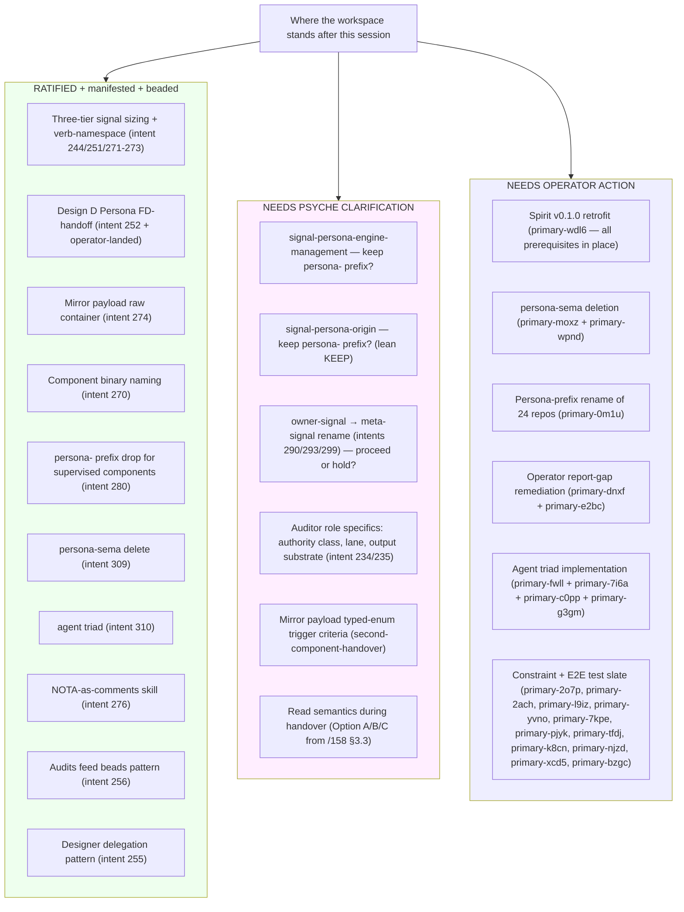
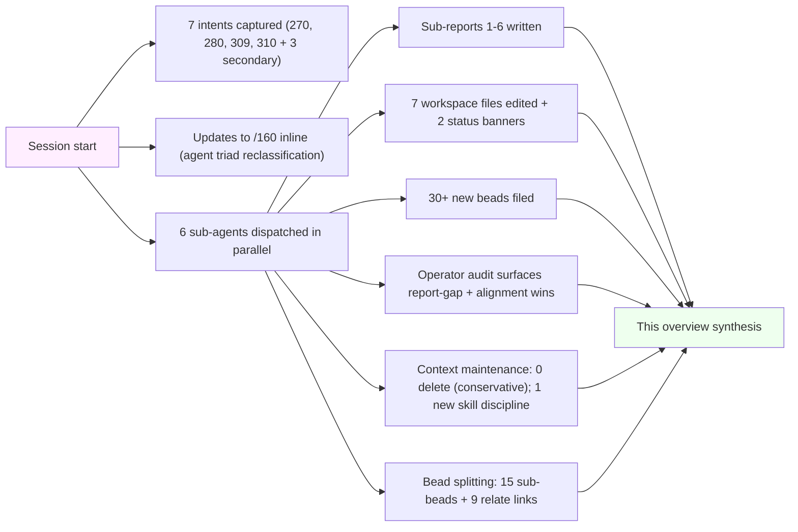

*Kind: Meta-report synthesis · Topic: design cascade + context sweep · Date: 2026-05-23*

# 7 — Overview

## TL;DR

Six sub-agents ran in parallel; all returned. Five intent records
manifested (270, 280, 309, 310 + cross-cutting refs to 244/251/271-276),
36 new beads filed across the session (15 splits + 5 agent triad +
6 audit + 6 manifestation + 1 persona-sema delete + 3 prior =
30 net new — plus 6 from concurrent agents = 164 open total). Six
substantive workspace file edits (skills + orchestrate AGENTS.md +
status banners on /153 + /155). Two surprises:

1. **Operator report-gap is large** — 30+ substantive operator commits
   since `/163` (full day's work) with ZERO matching operator
   reports. Bead `primary-dnxf` filed to remediate; `primary-e2bc`
   (filed earlier) covers a narrower subset.

2. **Operator beat the audit on several alignments**: Design D
   FD-handoff end-to-end LANDED (closes `primary-ezzp` /
   `primary-x5ba` / `primary-ak4g`); Spirit handover through
   persona-daemon WITNESSED; spirit-per-engine wiring closes
   `primary-1cl1`; auth → origin rename FULLY complete; `signal_cli!`
   macro adoption; `signal-persona` split per intent 307; systemd
   `UnitController` trait + transient unit + handover wiring.

Plus: persona-sema confirmed nothing-to-absorb; agent triad designed
+ beaded (replaces persona-llm-client); context-maintenance sweep
landed status banners + a new skill discipline (design-rationale
guard against premature DELETE).

## §1 Sub-agent results table

| # | Slice | Sub-report | Key outputs |
|---|---|---|---|
| 0 | Frame + method | `0-frame-and-method.md` | session contract |
| 1 | Agent triad design (intent 310) | `1-agent-triad-design.md` | 5 beads: `primary-fwll` (signal-agent), `primary-7i6a` (owner-signal-agent), `primary-24as` (CLOSED dup of 7i6a), `primary-c0pp` (mind integration design), `primary-g3gm` (workspace cascade). Triad shape: agent CLI + agent-daemon + signal-agent + owner-signal-agent. Worked example: spirit-daemon classifies intent kind via agent.Think |
| 2 | persona-sema audit + delete plan (intent 309) | `2-persona-sema-audit-and-delete-plan.md` | 1 bead: `primary-moxz` (delete repo + clean 2 primary doc refs). Audit verdict: nothing to absorb. Repo's own docs already declare it retired 2026-05-11. Zero live cargo/flake deps. persona-mind has an enforcement test preventing re-introduction. |
| 3 | Context maintenance sweep | `3-context-maintenance-sweep.md` | 0 deletes, 2 status banners (`/153`, `/155`), 1 skill update (`skills/context-maintenance.md` new §3a "Design-rationale guard against premature DELETE"), 1 bead `primary-dxdk` (cross-lane sweep gated on `/157` slate closing). Conservative defaults blocked all DELETE candidates. |
| 4 | Operator audit vs current design | `4-operator-audit-against-current-design.md` | 6 beads: `primary-njzd` (constraint test engine-management socket), `primary-xcd5` (E2E two-version Design D), `primary-bzgc` (E2E split-repo binding), `primary-8jpa` (persona-pi Nix-store hiding), `primary-wpnd` (persona-sema deletion execution), `primary-dnxf` (operator report-gap addendum). Surfaced: 30+ commits since `/163` with zero reports. |
| 5 | Intent manifestation gap audit | `5-intent-manifestation-gap-audit.md` | 6 beads + 1 closed: `primary-hpj9` (active-registry intent 211), `primary-54ti` (horizon-rs migration intent 303, P1), `primary-gtao` (pi-operator dirty-repo intent 306, P1), `primary-ep45` (persona signal repos rearrange intent 307), `primary-pibt` (persona-pi Nix packaging intent 305), `primary-rtz8` (owner-signal-agent — was missing from /161/1 slate), `primary-24as` CLOSED as dup. Plus 7 workspace file edits across `orchestrate/AGENTS.md`, `skills/feature-development.md`, `skills/autonomous-agent.md`, `skills/system-specialist.md`, `skills/reporting.md`, `skills/designer.md`, `skills/component-triad.md`. Coverage: 73 records MANIFESTED / 3 PARTIAL / 1 NOT YET / 8 no manifestation needed. |
| 6 | Bead splitting sweep | `6-bead-splitting-sweep.md` | 15 new sub-beads filed: `primary-u8vo` → 11 sub-beads (.0-.10); `primary-u0lh` → 2; `primary-kbmi` → 2. Plus 9 bidirectional relate links on `primary-4naq` ↔ component triad-migration beads. 5 beads recommended-only (not split). Open-bead count: 141 → 164. |
| 7 | This overview | `7-overview.md` | synthesis + clarity needs + visuals |

## §2 Meta-graph — what landed where

```mermaid
flowchart TB
    subgraph Intent["Intent records (this session + cross-cutting)"]
        I270["270 binary naming"]
        I280["280 drop persona- prefix"]
        I309["309 delete persona-sema"]
        I310["310 rename → agent triad"]
        I211["211 active-registry retire+reuse"]
        I303["303 horizon-rs migration"]
        I305["305 persona-pi Nix"]
        I306["306 pi-operator dirty-repo"]
        I307["307 persona signal repos rearrange"]
    end

    subgraph WorkspaceFiles["Workspace files edited this session"]
        WF1["skills/context-maintenance.md §3a"]
        WF2["orchestrate/AGENTS.md system-assistant→system-designer"]
        WF3["skills/feature-development.md"]
        WF4["skills/autonomous-agent.md"]
        WF5["skills/system-specialist.md"]
        WF6["skills/reporting.md pre-launch lane allocation"]
        WF7["skills/designer.md parallel manifestation pattern"]
        WF8["skills/component-triad.md owner→meta footnote"]
        WF9["/153 status banner"]
        WF10["/155 status banner"]
        WF11["/160 §2 + §7 updates (agent triad reclassification)"]
    end

    subgraph BeadsNew["Beads filed this session"]
        BN1["primary-fwll signal-agent"]
        BN2["primary-7i6a owner-signal-agent"]
        BN3["primary-c0pp agent-mind integration"]
        BN4["primary-g3gm agent cascade replace"]
        BN5["primary-moxz persona-sema delete"]
        BN6["primary-dxdk cross-lane sweep gate"]
        BN7["primary-njzd engine-mgmt socket constraint"]
        BN8["primary-xcd5 E2E two-version Design D"]
        BN9["primary-bzgc E2E split-repo binding"]
        BN10["primary-8jpa Pi Nix-store hiding"]
        BN11["primary-wpnd persona-sema delete execution"]
        BN12["primary-dnxf operator report-gap addendum"]
        BN13["primary-hpj9 active-registry semantics"]
        BN14["primary-54ti horizon-rs migration"]
        BN15["primary-gtao pi-operator dirty-repo"]
        BN16["primary-ep45 persona signal repos rearrange"]
        BN17["primary-pibt persona-pi Nix packaging"]
        BN18["primary-rtz8 owner-signal-agent (missing fix)"]
        BN_SPLITS["15 split sub-beads: u8vo.0-.10, u0lh.1+.2, kbmi.1+.2"]
    end

    I309 --> BN5
    I309 --> BN11
    I310 --> BN1
    I310 --> BN2
    I310 --> BN3
    I310 --> BN4
    I310 --> BN18
    I211 --> BN13
    I303 --> BN14
    I305 --> BN10
    I305 --> BN17
    I306 --> BN15
    I307 --> BN16

    I280 -.-> WF11
    I280 -.-> WF8

    style Intent fill:#fef
    style WorkspaceFiles fill:#efe
    style BeadsNew fill:#eef
```

## §3 Cross-cutting findings

### §3.1 Operator report-gap is the standout issue

Sub-agent D's audit: 30+ substantive operator commits across 8 repos
in 24 hours since the last operator report (`/163` dated 2026-05-22).
Two new repos created (`signal-persona-engine-management`,
`owner-signal-persona`, `persona-pi`); `signal-persona` split into a
retired shim + 2 new repos per intent 307; Design D + handover
witnesses + auth → origin rename + `signal_cli!` macro all landed.

`primary-dnxf` (operator report-gap addendum covering 30+ commits)
extends the narrower `primary-e2bc` (filed earlier for 3 commits).
The bead lists what each missing operator report should contain.

Per intent 232 "every chat response paraphrases a report" — the
operator side has accumulated significant report debt. Designer has
to reconstruct operator work from `jj log` rather than from reports,
which costs designer cycles.

### §3.2 Parallel sub-agent coordination — two coordination data points

1. **Duplicate bead filing**: sub-agent A filed `primary-24as` (agent
   daemon + CLI scaffolding) without seeing that sub-agent E would
   later file the same scope as a missing-from-slate addition.
   Sub-agent E caught the duplication and closed `primary-24as` per
   intent 229. Pattern: parallel sub-agents working from the same
   intent (310) but slightly different angles can produce duplicates;
   later-running sub-agent catching duplicates and reconciling works.

2. **Divergent jj working-copy state** (sub-agent D's process note):
   simultaneous orchestrator-spawned sub-agents touching the same
   primary repo can produce divergent change-id states requiring
   manual reconciliation. Worth flagging to `skills/feature-development.md`
   §"Subagent feature work" as a known coordination cost.

### §3.3 persona-llm-client → agent reclassification

Sub-agent A surfaced and sub-agent E confirmed: `/160` §2 originally
placed `persona-llm-client` in the KEEPS bucket (read as "wrapper").
Intent 310 reclassifies it as a SUPERVISED triad component →
RENAMES to `agent` (drops persona- prefix). `/160` §2 + §7 updated
inline this session to reflect.

Net effect: the agent triad creation is a NEW component
(persona-llm-client doesn't exist as code; the rename is a
naming-only event for the bead/design surface).

## §4 Open clarity needs (next-clarification-needs visual)

The clarity-need-pyramid: psyche side has shrunk to 6 items (5
naming/scope refinements + 1 strategic auditor); operator side has
expanded to a dense, distributable bead graph that can run in
parallel.

## §5 What's been achieved (this session)

## §6 Bead state summary

Workspace open-bead count: ~141 at session start → 164 at session
end (15 from sub-agent F splits + 16 from sub-agents A/B/C/D/E + 8
from concurrent agents − 1 closed dup `primary-24as`).

The bead state is now:
- **P1 critical-path**: cutover blockers (`primary-wehu` CLOSED;
  `primary-x3ci` Spirit cutover; `primary-wdl6` v0.1.0 retrofit
  with all prereqs in place; `primary-a5hu` Persona engine epic;
  `primary-0m1u` 24-repo rename)
- **P1 newly-actionable**: `primary-54ti` horizon-rs migration,
  `primary-gtao` pi-operator dirty-repo
- **P2 spread across constraint + integration + new component work**
- **P3 housekeeping**: persona-sema delete, cross-lane sweep gate,
  Identity blanket impl, auditor MVP follow-up

Operator's ready-queue (what `bd ready` would surface for them):
substantial. Distribution-shaped per intent 308 (smaller bead jobs).

## §7 See also

Within this directory:
- `0-frame-and-method.md` — frame + sub-agent contract
- `1-agent-triad-design.md` — agent triad design (intent 310)
- `2-persona-sema-audit-and-delete-plan.md` — audit + delete plan (intent 309)
- `3-context-maintenance-sweep.md` — report sweep + new skill discipline
- `4-operator-audit-against-current-design.md` — operator alignment audit
- `5-intent-manifestation-gap-audit.md` — intent coverage table + manifestations
- `6-bead-splitting-sweep.md` — bead hygiene + 15 splits filed

Outside:
- `reports/second-designer/162-contract-repo-lens-and-consolidation/3-consolidated-persona-engine-overview.md` — consolidated successor to `/152` (deleted 2026-05-23 per intent 362)
- `reports/second-designer/162-contract-repo-lens-and-consolidation/4b-consolidated-current-status.md` — prior audit + open-question resolution map (consolidates the former `/157` + `/158`)
- `reports/second-designer/159-intent-manifestation/` — prior meta-directory
- `reports/second-designer/160-persona-prefix-removal-coordinated-rename-2026-05-23.md` — 24-repo rename plan (§2 + §7 updated this session)
- `reports/designer/302-audit-recent-operator-work-2026-05-23.md` — primary operator audit
- Spirit records 211-310 (this session's intent layer)
- Beads: 30+ new this session per §1 + §6
