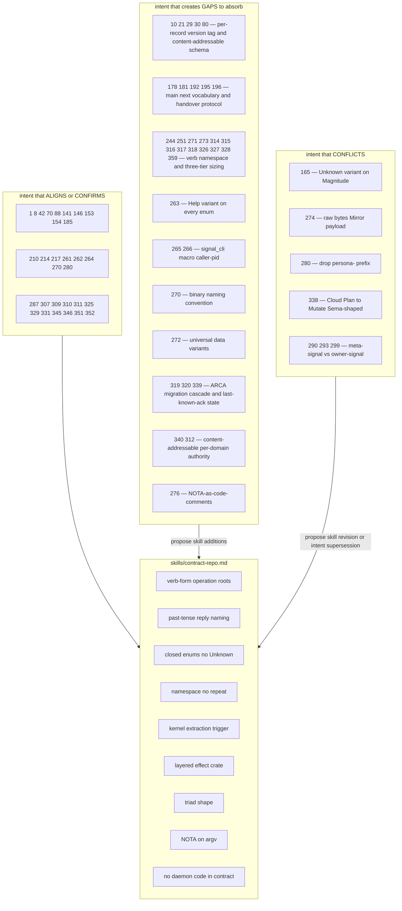

*Kind: Audit · Topic: intent records vs contract-repo · Date: 2026-05-23*

# 1 — Intent records audit through the contract-repo lens

## What this slice is

Sub-agent A slice of meta-report `/162`. Audits the 361 captured
Spirit intent records against `skills/contract-repo.md`, with
primary focus on records 200-310 (the recent contract-shape /
naming / signal-tree wave) and a lighter scan over records 1-199
for foundational shape decisions.

Three verdict classes:

- **ALIGNS** — intent confirms or extends contract-repo discipline.
- **CONFIRMS** — intent EXPLICITLY restates a contract-repo rule
  (worth flagging — either redundant or load-bearing capture).
- **CONFLICTS** — intent crosses a contract-repo rule and needs
  resolution (revise intent OR update the skill).
- **GAP-CREATING** — intent introduces a rule NOT covered by
  contract-repo.md, worth adding to the skill.
- **N/A** — intent does not touch contract shape.

## Method

For every intent record that touches signal contracts, wire shape,
naming, or component triads, I read the summary + context and
checked against:

1. Verb-form operation roots / past-tense reply naming.
2. Closed-enum payload discipline (no `Unknown`, no string kinds).
3. Namespace-no-repeat rule (no `PersonaMessage` inside
   `signal-persona-message`).
4. Contract repos do NOT own daemon code, runtime, validation,
   routing, configuration, serde.
5. Layered effect crate pattern over base contract.
6. Kernel extraction trigger (two domains share the kernel).
7. Examples-first round-trip discipline.
8. Domain-noun payloads, verb-form operation roots.
9. Naming hierarchy `signal-<consumer>` vs `<project>-signal`.
10. Reply causally tied to request (no event smuggling).

I then compiled the four verdict buckets and proposed concrete
follow-ups (skill additions, intent supersessions, beads).

## Audit table

Records touching contract shape (selected — many records like
intent-log, persona-pi setup, lane management are intentionally
N/A for this lens).

| Record | Topic / Kind | One-line summary | Verdict | Notes |
|---|---|---|---|---|
| 1 | component-shape Principle | CLIs are thin Signal clients | ALIGNS | Matches contract-repo §"CLI ↔ daemon: NOTA on argv/stdin". |
| 8 | signal Clarification | "Signal" noun is ambiguous (binary frames vs name) | CONFIRMS | Skill already disambiguates via "Signaling" verb (§ top). |
| 10 | component-shape Decision | Schema migration is workspace-wide for persona daemons | GAP-CREATING | Skill mentions versioning but not the workspace's actual migration strategy. |
| 12 | signal Decision | Signal schemas documented as a class + schema-in-NOTA proposal | ALIGNS | Matches the "contract owns wire AND text form on the same type" rule. |
| 21 | component-shape Decision | In-process versioned reads with schema-version tag per record | GAP-CREATING | Skill discusses version-skew guard but not per-record version tags / in-process migration. |
| 28 | signal Correction | NOTA positional rule governs text only; rkyv has headroom | ALIGNS | Reinforces "contract owns both wire (rkyv) AND text (NOTA) form". |
| 29 | signal Decision | Content-addressable schema-layout schemas; per-kind change classification | GAP-CREATING | Skill version-skew guard is coarse; this is a richer migration story. |
| 30 | signal Principle | rkyv natural-headroom enables zero-cost schema changes | GAP-CREATING | Not in skill — affects what "version bump" means concretely. |
| 42 | signal Principle | No tuples in workspace's Rust subset | ALIGNS | Matches contract-repo's typed-record discipline. |
| 70 | component-shape Decision | Universal Magnitude (7 variants) replaces per-component Certainty enums | ALIGNS | Matches "closed enums + shared types in kernel" pattern. |
| 80 | schema Principle | Contract schemas as explicit content-addressable layout schemas | GAP-CREATING | Skill carries semver-as-wire; this proposes content-address-as-version. |
| 88 | signal-core Decision | signal-core owns shared seven-level magnitude | ALIGNS | Matches kernel-extraction principle (shared types belong in kernel). |
| 97 | persona Decision | discipline (role) field in lane registry is open string (not closed enum) | CONFLICTS-PARTIAL | Skill says no string-typed kinds for lifecycle uncertainty; but this is registry data not lifecycle. Worth a skill clarification. |
| 98 | persona Decision | Role vectors of identifier tokens (NOTA vector form) | ALIGNS | Matches NOTA positional shape. |
| 124 | persona Principle | Not all "agent" calls are agents — distinguishes runtime fns vs persistent agents | ALIGNS | Naming-discipline aligned (don't overload "agent"). |
| 141 | spirit Constraint | spirit CLI is one inline NOTA call | CONFIRMS | Matches contract-repo §"NOTA on argv/stdin" and the single-argument rule. |
| 146 | component-shape Decision | ItemPriority collapses onto signal_sema::Magnitude | ALIGNS | Confirms kernel-extraction (shared types live in shared crate). |
| 153 | signal Decision | Deploy operation moves from signal-forge to signal-lojix | ALIGNS | Matches layered-effect-crate pattern — operations land in the right scoped layer. |
| 154 | signal Decision | forge daemon stays as executor; forge-nix-builder is a library underneath | ALIGNS | Matches "contract crate does not own daemon code" — clean separation. |
| 160 | signal Decision | signal-real-time as new signal capability | GAP-CREATING | Skill's "what goes in a contract repo" doesn't yet name streaming/realtime concerns. |
| 161 | signal Clarification | Signal Core can still exist as a concept | ALIGNS | Skill kernel-extraction story is consistent. |
| 162 | signal Decision | Signal real-time is Signal not Sema; storage format open | ALIGNS | Doesn't contradict skill. |
| 165 | component-shape Decision | Add `Unknown` variant to signal_sema::Magnitude | **CONFLICTS** | **Skill explicitly says "no `Unknown` variant".** Major flag. See §Conflicts. |
| 178 | component-shape Decision | Multi-version dispatch: CLI sends to next daemon, next coordinates with main | GAP-CREATING | Skill version story doesn't cover this dispatch protocol. |
| 181 | component-shape Decision | Canonical version-pair vocabulary is main / next | GAP-CREATING | Skill says "coordinated upgrade" but not the main/next vocab. |
| 185 | signal Clarification | Per-repo data-type discipline (signal-X repos with versioned libs) | CONFIRMS | Matches "Contracts name a component's wire surface" §. |
| 188-198 | component-shape | Migration trait / version-handover / atomic socket handover | GAP-CREATING | Whole class of intents formalises a migration protocol the skill barely sketches. |
| 199 | component-shape Decision | Engine-manager Axis 2 rename | ALIGNS | Naming-discipline aligned (full English, no overlap). |
| 210 | component-shape Decision | Upgrade orders come through OWNER socket | ALIGNS | Matches owner-vs-public socket discipline (also referenced by 311). |
| 214 | signal Decision | Create owner-signal-version-handover with force-flip / rollback / quarantine | ALIGNS | Matches layered effect crate pattern + owner-socket discipline. |
| 217 | component-migration Decision | Port stale components to current foundations | ALIGNS | Trivial: re-affirms the discipline. |
| 244, 251, 271, 314, 323, 326, 327, 328, 359 | signal Decisions | Three-tier signal sizing + 64-bit micro header + golden-ratio namespace split + per-channel byte-0 verb namespace + signal_channel! macro | GAP-CREATING (cluster) | This whole cluster invents a new layered macro discipline that the contract-repo skill does not yet describe. See §Gaps. |
| 259, 261, 262, 264, 269, 277, 278 | naming | Identifier renames; signal-persona-auth → signal-persona-origin; auth-as-misnomer | ALIGNS | All match the naming-discipline §. Several are CONFIRMS — they restate naming-no-repeat / full-English-words. |
| 263 | component-shape Decision | (Help Main) + (Help Verb) on every component | GAP-CREATING | New verb-root that every contract supports — skill does not list `Help` among standard verbs. |
| 265, 266 | component-shape Decision | signal_cli! macro auto-injects caller pid via persona-origin into frame envelope | GAP-CREATING | Skill describes Frame envelope conceptually but doesn't list caller-pid auto-injection. |
| 267, 268 | component-shape Decision | Approve signal_cli! design; decompose CLI migration sweep | ALIGNS | Operator-disposition records; nothing schema-affecting. |
| 270 | component-shape Clarification | Component binary naming: `<name>` (CLI) + `<name>-daemon` (daemon) | GAP-CREATING | **Not in skill.** Skill talks about contract crate naming but not binary naming. See §Gaps. |
| 271 | signal Decision | Byte 0 = root verb; bytes 1-7 = data-carrying sub-variants; 1+7 enum shape | GAP-CREATING | New macro discipline. See §Gaps. |
| 272 | signal Decision | Universal data variants (U8, U16) pre-allocated across all signal namespaces | ALIGNS | Matches kernel-extraction (shared primitives live in kernel). |
| 273 | signal Decision | 512-byte / 64-byte extended signal type tier | ALIGNS | Refines the three-tier sizing of /244. |
| 274 | signal Clarification | Mirror payload (signal-version-handover) is raw bytes in SEPARATE container | **CONFLICTS-PARTIAL** | Skill mandates closed-enum typed payloads; raw-bytes-in-separate-container is a sanctioned escape. See §Conflicts. |
| 275 | persona-mind Decision | persona-mind ships error patterns through agent guidance | N/A | Not a contract concern. |
| 276 | workspace Decision | Code comments use NOTA-formatted signal records | ALIGNS | Extends "contract owns text codec" outward — comment-as-NOTA matches the workspace's one-text-syntax discipline. |
| 280 | component-shape Decision | Drop persona- prefix from supervised persona components | **CONFLICTS-MAJOR-WITH-IMPLICATIONS** | Skill's naming hierarchy says `signal-<consumer>` (consumer prefix). With `signal-persona-spirit` → `signal-spirit`, the consumer-prefix shape weakens. See §Conflicts. |
| 285, 297 | domain Decision | domain-criome name + scope | ALIGNS | Naming discipline. |
| 287 | component-shape Principle | cloud/domain follow triad signal sema executor shape | CONFIRMS | Matches contract-repo + component-triad shape. |
| 290, 293, 299 | component-shape / component-triad | meta-signal preferred over owner-signal as policy contract name | GAP-CREATING (deferred) | If/when this lands, skill needs to be revised. See §Gaps. |
| 298 | component-shape Decision | Future component work uses latest Signal/Sema/executor architecture | ALIGNS | Re-affirms triad. |
| 307 | signal Decision | Persona signal repositories rearrange by socket authority | ALIGNS | Matches owner-vs-public socket discipline + layered-effect-crate pattern. |
| 309 | component-shape Decision | Delete persona-sema repo (older design phase) | ALIGNS | Matches "contract crate doesn't own database crate per component" — kernel-shared types instead. |
| 310 | component-shape Decision | Rename persona-llm-client to `agent` (own triad: agent + agent-daemon + signal-agent + owner-signal-agent) | ALIGNS | Triad shape matches skill exactly. |
| 311 | component-shape Decision | Cloud component splits Mutate verbs onto meta-signal-cloud, Query onto signal-cloud | ALIGNS | Owner/public socket discipline + verb-root discipline. |
| 312, 340 | domain Decision | Per-domain authority (content-addressable); cached resolution | ALIGNS | Doesn't conflict with contract-repo. |
| 315, 316, 317, 318 | signal Decisions | 64-bit namespace partitioned into SignalCore (system) + component zones; SignalCore primitives (Criome identity, Sub-ID) | GAP-CREATING | Concrete content for kernel-extraction. See §Gaps. |
| 319 | component-shape Principle | ARCA performs migration on format change | GAP-CREATING | New cascade discipline. |
| 320 | workspace Decision | Major engine version upgrades atomic, no-downtime | ALIGNS | Matches "Versioning is the wire" §coordinated upgrade. |
| 325 | cloud Decision | Cloud plan preparation belongs on owner signal surface | ALIGNS | Owner-vs-public socket discipline. |
| 326 | signal Correction | 64-bit root-verb namespace is PER-COMPONENT not workspace-wide; provenance keys decoder | GAP-CREATING | Important correction. Skill kernel-extraction story uses workspace-wide shared types; per-component byte-0 namespace is a new layer. |
| 327 | signal Decision | Byte-0 namespace splits by golden ratio; owner contract gets small section, public gets big; compile-time enforcement | GAP-CREATING | New signal_channel! macro discipline. |
| 328 | signal Decision | Every message prefixed with 64-bit Tier 1 micro type marker; tap-anywhere observability | GAP-CREATING | New macro discipline. |
| 329, 331 | persona Decisions | Agent is new component abstraction; persona-claude/codex/gemini/pi are BACKENDS for agent | ALIGNS | Layered shape — agent component has typed pluggable backends. |
| 338 | component-shape Decision | Cloud Plan operation renames to Mutate; reply is Mutated | **CONFLICTS-PARTIAL** | Mutate is from the Sema universal-roots vocabulary (Assert/Mutate/Retract/Match). Skill says public contract operations should NOT use Sema roots unless contract is Sema-facing. See §Conflicts. |
| 339 | criome Principle | Component state is last-known-acknowledgment not live-query | GAP-CREATING | State-shape principle the contract-repo skill should reference. |
| 345 | domain-criome Constraint | Registered-but-undelegated names must have typed NoRecords result | ALIGNS | Closed-enum discipline + "no string-typed kinds for lifecycle uncertainty". |
| 346, 352 | domain-criome Constraint | Keep domain-criome contract vocabulary provider-neutral and record-only | CONFIRMS | Matches "Contract repos do not own ... configuration, ... serde" + "domain-noun payloads". |
| 351 | signal Constraint | Per-operation request replies should not repeat operation kind | CONFIRMS | Matches namespace-no-repeat rule directly — but with a sharper restatement: replies inherit causal context from request, so the reply variant should NOT echo operation name. |
| 359 | signal Decision | signal_channel! macro standardizes Tier 1 header, two-enum-namespace, recursive Help variants | GAP-CREATING | New macro discipline. |

## Conflicts found

Five records cross contract-repo discipline. Each needs a
resolution: either revise the intent (orchestrator captures the
supersession; sub-agent flags) or update the skill to absorb the
new direction.

### Conflict 1 — Record 165: `Unknown` variant on Magnitude

The skill's "What it owns" §:

> Per-operation typed payloads (closed enums of typed kinds — no
> generic record wrapper, no `Unknown` variant).

Record 165 explicitly adds an `Unknown` variant to
`signal_sema::Magnitude` for indeterminate Health/Readiness.

**Verdict:** the SKILL needs revising. `Unknown` is being added
not as a forward-compat escape hatch (the skill's actual concern)
but as a genuine domain value — "indeterminate" is a legitimate
state for health/readiness, not a polling-shaped fallback. The
skill's blanket "no `Unknown`" rule misses this case.

**Recommended skill amendment:** distinguish "no `Unknown` as a
forward-compat escape hatch / open-enum fallback" (still
forbidden) from "domain-valid indeterminate / not-yet-measured
state" (allowed, but the variant must be named explicitly and
domain-justified). The current Magnitude case satisfies the
second: indeterminate is a legitimate fact about the data.

Bead recommendation: file a P3 bead for skill update — "amend
contract-repo.md §`Unknown` rule to permit domain-valid
indeterminate variants per intent 165".

### Conflict 2 — Record 274: raw-bytes Mirror payload

The skill's "Per-operation typed payloads" rule and
"closed enums of typed kinds — no generic record wrapper" stance
implies all payloads are typed.

Record 274: Mirror payload (signal-version-handover) is raw
bytes stored in a SEPARATE container outside the typed database.

**Verdict-partial:** this is a sanctioned escape for the
specific version-handover case where the new daemon hasn't
finished schema-derivation. The typed database stays clean — raw
goes to a special raw-binary container. So the skill IS still
respected (typed database has no raw bytes), and the escape is
explicit + bounded.

**Recommended skill amendment:** add a §"Raw-bytes escape
hatch" describing version-handover Mirror payload as the
canonical example of when raw bytes are allowed AND how they're
kept out of the typed surface.

Bead recommendation: file a P3 bead — "amend contract-repo.md to
document raw-bytes escape hatch per intent 274".

### Conflict 3 — Record 280: drop `persona-` prefix consequences for naming hierarchy

Skill §"Naming a contract repo" gives this hierarchy:

- `signal-<consumer>` — layered effect crate (consumer prefix)
- `<project>-signal` — independent base contract
- `<project>-protocol` / `-contract` / `-wire` — non-signal-family

Record 280 drops `persona-` from supervised persona components.
Cascade: `signal-persona-spirit` → `signal-spirit`,
`signal-persona-mind` → `signal-mind`, etc.

**Verdict:** the SKILL needs revising. The new shape STILL fits
the `signal-<consumer>` template — but the "consumer" is no
longer hierarchical (the persona-system is the supervision shape,
not a name shape). After the rename, `signal-spirit` reads as
"signal scoped to spirit (consumer)" exactly as the rule says.
The persona supervision is structural metadata, not part of the
crate name. So the rename respects the discipline; it just makes
clear that hierarchical-namespace-as-prefix is wrong when the
hierarchy is supervision-shaped, not naming-shaped.

**Recommended skill amendment:** add a §"Supervision is not
namespace" clarifying that a supervisor-supervised relationship
does NOT enter the crate name; only the consumer name does.
Reference intent 280.

Bead recommendation: file a P3 bead — "amend contract-repo.md
naming-hierarchy to clarify supervision-is-not-namespace per
intent 280".

### Conflict 4 — Record 290/293/299: meta-signal vs owner-signal

Skill currently says `signal-<consumer>` is one shape and
references owner-signal-X via the component-triad skill (not
internally). Record 290 prefers `meta-signal-<X>` over
`owner-signal-<X>`. Record 293 says owner-signal stays the active
naming until an explicit rename lands. Record 299 reaffirms
meta-signal is tentative.

**Verdict:** no conflict YET — the discipline is "owner-signal
stays current". Once meta-signal lands as Decision-Maximum, both
contract-repo.md AND component-triad.md need a coordinated
update. Track as a watch-item.

Bead recommendation: defer. File only when intent escalates to
Maximum.

### Conflict 5 — Record 338: Cloud Plan → Mutate

Skill §"Public contracts use contract-local operation verbs":

> A component may expose Sema-shaped operations on a specialized
> socket when that is the actual public service it offers. Most
> component contracts should not.

Record 338 renames Cloud's `Plan` operation to `Mutate`. `Mutate`
is one of the Sema universal-roots vocabulary (Assert/Mutate/
Retract/Match/Subscribe/Validate).

**Verdict:** the intent 338 frames Cloud as a state-reflecting
component where Sema-shaped operations are the natural public
service — the daemon literally reflects external state
("Cloudflare is a state the cloud daemon reflects"). So Cloud is
a sanctioned Sema-facing contract per the skill's "Most
component contracts should not" carve-out.

But the rename is non-trivial: the skill should ANNOTATE the
case more explicitly. Plus per /311, Cloud splits into
`meta-signal-cloud` (Mutate verbs) and `signal-cloud` (Query
verbs) — this means owner contract = Mutate-only,
public/ordinary = Query-only — a CLEANER split than most
components have.

**Recommended skill amendment:** add a worked example pointing
at the Cloud component as the canonical Sema-shaped public
contract — owner gets Mutate (the privileged write-back to
external state), public gets Query (the read-side). The
Sema-vocabulary carve-out in the skill is currently abstract;
Cloud makes it concrete.

Bead recommendation: file a P3 bead — "add Cloud worked example
to contract-repo.md §Sema-shaped exceptions per intents 311 + 338".

## Gaps to add to skills/contract-repo.md

The following rules are implied by recent intent but are NOT
currently captured in the skill. Each is a candidate skill
addition with intent citation.

1. **Component binary naming convention (intent 270).**
   Each component has a CLI and a daemon, named `<component>`
   and `<component>-daemon`. The component name (e.g. `persona`,
   `spirit`, `harness`) names the role; binaries are always
   `<name>` and `<name>-daemon`. Persona disambiguation suffix
   only on wrappers (`persona-codex`, `persona-pi`). Currently
   in component-triad.md? Should be cross-referenced from
   contract-repo.md or absorbed.

2. **Verb-namespace structure for signal types (intents 244,
   251, 271, 314, 315, 326, 327, 328, 359).** The 64-bit Tier 1
   micro header carries:
   - byte 0 = per-component root verb namespace (256 verbs max,
     split golden-ratio between owner and public)
   - bytes 1-7 = data-carrying sub-variants
   - 1 root + 7 sub enum shape
   - signal_channel! macro embeds this header by default
   - compile-time check on owner-vs-public namespace split

3. **Universal Help variant on every enum (intents 263, 359).**
   `(Help Main)` and `(Help (Verb name))` operations on every
   component; the signal_channel! macro auto-wires Help via Rust
   doc comments. Every enum (not just top-level Operation) carries
   a Help variant.

4. **Three-tier signal type sizing (intents 244, 251, 273).**
   - Tier 1: 64-bit micro (default auto-loggable, macro-generated)
   - Tier 2: 64-byte / 512-byte summary (hand-implemented when
     natural summary fields exist)
   - Tier 3: full unrestricted rkyv record (current shape)
   - Variant always at the root.

5. **signal_cli! macro auto-injects caller pid into Frame
   envelope (intents 265, 266).** Caller field lives in
   signal-frame envelope so every contract gets it free; CLI
   writing reduces to one macro invocation.

6. **SignalCore is the system-types zone (intents 316, 317, 318).**
   Concrete content for kernel extraction:
   - SignalCore primitives (Criome identity, Sub-ID, U8, U16)
   - per-component zones contribute component-specific types
   - the partition split is itself versioned (repartition = major
     bump)

7. **Universal data variants pre-allocated across namespaces
   (intent 272).** U8, U16, similar small primitives live as
   sub-variants in bytes 1-7 across every namespace.

8. **Per-record schema-version tag + content-addressable
   schema-layout schema (intents 21, 29, 30, 80).** Each stored
   record carries a schema-version tag; the daemon dispatches
   read-side on the tag; the schema-layout schema's hash IS the
   version; migration operations derive from schema diffs. rkyv
   storage headroom enables zero-cost variant additions.

9. **Multi-version handover protocol (intents 178, 181, 192,
   195, 196).** Vocabulary: main / next. Atomic handover. Owner
   socket carries upgrade orders.
   `SubscribePolicy::TerminateAtHandover` default. Force-flip /
   rollback / quarantine on owner-signal-version-handover.

10. **Owner socket = privileged Mutate; public socket = Query
    (intents 311, 325, 327, 210).** Cloud is canonical example.
    Generalises to any reflected-external-state component.

11. **State across Criome stack is last-known-acknowledgment
    not live-query (intent 339).** Pairs with content-addressed
    per-domain authority (intent 312, 340). External non-Criome
    systems break this until they speak the protocol.

12. **Sema-vocabulary carve-out: Cloud as worked example
    (intents 311, 338).** Cloud is the canonical case for a
    public contract using Sema-shaped operations (Mutate, Query)
    because it reflects external state.

13. **Per-operation replies do NOT repeat operation kind
    (intent 351).** Reply variants inherit causal context from
    the request. Strengthens namespace-no-repeat with a
    specifically reply-shaped instance.

14. **NoRecords typed result for registered-but-undelegated
    (intent 345).** Generalises to: any "valid request, no
    matching data" must surface as a typed `NoX` variant, not as
    a successful-empty.

15. **Code comments use NOTA-formatted signal records (intent
    276).** Extends "one text syntax" outward — comment text IS
    NOTA-encoded signal records; mind can read code-as-signal
    directly.

## Confirmations

Records that solidly align with contract-repo discipline (these
validate the skill and are worth flagging as "the skill captured
the right rule"):

- **1, 141:** CLIs are thin Signal clients (matches §"CLI ↔
  daemon" boundary). Spirit CLI = one inline NOTA call.
- **8:** "signal" noun ambiguity (skill disambiguates via
  "signaling" verb).
- **42:** No tuples in workspace's Rust subset.
- **70, 88, 146, 272:** Shared types (Magnitude, primitives)
  live in shared crate — kernel-extraction discipline.
- **153, 154, 214:** Layered effect crate pattern — operations
  land in the right scoped layer (`signal-lojix`,
  `owner-signal-version-handover`).
- **185, 287:** Per-repo data-type discipline matches "contract
  crate names a component's wire surface".
- **210, 307, 311, 325:** Owner socket = privileged; public =
  ordinary. Components rearrange by socket authority.
- **261, 262, 264:** Naming discipline (full English Identifier;
  auth-as-misnomer renamed to origin).
- **270, 280:** Component naming + drop persona- prefix from
  supervised components. The new shape RESPECTS the skill's
  consumer-prefix rule — it just shows that supervision is not
  namespace.
- **309:** Delete persona-sema (no separate db crate per
  component) — matches kernel-shared types discipline.
- **310:** New `agent` component IS a proper triad (agent +
  agent-daemon + signal-agent + owner-signal-agent).
- **329, 331:** agent abstraction layered over pluggable
  backends — matches layered shape.
- **345, 346, 352:** Domain-criome contracts: typed NoRecords,
  provider-neutral, record-only.
- **351:** Per-operation replies don't repeat operation kind
  (namespace-no-repeat applied to replies).

The skill's central rules are well-anchored in intent.

## Diagram

## Bead recommendations

Filed as concrete operator-actionable items per skills/beads
discipline. All scoped to skill-edit work (P3).

1. **Skill update: amend `Unknown` rule per intent 165.**
   Distinguish "no `Unknown` as forward-compat escape" (still
   forbidden) from "domain-valid indeterminate variants" (allowed
   when domain-justified).

2. **Skill update: add raw-bytes escape hatch §per intent 274.**
   Document version-handover Mirror payload as the canonical raw
   container.

3. **Skill update: add supervision-is-not-namespace clarification
   per intent 280.** Clarify that the `signal-<consumer>` rule
   covers the consumer name only; supervisor-supervised
   structural relationships do NOT enter the crate name.

4. **Skill update: add Cloud worked example to Sema-shaped
   exceptions §per intents 311 + 338.** Owner gets Mutate; public
   gets Query.

5. **Skill update: add component binary naming convention per
   intent 270.** Either absorb into contract-repo.md or
   cross-reference from skills/component-triad.md if it lives
   there already.

6. **Skill update: add 64-bit Tier 1 micro header cluster per
   intents 244 + 251 + 271 + 314 + 326 + 327 + 328 + 359.**
   Per-component byte-0 root verb namespace, golden-ratio split,
   signal_channel! macro discipline.

7. **Skill update: add Help discipline per intents 263 + 359.**
   `(Help Main)` and `(Help (Verb name))` operations; every enum
   carries a Help variant.

8. **Skill update: add three-tier signal sizing per intents 244 +
   251 + 273.** Tier 1 (64-bit), Tier 2 (64-byte / 512-byte
   summary), Tier 3 (full rkyv).

9. **Skill update: add signal_cli! macro caller-pid injection per
   intents 265 + 266.** Frame envelope carries caller field;
   CLI writing is one macro invocation.

10. **Skill update: add per-record schema-version tag + content-
    addressable schema-layout schema per intents 21 + 29 + 30 +
    80.** Migration story strengthened beyond semver-as-wire.

11. **Skill update: add multi-version handover protocol per
    intents 178 + 181 + 192 + 195 + 196.** main / next vocab,
    atomic handover, owner socket.

12. **Skill update: add owner-vs-public socket discipline per
    intents 311 + 325 + 327 + 210.** Mutate on owner, Query on
    public.

13. **Skill update: add NOTA-as-code-comments per intent 276.**
    Extends "one text syntax" outward; mind can read code-as-
    signal.

14. **Skill update: add NoRecords typed-result convention per
    intent 345.** Generalises to "valid request, no matching
    data must surface as typed NoX variant".

15. **Skill update: add per-operation-replies-no-repeat per
    intent 351.** Strengthen namespace-no-repeat with reply-
    shaped instance.

16. **(Watch-item, not yet a bead) meta-signal rename per intents
    290 + 293 + 299.** When/if escalates from Minimum/Medium to
    Maximum, file paired skill update for contract-repo.md AND
    component-triad.md.

## Notes for orchestrator

- The five conflicts surface as "skill needs revision", not
  "intent needs supersession". The intent layer has the right
  direction; the skill needs to catch up.
- Several gaps are individually small but cluster into a coherent
  signal_channel! macro discipline (intents 244, 251, 271, 314,
  327, 328, 359). Worth a single dedicated §in the skill.
- No intent capture proposed (per slice contract; orchestrator
  handles).
- Most ALIGNS / CONFIRMS records are very tight against the
  skill — the discipline is well-anchored in intent.
