*Kind: Audit · Topic: ARCH + contract crates vs contract-repo discipline · Date: 2026-05-23*

# 2 — Recent ARCH commits audit through the contract-repo lens

## What this slice is

Slice 2 of `/162` (per `0-frame-and-method.md`). Audits the most
recent `ARCHITECTURE.md` content plus `src/lib.rs` of every contract
repo against `skills/contract-repo.md` — verb-form roots, verb-past
replies, namespace repetition, closed enums, no runtime in contract,
serde absence, NOTA derives, round-trip tests, examples-first, cross-
crate path deps, layered shape.

The lens is the discipline; this report names where each repo
conforms and where it drifts.

Coverage:
`signal-frame`, `signal-sema`, `signal-version-handover`,
`version-projection`, `owner-signal-version-handover`,
`signal-persona`, `signal-persona-spirit`, `signal-persona-mind`,
`signal-persona-orchestrate`, `owner-signal-persona-spirit`,
`owner-signal-persona-mind`, `signal-persona-engine-management`,
`owner-signal-persona`, `persona-pi`.

## Repo-by-repo verdict table

| Repo | Verdict | Specific issues | Bead recommendation |
|---|---|---|---|
| `signal-frame` | CONFORMS | Apex contract; verb-free at kernel layer, owns frame/handshake/identity/CLI, no runtime, no serde. ARCH §5 (three-tier sizing) is a recent substantive addition. | None — exemplar |
| `signal-sema` | CONFORMS | Owns the payloadless Sema classification only; closed enums; no runtime/serde; ordered Magnitude; canonical examples present. Naming clean (no `SemaOperationClass` repetition). | None — exemplar |
| `signal-version-handover` | DRIFT | Operation roots NOT in verb form: `AskHandoverMarker`, `ReadyToHandover`, `HandoverCompleted`, `RecoverFromFailure` are noun-shaped or past-tense; payload struct repetition (`HandoverMarker(HandoverMarker)`). Reply variant `HandoverMarker` is a noun-named success reply, not the verb-past form (`MarkerReported` etc.). No `examples/canonical.nota`. | beads filed for verb-form rename + reply rename + canonical examples |
| `version-projection` | CONFORMS | Library-only, no daemon, no signal-frame dep, closed enums, projection trait + policy vocabulary cleanly named. Lacks canonical examples but the crate has no record-kind set that needs them (policy/index/projection-trait shapes). | None — defer canonical examples until consumers need them |
| `owner-signal-version-handover` | DRIFT (minor) | Operation roots conform (`AttemptHandover`, `ForceFlip`, `Rollback`, `Quarantine` are verbs). Reply naming uses verb-past correctly (`FlipForced`, `RolledBack`, `Quarantined`). One drift: success reply `HandoverSucceeded` instead of `HandoverAttempted` (the verb past of `AttemptHandover`); the existing name reads as outcome-coloured rather than verb-mirroring. Generic `Rejected` variant should be `<Op>Rejected` per the discipline. | bead filed for the two reply renames |
| `signal-persona` | CONFORMS (retired shim) | Shim by design — explicitly retired in favour of `owner-signal-persona` + `signal-persona-engine-management`. ARCH names the replacement repos correctly. | None |
| `signal-persona-spirit` | CONFORMS | Channel uses `State` / `Record` / `Observe` / `Watch` / `Unwatch` (verb form). `Tap`/`Untap` injected. Examples present. NOTA derives present. Migration to three-layer model complete. | None |
| `signal-persona-mind` | GAPS + DRIFT | ARCH §0 says "MUST IMPLEMENT — three-layer migration"; `src/lib.rs` line 23 still imports from `signal_core::signal_channel` (the retired crate); channel macro still uses OLD `Assert/Mutate/Match/Subscribe/Retract` tags on every variant — wire vocabulary is pre-2026-05-19. Reply variant `MindRequestUnimplemented` repeats the `Mind` namespace. Replies like `ThoughtCommitted` should be `ThoughtSubmitted` (past tense of `Submit`, not outcome-flavoured `Committed`). | beads filed for migration + naming corrections |
| `signal-persona-orchestrate` | DRIFT | Operation roots are verb form (`Claim` / `Release` / `Handoff` / `Observe` / `Submit` / `Query` / `Watch` / `Unwatch`); good. Reply naming uses noun forms throughout: `ClaimAcceptance` / `ClaimRejection` / `HandoffAcceptance` / `HandoffRejection` / `ReleaseAcknowledgment` / `ActivityAcknowledgment` — per the discipline these should be `Claimed`/`ClaimRejected`, `Handed`/`HandoffRejected`, `Released`, `Submitted`, etc. (verb-past for success, verb-past + `Rejected` for rejection). Reply names also repeat the operation-root namespace (`ClaimRejection` inside an `Orchestrate` reply enum where `Claim` is the obvious root). | bead filed for reply rename pass |
| `owner-signal-persona-spirit` | CONFORMS | Channel uses `Start` / `Drain` / `Reload` / `Register` / `Retire` (verb form). Replies: `Started`, `DrainedAndStopped`, `BootstrapPolicyReloaded`, `IdentityRegistered`, `IdentityRetired` — all verb-past. Canonical examples present. NOTA derives present. Migration complete. | None |
| `owner-signal-persona-mind` | CONFORMS | Channel uses `Configure` / `Inspect` (verb form). Replies: `Configured`, `PolicySnapshot`, `ConfigurationRejected` — verb-past for success, verb-past + `Rejected` for rejection. One naming nit: `PolicySnapshot` reads as data shape rather than as the past-tense outcome of `Inspect`; a name like `Inspected` would be more verb-mirroring per the discipline. ARCH lists `PolicySnapshot` as the `Inspect` reply explicitly so this is a deliberate domain-noun choice, not a slip — defer to author. No `examples/canonical.nota`. | bead filed for missing canonical examples |
| `signal-persona-engine-management` | DRIFT (minor) | Operation roots conform (`Announce` / `Query` / `Stop`). Reply variants: `Identified` (past tense of "the daemon identified the announcer" — verb-past collision fallback noted in `contract-repo.md`), `Ready`/`NotReady` (state-shaped, not verb-past of `Query`), `HealthReport` (noun-shaped), `StopAcknowledged` (past tense of acknowledge, fine). The query replies should be verb-past (`Queried` / `QueryAnswered` / `Reported`) per the discipline; current names mix state and noun shapes. The `Stop` reply is named `StopAcknowledged` instead of `Stopped` — the verb-past of `Stop` itself reads more naturally; `Acknowledged` would imply the daemon merely acknowledged receipt, not that the stop completed. Canonical examples present. | bead filed for reply rename pass |
| `owner-signal-persona` | CONFORMS | Channel uses `Launch` / `Query` / `Retire` / `Start` / `Stop` (verb form). Includes `observable {}` block. Canonical examples present. NOTA derives present. New repo created today (15:38) — clean ground. | None |
| `persona-pi` | OUT OF SCOPE | Not a contract repo — Nix/system pi-deployment scaffold (`flake.nix` + `nix/` + `pi-packages/`); no `Cargo.toml`, no contract types. | None |

## Conformance summary

Solidly aligned today:
- **`signal-frame` + `signal-sema`** are the contract-discipline
  exemplars. Kernel free of domain/verb, classification-only Sema,
  closed enums, canonical examples (sema), no runtime, no serde,
  rkyv + NOTA derives.
- **`signal-persona-spirit`** completed the three-layer migration —
  contract-local verbs (`State` / `Record` / `Observe` / `Watch` /
  `Unwatch`), mandatory `Tap`/`Untap`, canonical examples, NOTA
  derives.
- **`owner-signal-persona-spirit` + `owner-signal-persona-mind` +
  `owner-signal-persona`** all use verb-form operation roots and
  verb-past success replies cleanly.
- **`version-projection`** is library-only as designed; trait +
  policy + index split is clean.
- **No contract repo carries `serde`, `tokio`, `kameo`, or any other
  runtime dependency.** No cross-crate `path = "../sibling"` deps
  found across the audited Cargo.toml set.
- **All audited contract repos depend on `signal-frame`** (not
  `signal-core`) for the kernel, except `signal-persona-mind` which
  remains on `signal-core` (see drift below).

## Drift findings

### `signal-version-handover` operation roots are noun/past-tense, not verb form

```rust
operation AskHandoverMarker(MarkerRequest),
operation ReadyToHandover(ReadinessReport),
operation HandoverCompleted(CompletionReport),
operation Mirror(MirrorPayload),
operation Divergence(DivergencePayload),
operation RecoverFromFailure(RecoveryRequest),
```

Per `skills/contract-repo.md` §"Operation naming rule" the root is
"a verb, in verb form." Drift:
- `AskHandoverMarker` — composite phrase; verb-form would be
  `Query(MarkerRequest)` or `AskMarker` (the marker is the noun in
  the payload).
- `ReadyToHandover` — adjective + infinitive; verb-form would be
  `Announce(Readiness)` or `Report(ReadinessReport)`.
- `HandoverCompleted` — past tense; verb-form would be
  `Complete(CompletionReport)` or `Finalize`.
- `Mirror` — correct.
- `Divergence` — noun; verb-form would be `Diverge` or
  `Record(DivergencePayload)`.
- `RecoverFromFailure` — composite phrase; verb-form would be
  `Recover(RecoveryRequest)`.

Reply variants are similarly drift-shaped — `HandoverMarker(...)`
as a *reply* variant is the noun-named payload itself, not a
verb-past outcome of any operation. Per the discipline this should
be `MarkerReported(HandoverMarker)` or similar.

### `signal-persona-mind` is still on the pre-2026-05-19 shape

`ARCHITECTURE.md` §0 reads "MUST IMPLEMENT — three-layer
migration." The code has not migrated:

- `src/lib.rs:23` — `use signal_core::signal_channel;` — depends on
  the retired `signal-core` crate.
- `src/lib.rs:893-910` — `signal_channel!` invocation uses the OLD
  Sema-tagged variant shape (`Assert SubmitThought(...)`,
  `Match QueryThoughts(...)`, `Mutate StatusChange(...)`, etc.).
- The contract surface table in ARCH §3.1 names domain-shaped
  variants that don't fit verb-form (`SubmitThought` /
  `SubmitRelation` are arguably fine as composite verb+noun, but
  `QueryThoughts` / `QueryRelations` repeat the `Query` noun
  needlessly; `StatusChange` is a noun-shaped where `Transition` or
  `ChangeStatus` would be verb-form per ARCH §0's own note).
- `MindRequestUnimplemented` repeats `Mind` (the crate name) and
  `Request` (the universal contract namespace). Per the discipline
  this should be `RequestUnimplemented` or just `Unimplemented`.

This is the **biggest single drift** in the contract-repo set
today: the ARCH file announces a migration that hasn't been
performed in the source.

### `signal-persona-orchestrate` reply variants are noun-shaped

```rust
reply Reply {
    ClaimAcceptance(ClaimAcceptance),
    ClaimRejection(ClaimRejection),
    ReleaseAcknowledgment(ReleaseAcknowledgment),
    HandoffAcceptance(HandoffAcceptance),
    HandoffRejection(HandoffRejection),
    RoleSnapshot(RoleSnapshot),
    LanesObserved(LanesObserved),
    ActivityAcknowledgment(ActivityAcknowledgment),
    ActivityList(ActivityList),
    PartialApplied(PartialApplied),
    ObservationOpened(ObservationOpened),
    ObservationClosed(ObservationClosed),
}
```

Per `skills/contract-repo.md` §"Reply discipline" success replies
are verb-past (`Claim` → `Claimed`) and rejection replies are
verb-past + `Rejected` (`Claim` → `ClaimRejected`). The current
shape uses noun phrases (`Acceptance`, `Rejection`, `Acknowledgment`).
Recommended renames:
- `ClaimAcceptance` → `Claimed`
- `ClaimRejection` → `ClaimRejected`
- `ReleaseAcknowledgment` → `Released`
- `HandoffAcceptance` → `Handed` or `HandoffAccepted`
- `HandoffRejection` → `HandoffRejected`
- `ActivityAcknowledgment` → `ActivitySubmitted`
- `ObservationOpened` / `ObservationClosed` — fine (past tense)
- `LanesObserved` — fine (past tense of `Observe`)

### `signal-persona-engine-management` reply names mix shapes

```rust
reply Reply {
    Identified(ComponentIdentity),
    Ready(ComponentReady),
    NotReady(ComponentNotReady),
    HealthReport(ComponentHealthReport),
    StopAcknowledged(StopAcknowledgement),
    Unimplemented(RequestUnimplemented),
}
```

- `Identified` — verb-past of "identify the announcer" — clean
  per the verb-past-noun-collision fallback rule.
- `Ready` / `NotReady` — state-shaped, not verb-past of `Query`;
  these are query outcomes and should be `ReadinessReported(...)` /
  `HealthReported(...)` or similar.
- `StopAcknowledged` — better named `Stopped` (verb-past of `Stop`
  itself) unless the daemon literally only acknowledges receipt
  without completing.
- Payload-record renames: `ComponentReady` / `ComponentNotReady` /
  `ComponentHealthReport` repeat the `Component` namespace already
  supplied by the crate context.

### `owner-signal-version-handover` reply success drift (minor)

```rust
reply Reply {
    HandoverSucceeded(HandoverSucceeded),
    FlipForced(ForcedFlip),
    RolledBack(RolledBack),
    Quarantined(Quarantined),
    Rejected(Rejected),
    RequestUnimplemented(RequestUnimplemented),
}
```

- `HandoverSucceeded` should be `HandoverAttempted` or `Handed` —
  the verb-past of `AttemptHandover`. `Succeeded` is outcome-coloured.
- `Rejected(Rejected)` — generic `Rejected` reply doesn't name
  which operation was rejected; per discipline this should be
  `<Op>Rejected` (`AttemptRejected`, `FlipRejected`, etc.) or a
  single `Rejected(RejectionReason)` where `RejectionReason` carries
  the `<Op>` discriminator — current shape has both `Rejected`
  struct and `Rejected` variant, ambiguous.

### `signal-persona-mind` and `signal-persona-orchestrate` rely on the OLD `Mind*` / `Orchestrate*` macro outputs

Per the macro rule "macro-emitted names are unprefixed
(`Operation`, `Reply`, `Event`, `Frame`, `FrameBody`, `Request`,
`ReplyEnvelope`, `RequestBuilder`, `OperationKind`, `ReplyKind`,
`EventKind`); crates with multiple channels use Rust modules for
disambiguation" — these crates still re-export
`OrchestrateRequest = Operation`, `OrchestrateReply = Reply`,
`OrchestrateFrame = Frame`, etc. as aliases. The aliases are
namespace-repetition because the macro now emits unprefixed names;
the aliases should retire.

## Gap findings

### Missing `examples/canonical.nota`

The contract-repo discipline requires a canonical examples file per
record kind (§"Examples-first round-trip discipline"). Missing in:

- `signal-persona-mind`
- `signal-persona-orchestrate`
- `owner-signal-persona-mind`
- `signal-version-handover`
- `version-projection` (acceptable — library, no record-kind set)

Present in:
- `signal-frame` (in `tests/golden/`)
- `signal-sema`
- `signal-persona-spirit`
- `owner-signal-persona-spirit`
- `owner-signal-persona`
- `signal-persona-engine-management`
- `owner-signal-version-handover`

### Round-trip tests present everywhere

`tests/round_trip.rs` (or topic-named files in `signal-sema` /
`signal-frame`) is present in every audited contract crate. The
discipline holds across the set — no contract repo is missing
round-trip witness coverage.

### NOTA derives present everywhere

Every audited contract source uses `NotaEnum` / `NotaRecord` /
`NotaTransparent` / `NotaTryTransparent` consistently. No drift
toward rolling shadow types.

### Three-layer migration ARCH discipline

The ARCH text says "Migration history — three-layer model
(2026-05-20)" in repos where the migration is complete
(`signal-persona-spirit`, `owner-signal-persona-spirit`,
`signal-persona-orchestrate`, `signal-persona-engine-management`,
`owner-signal-persona`, `owner-signal-persona-mind`). Only
`signal-persona-mind` still carries the "MUST IMPLEMENT" header
without the corresponding source change. Per the ARCH editor's note
in mind §0, when the refactor lands the header retires and the
section becomes "Migration history."

## Diagram

```mermaid
flowchart TB
    subgraph kernel ["Kernel — CONFORMS"]
        sf["signal-frame<br/>(apex contract; verb-free kernel)"]
        ss["signal-sema<br/>(payloadless Sema classification)"]
        vp["version-projection<br/>(trait + policy + index)"]
    end

    subgraph migrated_clean ["Migrated to three-layer — CONFORMS"]
        sps["signal-persona-spirit"]
        osps["owner-signal-persona-spirit"]
        ospm["owner-signal-persona-mind"]
        osp["owner-signal-persona<br/>(new today)"]
        retired["signal-persona<br/>(retired shim)"]
    end

    subgraph minor_drift ["Migrated but reply-name drift — DRIFT (minor)"]
        spem["signal-persona-engine-management<br/>(reply naming)"]
        osvh["owner-signal-version-handover<br/>(success-reply name)"]
    end

    subgraph drift_set ["DRIFT — operation/reply naming work needed"]
        spo["signal-persona-orchestrate<br/>(reply variant renames)"]
        svh["signal-version-handover<br/>(verb-form op roots, reply renames)"]
    end

    subgraph gap_set ["GAPS — unmigrated source"]
        spm["signal-persona-mind<br/>(still on signal-core + Assert/Match/Mutate)"]
    end

    subgraph out_of_scope ["OUT OF SCOPE — not a contract"]
        pi["persona-pi<br/>(Nix system deploy)"]
    end

    sf --> sps
    sf --> osps
    sf --> ospm
    sf --> osp
    sf --> spem
    sf --> osvh
    sf --> spo
    sf --> svh
    ss --> sps
    ss --> osps
    ss --> ospm
    vp --> svh
    vp --> osvh

    style kernel fill:#dfd
    style migrated_clean fill:#dfd
    style minor_drift fill:#ffe
    style drift_set fill:#fec
    style gap_set fill:#fcc
    style out_of_scope fill:#eee
```



## Bead recommendations

Smaller distributable beads per intent 308 — one bead per
constraint test or per concrete rename pass, never bundled.

| # | Bead title (proposed) | Rule cited |
|---|---|---|
| 1 | signal-persona-mind: migrate to signal-frame + drop Assert/Match/Mutate/Subscribe/Retract tags | contract-repo.md §"Public contracts use contract-local operation verbs" |
| 2 | signal-persona-mind: rename MindRequestUnimplemented (drop Mind namespace repetition) | contract-repo.md §"Common mistakes" — Namespace repeated as a prefix |
| 3 | signal-persona-mind: rename Query* / Status* variants to verb-form | contract-repo.md §"Operation naming rule" |
| 4 | signal-version-handover: rename op roots to verb form (Query/Announce/Complete/Diverge/Recover) | contract-repo.md §"Operation naming rule" |
| 5 | signal-version-handover: rename reply variants to verb-past (MarkerReported / ReadinessAccepted / etc.) | contract-repo.md §"Reply discipline" |
| 6 | signal-version-handover: add examples/canonical.nota | contract-repo.md §"Examples-first round-trip discipline" |
| 7 | owner-signal-version-handover: rename HandoverSucceeded → HandoverAttempted (or similar verb-mirror) | contract-repo.md §"Reply discipline" |
| 8 | owner-signal-version-handover: replace generic Rejected variant with operation-discriminated rejection | contract-repo.md §"Reply discipline" |
| 9 | signal-persona-orchestrate: reply rename pass (Acceptance/Rejection/Acknowledgment → verb-past + Rejected) | contract-repo.md §"Reply discipline" |
| 10 | signal-persona-orchestrate: retire prefixed type aliases (OrchestrateRequest etc.) | contract-repo.md §"Common mistakes" — Namespace repeated as a prefix |
| 11 | signal-persona-engine-management: rename Ready/NotReady/HealthReport replies to verb-past | contract-repo.md §"Reply discipline" |
| 12 | signal-persona-engine-management: drop Component* namespace prefix from payload records | contract-repo.md §"Common mistakes" — Namespace repeated as a prefix |
| 13 | signal-persona-engine-management: rename StopAcknowledged → Stopped (or document why Acknowledged is precise) | contract-repo.md §"Reply discipline" |
| 14 | signal-persona-mind: add examples/canonical.nota | contract-repo.md §"Examples-first round-trip discipline" |
| 15 | signal-persona-orchestrate: add examples/canonical.nota | contract-repo.md §"Examples-first round-trip discipline" |
| 16 | owner-signal-persona-mind: add examples/canonical.nota | contract-repo.md §"Examples-first round-trip discipline" |

The most load-bearing bead is **#1** (signal-persona-mind migration)
because it gates depth-first downstream work in `persona-mind` and
because the ARCH file lies about state today.

## See also

- `0-frame-and-method.md` — the lens + sub-agent contract
- `~/primary/skills/contract-repo.md` — the discipline
- `~/primary/skills/component-triad.md` — Verbs come in three layers
- `~/primary/skills/naming.md` — the namespace-repetition rule
