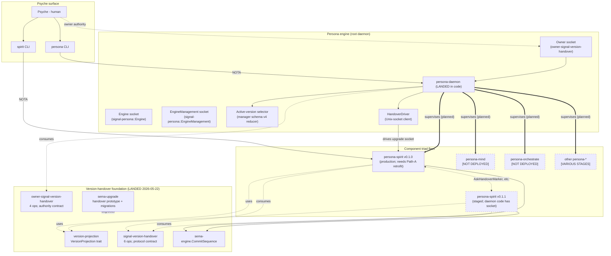

*Kind: Consolidation · Topic: persona engine overview (from /152) · Date: 2026-05-23*

# 3 — Consolidated persona engine overview (supersedes /152)

This report supersedes the `/152-persona-engine-architecture-overview/`
meta-directory (10 sub-reports, 2026-05-22), per intent 362 (aggressive
consolidation; re-contextualize into fewer current reports and delete
stale originals) and the parent /162 frame §"Consolidation discipline".

Most substance from /152 has migrated to permanent homes. This file
captures only what is still load-bearing in 2026-05-23 context plus
the still-open design questions, with a pointer table showing where
each piece of the original meta-directory now lives.

## §1 What has migrated to permanent homes

The /152 sub-reports captured a snapshot of work that was actively
landing on 2026-05-22. Most of that substance is now sitting in
permanent homes:

| /152 sub-report | Permanent home(s) |
|---|---|
| /152/0 frame + method | `skills/reporting.md` §"Meta-report directories" (intent 231 encoding); this file's frame supersedes the rest |
| /152/1 Persona daemon | `/git/.../persona/ARCHITECTURE.md` §1.6.7 "Persona as root component-upgrade orchestrator" (commit `248f339f`); §"Axis 2 rename status" → bead `primary-wvdl` Track B item 8 |
| /152/2 signal-persona (Engine + EngineManagement) | `/git/.../signal-persona/ARCHITECTURE.md` refresh (commit `b4bf644d`); rename status tracked in `primary-wvdl` |
| /152/3 signal-version-handover | `/git/.../signal-version-handover/ARCHITECTURE.md` (commit `eb80f588` — template-aligned, current); Possible-features section preserves the same open questions |
| /152/4 version-projection | `/git/.../version-projection/ARCHITECTURE.md` (already current per change `b5adda0c`) |
| /152/5 sema-stack | `/git/.../sema-engine/ARCHITECTURE.md` §"CommitSequence"; `/git/.../sema-upgrade/ARCHITECTURE.md` (commit `72b20463`) |
| /152/6 persona-spirit cutover | `/git/.../persona-spirit/ARCHITECTURE.md` (commit `f1e2223b` — state machine + three sockets); bead `primary-x3ci` (cutover); bead `primary-wdl6` (v0.1.0 Path-A retrofit ratified by intent 257) |
| /152/7 owner-signal-version-handover | `/git/.../owner-signal-version-handover/ARCHITECTURE.md` (current, covers boundary, ops, constraints) |
| /152/8 standard-agent-behavior | `skills/reporting.md` (intents 231 + 232); `AGENTS.md` §"Reports go in files" + §"Roles"; `ESSENCE.md` §"Intent and design"; `INTENT.md` |
| /152/9 overview | Substance distributed across the homes above; the lineage record collapses to this file |

The /152 sub-reports also referenced 2026-05-22 commit hashes
(`d89c3ac5`, `22089f47`, `04ec9302`, `40c0c93e`, `248f339f`,
`b4bf644d`, `72b20463`, etc.) as proof of landed work. Those commit
hashes still resolve in the per-repo histories; not duplicating them
here.

## §2 Surviving substance not captured elsewhere

Two things in /152 do not have a permanent home yet and are
preserved here:

### §2.1 Engine-as-meta-graph (the only single-page picture)

No individual ARCH file covers the full persona-engine span (Persona
+ version-handover stack + sema-stack + component triad fleet) on
one page. The /152/9 meta-graph fills that gap; this consolidated
version updates it to reflect 2026-05-23 state.

State delta since /152/9 (2026-05-22):

- Persona-daemon landed in code with owner-socket binding, HandoverDriver,
  quarantine gating, four-socket Target model — still needs production
  deployment (Nix flake + systemd unit; bead `primary-wvdl` + `primary-a5hu.*`)
- Spirit v0.1.0 Path-A retrofit ratified by intent 257 (per
  /156 Gap 2) — bead `primary-wdl6` carries the slice
- Persona-prefix removal pending across the supervised-component
  fleet per intent 280 (bead `primary-jzxw`) — does not change
  the architecture, only the names

### §2.2 Persona-spirit cutover as the convergence point

This framing is from /152/6 and is not captured in any ARCH file
because no single component owns it — it is the load-bearing
observation that Spirit's `Certainty → Magnitude` widening is the
smallest possible exercise of the per-type version-projection
mechanism, which makes it the lowest-risk, highest-information
substrate for the entire smart-handover stack. Recorded here so
future agents inheriting the substrate can see why Spirit is the
chosen first cutover (rather than e.g. mind or orchestrate).

| Stack piece | What Spirit's cutover proves |
|---|---|
| `VersionProjection<Certainty, Magnitude>` | Forward all-clean + reverse with `NotRepresentable` on widened rungs — the bidirectional single-trait shape |
| `signal-version-handover` 6 ops | All operations carried over a real socket: marker, readiness, completion, mirror, divergence, recovery |
| `sema-engine.CommitSequence` | The handover marker; `CommitSequenceAdvanced` rejection if source moves between read and readiness |
| Persona daemon orchestrator | Receives upgrade orders on its own owner socket (intent 210), drives target's owner socket, owns selector flip (intent 209) |
| `owner-signal-version-handover` | Authority verbs (`ForceFlip`, `Rollback`, `Quarantine`) for when automatic protocol stalls |
| Selector flip mechanism | Whatever physically flips becomes the workspace pattern for every later cutover |
| Dual-socket-retraction discipline | `HandoverCompleted` removes ordinary + owner socket paths (intent 193) |
| Live database migration with provable replay | 217+ real production records carried through projection — pattern for larger future migrations (mind, orchestrate) |

## §3 Open design questions still in play

Preserved per intent 229 (competing design ideas remain so future
agents can essay them). Each question filtered against the
2026-05-23 state.

### A — Version-handover stack

- **Mirror payload — raw bytes vs typed enum** (/152/3 Q1, /152/4
  open feature). The wire today is `Vec<u8>` + `RecordKind`
  discriminant; the typed-enum alternative would couple this
  contract to every signal-X crate in the workspace. **Designer
  lean (unchanged):** bytes until a second component handover lands
  and surfaces a typed need. (Already noted as Possible feature in
  `signal-version-handover/ARCHITECTURE.md`.)

- **Read semantics during handover** (/152/3 Q2, /152/4 Q2,
  /152/6 Q b). The contract models writes (Mirror + Divergence)
  only. Daemon-side options: `ActiveOnly` (current), `DualQueryMerge`,
  `ActiveProjectsResponse`. **Designer lean (unchanged):** keep
  reads off the handover wire; let `version-projection::ReadPolicy`
  + the ordinary contract carry it. The actual choice will land
  with the production Spirit cutover.

- **Mirror payload application on persona-spirit-daemon** (/152/3
  §"Implementation gap"). Reverse-projection write path exists only
  in the `sema-upgrade::handover` prototype. **STILL OPEN AND
  LOAD-BEARING** — blocker for the first PRODUCTION cutover, not
  just a design question. (Tracked as remaining work under
  `primary-x3ci` item 3.)

- **Recovery contract surface richness** (/152/3 Q4). `RecoverFromFailure
  / RecoveryResult` exist with a single `recovered: bool` outcome.
  Open whether to enrich when persona-introspect matures, or stay
  narrow. **Designer lean (unchanged):** stay narrow; rich shape
  belongs on the persona-introspect contract.

### B — Persona daemon

- **signal-persona crate-split** (/152/1 Q a, /152/2 Q1). Preserved
  per intent 229 in bead `primary-wvdl`. One repo with two `pub
  mod` channels (Engine + EngineManagement) vs split EngineManagement
  into its own repo. EngineManagement is consumed by every supervised
  component daemon (broad audience); Engine is consumed only by
  Persona's CLI clients. **No designer lean yet — competing.**

- **Selector flip physical mechanism** (/152/1 Q d implicit, /152/6
  Q d). Replace CriomOS-home `current → v<X.Y.Z>` symlink with what?
  Three options: home-symlink under `~/.local/state/<component>/`,
  Persona-owned in-memory route, or Persona-owned routing socket
  proxy. **No designer lean yet — competing.** Spirit cutover will
  pick one by necessity, with workspace-wide consequences.

- **`ForceFlip`/`Rollback` event-log shape** (/152/1 Q b). Current:
  all three sources (`HandoverMarker`, `ForceFlip`, `Rollback`)
  fold into one `ActiveVersionChanged` variant discriminated by
  `ActiveVersionChangeSource`. Alternative: separate variants
  per source for grep-friendly audit walks. **Designer lean:**
  uniform reducer (current choice) — the discriminator carries the
  information cleanly.

- **Owner-socket framing for future surfaces** (/152/1 Q c).
  `owner-signal-version-handover` is one owner contract; future
  owner-authority surfaces (engine retire, force-restart, manual
  quarantine of a component instance) could grow new variants there,
  get their own `owner-signal-persona` contract, or fold into a
  single `owner-signal-engine-management` crate. **No designer lean
  yet — competing.**

- **`signal-persona::ComponentName` vs `signal_persona_auth::ComponentName`**
  (/152/2 Q2). Same name, different semantics (open string newtype
  vs closed enum). Planned split: `ComponentPrincipal` (closed) vs
  `ComponentInstanceName` (open). **Designer lean:** execute the
  split before the next consumer cascade.

- **Engine `Query` payload growth** (/152/2 Q3). Today flat
  `Catalog | EngineStatus | ComponentStatus`. With persona-introspect
  arriving, may need a parallel `Observe(...)` surface or new
  `Query` variants. **Not a real design item yet** — surfaces when
  introspect ships.

### C — sema-stack

- **Asymmetric Spirit release** (/152/5 Q a, /152/6 Q a).
  `persona-spirit` + `signal-persona-spirit` at v0.1.1 while
  `owner-signal-persona-spirit` stays at v0.1.0. Verified deliberate
  in /152/6 — the `Certainty → Magnitude` widening lives entirely
  on the ordinary working contract; the owner contract has zero
  references and bumping it would be ancestry-carrying versioning.
  **Designer lean (recommended for ratification):** principled —
  triad-leg versions advance independently per leg's schema delta.
  This needs Spirit ratification as a workspace-level discipline.
  Generalises to every future triad's versioning.

- **`sema-upgrade` self-upgrade bootstrap** (/152/5 Q b). When
  sema-upgrade's own schema changes, hand-written one-off or
  recursive dogfood? **Designer lean (unchanged):** hand-written
  until contracts stabilise; recursive dogfood is the goal-state.

- **Divergence sink location for sema-upgrade prototype** (/152/5
  Q c). Before persona-introspect ships, where do divergences go?
  **Designer lean:** in-memory for prototype (small enough); surface
  to persona-introspect when it lands.

### D — owner-signal-version-handover

- **`AttemptHandover` socket-paths-in-body** (/152/7 Q1). The
  contract carries explicit ordinary/upgrade socket paths because
  Persona's component-version catalog is immature. Once mature,
  shrink to `component + current_version + target_version`.
  **Designer lean (unchanged):** shrink later; current shape is the
  right stepping stone.

- **`EffectEmitted` generalisation** (/152/7 Q4). This contract
  chose `SemaObservation`. Open whether the choice generalises to
  all observable blocks or stays as cross-cutting / authority-tier
  default. **Designer recommendation (carried forward from /152/7):**
  capture as Spirit Decision (Medium certainty) — authority-tier
  contracts default to `SemaObservation`; component-local domain
  contracts (mind, router, etc.) may choose typed `Effect`.

- **`HandoverSucceeded.commit_sequence` typing** (/152/7 Q5). Today
  `u64` directly; consider wrapping in newtype borrowed from
  `sema_engine::CommitSequence`. **Cosmetic; not load-bearing.**

- **`UnimplementedReason::IntegrationNotLanded`** (/152/7 Q6).
  Transitional variant; remove after Spirit cutover proves
  end-to-end.

- **`Tap`/`Untap` observability fanout** (/152/7 Q2). Currently
  deferred. **Designer lean:** wait until persona-introspect lands
  a fanout shape; defer.

- **Asymmetry between ordinary and owner version-handover contracts**
  (/152/7 Q3). Ordinary has 6 ops; owner has 4. Asymmetry is correct
  (ordinary is a daemon-to-daemon state machine; owner is administrative
  commands) but worth naming so future readers don't expect parallel
  structure.

### E — workspace operating discipline (auditor role, Medium certainty)

Three questions surfaced by /152/8; all remain **proposed-not-decided**:

- **Auditor authority class** — structural-tier or support-tier?
  Mechanical pattern-checking + automated DeepSeek calls suggest
  support-authority, but the loop-back-to-designer dynamic suggests
  structural revisions can be triggered.

- **Auditor lane mechanism** — windows on shared agent (mirror
  model) vs external CI-style pipeline driven by DeepSeek?

- **Audit-output substrate** — reports under `reports/auditor/`,
  Spirit records if auditor has its own agent identity, bead
  comments, or jj-commit review?

(These are encoded in `AGENTS.md` §"Roles" under carrying-uncertainty
framing per `skills/architecture-editor.md`; surfaced here only
because they were grouped with the /152 session.)

## §4 Contract-repo lens findings (the /162 audit angle)

Quick pass through the /152 contracts using the contract-repo lens
from /162/0:

- **`signal-version-handover` operation roots** — `AskHandoverMarker`,
  `ReadyToHandover`, `HandoverCompleted`, `Mirror`, `Divergence`,
  `RecoverFromFailure`. The verb-form discipline is mostly clean:
  `Mirror` and `Divergence` are gerund-shaped but established usage;
  `AskHandoverMarker` is verb-form. `ReadyToHandover` reads as
  adjectival — could be `RequestHandoverReadiness` or simpler
  `RequestHandover`. **Worth surfacing as a future-cleanup item** —
  not blocking.

- **`owner-signal-version-handover` operation roots** — `AttemptHandover`,
  `ForceFlip`, `Rollback`, `Quarantine`. All four are verb-form.
  Replies are verb-past-tense (`HandoverSucceeded`, `FlipForced`,
  `RolledBack`, `Quarantined`). **Clean.**

- **Reply rejection variants** — `signal-version-handover` uses
  `HandoverRejected(HandoverRejectionReason)` — verb-past-tense
  + Rejected with typed enum reason. **Clean.** `owner-signal-version-handover`
  uses `Rejected(RejectionReason)` — namespace is already supplied
  by the channel, so the bare `Rejected` is correct. **Clean.**

- **Closed enums** — `HandoverRejectionReason` (4 variants),
  `DivergenceReason` (3), `ForceReason` (3), `RollbackReason` (3),
  `QuarantineReason` (3), `RejectionReason` (8), `UnimplementedReason`
  (2) — all closed; no `Unknown` variants. **Clean.**

- **Domain-noun payloads** — `MirrorPayload`, `DivergencePayload`,
  `MarkerRequest`, `ReadinessReport`, `CompletionReport`,
  `HandoverMarker`, `HandoverAcceptance`, `HandoverFinalization`,
  `RecoveryRequest`, `RecoveryResult`. The "Payload" suffix on
  Mirror/Divergence is namespace-repeating (the operation is
  `Mirror`; the payload type carrying `Vec<u8>` could just be
  `MirrorBody` or `Mirror` — but the type-vs-operation namespace
  collision argues for keeping the suffix or renaming the operation).
  **Worth surfacing — not blocking.**

- **Contract owns wire + text form** — yes, both `signal-version-handover`
  and `owner-signal-version-handover` own rkyv + NOTA. **Clean.**

No new contract-repo-lens findings emerged that change the design
questions above. The version-handover contract pair already follows
the lens discipline well.

## §5 What was consolidated + what was dropped

### Extracted to this consolidated report

- The single-page meta-graph of the persona engine (§2.1) — the
  only place this picture lives
- The Spirit-cutover-as-convergence-point framing (§2.2) — useful
  context for why Spirit is the chosen first cutover
- The full open-design-questions slate (§3) — six clusters of
  competing-design alternatives preserved per intent 229
- The contract-repo lens findings on the version-handover contract
  pair (§4) — feeds /162's overall audit
- The pointer table (§1) — locator from old report paths to current
  permanent homes

### Dropped as already-migrated

- Per-component current-state narratives (status matrices, commit
  hash tables, file-by-file changes) — landed in per-component
  ARCH files; the commits remain in repo history
- Diagrams of individual component internals — landed in respective
  ARCH files (the `Active → HandoverMode → PrivateUpgradeOnly`
  state machine is in `persona-spirit/ARCHITECTURE.md`; the
  EngineManager actor topology is in `persona/ARCHITECTURE.md`; etc.)
- The /152/8 standard-agent-behavior encoding work — fully landed in
  `skills/reporting.md`, `AGENTS.md`, `ESSENCE.md`, `INTENT.md`; the
  intent records (231-235) are in the Spirit log
- The Axis 2 rename count and file-list — superseded by bead
  `primary-wvdl` Track B item 8 which carries the live count
- The /152/9 §3 status matrix — superseded by current bead state
  and `reports/designer/282-workspace-implementation-status.md`
  successors
- The /152/9 §5 "remaining path to production Spirit cutover" —
  superseded by current `primary-x3ci` notes + `primary-wdl6`
  (Path-A retrofit) ratified by intent 257
- The /152/9 §6 bead-reconciliation summary — superseded by current
  bead state
- The session methodology framing (/152/0) — encoded in
  `skills/reporting.md` §"Meta-report directories"

### Dropped as stale

- References to "Persona Engine Manager Daemon" as a longer name —
  intent 215+216 already settled this; the ARCH files use the new
  name; the historical context belongs in repo history, not in a
  consolidated report
- The "ARCHITECTURE.md update" sections from each sub-report
  describing the in-session ARCH commits — those commits landed
  and now ARE the architecture; the meta-description is no longer
  useful
- /152/0 frame intent-records list — duplicates `INTENT.md` and the
  Spirit log
- Lineage/session-cycle reflection in /152/9 §7 — interesting at
  the time but not load-bearing today

## §6 See also (still-current references)

Within /162:

- `0-frame-and-method.md` — directory purpose + sub-agent contract +
  consolidation discipline
- Sibling consolidated reports from sub-agents D, E (other clusters)
- `/162/N-overview.md` — final synthesis

Outside /162:

- `/git/.../persona/ARCHITECTURE.md` — Persona daemon (most current)
- `/git/.../signal-persona/ARCHITECTURE.md` — Engine + EngineManagement
- `/git/.../signal-version-handover/ARCHITECTURE.md` — handover protocol
- `/git/.../owner-signal-version-handover/ARCHITECTURE.md` — owner authority
- `/git/.../version-projection/ARCHITECTURE.md` — projection trait library
- `/git/.../sema-engine/ARCHITECTURE.md` — storage + CommitSequence
- `/git/.../sema-upgrade/ARCHITECTURE.md` — handover prototype + migrations
- `/git/.../persona-spirit/ARCHITECTURE.md` — first cutover target
- `reports/designer/287-version-handover-component-explained.md` —
  visual deep-dive (still load-bearing for the version-handover stack)
- `reports/designer/285-versionprojection-trait-and-handover-protocol-specification.md`
  — canonical spec (still load-bearing)
- Beads: `primary-wvdl` (Persona Track A + B), `primary-x3ci`
  (Spirit cutover), `primary-wdl6` (Path-A retrofit), `primary-a5hu.*`
  (decomposed Persona work)
- Spirit records 203, 206, 207, 208, 209, 210, 214, 215, 216, 229-235,
  237, 257, 280, 362

## §7 Follow-on bead-body sweep (for sub-agent F)

Beads with /152 references in their bodies that sub-agent F should
re-point at this consolidated report (or drop if the citation is no
longer useful):

- `primary-wvdl` — bead body cites operator/159 + designer/285 +
  designer/258 + /282 + second-designer/151; does NOT cite /152
  directly per current body. **No action needed.**
- `primary-x3ci` — bead notes cite operator/158, /160, /161; does
  NOT cite /152 directly. **No action needed.**
- `primary-wdl6` — cites /156 Gap 2 + intent records; does NOT cite
  /152 directly. **No action needed.**
- `primary-a5hu` (and sub-beads) — body cites second-operator/166,
  /285, /282, intent records; does NOT cite /152 directly. **No
  action needed.**

A bead-body grep for "152" + "persona-engine-architecture-overview"
returned no matches in the above key beads at consolidation time,
so sub-agent F has minimal /152-specific cleanup. The broader
bead-body sweep across other beads remains sub-agent F's territory.
