*Kind: Consolidation · Topic: Design rationale archive — EffectEmitted, public routing, three-tier signal sizing, lossless cutover · Date: 2026-05-23*

# 4a — Design rationale archive (consolidates /154 + /155 + selected /156 themes)

This consolidation captures the **design rationale** — competing
alternatives and the chain of reasoning that led to each ratification
— for the five large design questions that resolved through intent
records 244, 246, 251, 252, and 259 between 2026-05-22 and 2026-05-23.

Per intent 229, competing-design alternatives are preserved here
even though the workspace ratified a single path. The canonical
contract / ARCH form of each decision lives in its permanent home;
this archive carries the *rationale* future agents need when
revisiting the same shape.

Substance migrated to permanent homes:

| Decision | Canonical home |
|---|---|
| EffectEmitted = tier-based default | Contract conventions; cited from `owner-signal-version-handover/ARCHITECTURE.md` |
| Public-traffic routing = Persona FD-handoff via SCM_RIGHTS | `persona/ARCHITECTURE.md` Design D section + cross-refs in `signal-persona-orchestrate/ARCHITECTURE.md`, `signal-persona-introspect/ARCHITECTURE.md`, `signal-persona-spirit/ARCHITECTURE.md` |
| Three-tier signal sizing + 64-bit verb namespace | `signal-frame/ARCHITECTURE.md §5` (jj change `2313c5ed`); cross-ref `signal-sema/ARCHITECTURE.md` (jj change `1604cceb`) |
| ComponentName split → ComponentPrincipal + ComponentInstanceName | Pending operator execution under bead `primary-g81p` |
| Triad-leg-independent versioning principle | Pending Spirit Principle capture + `skills/component-triad.md` paragraph |

# Question 1 — EffectEmitted payload type (RATIFIED via intent 251)

## §1.1 The problem

Every component triad working contract carries an **observable
block** with two event families: `OperationReceived` (request half)
and `EffectEmitted` (state-change half). The open question was
**what kind of payload `EffectEmitted` carries**. Around seven
pending observable blocks were waiting on this decision — the
seven `signal-persona-*` working channels for the Persona engine —
each one designed but blocked.

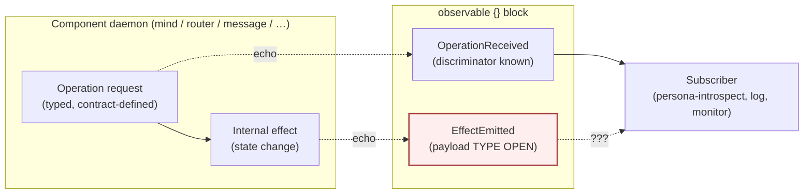

## §1.2 Why the question was load-bearing

Three forces pulled in different directions:

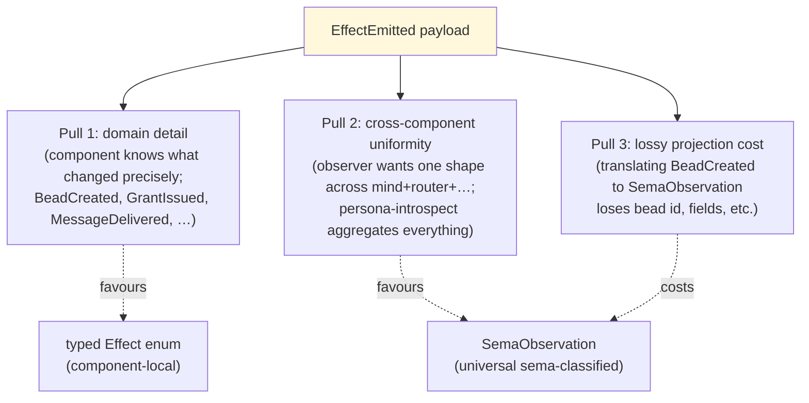

In practice **both kinds of observer exist** — persona-introspect
aggregates; per-component dashboards read detail — so the question
narrowed to which audience is the primary consumer per contract.

## §1.3 The four candidate designs

### Design A — Universal SemaObservation everywhere

Every component's `EffectEmitted` carries `SemaObservation`. The
component picks a sema classification at emit time; domain detail
falls into a free-form `summary` string or is dropped.

- Pro: uniform consumer shape; one subscription channel for
  cross-cutting tooling
- Con: loses domain detail; forces every component to invent a
  sema classification for every effect

### Design B — Component-local typed Effect everywhere

Every component's `EffectEmitted` carries a component-local enum
(`persona_mind::Effect`, etc.). Contract defines the enum.

- Pro: full domain detail; producer cost zero
- Con: no aggregation path; persona-introspect must learn every
  component's vocabulary; adding a new component forces every
  observer to add a case

### Design C — Two-stream (both, separately)

Each component emits TWO observable streams: `EffectEmitted` with
typed local `Effect` AND `SemaEmitted` with `SemaObservation`. The
component does the projection once at emit time.

- Pro: both audiences served; aggregation works
- Con: producer cost doubles; observable surface doubles in every
  contract; risk of skew if projection forgets a case

### Design D — Tier-based default (RATIFIED)

Two tiers of contract, each gets its natural default:

- **Authority-tier contracts** (`owner-signal-*`, cross-cutting
  state about other daemons — `owner-signal-version-handover`,
  future `owner-signal-mind` policy verbs) → `SemaObservation`
- **Component-local domain contracts** (`signal-persona-mind`,
  `signal-persona-router`, etc.) → typed component-local `Effect`

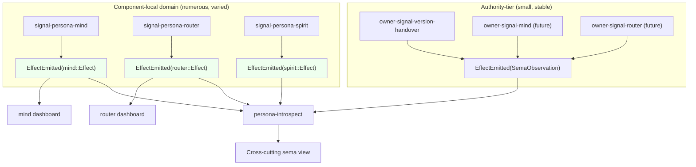

- Pro: right default per tier — authority-tier is rare + cross-cutting
  (sema is right); domain is frequent + detail-rich (typed is right)
- Pro: matches what `owner-signal-version-handover` already chose
- Pro: persona-introspect's effort scales with component count,
  not effect count
- Con: two patterns instead of one (cost on writers)
- Edge case: a domain contract that happens to be cross-cutting
  defaults to typed Effect and lets persona-introspect adapt

# Question 2 — Public-traffic routing during cutover (RATIFIED Design D via intent 252; Design C rejected via intent 246)

## §2.1 The problem

A client (e.g. the `spirit` CLI, a future Mind worker) connects to
"spirit's ordinary socket". During steady state this is
`spirit-v0.1.0`'s ordinary socket; **after a cutover** it must
become `spirit-v0.1.1`'s ordinary socket. The handover protocol on
the private upgrade socket coordinates state copy; the public
**routing** was the missing piece.

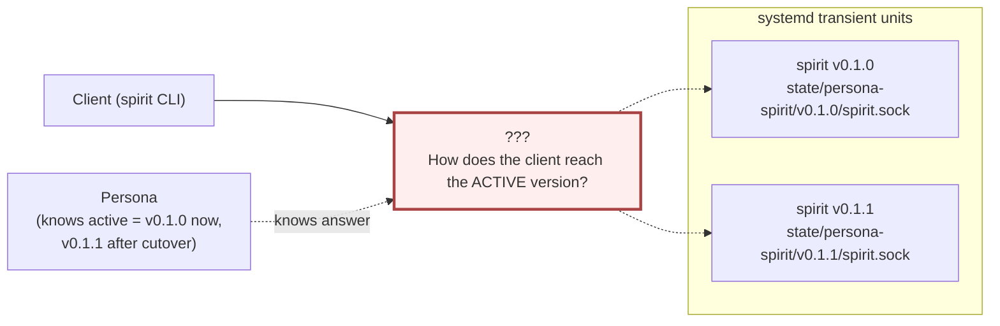

The cutover is supposed to be **atomic from the client's view** —
no client should see "neither", no client should connect to old
during the freeze window AFTER `HandoverCompleted`.

## §2.2 What was already decided going in

- Persona owns the active-version selector (snapshot table; intent
  208/209)
- systemd transient units own process identity per /291 + operator/163
- Each version binds its own ordinary socket (version-suffixed paths)
- Handover protocol freezes writes during cutover (signal-version-handover)

Still open: (a) what socket file does the CLIENT connect to;
(b) when the selector flips, how does the new connection land on
the active version; (c) what happens to existing live connections
at the moment of flip.

## §2.3 The four candidate designs

### Design A — Persona-as-proxy

Persona binds the stable per-component socket; clients connect
there; Persona proxies bytes to the active version's socket.

- Pro: atomic flip; Persona has live signal on every connection;
  existing connections drain on Persona's terms
- Con: latency hit per request; Persona is on the data-plane path
  (Persona crash = traffic stop); Persona is single-threaded
  (Kameo) so high-throughput components queue behind Persona

### Design B — systemd socket activation

systemd binds the public socket; Persona issues `start-transient-unit
--sockets=...` naming the active unit; systemd transfers the
listening FD between units.

- Pro: atomic flip via FD transfer; no data-plane proxy; kernel +
  socket buffers handle drain
- Con: tight coupling to systemd's socket-activation primitive;
  V0 → V1 stop / start sequencing complexity; harder to test in
  non-NixOS development sandbox

### Design C — Client-side discovery (REJECTED via intent 246)

Client first asks Persona's owner socket "where's spirit?";
receives a version-suffixed path; connects there directly. After
cutover, new clients discover the new path.

- Pro: no proxy hop; Persona off the data plane; simple to test
- Con: every client SDK needs the discovery step — couples every
  signal client to Persona; client caching = race window; cache
  invalidation during cutover is brittle
- **Rejected because**: psyche directed lossless + client-transparent
  routing (intent 245). Discovery violates client-transparent — every
  client SDK changes; cache invalidation forces a discovery on
  every logical session.

### Design D — Persona-orchestrated FD handoff via SCM_RIGHTS (RATIFIED)

Persona binds the stable socket and listens. Each component daemon
opens a control connection to Persona. On `accept()`, Persona
sends the client FD to the active version via Unix-socket
`SCM_RIGHTS`. After handoff, client ↔ daemon byte stream is direct.

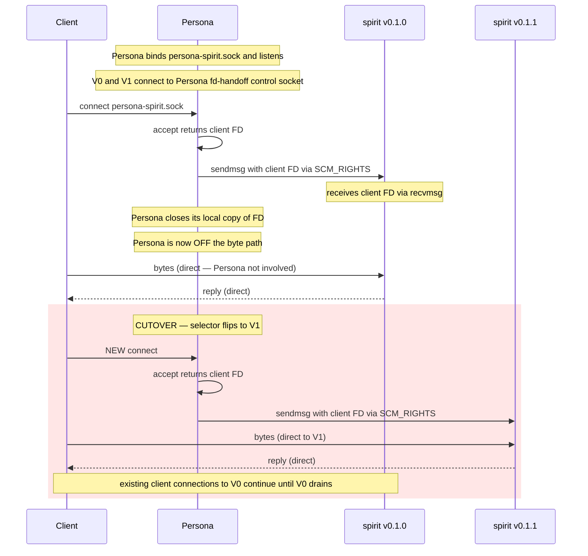

How losslessness is guaranteed at three levels:

- **L1 (connect)**: Persona's `accept()` never stops; clients
  never get ECONNREFUSED.
- **L2 (bytes)**: after FD handoff, bytes flow client ↔ daemon
  directly (no Persona buffer in the path).
- **L3 (operations)**: V0 finishes every accepted Operation before
  closing; HandoverProtocol's freeze keeps the contract.

Differences from A: after FD handoff, Persona is OFF the byte path.
Persona crash doesn't stop traffic on established connections.

Differences from B: no systemd dependency. Works in any environment
with Unix domain sockets + SCM_RIGHTS — dev sandbox, containers,
custom hosts. Same socket model in dev and prod.

### §2.4 Three-design comparison (C dropped)

| Concern | A — Persona proxy | B — systemd socket activation | D — Persona FD handoff (SCM_RIGHTS) |
|---|---|---|---|
| Lossless L1 (connect) | Yes | Yes (kernel backlog) | Yes |
| Lossless L2 (bytes) | Yes (Persona buffers) | Yes (kernel buffers) | Yes (direct after handoff) |
| Lossless L3 (Ops) | Yes (drain + protocol) | Yes (drain + protocol) | Yes (drain + protocol) |
| Persona on data plane | YES (bytes flow through) | NO | NO |
| Persona crash → traffic stop | YES | NO | NO (established survive) |
| Per-connection overhead | per-byte (splice helps) | zero | one sendmsg() at connect |
| systemd dependency | none | required (prod) | none |
| Dev/prod symmetry | yes | no (dev uses DirectProcessLauncher) | YES |
| Persona-visible request gating | YES | NO (post-handoff) | YES (at connect) |

### §2.5 Fallback if Design D plumbing proves heavy

**Design B (systemd socket activation)** is the reasonable
production-only fallback if SCM_RIGHTS proves harder than expected.
Both keep Persona off the byte path; both are lossless; Design D's
only advantage is dev/prod symmetry. Carry as competing-design per
intent 229.

# Question 3 — Three-tier signal sizing (RATIFIED via intent 244 + 251)

## §3.1 The wisdom psyche named

Every Signal Operation, Reply, Effect, and SemaObservation today
gets serialized as a full rkyv record — variable-size, sometimes
hundreds of bytes. For three jobs (logging, indexing, cheap
subscription) that's an order of magnitude more than needed.

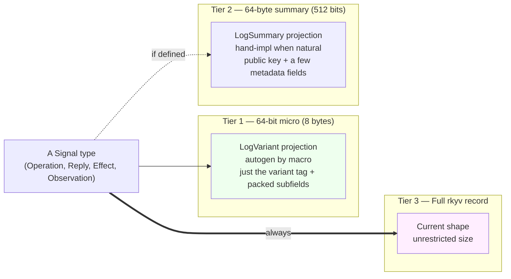

Three tiers because three audiences need different things:

- **Tier 1** — log writers, hot-path indexers, dashboard histograms,
  persona-introspect aggregation. Want a tag, not detail. 8 bytes
  per event scales to billions per GB.
- **Tier 2** — auditors, slow dashboards, observers that want
  enough detail to follow the story but not the full payload.
  64 bytes = ~10 small fields or one cryptographic identity + a
  few words of context.
- **Tier 3** — replay, reconstruction, full semantic consumers.
  Want everything.

## §3.2 What fits in 64 bits

Useful packings for a Signal log variant:

- `(op:8, sub:8, sema:8, outcome:8, timestamp_seconds:32)` — 4
  enum tags + ~136-year timestamp
- `(op:8, sub:8, sequence:48)` — 281 trillion events per stream
- `(op:8, padding:56)` — just the discriminator
- `(op:16, sub:16, sequence:32)` — 65k op kinds + 4G sequence

The variant discriminator (root tag) is **always at byte 0 (LSB)**.
This makes histogram aggregation cheap: take the low byte and you
have the root operation kind for grouping.

## §3.3 What fits in 64 bytes

- 1 BLS12-381 G1 compressed point (48 bytes) + 16 bytes metadata
- 1 SHA-256 / Blake3 hash (32 bytes) + 32 bytes other
- 1 short string up to ~60 bytes
- 1 Ed25519 public key (32 bytes) + 32 bytes context
- 8 u64s (timestamps, sequences, counters)
- 2 ContractVersion (32 bytes each) — current + target in a
  handover summary
- 1 ComponentName + 1 Version + a couple of enum tags

## §3.4 The trait shape

```rust
/// Every Signal type provides a 64-bit logging projection.
/// Always derivable by the signal_channel! macro.
pub trait LogVariant {
    fn log_variant(&self) -> u64;
}

/// Optional 64-byte summary projection.
/// Implemented when the type has a meaningful summary at 64 bytes.
/// `Summary` is bound to <= 64 bytes via a const-generic check.
pub trait LogSummary {
    type Summary: rkyv::Archive + Sized;
    const SUMMARY_SIZE_CHECK: () = assert!(
        std::mem::size_of::<Self::Summary>() <= 64,
        "LogSummary::Summary must fit in 64 bytes"
    );
    fn log_summary(&self) -> Self::Summary;
}
```

Every Signal type — Operation, Reply, Effect, SemaObservation —
implements `LogVariant` (autogen). Types with natural summaries
hand-implement `LogSummary`.

## §3.5 Macro autogen logic for LogVariant

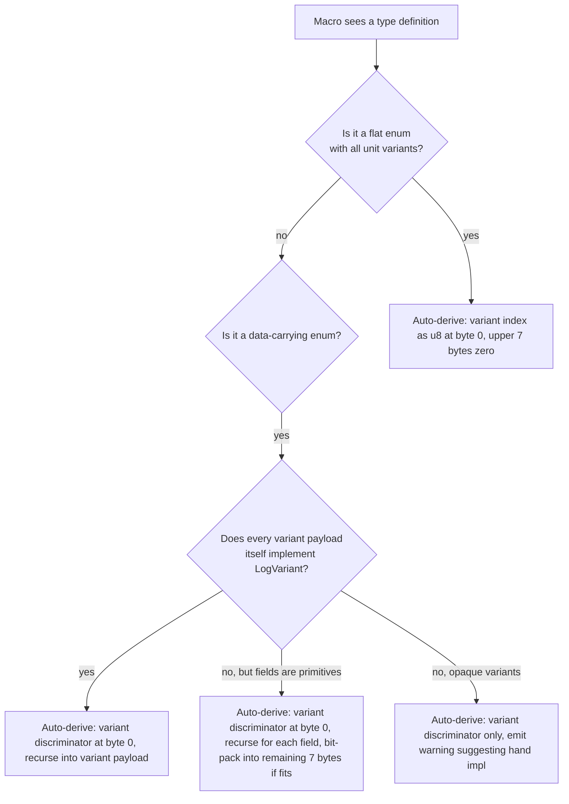

## §3.6 Three subscription tiers + storage efficiency

Once every type has Tier 1 + optional Tier 2 + always Tier 3, the
observable block extends with per-tier subscriptions. Subscription
tier is a filter on the same observable channel — producer emits
once, runtime projects per-subscriber.

Cost ratio is roughly **~8× between adjacent tiers**:

| Tier | Storage at 1M events/sec | Retention discipline |
|---|---|---|
| Tier 1 (8 bytes) | 8 MB/s | retain indefinitely (cheap) |
| Tier 2 (64 bytes) | 64 MB/s | 30-90 days |
| Tier 3 (variable) | ~500 MB/s typical | per-record TTL |

Producer cost:

| Operation | Cost |
|---|---|
| Emit Tier 1 (LogVariant) | 1 `u64` shift-and-or per field, ~5ns total |
| Emit Tier 2 (LogSummary) | small struct construction, ~50ns |
| Emit Tier 3 (full record) | rkyv serialization, ~1-10µs |

The cost difference is two orders of magnitude. A daemon emitting
1M events/sec can afford to log all at Tier 1, sample Tier 2,
falls behind at Tier 3.

## §3.7 Carry-forward Q from the original report

- **Variant-at-root rule**: signal_channel! types ARE all enums at
  the root by macro construction; the rule applies to those, not
  to internal data records like `Entry` inside persona-spirit.
- **Tier 2 byte-truncation fallback**: rejected — value of Tier 2
  is *semantic* summary, not byte-truncation.
- **Per-tier subscriber accounting**: runtime tracks subscriber
  count per tier; emits each tier on-demand.
- **Relationship to SemaObservation**: SemaObservation is itself
  a Tier-2-shaped type (small, structured, universal). Natural
  Tier 2 default for cross-cutting authority contracts (Design D
  in Question 1). A Tier 1 for SemaObservation is a packed
  enum-of-enums fitting in 8 bytes.

# Question 4 — ComponentName overlap (RATIFIED via intent 259)

## §4.1 The collision

Two types shared the name `ComponentName` with INCOMPATIBLE
semantics:

- `signal_persona_auth::ComponentName` — CLOSED enum (known
  component set; type-checked variant)
- `signal_persona::ComponentName` — OPEN `String` newtype (any
  component identifier)

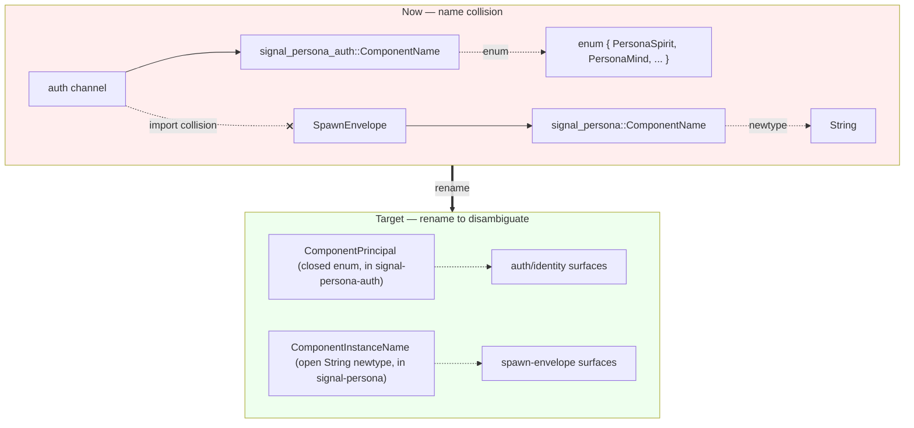

## §4.2 Resolution

Rename per intent 259:
- `signal_persona_auth::ComponentName` → `ComponentPrincipal`
- `signal_persona::ComponentName` → `ComponentInstanceName`

Mechanical rename via ripgrep + jj commit per file. Best bundled
with the Axis 2 rename completion on the persona daemon side
(`primary-wvdl` Track B item 8). Bead `primary-g81p` carries the
execution.

# Question 5 — Asymmetric Spirit release principle (CARRIED, pending Spirit Principle capture)

## §5.1 The pattern observed

`/152` sub-report 6 verified the asymmetric release as deliberate:
`owner-signal-persona-spirit` has zero `Magnitude` / `Certainty`
references, so bumping it would be ancestry-carrying versioning
(intent 70 + naming.md).

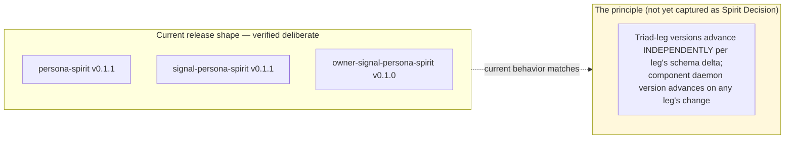

## §5.2 The principle to capture

> Triad-leg versions advance INDEPENDENTLY per leg's schema delta;
> component daemon version advances on ANY leg's change. Each
> `signal-X` and `owner-signal-X` repo carries its own semver
> based on its own schema evolution.

Once captured (Spirit Principle, Maximum certainty), the principle
informs every future component-triad versioning decision. Follow-on
edit: brief paragraph in `skills/component-triad.md` referencing
the principle.

No bead — Spirit Principle capture + skill edit.

# Question 6 — signal-persona crate-split (COMPETING — preserved per intent 229)

`signal-persona` currently carries TWO channels in one crate:
**Engine** (Persona's public ordinary working channel) and
**EngineManagement** (formerly `Supervision`; second channel for
internal engine-management traffic).

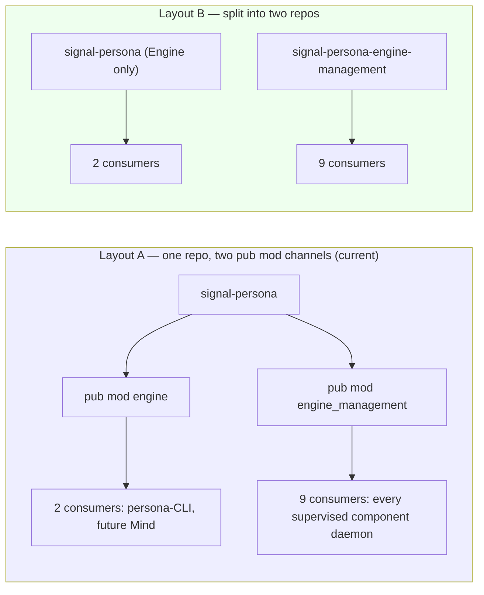

Asymmetry of consumers (2 vs 9) is the load-bearing argument
toward Layout B:

- **For Layout A**: one repo to maintain; one Axis-2 rename pass
  to finish; channels share NOTA codec wisdom. Cost is the cargo
  dependency carry across 9 consumers (small).
- **For Layout B**: dependency hygiene; consumers pull only what
  they use; EngineManagement evolves at its own cadence (independent
  versioning if needed). Cost is one more repo + Axis 2 rename
  becomes split-plus-rename.

Designer recommendation if forced to lean: **Layout B**, on
asymmetry-of-consumers. The dependency-narrowing pays recurring
dividends; the one-time split cost retires in the same session as
the Axis 2 rename.

**Status**: HELD as competing-without-lean; preserved per intent
229. Awaits psyche ratification.

# Question 7 — Auditor role specifics (COMPETING — proposed-not-decided)

Intent 234 (auditor as third role) + 235 (DeepSeek automates it)
are Medium-certainty proposals from psyche. Three sub-questions
remain unresolved:

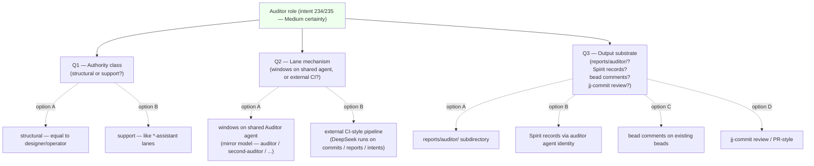

Designer-proposed minimum-viable staging (HELD pending psyche
ratification):

1. Pick a single concrete audit (e.g. "AGENTS.md hard-override
   violation checker in jj commit messages")
2. Run it manually first; capture rules + heuristics in
   `skills/audit-*.md`
3. Automate with DeepSeek as background process triggered on
   bead-close / commit / report-write
4. Output substrate: bead comments (Q3 option C — most actionable;
   surfaces in operator's `bd ready` queries)
5. Lane mechanism: external CI-style for first pass (Q2 option B);
   upgrade to mirror-model windows only if and when the auditor
   surfaces structural authority decisions
6. Authority class: support-tier (Q1 option B) — auditor doesn't
   decide architecture, just flags rule violations

**Status**: HELD as proposed-not-decided per intent 234/235 Medium
certainty.

# §X What was consolidated + what was dropped

## Consolidated (substance retained here)

From `/154`:
- §1 EffectEmitted designs A/B/C/D + rationale (Q1 above)
- §2 Public-routing designs A/B/C/D + rationale (Q2 above)
- §3 Combined recommendation summary (subsumed into Q1 + Q2)

From `/155`:
- Part 1 three-tier sizing all 9 subsections (Q3 above)
- Part 2 lossless cutover routing — Design D mechanism + sequence
  + lossless-at-three-levels argument (subsumed into Q2 as the
  ratified design)

From `/156`:
- §4 Gap 4 signal-persona crate-split (Q6 above)
- §8 Gap 8 Auditor role specifics (Q7 above)
- §5 Gap 5 ComponentName overlap rationale (Q4 above)

From `/158`:
- §3.5 Q5 Asymmetric Spirit release principle (Q5 above)

## Dropped (substance migrated to permanent home)

From `/153`:
- Intent records 220-228 absorption summary — those records now
  permanent in the Spirit log; the summary served only to inform
  the /152 follow-up cycle.
- Report-absorption summary (`/288`-`/291`, operator `/162`-`/163`,
  third-designer `/20`-`/21`, cluster-operator `/6`) — those
  reports are themselves the carry-forward.
- §3 selector-flip-direction-settling — superseded by Q2 ratification.
- §4 Q-new-1 public-traffic routing — superseded by Q2 ratification.
- §4 Q-new-2 quarantine policy gate — carried into /157 §9 bead C7.
- §4 Q-new-3 Spirit v0.1.0 retrofit — ratified via intent 257;
  bead `primary-wdl6`.
- §4 Q-new-4 operator pivot order — operator/system-specialist
  reorganisation handled in lane.
- §5 status-check table — superseded by /158's resolution map.

From `/155`:
- §2.3 + §2.4 mechanism walks of Design A (Persona proxy) and
  Design B (systemd socket activation) — kept condensed in Q2's
  comparison table (their mechanisms are well-understood; the
  full mermaid sequence diagrams added bulk without changing the
  decision).
- §2.6 three-design comparison — kept (table above).
- §2.8 full handover sequence under Design D — migrated to
  `persona/ARCHITECTURE.md` Design D section.
- §3 combined recommendation summary — subsumed into Q2 + Q3.

From `/156`:
- Theme A Gaps 1/2/3 — Gap 1 (Mirror payload application) is
  active bead work under `primary-wehu`; Gap 2 (Spirit v0.1.0
  retrofit) ratified via intent 257 → bead `primary-wdl6`; Gap 3
  (selector-flip-aware routing) folded into `primary-ezzp` via
  intent 258.
- Theme C Gaps 6/7 — Gap 6 (mind + orchestrate deployment) is in
  active bead work under `primary-c620` (closed) and `primary-e1pm`;
  Gap 7 (3 missing owner-signal repos) is a P3 bead-filing task
  for the relevant component daemon work windows.
- §9 recommendation work order — subsumed into the per-question
  status above and the §4b status report.
- §10 items needing Spirit Decision — superseded by /158's
  resolution map.

From `/158`:
- §2 resolution map — migrated to §4b status report.
- §3.1 Q1 signal-persona crate-split — Q6 above (with status).
- §3.2 Q2 Mirror payload raw bytes vs typed enum — RATIFIED via
  intent 274 (raw bytes in separate container outside the typed
  database); see §4b status.
- §3.3 Q3 Read semantics during handover — designer-proposed Option
  A (continue against v0.1.0 frozen snapshot); see §4b open-needs.
- §3.4 Q4 Auditor role specifics — Q7 above.
- §4 carry-forward (lower-priority) — migrated to §4b status report.
- §5 bead recommendations — superseded by /157 §9 bead filings and
  /158's actual bead landing trail.

## Permanent homes for substance

| Substance | Permanent home |
|---|---|
| EffectEmitted tier-based default rule | `owner-signal-version-handover/ARCHITECTURE.md` + contract conventions discipline |
| Public-routing Design D (Persona FD-handoff via SCM_RIGHTS) | `persona/ARCHITECTURE.md` Design D section |
| Public-routing ARCH cross-refs | `signal-persona-orchestrate/ARCHITECTURE.md`, `signal-persona-introspect/ARCHITECTURE.md`, `signal-persona-spirit/ARCHITECTURE.md` |
| Three-tier signal sizing | `signal-frame/ARCHITECTURE.md §5` (jj `2313c5ed`) |
| Three-tier sizing cross-ref | `signal-sema/ARCHITECTURE.md` (jj `1604cceb`) |
| ComponentPrincipal + ComponentInstanceName | Pending operator execution under bead `primary-g81p` |
| Triad-leg-independent versioning | Pending Spirit Principle capture + `skills/component-triad.md` paragraph |

# §Y See also

- `/home/li/primary/reports/second-designer/162-contract-repo-lens-and-consolidation/4b-consolidated-current-status.md`
  — companion consolidation: current status snapshot + open clarification needs
- `/home/li/primary/reports/second-designer/162-contract-repo-lens-and-consolidation/0-frame-and-method.md`
  — frame for this meta-directory
- `/home/li/primary/reports/second-designer/152-persona-engine-architecture-overview/`
  — meta-directory that seeded the engine push
- `/home/li/primary/reports/second-designer/159-intent-manifestation/1-signal-verb-namespace-arch.md`
  — signal-frame §5 three-tier sizing landing
- `/home/li/primary/reports/designer/285-versionprojection-trait-and-handover-protocol-specification.md`
  — handover protocol that Design D composes with
- `/home/li/primary/reports/designer/291-persona-systemd-units-for-daemon-management.md`
  — systemd hybrid Design B (Q2 fallback) composes with
- `/home/li/primary/reports/operator/163-persona-systemd-component-management-position.md`
  — operator's systemd alignment
- `/home/li/primary/skills/component-triad.md` — triad shape that
  Design D uses (one socket per role)
- Spirit records 208, 209, 210, 214, 217, 229 (competing-design
  preserve), 234, 235 (auditor), 238, 239 (Persona as permissioned
  daemon), 244 (three-tier sizing), 245 (lossless + transparent
  constraint), 246 (Design C rejected), 251 (Part 1 leans adopted),
  252 (Design D ratified), 257 (Path A retrofit), 258 (selector
  flip into ezzp), 259 (ComponentName rename), 274 (Mirror payload
  raw bytes in separate container), 362 (consolidation discipline)
