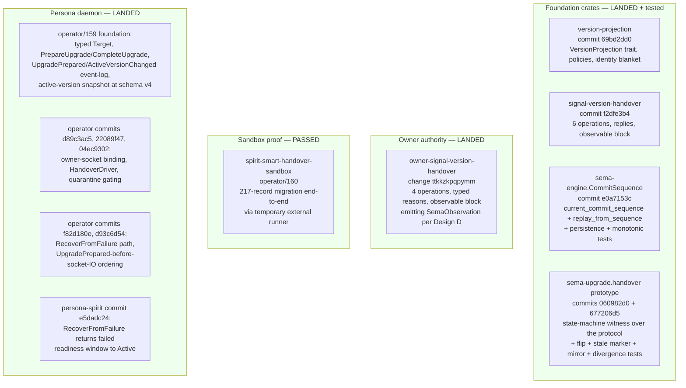
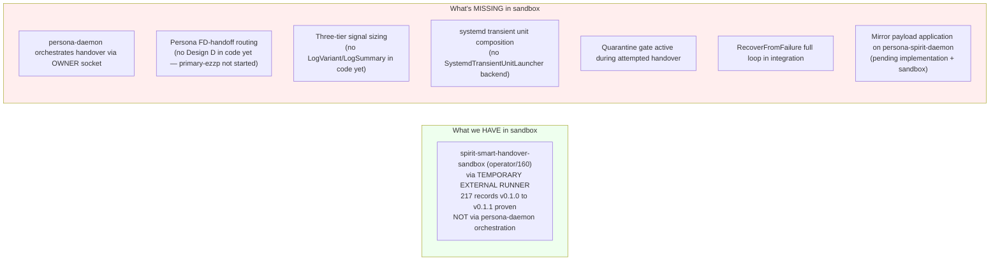
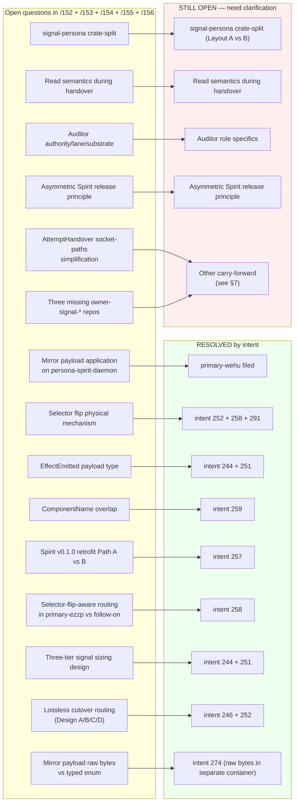
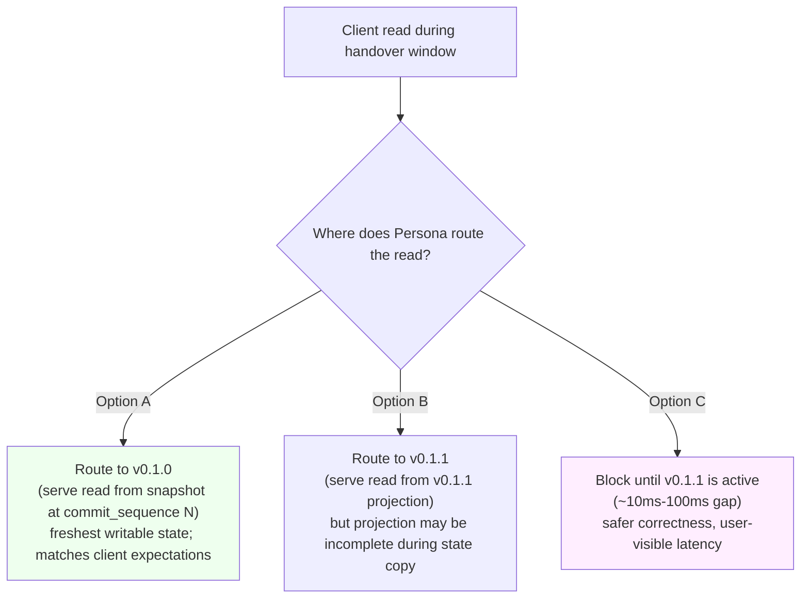

*Kind: Consolidation · Topic: Current status snapshot — engine stack audit, open question resolution, remaining clarification needs · Date: 2026-05-23*

# 4b — Consolidated current status (consolidates /157 + /158)

This consolidation captures the **current status snapshot** of the
Persona engine push as of 2026-05-23: what landed solid, what
lacks constraint tests, what lacks end-to-end sandbox coverage,
what's still on the open-question shortlist, and what's pending
intent clarification.

Companion to `4a-consolidated-design-rationale-archive.md` which
carries the design rationale for the major decisions.

# §1 What landed and is solid

These surfaces have:
- Cargo tests passing per the operator reports that landed them
- Nix flake check green per the operator reports
- Architectural truth tests at the per-crate level (commit_sequence
  monotonicity, projection-error categories, marker-mismatch
  rejection, etc.)
- ARCHITECTURE.md updates aligned per `/289` + my sub-agent sweep

# §2 What landed but lacks constraint tests

Constraint tests = architectural-truth tests per
`skills/architectural-truth-tests.md` — tests that catch
architectural drift, not just regression. The following surfaces
have working code + functional tests but lack constraint tests:

| Surface | Missing constraint test | Why it matters |
|---|---|---|
| `owner-signal-version-handover` `ForceFlip` / `Rollback` / `Quarantine` | ForceFlip/Rollback MUST NOT forge a marker-backed handover fact (ARCH §"Constraints" item 3) | Future implementation change could silently make ForceFlip indistinguishable from a normal handover in the event log |
| Persona `ActiveVersionChangeSource` enum | All three sources (HandoverMarker, ForceFlip, Rollback) project uniformly through one `ActiveVersionChanged` variant | Designer chose uniform reducer over separate variants; constraint test witnesses this in the schema |
| Persona quarantine gating | Any handover attempt MUST scan event log for `VersionQuarantined` first (per operator commit `04ec9302`) | Without a constraint test, the gate could be silently bypassed on a refactor |
| sema-engine `CommitSequence` | Failed commits do NOT advance the counter, AND advancement persists across reopen | In operator/158's test list but may not be expressed as constraint tests with explicit failure modes |
| version-projection `Identity` blanket impl | Every type T with `impl VersionProjection<T, T>` returns input unchanged | Trivial but worth witnessing — protects future refactors |
| Mirror in `signal-version-handover` | Rejected mirror payloads must produce typed `Divergence` records (not silent drop) | Per `/285` §9 — handles representable/non-representable distinction at the protocol boundary |
| Persona event-log replay → snapshot rebuild | Replaying the full event log into a fresh manager store rebuilds the active-version snapshot identically | Snapshots-are-projections-of-the-event-log discipline becomes auditable |

Each gap = one constraint test = ~30 lines of Rust + one Nix
check. Beads `primary-2o7p` through `primary-vjg3` cover these
per /157 §9.1 filings.

# §3 What landed but lacks end-to-end sandbox coverage

End-to-end sandbox = Nix-flake-runnable integration test that
exercises the full daemon-to-daemon path with real binaries on
real sockets:

Each missing-sandbox row is the natural integration test for the
landed code. ~50-150 lines of Nix module + small launcher binary
+ assertion code, following the pattern of operator/160's sandbox.
Beads `primary-fv2l` and follow-ons cover these per /157 §9.2.

# §4 Tracked beads (status snapshot)

| Surface | Status | Bead |
|---|---|---|
| Mirror payload application on persona-spirit-daemon | Pending; lives in sema-upgrade sandbox only | `primary-wehu` (filed) |
| Spirit v0.1.0 protocol-aware retrofit | Pending (Path A ratified) | `primary-wdl6` |
| Selector-flip-aware routing in Design D | Folded into primary-ezzp by intent 258 | `primary-ezzp` (body updated) |
| ComponentName rename → ComponentPrincipal + ComponentInstanceName | Pending | `primary-g81p` |
| LogVariant trait + derive macro | Pending | `primary-l02o` |
| LogSummary trait + size check | Pending | `primary-bg9l` |
| signal_channel! subscription tier extension | Pending; depends on primary-l02o + primary-bg9l | `primary-b86d` |
| SemaObservation LogVariant impl | Pending; depends on primary-l02o | `primary-2py5` |
| Persona FD-handoff infrastructure | Pending | `primary-ezzp` |
| Component daemon SCM_RIGHTS receive loop | Pending | `primary-x5ba` |
| persona-spirit Design D smoke test | Pending; depends on ezzp + x5ba | `primary-ak4g` |
| persona-spirit cutover to v0.1.1 | Pending | `primary-x3ci` (blocked by wdl6 + ezzp + x5ba + ak4g + more) |
| Persona engine epic | Active; operator on it | `primary-a5hu` |
| Persona port to current Signal stack | Active | `primary-wvdl` (Tracks A + B) |
| Persona-side Axis 2 rename (~242 occurrences) | Tracked | `primary-wvdl` Track B item 8 |
| Quarantine policy gate (enforce, not just record) | Pending | bundled with constraint tests above |
| persona-mind deployment | Pending; sema-upgrade prereq met | `primary-e1pm` |
| persona-orchestrate executor migration | Closed by second-operator | `primary-c620` (closed) |
| Three missing owner-signal repos (harness, message, system) | Pending | not yet beaded — file 3 as P3 when parent daemon work begins |
| persona-introspect three-tier storage | Pending; depends on primary-b86d | not yet beaded; file as P2 once tier traits land |

# §5 Open-question resolution map

Intent records 217-274 resolved a large stack of open questions
across `/152` + `/153` + `/154` + `/155` + `/156`. The map below
shows which questions are resolved by which intent records.

Resolution count: **9 major questions resolved** by intent records
244, 246, 251, 252, 257, 258, 259, 274 plus the cross-cutting
bead filings.

# §6 Remaining top-priority clarification needs

## §6.1 signal-persona crate-split (Layout A vs B) — competing-without-lean

Cross-reference: `4a-consolidated-design-rationale-archive.md` §6
carries the full design rationale and competing-design preservation.
Status: HELD pending psyche ratification.

If ratified Layout B: file `[signal-persona crate-split execution:
extract signal-persona-engine-management]`, P2, depends on Axis 2
rename completion under `primary-wvdl` Track B item 8.

## §6.2 Read semantics during handover window

Designer-proposed solution: **Option A — reads continue against
v0.1.0's frozen snapshot during the handover window.**

Reasons:
- v0.1.0's snapshot at commit_sequence N is the most authoritative
  view of the data the client expects to read
- v0.1.1's projection might be incomplete during state copy
- Blocking (Option C) introduces user-visible latency in the
  cutover window — defeats the no-downtime story
- After handover completes + selector flips, reads naturally shift
  to v0.1.1 per Design D routing

Composes with Design D: during handover, Persona keeps routing
client FDs to v0.1.0 daemon for reads + new client connections;
the freeze only applies to public WRITES.

If ratified, file as `[Read semantics during handover — Option A:
continue against v0.1.0 snapshot]`, P2; constraint test that reads
complete during the handover window without error. Follow-on to
`primary-wehu` (Mirror payload application — symmetric write-side
implementation).

## §6.3 Auditor role specifics

Cross-reference: `4a-consolidated-design-rationale-archive.md` §7
carries the full design rationale.

Designer-proposed minimum-viable: support-tier external CI with
bead-comment output. If ratified: file
`[Auditor minimum-viable first pass: AGENTS.md hard-override
violation checker via DeepSeek, output as bead comments]`, P2.

## §6.4 Asymmetric Spirit release principle

Cross-reference: `4a-consolidated-design-rationale-archive.md` §5
carries the full design rationale.

Designer-proposed wording (Spirit Principle, Maximum certainty):

> Triad-leg versions advance INDEPENDENTLY per leg's schema delta;
> component daemon version advances on ANY leg's change. Each
> `signal-X` and `owner-signal-X` repo carries its own semver
> based on its own schema evolution.

If ratified: Spirit Principle capture + brief paragraph in
`skills/component-triad.md` referencing it. No bead.

# §7 Carry-forward (lower-priority remaining)

| Question | Designer lean | Block radius |
|---|---|---|
| `AttemptHandover` socket-paths-in-body simplification | Shrink once Persona has a component-version catalog | None now; cosmetic post-prototype |
| `HandoverSucceeded.commit_sequence` newtype | Wrap in transparent newtype from `sema-engine::CommitSequence` | Cosmetic |
| `UnimplementedReason::IntegrationNotLanded` retirement | Remove after Spirit cutover proves end-to-end | Post-cutover cleanup |
| Three missing owner-signal-* repos (harness, message, system) | File 3 P3 beads when parent daemon work begins | Owner-tier completeness for those components |
| sema-upgrade self-upgrade bootstrap | Hand-written for first production migration | Sema-upgrade self-deploy |
| Divergence sink location for prototype | In-memory until persona-introspect ships | Failure-log audit |
| Persona-restart resilience | Deferred; via systemd socket activation if needed later | Persona uptime story |
| Mind channel-choreography verbs (/249 Gap #1) | Designer specification needed; deferred per intent 204 | Mind integration depth |
| persona-listen / persona-speak 11 questions | Parked per intent 166; designer-pivot to /249 gap closure | New-component design |
| persona-llm-client design | Parked per intent 166 | New-component design |
| Persona ARCH headline reframing (engine-manager vs upgrade-orchestrator) | Pending psyche | ARCH coherence |

# §8 Obsolete / stale (cleanup status)

- `reports/designer/280-session-handover-2026-05-22.md` — dropped
  per `/286` context-maintenance sweep; substance preserved
  elsewhere.
- `reports/designer/284-per-type-migration-trait-specification.md`
  — dropped per `/286` (superseded by `/285` — `VersionProjection`).
- References to `/280` + `/284` in other lanes' reports
  (`third-designer/19`, `cluster-operator/5`, `second-operator/165`)
  — left for those lanes to refresh; not my edit surface.

Recently-closed beads (per second-operator's most recent update):
- `primary-gjs5` (signal-sema Magnitude Unknown ARCH update) —
  shipped at signal-sema commit `9968ffad`
- `primary-qk04` (multi-version persona-spirit daemon coexistence)
  — shipped/re-verified
- `primary-77hh` (signal_channel prefix cleanup) — absorbed into
  triad migration beads
- `primary-d5im` (CriomOS-home Whisrs stale-widget) — shipped at
  CriomOS-home `a99a43d8`
- `primary-7kge` (owner-signal-version-handover create) — closed
  by operator/162
- `primary-chpq` (Spirit default wrapper dual-writes) — closed by
  second-operator/170 as superseded by smart handover
- `primary-k2mh` (Persona engine-manager triad migrate) — closed
  as duplicate of `primary-wvdl` with info preserved per intent 229

`primary-094p` (verify `/214` Criome arch substance) commented by
second-operator as "not closeable yet — real architecture gaps
remain". Leave for prime designer pickup.

# §9 Workspace-file coherence

Updates landed in the original /157 audit window:

- `AGENTS.md` — meta-report directory pattern (intent 231) +
  per-response report shape (intent 232) + possible auditor role
  (intent 234/235, Medium certainty) + headless jj rule (intent
  237). All in §"Reports go in files", §"Roles", §"Hard overrides".
- `ESSENCE.md` — intent-and-design dance (intent 233).
- `INTENT.md` — same dance + possible auditor.
- `skills/reporting.md` — standard agent behavior (intent 232) +
  meta-report directories (intent 231).
- `skills/role-lanes.md` — mirror model framing; no updates needed.

Coherence check at /157 audit time:
- `AGENTS.md` and `ESSENCE.md` agreed on the design/intent dance
- `AGENTS.md` headless-jj rule aligned with `skills/jj.md`
- `AGENTS.md` meta-report directory rule aligned with `skills/reporting.md`
- `AGENTS.md` auditor mention consistent with intent 234/235 Medium

No drift detected at that audit. Workspace files aligned.

# §X What was consolidated + what was dropped

## Consolidated (substance retained here)

From `/157`:
- §1 Frame (subsumed into header)
- §2 What landed and is solid (§1 above)
- §3 What landed but lacks constraint tests (§2 above)
- §4 What landed but lacks end-to-end sandbox coverage (§3 above)
- §5 What's incomplete (specific gaps already tracked) (§4 above)
- §6 What's obsolete or stale (§8 above)
- §7 Audit of recently-closed beads (§8 above)
- §8 Workspace-file audit (§9 above)
- §9 Bead filing recommendations (status migrated into §4 above;
  the actual bead UIDs have landed and are tracked there)

From `/158`:
- §2 Resolution map (§5 above, updated with intent 274)
- §3 Top-priority still-open questions (§6 above; competing-design
  rationale for these moved to companion 4a)
- §4 Carry-forward (§7 above)
- §5 Bead recommendations (subsumed into §6 follow-on filing notes)

## Dropped

From `/157`:
- §9.1 bead-filing table — actual UIDs landed and tracked in §4
  above; the recommendation table is superseded.
- §9.2 / §9.3 bead-filing tables — same, superseded.

From `/158`:
- §1 Frame (subsumed into header)

## Permanent homes for substance

| Substance | Permanent home |
|---|---|
| Constraint test discipline | `skills/architectural-truth-tests.md` |
| End-to-end sandbox discipline | `skills/testing.md` (Nix-flake-check pattern) |
| Bead tracking | `.beads/` Dolt DB (the UIDs themselves; this report just snapshots status at 2026-05-23) |
| Workspace-file coherence | `AGENTS.md`, `ESSENCE.md`, `INTENT.md`, `skills/` (those files are the canonical surfaces) |

# §Y See also

- `/home/li/primary/reports/second-designer/162-contract-repo-lens-and-consolidation/4a-consolidated-design-rationale-archive.md`
  — companion: design rationale for the ratified and held questions
- `/home/li/primary/reports/second-designer/162-contract-repo-lens-and-consolidation/0-frame-and-method.md`
  — frame for this meta-directory
- `/home/li/primary/reports/second-designer/152-persona-engine-architecture-overview/`
  — original meta-directory that seeded the engine push
- `/home/li/primary/reports/designer/285-versionprojection-trait-and-handover-protocol-specification.md`
- `/home/li/primary/reports/designer/287-version-handover-component-explained.md`
- `/home/li/primary/reports/designer/291-persona-systemd-units-for-daemon-management.md`
- `/home/li/primary/reports/designer/315-design-sema-upgrade-and-handover-current-state.md`
- `/home/li/primary/reports/operator/158-version-handover-foundation-implementation-2026-05-22.md`
  through `/home/li/primary/reports/operator/163-persona-systemd-component-management-position.md`
- `/home/li/primary/reports/second-operator/170-refresh-and-action-after-persona-systemd-followups-2026-05-22.md`
- `/home/li/primary/skills/architectural-truth-tests.md`
- `/home/li/primary/skills/testing.md`
- Spirit records 217-274, especially: 244 (three-tier sizing), 246
  (Design C rejected), 251 (Part 1 leans adopted), 252 (Design D
  ratified), 255 (delegation pattern), 256 (audits feed beads),
  257 (Path A retrofit), 258 (selector-flip into ezzp), 259
  (ComponentName rename), 274 (Mirror payload raw bytes in
  separate container), 362 (consolidation discipline)
