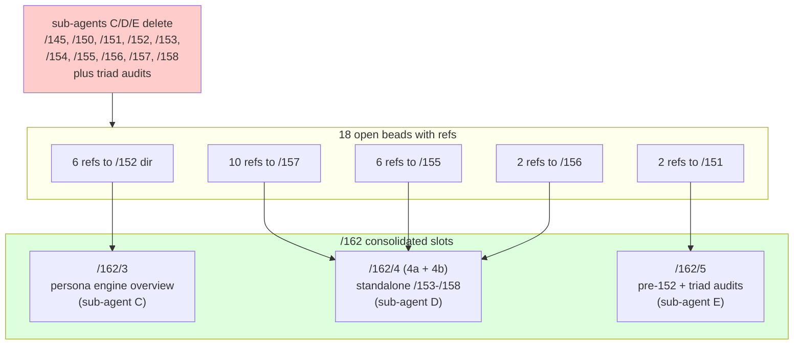

*Kind: Sweep + audit · Topic: bead references + operator contract-repo audit · Date: 2026-05-23*

# 6 — Bead reference sweep + operator contract-repo audit

## What this slice is

Slice 6 of `/162` (per `0-frame-and-method.md`). Two parts:

- **Part A (bead-reference sweep)** — sub-agents C, D, E retired
  several second-designer reports as part of this session's
  consolidation. Every open bead body that named a deleted report
  path gets an appended `bd note` pointing at the consolidated
  successor inside `/162`. Bead bodies are not rewritten (per the
  brief — conservative on the sweep, append notes only).
- **Part B (operator contract-repo audit)** — operator-landed code
  in the ten signal / owner-signal contract crates checked against
  `~/primary/skills/contract-repo.md`. The findings overlap heavily
  with sub-agent B's `/162/2` audit; this slice files the bead
  recommendations B identified but did not yet file, plus one
  net-new drift item B's audit missed.

## Part A — bead reference sweep

### Method

1. `bd list --json --status open --limit 0 > /tmp/beads.json` (193
   open beads, 36 referencing `second-designer/*`).
2. `jq` filter against descriptions for the targeted-delete report
   prefixes: `/145`, `/150`, `/151`, `/152`, `/153`, `/154`, `/155`,
   `/156`, `/157`, `/158`. Reports `/142`, `/144` were checked but
   no beads reference them.
3. Each matching bead got one `bd note <id> '<note>'` redirect, no
   body rewrite.
4. Beads pointing at `/161/*` (e.g. `primary-dxdk`, `primary-xcd5`)
   keep those references — `/161` is current and was not
   consolidated into `/162`.

### Redirects appended

| Bead | Old refs | Redirect note slot |
|---|---|---|
| primary-wdl6 (Spirit v0.1.0 protocol-aware build) | /156 | /162/4 |
| primary-bg9l (signal-frame LogSummary) | /155 | /162/4 |
| primary-l02o (signal-frame LogVariant autogen) | /155 | /162/4 |
| primary-wvdl (Persona port to current Signal stack) | /151 | /162/5 |
| primary-xcd5 (Design D multi-version routing E2E) | /155, /161/4 | /162/4 (/161/4 retained) |
| primary-k8cn (three-tier delivery E2E) | /155, /157 | /162/4 |
| primary-tfdj (quarantine gate prevents handover E2E) | /157 | /162/4 |
| primary-n9st (rejected Mirror produces typed Divergence) | /157 | /162/4 |
| primary-vjg3 (event-log replay rebuilds snapshot) | /152/1, /157 | /162/3, /162/4 |
| primary-fv2l (ActiveVersionChangeSource uniform projection) | /152/1, /157 | /162/3, /162/4 |
| primary-l9iz (quarantine policy gate enforcement) | /157 | /162/4 |
| primary-2ach (handover scans event log for VersionQuarantined) | /157 | /162/4 |
| primary-2o7p (owner-signal-version-handover ForceFlip integrity) | /157 | /162/4 |
| primary-g81p (ComponentName/ComponentPrincipal rename) | /152/2, /156 | /162/3, /162/4 |
| primary-2py5 (signal-sema LogVariant for SemaObservation) | /155 | /162/4 |
| primary-b86d (signal-frame observable three-tier extension) | /155 | /162/4 |
| primary-2chb (Deploy persona-orchestrate as user service) | /151 | /162/5 |
| primary-lfb0 (version-projection Identity blanket impl) | /157 | /162/4 |

Eighteen beads received redirect notes. The note text always names
the consolidation date (2026-05-23), the slot number inside `/162`,
and which sub-agent owns the consolidated file. Slot numbers map to
files in `reports/second-designer/162-contract-repo-lens-and-consolidation/`:

- `/162/3` = `3-consolidated-persona-engine-overview.md` (sub-agent C)
- `/162/4` = `4a-consolidated-design-rationale-archive.md` +
  `4b-consolidated-current-status.md` (sub-agent D)
- `/162/5` = `5-consolidated-pre-152-design-and-audits.md` (sub-agent E)

Readers landing on the deleted-path redirect ls the `/162` dir and
find the actual filename for the slot.

### Beads NOT touched

- `primary-dxdk` (cross-lane context sweep) — references `/161/3`,
  which remains current; no redirect needed.
- `primary-c0pp`, `primary-fwll`, `primary-rtz8`, `primary-7i6a`,
  `primary-bzgc`, `primary-8jpa`, `primary-ep45`, `primary-pibt`,
  `primary-hpj9`, `primary-54ti`, `primary-g3gm`, `primary-0m1u`,
  `primary-moxz`, `primary-wpnd`, `primary-dnxf`, `primary-x0qm` —
  reference `/159`, `/160`, or `/161` only (not in the
  consolidation scope).

## Part B — operator contract-repo audit

### Conformance overview

Audit pass against `~/primary/skills/contract-repo.md` on every
listed contract repo (`signal-frame`, `signal-sema`,
`signal-version-handover`, `owner-signal-version-handover`,
`signal-persona`, `signal-persona-engine-management`,
`owner-signal-persona`, `signal-persona-spirit`,
`signal-persona-mind`, `owner-signal-persona-spirit`). Every repo:

- has `ARCHITECTURE.md` present,
- depends only on rkyv + nota-codec + signal-frame (no `tokio`, no
  `kameo`, no `serde`),
- has at least `tests/round_trip.rs` (or topic-named test files),
- uses NOTA derives consistently,
- does not contain `path = "../sibling"` cross-crate deps.

Findings overlap with sub-agent B's `/162/2` audit. The lens is the
same discipline; this slice spotted no additional discipline drift
beyond what `/162/2` documented in its repo-by-repo table — with
**one exception**: `owner-signal-persona` Reply variants
(`Catalog`, `EngineStatus`, `ComponentStatus`, `ComponentMissing`)
are noun-form rather than verb-past, which `/162/2` rated CONFORMS.

### Bead recommendations B identified but did not file

Sub-agent B's `/162/2` proposed 16 beads. By the time this slice
ran, B had filed 8 of them (items 1-9, minus 10-16):

Filed by B (timestamps 21:37-21:39):

- `primary-ql6q` — signal-persona-mind migrate to signal-frame
- `primary-8fv8` — signal-persona-mind drop Mind namespace repetition
- `primary-onio` — signal-persona-mind variant naming pass
- `primary-18pr` — signal-version-handover op roots verb-form
- `primary-fjvi` — signal-version-handover reply verb-past
- `primary-amyw` — signal-version-handover canonical examples
- `primary-rl75` — owner-signal-version-handover HandoverSucceeded rename
- `primary-3uho` — owner-signal-version-handover per-op rejection
- `primary-27wg` — signal-persona-orchestrate reply rename pass

This slice filed the remaining gap items plus the net-new finding:

| New bead | Maps to | Notes |
|---|---|---|
| `primary-npn3` | /162/2 item 11 | engine-management Ready/NotReady/HealthReport rename to verb-past |
| `primary-u3i9` | /162/2 item 12 | engine-management drop Component* prefix |
| `primary-s51k` | /162/2 item 13 | engine-management StopAcknowledged → Stopped (or document) |
| `primary-j8p9` | /162/2 item 14 | signal-persona-mind canonical examples |
| `primary-lp6f` | /162/2 item 15 | signal-persona-orchestrate canonical examples |
| `primary-4ud1` | /162/2 item 16 | owner-signal-persona-mind canonical examples |
| `primary-trxa` | /162/2 item 10 | signal-persona-orchestrate retire prefixed aliases |
| `primary-38k6` | net-new (/162/6) | owner-signal-persona reply verb-past rename pass |

Total: eight new beads, all `P2`/`P3`, `role:operator,contract-discipline`.

### The one net-new finding — owner-signal-persona reply naming

Sub-agent B's `/162/2` table rated `owner-signal-persona` as
CONFORMS. The channel-root operations (`Launch`, `Query`, `Retire`,
`Start`, `Stop`) are verb-form and the lifecycle reply pair uses
the `Action*` precedent (`ActionAccepted`, `ActionRejected`). The
`Launched`, `LaunchRejected`, `Retired`, `RetireRejected` pairs are
clean verb-past.

But the **Query reply** family is noun-form:

```rust
reply Reply {
    Launched(LaunchAcceptance),
    LaunchRejected(LaunchRejection),
    Catalog(EngineCatalog),
    EngineStatus(EngineStatus),
    ComponentStatus(ComponentStatus),
    ComponentMissing(ComponentName),
    Retired(signal_persona_origin::EngineIdentifier),
    RetireRejected(RetirementRejection),
    ActionAccepted(ActionAcceptance),
    ActionRejected(ActionRejection),
}
```

`Catalog`, `EngineStatus`, `ComponentStatus`, and `ComponentMissing`
are noun-form, where per `contract-repo.md` §"Reply discipline"
success replies are verb-past matching the operation root
(`Query` → `Queried` or `Observed`).

Additional drift inside that same block:

- `EngineStatus(EngineStatus)` — exact stutter; the variant repeats
  its payload name. Per §"Common mistakes" Namespace-repeated-as-a-prefix
  rule, the enclosing `Owner` `Reply` enum supplies enough context.
- `ComponentStatus(ComponentStatus)` — same stutter.
- `ComponentMissing(ComponentName)` — noun-form variant naming a
  state ("the component is missing") rather than a verb-past
  outcome of the `Query` operation.

Filed as `primary-38k6` (P2) — rename the four variants to verb-past
plus de-stutter. Suggested target names: `CatalogObserved`,
`EngineStatusObserved`, `ComponentStatusObserved`,
`ComponentNotFound` — or whatever the daemon's actual Query outcome
shape favours.

### What this slice did NOT file

- **signal-persona-mind ARCH/code mismatch.** `/162/2` flagged the
  big drift (ARCH says "MUST IMPLEMENT — three-layer migration" but
  source still uses `signal_core` + Assert/Match/Mutate tags). B
  already filed `primary-ql6q` for this. Not duplicating.
- **Skill updates.** Sub-agent B also filed eleven `Skill update:`
  beads (zle8, jc91, 3jkm, ilel, c5sr, xaxv, 1uil, hy7b, 0obj,
  hfmu, 0190, 2xzv, ydbu, nzh8) per intents 165, 244, 251, 265,
  266, 273, 274, 280, 308, 311, 338. Those reflect contract-repo.md
  amendments — not operator drift, designer skill maintenance.
  Out of scope for this audit.
- **persona-orchestrate operator commit gap (`primary-e2bc`).**
  Already filed; an operator-report-gap bead, not a contract-repo
  discipline bead.

## Coordination with sub-agents C, D, E

Sub-agents C, D, E landed their consolidated reports during this
slice's run. The actual deletions confirmed:

| Sub-agent | Slot | Consolidated file | Reports retired |
|---|---|---|---|
| C | /162/3 | `3-consolidated-persona-engine-overview.md` | `/152/` meta-dir (9 files) |
| D | /162/4 | `4a-consolidated-design-rationale-archive.md` + `4b-consolidated-current-status.md` | `/153`, `/154`, `/155`, `/156`, `/157`, `/158` |
| E | /162/5 | `5-consolidated-pre-152-design-and-audits.md` | `/145`, `/150`, `/151`, plus triad audits in `/131`-`/144` range |

The redirect notes in Part A name slot numbers, not filenames —
that lets readers find the consolidated successor by `ls` even if
the file is renamed later. No bead body required rewriting; every
bead now carries an appended note pointing at the right slot.

Sub-agents A and B's reports (`/162/1`, `/162/2`) are slice-1-of-6
audits and remain — not consolidated targets.

## Bead recommendations (new beads filed in Part B)

| Bead | Title | Priority | Labels |
|---|---|---|---|
| primary-npn3 | signal-persona-engine-management: rename Ready/NotReady/HealthReport replies to verb-past | P2 | role:operator,contract-discipline |
| primary-u3i9 | signal-persona-engine-management: drop Component* namespace prefix from payload records | P2 | role:operator,contract-discipline |
| primary-s51k | signal-persona-engine-management: rename StopAcknowledged to Stopped (or document drain-pending semantics) | P3 | role:operator,contract-discipline |
| primary-j8p9 | signal-persona-mind: add examples/canonical.nota | P3 | role:operator,contract-discipline |
| primary-lp6f | signal-persona-orchestrate: add examples/canonical.nota | P3 | role:operator,contract-discipline |
| primary-4ud1 | owner-signal-persona-mind: add examples/canonical.nota | P3 | role:operator,contract-discipline |
| primary-trxa | signal-persona-orchestrate: retire prefixed type aliases (OrchestrateRequest etc.) | P2 | role:operator,contract-discipline |
| primary-38k6 | owner-signal-persona: rename Catalog/EngineStatus/ComponentStatus/ComponentMissing Query-reply variants to verb-past | P2 | role:operator,contract-discipline |

## Diagram



## How it fits

- `0-frame-and-method.md` — the frame + sub-agent contract
- `1-intent-vs-contract-repo-audit.md` — intent records audit (sub-agent A)
- `2-arch-commits-vs-contract-repo-audit.md` — ARCH + crate audit
  (sub-agent B; this slice files 8 of the gap items from B's table
  plus 1 net-new finding)
- `3-consolidated-persona-engine-overview.md` — /152 successor (sub-agent C)
- `4a-consolidated-design-rationale-archive.md` /
  `4b-consolidated-current-status.md` — /153-/158 successors (sub-agent D)
- `5-consolidated-pre-152-design-and-audits.md` — /145/150/151 + triads
  successor (sub-agent E)
- `~/primary/skills/contract-repo.md` — the audit lens
- `~/primary/skills/component-triad.md` — triad ownership rules
  (informed several bead bodies)
