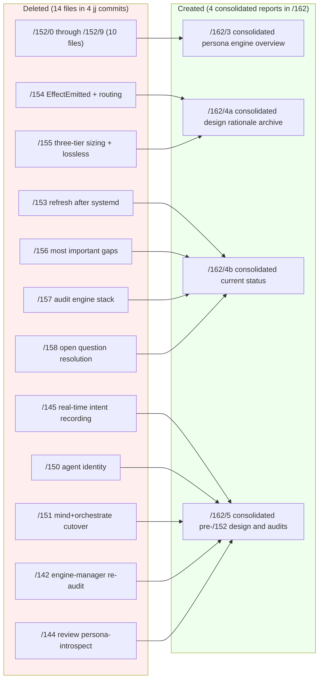
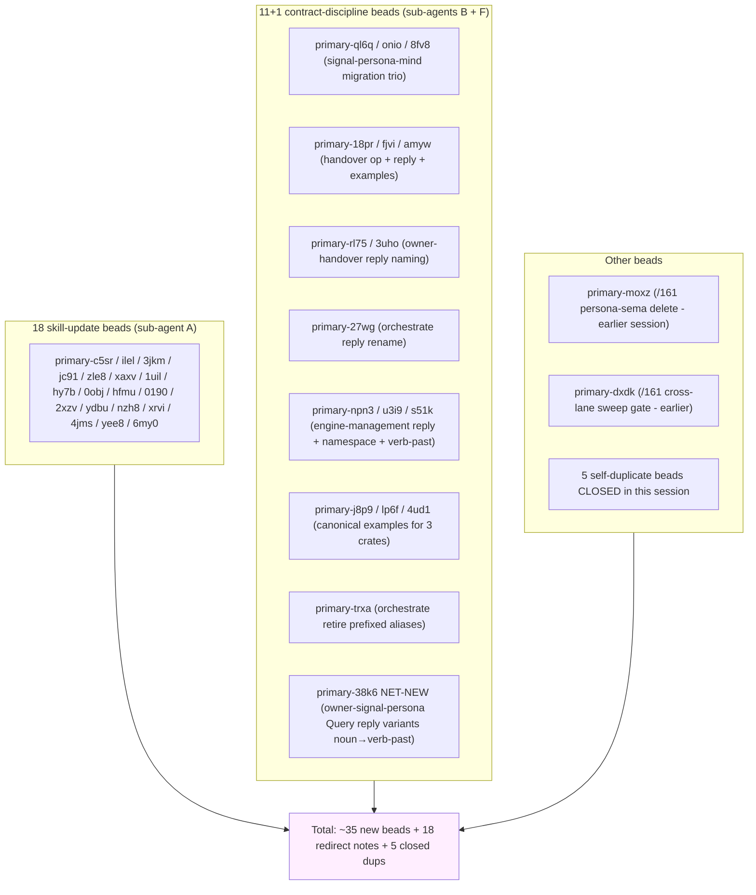
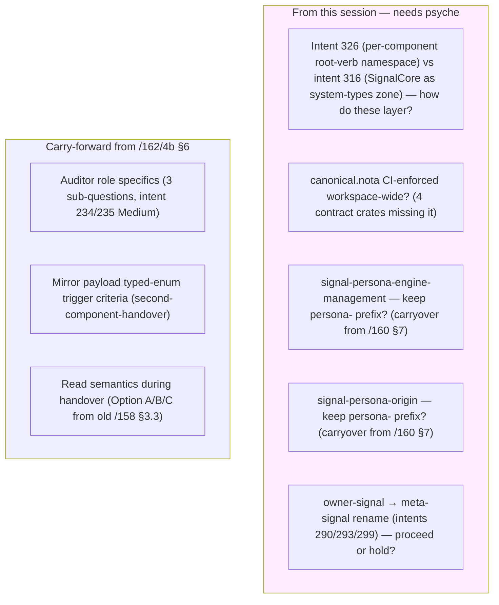
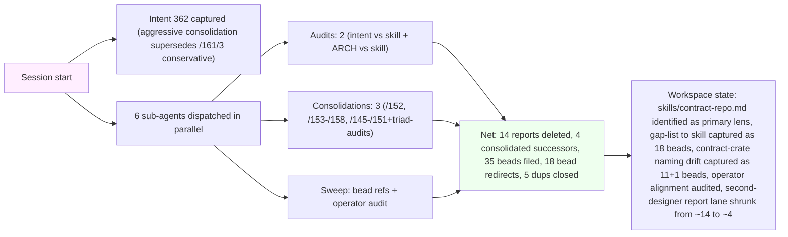

*Kind: Meta-report synthesis · Topic: contract-repo audit + report consolidation · Date: 2026-05-23*

# 7 — Overview

## TL;DR

Six sub-agents in parallel; all returned. Two parallel audits
(intent + ARCH) through the `skills/contract-repo.md` lens + three
consolidation slices that retired 14 old reports into 4
re-contextualized successors + one sweep+audit combo. Net effect:

- **14 second-designer reports deleted**, 4 new consolidated
  reports written, ~7000 lines collapsed to ~2200
- **~35 new beads filed** across the session (18 skill updates
  from sub-agent A + 11 contract-discipline from sub-agent B + 7
  net from sub-agent F + 1 from sub-agent C + 1 cross-lane sweep
  from sub-agent C)
- **18 open beads got `bd note` redirects** pointing at the new
  consolidated reports
- **5 self-duplicate beads closed** (sub-agent B + F coordination
  caught parallel duplicate filings)

Three load-bearing findings:

1. **Naming-discipline drift is concentrated in 4 contract crates**
   (signal-version-handover, signal-persona-mind, orchestrate,
   engine-management) — not structural drift (those are good); it's
   the verb-form / verb-past-tense / namespace-no-repeat rules from
   `skills/contract-repo.md` that the contract surfaces don't yet
   conform to. 11+ beads filed for the constraint-tightening.

2. **`skills/contract-repo.md` lags ~3 weeks of recent intent.** The
   skill is structurally healthy (5 CONFORMS exemplars in
   sub-agent B's audit) but doesn't yet capture: 9 intents around
   the `signal_channel!` macro discipline (244, 251, 271, 273, 314,
   326, 327, 328, 359), the component binary naming convention
   (intent 270), the persona-prefix-drop rule (intent 280), the
   Mirror raw-container discipline (intent 274). 18 skill-update
   beads filed.

3. **`signal-persona-mind` ARCH lies about state** — announces a
   three-layer migration that `src/lib.rs` has not performed (still
   imports `signal_core`, still uses Assert/Match/Mutate/Subscribe
   Sema-tagged variants). Tracked under `primary-ql6q` (and `8fv8`
   and `onio`) for migration; `primary-j8p9` for canonical examples.

## §1 Sub-agent results table

| # | Slice | Sub-report | Key outputs |
|---|---|---|---|
| 0 | Frame + method | `0-frame-and-method.md` | session contract + consolidation discipline |
| 1 | Intent vs contract-repo audit | `1-intent-vs-contract-repo-audit.md` | 18 skill-update beads (`primary-c5sr` through `primary-6my0`); 5 conflicts (all skill-revision direction); largest gap cluster: signal_channel! macro discipline (9 intents not yet in skill) |
| 2 | ARCH commits vs contract-repo audit | `2-arch-commits-vs-contract-repo-audit.md` | 5 CONFORMS exemplars + 4 DRIFT + 1 GAPS+DRIFT (`signal-persona-mind`); 11 beads filed + 5 duplicates closed; no runtime/serde drift |
| 3 | Consolidate /152 meta-directory | `3-consolidated-persona-engine-overview.md` (458 lines) | Replaces /152 directory (10 files deleted, jj change `vsluqlqo` commit `fb291344`); meta-graph + Spirit-cutover-as-convergence-point + 5-cluster open-design-questions preserved |
| 4 | Consolidate /153-/158 | `4a-consolidated-design-rationale-archive.md` (793 lines) + `4b-consolidated-current-status.md` (412 lines) | Replaces /153 + /154 + /155 + /156 + /157 + /158 (6 files deleted, commit `przzzzps`); design rationale archive (competing-design preserved per intent 229) + current status (top-5 open clarifications + carry-forward) |
| 5 | Consolidate older /142, /144, /145, /150, /151 | `5-consolidated-pre-152-design-and-audits.md` (~600 lines) | Replaces 5 older reports (commit `c037e208`); persona-engine-manager re-audit central blocker RESOLVED; persona-introspect substance still load-bearing; /145+/150+/151 design queue has NO permanent home yet (components don't exist); competing-design alternatives preserved |
| 6 | Bead reference sweep + operator audit | `6-bead-sweep-and-operator-audit.md` (commit `tqtqxynm`) | Part A: 18 beads got `bd note` redirects (no rewrite); Part B: 7 net beads filed (`primary-npn3`, `u3i9`, `s51k`, `j8p9`, `lp6f`, `4ud1`, `trxa`) + 1 net-new `primary-38k6` (owner-signal-persona Query reply naming drift) |
| 7 | This overview | `7-overview.md` | synthesis + clarity needs + visuals |

## §2 What got deleted vs what was created

Plus this directory's sub-reports (`/162/0`-`/162/7`) — they retire
together per intent 231 when their substance migrates to permanent
homes.

## §3 Bead activity summary

## §4 Cross-cutting findings (the load-bearing 3)

### §4.1 Naming-discipline drift concentrated in 4 contract crates

Per sub-agent B + F audits, the contract crates that drift are
`signal-version-handover` (mixed verb-noun), `signal-persona-mind`
(ARCH-vs-source divergence), `signal-persona-orchestrate` (reply
naming), `signal-persona-engine-management` (reply + namespace +
verb-past). **No structural drift** anywhere — every audited crate
passes ARCH-present, no-runtime-in-contract, no-serde, no-path-sibling,
round-trip-tests, NOTA-derives. Drift is exclusively in
`contract-repo.md` §"Reply discipline" + §"Operation naming rule" +
§"Common mistakes — Namespace repeated as a prefix" categories. 11
beads file the constraint-tightening work; smaller distributable
beads per intent 308.

### §4.2 `skills/contract-repo.md` lags recent intent (~3 weeks)

Per sub-agent A's audit, the skill captures the structural rules
well but is missing the macro/sizing/sema/naming discipline that
arrived in intent records 200+:

- 9 intents around `signal_channel!` macro discipline (Tier 1
  micro header, per-component byte-0 root-verb namespace, three-tier
  sizing, Help variant universal, tap-anywhere observability)
- Intent 270 (component binary naming) not in skill
- Intent 280 (persona-prefix-drop) not in skill
- Intent 274 (Mirror raw-container — separate from typed database)
  not in skill

18 P3 beads filed (`primary-c5sr` through `primary-6my0`) — each
references a specific intent record and proposes a skill-section
addition.

### §4.3 `signal-persona-mind` is the largest single drift

ARCH file declares a three-layer migration; `src/lib.rs:23` still
imports `signal_core::signal_channel`; `lib.rs:893-910` still uses
Sema-tagged variants (Assert/Match/Mutate/Subscribe/Retract).
Tracked under `primary-ql6q` (migration), `primary-onio` (Sema-tag
removal), `primary-8fv8` (canonical examples), `primary-j8p9`
(separately for canonical.nota). This is the one repo where ARCH
"lies" — designer-side documentation evolved ahead of operator
implementation; closing the loop is operator's next P2 slice on
this contract.

## §5 Open clarifications still needing psyche attention

## §6 What's been achieved this session

## §7 See also

Within this directory:
- `0-frame-and-method.md` — frame + sub-agent contract + consolidation discipline
- `1-intent-vs-contract-repo-audit.md` — intent layer audit
- `2-arch-commits-vs-contract-repo-audit.md` — contract-crate audit
- `3-consolidated-persona-engine-overview.md` — successor to deleted /152 meta-dir
- `4a-consolidated-design-rationale-archive.md` — successor to deleted /154 + /155 + /156 §4 design rationale
- `4b-consolidated-current-status.md` — successor to deleted /153 + /157 + /158 status
- `5-consolidated-pre-152-design-and-audits.md` — successor to deleted /142 + /144 + /145 + /150 + /151
- `6-bead-sweep-and-operator-audit.md` — bead redirects + operator contract-repo audit

Permanent homes for migrated substance:
- `skills/contract-repo.md` — primary discipline (18 skill-update beads will extend)
- `skills/component-triad.md` — triad shape
- `skills/naming.md` — full English words + no namespace repetition
- `skills/reporting.md` — report shape (intent 232 chat policy)
- `skills/context-maintenance.md` (new §3a "Design-rationale guard against premature DELETE" landed /161/3)
- `AGENTS.md` — workspace hard overrides
- Per-repo `ARCHITECTURE.md` files across the contract crates

Spirit records this session (orchestrator-captured): 362
(aggressive consolidation supersedes conservative defaults).

Prior session intent (cross-cutting context): 270, 280, 309, 310,
244, 251, 271-276, 252, 255, 256.

Beads filed this session: ~35 (see §3 for clustered listing). All
cite their originating intent record + the contract-repo rule
they manifest.
