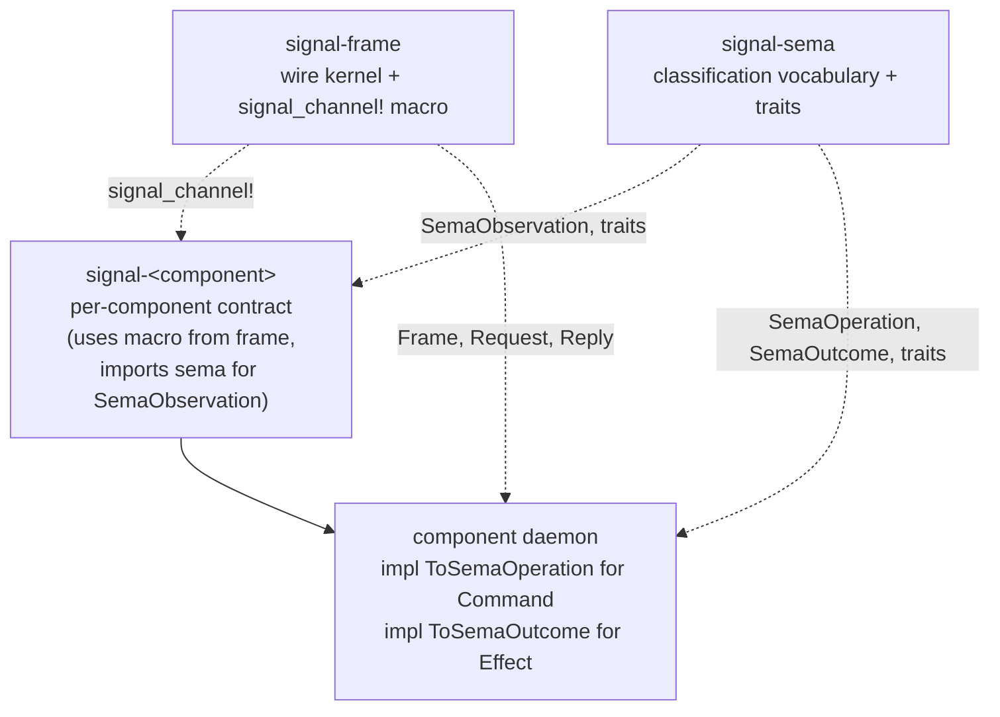
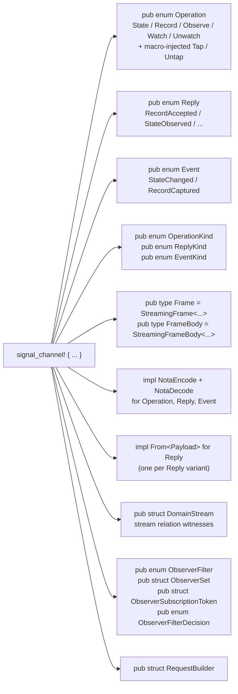
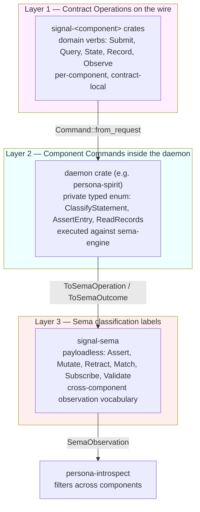
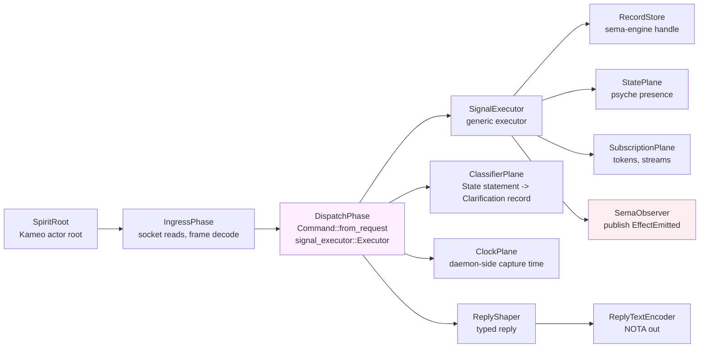
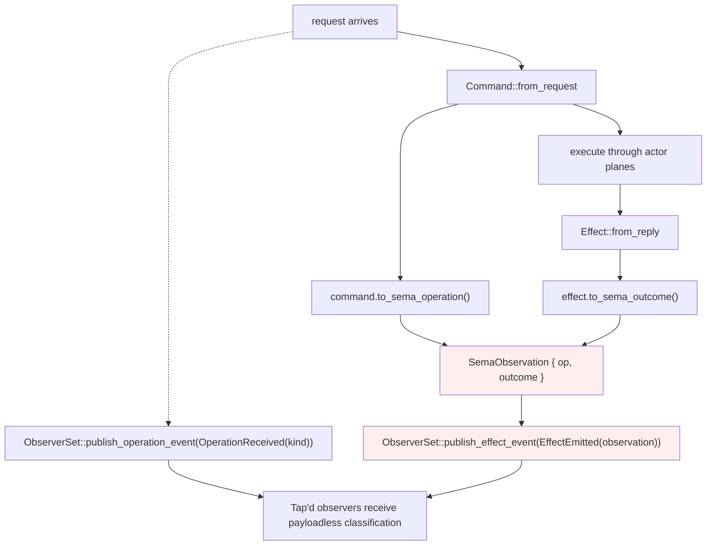
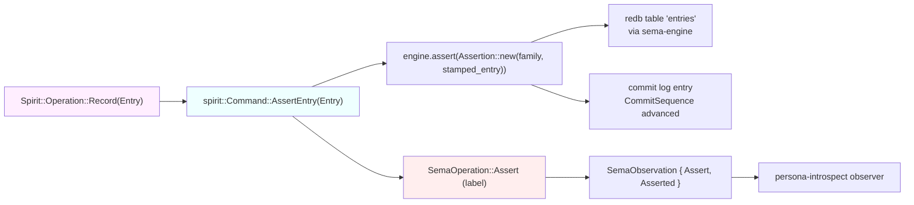

# Signal and Sema — interaction model + Spirit as the worked example

*Second-designer report — how `signal-frame` and `signal-sema`
interact, whether they both use macros, and the full architecture
of `persona-spirit` viewed through both lenses with code excerpts.*

Date: 2026-05-24
Lane: second-designer
Author intent: psyche prompt — "I want a report on how signal and
sema interact. do they both use a macro? show me the full
architecture of spirit from the signal and sema perspective, with
visuals and the actual code."

## 1 · TL;DR

**Only `signal-frame` has a macro.** `signal_channel!` lives in
the sibling proc-macro crate `signal-frame-macros` and is
re-exported from `signal-frame`. `signal-sema` has no macro — it
is a small library of closed enums (`SemaOperation`, `SemaOutcome`,
`SemaObservation`), traits (`ToSemaOperation`, `ToSemaOutcome`),
and helper types (`Magnitude`, `Slot<T>`, `Revision`,
`PatternField<T>`).

**The two crates are dependency-disjoint.** `signal-sema` does not
depend on `signal-frame`. Per-component contract crates depend on
both — `signal-frame` for the wire kernel and `signal_channel!`,
`signal-sema` for the classification vocabulary that daemons project
into. The two cooperate through *traits implemented in daemon code*,
not through direct crate coupling.



**Spirit's three-layer model in one breath.** The contract crate
(`signal-persona-spirit`) names domain verbs — `State`, `Record`,
`Observe`, `Watch`, `Unwatch`, plus macro-injected `Tap`/`Untap`.
The daemon (`persona-spirit`) defines a private `Command` enum
(`ClassifyStatement`, `AssertEntry`, `ReadRecords`, …) and a
private `Effect` enum, and implements `ToSemaOperation for Command`
+ `ToSemaOutcome for Effect`. When a request lands, the daemon
lowers `WorkingOperation → Command`, executes through Kameo actor
planes + `sema-engine`, and publishes a payloadless
`SemaObservation { operation, outcome }` to the observable
surface — `persona-introspect` and any other observer reads
classification only, never executable payloads.

## 2 · The macro story — what `signal_channel!` does and doesn't

### 2.1 · Where it lives

`signal-frame/src/lib.rs` re-exports the proc-macro from a sibling
crate:

```rust
pub use signal_frame_macros::signal_channel;
```

The proc-macro itself sits in `signal-frame/macros/src/lib.rs`:

```rust
#[proc_macro]
pub fn signal_channel(input: TokenStream) -> TokenStream {
    let spec = parse_macro_input!(input as ChannelSpec);
    if let Err(error) = validate::validate(&spec) {
        return error.into_compile_error().into();
    }
    emit::emit(&spec).into()
}
```

Five files break out the work: `parse.rs` (syn parser, 301 lines),
`model.rs` (ChannelSpec / StreamBlockSpec, 115 lines),
`validate.rs` (semantic checks + span-pointed diagnostics, 392
lines), and `emit.rs` (the 1085-line quote! output that does all
the actual emission).

### 2.2 · `signal-sema` is macro-free

`signal-sema/src/` has six modules — `operation.rs`, `outcome.rs`,
`magnitude.rs`, `pattern.rs`, `identity.rs`, `lib.rs` — and they
are all plain Rust definitions with `NotaEnum` / `NotaRecord` /
rkyv derives. There is no `sema_channel!` or equivalent. The crate
deliberately stays small and free of compile-time machinery; its
job is to publish the closed classification enums and the trait
contracts that daemons implement.

This asymmetry is structural. The wire kernel benefits from a
macro because every channel emits the same shape (operation enum,
reply enum, event enum, kind enums, frame aliases, codec impls,
observer scaffolding); the classification vocabulary is a single
closed set of variants used directly by every daemon, with no
per-channel variation to generate.

### 2.3 · Macro input → macro output

Macro input — a single declaration block per channel:

```text
signal_channel! {
    channel Spirit {
        operation State(Statement),
        operation Record(Entry),
        operation Observe(Observation),
        operation Watch(Subscription) opens DomainStream,
        operation Unwatch(SubscriptionToken),
    }
    reply Reply { /* ... */ }
    event Event { /* ... */ }
    stream DomainStream { /* ... */ }
    observable {
        filter default;
        operation_event OperationReceived;
        effect_event EffectEmitted;
    }
}
```

Macro output — the emitted items (names unprefixed by channel; the
crate or a module disambiguates if a crate carries multiple
channels):



What the macro deliberately does NOT emit (per the macros
`lib.rs` rustdoc): "actors, sockets, storage, routing, policy
closures, daemon code, or hidden runtime behaviour." The macro
shapes the **wire surface**; the daemon supplies everything else.

### 2.4 · The `observable` block is the bridge to sema

When a channel declares an `observable { … }` block (mandatory
for persona components per the three-layer model affirmed
2026-05-20), the macro auto-injects two operations and the
publishing infrastructure for them:

- `Tap(<FilterType>)` operation — opens an observer subscription
  with a typed filter.
- `Untap(ObserverSubscriptionToken)` operation — closes one.
- `ObserverSubscriptionOpened` reply variant — the typed open ack.
- An `ObserverStream` stream relation tying Tap → events → Untap.
- An `ObserverSet` runtime struct with `publish_operation_event(…)`
  and `publish_effect_event(…)` methods the daemon calls.
- (When `filter default;`) a closed `ObserverFilter` enum with
  matching `ObserverFilterDecision` impl.

The contract declares which payload types name the operation event
and effect event:

```rust
observable {
    filter default;
    operation_event OperationReceived;     // carries OperationKind
    effect_event   EffectEmitted;          // carries SemaObservation
}
```

`OperationReceived` is the *what just came in* tag — the daemon
publishes one per request entering dispatch. `EffectEmitted` is
the *what just resolved* tag — the daemon publishes one per
successful execution, carrying a `SemaObservation` from
`signal-sema`. **That `EffectEmitted` payload is the sema bridge:
the macro emits the publication infrastructure, the daemon
populates the payload via the `ToSemaOperation` + `ToSemaOutcome`
traits, and observers receive classification labels with no
component-private data.**

Forward direction: per spirit record 359, `signal_channel!`
will deepen to embed the 64-bit short header by default,
standardize the two-enum-namespace shape (ordinary + owner
contracts sharing byte 0 namespace via golden-ratio split per
intent 327), derive the short header from the macro
directly (no hand-impl needed), and inject a `Help` variant on
every enum (positioned at the END of the path per intents
363-365). The current macro emits the Tier 1 / Tier 2 trait
scaffolding (per `signal-frame/ARCHITECTURE.md` §5) but the
per-channel autogen of the short-header marker is tracked under bead
`primary-l02o` (signal-frame: LogVariant trait + autogen derive
macro) and not yet shipped.

## 3 · The three-layer model

The architecture explicitly separates wire vocabulary, daemon
execution, and cross-component classification:



Three concerns, three vocabularies:

| Layer | Owns | Example for Spirit |
|---|---|---|
| 1. Contract Operation | what the *caller* invokes — domain action | `State(Statement)`, `Record(Entry)`, `Observe(Records(…))` |
| 2. Component Command | what the daemon *executes* — typed record | `Command::ClassifyStatement(Statement)`, `Command::AssertEntry(Entry)`, `Command::ReadRecords(RecordObservation)` |
| 3. Sema classification | what observers *see* — class label only | `SemaOperation::Assert`, `SemaOperation::Match`, `SemaOperation::Subscribe`, `SemaOperation::Retract` |

The closed Layer 3 set (from `signal-sema/src/operation.rs`):

```rust
pub enum SemaOperation {
    Assert,     // appended a new typed fact/event/row
    Mutate,     // transitioned a record at stable identity
    Retract,    // tombstoned/removed a typed record
    Match,      // pattern/range/key read
    Subscribe,  // opened a state-plus-delta stream
    Validate,   // dry-ran an operation without commit
}
```

…paired with the closed outcome set (from
`signal-sema/src/outcome.rs`):

```rust
pub enum SemaOutcome {
    Asserted, Mutated, Retracted,
    Matched, Subscribed, Validated,
    NoChange,                    // request completed but no observable state changed
}

pub struct SemaObservation {
    operation: SemaOperation,
    outcome:   SemaOutcome,
}
```

`SemaObservation` is the cross-cutting Tier 1 / Tier 2 observation
unit (per `signal-sema/ARCHITECTURE.md` §"SemaObservation as a
Tier-2-shaped type") — small, universal, classification-only. Its
LogVariant projection (8 bytes) packs sema kind in byte 0, outcome
in byte 1, component tag in byte 2, operation class in byte 3,
sub-detail in byte 4, and a 24-bit timing/sequence suffix.

## 4 · Spirit Layer 1 — the contract crate

### 4.1 · The `signal_channel!` declaration

Heart of `signal-persona-spirit/src/lib.rs` — the actual macro
invocation that defines Spirit's wire surface:

```rust
use signal_frame::signal_channel;
use signal_sema::{Magnitude, SemaObservation};

// ... record type definitions (Entry, Statement, Observation, ...) ...

signal_channel! {
    channel Spirit {
        operation State(Statement),
        operation Record(Entry),
        operation Observe(Observation),
        operation Watch(Subscription) opens DomainStream,
        operation Unwatch(SubscriptionToken),
    }
    reply Reply {
        RecordAccepted(RecordAccepted),
        StateObserved(StateObserved),
        RecordsObserved(RecordsObserved),
        RecordProvenancesObserved(RecordProvenancesObserved),
        TopicsObserved(TopicsObserved),
        QuestionsObserved(QuestionsObserved),
        SubscriptionOpened(SubscriptionOpened),
        SubscriptionRetracted(SubscriptionRetracted),
        RequestUnimplemented(RequestUnimplemented),
    }
    event Event {
        StateChanged(StateChanged) belongs DomainStream,
        RecordCaptured(RecordCaptured) belongs DomainStream,
    }
    stream DomainStream {
        token SubscriptionToken;
        opened SubscriptionOpened;
        event StateChanged;
        event RecordCaptured;
        close Unwatch;
    }
    observable {
        filter default;
        operation_event OperationReceived;
        effect_event EffectEmitted;
    }
}
```

Note the two imports at top: `signal_channel` from `signal-frame`
(the macro), `Magnitude` + `SemaObservation` from `signal-sema`
(the classification types). Both crates are used; neither depends
on the other.

### 4.2 · The full contract surface (Layer 1 → Layer 3 projection)

| Layer 1 operation | Layer 1 payload | Layer 3 projection |
|---|---|---|
| `State` | `Statement` | `Assert` |
| `Record` | `Entry` (no client timestamp) | `Assert` |
| `Observe` (State) | `Observation::State` | `Match` |
| `Observe` (Records) | `Observation::Records(RecordQuery)` | `Match` |
| `Observe` (Topics) | `Observation::Topics` | `Match` |
| `Observe` (Questions) | `Observation::Questions` | `Match` |
| `Watch` (State) | `Subscription::State` | `Subscribe` |
| `Watch` (Records) | `Subscription::Records(RecordSubscription)` | `Subscribe` |
| `Unwatch` (State) | `StateSubscriptionToken` | `Retract` |
| `Unwatch` (Records) | `RecordSubscriptionToken` | `Retract` |
| `Tap` (macro-injected) | `ObserverFilter` | `Subscribe` |
| `Untap` (macro-injected) | `ObserverSubscriptionToken` | `Retract` |

The Layer 3 column is computed *inside the daemon* at observation
publish time. The wire form carries the contract-local verb only;
nothing in `signal-persona-spirit` mentions `Assert` /
`Match` / `Subscribe` / `Retract` on the wire surface itself.

### 4.3 · A typed payload using sema's `Magnitude`

`Entry` is the canonical illustration of how a contract record
uses one of sema's leaf types directly:

```rust
#[derive(Archive, RkyvSerialize, RkyvDeserialize, NotaRecord, Debug, Clone, PartialEq, Eq)]
pub struct Entry {
    pub topic:     Topic,
    pub kind:      Kind,
    pub summary:   Summary,
    pub context:   Context,
    pub certainty: Magnitude,    // <-- imported from signal-sema
    pub quote:     Quote,
}
```

`Magnitude` (currently seven ordered rungs `Minimum` through
`Maximum`, widening to add `Unknown`) is a workspace-universal
qualitative strength scale. Per `signal-sema/ARCHITECTURE.md`
§"Qualitative Magnitude" the **field name carries the dimension;
type carries the scale** — Spirit names this field `certainty`
because in Spirit's domain `Magnitude` denotes how certain the
psyche was; another component might name a `Magnitude` field
`priority` or `severity`.

## 5 · Spirit Layer 2 — the daemon

### 5.1 · Component Command + Effect

`persona-spirit/src/observation.rs` defines the daemon's
private typed Command and Effect enums:

```rust
use signal_sema::{SemaObservation, SemaOperation, SemaOutcome,
                  ToSemaOperation, ToSemaOutcome};

pub enum Command {
    ClassifyStatement(Statement),
    AssertEntry(signal_persona_spirit::Entry),
    ReadRecords(RecordObservation),
    ReadTopics,
    ReadState,
    ReadQuestions,
    OpenStateSubscription,
    OpenRecordSubscription(RecordSubscription),
    CloseStateSubscription(StateSubscriptionToken),
    CloseRecordSubscription(RecordSubscriptionToken),
    OpenObserverSubscription(ObserverFilter),
    CloseObserverSubscription(ObserverSubscriptionToken),
}

pub enum Effect {
    RecordAccepted(RecordAccepted),
    StateObserved(StateObserved),
    RecordsObserved(RecordsObserved),
    RecordProvenancesObserved(RecordProvenancesObserved),
    TopicsObserved(TopicsObserved),
    QuestionsObserved(QuestionsObserved),
    SubscriptionOpened(SubscriptionOpened),
    SubscriptionRetracted(SubscriptionRetracted),
    ObserverSubscriptionOpened(ObserverSubscriptionOpened),
    RequestUnimplemented(RequestUnimplemented),
}
```

These live entirely in daemon code. The contract never sees them
on the wire; the executor only ever takes a typed payload from
Layer 1 and lowers it.

### 5.2 · The lowering — `Command::from_request`

The bridge from Layer 1 to Layer 2. Each `WorkingOperation`
variant maps to exactly one `Command`:

```rust
impl Command {
    pub fn from_request(request: WorkingOperation) -> Option<Self> {
        match request {
            WorkingOperation::State(statement)    => Some(Self::ClassifyStatement(statement)),
            WorkingOperation::Record(entry)       => Some(Self::AssertEntry(entry)),
            WorkingOperation::Observe(Observation::Records(query)) => {
                Some(Self::ReadRecords(RecordObservation { query }))
            }
            WorkingOperation::Observe(Observation::Topics)    => Some(Self::ReadTopics),
            WorkingOperation::Observe(Observation::State)     => Some(Self::ReadState),
            WorkingOperation::Observe(Observation::Questions) => Some(Self::ReadQuestions),
            WorkingOperation::Watch(Subscription::State)      => Some(Self::OpenStateSubscription),
            WorkingOperation::Watch(Subscription::Records(s)) => Some(Self::OpenRecordSubscription(s)),
            WorkingOperation::Unwatch(SubscriptionToken::State(t))   => Some(Self::CloseStateSubscription(t)),
            WorkingOperation::Unwatch(SubscriptionToken::Records(t)) => Some(Self::CloseRecordSubscription(t)),
            WorkingOperation::Tap(filter)         => Some(Self::OpenObserverSubscription(filter)),
            WorkingOperation::Untap(token)        => Some(Self::CloseObserverSubscription(token)),
        }
    }
}
```

The match is exhaustive over `WorkingOperation`'s variants — the
type system enforces that every wire operation has a daemon
command. Adding a new contract operation forces a compile-time
update here.

### 5.3 · The classification — `ToSemaOperation for Command`

The Layer 2 → Layer 3 projection. Every `Command` maps to one of
the six closed Sema classes:

```rust
impl ToSemaOperation for Command {
    fn to_sema_operation(&self) -> SemaOperation {
        match self {
            Self::ClassifyStatement(_) | Self::AssertEntry(_) => SemaOperation::Assert,
            Self::ReadRecords(_)
              | Self::ReadTopics
              | Self::ReadState
              | Self::ReadQuestions                            => SemaOperation::Match,
            Self::OpenStateSubscription
              | Self::OpenRecordSubscription(_)
              | Self::OpenObserverSubscription(_)              => SemaOperation::Subscribe,
            Self::CloseStateSubscription(_)
              | Self::CloseRecordSubscription(_)
              | Self::CloseObserverSubscription(_)             => SemaOperation::Retract,
        }
    }
}

impl ToSemaOutcome for Effect {
    fn to_sema_outcome(&self) -> SemaOutcome {
        match self {
            Self::RecordAccepted(_)                            => SemaOutcome::Asserted,
            Self::StateObserved(_)
              | Self::RecordsObserved(_)
              | Self::RecordProvenancesObserved(_)
              | Self::TopicsObserved(_)
              | Self::QuestionsObserved(_)                     => SemaOutcome::Matched,
            Self::SubscriptionOpened(_)
              | Self::ObserverSubscriptionOpened(_)            => SemaOutcome::Subscribed,
            Self::SubscriptionRetracted(_)                     => SemaOutcome::Retracted,
            Self::RequestUnimplemented(_)                      => SemaOutcome::NoChange,
        }
    }
}
```

These two impls *are* the sema integration. Everything else —
Kameo actor planes, sema-engine storage, NOTA codec, socket
ingress — is plumbing. The trait impls are the entire semantic
bridge between Spirit's domain vocabulary and the workspace's
classification vocabulary.

### 5.4 · Actor topology — where the lowering happens



`DispatchPhase` is the boundary: it lowers contract operations
into Spirit-local `Command` values via `Command::from_request`,
hands them to `signal-executor::Executor` (a generic per-component
runtime parameterized over the daemon's Command type), and the
executor drives the actor planes. After successful execution,
`SemaObserver` publishes a payloadless `SemaObservation` to the
observable surface.

From `persona-spirit/src/actors/dispatch.rs`:

```rust
use signal_executor::{Executor, ...};

// inside DispatchPhase setup:
let command_executor = SpiritCommandExecutor::new(/* store, state, subscription planes */);
let mut executor     = Executor::new(SpiritLowering, command_executor, observers);
```

The `signal-executor` crate is the workspace's generic
command-executor runtime — it does the "lower contract op →
execute command → publish observation" loop generically, and each
component plugs in its own `Lowering` and `CommandExecutor` impls.
The full executor is outside this report's scope; the point is
that it's where Spirit's `ToSemaOperation` impl is consulted.

## 6 · Lifetime of a `(Record (workspace Decision …))` request

The complete cross-layer flow for the canonical operation —
recording an intent entry through the Spirit CLI:

```mermaid
sequenceDiagram
    participant Agent as agent CLI
    participant Cli as spirit binary
    participant Sock as ordinary socket
    participant Daemon as persona-spirit daemon
    participant Disp as DispatchPhase
    participant Exec as signal-executor
    participant Store as RecordStore + sema-engine
    participant Obs as SemaObserver
    participant Sub as ObserverSet subscribers

    Agent->>Cli: spirit '(Record (workspace Decision "..." "..." Maximum "..."))'
    Note over Cli: Layer 1 — contract verb decode
    Cli->>Cli: NOTA decode to signal_persona_spirit::Operation
    Cli->>Sock: length-prefixed RKYV Frame
    Sock->>Daemon: bytes arrive on ordinary socket
    Daemon->>Disp: SubmitRequest(Operation::Record(Entry))

    Note over Disp: Layer 2 — Command lowering
    Disp->>Disp: Command::from_request(op) -> Command::AssertEntry(entry)
    Disp->>Exec: execute(Command::AssertEntry(entry))
    Exec->>Store: clock.stamp(); store.write(StampedEntry)
    Store-->>Exec: RecordAccepted(RecordIdentifier)
    Exec->>Exec: Effect::RecordAccepted(payload)

    Note over Obs: Layer 3 — sema projection
    Exec->>Obs: publish(command, effect)
    Obs->>Obs: command.to_sema_operation()  -> SemaOperation::Assert
    Obs->>Obs: effect.to_sema_outcome()     -> SemaOutcome::Asserted
    Obs->>Obs: SemaObservation { Assert, Asserted }
    Obs->>Sub: EffectEmitted { observation } broadcast

    Disp-->>Daemon: Reply::RecordAccepted(payload)
    Daemon-->>Sock: length-prefixed RKYV Reply
    Sock-->>Cli: bytes
    Cli-->>Agent: NOTA encode -> "(RecordAccepted (...))"
```

Three things to notice:

1. **Layer 1 stays on the wire.** The bytes Spirit's socket sees
   are typed `signal-persona-spirit::Operation::Record(Entry)`
   inside a `signal-frame::Frame`. No `Assert` token appears.
2. **Layer 2 is private.** `Command::AssertEntry` exists only in
   daemon memory; no peer sees it. It carries the typed payload
   that the engine actually executes.
3. **Layer 3 fans out via the observable surface.** The
   `EffectEmitted` payload carrying `SemaObservation { Assert,
   Asserted }` goes to *every Tap-subscribed observer* —
   `persona-introspect`, debug dashboards, audit pipelines.
   Crucially, **the observation carries no Entry payload** —
   only the classification. An introspect aggregator sees "Spirit
   asserted" without seeing what Spirit asserted.

## 7 · The observable surface — automatic sema bridge

The macro-injected observable surface IS the place where sema and
signal meet at runtime. The contract says:

```rust
observable {
    filter default;
    operation_event OperationReceived;     // payload: OperationKind
    effect_event   EffectEmitted;          // payload: SemaObservation
}
```

…and the macro emits an `ObserverSet` runtime that the daemon
calls into:



The contract author writes two lines (`operation_event …` /
`effect_event …`), the macro emits the publishing scaffold, the
daemon's `ToSemaOperation` + `ToSemaOutcome` impls populate the
`SemaObservation`, and observers across the workspace get a
uniform classification stream. This is the architectural payoff
of keeping sema decoupled from frame: **any future component can
plug into the same observation vocabulary by writing the same two
trait impls**, with no changes to either signal-frame or
signal-sema.

## 8 · sema-engine — the storage half of the partnership

`sema-engine` is a separate library crate that does the actual
typed-database work. It depends on `signal-sema` (for the closed
`SemaOperation` set), on `sema` (the redb storage kernel), and
historically on `signal-core` (the old name of `signal-frame`,
used only for the `NonEmpty` utility — the dependency name in
sema-engine's ARCH is stale; should now be `signal-frame`).

From `sema-engine/ARCHITECTURE.md`:

> `Engine::commit` takes the engine-native `CommitRequest<RecordValue>`
> whose non-empty `Vec<WriteOperation<RecordValue>>` is the atomic
> unit for one registered table. Atomicity is **structural** — the
> commit's operation sequence is the boundary, not a separate
> operation.

Worked example of the engine surface a daemon uses:

```rust
let mut engine = Engine::open(EngineOpen::new(database_path, SchemaVersion::new(1)))?;
let family = engine.register_table(TableDescriptor::new(TableName::new("thoughts")))?;

engine.assert(Assertion::new(family.clone(), new_thought))?;
engine.mutate(Mutation::new(family.clone(), updated_thought))?;
engine.retract(Retraction::new(family.clone(), retired_key))?;

engine.commit(
    CommitRequest::new(family.clone())
        .assert(new_thought)
        .mutate(updated_thought)
        .retract(retired_key),
)?;

let snapshot   = engine.match_records(QueryPlan::all(family.clone()))?;
let validation = engine.validate(QueryPlan::all(family.clone()))?;
let _log       = engine.commit_log_range(SequenceRange::from(snapshot.snapshot()))?;
let _sub       = engine.subscribe(QueryPlan::all(family.clone()), sink)?;
```

The methods (`assert`, `mutate`, `retract`, `match_records`,
`validate`, `subscribe`) are typed Rust functions whose names
mirror the six `SemaOperation` variants. The engine consumes
those six classes as its API; the daemon's `Command` enum is
the typed parameter to those calls.

So the full picture of how a Spirit `Record` operation interacts
with the layered crates:



Note the parallelism: the `SemaOperation::Assert` label and the
`engine.assert(…)` typed call both come from the same Command,
through different traits. One is the classification surface for
observation; the other is the storage surface for persistence.
They never go through each other — the daemon talks to both
directly.

## 9 · CLI dispatch — `signal_cli!` ties the binary surface

The `spirit` CLI binary is one line, courtesy of another macro
in `signal-frame`:

```rust
// src/bin/spirit.rs
signal_frame::signal_cli!(spirit, signal_persona_spirit);
```

This expands to:

- A `main()` that takes exactly one argv (per the single-argument
  rule from `skills/component-triad.md`).
- Argument resolution: starts-with-`(` → inline NOTA; otherwise
  → path to NOTA file.
- Head-peek dispatch: parses the NOTA record head, looks it up
  in a generated route table for both ordinary
  (`signal-persona-spirit`) AND owner
  (`owner-signal-persona-spirit`) contracts, selects the matching
  socket from `PERSONA_SPIRIT_SOCKET` or `PERSONA_SPIRIT_OWNER_SOCKET`.
- Full typed decode against the selected contract.
- `Caller::from_kernel()` injection — best-effort parent-process
  context.
- Length-prefixed Frame send.
- Reply receive, NOTA encode, stdout write.

The CLI is "eventually obsolete machinery" per the triad
discipline — once peer daemons speak Signal directly to one
another, the CLI's text-bridge role retires. Today it remains
the agent-side substrate for hand-driven intent capture.

## 10 · Open follow-ons + caveats

### 10.1 · sema-engine doc lag

`sema-engine/ARCHITECTURE.md` still names its dependency as
`signal-core` (the pre-rename name). The crate is now
`signal-frame`. The dependency itself is just the `NonEmpty`
utility — minor lag, doc-only fix. Bead-worthy if not already
tracked.

### 10.2 · Macro deepening per intent 359

The current `signal_channel!` emits the Operation/Reply/Event
enums, kind enums, frame aliases, codec, conversion impls, and
the observable scaffolding when an `observable { … }` block is
present. Per spirit record 359 (2026-05-24) the macro is
directed to:

- Embed the 64-bit short header in every emitted
  channel by default.
- Standardize the two-enum-namespace shape — ordinary +
  owner contracts share a byte-0 namespace via golden-ratio
  split, with compile-time agreement enforcement.
- Auto-derive the short-header small-object recognition (no
  hand-impl needed).
- Inject a `Help` variant on EVERY enum (not just top-level
  Operation), positioned at the END of the path per intents
  363-365: `(Spirit Help)`, `(Spirit (Record Help))`,
  `(Spirit (Record (Slot1 (Workspace Help))))`.

Tracking beads: `primary-l02o` (LogVariant trait + autogen
derive macro). Designer report
`/305-v2-design-64bit-signal-per-component-namespacing.md` and
`/307-design-golden-ratio-namespace-split.md` carry the design.

### 10.3 · Spirit's degenerate atomicity

Per `persona-spirit/ARCHITECTURE.md`, Spirit's current execution
shape is one operation per request, lowering to exactly one
command, with multi-operation batches and multi-command operation
plans REJECTED before any command runs. The witness test
(`persona_spirit_daemon_rejects_multi_operation_batches_before_any_commit`)
returns `BatchAborted` with `NotCommitted`. Atomic execution for
multi-operation batches lands when the store layer supports atomic
batch execution.

### 10.4 · Mind forwarding still TODO

Status: Spirit owns the working state for psyche presence + intent
records + pending questions, and serves the contract surface fully
for those, but **owner-Mutate forwarding to mind** is not yet
implemented. The architectural slot for it (in `OwnerPlane` and
in `owner-signal-persona-spirit`) exists; the cross-component wire
is pending. This is the next architectural step before
spirit-to-mind cognitive flow operates end-to-end.

## 11 · Code map summary

| Crate | Purpose | Macro? | Key types |
|---|---|---|---|
| `signal-frame` | wire kernel — Frame, Request, Reply, exchange identifiers | **yes** — re-exports `signal_channel!` and `signal_cli!` from sibling proc-macro crate | `ExchangeFrame`, `StreamingFrame`, `Request`, `Reply`, `SubReply`, `Caller`, `LogVariant`/`LogSummary` traits |
| `signal-frame/macros` | proc-macro implementation | proc-macro crate (the macro lives HERE) | `signal_channel`, `signal_cli` |
| `signal-sema` | classification vocabulary + helpers | **no** | `SemaOperation`, `SemaOutcome`, `SemaObservation`, `ToSemaOperation`, `ToSemaOutcome`, `Magnitude`, `Slot<T>`, `Revision`, `PatternField<T>`, `Bind`, `Wildcard` |
| `sema-engine` | typed database engine library | no | `Engine`, `CommitRequest`, `CommitSequence`, `Assertion`, `Mutation`, `Retraction`, `QueryPlan`, `ReadPlan` |
| `sema` | redb storage kernel | no | `Sema`, schema validation |
| `signal-persona-spirit` | Spirit's ordinary contract | uses `signal_channel!` | `Operation`, `Reply`, `Event`, `Entry`, `Statement`, `Observation`, `Subscription`, `ObserverFilter`, `EffectEmitted { observation: SemaObservation }` |
| `owner-signal-persona-spirit` | Spirit's owner contract | uses `signal_channel!` | owner-only `Operation`, `Reply` |
| `persona-spirit` | Spirit daemon + CLI | uses `signal_cli!` for the CLI; daemon hand-written | `Command`, `Effect`, actor planes, `SpiritCommandExecutor`, `SpiritLowering` |
| `signal-executor` | generic command-executor runtime | no | `Executor<L, X, O>` |

The dependency arrows worth keeping in your head:

```text
signal-frame  (kernel, has the macro)
    ^
    |
    +--- signal-persona-spirit  (uses signal_channel!)
    |        ^
    |        |
    +--------+--- persona-spirit (uses signal_cli!; impl-s sema traits)
    |        |
    |        +--- imports SemaObservation from signal-sema
    |
signal-sema  (classification, no macro)
    ^
    |
    +--- signal-persona-spirit  (imports Magnitude + SemaObservation)
    +--- persona-spirit         (uses SemaOperation/SemaOutcome + traits)
    +--- sema-engine            (consumes the closed SemaOperation set)
```

## 12 · See also

- `/git/github.com/LiGoldragon/signal-frame/ARCHITECTURE.md` —
  wire kernel + macro + Tier 1/2/3 sizing discipline (§5).
- `/git/github.com/LiGoldragon/signal-sema/ARCHITECTURE.md` —
  classification vocabulary + Magnitude + pattern/identity primitives.
- `/git/github.com/LiGoldragon/sema-engine/ARCHITECTURE.md` —
  typed database engine surface.
- `/git/github.com/LiGoldragon/persona-spirit/ARCHITECTURE.md` —
  daemon actor topology + handover state machine + bootstrap
  policy + 60+ witness-test constraints.
- `/git/github.com/LiGoldragon/signal-persona-spirit/ARCHITECTURE.md` —
  ordinary contract surface table.
- `/home/li/primary/skills/contract-repo.md` §"Public contracts
  use contract-local operation verbs" — the three-layer model
  written as workspace discipline.
- `/home/li/primary/skills/component-triad.md` §"Verbs come in
  three layers" — same model, triad-discipline framing.
- `/home/li/primary/reports/designer/246-v4-bundled-fix-deep-design-with-examples.md` —
  the report that affirmed the three-layer model on 2026-05-20.
- `/home/li/primary/reports/designer/248-three-layer-changes-for-operators.md` —
  per-crate impact summary of the three-layer affirmation.
- `/home/li/primary/reports/designer/305-v2-design-64bit-signal-per-component-namespacing.md` —
  per-component namespacing design (intent 326).
- `/home/li/primary/reports/designer/307-design-golden-ratio-namespace-split.md` —
  golden-ratio byte-0 split (intent 327).
- Forward direction beads: `primary-l02o` (signal-frame:
  LogVariant trait + autogen derive macro), `primary-2py5`
  (signal-sema: LogVariant impl for SemaObservation).
