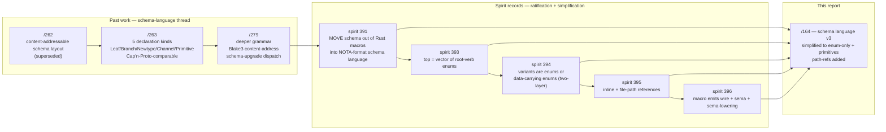
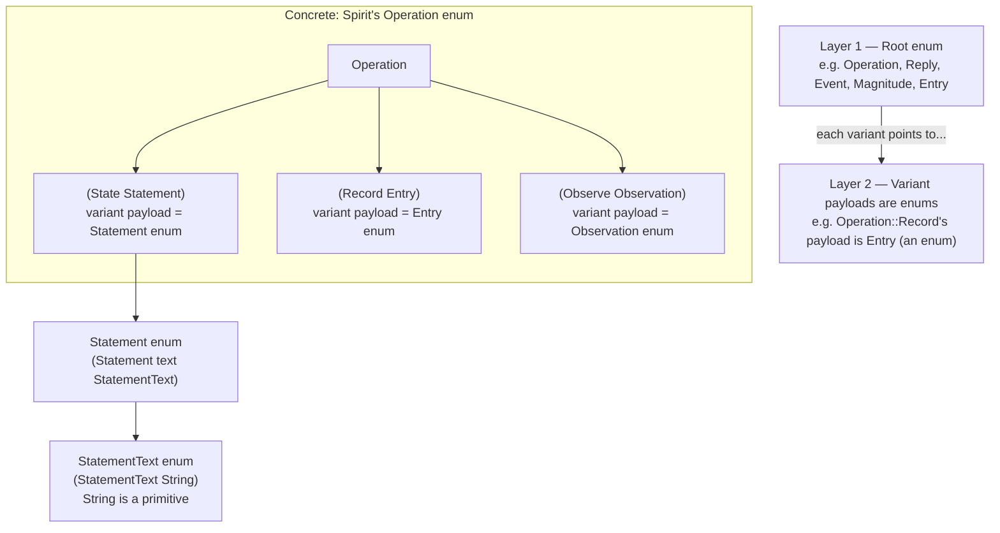
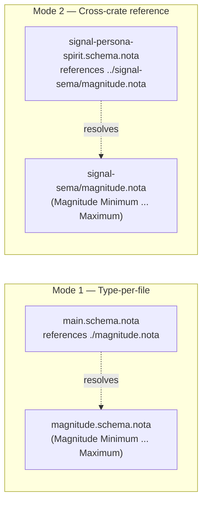
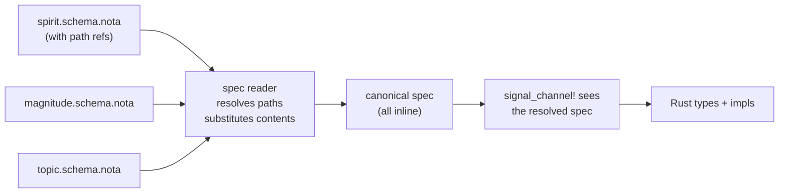
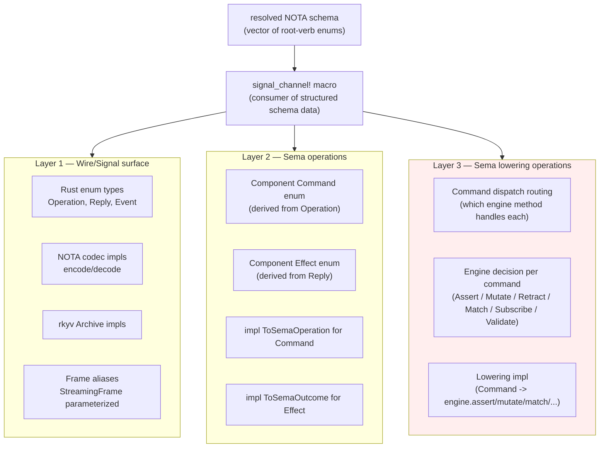
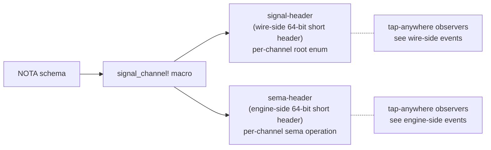
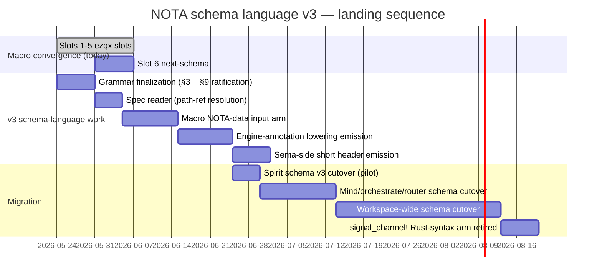

# NOTA schema language v3 — vector of root-verb enums with two-layer enum-of-enums

*Second-designer report — refining the /263 + /279 + spirit 391 NOTA
schema-language line per the new psyche framing (records 393-396):
top level is a VECTOR of root-verb enums, variants are mandatorily
ENUMS or DATA-CARRYING ENUMS (two-layer minimum), inline + file-path
splitting is supported, and the macro emits not just the wire
surface but the full sema lowering (engine semantics) too.*

Date: 2026-05-24
Lane: second-designer
Author intent: psyche prompt (intent records 393-396) — "it's a
simple language, it's a simple schema… first it's going to be a
root verb, so an enum and the syntax for that is obviously a vector
with the names of the enums… their variants are going to be enums
or data carrying enums. So there's two layers like that where it
has to be in this structure… we can just put a path in some places…
this is used by the macro, and it generates both the wire, the
signal, and the schema, the sema, well, the sema operations, the
sema lowering operations."

## 1 · TL;DR — the new framing in five sentences

1. A NOTA contract schema is a **vector of root-verb enums** —
   that is the entire top-level shape.
2. Every enum's variants are themselves either **another enum** or
   a **data-carrying enum** — a two-layer enum-of-enums structure
   that is mandatory, not optional.
3. The schema can be written **inline in one file** OR **split
   across files** where a path reference substitutes for an enum
   reference; the reader resolves paths into the full spec before
   handing it to the macro.
4. The macro consumes the resolved spec and emits **three output
   layers**: (a) the wire/signal surface, (b) the sema operations
   (classification labels), (c) the **sema lowering operations** —
   how each operation is expressed inside the engine, what kind of
   decision the engine makes.
5. This reframes the /263 + /279 schema-language with five
   declaration kinds (`Leaf` / `Branch` / `Newtype` / `Channel` /
   `Primitive`) into ONE declaration kind (enum) plus built-in
   primitives — radically simpler, no special cases, matches NOTA's
   own positional-record discipline.

## 2 · The chain to here



The /263 + /279 thread did the heavy lifting on the canonical
encoding (NOTA-flavoured grammar), Blake3 content-addressing, layout
annotations, and schema-change classification. **What's NEW in this
report**: the radical simplification to enum-only + the path-ref
splitting mechanism + the macro's expanded scope to emit sema
lowering.

## 3 · The shape — minimal grammar

### 3.1 · Top level — vector of root-verb enums

The whole schema is a NOTA vector whose elements are enum
declarations:

```nota
[
  (Operation
    (State Statement)
    (Record Entry)
    (Observe Observation)
    (Watch Subscription)
    (Unwatch SubscriptionToken))

  (Reply
    (RecordAccepted RecordAccepted)
    (StateObserved StateObserved)
    (RecordsObserved RecordsObserved)
    (RequestUnimplemented RequestUnimplemented))

  (Event
    (StateChanged StateChanged)
    (RecordCaptured RecordCaptured))

  (Kind Decision Principle Correction Clarification Constraint)

  (Magnitude Minimum VeryLow Low Medium High VeryHigh Maximum)

  ;; data-carrying enums with one named variant = "structs" in the
  ;; old framing — but they ARE enums shape-wise
  (Entry (Entry topic Topic kind Kind summary Summary
                context Context certainty Magnitude quote Quote))

  (Statement (Statement text StatementText))

  ;; transparent newtype shape — single-variant enum over a primitive
  (Topic (Topic String))
  (Summary (Summary String))
  (Context (Context String))
  (Quote (Quote String))
  (StatementText (StatementText String))
]
```

Every entry in the top-level vector is `(<EnumName> <variants…>)`.
Each variant is either:
- A bare PascalCase token — unit variant (leaf)
- A `(VariantName <payload-type-name>)` — data-carrying variant
  whose payload references another enum from the vector

There is no separate `Leaf` / `Branch` / `Newtype` / `Channel` /
`Primitive` declaration. **Everything is an enum**, distinguished
only by whether its variants carry payloads.

### 3.2 · Why one declaration kind

The /263 + /279 design used five declaration kinds because Rust
has structs, newtypes, enums, etc., and the schema mirrored Rust's
type system. The new framing collapses to one kind because:

- **NOTA's positional records ARE enum-shaped**: `(Tag fields…)`
  is structurally identical for "variant of an enum" and "struct
  named `Tag` with those fields." NOTA doesn't distinguish; the
  schema shouldn't either.
- **Short-header byte structure forces enum-shape thinking**: per
  spirit records 388-389, the 64-bit short header is "8 enums total
  — one root plus seven sub-enums." Every position in the header
  IS an enum. A schema language that produces non-enum shapes
  can't drive the header generation cleanly.
- **Sema classification is enum-based**: `SemaOperation` is a
  closed enum; the Layer 1 → Layer 3 projection is a match
  expression over enum variants. The schema's natural shape is
  the same.
- **Help-on-every-enum (per /312 + records 359, 363-365)**: every
  enum gets a recursive Help variant. If the schema declares
  structs separately from enums, structs need their own Help shape
  — extra surface for no gain.

The simplification IS the win: one shape, one set of rules, one
codegen path.

### 3.3 · Two-layer enum-of-enums — what "two-layer" means

Per spirit record 394, the variant payloads must themselves be
enums (unit or data-carrying). Concretely:



What this enforces:
- **No flat data on variants** — a variant either has no payload
  (leaf), or has a payload that is itself an enum reference.
- **All composition goes through enums** — there are no
  "anonymous structs" inline in a variant. If you want fields, you
  declare an enum whose single variant carries them.
- **Primitives terminate the chain** — `String`, `u8`, `bool`, etc.
  are built-in primitives, not enums, and they sit at the bottom
  of every recursion as terminal payloads. They're the only
  "non-enum" thing the schema language knows about, and they appear
  only inside variant payloads.

What "two-layer" minimum means: a useful schema has at least
layer 1 (the root enum) and layer 2 (its variant payloads, which
are enums too). A schema with only layer-1 unit variants (like
`Magnitude` standalone) is still a valid root-vector entry; the
"two-layer mandatory" rule applies to the SHAPE of the contract
that drives wire generation, not to every individual enum
declaration.

### 3.4 · Where structs go

The old framing had `(Branch Entry Struct [(topic Topic) (kind
Kind) …])`. The new framing represents the same shape as a
single-variant data-carrying enum:

```nota
;; Old /279 framing — struct as a distinct declaration kind:
(Branch Entry Struct
  [(topic Topic) (kind Kind) (summary Summary)
   (context Context) (certainty Magnitude) (quote Quote)]
  [])

;; New framing — struct as an enum with one variant:
(Entry
  (Entry topic Topic kind Kind summary Summary
         context Context certainty Magnitude quote Quote))
```

Wire-equivalent (NOTA round-trip identical):

```nota
(Entry workspace Decision "summary" "context" Maximum "quote")
```

The single-variant data-carrying enum encodes the same positional
record as the struct does. From the macro emitter's POV, it can
detect the single-variant shape and elide the variant tag at the
Rust level (emit a Rust `struct Entry { … }` rather than an `enum
Entry { Entry(…) }`). The schema shape is uniform; the Rust
emission collapses the degenerate case.

### 3.5 · Primitives — the only non-enum thing

The built-in primitives the schema references but does not
declare:

| Primitive | NOTA encoding | rkyv | Use |
|---|---|---|---|
| `String` | `"..."` or bare ident | `String` | text |
| `u8`, `u16`, `u32`, `u64` | decimal | fixed-width | counters, IDs, widths |
| `bool` | `True` / `False` | `bool` | binary flags |
| `Date` | `YYYY-MM-DD` | three fields | timestamps |
| `Time` | `HH:MM:SS` | three fields | timestamps |
| `Bytes` | `#hex…` | `Vec<u8>` | opaque payloads (hashes, public keys) |

Two container constructors:
- `[Vec T]` — homogeneous sequence
- `[Option T]` — optional value

Both take their inner type as a sub-position, and the inner type
must be either a primitive or a schema-declared enum.

Primitives don't get top-level vector entries. They're just names
the schema can reference inside enum variant payloads.

## 4 · Inline + file-path splitting

Per spirit record 395, the schema supports both single-file and
multi-file layouts. The path-ref mechanism is the splitting key.

### 4.1 · The path-ref shape

Anywhere an enum name can appear in a variant payload, a file-path
string can appear instead:

```nota
;; Inline — everything in one file:
[
  (Operation (Record Entry) ...)
  (Entry (Entry topic Topic kind Kind ... certainty Magnitude quote Quote))
  (Magnitude Minimum VeryLow Low Medium High VeryHigh Maximum)
  (Topic (Topic String))
  ...
]

;; Split — Magnitude declared in a sibling file:
[
  (Operation (Record Entry) ...)
  (Entry (Entry topic Topic kind Kind ... certainty "./magnitude.schema.nota" quote Quote))
  (Topic (Topic String))
  ...
]
```

The reader sees the string `"./magnitude.schema.nota"` in a payload
type position; it interprets the string as a file path (relative to
the current schema file), reads the referenced file, expects it to
contain a single root-enum declaration matching the position's
context, and substitutes that declaration into the in-memory spec
tree.

### 4.2 · The two splitting modes

Two natural splitting modes flow from the same path-ref mechanism:



Mode 1: split big single-component schemas across multiple files
within the same crate for readability.

Mode 2: cross-crate references — `signal-persona-spirit` schema
references `signal-sema`'s `Magnitude` declaration by its on-disk
path (or by a workspace-resolved name, see §4.4).

### 4.3 · Resolution semantics

The reader produces a **canonical resolved spec** before the macro
sees it:



Key semantics:

- **Resolution is purely textual substitution** — no recursive
  parsing of resolved content, just splice in the referenced
  enum declaration where the path-ref appeared.
- **The macro never sees paths** — the resolved spec is fully
  inline by the time the macro processes it.
- **Cycles are errors** — A references B references A. The reader
  detects and rejects.
- **Path resolution is build-time** — paths are interpreted
  relative to the schema file's location; the macro doesn't run a
  resolver, the build script does.

### 4.4 · The colon-separated cross-schema form (from /279)

/279 used `signal-sema:Magnitude` (colon-separated name) for
cross-schema references. The two forms compose:

- **Path-ref**: `"./magnitude.schema.nota"` — explicit file path,
  textually substituted.
- **Symbolic ref**: `signal-sema:Magnitude` — name-based, resolved
  via the workspace's Cargo dependency graph + each schema crate's
  declared exports.

The path-ref is the **primitive**; the symbolic ref is sugar over
it. Build tooling resolves `signal-sema:Magnitude` to the path of
`signal-sema`'s schema export, then proceeds with path-ref
substitution. The symbolic form survives crate moves and renames;
the path-ref form is what makes splitting a single schema across
sibling files work.

## 5 · Macro emits three output layers — not just the wire

Per spirit record 396, the macro consumes the resolved schema and
generates THREE distinct output layers:



### 5.1 · What's new vs today

Today (per `/163`'s audit), the macro emits Layer 1 only. The
daemon HAND-WRITES Layer 2 (Command/Effect/ToSemaOperation/
ToSemaOutcome) and Layer 3 (which engine method each command
calls).

The psyche's direction: **the schema should specify Layer 3 too**,
so the macro generates the daemon's lowering code as well as the
classification surface.

### 5.2 · What does "engine decision" look like as schema annotation?

The schema needs to carry enough information for the macro to know,
for each operation, which engine method it lowers to. Two design
shapes — both viable, both demonstrated in workshop:

**Shape A — annotation on each operation variant.** The schema
declares the operation's lowering as an annotation:

```nota
[
  (Operation
    ;; Variant payload position carries the engine routing annotation
    (Record (Entry (engine assert)))
    (Observe (Observation (engine match)))
    (Watch (Subscription (engine subscribe)))
    (Unwatch (SubscriptionToken (engine retract))))
  ...
]
```

The annotation `(engine assert)` tells the macro: emit a Command
variant `AssertEntry(Entry)` whose `to_sema_operation()` returns
`SemaOperation::Assert` and whose dispatch routes to
`engine.assert(family, entry)`.

**Shape B — naming convention drives the lowering.** The variant
name itself encodes the engine kind:

```nota
[
  (Operation
    ;; Variant name carries the engine kind via prefix:
    (Record Entry)        ;; -> AssertEntry, engine.assert(...)
    (Observe Observation) ;; -> MatchObservation, engine.match_records(...)
    (Watch Subscription)  ;; -> SubscribeSubscription, engine.subscribe(...)
    (Unwatch SubscriptionToken)) ;; -> RetractSubscription, engine.retract(...)
  ...
]
```

The macro reads the variant name and looks up the engine kind in
a default mapping table:

| Verb prefix | Engine method | Sema class |
|---|---|---|
| `Record`, `Submit`, `State`, `Assert` | `engine.assert(...)` | `Assert` |
| `Mutate`, `Update` | `engine.mutate(...)` | `Mutate` |
| `Retract`, `Remove`, `Unwatch`, `Close` | `engine.retract(...)` | `Retract` |
| `Observe`, `Query`, `Match`, `Read` | `engine.match_records(...)` | `Match` |
| `Watch`, `Subscribe`, `Open` | `engine.subscribe(...)` | `Subscribe` |
| `Validate`, `Plan`, `DryRun` | `engine.validate(...)` | `Validate` |

**Recommendation: Shape A** (explicit annotation). The naming-
convention approach (Shape B) hides the decision in vocabulary
choice — designers would have to know the convention to read the
schema correctly, and renaming a verb would change its lowering.
Shape A makes the engine decision a first-class element of the
schema, debuggable + greppable, and the schema remains the single
source of truth.

### 5.3 · Sema-side short header (per spirit 390)

Per spirit record 390, sema gets its own short header symmetric
with signal-side. The macro emits two parallel headers:



Two headers, two observer streams, one macro emit path. Both
inherit the 8-enum 64-bit structure (1 root + 7 sub-enums per
spirit records 388-389). The signal-header byte-0 root is the
contract's operation kind; the sema-header byte-0 root is the
sema operation class (Assert/Mutate/etc.). Symmetric machinery,
distinct vocabulary.

## 6 · Worked example — Spirit's full schema in the new framing

### 6.1 · The schema file — `signal-persona-spirit/schema.nota`

```nota
[
  ;; ────────── Root operation enum (wire-facing) ──────────
  (Operation
    (State (Statement (engine assert)))
    (Record (Entry (engine assert)))
    (Observe (Observation (engine match)))
    (Watch (Subscription (engine subscribe)))
    (Unwatch (SubscriptionToken (engine retract))))

  ;; ────────── Reply enum ──────────
  (Reply
    (RecordAccepted RecordAccepted)
    (StateObserved StateObserved)
    (RecordsObserved RecordsObserved)
    (RecordProvenancesObserved RecordProvenancesObserved)
    (TopicsObserved TopicsObserved)
    (QuestionsObserved QuestionsObserved)
    (SubscriptionOpened SubscriptionOpened)
    (SubscriptionRetracted SubscriptionRetracted)
    (RequestUnimplemented RequestUnimplemented))

  ;; ────────── Event enum (stream-borne) ──────────
  (Event
    (StateChanged (StateChanged belongs DomainStream))
    (RecordCaptured (RecordCaptured belongs DomainStream)))

  ;; ────────── Leaf enums (unit-variant only) ──────────
  (Kind Decision Principle Correction Clarification Constraint)
  (ObservationMode SummaryOnly WithProvenance)
  (Presence Active Absent)
  (UnimplementedReason NotBuiltYet IntegrationNotLanded)

  ;; ────────── Cross-schema reference: pull Magnitude from signal-sema ──────────
  (Magnitude "../signal-sema/magnitude.schema.nota")

  ;; ────────── Newtype-shaped enums (single-variant data-carrying) ──────────
  (Topic (Topic String))
  (Summary (Summary String))
  (Context (Context String))
  (Quote (Quote String))
  (StatementText (StatementText String))
  (RecordIdentifier (RecordIdentifier u64))
  (QuestionIdentifier (QuestionIdentifier String))
  (QuestionText (QuestionText String))
  (FocusArea (FocusArea String))

  ;; ────────── Composite "struct" enums (single-variant, multi-field) ──────────
  (Entry (Entry topic Topic kind Kind summary Summary
                context Context certainty Magnitude quote Quote))

  (Statement (Statement text StatementText))

  (RecordQuery (RecordQuery topic [Option Topic]
                            kind [Option Kind]
                            mode ObservationMode))

  (RecordSubscription (RecordSubscription topic [Option Topic]
                                          mode ObservationMode))

  (RecordSummary (RecordSummary identifier RecordIdentifier
                                topic Topic
                                kind Kind
                                summary Summary
                                certainty Magnitude))

  (RecordProvenance (RecordProvenance summary RecordSummary
                                      context Context
                                      date Date
                                      time Time
                                      quote Quote))

  (TopicCount (TopicCount topic Topic entries u64))

  (State (State presence Presence focus [Option FocusArea]))

  (QuestionSummary (QuestionSummary identifier QuestionIdentifier
                                    question QuestionText))

  ;; ────────── Observation root (Observe payload) ──────────
  (Observation
    State
    (Records RecordQuery)
    Topics
    Questions)

  ;; ────────── Subscription root (Watch payload) ──────────
  (Subscription
    State
    (Records RecordSubscription))

  ;; ────────── SubscriptionToken (Unwatch payload) ──────────
  (SubscriptionToken
    (State StateSubscriptionToken)
    (Records RecordSubscriptionToken))

  (StateSubscriptionToken (StateSubscriptionToken identifier u64))
  (RecordSubscriptionToken (RecordSubscriptionToken identifier u64))

  ;; ────────── Reply payload structs ──────────
  (RecordAccepted (RecordAccepted RecordIdentifier))
  (StateObserved (StateObserved state State))
  (RecordsObserved (RecordsObserved records [Vec RecordSummary]))
  (RecordProvenancesObserved (RecordProvenancesObserved records [Vec RecordProvenance]))
  (TopicsObserved (TopicsObserved topics [Vec TopicCount]))
  (QuestionsObserved (QuestionsObserved questions [Vec QuestionSummary]))
  (SubscriptionOpened (SubscriptionOpened token SubscriptionToken
                                          snapshot SubscriptionSnapshot))
  (SubscriptionRetracted (SubscriptionRetracted token SubscriptionToken))
  (RequestUnimplemented (RequestUnimplemented reason UnimplementedReason))

  (SubscriptionSnapshot
    (State State)
    (Records [Vec RecordSummary]))

  (StateChanged (StateChanged state State))
  (RecordCaptured (RecordCaptured record RecordSummary))
]
```

Notice what's NOT in the schema:
- No "Channel Spirit" declaration — the root vector IS the channel.
  The presence of `Operation`, `Reply`, `Event` root enums together
  constitutes the channel definition.
- No separate stream declaration — `(StateChanged ... belongs
  DomainStream)` annotation on each event variant supplies the
  same information as /263/279's `(stream DomainStream …)` leg.
- No separate observable block — observability is implicit when
  the channel is for a persona component (per `component-triad.md`
  §"Mandatory `Tap`/`Untap` for persona components").

The whole schema fits in one file or splits into several. The
`Magnitude` reference here is a path-ref to `signal-sema`'s
schema file — the only cross-crate dependency Spirit's contract
has.

### 6.2 · What the macro emits — Layer 1 (wire)

From the schema above, the macro emits everything that
`signal_channel!` emits today (per `/163` §2.3):

```text
Rust types
├── enum Operation { State, Record, Observe, Watch, Unwatch }
├── enum Reply { RecordAccepted, StateObserved, ... }
├── enum Event { StateChanged, RecordCaptured }
├── enum OperationKind, ReplyKind, EventKind  (kind enums)
├── enum Observation { State, Records, Topics, Questions }
├── enum Subscription { State, Records }
├── enum SubscriptionToken { State, Records }
├── enum Kind { Decision, ... }
├── enum Magnitude { Minimum, ... }  (or re-exported from signal-sema if cross-schema-resolved)
└── struct Entry, Statement, RecordQuery, RecordSummary, ...

Codec impls
├── impl NotaEncode/NotaDecode for every type
└── impl rkyv::Archive/Serialize/Deserialize for every type

Frame aliases
├── type Frame = StreamingFrame<Operation, Reply, Event>
└── type FrameBody = StreamingFrameBody<Operation, Reply, Event>

Conversion impls
└── impl From<Payload> for Reply (one per Reply variant)

Stream relation witnesses
└── struct DomainStream + stream witnesses tying State/Records events back

Observability (persona component → mandatory)
├── enum ObserverFilter (default)
├── struct ObserverSet (publish_operation_event, publish_effect_event)
├── struct ObserverSubscriptionToken
└── Tap(ObserverFilter) / Untap(ObserverSubscriptionToken) added to Operation
```

### 6.3 · What the macro emits — Layer 2 (sema operations)

The macro reads the `(engine X)` annotations and synthesizes the
daemon's Command + Effect enums:

```rust
// Macro-emitted Command enum:
pub enum SpiritCommand {
    ClassifyStatement(Statement),       // from (State (Statement (engine assert)))
    AssertEntry(Entry),                 // from (Record (Entry (engine assert)))
    ReadObservation(Observation),       // from (Observe (Observation (engine match)))
    SubscribeWatch(Subscription),       // from (Watch (Subscription (engine subscribe)))
    RetractWatch(SubscriptionToken),    // from (Unwatch (SubscriptionToken (engine retract)))
    OpenObserverSubscription(ObserverFilter),  // from macro-injected Tap
    CloseObserverSubscription(ObserverSubscriptionToken),  // from macro-injected Untap
}

// Macro-emitted ToSemaOperation impl (deriving from engine annotation):
impl ToSemaOperation for SpiritCommand {
    fn to_sema_operation(&self) -> SemaOperation {
        match self {
            Self::ClassifyStatement(_) | Self::AssertEntry(_) => SemaOperation::Assert,
            Self::ReadObservation(_)                          => SemaOperation::Match,
            Self::SubscribeWatch(_)
              | Self::OpenObserverSubscription(_)              => SemaOperation::Subscribe,
            Self::RetractWatch(_)
              | Self::CloseObserverSubscription(_)             => SemaOperation::Retract,
        }
    }
}

// Macro-emitted Effect enum + ToSemaOutcome impl (derived from Reply):
pub enum SpiritEffect {
    RecordAccepted(RecordAccepted),
    StateObserved(StateObserved),
    /* ... one per Reply variant ... */
    RequestUnimplemented(RequestUnimplemented),
}

impl ToSemaOutcome for SpiritEffect {
    fn to_sema_outcome(&self) -> SemaOutcome {
        match self {
            Self::RecordAccepted(_)                        => SemaOutcome::Asserted,
            Self::StateObserved(_)
              | Self::RecordsObserved(_)
              | Self::RecordProvenancesObserved(_)
              | Self::TopicsObserved(_)
              | Self::QuestionsObserved(_)                 => SemaOutcome::Matched,
            Self::SubscriptionOpened(_)                    => SemaOutcome::Subscribed,
            Self::SubscriptionRetracted(_)                 => SemaOutcome::Retracted,
            Self::RequestUnimplemented(_)                  => SemaOutcome::NoChange,
        }
    }
}

// Macro-emitted From<Operation> -> Command:
impl From<Operation> for SpiritCommand {
    fn from(op: Operation) -> Self {
        match op {
            Operation::State(stmt)        => Self::ClassifyStatement(stmt),
            Operation::Record(entry)      => Self::AssertEntry(entry),
            Operation::Observe(obs)       => Self::ReadObservation(obs),
            Operation::Watch(sub)         => Self::SubscribeWatch(sub),
            Operation::Unwatch(tok)       => Self::RetractWatch(tok),
            Operation::Tap(filter)        => Self::OpenObserverSubscription(filter),
            Operation::Untap(tok)         => Self::CloseObserverSubscription(tok),
        }
    }
}
```

Everything the daemon today writes by hand in
`persona-spirit/src/observation.rs` (per /163 §5.1-5.3), the macro
now emits from the schema.

### 6.4 · What the macro emits — Layer 3 (sema lowering)

The engine routing for each command — what method the daemon calls
on `sema-engine::Engine`. This is the NEW layer per spirit 396:

```rust
// Macro-emitted lowering trait:
pub trait SpiritLowering {
    type Reply;
    fn execute(
        &mut self,
        command: SpiritCommand,
        engine: &mut Engine,
        family: TableFamily,
    ) -> Result<Self::Reply, ExecutionError>;
}

// Macro-emitted default impl (engine routing derived from schema annotations):
impl SpiritLowering for SpiritDispatcher {
    type Reply = SpiritEffect;

    fn execute(
        &mut self,
        command: SpiritCommand,
        engine: &mut Engine,
        family: TableFamily,
    ) -> Result<Self::Reply, ExecutionError> {
        match command {
            // (engine assert) -> engine.assert(...)
            SpiritCommand::AssertEntry(entry) => {
                let receipt = engine.assert(Assertion::new(family, entry))?;
                Ok(SpiritEffect::RecordAccepted(RecordAccepted::from(receipt)))
            }

            // (engine assert) -> daemon-side classifier + engine.assert(...)
            SpiritCommand::ClassifyStatement(stmt) => {
                let classified = self.classifier.classify(stmt);
                let receipt = engine.assert(Assertion::new(family, classified))?;
                Ok(SpiritEffect::RecordAccepted(RecordAccepted::from(receipt)))
            }

            // (engine match) -> engine.match_records(...)
            SpiritCommand::ReadObservation(obs) => {
                let plan = QueryPlan::for_observation(family, obs);
                let snapshot = engine.match_records(plan)?;
                Ok(SpiritEffect::from_snapshot(snapshot))
            }

            // (engine subscribe) -> engine.subscribe(...)
            SpiritCommand::SubscribeWatch(sub) => {
                let (token, snapshot) = engine.subscribe(/* plan + sink */)?;
                Ok(SpiritEffect::SubscriptionOpened(/* ... */))
            }

            // (engine retract) -> close subscription
            SpiritCommand::RetractWatch(tok) => {
                self.subscription_plane.retract(tok)?;
                Ok(SpiritEffect::SubscriptionRetracted(/* ... */))
            }

            // Tap/Untap route to ObserverSet, not engine
            SpiritCommand::OpenObserverSubscription(filter) => { /* ... */ }
            SpiritCommand::CloseObserverSubscription(tok)   => { /* ... */ }
        }
    }
}
```

The macro emits this lowering using the per-variant `(engine X)`
annotation as the routing key. Daemons that need to override
default lowering (the `ClassifyStatement` case above, which needs
classifier logic before the assert) implement a custom `Dispatcher`
type and override specific match arms; the macro emits the default
shell that delegates to the dispatcher.

What stays HAND-WRITTEN in the daemon:
- The classifier logic (domain-specific intelligence Spirit applies
  before storage).
- The Kameo actor planes themselves (RecordStore, ClassifierPlane,
  ClockPlane, etc.).
- The redb table schema + index design.
- Authorization checks before lowering.
- Any custom dispatcher overrides for non-default routing.

What becomes MACHINE-GENERATED:
- Command/Effect enums and their match expressions.
- ToSemaOperation/ToSemaOutcome impls.
- The default lowering shell (which engine method each command
  invokes).
- The Reply-from-Effect conversion.
- The observation publication (already emitted today via
  `observable` block).

## 7 · Comparison — today's Spirit vs the schema-emitted version

| File | Today (hand-written LOC) | Schema-emitted (LOC) | Reduction |
|---|---|---|---|
| `signal-persona-spirit/src/lib.rs` | 468 lines | ~30 lines (the schema path declaration) | 93% |
| `persona-spirit/src/observation.rs` | 158 lines | 0 (macro-emitted) | 100% |
| `persona-spirit/src/actors/dispatch.rs` — lowering match | ~80 lines | 0 (macro-emitted default) | 100% |
| Custom dispatcher overrides | n/a today | ~30 lines (ClassifyStatement only) | new code |
| Schema file (`schema.nota`) | n/a today | ~70 lines | new file |

Net: ~700 lines of hand-written contract+daemon code collapse to
~100 lines of schema + daemon overrides. The schema becomes the
single source; the macro takes care of the rest.

Multiply across the workspace's component count (today: spirit,
mind, orchestrate, harness, router, message, system, terminal,
introspect, plus agent/cloud/domain-criome incoming), and the
schema language eliminates the ~75% of contract+lowering boilerplate
that varies only by names + types.

## 8 · Integration with the other macro work in flight

### 8.1 · Short header (spirit records 388-392)

The schema directly informs short-header generation. The 64-bit
short header is 8 enums (1 root + 7 sub-enums); the schema's
top-level vector + variant-payload tree IS the enum graph the
header walks.

- Byte 0 of the wire-side header = `Operation` enum's variant
  discriminator.
- Bytes 1-7 of the wire-side header = sub-enum discriminators from
  the variant payload type tree.
- Byte 0 of the sema-side header = `SemaOperation` (derived from
  the engine annotation, per §5.2).
- Bytes 1-7 of the sema-side header = daemon-side execution
  classification (assertion vs query vs subscription).

The schema → short-header mapping is mechanical because the schema's
shape IS the header's shape — 1 root enum + sub-enum payload chain.

### 8.2 · Help on every enum (per /312 + spirit records 359, 363-365)

Every enum the macro emits gets a `Help` variant injected at the
END of its variant list (per intent 363). The Help text comes from
NOTA comments on each enum + each variant in the schema:

```nota
;; A NOTA-comment block (per skills/nota-comments.md) on an enum
;; becomes its Help text:
;; (Why "Magnitude names a workspace-universal qualitative
;;       strength scale, used by component records that need to
;;       express a coarse reading of certainty, priority,
;;       severity, intensity, health, readiness, or any other
;;       non-numeric strength."
;;      (chosen-because "field name carries dimension; type carries scale"))
(Magnitude
  ;; Lowest strength on the scale.
  Minimum
  ;; Below Low.
  VeryLow
  ;; Lower-middle strength.
  Low
  ;; Centre of the scale.
  Medium
  ;; Upper-middle strength.
  High
  ;; Above High.
  VeryHigh
  ;; Highest strength on the scale.
  Maximum)
```

The schema's NOTA-comments are the documentation surface (replacing
Rust `///` comments as the source per /312 §3). Walking the
Help-at-the-end-of-path retrieves the documentation noun for any
position in the schema tree.

### 8.3 · Next-as-dependency (per spirit records 366-367, 391)

For version migration, the next version's schema is referenced via
the same path-ref mechanism — but pointing into the
`*-next` Cargo-dependency-renamed crate:

```nota
;; In signal-persona-spirit v0.1.0's schema:
[
  (Operation ...)
  ...
  ;; Reference to the next version's schema:
  (next_schema "../signal-persona-spirit-next/schema.nota")
]
```

The macro reads BOTH schemas at compile time (current + next),
diffs them, and emits `impl VersionProjection<Self::Op, next::Op>`
for the per-payload field-walk projection (per /317/3's design).

The path-ref mechanism is the unifying primitive — same syntax for
splitting a single schema across files, cross-crate references,
and version-migration references.

### 8.4 · Concrete macro epic absorption

Per /317/4's overview, the macro convergence epic `primary-ezqx`
absorbs 6 slots today. The schema-language v3 framing affects:

| Slot | Today | Under schema-language v3 |
|---|---|---|
| 1. `contract_section` attribute | macro syntax extension | schema annotation `(section X)` on root enum |
| 2. `LogVariant` impl | per-enum autogen | per-enum autogen, but driven by schema not Rust syntax |
| 3. `micro` field in Frame | reshape Frame in signal-frame | unchanged |
| 4. Help on every enum | macro-injected | schema-injected (NOTA comments as source) |
| 5. HelpReply codec | in signal-frame | unchanged |
| 6. `next_schema` projection | macro keyword | schema declaration `(next_schema "path")` |

The v3 framing **does not invalidate** the current slot work —
the macro emission is the same, only the input changes from
Rust-syntax-with-keywords to NOTA-data. Slot work lands;
schema-language follows by replacing the Rust-syntax input with
the NOTA-data input. Schema is downstream of macro slot work, not
a blocker.

## 9 · Open questions for psyche

### 9.1 · Engine annotation shape — Shape A vs Shape B

§5.2 sketches two options for declaring how each operation lowers
to the engine: explicit annotation (`(engine assert)`) vs naming
convention (`Record` → assert by default).

**Lean: Shape A** (explicit annotation). Schema as source of truth
benefits from explicit decisions; naming conventions hide
information in vocabulary choice. Confirm.

### 9.2 · Single-variant collapse — emit struct or enum

A single-variant data-carrying enum (`(Entry (Entry topic Topic
…))`) is structurally a struct. Should the macro emit a Rust
`struct Entry { … }` or an `enum Entry { Entry(…) }`?

**Lean: emit struct**. The NOTA wire shape is identical; the Rust
ergonomics differ — `entry.topic` reads more naturally than
`match e { Entry::Entry { topic, .. } => topic }`. Confirm.

### 9.3 · Schema file naming + discovery

Where does each component's schema file live? Two natural
patterns:
- (a) `<repo>/schema.nota` at repo root, one file per contract.
- (b) `<repo>/src/schema.nota` next to the macro invocation site.

**Lean: (a)**. Schemas are workspace-shared artifacts; living at
repo root makes them findable without diving into `src/`. Cargo
dep resolution can find them by convention. Confirm.

### 9.4 · Built-in primitive set

§3.5 lists `String`, `u8-u64`, `bool`, `Date`, `Time`, `Bytes`
plus `[Vec T]` / `[Option T]`. Are these the canonical set, or do
we add `i8-i64`, `f32`, `f64`, `char`?

**Lean: start minimal**. The workspace uses unsigned ints + bool +
String + Date + Time + Bytes + Vec + Option. Add signed ints,
floats, char if a concrete consumer needs them. Confirm.

### 9.5 · How does the schema handle `(stream …)` channel legs?

Today's `signal_channel!` has a separate `stream { … }` block
declaring stream relations. In the v3 schema, where does this
information live?

**Lean: annotate the relevant event variant** with a `belongs
<StreamName>` payload — `(StateChanged (StateChanged belongs
DomainStream))`. The macro walks all events and assembles the
stream relations from the annotations. No separate `stream` enum
in the root vector. Confirm.

### 9.6 · Channel-section assignment (golden-ratio split per /307)

The golden-ratio byte-0 split (per spirit record 327 + /307)
assigns ordinary vs owner contracts to sections of the byte-0
discriminator space. Where does this declaration live in the v3
schema?

**Lean: implicit by contract identity**. `signal-X` is always the
big-section (~0.61), `owner-signal-X` is always the small-section
(~0.39). No per-schema declaration needed; the macro emits the
appropriate header layout based on which crate the schema lives
in. Confirm.

### 9.7 · Path-ref security + sandbox

Path-refs resolve files at build time. If a schema references
`"/etc/passwd"` or `"../../../some/malicious/file.nota"`, the
resolver shouldn't follow that.

**Lean: restrict resolution to (a) sibling files in the same
crate's schema directory, (b) explicit Cargo dep crates'
exported schemas via the symbolic-ref form (`signal-sema:Magnitude`).**
No arbitrary file system traversal. Confirm.

### 9.8 · Migration to v3 — gradual or all-at-once

Today's `signal_channel!` accepts Rust-syntax input. The v3
framing reads NOTA-data input. Two migration paths:
- (a) Macro accepts BOTH inputs during transition; auto-detects
  which form the consumer used; emits the same Rust output.
- (b) New macro `nota_signal_channel!` takes NOTA input; old
  `signal_channel!` stays Rust-syntax until all consumers migrate.

**Lean: (a)** — one macro, dual input acceptance during
transition. Smoother migration. Macro detects: if the first
argument is a NOTA stream (starts with `[`), parse as NOTA-data;
otherwise parse as Rust-syntax. Confirm.

## 10 · What this design does NOT cover

- **Daemon runtime details** — actor topology, socket binding,
  redb table layout, supervision tree. Stay hand-written.
- **Authorization policy** — which Caller can call which
  operation; owner-vs-ordinary contract assignment. Outside schema
  scope.
- **Performance tuning** — table indexing, batch sizes, subscription
  delivery strategy. Daemon-internal.
- **NOTA-projection policy** — which CLI prints what, which
  daemon endpoint accepts what, audit log format. Surface policy
  belongs to the boundary component (per
  `skills/contract-repo.md` §"How NOTA fits").
- **Engine internals** — sema-engine's table catalog, commit log
  shape, snapshot mechanism. Library-internal.
- **Cross-component routing** — which component calls which other
  component over Signal. Persona-orchestrate / mind orchestration
  layer, outside contract scope.

The schema language declares **wire vocabulary + sema
classification + default engine lowering**. Everything operational
stays code.

## 11 · Trajectory — landing order



Three parallel critical paths:

1. **Macro convergence** — five slots land today's macro work
   (per `primary-ezqx`); Slot 6 (next-schema projection) lands
   after.
2. **v3 schema-language work** — grammar ratification (§9
   questions) gates the spec reader, which gates the NOTA-data
   macro input arm, which gates the engine-annotation lowering
   emission.
3. **Migration** — Spirit pilots the v3 schema first (one
   component, low blast radius); workspace-wide migration follows;
   the Rust-syntax arm retires last.

The macro convergence work lands FIRST and is NOT blocked by v3
schema-language work — the v3 work changes the macro's INPUT, not
its output shape. Operator can ship the macro slots independently;
designers ratify the v3 grammar in parallel; cutover happens once
both halves are ready.

## 12 · See also

### Reports

- `/home/li/primary/reports/designer/263-schema-specification-language-design.md`
  — initial schema-language design (5 declaration kinds). This
  report's v3 simplification supersedes the multiple-declaration-kinds
  framing.
- `/home/li/primary/reports/designer/279-nota-schema-language-and-version-hash.md`
  — deeper grammar + Blake3 content-addressing + sema-upgrade
  dispatch. The content-address mechanism, layout annotations, and
  inspect-socket protocol all CARRY FORWARD; only the declaration-
  kind taxonomy collapses.
- `/home/li/primary/reports/designer/305-v2-design-64bit-signal-per-component-namespacing.md`
  — per-component byte-0 namespacing (intent 326).
- `/home/li/primary/reports/designer/307-design-golden-ratio-namespace-split.md`
  — golden-ratio byte-0 split (intent 327).
- `/home/li/primary/reports/designer/308-design-pretyped-envelope-and-tap-anywhere.md`
  — pre-typed envelope and tap-anywhere (intent 328).
- `/home/li/primary/reports/designer/312-design-recursive-help-on-every-enum.md`
  — Help-as-noun-at-end-of-path (intents 359, 363-365).
- `/home/li/primary/reports/designer/317-sema-upgrade-and-macro-convergence-audit/4-overview.md`
  — macro convergence epic (`primary-ezqx`) integrated picture.
- `/home/li/primary/reports/second-designer/163-signal-sema-interaction-and-spirit-architecture-2026-05-24.md`
  — current signal/sema interaction (what's hand-written today
  that the v3 schema would generate).

### Spirit records

- 263 (Help operations) — Help-on-every-enum origin.
- 314-318 (64-bit signal namespacing + SignalCore zone).
- 326-328 (per-component byte 0, golden-ratio split, prefix marker).
- 359 (signal_channel! deepens — 4 concerns bundle).
- 363-365 (Help is a NOUN at end of path; CLI single-NOTA-argument).
- 366 (next-version-as-dependency for VersionProjection).
- 367 (macro convergence bundle — 4 concerns into one epic).
- 388-389 (short header canonical name + packing optimization).
- 390 (sema-side short header symmetric with signal-side).
- 391 (MOVE schema out of Rust macros into NOTA-format schema language).
- 392 (short header MVP scope: 1 root + 7 sub-enums, one byte each).
- 393-396 (this report's intent base — vector of root-verb enums,
  two-layer mandatory, inline + path-refs, macro emits all three layers).

### Skills

- `/home/li/primary/skills/nota-design.md` — positional-record
  discipline + three-case rule the schema language inherits.
- `/home/li/primary/skills/nota-schema-docs.md` — pseudo-NOTA
  notation for documenting schemas.
- `/home/li/primary/skills/contract-repo.md` — contract crate
  discipline the schema language formalizes.
- `/home/li/primary/skills/component-triad.md` — the triad shape
  the schema serves.
- `/home/li/primary/skills/language-design.md` — branches/leaves
  vocabulary the schema's enum-of-enums shape echoes.

### Beads

- `primary-ezqx` — macro convergence epic (absorbs slots 1-6).
- `primary-v5n2` — `contract_section:` grammar.
- `primary-l02o` — LogVariant trait + autogen derive.
- `primary-3cl1` + `primary-2cjv` — Frame reshape with micro + body.
- `primary-8r1j` — Help on every enum + HelpReply codec.
- NEW (post-/164): grammar ratification + spec reader + NOTA-data
  input arm + engine-annotation lowering emission + sema-side
  short header — beads file after psyche ratifies §9 questions.
