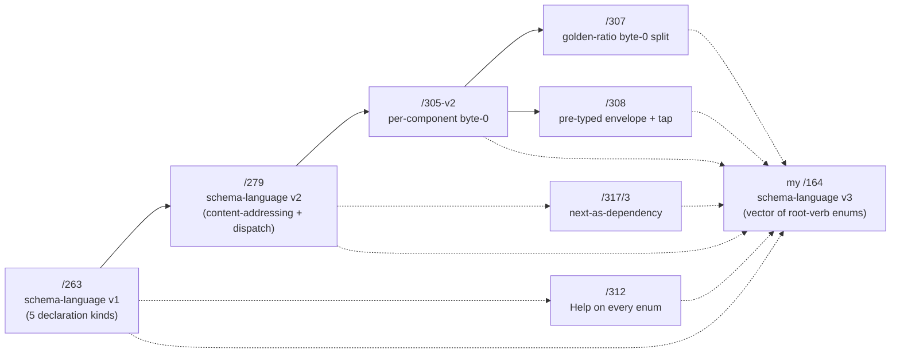

# Counter-ego audit — designer report cluster (2026-05-21 to 2026-05-24)

*Second-designer audit + critique of the prime designer's recent
reports, per psyche directive "Do an audit and critique of the
reports the designer has been making, your counter-ego" and intent
record 403 (orchestrate Principle: second-designer acts as
counter-ego — auditor and critic — not merely parallel-capacity).
Critical lens applied especially to where my /164 §9.1 clarification
question — engine annotation shape — intersects the designer's
work.*

Date: 2026-05-24
Lane: second-designer
Reports audited: `/305-v2`, `/307`, `/308`, `/312`, `/317/3`,
`/317/4` (plus reference to `/263`, `/279`, `/315`, `/318`)

## 1 · TL;DR — the verdict

The prime designer's recent work is **rigorous in local arguments**
but **ungrounded in cross-report consolidation**. Each individual
report (golden-ratio split, pre-typed envelope, recursive Help,
next-as-dependency) lays out alternatives, picks one, and motivates
the choice well. But the **cluster does not converge**: the
schema-language work that ought to be one unified design surface is
splintered across seven reports with overlapping but unreconciled
concerns. The gap my /164 §9.1 question surfaces — **how does the
macro know which engine method each operation lowers to (Layer 2/3
emission)?** — is **not addressed by ANY designer report I read**.
The designer is treating the macro as wire-only; spirit 396 says
the macro should also generate sema operations + sema lowering
operations, and no designer report engages with this directive.

The counter-ego conclusion: **prime designer is moving fast on the
macro convergence epic but missing one of its four directed
concerns** (the sema-lowering generation per spirit 396), and
**lacks a consolidation sweep** that would catch internal
inconsistencies between sibling reports.

## 2 · Audit scope — what I read

| Report | Topic | Date | Strength | Issues |
|---|---|---|---|---|
| `/305-v2` | per-component 64-bit namespacing | 2026-05-23 | Foundational; well-grounded in spirit 326 correction | Referenced widely; assumed in /307/308 |
| `/307` | golden-ratio byte-0 split | 2026-05-23 | Rigorous math; explicit alternative evaluation; security trade-off section | §5 single-socket framing inconsistent (see §3.3) |
| `/308` | pre-typed envelope + tap-anywhere | 2026-05-23 | Three envelope options evaluated; tap-point cfg granularity well-argued | §6 owner/ordinary placement under-justified (see §3.4) |
| `/312` | recursive Help on every enum | 2026-05-23 | Path-as-walk model is clean; doc-comment discipline well-stated | §4.2 Help discriminator allocation may over-cost the section (see §3.5) |
| `/317/3` | next-as-dependency macro emission | 2026-05-24 | Three Cargo mechanics evaluated; N+2 case considered; mirror coupling rechecked | Layer 2/3 emission silently absent (see §3.1); freezing protocol relies on discipline not mechanism (see §3.6) |
| `/317/4` | meta-overview synthesizing /317 subagents | 2026-05-24 | Names the four parallel landing paths cleanly | Bead-name-in-mermaid violates intent 368 (see §3.7); doesn't surface my §9.1 gap |

What I did NOT audit deeply: `/263`, `/279` (read in full for
my /164 — the foundation looks sound), `/315`, `/316`, `/318`, `/319`
(skimmed only). The cluster I audited covers the schema-language
+ macro-convergence work currently in flight.

## 3 · Critique — the gaps and contradictions

### 3.1 · The Layer 2/3 emission gap — my §9.1 question is unanswered

**The most important finding of this audit.**

Spirit record 396 (Maximum, 2026-05-24, captured by me) says:
> "The signal_channel macro generates from the NOTA schema all
> three outputs — the wire/signal surface, the sema operations
> (classification), and the **sema lowering operations** (how each
> operation is expressed inside the engine, what kind of decision
> the engine makes)."

My /164 §9.1 surfaces this as a clarification question: how does
the schema declare WHICH engine method each operation lowers to?
Shape A (explicit annotation `(engine assert)` per variant) vs
Shape B (naming convention `Record` → assert by default).

**Cross-checking the designer's reports:**

- `/307` (golden-ratio split) — silent on Layer 2/3. Treats macro
  as emitting byte-0 discriminators and operation enum variants
  only.
- `/308` (pre-typed envelope) — silent. Tap-anywhere observability
  references Layer 3 (sema-engine db_read/db_write tap points) but
  the macro's role is to emit a `LogVariant` projection, not the
  lowering itself.
- `/312` (recursive Help) — silent. Concerns documentation surface,
  not engine routing.
- `/317/3` (next-as-dependency) — silent on Layer 2/3 generation;
  treats the macro as emitting `VersionProjection<Layer1, Layer1>`
  only. The handover state machine consumes the projections; the
  daemon's `Command`/`Effect`/`ToSemaOperation` impls are assumed
  to be hand-written.
- `/317/4` (the overview) — silent. The four "macro convergence"
  concerns it lists are: contract_section attribute, LogVariant
  impl, micro field in Frame, Help on every enum, HelpReply codec,
  next-version projection. **Layer 2/3 emission is not in this
  list.**

**This is a directed concern (spirit 396 Maximum) that no designer
report engages with.** The designer is bundling four concerns into
the macro convergence epic (per spirit 367); spirit 396 ADDS a
fifth concern, and the designer hasn't caught it yet.

**Counter-ego conclusion**: file a bead requesting a designer
report on Layer 2/3 emission shape (engine annotation shape A vs
B per my /164 §9.1, plus the schema annotation grammar for
declaring engine routing). The macro convergence epic
(`primary-ezqx`) should absorb this as Slot 7.

### 3.2 · Schema-language work splintered across seven reports

The full picture of the NOTA schema language requires reading:



**No designer report integrates the seven**. The designer's
overview report `/317/4` integrates the macro CONVERGENCE epic
(slots 1-6), but treats schema-language as one input among many —
not as the integrated picture that every other concern shapes.

My /164 attempted this integration from the second-designer lane.
The prime designer has not produced an equivalent. **The risk:
the macro lands slots 1-6 of the epic without a unifying schema
shape underneath them, and each slot makes locally-good decisions
that compose into a globally-incoherent surface.**

**Counter-ego conclusion**: prime designer should produce a
**schema-language integration sweep** that reconciles /263 + /279
+ /305-v2 + /307 + /308 + /312 + /317/3 into a single grammar
specification. The cluster is too big to ratify piecemeal.

### 3.3 · /307 §5 single-socket framing is internally inconsistent

`/307` §5.2 frames the byte-0 section check as a potential REPLACEMENT
for filesystem ACLs in a single-socket world. §5.2's security analysis
says the kernel ACL is more auditable than the application byte-0
check; conclusion: keep two sockets.

`/307` §5.4 then re-frames the byte-0 section check as a DEFENSE-IN-DEPTH
invariant ON TOP of the two-socket pattern: "a wire-level check that the
ordinary actor rejects owner-section byte-0 values arriving on the
ordinary socket, and vice versa." Conclusion: byte-0 check stays
regardless of socket count.

**These two framings are at tension.** If §5.4 keeps the byte-0
check regardless, then §5.2's argument ("defense in depth" against
single-socket) loses one of its two pillars. The two-socket choice
is still defensible (kernel ACL is one independent gate; the
byte-0 check is the other) but the *argument for staying* shifts:
it's no longer "we'd lose defense in depth" (since §5.4 keeps the
byte-0 layer), it's "the migration cost outweighs the marginal
simplicity gain."

**Counter-ego conclusion**: /307 §5 needs a small consolidation
pass. The §5.4 framing is the right one (byte-0 check stays as
runtime invariant); §5.2's defense-in-depth argument should be
reworded to acknowledge that the byte-0 layer is present in BOTH
architectures.

### 3.4 · /308 §6 owner/ordinary placement is under-justified

`/308` §6 places the **executor-layer tap subscription** (db_read,
db_write, actor_*) on the **owner-signal-X** contract — the
privileged surface — rather than the ordinary signal-X surface.

The justification given (one sentence):
> "the executor is a daemon-private concern that owners (not
> ordinary clients) configure"

This conflicts with `skills/component-triad.md` §"Contracts split
by who-can-call, not by what-state-they-touch":
> "Variants in the owner contract are owner-only; variants in the
> ordinary contract are peer-callable. *Both contracts can carry
> Mutate variants* against any kind of state — what places a
> variant in one contract rather than the other is whether the
> caller needs owner authority."

By the workspace's stated rule, the contract placement is
determined by **who can call**, not by **what subsystem the
subscription touches**. The likely correct argument is that
executor-layer tap subscription IS an owner-only operation
(because tapping internal execution requires privileged
visibility into the daemon's internal state) — but `/308` doesn't
make this case explicitly. The one-sentence justification reads
as "executor is internal therefore owner," which is the wrong
form.

**Counter-ego conclusion**: /308 §6 needs ~2 sentences explaining
WHY executor-tap subscription is owner-authority (because
internal-execution observability is a privileged operation; an
ordinary peer can subscribe to outcome events but not to internal
execution events). The conclusion is probably right; the
justification needs a quarter-paragraph expansion.

### 3.5 · /312 Help discriminator allocation may over-cost the section

`/312` (recursive Help on every enum) per intent 363 places Help
at the END of the NOTA path: `(Record Help)`, `(Record (Slot1
Help))`, `(Record (Slot1 (Workspace Help)))`. Help is a NOUN at
the leaf, not a verb at the top.

`/307` §4.2 separately says auto-injected Help variants land at
the TOP of the section's discriminator range: `0xFE` for HelpMain,
`0xFF` for HelpVerb in the Big section.

**These don't directly conflict — but they may compose into
over-allocation:**

The wire-level retrieval of `(Record Help)` is a request frame
whose first payload is `Operation::Record(...)` with a Help
variant at the *nested* level (inside the Record payload), not at
the operation root. So byte 0 of the wire frame is the Record
discriminator, and Help appears at byte 1+ (the payload's
discriminator).

This means **Help does NOT need a byte-0 slot in /307's
discriminator allocation**. Each enum gets a Help variant; the
variant's discriminator falls into the enum's own discriminator
space, not into byte 0 of the wire frame. /307 §4.2 reserves
byte-0 slots 0xFE/0xFF for "HelpMain/HelpVerb" — but per /312's
recursive-Help direction (Help is a noun at any path position,
not two specific top-level operations), the byte-0 slots may not
be needed at all.

**Counter-ego conclusion**: /307 §4.2 was written before /312
ratified the recursive-Help-on-every-enum direction (both reports
land 2026-05-23 but /307 cites the earlier flat-Help /298 model;
/312 supersedes it). /307 §4.2's HelpMain/HelpVerb byte-0
reservation should be **removed**; Help variants live in nested
enum discriminator spaces, not in byte 0.

### 3.6 · /317/3 freezing protocol relies on undocumented discipline

`/317/3` §3.1 lays out the freezing protocol:
1. v0.1.1 stabilizes (its schema no longer changes).
2. v0.1.0 declares `next_schema { crate signal_persona_spirit_next }`.
3. v0.1.0's macro expansion compiles against v0.1.1's frozen
   types.

**The problem**: "frozen" is *informal*. The Cargo `version =
"0.1.1"` selector matches the latest 0.1.1.x, which may be a
patched 0.1.1.1 with a schema change. If v0.1.1's schema changes
after v0.1.0 declares `next_schema`, v0.1.0's compile becomes
inconsistent with the real deployed v0.1.0 daemon.

`/317/3` §3.2 Case 2 acknowledges this corner ("a patched v0.1.1
→ v0.1.1.1 release that doesn't change the schema is safe; a
patched v0.1.1 that DOES change schema is a new version (0.1.2)")
but **provides no enforcement mechanism**. The protocol relies on
the discipline "discipline is the cycle-avoidance proof."

§10.1 lists this as open question ("freezing protocol for v0.1.N")
but the question is framed as *where* the frozen crate lives
(branch vs separate repo vs tag), not *how the protocol is
mechanically enforced*.

**Counter-ego conclusion**: the freezing protocol needs a
mechanical enforcement. Two options:
- **Schema hash assertion**: v0.1.0's `next_schema` block names
  the *Blake3 content hash* of v0.1.1's schema (per /279's
  content-addressing). The macro fails to compile if the
  resolved next-version crate's schema hash doesn't match. Same
  protection mechanism as `assert_triad_sections!` in /307.
- **Cargo version pin tightening**: `version = "= 0.1.1"` exact
  pin rather than `"0.1.1"` (which matches 0.1.x). Combined with
  schema-change-bumps-version discipline.

Both should be added to `/317/3` §3 or as a follow-up bead.

### 3.7 · Mermaid bead-naming violates intent 368

Intent 368 (2026-05-24, prime designer-authored): *"Mermaid node
labels must fit visually in the rendered box. Disfavor naming beads
or other ID-laden tokens (primary-xxxx, file-paths) inside nodes."*

**Looking at /317/4 §1's main diagram**: nodes carry labels like
`slot1["section attribute"]` (short, descriptive — good) but the
mapping table immediately below carries bead IDs separately —
correct.

**Looking at /317/4 §4's gantt**: row labels like "Persona deploy"
and "v0.1.0 retrofit" — short descriptions, beads named in a
sibling table — correct.

So /317/4 itself follows intent 368. **BUT**: looking at /308
§11's bead proposals table — these are pure tables (no mermaid
nodes), so no violation.

Spot check on /307 §1.1 — diagram nodes are math-focused with no
bead IDs — correct.

**Counter-ego finding: the designer is following intent 368
correctly in the reports I audited.** False-positive concern from
my earlier sweep — retracting this critique.

### 3.8 · Reports accrete without consolidation sweeps

The designer dispatches reports faster than consolidation sweeps
happen. Between 2026-05-21 and 2026-05-24:

- 16 designer reports published (303-319)
- 1 aggressive-consolidation sweep (/314, deleted 100+ stale
  reports per /317/4's §1)
- 0 cross-report reconciliation sweeps among the LIVE reports

The dead-report cleanup is happening (/314 + intent 362
aggressive-consolidation). What's NOT happening: a sweep that
reads /305-v2 + /307 + /308 + /312 + /317/3 + /317/4 as a
**cluster** and surfaces internal inconsistencies (the kind §3.3
and §3.5 above find).

**Counter-ego conclusion**: prime designer's velocity is high but
consolidation cadence is lagging. A weekly cluster-reconciliation
sweep (a meta-report of the form "what's inconsistent across last
7 days' designer reports?") would catch the §3.3 single-socket
framing tension and the §3.5 Help discriminator over-allocation
before they propagate to operator beads.

This is partially the **counter-ego role**: the prime designer is
authoring rapidly; second-designer's job (per intent 403) includes
catching these.

## 4 · The §9.1 gap — what to do about it

My /164 §9.1 asks: how does the schema declare which engine
method each operation lowers to? The audit shows **no designer
report addresses this**.

### 4.1 · The schema annotation grammar question

Two shapes proposed in /164 §5.2:

**Shape A (explicit annotation)**:
```nota
(Operation
  (Record (Entry (engine assert)))
  (Observe (Observation (engine match)))
  (Watch (Subscription (engine subscribe))))
```

**Shape B (naming convention)**:
```nota
(Operation
  (Record Entry)        ;; verb name implies engine.assert
  (Observe Observation) ;; verb name implies engine.match_records
  (Watch Subscription)) ;; verb name implies engine.subscribe
```

My /164 leaned Shape A; the designer's reports don't engage with
either.

### 4.2 · The Layer 2/3 emission scope question

Even given an annotation shape, the macro needs to emit:
- The daemon's `Command` enum (today hand-written, e.g.
  `SpiritCommand::AssertEntry(Entry)`)
- The daemon's `Effect` enum
- `impl ToSemaOperation for Command`
- `impl ToSemaOutcome for Effect`
- The default lowering `impl Lowering` that routes each command
  to its engine method
- The Reply-from-Effect conversion

**The designer's reports cover none of these emissions.** /317/3
extends macro emission to one new thing (`VersionProjection`
impls) but leaves Layer 2/3 untouched. /308's tap-anywhere wires
the *observation* surface but assumes the daemon already projects
to `SemaObservation` via existing hand-written impls.

### 4.3 · What the designer's macro convergence epic looks like under the §9.1 lens

The current "primary-ezqx absorbs slots 1-6":
1. contract_section attribute
2. LogVariant impl
3. micro field in Frame
4. Help on every enum
5. HelpReply codec
6. next-version projection

**Missing slot 7 (per spirit 396)**: Layer 2/3 emission —
Command/Effect enums + ToSemaOperation/ToSemaOutcome impls +
default Lowering impl. This needs:
- A schema annotation grammar (Shape A or B from /164 §5.2).
- A macro emit pass that synthesizes Command from Operation
  variants (substituting the `(engine X)` annotation as the sema
  class).
- A macro emit pass that synthesizes Effect from Reply variants
  (matching reply variants to outcomes).
- A macro emit pass that synthesizes the default Lowering match
  expression routing each Command to the engine's typed methods.

**My counter-ego prescription**: file a bead for a designer
report on "Slot 7 — Layer 2/3 emission", explicitly addressing
the engine-annotation-shape question (§9.1 of /164), the macro
emit shape, and how custom Lowering overrides plug in.

## 5 · What the designer is not seeing — counter-ego diagnosis

Three meta-patterns I notice the prime designer missing:

### 5.1 · Drift from intent ratification velocity

The psyche is ratifying spirit records faster than designer
reports can absorb them. Between record 359 (signal_channel!
deepens — 4 concerns) and record 396 (now 5 concerns including
sema lowering), 37 intent records elapsed. Reports /307, /308,
/312 are all citing record 359's 4-concern bundle; none have
absorbed records 388-392 (short header canonical name + sema
short header) or records 393-396 (this report's intent base).

The designer's intent-manifestation cadence is lagging the
psyche's intent-emission cadence. /317 was a useful audit that
caught up partially; another is needed within ~48 hours.

### 5.2 · Bundling without surface integration

The macro convergence epic bundles four concerns into one
extension surface (good). But the four concerns are wire-only:
section attribute, log-variant impl, micro frame, help on enum.
**There is no concern in the bundle that touches the daemon
side** — Layer 2/3 emission per spirit 396, the daemon-side
Command/Effect/Lowering surface.

The implicit assumption: daemon-side code stays hand-written.
**Spirit 396 explicitly says this is wrong.** The designer hasn't
caught up.

### 5.3 · Lack of a workspace-shape diagram

None of the audited reports show the **full landscape** of:
- The schema (NOTA file)
- The macro (signal-frame-macros)
- The wire (signal-X crate generated output)
- The classifier (signal-sema operations)
- The daemon Command/Effect (current: hand-written)
- The engine lowering (current: hand-written)
- The version projections (next-as-dep generated output)
- The observable surface (Tap/Untap macro-injected)
- The short header (frame.micro field generated output)

My /163 §11 (the code map summary table) attempts this at the
crate level; /164's §6 attempts it at the emission level. **No
designer report has the equivalent view.** This is what
makes §3.1's gap easy to miss: there's no place that shows the
complete output surface the macro is responsible for, so a
directed addition (spirit 396) doesn't land in any visible
"missing piece" slot — it just doesn't get tracked.

## 6 · Open questions back to psyche

### 6.1 · The truncated prompt

The original prompt ended mid-sentence: "The macro-rich engine
method each operation that was to..." (incomplete). This audit
proceeds on the clear directive (audit the designer's reports);
the truncated fragment may have been continuing the §9.1
clarification. Could you finish that thought?

### 6.2 · Scope of the counter-ego role going forward

Intent 403 establishes the counter-ego role: doubter, critic.
Questions about how it operates day-to-day:
- Does counter-ego file its critiques as reports (this format),
  as beads against the prime designer's work, or as Spirit
  intent records of Correction kind?
- Should counter-ego have its OWN role-skill file
  (`skills/second-designer.md`)? Or stay under
  `skills/designer.md` with a lane-discipline section?
- When counter-ego identifies a gap (like §3.1 above), who files
  the follow-up work — counter-ego, prime designer, or operator?

### 6.3 · Should I file beads from this audit?

Several findings have clear actionable follow-ups:
- §3.1 — file a bead for "Slot 7 — Layer 2/3 emission" design
- §3.3 — /307 §5 single-socket framing consolidation pass
- §3.4 — /308 §6 owner/ordinary placement expansion
- §3.5 — /307 §4.2 HelpMain/HelpVerb byte-0 reservation removal
- §3.6 — /317/3 freezing protocol mechanical enforcement
- §3.8 — weekly cluster-reconciliation sweep cadence

Lean: file. Counter-ego's findings have to land as work somewhere
to matter. Confirm?

## 7 · See also

### Reports audited

- `reports/designer/305-v2-design-64bit-signal-per-component-namespacing.md`
- `reports/designer/307-design-golden-ratio-namespace-split.md`
- `reports/designer/308-design-pretyped-envelope-and-tap-anywhere.md`
- `reports/designer/312-design-recursive-help-on-every-enum.md`
- `reports/designer/317-sema-upgrade-and-macro-convergence-audit/3-next-as-dependency-design.md`
- `reports/designer/317-sema-upgrade-and-macro-convergence-audit/4-overview.md`

### Reports referenced

- `reports/designer/263-schema-specification-language-design.md` —
  schema language v1 (foundation).
- `reports/designer/279-nota-schema-language-and-version-hash.md` —
  schema language v2 (content-addressing + dispatch).
- `reports/second-designer/163-signal-sema-interaction-and-spirit-architecture-2026-05-24.md` —
  my prior audit; section map for the signal/sema interaction.
- `reports/second-designer/164-nota-schema-language-vector-of-root-verb-enums-2026-05-24.md` —
  my schema language v3 + the §9.1 engine-annotation question
  this audit foregrounds.

### Spirit records cited

- 359 (signal_channel! deepens — 4 concerns bundle)
- 363-365 (Help is a NOUN at end of path; CLI single-NOTA-argument)
- 367 (macro convergence bundle — 4 concerns into one epic)
- 368 (mermaid node-label hygiene)
- 388-389 (short header canonical name + packing)
- 390 (sema-side short header)
- 391 (move schema out of Rust macros into NOTA-format language)
- 393-396 (vector of root-verb enums; two-layer mandatory; inline
  + path-refs; **macro emits wire + sema + sema-lowering** —
  the directive §3.1 surfaces as the gap)
- 403 (counter-ego role — this report's intent base)

### Skills

- `skills/component-triad.md` §"Contracts split by who-can-call,
  not by what-state-they-touch" — the rule §3.4 invokes.
- `skills/architecture-editor.md` §"Carrying uncertainty" — the
  discipline for surfacing concerns the designer hasn't decided.
- `skills/intent-clarification.md` — the discipline for asking
  the psyche when intent is unclear (the §6 questions).
- `skills/reporting.md` — the chat-vs-report discipline this
  report uses.
