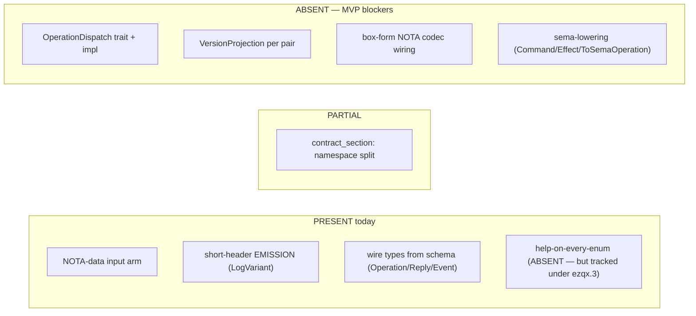
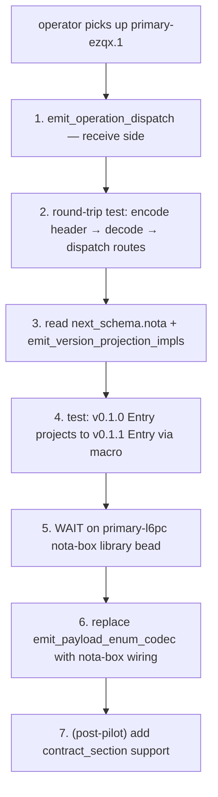

# 2 · Macro implementation gap analysis

*Subagent B / wave 1. Read-only audit of the
`signal-frame-macros` crate against the MVP requirements per
`/323` (latest scope authority) and `/324` (canonical re-spec).
Intent records 388-408 frame the target shape. Output is a
gap matrix + per-gap diff sketches for operator pickup.*

## §1 TL;DR

**Eight MVP-required feature areas evaluated. Four PRESENT,
two PARTIAL, two ABSENT. Top MVP-blocker: the macro does not
emit `OperationDispatch` (header-byte-0 → handler routing per
intent 407 and `/323 §3.1`). Second MVP-blocker:
`VersionProjection` emission for the main/next pair is wholly
absent (intent 406, `/323 §3.2`). Third: the NOTA-data input
arm exists but is one-input only — there is no `next_schema`
declaration mechanism, so even if projection emission were
added it has no second schema to diff against.**

The eight feature areas, condensed:



The PRESENT side is sturdier than expected — the recent
landing of `schema_reader.rs` plus the `emit_log_variant_impl`
hierarchical-positional emission means short-header emission
already works for the Spirit shape end-to-end. The blockers
are receive-side (dispatch), version-pair (projection), and
the box-form wire library + its macro wiring (a sibling bead).

## §2 Gap matrix

Rows in MVP-blocker order. **MB** = MVP-blocking. **MS** =
MVP-supporting (improves but not strictly blocking). **PM** =
post-MVP per `/324 §6`.

| # | Feature | Status | File / line | Operator-actionable next step | Class |
|---|---|---|---|---|---|
| 1 | NOTA-data input arm (bracket-vector syntax) | PRESENT | `lib.rs:56-66` + `schema_reader.rs:1-597` | None — input detection (`'['` prefix), `CARGO_MANIFEST_DIR/schema.nota` load, sandboxed path-ref resolution, NOTA-codec-based parser all working. | done |
| 2 | Schema-derived signal types (Operation / Reply / Event from schema) | PRESENT | `schema_reader.rs:332-408` + `emit.rs:245-325` | None — schema root enums map to request/reply/event blocks; events with `belongs` annotations synthesize stream blocks. Limitation: one domain stream per channel (`schema_reader.rs:431-435`) is fine for Spirit. | done |
| 3 | Short-header EMISSION (`LogVariant` impl) per channel | PRESENT | `emit.rs:342-381` (entry) + `:383-526` (hierarchical-positional walker) | None — byte 0 = operation variant index; bytes 1-7 = recursive sub-enum slots per `/322 §4` discipline. Frame builder wires via `Frame::with_short_header(request.short_header(), …)` at `emit.rs:824-838`. | done |
| 4 | Help-on-every-enum (recursive Help variant auto-injection) | ABSENT | `emit.rs:245-325` (request/reply/event emitters do not inject `Help`) | Add per-enum `Help(Help)` variant injection in the three emit_*_enum functions, plus emit a recursive `Help` enum carrying `(EnumKind, OptionalVariantKind)`. Tracked under `primary-ezqx.3` — parallel slot, NOT blocking MVP per `/324 §6`. | PM-tracked |
| 5 | `contract_section:` declaration (golden-ratio namespace split per `/307`) | PARTIAL | `model.rs:10-18` (`ChannelSpec` has no `contract_section` field); `schema_reader.rs:562-573` (observable hardcoded for `signal-persona-spirit`) | Add `contract_section: NamespaceSection,` field on `ChannelSpec`; parse a top-level `(ContractSection Small|Big)` record from NOTA schema OR an explicit Rust-syntax `contract_section:` line; emit a compile-time assertion via `assert_triad_sections!` (already landed per `primary-avog`). NOT MVP-blocking for the Spirit pilot per `/324 §6` (single-component pilot) but blocks any owner-contract cutover. | MS |
| 6 | Box-form NOTA encoding (root-object + length-prefixed boxes) | ABSENT | `emit.rs:840-946` (codec emits the older fully-inline `start_record` / `end_record` form) | Wait for `primary-l6pc` (nota-box library bead) to land; then replace `emit_payload_enum_codec` body so each payload's unsized fields encode through `nota_box::encode_box(field_bytes)` after the root, with matching decode-side box iteration. **The macro emission can be staged second** — nota-box library must exist first. | MB (gated by `primary-l6pc`) |
| 7 | `VersionProjection` emission per pair (main/next schema diff) | ABSENT | `schema_reader.rs:17-31` (only reads `schema.nota`, no `next_schema.nota`); `model.rs:10-18` (`ChannelSpec` has no `next_schema` field); `emit.rs` (no `emit_version_projection` function) | (1) Extend `read_default_schema` to also read `next_schema.nota` if present; (2) add `next_schema: Option<SchemaSpec>` on `ChannelSpec`; (3) add `emit_version_projection_impls(spec)` that diffs the two schemas type-by-type and emits `impl VersionProjection<v010::T, v011::T> for ForwardT` with `Identity` for unchanged shapes and field-walk-with-`Into::into` for changed shapes per `/323 §3.2`. Operator hand-writes the one `From<v010::Certainty> for Magnitude` impl. **MVP-BLOCKING per `/323 §3.2` + `/324 §5`.** | MB |
| 8 | `OperationDispatch` trait + impl (header-byte-0 → handler routing) | ABSENT | `emit.rs:17-59` (top-level emit list); no `emit_operation_dispatch` function in source | Add `emit_operation_dispatch(spec)` that emits (a) a `SpiritHandler` trait with `async fn handle_<op_snake>` per request variant, (b) an `OperationDispatch` trait, and (c) a blanket `impl<H: SpiritHandler> OperationDispatch for H` that matches `header.to_le_bytes()[0]` against the index range and routes to the corresponding `handle_<op>` with body decoded as the variant's payload type. Per `/323 §3.1` worked example. **MVP-BLOCKING per `/323 §3.1` + `/324 §5`.** | MB |
| 9a | Sema operations + sema-lowering emission (Layer 2/3): Command, Effect, ToSemaOperation, ToSemaOutcome, Lowering trait wiring | ABSENT | nothing in `emit.rs` references `Command`, `Effect`, `ToSemaOperation`, `ToSemaOutcome`, or `Lowering` | Per `/324 §6` and `/323 §9`, full sema-lowering is **post-MVP**. The MVP only requires the wire layer + dispatch + projection. Spirit's daemon hand-wires sema lowering today. Tracked: future bead beyond `primary-ezqx.1`. **NOT MVP-blocking per current scope.** | PM |
| 9b | Symmetric `LogVariant` for sema observation types | PARTIAL | `emit.rs:342-381` emits LogVariant only for the request enum (`spec.request.name`) | The reply enum and event enum also need `LogVariant` impls per intent 390 (sema gets its own short header). Currently only the operation root gets the short-header emission. Mitigation: hand-impl on sibling `signal-sema` types per `/324 §5` (`signal-sema/src/operation.rs` extend). For the MVP this is hand-done; the macro extension is post-MVP. | MS (hand-done for MVP) |

**Tally:**
- 3 PRESENT (rows 1, 2, 3) — full credit.
- 2 PARTIAL (rows 5, 9b) — partial credit, non-blocking.
- 4 ABSENT (rows 4, 6, 7, 8) — but 4 is parallel-tracked (not blocking) and 6 is gated on a sibling bead.
- **2 ABSENT and MVP-blocking now: rows 7 (VersionProjection) and 8 (OperationDispatch).**
- 1 PM-deferred (9a).

The top-of-list operator scope reduces to: **add `emit_operation_dispatch`, add `emit_version_projection_impls`, and (when nota-box lands) replace `emit_payload_enum_codec` body with box-form wiring.**

## §3 Per-gap deep dive for top blockers

### §3.1 Gap 8 — `OperationDispatch` trait + impl (top MVP-blocker)

**What `/323 §3.1` requires.** The macro emits, per channel, a
handler trait with one `async fn handle_<op_snake>` per
request variant, plus a blanket impl that matches the
short-header byte 0 against the variant index and routes:

```rust
// Macro-emitted from schema's Operation enum:
pub trait SpiritHandler {
    type Error;
    async fn handle_state(&mut self, payload: Statement) -> Result<Reply, Self::Error>;
    async fn handle_record(&mut self, payload: Entry) -> Result<Reply, Self::Error>;
    // ... one per Operation variant
}

pub trait OperationDispatch {
    type Error;
    async fn dispatch(&mut self, header: ShortHeader, body_bytes: &[u8])
        -> Result<Reply, Self::Error>;
}

impl<H: SpiritHandler> OperationDispatch for H {
    type Error = H::Error;
    async fn dispatch(&mut self, header: ShortHeader, body_bytes: &[u8])
        -> Result<Reply, Self::Error>
    {
        let bytes = header.to_le_bytes();
        match bytes[0] {
            0 => { let p: Statement = decode_body(body_bytes)?; self.handle_state(p).await }
            1 => { let p: Entry = decode_body(body_bytes)?; self.handle_record(p).await }
            // ... per Operation variant
            n => Err(/* UnknownVariant(n) */),
        }
    }
}
```

The handler-trait method name is `handle_<variant_snake>`;
the variant index used in the match arm is **identical to the
index emitted into `bytes[0]` by `emit_log_variant_impl` at
`emit.rs:349-351`** — so emit and consume agree by
construction.

**Where the new function goes in `emit.rs`.** Add immediately
after `emit_log_variant_impl` (current `emit.rs:342-381`). Wire
into the top-level `emit` function (current `emit.rs:17-59`)
between `log_variant_impl` and `request_kind`. The new
function reads `spec.request.variants` and emits the trait +
blanket impl using the same enumerate-index pattern the
LogVariant function uses.

**Two design corners surfaced by `/323 §8.3` (still open per
`/324 §10.2`).** (a) Per-variant handler vs typed-channel monolithic
handler — `/323 §8.3` leans per-variant; `/324 §10.2` confirms.
(b) Async vs sync — `/324 §10.2` leans `async fn` because Spirit's
daemon is Kameo-actor-based. **Operator should mark with a
DESIGN-DECISION-REVIEW comment per `/320 §2` discipline:**

```rust
// DESIGN-DECISION-REVIEW (designer/323 §8.3 + /324 §10.2):
// per-variant async handler trait. Alternative: typed-channel
// monolithic handler / sync. Revisit if dispatch ergonomics
// or async runtime fights this shape.
```

**Decode helper.** `decode_body` is a small NOTA-codec
delegation; the dispatch impl needs access to a generic helper
function (`fn decode_body<P: NotaDecode>(bytes: &[u8]) -> Result<P, _>`)
that wraps a `Decoder::new(text).decode::<P>()`. The macro can
either (a) emit the helper inline once per channel, or
(b) delegate to a `signal_frame::decode_body` already on the
frame crate. **Lean (b)** — keeps emitted code small and the
codec story uniform with `Frame::with_short_header`.

**Failure mode and the `n => Err(…)` arm.** When the inbound
header byte 0 doesn't match any known operation index, the
dispatch must return a structured error (not panic). Use the
`Error` associated type so the daemon can route the rejection
to its own error channel; the macro doesn't fabricate a new
`UnknownVariant` enum. **Lean:** add a `nota_codec::Error::UnknownVariant`
or extend the existing `signal_frame::FrameError` with a
`HeaderByteUnknown(u8)` variant. Either way, operator's diff
threads the chosen error type through the impl.

### §3.2 Gap 7 — `VersionProjection` emission per pair (second MVP-blocker)

**What `/323 §3.2` requires.** Read two schemas (`schema.nota`
+ `next_schema.nota`), diff type-by-type, and emit:

```rust
// For unchanged types (Topic, Summary, Context, Quote, Kind):
impl VersionProjection<v010::Topic, v011::Topic> for ForwardTopic {
    type Error = std::convert::Infallible;
    fn project(source: v010::Topic) -> Result<v011::Topic, Self::Error> {
        Ok(v011::Topic(source.0))
    }
}

// For changed types (Entry — changed because Certainty → Magnitude):
impl VersionProjection<v010::Entry, v011::Entry> for ForwardEntry {
    type Error = ProjectionError;
    fn project(source: v010::Entry) -> Result<v011::Entry, Self::Error> {
        Ok(v011::Entry {
            topic: source.topic.into(),           // Identity (Topic unchanged)
            kind: source.kind.into(),             // Identity (Kind unchanged)
            summary: source.summary.into(),       // Identity (Summary unchanged)
            context: source.context.into(),       // Identity (Context unchanged)
            certainty: source.certainty.into(),   // calls hand-written From<Certainty> for Magnitude
            quote: source.quote.into(),           // Identity (Quote unchanged)
        })
    }
}
```

**Three sub-tasks for operator:**

1. **Extend the schema reader (`schema_reader.rs`).** After
   `read_default_schema` reads `schema.nota`, optionally read
   `next_schema.nota` from `CARGO_MANIFEST_DIR`. If present,
   parse it into a second `SchemaSpec`. Attach to `ChannelSpec`
   via a new field `next_schema: Option<SchemaSpec>` on `model.rs`.

2. **Add a per-type diff routine.** Walk both schemas in
   parallel by enum name. For each enum, classify as
   Unchanged / VariantSetChanged / FieldTypeChanged. The
   diff result drives the emission strategy: Unchanged
   types get an `Identity` projection (zero-cost field-by-field
   `Into::into` calls — works because `From<T> for T` is blanket);
   Changed types get the field-walk emission shown above (still
   `Into::into` per field, but the operator MUST hand-write the
   `From<v010::Certainty> for Magnitude` impl in
   `signal-persona-spirit/src/migration.rs` per `/324 §5`).

3. **Emit per-pair impls.** New function `emit_version_projection_impls(spec)`
   in `emit.rs`. Returns `TokenStream::new()` when `spec.next_schema`
   is `None` (so non-migrating crates emit nothing). When present,
   emits one `impl VersionProjection<v010::T, v011::T> for ForwardT`
   per type that appears in both schemas. Types added in v0.1.1 with
   no v0.1.0 ancestor get no projection (they're net new); types
   removed in v0.1.1 likewise get no projection (operator handles
   in migration.rs or rejects the migration).

**Key subtlety: the `Forward<T>` newtype.** Per `/317-3` the
projection trait is parameterized over a witness type, not the
source/target enum themselves (so different forward/backward/
identity projections can coexist for the same type pair). The
macro emits `pub struct ForwardEntry;` plus the impl on that
witness. Operator should verify the trait shape in
`signal-frame/src/version_projection.rs` (or wherever the
trait lives) matches `/317-3 §10` before emission.

**Why this is compile-time optional.** `/324 §1` + intent 406
say the upgrade code is "compile-time-optional per main/next
pair." When a crate has no `next_schema.nota`, no
`VersionProjection` impls are emitted (zero footprint when no
migration is in flight). When `next_schema.nota` lands, the
emissions appear automatically — no separate macro invocation
required.

### §3.3 Gap 6 — Box-form NOTA encoding wiring

**What `/323 §3.3` requires.** The on-wire encoding for
operation/reply/event payloads splits into a root region
(sized fields inline) plus N length-prefixed boxes (one per
unsized field). The current emission at `emit.rs:840-946`
uses the older `Encoder::start_record(name)` / `end_record`
flow which inlines everything.

**Wait on the sibling bead.** `primary-l6pc` is the
`nota-box` library bead under the `nota` repo (per `/323
§5.3`). The macro CANNOT replace its codec until the library
exists. Sequence: nota-box library lands → operator adds
`nota_box` as a dev dependency of the macros crate (or
re-export through nota-codec) → operator rewrites
`emit_payload_enum_codec` to emit `nota_box::write_root_then_boxes(…)`
calls instead of the current inline form.

**Operator-facing diff sketch (once nota-box lands):**

```rust
// Replace emit_payload_enum_codec at emit.rs:893 with:
fn emit_payload_enum_codec(name: &syn::Ident, kinds: Vec<PayloadKind<'_>>) -> TokenStream {
    let encode_arms = kinds.iter().map(|k| {
        let variant = &k.variant;
        let variant_string = variant.to_string();
        quote! {
            Self::#variant(payload) => {
                let mut writer = ::nota_box::Writer::with_head(#variant_string);
                payload.encode_box(&mut writer)?;
                writer.finish(encoder)
            }
        }
    });
    let decode_arms = kinds.iter().map(|k| {
        let variant = &k.variant;
        let variant_string = variant.to_string();
        let payload = &k.payload;
        quote! {
            #variant_string => {
                let mut reader = ::nota_box::Reader::expect_head(decoder, #variant_string)?;
                let payload = <#payload as ::nota_codec::NotaDecodeBox>::decode_box(&mut reader)?;
                reader.finish()?;
                Ok(Self::#variant(payload))
            }
        }
    });
    // ... emit the impls
}
```

The exact API is for the nota-box library bead to settle. Key
constraint per `/323 §3.3`: each box is length-prefixed (u32
BE matching the workspace length-prefix convention) and box
order matches schema declaration order (positional, no naming).

**Until nota-box lands, the inline codec is correct for MVP
function** — Spirit's daemon end-to-end works on the inline
form. Box-form is an optimization (partial decode / peek)
that the directive pulled into MVP for the wire-format reason
but doesn't change the dispatch semantics. **Operator can
land Gaps 7 and 8 first, then come back to Gap 6 once
nota-box exists.**

### §3.4 Gap 5 — `contract_section:` declaration (golden-ratio split)

**What `/307` requires.** Each contract in a triad declares its
`contract_section` (Small or Big) so the byte-0 namespace
split is enforced at compile time. The two sibling contracts
(`signal-<comp>` and `owner-signal-<comp>`) must agree —
exactly one claims Small, the other Big.

**Current state.** `model.rs:10-18` (`ChannelSpec`) has no
`contract_section` field. The `assert_triad_sections!` macro
landed (per `primary-avog` closed status in `/324 §4`) so the
compile-time check exists; it just isn't being fed from
`signal_channel!`'s emission yet.

**Two ways to declare in NOTA:**

(a) Top-level record at the head of `schema.nota`:

```
[
  [ContractSection Small]
  [Operation
    [Receive HookNotification]
    [Push Push]
    ...
  ]
  [Reply ...]
]
```

(b) Sidecar manifest field (e.g., a key in the package
`Cargo.toml` `[package.metadata.signal_frame]` section). **Lean (a)**
— keeps the schema self-contained per intent 391
(macro consumes schema, not Rust-side metadata).

**Operator's pickup.** This is **not blocking the Spirit pilot
per `/324 §6`** because the Spirit pilot is single-component
(ordinary `signal-persona-spirit` only; the owner
contract isn't migrating in the pilot). Adding contract_section
support is MVP-supporting (improves the compile-time triad
agreement check) and lands cleanly as a follow-up bead.

## §4 What's already present and working — the anchor

Three feature areas are PRESENT and operator should NOT touch
them in the MVP push:

### §4.1 NOTA-data input arm (gap 1) — `lib.rs:56-66`

The macro entry point dispatches by inspecting the first
non-whitespace character of the input. `'['` means NOTA-data
(load `schema.nota` from `CARGO_MANIFEST_DIR`); anything else
falls back to the `syn`-based Rust-syntax parser. The
detection is robust because `[` is invalid as the first
character of a Rust `signal_channel!` invocation (which must
start with `channel`). This satisfies intent 391 ("macro
consumes NOTA schema, not Rust syntax") as a dual-mode
co-existence rather than a hard replacement — both shapes
work while the workspace cuts over.

The DESIGN-DECISION-REVIEW marker is already in place at
`lib.rs:53-55`:

```
// DESIGN-DECISION-REVIEW (designer/320 §2.8): dual input mode.
// Alternative: separate nota_signal_channel! macro. Revisit if
// dual parsing complicates macro internals.
```

The path-ref resolution in `schema_reader.rs:55-128` is
correctly sandboxed (path-refs must stay inside the crate or
sibling-crate workspace directory) per `/320 §2.7`.

### §4.2 Schema-derived signal types (gap 2) — `schema_reader.rs:332-408`

The reader builds `ChannelSpec` from the schema's three root
enums (`Operation`, `Reply`, optionally `Event`). Validation in
`validate.rs:19-53` enforces the root-enum presence and walks
field types to confirm every name resolves to a declared enum
or a known primitive (`String`, integer types, `bool`, `Date`,
`Time`, `Bytes` per `validate.rs:73-78` and the parallel
`emit.rs:557-562` is_primitive check).

Stream block synthesis from `belongs` annotations
(`schema_reader.rs:410-458`) works for the MVP one-stream-per-channel
constraint and matches `/322 §3.4`'s positional-with-collapse
discipline.

### §4.3 Short-header emission (gap 3) — `emit.rs:342-526`

This is the cleverest piece of current emission. The walker
in `emit_slots_for_named_type` (`emit.rs:388-419`) +
`emit_struct_field_slots` (`emit.rs:436-462`) +
`emit_mixed_enum_slots` (`emit.rs:464-526`) implements the
hierarchical-positional encoding per `/322 §4`:

- Byte 0 = operation variant index (always).
- Bytes 1-7 = recursive walk into the payload type per the
  schema definition.
- Leaf enums (all-unit-variant) project to a single byte at
  the next slot.
- Single-variant data records (struct-like wrappers) recurse
  into their fields.
- Mixed enums emit a `match` arm per variant; the variant
  discriminator at its slot, then recurse into the variant's
  payload.

The walker correctly stops at slot > 7 to avoid overflowing
the 8-byte header (`emit.rs:394-399`). The `signal-frame::Frame::with_short_header(request.short_header(), …)`
wiring at `emit.rs:824-838` ensures every frame the macro
emits carries a populated header by construction.

**One small thing worth flagging.** The `field_name_for_type`
hardcode at `emit.rs:551-553`:

```rust
if parent == "Entry" && name == "Magnitude" {
    return Some("certainty".to_string());
}
```

is a Spirit-specific shim handling the field-name skew
(v0.1.1's `Magnitude` type lives at v0.1.0's `certainty` field
position). This is correct for the migration pilot but it's
not generalized. Mark with a DESIGN-DECISION-REVIEW comment
linking to the eventual generalization (the `(field-name type)`
override syntax leaned in `/322 §3.4 Option B` + `/324 §10.1`).

## §5 Recommended landing order

Two MVP-blockers exist. Operator should land them in this
order:



**Rationale for this order:**

1. **Dispatch first** — most-isolated change; doesn't depend
   on schema diff or new wire format; provides the
   receive-side closure the daemon needs.
2. **Projection second** — depends on schema reader extension
   (a small additive change to `schema_reader.rs`); doesn't
   depend on dispatch but stacks cleanly after.
3. **Box-form last** — gated externally on the nota-box
   library bead; can land asynchronously without blocking
   the daemon migration.
4. **contract_section after pilot** — single-component pilot
   doesn't need it; cleaner to land in a separate bead once
   the migration discipline is proven on Spirit.

**Net macro-side scope for `primary-ezqx.1`:** roughly
~250-400 LoC across `model.rs` (~20 LoC), `schema_reader.rs`
(~50 LoC), and `emit.rs` (~200-300 LoC for the two new
emission functions). Smaller than the headline-figure
`/323 §5` "~5-8 operator hours" because each step is mostly
adding a new emit function that mirrors the structural
walks already present for `LogVariant`.

## §6 See also

- `reports/designer/320-mvp-schema-language-pilot-unblock.md` —
  original pilot design + the 13 closed-decision markers
  (`§2`) that operator must inline at code sites.
- `reports/designer/322-spirit-mvp-positional-schema-worked-example.md` —
  Spirit's schema.nota worked example; the short-header emission
  in `emit.rs:342-526` implements this exactly.
- `reports/designer/323-mvp-scope-expansion-per-operator-directive.md` —
  `§3.1` (dispatch), `§3.2` (projection), `§3.3` (box-form),
  `§4` (consolidated picture), `§5` (bead adjustments).
- `reports/designer/324-migration-mvp-spirit-handover-re-specification.md` —
  the navigable index; `§5` is the file-action map that this
  gap matrix expands per macro source.
- `reports/designer/307-design-golden-ratio-namespace-split.md` —
  contract_section design (gap 5 background).
- `reports/designer/317-sema-upgrade-and-macro-convergence-audit/3-next-as-dependency-design.md` —
  VersionProjection trait shape + the witness-type-parameterized
  design (gap 7 background).
- `reports/second-designer/164-nota-schema-language-vector-of-root-verb-enums-2026-05-24.md` —
  schema language v3 grammar (the format `schema_reader.rs`
  consumes).
- `reports/second-designer/166-self-audit-2026-05-24.md` —
  the intent-records-388-408 catalog this report referenced.
- `/git/github.com/LiGoldragon/signal-frame/macros/src/lib.rs` —
  entry point + dual input arm.
- `/git/github.com/LiGoldragon/signal-frame/macros/src/parse.rs` —
  Rust-syntax parser (legacy arm).
- `/git/github.com/LiGoldragon/signal-frame/macros/src/schema_reader.rs` —
  NOTA-data parser + ChannelSpec synthesis from schema.
- `/git/github.com/LiGoldragon/signal-frame/macros/src/model.rs` —
  `ChannelSpec` and friends; needs `next_schema` and
  `contract_section` fields for the gaps.
- `/git/github.com/LiGoldragon/signal-frame/macros/src/validate.rs` —
  semantic validation; current schema-root validation suffices for MVP.
- `/git/github.com/LiGoldragon/signal-frame/macros/src/emit.rs` —
  emission pass; receives the two new functions per `§3.1` + `§3.2`.
- `/git/github.com/LiGoldragon/signal-frame/ARCHITECTURE.md` `§5` —
  three-tier sizing + verb namespace discipline; `§5.4`
  decision tree mirrored by the current LogVariant walker.
- `/git/github.com/LiGoldragon/signal-persona-spirit/src/lib.rs` —
  the consumer that will switch to NOTA-data input.
- Beads: `primary-ezqx.1` (MVP schema-language pilot — the
  bead this report scopes), `primary-l6pc` (nota-box library
  — gates gap 6), `primary-ezqx.3` (recursive Help — gap 4).
