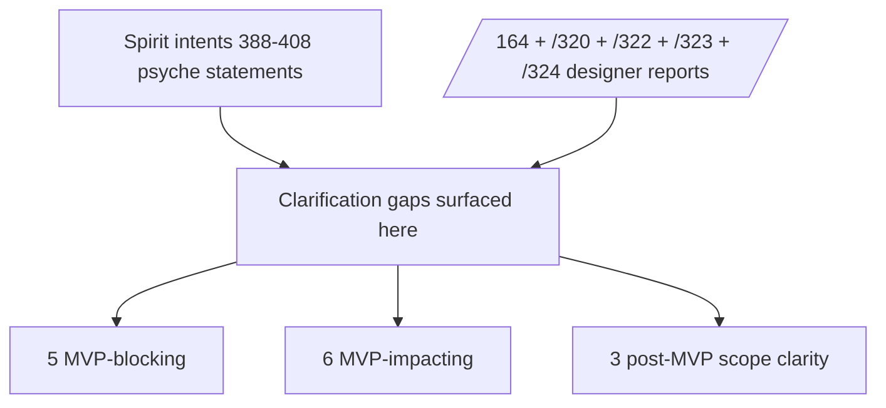

# Design clarifications needed — MVP schema-language

*Subagent C of the /167 meta-session. Pure analysis: finds where the
psyche-stated design (Spirit intent records 388-408) and the current
designer reports (/164 + /320 + /321 + /322 + /323 + /324) DISAGREE,
have AMBIGUITY, or have UNANSWERED open questions that block MVP
implementation on `primary-ezqx.1` (the MVP schema-language pilot
for Spirit). No code edits, no report edits — clarification analysis
only.*

Date: 2026-05-24
Lane: second-designer (subagent C of /167)
Authority basis: intent 412 (Decision Maximum, subagent dispatch
during MVP), intent 414 (Clarification Maximum, MVP active phase).

## §1 TL;DR — N clarifications needed, K MVP-blocking

**Counted: 14 clarifications surfaced. Of those, 5 are MVP-blocking
(operator cannot proceed without a decision); 6 are MVP-impacting
(operator can proceed with a lean but should resolve before pilot
lands); 3 are post-MVP that should be ratified for scope clarity.**

The MVP-blocking five all sit at the seam between what the macro
emits and what the daemon plugs into — places where the schema
language has to commit to an interface shape and operator needs
that shape pinned before code lands. The MVP-impacting six are
secondary mechanism choices where a lean exists but the trade-off
has not been ratified.



The single most decision-load-bearing clarification: **§3.1 — engine
annotation timing**. /164 §5 + §9.1 propose `(engine assert)` annotations
in the schema as the source of truth for Layer 3 sema-lowering
emission. /320 §2.1 closes Shape A (explicit annotation). BUT /322 §6.3
+ /324 §5 list engine annotations as POST-MVP and Layer 3 emission
as deferred. The macro library that operator is building on
`primary-ezqx.1` therefore needs to know: does the MVP-emitted macro
parse `(engine X)` annotations now (even if it doesn't act on them
for Layer 3 yet) or does the annotation grammar enter post-MVP? This
determines whether the schema reader's tokenizer needs that production
in the v0.1 grammar or whether it can defer the production.

## §2 Clarification matrix

| # | Question | Current state | Impact | Recommended lean |
|---|---|---|---|---|
| 1 | Engine annotation timing — MVP grammar accepts `(engine X)` or defers? | /164 §5 + /320 §2.1 say YES annotation; /322 §6.3 + /324 §5 defer Layer 3 | MVP-BLOCKING — grammar shape | Accept annotation in MVP grammar; emit Layer 3 lazily |
| 2 | Single-variant struct collapse — emit Rust struct? | /320 §2.2 + /322 §4.2 say struct | MVP-IMPACTING — code shape | DECIDED: struct. Confirm sub-question: do Help/discriminator-derive macros still receive enum-shape introspection? |
| 3 | Built-in primitive set — Date + Time encoding shape? | /320 §2.4 lists Date YYYY-MM-DD, Time HH:MM:SS | MVP-BLOCKING — Spirit RecordProvenance uses both | Pin three-field-each rkyv encoding (year/month/day, hour/min/sec) — confirm format string parsing rules |
| 4 | Schema file location | /320 §2.3 says `<repo>/schema.nota` | DECIDED — not blocking | OK |
| 5 | Migration mode — dual input vs new macro | /320 §2.8 says dual input | DECIDED — not blocking | OK |
| 6 | Schema component shape — separate triad vs absorbed | Intents 397-400 carry open question explicitly | POST-MVP scope clarity | Library-only for MVP; triad decision post-pilot |
| 7 | Box layout coordinate notation — `(vector-N element-M)` form | Intent 404 names it; no designer report pins it | MVP-IMPACTING — nota-box library API surface | Codify in nota-box library bead `primary-l6pc` — needs explicit syntax design |
| 8 | Reverse-projection emission — MVP cover both forward + reverse? | /317/3 + /323 §3.2 cover forward only | MVP-IMPACTING — read-side migration | Forward only for MVP; reverse only matters for rollback |
| 9 | OperationDispatch async-by-default | /324 §10.2 says async lean; not pinned | MVP-BLOCKING — trait signature | Async (per /323 §8.3 + /324 §10.2); macro emits `async fn handle_*` |
| 10 | Field-naming override syntax — when do we need it? | /322 §3.4 + /324 §10.1 lean Option A (type-name default) | MVP-IMPACTING — Spirit's `certainty` field | Type-name default for MVP; Spirit gets `magnitude` field; rename post-MVP |
| 11 | Path-ref security — exact resolution allow-list | /320 §2.7 + /322 §3.3 say sandboxed | DECIDED — not blocking | OK but document the symbolic-ref resolution algorithm |
| 12 | LogVariant trait — sema vs signal trait reuse | /320 §2.13 says reuse | DECIDED — not blocking | OK |
| 13 | `next_schema` declaration shape in NOTA | /164 §8.3 sketched `(next_schema "path")`; /323 §3.2 names it but no NOTA syntax | MVP-BLOCKING — operator needs the grammar | Add `(next_schema [path/to/v011/schema.nota])` as a top-level vector entry; reader treats specially |
| 14 | Identity vs hand-written From boundary — when does the macro emit From vs require hand-written? | /323 §3.2 says "fields with changed shape require hand-written From"; no exhaustive rule | MVP-BLOCKING — operator picks for Spirit's Certainty→Magnitude | Macro emits `Identity` when type names + variant list + field list match exactly; ANY shape divergence requires hand-written From in `src/migration.rs` |

## §3 Top 5 MVP-blocking clarifications — deep dive

### §3.1 Engine annotation timing — MVP grammar accepts `(engine X)` or defers?

**The disagreement.** /164 §5 + §9.1 ratify Shape A (explicit annotation)
as the framework for Layer 3 emission. /320 §2.1 records the DECISION
as Shape A explicit annotation. The schema in /164 §6.1 uses
`(engine assert)` throughout. /322 §1 — explicitly the MVP schema —
DROPS the engine annotations. /322 §6.3 explicitly says engine
annotations are post-MVP. /323 §2 + §5.1 frame Layer 2 + Layer 3 as
IN-MVP (the OperationDispatch trait is part of `primary-ezqx.1`).
/324 §5 lists OperationDispatch as part of MVP via `/323 §3.1`.

**Reconcile.** Two different concerns are being conflated:
- Layer 2 (Command + Effect + ToSemaOperation + ToSemaOutcome)
- Layer 3 (engine routing — what method on `Engine` each Command calls)

/323 §3.1 actually delivers a THIRD thing — header-byte-0 dispatch
routing (which `handle_*` method the daemon receives a decoded
payload for). That's NOT Layer 3 in /164's framing; it's a wire-side
dispatcher. /164's Layer 3 specifies the engine method (engine.assert,
engine.match, etc.), which is upstream of which daemon handler runs.

The clarification: **Spirit's MVP doesn't emit Layer 2 OR Layer 3 in
the /164 sense — it emits the wire-side `OperationDispatch` trait
(per /323 §3.1) routing to `SpiritHandler` methods the daemon
implements, and the daemon's handlers internally call `engine.assert`
etc. Engine routing stays hand-written inside the daemon's
`SpiritHandler` impl**. The schema does NOT need `(engine X)`
annotations for MVP.

**Recommended lean.** The MVP schema reader's grammar SHOULD accept
`(engine X)` annotations even though the MVP emit path doesn't use
them — accepting-but-ignoring is forward-compatible. When Layer 2/3
emission lands post-MVP, the schemas already in production won't
need re-authoring. Path:

1. Reader parses `(engine X)` as a recognized annotation token.
2. Validator allows it on Operation variant payloads.
3. Emit pass ignores it (MVP only emits OperationDispatch routing on
   header byte 0, not engine routing).
4. Spirit's MVP schema (/322 §1 shape) doesn't include annotations.
5. Post-MVP, schemas that want Layer 3 emission add `(engine X)` and
   the emit pass starts honoring them.

This needs a designer ratification. The split between OperationDispatch
(wire-side header routing) and engine routing (daemon-internal sema
method dispatch) is not currently explicit in /323 + /324 — the
reports use "dispatch" for both. Operator may build the wrong thing
without this distinction.

**Evidence.**
- /164 §5.1 — "Today (per /163's audit), the macro emits Layer 1
  only. The daemon HAND-WRITES Layer 2 (Command/Effect/ToSemaOperation/
  ToSemaOutcome) and Layer 3 (which engine method each command calls)."
- /323 §3.1 — OperationDispatch emit specified as MVP, but the
  example shows `self.handle_record(entry)` not `engine.assert(...)`.
- /322 §6.3 — engine annotations listed as post-MVP.
- /324 §6 — `primary-ezqx.1` scope; OperationDispatch listed; Layer 3
  engine routing not explicitly listed.

### §3.2 Date + Time primitive encoding shape

**The disagreement.** /320 §2.4 says Date encodes as `YYYY-MM-DD` and
Time as `HH:MM:SS`, both as `three fields` in rkyv. /322 §1 uses Date
+ Time in `RecordProvenance`. /164 §3.5 lists same. But:
- What's the rkyv-archived shape? Three `u16`? Three `u8`? Packed
  into one `u32`?
- What's the NOTA bare-token form? `2026-05-24` reads as a
  PascalCase-violating bare token (per nota-design.md case-rules —
  bare tokens must be PascalCase OR camelCase OR kebab-case, none
  of which include digits with hyphens).
- Is the parser case-sensitive about T separator (ISO 8601) or
  whitespace?

**Reconcile.** Spirit's deployed contract uses `RecordCapturedAt(...)`
fields today with a string `[2026-05-24]` representation; the
canonical NOTA encoding has never been pinned. The MVP schema in
/322 §1 declares `Date` and `Time` as primitive types but doesn't
show their NOTA literal form. Operator can't write the Spirit schema
file without the literal-form spec.

**Recommended lean.**
- NOTA literal form: bracket-string `[2026-05-24]` and `[14:32:05]`
  decoded by the Date/Time primitive's NotaDecode impl. Bare tokens
  (e.g., `2026-05-24`) are rejected per the case-rules. Bracket form
  is the only acceptable surface.
- rkyv encoding: pack into `u32` for Date (16 bits year + 4 bits
  month + 5 bits day + 7 reserved); pack into `u32` for Time (5 bits
  hour + 6 bits min + 6 bits sec + 15 nanosecond / reserved). OR
  three separate `u8/u16` fields if alignment matters more than
  density. **Pin the choice in the nota repo's primitive impl —
  operator picks based on existing rkyv idioms.**
- Time-zone: MVP is naive (no TZ). UTC assumption documented; TZ-aware
  Date+Time is post-MVP.

**Why MVP-blocking.** Spirit's RecordProvenance MUST encode capture
date/time. The schema file can't compile if Date+Time primitive shape
isn't pinned.

### §3.3 OperationDispatch async-by-default

**The disagreement.** /323 §8.3 "Lean: the macro emits `async fn
handle_*` signatures". /324 §10.2 carries forward as "Lean". Neither
report PINS the decision.

**Reconcile.** Spirit's daemon is Kameo-actor-based; every actor
method is async. A sync `handle_*` trait would force the actor
wrapper to spawn-and-await internally, doubling the await cost per
operation. An async trait is the natural shape.

BUT: the contract crate (signal-persona-spirit) is currently no-std-
compatible per /163 §2 (its types are pure data types — no I/O).
Adding `async fn` to a trait declared in the contract crate pulls
the `async-trait` dependency or commits to Rust's native async-trait
GATs (stable since 1.75). Either choice has trade-offs.

**Recommended lean.** Pin async; use Rust 1.75+ native async-trait
GATs (no extra dependency); document the MSRV bump (probably already
landed for upgrade triad work). Spirit daemon implements `async fn
handle_record(&mut self, entry: Entry) -> Result<Reply, Error>` etc.
naturally. Sync consumers (rare; testing fixtures only) wrap with
`block_on`.

**Why MVP-blocking.** The OperationDispatch trait shape is on the
critical path — operator can't emit it without knowing whether the
methods are async. Both directions land different code.

### §3.4 `next_schema` declaration shape in NOTA

**The disagreement.** /164 §8.3 sketched a `(next_schema "path")`
declaration as a top-level vector entry alongside `Operation`,
`Reply`, `Event`, etc. /323 §3.2 names the mechanism (read both
schemas, diff, emit projection) but DOESN'T show what the
declaration looks like in NOTA. /324 §6 lists `next_schema` as
something operator writes but doesn't give the form.

**Reconcile.** Three candidate shapes:

| Shape | NOTA syntax | Notes |
|---|---|---|
| A | `(next_schema [../signal-persona-spirit-next/schema.nota])` as a top-level vector entry | Symmetric with existing path-refs |
| B | A separate `next.schema.nota` file convention (no in-schema declaration) | Convention-based; macro discovers by file system |
| C | A side-car declaration in Cargo.toml (e.g., `[package.metadata.signal-channel] next_schema = "..."`) | Out-of-NOTA configuration |

**Recommended lean.** Shape A. Keeps everything in the schema file;
follows the path-ref discipline already established for cross-schema
references (per /322 §3.3). Concrete spec:

```nota
[
  (Operation ...)
  (Reply ...)
  ...
  (next_schema [../signal-persona-spirit-next/schema.nota])
]
```

The `next_schema` entry MUST appear at most once in the root vector.
The reader treats it as a meta-declaration (not an enum); the
validator resolves the path, reads the v0.1.1 schema, diffs, feeds
both schemas to the emit pass.

**Why MVP-blocking.** `primary-ezqx.1`'s scope (per /323 §5.1
sub-task 12) requires VersionProjection emission. Operator can't
implement the emit pass without knowing how the v0.1.1 schema is
discovered. The mechanism is named but the syntax isn't pinned.

### §3.5 Identity-vs-hand-written-From boundary rule

**The disagreement.** /323 §3.2 says "Types unchanged across versions
get an `Identity` projection (zero-cost); types with schema changes
get the macro-emitted projection that calls into hand-written `From`
impls for the actual transform logic". /324 §7 says "Identity for
unchanged; field-walk for changed". Neither pins the EXACT rule for
"unchanged".

**Reconcile.** Concrete cases:
- Same enum name, same variant list, same order — Identity.
- Same enum name, same variants, different order — ??? (rkyv
  discriminator changes; not Identity)
- Same struct name, same fields, different order — ??? (rkyv field
  order matters)
- Same enum name, EXTRA variant added at the end — Identity for
  v0.1.0 → v0.1.1 forward (old data has no new variant). Reverse
  needs explicit handling.
- Same enum name, variant REMOVED — Forward needs explicit handling
  (old data may have the removed variant).
- Same struct, ADDED field — Forward needs hand-written `From` to
  provide a default for the new field.
- Same struct, REMOVED field — Forward auto-discards (Identity-like
  but lossy); reverse needs hand-written.
- Renamed type — Identity if name-mapping is provided; else error.

**Recommended lean.** Conservative rule:

| Diff between v010 and v011 | Macro decision |
|---|---|
| Same name + same field list + same field order + same field types | Identity |
| Same name + same variant list + same variant order + same payload types | Identity |
| EXTRA enum variant at end of v011 declaration | Identity forward (old data unaffected) |
| ANY other shape difference | REQUIRES hand-written `From` in `src/migration.rs`; macro errors with span pointing at the diff site if missing |

The macro should print a build-error like:
```text
error: cannot derive VersionProjection<v010::Entry, v011::Entry>
note: field `certainty` changed type from `v010::Certainty` to `v011::Magnitude`
help: add `impl From<v010::Certainty> for v011::Magnitude` in src/migration.rs
```

This makes the divergence visible at compile time and forces the
operator to write the precise transform; no silent data loss.

**Why MVP-blocking.** For Spirit's MVP, the ONE schema change
(Certainty 3-variant → Magnitude 7-variant) MUST land as a hand-
written From. If the macro silently emits Identity (because both
field positions are "magnitude" and both names are "certainty
slot"), data corrupts. Operator needs the rule pinned.

## §4 Lower-priority clarifications (not MVP-blocking but should resolve soon)

### §4.1 Box layout coordinate notation `(vector-N element-M)`

Intent 404 names this notation but no designer report has pinned the
exact syntax. Concretely:
- Is it `(vector-1 element-3)` — kebab-case with numbers?
- Or `(box 1 3)` — keyword + positional?
- Or `(.1.3)` — projection-path style?

`primary-l6pc` (the nota-box library bead per /324 §4) is the home
for this decision. Operator on that bead needs the syntax pinned;
the schema language doesn't directly emit this notation (it's a
runtime/text-projection form), so the schema-language emit pass on
`primary-ezqx.1` is decoupled.

**Recommended lean.** Defer to `primary-l6pc` operator's choice;
sanity-check the choice in a designer review. Initial lean: `(box N
element M)` as keyword + two positionals — readable, NOTA-positional.

### §4.2 Reverse-projection emission scope

/317/3 §5 designed reverse projection (v011 → v010) for rollback
scenarios. /323 §3.2 covers forward only. The MVP doesn't need
reverse projection until rollback is operationally required.

**Recommended lean.** Forward-only for MVP. Reverse projection emission
lands when production has an actual rollback scenario — not before.
The schema diff infrastructure is symmetric (forward + reverse use
the same diff), so adding reverse is a small follow-up bead.

### §4.3 Schema-component triad shape

Intent 397 explicitly carries the open question: "is this a separate
triad (schema) or absorbed into upgrade-daemon? Medium certainty."
Intent 400 carries the question of library-separation: co-located
with the daemon vs separate repo.

**Recommended lean.** Library-only for MVP (per /320 §6 and /324 §6).
The schema-component daemon is post-MVP. Decision on separate-triad
vs absorbed-into-upgrade-daemon can wait until the runtime registry
has a concrete consumer. The library face (per intent 399) is what
the macro consumes — and that lives in `signal-frame-macros` for
MVP; it can move to a dedicated `schema-types` crate post-MVP
without breaking consumers.

### §4.4 Help-on-every-enum + single-variant-struct interaction

If a single-variant data-carrying enum collapses to a Rust struct
(per /320 §2.2), does it still get a `Help` variant injected? Structs
don't have variants. /312 + intents 359/363-365 specify Help-on-
every-enum; the collapse rule may break the Help discipline.

**Recommended lean.** Help injection happens at the SCHEMA level
before the Rust-collapse step. The schema's Entry IS an enum with
one variant; the macro injects a second Help variant, then collapses
the now-two-variant enum to Rust... wait, that breaks the collapse
rule.

Resolution: Help injection means the schema's `Entry` becomes
`(Entry (Entry topic ... quote) Help)` — a two-variant data-carrying
enum. The collapse rule should specify: collapse to struct ONLY when
the schema's enum has EXACTLY one data-carrying variant AND no
synthetic Help injection (i.e., the contract opts out of Help, or
Help is post-MVP).

For MVP, Help is post-MVP (per /320 §3.2 + /324 §6), so the
single-variant-struct collapse works cleanly. Once Help lands (per
`primary-ezqx.3`), this interaction needs design.

### §4.5 The `belongs <StreamName>` annotation grammar

/320 §2.5 + /322 §1 use `(StateChanged (StateChanged belongs DomainStream))`
to declare event-to-stream membership. The shape `belongs DomainStream`
appears INSIDE a positional record, but it has the form of a labeled
field. This violates the positional-only discipline (per nota-design.md).

**Recommended lean.** The annotation should follow positional NOTA
discipline. Either:
- A: Treat `belongs` as a record tag: `(StateChanged State (belongs DomainStream))`
  where `(belongs DomainStream)` is a sub-record at the variant
  payload's annotation slot.
- B: Stream membership goes in a separate top-level entry:
  `(StreamMembership (StateChanged DomainStream) (RecordCaptured DomainStream))`.
- C: Annotation at variant-tag level: `(StateChanged (engine event-on DomainStream))`
  — parallel to `(engine assert)` but for stream routing.

Option B is cleanest (separates concerns); Option A is least syntax
disruption; Option C is most uniform with engine annotation.

**Why MVP-impacting not blocking.** Spirit's events DO need stream
declarations for MVP. But the grammar choice can be settled at
implementation time and codified after.

### §4.6 Cycle detection in path-ref graph

/320 §2.7 + §3.4 mention "no cycles in the path-ref graph". What
does the cycle detector do on detection? Error with the cycle path?
Silently truncate? Allow self-reference (a schema that path-refs
itself for testing)?

**Recommended lean.** Error with the full cycle path printed:
```text
error: schema path-ref cycle detected
  signal-persona-spirit/schema.nota
    → ../signal-sema/magnitude.schema.nota
    → ../signal-persona-spirit/schema.nota  ← cycle here
```

Self-reference is always an error.

## §5 What IS settled (anchor list)

These design decisions are clear and operator-ready:

1. **Top-level grammar shape.** NOTA vector of root-verb enum
   declarations (intent 393, /164 §3.1).
2. **Two-layer enum-of-enums mandatory.** Variant payloads are
   enums or data-carrying enums; primitives terminate (intent 394,
   /164 §3.3).
3. **Single declaration kind.** No more Leaf/Branch/Newtype/Channel/
   Primitive distinction — everything is an enum, primitives are
   not declared (intent 391 + 393 + 394, /164 §3.2).
4. **Path-refs for splitting + cross-crate.** Bracket-string file
   paths in variant payload position (intent 395, /164 §4 + /320
   §2.7).
5. **Resolution sandboxing.** Paths resolve to (a) sibling files
   in the same crate's schema directory, (b) Cargo-dep crates via
   symbolic refs. No arbitrary FS traversal (/320 §2.7).
6. **Schema file at repo root.** `<repo>/schema.nota` per /320 §2.3.
7. **Bracket strings only.** Authored NOTA uses `[text]` not `"text"`
   (intent 401). Block strings `[| ... |]` for multiline (intent 402).
8. **Built-in primitive set.** String, u8-u64, bool, Date, Time,
   Bytes, [Vec T], [Option T] (/320 §2.4). NO signed ints, NO floats,
   NO char for MVP.
9. **Single-variant data-enum collapses to Rust struct.** Operator
   emits `struct Entry { ... }` not `enum Entry { Entry { ... } }`
   when there's exactly one data-carrying variant (/320 §2.2).
   (See §4.4 for Help interaction.)
10. **8-enum 64-bit ShortHeader layout — MVP even-byte split.** 1
    root + 7 sub-enums, each one byte; no sub-byte packing (intent
    392, /320 §2.9 + §2.10).
11. **Hierarchical-positional header layout.** Byte 0 = root variant
    discriminator; bytes 1-7 = sub-enum slot discriminators in
    parallel (/320 §2.10, /321 §3.3).
12. **ShortHeader newtype landed.** `ShortHeader(u64)` in
    `signal-frame/src/frame.rs:20`; `Frame::with_short_header()` and
    `short_header()` already exist (operator `primary-2cjv`).
13. **LogVariant trait reused for sema-side.** No separate
    `SemaLogVariant` trait (/320 §2.13).
14. **Dual-input macro arm.** `signal_channel!` accepts BOTH Rust-
    syntax and NOTA-data input during transition; first-token
    `[` check disambiguates (/320 §2.8).
15. **Channel-section by crate prefix.** `signal-X` → big section;
    `owner-signal-X` → small section; macro reads `CARGO_PKG_NAME`
    (/320 §2.6).
16. **Macro three-layer emit framing.** Layer 1 (wire) + Layer 2
    (sema operations) + Layer 3 (sema lowering) is the conceptual
    framework. MVP delivers Layer 1 + the wire-side OperationDispatch
    routing (per /323 §3.1) — Layer 2 + Layer 3 in /164's sense
    are post-MVP. (Clarification §3.1 above.)
17. **Schema-derived version projection in MVP.** Per intent 405 +
    406, MVP Spirit runs on schema-derived code AND derives the
    v0.1.0→v0.1.1 projection from the schema diff. Compile-time
    optional per main/next pair (intent 406, /323 §3.2).
18. **Box-form NOTA library is its own crate.** Per intent 408,
    `primary-l6pc` creates `nota-box` library; not folded into the
    macro crate.
19. **Hard-handover cutover with offline-test marker.** Spirit
    v0.1.0 → v0.1.1 cutover is hard handover (/323 §10); offline
    test step (§10.1); database-test-passed marker (§10.4) in the
    sema-engine commit log (Option A).
20. **MVP-deferred items.** Sub-byte packing (intent 392), schema
    component daemon (intents 397-400), full sema bytes 1-7 layout
    (intent 390), recursive Help (`primary-ezqx.3`), mass workspace
    cutover, owner-contract schema migration (/320 §3.2 + /324 §6).
21. **OperationDispatch routes on header byte 0.** Per intent 407
    + /323 §3.1; receiver matches byte 0 to handler method without
    full body decode.
22. **Schema reader textually substitutes path-refs.** Reader
    resolves before macro sees content; macro never processes a
    path-ref (/164 §4.3).

## §6 See also

### Reports

- `/home/li/primary/reports/second-designer/164-nota-schema-language-vector-of-root-verb-enums-2026-05-24.md`
  — schema language v3 (the framing this clarification work refines)
- `/home/li/primary/reports/designer/320-mvp-schema-language-pilot-unblock.md`
  — 13 closed design decisions (§2 still authoritative); MVP scope
  superseded by /323 + /324
- `/home/li/primary/reports/designer/321-mvp-visual-state-of-play.md`
  — foundation diagrams (status-bannered)
- `/home/li/primary/reports/designer/322-spirit-mvp-positional-schema-worked-example.md`
  — Spirit MVP schema file (canonical)
- `/home/li/primary/reports/designer/323-mvp-scope-expansion-per-operator-directive.md`
  — MVP scope expansion (ShortHeader consumption + projection +
  box-form) + hard-handover cutover
- `/home/li/primary/reports/designer/324-migration-mvp-spirit-handover-re-specification.md`
  — canonical re-spec; navigable index
- `/home/li/primary/reports/designer/279-nota-schema-language-and-version-hash.md`
  — earlier schema-language design with content-addressing
- `/home/li/primary/reports/second-designer/163-signal-sema-interaction-and-spirit-architecture-2026-05-24.md`
  — what's hand-written today the macro would generate
- `/home/li/primary/reports/second-designer/166-self-audit-2026-05-24.md`
  — my own audit of /164 against intents 397-408
- `/home/li/primary/reports/second-designer/167-mvp-advance-and-fix/0-frame-and-method.md`
  — meta-session frame

### Spirit records

- 388-392 — short header canonical name, packing optimization
  (deferred), MVP scope
- 393-396 — vector of root-verb enums, two-layer mandatory, path-
  refs, macro emits three layers
- 397-400 — schema component triad (runtime + library + macro
  substrate); deferred post-MVP
- 401-402 — bracket strings + block strings
- 404 — root + boxes layout + `(vector-N element-M)` notation
- 405-406 — MVP runs on schema-derived code; upgrade compile-time
  optional per main/next pair
- 407 — short headers drive receive-side dispatch triage
- 408 — schema notation deserves its own library
- 410-411 — hard handover acceptable; preflight test + marker
- 412-414 — subagent dispatch + cross-lane operator authority + MVP
  active phase

### Beads (with descriptions)

- `primary-ezqx` (macro convergence epic — parent of MVP pilot)
- `primary-ezqx.1` (MVP schema-language pilot for Spirit — the
  bead this report's clarifications unblock)
- `primary-ezqx.2` (CLOSED; substance absorbed into .1)
- `primary-ezqx.3` (recursive Help on every enum; post-MVP parallel
  slot)
- `primary-l6pc` (nota-box library; sibling to .1)
- `primary-x3ci` (Spirit production cutover; gated by .1)
- `primary-x3ci.1` (pre-migration + hard-handover + marker; new per
  /323 §10.5)
- `primary-2cjv` (CLOSED; ShortHeader newtype + Frame field landed)
- `primary-36iq.7.1` (workspace bracket-string sweep; this report
  uses bracket strings exclusively per intent 401)

### Skills

- `/home/li/primary/skills/nota-design.md` — positional discipline;
  case rules (Date literal interaction in §3.2 above)
- `/home/li/primary/skills/component-triad.md` — triad shape (schema
  component clarification §4.3 above)
- `/home/li/primary/skills/contract-repo.md` — contract crate
  discipline
