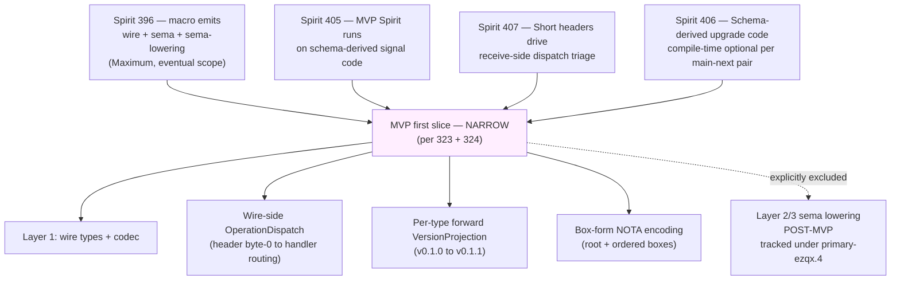

# 6 — Orchestrator overview synthesis

*Second-designer synthesis of the MVP advance-and-fix dispatch.
Wave 1 (A research scope, B research gaps, C research clarifications,
D operator fixes) ran in parallel; Wave 2 (E auditor) reconciled
their outputs against each other and against the parallel external
audits (nota-designer/6, second-operator/176). This overview lifts
the load-bearing findings into a single page the psyche can read.*

Date: 2026-05-24
Lane: second-designer
Session: `reports/second-designer/167-mvp-advance-and-fix/`

## 1 · TL;DR

The MVP scope is **narrow** — Layer 1 (wire/signal types + codec) +
wire-side OperationDispatch + per-type forward `VersionProjection` +
box-form NOTA encoding. **Layer 2/3 (sema operations + sema
lowering per spirit 396) is explicitly POST-MVP** per /323 + /324;
the auditor's reading reconciles this as scope-sequencing, not
contradiction with intent 396's Maximum certainty.

**Top MVP-blocking psyche clarification** (auditor's headline
finding, deduplicated): the **OperationDispatch terminology
conflation** — /323 + /324 use "dispatch" for BOTH wire-side
header routing (the macro emits) AND engine-side routing (sema
lowering, POST-MVP). Operator cannot land `primary-ezqx.1` cleanly
without the distinction made explicit in the designer reports.

**Second-highest MVP-blocking clarification** (auditor's biggest
missed-angle catch): the **Date + Time primitive encoding** needed
for Spirit's `RecordProvenance` schema. Without a pinned bracket-
string literal form (e.g. `[2026-05-24]`) AND a rkyv encoding
choice (packed `u32` vs three fields), the operator cannot author
Spirit's `schema.nota` file at all — and neither A's scope work
nor B's macro-gap work caught this.

**Operator fixes (subagent D) landed cleanly**: three fixes + one
no-op, four commits across two repos, both pushed to origin/main.
`primary-ezqx.2` confirmed CLOSED. /164 bracket-string sweep + /163
short-header terminology + sema-engine ARCH `signal-core` →
`signal-frame` typo all done; auditor spot-checked the edits and
confirmed no Rust code breakage.

## 2 · Session deliverables at a glance

| File | Subagent | Lines | Key deliverable |
|---|---|---|---|
| `0-frame-and-method.md` | Orchestrator | 75 | Session plan, intent base, wave coordination |
| `1-mvp-scope-clarification.md` | A | 752 | MVP scope matrix + 10 open psyche Qs + 4 C-class designer fixes |
| `2-macro-implementation-gap.md` | B | ~500 | Gap matrix with file:line refs; 2 MVP-blockers (~250-400 LOC) |
| `3-design-clarifications-needed.md` | C | 544 | Top-5 MVP-blocking clarifications with recommended leans |
| `4-operator-fixes-executed.md` | D (operator) | ~250 | 3 fixes + commits + push log |
| `5-audit-of-findings.md` | E (auditor) | 593 | 4 MVP-impact issues + parallel-audit reconciliation |
| `6-overview.md` (this file) | Orchestrator | this | Synthesis for psyche reading |

Total: 7 files, ~3,200 lines of analysis + ~250 lines of operator
execution log. Net new beads/decisions: 4 psyche questions surfaced
for ratification; 4 designer corrections (C1-C4) sized for follow-up;
2 macro-emit features (~250-400 LOC) sized for operator pickup.

## 3 · Consensus across the dispatch

Things all four subagents converged on (with E's audit confirming):

**The narrow MVP read** (auditor's consolidated answer to A's Q1):

| Slice | Status | Tracking |
|---|---|---|
| Schema reader (NOTA-data input) | IN MVP — already present in `schema_reader.rs` | landed |
| Short header emission per channel | IN MVP — emit.rs:342-526 | landed |
| Schema-derived signal types (Operation/Reply/Event from schema) | IN MVP | `primary-ezqx.1` |
| Wire-side OperationDispatch (header → handler) | IN MVP per /323 §3.1 | `primary-ezqx.1` |
| Per-type forward VersionProjection (v0.1.0 → v0.1.1) | IN MVP per /323 §3.2 | `primary-ezqx.1` |
| Box-form NOTA encoding | IN MVP per /324 §6, requires new nota-box library | `primary-l6pc` |
| `(engine X)` annotation acceptance (validator) | AMBIGUOUS — Q1 from subagent A | gating |
| Layer 2/3: Command/Effect/ToSemaOperation/ToSemaOutcome | POST-MVP | proposed `primary-ezqx.4` |
| Engine-side default lowering | POST-MVP | proposed `primary-ezqx.4` |
| Recursive Help-on-every-enum | POST-MVP | `primary-ezqx.3` |
| Reverse projection (v0.1.1 → v0.1.0) | POST-MVP | not yet beaded |

## 4 · Where the subagents diverged + E's reconciliation

**Three divergences worth surfacing:**

### 4.1 · A vs C — engine annotation framing

A's §5 Q1 lean: validator silently accepts `(engine X)` tokens so
/320 §2.1's closed decision stays dormant until the follow-up bead.

C's §3.1: the wire-side OperationDispatch (header → handler) vs
engine-side routing (`engine.assert` inside handler) are
conflated in /323 + /324 by both being called "dispatch"; operator
could build the wrong dispatcher shape.

**E's reconciliation**: both findings are correct and point at the
SAME underlying problem. A frames it as "what does the validator
do with engine annotations?"; C frames it as "what does 'dispatch'
mean in the MVP scope reports?" The auditor recommends the
orchestrator foreground the SHARPER (C's) framing — the
terminology gap in the designer reports causes the validator
question (A's framing) to fall out unanswered.

**Consolidated psyche question**: "In /323 + /324, what does
'dispatch' mean? Wire-side OperationDispatch (macro-emitted
header → handler routing) is one thing; engine-side routing
(handler → sema-engine method, the Layer 3 work) is another. The
MVP needs the first; intent 396 directs the second eventually.
Should /324 (or a follow-up) explicitly distinguish?"

### 4.2 · B's `field_name_for_type` finding sharpens A's C1

A's §6 C1: /322 §4.2 has a wrong code example (cosmetic
designer-correctable issue).

B caught the hardcoded `field_name_for_type` shim at
`/git/github.com/LiGoldragon/signal-frame/macros/src/emit.rs:551-553`
— a Spirit-specific name-mapping helper that wouldn't survive
contract diversification.

**E's reconciliation**: the two findings stack — /322 §4.2's
example may actually be REACHED by the current emit code (via the
hardcoded shim), which means A's C1 fix promotes from cosmetic to
functional. Operator's `primary-ezqx.1` pickup should remove the
shim WHILE landing the schema-derived emission.

### 4.3 · C's §3.2 Date/Time finding — neither A nor B caught it

C surfaced: Spirit's `RecordProvenance` schema can't compile
without a pinned bracket-string literal form for `Date` + `Time`
(e.g. `[2026-05-24]` and `[14:32:11]`) AND a rkyv encoding choice
(packed `u32` per field vs three separate fields per record).

A's MVP scope matrix didn't cover primitive-type encoding. B's
macro-gap analysis didn't surface this because it focused on
emit-code presence/absence, not on primitive type completeness.

**E's reconciliation**: this is **the auditor's biggest catch**.
It's MVP-blocking in a way A/B didn't see — operator cannot
author Spirit's `schema.nota` without these pinned. Surfaced
as Q2 in the consolidated question list below.

## 5 · Top psyche questions — deduplicated + ranked by MVP-blocking

After E's reconciliation:

**Q1 (HIGHEST IMPACT) — Dispatch terminology disambiguation.**
/323 + /324 use "dispatch" for both wire-side and engine-side
routing. Should the designer reports distinguish? Recommended
lean: yes — introduce `WireDispatch` (header → handler, MVP) vs
`EngineRouting` (handler → engine method, POST-MVP) as separate
terms. Without this, operator builds the wrong dispatcher shape
in `primary-ezqx.1`.

**Q2 (BLOCKER) — Date + Time primitive encoding for Spirit
RecordProvenance.** Bracket-string literal form `[YYYY-MM-DD]` +
`[HH:MM:SS]`? rkyv encoding: packed `u32` or three fields?
Operator can't start Spirit `schema.nota` without these pinned.

**Q3 (BLOCKER) — `next_schema` NOTA syntax.** Operator can't
write the bead's schema input without knowing the exact path-ref
syntax. C's §3.4 proposes a bracket-path-ref shape; needs psyche
ratification or override.

**Q4 (BLOCKER) — Engine-annotation token acceptance during MVP.**
Spirit `schema.nota` won't carry `(engine X)` annotations (Layer 2/3
is POST-MVP), but should the validator silently accept them (per
A's lean) for forward compatibility, or reject them (per strict
validator hygiene)? Recommended lean: silently accept; operator
adds a `// DESIGN-DECISION-REVIEW` comment per the /320 §2 pattern.

**Q5 (SHOULD-RESOLVE) — Identity-vs-hand-written-From boundary.**
For per-type `VersionProjection` impls (v0.1.0 → v0.1.1), when
does the macro emit Identity vs require operator to write a
custom From? C's §3.5 proposes a rule but it needs psyche pin.

**Q6 (SHOULD-RESOLVE) — OperationDispatch async-by-default.**
The macro-emitted dispatch trait — sync `fn handle(&mut self, op: Operation) -> Reply`
or async `async fn handle(&mut self, op: Operation) -> Reply`?
Affects every contract's downstream code; should be pinned
before `primary-ezqx.1` lands.

**Q7-Q10** — A's §5 surfaces additional second-tier questions
(box layout coordinate notation final form, MVP migration cadence,
schema-component daemon shape, library co-location). All
should-resolve-eventually but not MVP-blocking.

## 6 · The Spirit 396 reading — consolidated answer

Spirit 396 (Maximum, 2026-05-24): *"The signal_channel macro
generates from the NOTA schema all three outputs — the
wire/signal surface, the sema operations (classification), and
the sema lowering operations (how each operation is expressed
inside the engine, what kind of decision the engine makes)."*

**My /165 §3.1 claimed no prime-designer report engages with this
directive.** Wave 1 + Wave 2 found:

- /323 + /324 deliberately narrow MVP to exclude Layer 2/3 emission.
- Layer 2/3 emission is named POST-MVP via proposed `primary-ezqx.4`.
- /322 §6.3 + /324 §5 are explicit that engine annotations,
  recursive Help, and sema lowering are POST-MVP.

**E's auditor reading: this is NOT a contradiction with intent 396.**
Spirit 396 (Maximum certainty) applies to the macro's **eventual**
three-layer emission scope. Spirit 405 (Maximum) narrows the MVP
to schema-derived signal code (Layer 1). Spirit 407 (Maximum)
adds wire-side dispatch to MVP. Spirit 406 (Maximum) makes
schema-derived upgrade code optional per main-next pair.

The four Maximum-certainty intents (396, 405, 406, 407) compose
into a **sequencing** of the macro's emission scope — not a
single-slice deliverable. Layer 1 + wire-dispatch + per-pair
projection ships first; Layer 2/3 + recursive Help + reverse
projection follow under separate beads.

**My /165 §3.1 framing was incomplete.** The directed concern IS
in the macro convergence epic — but as a SEQUENCED slice via
`primary-ezqx.4`, not absorbed into `primary-ezqx.1`. The
counter-ego's job here was to surface the question; the answer
came back from the cluster.

## 7 · Operator (subagent D) execution summary

**Fixes executed (per D's report + E's spot-check):**

| Fix | File | Status | Commit |
|---|---|---|---|
| Bracket-string sweep | `reports/second-designer/164-...md` | 12 edits | `b95c5eea` |
| Short-header terminology | `reports/second-designer/163-...md` | 2 multi-line edits, 5 phrase replacements | `b95c5eea` |
| sema-engine ARCH dep-name | `/git/github.com/LiGoldragon/sema-engine/ARCHITECTURE.md` | 2 edits in boundary diagram | `6a552182` |
| Low-priority sweep on /160, /165, /166 | N/A | No-op (verified clean) | N/A |

**Push status (verified by E):**
- `/home/li/primary` main → origin: `4052aa10c0cd` (incorporates `b95c5eea`)
- `/git/github.com/LiGoldragon/sema-engine` main → origin: `6a552182ef33`

**jj discipline**: all commands used inline `-m '...'` flags; no
editor opened (per AGENTS.md hard override).

**Spot-check verification**: auditor confirmed 3 of D's bracket-
string edits on /164 are correctly applied with no Rust code
breakage (Rust string literals correctly preserved as `"..."`;
NOTA examples correctly converted to `[...]`).

## 8 · Recommended next moves

### 8.1 · For psyche

Ratify (or override) Q1-Q4 above. Once those four are pinned,
operator pickup of `primary-ezqx.1` is unblocked.

### 8.2 · For prime designer

- Address the C1-C4 designer-correctable issues from A's §6
  (4 small 1-PR edits on /322, /324, bead acceptance text).
- Consolidate "dispatch" terminology in /324 (or follow-up) per
  Q1.

### 8.3 · Beads to file from this session

| Bead title | Tracks | Priority | Source |
|---|---|---|---|
| MVP psyche-ratification gates Q1-Q4 (one bead per question or combined) | Q1-Q4 | P0 | this synthesis |
| `primary-ezqx.4` — Layer 2/3 schema-derived emission (Command/Effect/ToSemaOperation/ToSemaOutcome + default lowering) | POST-MVP | P2 | A §6, C §3.1 |
| sema-engine ARCH §"Current Surface" — update example code to reflect rename | doc cleanup | P3 | spot-check found by E |
| Remove `field_name_for_type` hardcoded shim at `emit.rs:551-553` during `primary-ezqx.1` pickup | code cleanup | P1 (bundled) | B + A C1 |
| `next_schema` NOTA grammar pin (Q3) | macro grammar | P1 | C §3.4 |

### 8.4 · For my own counter-ego role going forward

- /165 §3.1 framing needs an addendum noting the consolidated
  answer above (Layer 2/3 is sequenced via primary-ezqx.4, not
  unaddressed).
- /166's recommendation for /164 v4 stands — but should fold in
  the Date/Time primitive pin (Q2) when it lands.
- Next counter-ego sweep cadence per /166 §11.2 — propose
  weekly, triggered by intent batches of 10+ records.

## 9 · See also

### This meta-directory

- `0-frame-and-method.md` — orchestrator frame for this session
- `1-mvp-scope-clarification.md` — Subagent A
- `2-macro-implementation-gap.md` — Subagent B
- `3-design-clarifications-needed.md` — Subagent C
- `4-operator-fixes-executed.md` — Subagent D
- `5-audit-of-findings.md` — Subagent E

### Parallel external audits (incorporated by E)

- `reports/nota-designer/6-quoted-string-purge-audit-2026-05-24.md`
  — bracket-string workspace sweep (D's Fix 1 + 4 align)
- `reports/second-operator/176-designer-awareness-beads-and-report-audit-2026-05-24.md`
  — operator-side audit (surfaced /323/324 sema-lowering ambiguity
  that A + C deepened)

### Latest designer authority

- `reports/designer/320-mvp-schema-language-pilot-unblock.md`
  (status: scope sections §3-§4 superseded by /323 + /324; §2
  closed decisions remain authoritative)
- `reports/designer/321-mvp-visual-state-of-play.md`
- `reports/designer/322-spirit-mvp-positional-schema-worked-example.md`
- `reports/designer/323-mvp-scope-expansion-per-operator-directive.md`
  — latest scope authority
- `reports/designer/324-*` — current canonical re-specification
  (landed during Wave 1; cited by A, B, C, E)

### Second-designer thread (mine)

- `/163` — signal-sema interaction + spirit architecture
  (modified by D: terminology pass)
- `/164` — NOTA schema language v3 (modified by D: bracket-string sweep)
- `/165` — counter-ego audit (§3.1 framing supersedes per §8.4 above)
- `/166` — self-audit (this session executes its §9 fix list items
  9.A + 9.D + 9.I)

### Spirit records (the dispatch's authority chain)

- 388 — short header canonical name
- 389 — short header packing optimization
- 391 — move schema out of Rust macros into NOTA-format language
- 393-396 — schema structure (vector of root-verb enums, two-layer,
  inline + path-refs, macro emits wire + sema + sema-lowering)
- 397-400 — schema-component triad
- 401-402 — bracket strings + block-string form
- 403 — counter-ego role
- 404 — root + boxes layout
- 405-408 — MVP runs on schema-derived code, schema-derived upgrade
  compile-time optional, short header dispatch, schema notation as
  own library
- 412-414 (this session's intent base) — subagent authorization,
  cross-lane operator authority, MVP active phase
