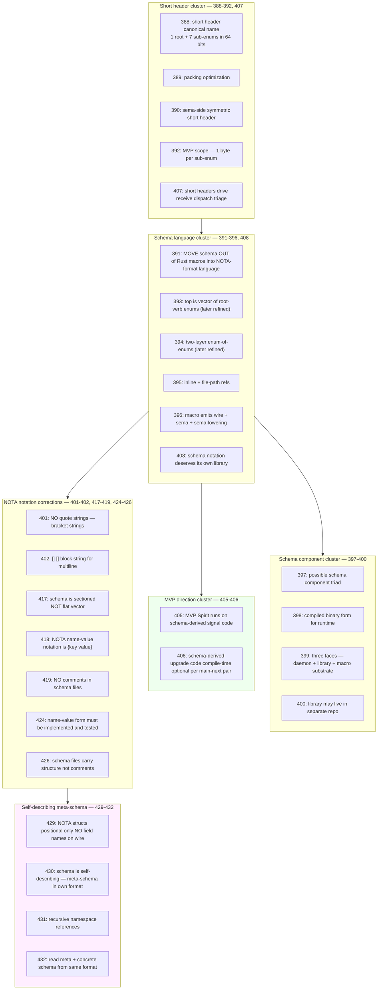
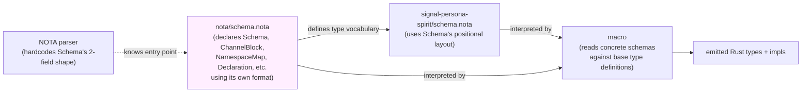
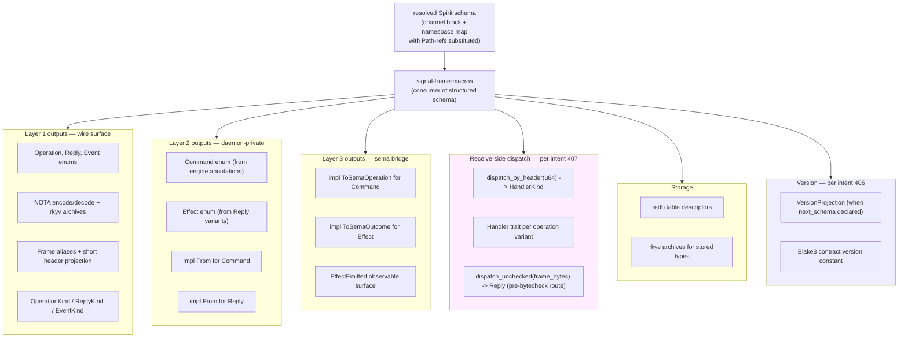
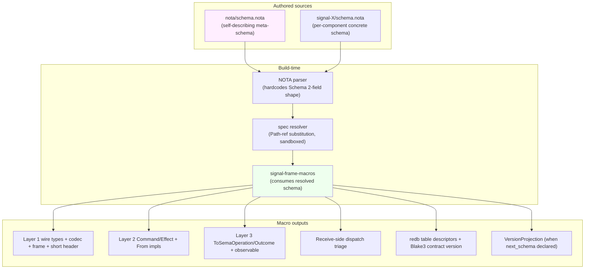

# How the schema system should look — research from intent

*Per psyche directive 2026-05-24: "I want you to refresh intent
and research from intent how this system should look in a report."
Second-designer synthesis grounded in Spirit intent records
388-432, NOT in opinion or extrapolation. The point of the
exercise: produce the system's shape AS IT EMERGES FROM
INTENT — so we can check designer reports (especially /326-v3)
against the intent corpus and surface gaps.*

Date: 2026-05-24
Lane: second-designer
Intent corpus: Spirit records 388-432 (the macro/schema/short-header
cluster from 2026-05-23 onward)

## 1 · TL;DR — the system in five paragraphs

**A NOTA file is a positional struct.** The file IS the struct;
there is no outer `(Schema …)` wrapper. The reader knows from
context (this is a schema file) what the positions mean. Field
names are NOT on the wire — position carries field identity (intent
429, 393, 394).

**The schema system is self-describing.** The schema language
defines ITSELF: a base "schema-for-a-schema" file lives in the
schema-library repo and declares what a "schema" IS using its own
format. Every concrete schema file's positional shape conforms to
the base schema (intent 430, 432).

**Schemas are sectioned positionally — two minimum sections.** The
psyche named two: a messaging/channel section (Operation, Reply,
Event) and a namespace section (recursive type definitions). The
namespace is a `{name value}` map per NOTA's curly-bracket
name-value notation (intent 417, 418, 424, 425).

**The namespace is a recursive type vocabulary.** Names declared in
the namespace can reference other names in the same namespace
(forward refs allowed); cross-schema imports via `(Path ./file.nota)`
resolve to typed declarations from another schema file (intent
421, 422, 428, 431).

**The macro consumes resolved schema and emits the three-layer
stack.** Wire types (Layer 1) from the namespace; sema operations
+ lowering (Layer 2 + 3) from messaging-section engine annotations;
short header projection per channel; storage descriptors;
VersionProjection impls between schema versions; receive-side
dispatch triage. MVP runs on schema-derived code (intent 405, 396,
407, 406, 404).

## 2 · The intent corpus — what defines this system

**Chronological intent landing pattern, 2026-05-23 to 2026-05-24:**



**Six clusters, one direction.** The intent corpus is internally
consistent — short-header structure feeds the macro's emission
scope; the schema-language reshaping flows into the schema
component triad; MVP direction names the urgency; notation
corrections refine the source format; self-describing principle
ties it all together with a bootstrap mechanism.

## 3 · The self-describing principle (the load-bearing piece)

Intent 430 (Decision, Maximum) is the highest-leverage record in
the corpus: *"Schema language is self-describing — the meta-schema
(what a schema IS) is itself defined using the schema language own
format."*

This principle has three operational consequences:

**Consequence 1 — No outer tag wrappers.** A file's identity (it's
a schema) supplies the meta-schema's `Schema` type. The file's
contents are the body of a Schema struct, NOT a tagged
`(Schema …)` record. Per intent 429, NOTA structs are positional;
the outer wrapper would be redundant duplicated identity.

**Consequence 2 — Recursive bootstrap.** The schema-library repo
contains a base schema file (e.g., `nota/schema.nota`) that
declares `Schema`, `ChannelBlock`, `NamespaceMap`, `Declaration`,
`Path`, etc. — the types every concrete schema file's positions
will have. This base file is ITSELF a schema file using its own
format. The parser hardcodes the minimal entry point ("Schema is
a 2-field positional record") and the namespace recursion fills
in everything else.

**Consequence 3 — Both ends converge.** Per intent 432, reading a
NOTA schema file means "grabbing the logic from both ends" —
meta-schema and concrete schema both flow through the same format,
meeting at the recursive namespace. The macro doesn't need to
distinguish "meta" from "concrete"; both are schemas under the
same grammar.



## 4 · How a NOTA schema file is shaped

### 4.1 · A file IS a struct (positional, no outer tag)

Per intent 429: *"NOTA structs are positional only — no field
names in the wire form. The position of an object in a struct
determines what it is, via the schema applied at read time."*

A concrete schema file contains the BODY of a Schema struct, not
a `(Schema …)` wrapper. The outer parens encompass the file's
positional fields:

```
(
  <field 0 — channel block (positional)>
  <field 1 — namespace map (curly-brace)>
)
```

The hardcoded parser knowledge: outer `(…)` is a Schema struct
with 2 positional fields. Beyond this, all type information flows
from the base schema's namespace.

### 4.2 · Field 0 — the channel block

The channel block declares the messaging surface: Operation,
Reply, Event, Observable. Also a positional record (no tag):

```
(
  (Operation ...)        ;; position 0 within channel block
  (Reply ...)            ;; position 1
  (Event ...)            ;; position 2
  (Observable ...)       ;; position 3
)
```

The inner heads (`Operation`, `Reply`, `Event`, `Observable`) are
the ENUM'S OWN NAMES (used by the macro when emitting Rust enum
names), not field labels in the meta-schema sense. They're part
of the enum-declaration vocabulary, not the struct-field-name
vocabulary.

For library schemas with no messaging surface (e.g., `signal-sema`),
the channel block is empty: `()`.

### 4.3 · Field 1 — the namespace map

Per intent 418 + 424 + 425, the name-value notation is `{key
value key value …}` — alternating, no separators, no colons.
Verified against `nota-codec` tests (`map_key_round_trip.rs` —
all pass).

The namespace map's keys are PascalCase type names. Values are
either inline declaration records OR `(Path …)` variants for
cross-schema imports:

```
{
  Topic    (Topic String)
  Entry    (Entry Topic Kind Summary Context Magnitude Quote)
  Magnitude (Path ../signal-sema/magnitude.schema.nota)
  ...
}
```

The namespace is **recursive** (intent 431): `Entry` references
`Topic` declared earlier in the same namespace; forward refs are
allowed (intent 421). The namespace is the type-definition
vocabulary every other position in the schema references.

### 4.4 · No comments

Per intent 419 + 426: schema files carry NO `;;` comments.
Section semantics come from POSITION + the meta-schema's struct
definition. Descriptions (if any) belong in the code that consumes
the schema, not in the schema source itself.

## 5 · The schema-library repo

Per intent 430 + 408: there's a schema-library repo (or section
of the nota repo) containing the BASE schema file.

### 5.1 · What the base schema file contains

The base schema's job: declare the type vocabulary every concrete
schema's positions will have. This means:

- **`Schema`** — the 2-field positional record (channel block +
  namespace map). The OUTER shape every concrete schema file
  matches.
- **`ChannelBlock`** — 4-field positional record (Operation,
  Reply, Event, Observable).
- **`OperationDecl`** + **`OperationVariant`** — variant shape for
  the Operation enum.
- **`ReplyDecl`** + **`ReplyVariant`** — variant shape for Reply.
- **`EventDecl`** + **`EventVariant`** — variant shape for Event,
  with stream-reference annotations.
- **`ObservableDecl`** — observability declaration.
- **`NamespaceMap`** — the recursive `{Identifier Declaration …}` map.
- **`Declaration`** — sum type: `Inline TaggedRecord` OR `Cross Path`.
- **`TaggedRecord`** — generic positional-record shape for inline
  type declarations.
- **`PayloadRef`** — reference to another type by name.
- **`EngineAnnotation`** — closed enum: Assert/Mutate/Retract/Match/Subscribe/Validate.
- **`Identifier`** — newtype String (with NOTA case discipline).
- **`Path`** — newtype String (file-path reference).

These types are declared in the base schema's namespace map using
the same format every concrete schema uses. The base schema's
channel block is empty `()` — it's a library, not a component.

### 5.2 · How the parser bootstraps from this

The parser hardcodes ONE piece of knowledge: `Schema` is a 2-field
positional record (outer paren contains channel-block at position
0, namespace-map at position 1). This is the fixed point.

From there:
- Parser reads `nota/schema.nota`'s positional shape against this
  fixed point (2 fields).
- The namespace map's contents are read positionally too — each
  entry is a `(name, value)` pair where the value is one of the
  Declaration variants.
- Once the base schema's namespace types are loaded into the
  parser's vocabulary, every other concrete schema can be parsed
  using those types.

Per /326-v3 §8.3, this is the recommended bootstrap shape (Lean A:
hardcode Schema's 2-field shape in the parser).

### 5.3 · Why the schema-library repo

Per intent 408 (Decision, Maximum): *"Ordered-vector-of-boxes NOTA
schema notation deserves its own library."* Per intent 422
(Principle, Maximum): cross-schema imports support a future shared
schema library mechanism.

Concretely: many components will reference the same foundational
types (`Magnitude`, `SemaOperation`, `Path`, `Identifier`). Rather
than each schema redeclaring these, the schema-library hosts them
once. Per intent 400, the library MAY live in the nota repo
(co-located with `nota-codec`) or in a dedicated `schema-library`
repo — the choice depends on release cadence.

For MVP per intent 422: Spirit can define all its types within its
own schema; the library extraction is deferred. But the design
must leave room for it from the start (cross-schema `(Path …)`
imports already work).

## 6 · Worked Spirit schema in the corrected shape

A complete Spirit schema in the intent-derived shape (positional,
no outer tag, sectioned, name-value namespace):

```
(
  (
    (Operation
      (State (Statement (engine assert)))
      (Record (Entry (engine assert)))
      (Observe (Observation (engine match)))
      (Watch (Subscription (engine subscribe)))
      (Unwatch (SubscriptionToken (engine retract))))
    (Reply
      (RecordAccepted RecordAccepted)
      (StateObserved StateObserved)
      (RecordsObserved RecordsObserved)
      (RecordProvenancesObserved RecordProvenancesObserved)
      (TopicsObserved TopicsObserved)
      (QuestionsObserved QuestionsObserved)
      (SubscriptionOpened SubscriptionOpened)
      (SubscriptionRetracted SubscriptionRetracted)
      (RequestUnimplemented RequestUnimplemented))
    (Event
      (StateChanged (StateChanged belongs DomainStream))
      (RecordCaptured (RecordCaptured belongs DomainStream)))
    (Observable
      (filter default)
      (operation_event OperationReceived)
      (effect_event EffectEmitted)))
  {
    Magnitude (Path ../signal-sema/magnitude.schema.nota)
    SemaOperation (Path ../signal-sema/operation.schema.nota)
    SemaOutcome (Path ../signal-sema/outcome.schema.nota)
    SemaObservation (Path ../signal-sema/observation.schema.nota)

    Kind (Kind Decision Principle Correction Clarification Constraint)
    ObservationMode (ObservationMode SummaryOnly WithProvenance)
    Presence (Presence Active Absent)
    UnimplementedReason (UnimplementedReason NotBuiltYet IntegrationNotLanded)

    Topic (Topic String)
    Entry (Entry Topic Kind Summary Context Magnitude Quote)
    Statement (Statement StatementText)
    RecordQuery (RecordQuery [Option Topic] [Option Kind] ObservationMode)
    ...

    Observation (Observation State (Records RecordQuery) Topics Questions)
    Subscription (Subscription State (Records RecordSubscription))
    SubscriptionToken (SubscriptionToken (State StateSubscriptionToken) (Records RecordSubscriptionToken))

    StoredRecord (StoredRecord RecordIdentifier StampedEntry)
    StampedEntry (StampedEntry Entry Date Time)
    ...

    OperationReceived (OperationReceived OperationKind)
    EffectEmitted (EffectEmitted SemaObservation)
  }
)
```

Reading positionally:
- Outer `(…)` — body of a Schema struct (2 fields).
- Field 0 — `(…)` channel block (4 positional sub-fields).
- Field 1 — `{…}` namespace map.

No `Schema` tag, no `Channel` tag, no `Namespace` tag. Position
plus the base schema's type definitions tell the parser what
each shape is.

## 7 · What the macro emits from this

Per intent 396 + 405 + 406 + 407 + 404, the macro consumes the
resolved schema and produces:



**Per intent 405 (MVP runs on schema-derived signal code)**: Layer
1 + dispatch + storage + Layer 3 observable surface are MVP scope.
**Per intent 406 (compile-time optional per main-next pair)**: the
version-projection emission only happens when the schema declares
`next_schema` — for v0.1.0 with no successor yet, the macro emits
nothing in that band.

## 8 · What the system enables — operational picture

Five operational consequences fall out of the intent-grounded system:

### 8.1 · Receive-side dispatch triage (intent 407)

The 8-byte short header rides in front of every frame (per intent
328). The receiver reads 4-byte length prefix + 8-byte short header
= 12 bytes and already knows: which channel via subscription
provenance, which root verb at byte 0, which handler to dispatch
to via the byte-0 → handler routing table emitted by the macro,
and whether to bytecheck the body or fast-reject as unsupported.
Dispatch happens BEFORE rkyv validation. (Detailed mechanism in
my prior chat exchange on this topic.)

### 8.2 · Schema-derived upgrade between version pairs (intent 406)

When v0.1.0's schema declares `next_schema` pointing at v0.1.1's
crate, the macro reads BOTH schemas at compile time, diffs the
namespace declarations, and emits `VersionProjection` impls for
each changed payload type. v0.1.0 → v0.1.1 migration becomes a
sequence of typed projections rather than hand-written conversion
code.

### 8.3 · The schema IS the source of truth (intent 391 + 405)

The Rust code is GENERATED from the schema; the Rust code is not
the source. Schema changes drive code changes. Per intent 391:
"The macro becomes a consumer of structured schema data, not a
parser of Rust syntax."

### 8.4 · Cross-component classification via SemaObservation (from intent corpus + /163's audit)

Every component's macro-emitted `Effect` projects into
`SemaObservation` (universal payloadless classification). The
observable surface broadcasts these projections workspace-wide.
Persona-introspect (or any observer) sees classification streams
across all components without knowing per-component vocabulary.

### 8.5 · Self-describing schema enables tooling without ad-hoc parsers (intent 430)

Because the base schema declares its own structure, any tool that
can read NOTA can read schemas. Schema-inspectors, schema-diffs,
schema-renderers, schema-doc-generators all consume the same
positional shape. No ad-hoc grammar; the meta-schema IS the
grammar.

## 9 · What intent leaves unsettled

Three corners the intent corpus doesn't pin yet — flagged for
psyche clarification:

### 9.1 · Where the schema-library lives

Intent 400 (Medium): "schema-types library MAY live in a separate
repo." Two shapes:
- (a) Co-located in `nota` repo (alongside `nota-codec`).
- (b) Dedicated `schema-library` repo.

Lean per /326-v3 §3.4: (a). The nota repo already hosts the codec
+ box-form work; adding the base schema is consistent. Confirm.

### 9.2 · Section count beyond two

The intent corpus names two sections (messaging/channel +
namespace). Are there standard additional sections (e.g., a
`storage` section, an `imports` section)? Or is the
"channel-block + namespace-map" shape the canonical 2-field shape
forever?

Lean: 2-field shape forever; storage types and imports live IN
the namespace map (storage as typed declarations, imports as
`(Path …)` entries). Adding sections would mean changing the
hardcoded parser entry point — a major structural change.

### 9.3 · Empty-channel-block representation for library schemas

Per /326-v3 §8.2: library-like schemas (no messaging surface) use
`()` empty channel block.

Alternative: skip field 0 entirely and let the parser detect
"this is a library schema" from a different marker. But that
violates the 2-field positional shape.

Lean: `()` empty channel block. Verify that NOTA's encoder
emits/parses an empty positional record cleanly (likely yes
since `(NoneVariant)` round-trips).

## 10 · Cross-check against /326-v3 — prime designer's current

Prime designer's `/326-v3-spirit-complete-schema-vision.md` (just
landed) absorbs the intent corpus well. Cross-check:

| Intent | /326-v3 coverage | Notes |
|---|---|---|
| 429 NOTA positional, no outer tag | ✓ §2.1 outer `(…)` body, no `Schema` tag | Aligned. |
| 430 self-describing, schema-for-a-schema | ✓ §3 dedicated section + sketch | Aligned. |
| 431 recursive namespace refs | ✓ §3.2 sketch shows namespace declaring its own types | Aligned. |
| 432 grab logic from both ends | ✓ §3.3 mermaid shows both ends meeting at parser | Aligned. |
| 418 + 424 + 425 curly-brace map | ✓ §2.1 uses `{…}` map for namespace | Aligned. Bracket-string nota-design verified in nota-codec. |
| 419 + 426 no comments | ✓ §2.3 explicitly no `;;` comments | Aligned. |
| 417 sectioned, not flat | ✓ §2.1 has channel + namespace | Aligned. |
| 421 forward refs | ✓ §2.2 namespace map allows any-order references | Aligned. |
| 422 cross-schema imports | ✓ §4.2 `(Path …)` mechanism | Aligned. |
| 405 MVP runs on schema-derived | ✓ §6 lists emitted types | Aligned with MVP scope. |
| 396 macro emits wire + sema + sema-lowering | ✓ §6 covers all three layers | Aligned per `/167/6 §6` reading: 396 is eventual scope; MVP narrow per /323/324. |
| 407 short headers drive dispatch | ✓ §6 lists `OperationDispatch` per `/323 §3.1` | Aligned. |
| 406 schema-derived upgrade compile-time optional | ✓ §6 lists `VersionProjection` when next_schema declared | Aligned. |
| 408 schema notation as own library | ✓ §3.4 lives in nota repo | Aligned (Lean A). |
| 404 boxes layout | (not explicitly in /326-v3) | **GAP** — `box_form.rs` exists in nota-codec but /326-v3 doesn't show box-form usage in the schema; intent says complex schemas mirror root+boxes binary form, which the schema file would also do for its own unsized fields. |

**One small gap**: intent 404 (NOTA-positional-boxes Principle,
Maximum) isn't explicitly addressed by /326-v3. The Spirit schema
in §2.1 has unsized fields (Strings inside namespace map values,
Vecs in payload types) — these need box-form encoding per intent
404 when the schema file gets large. nota-codec already has
`BoxedNotaEncoder`/`BoxedNotaDecoder` per `box_form.rs`. /326-v3
should reference how the schema file itself uses box-form for its
unsized contents.

This is a minor follow-up, not a blocker. Counter-ego
recommendation: file a small bead for /326-v4 (or designer note)
to address intent 404 explicitly.

## 11 · Summary — the intent-derived system



**The shape that emerges from intent**: a NOTA file IS the body
of a Schema struct (positional, no outer tag); the base
schema-library file declares Schema's positional shape and the
sub-types it references (self-describing); concrete schemas
match this shape and use the recursive namespace for type
definitions + cross-schema imports; the macro consumes resolved
schemas and emits the three-layer stack + dispatch + storage +
version-projection.

This shape is internally consistent across intent records
388-432 + already largely present in /326-v3. The only gap
worth surfacing is intent 404's box-form for the schema file's
own unsized fields — a small follow-up, not a blocker.

## 12 · Recommended next moves

For psyche:
- Ratify §9 corners (schema-library location, 2-section-shape-forever, empty-channel `()` shape).
- Confirm /326-v3 cross-check above — is the intent absorption complete or are there gaps I missed?

For prime designer:
- File 1-PR follow-up addressing intent 404 in /326-v3 (or /326-v4) — how does the schema file itself use box-form for unsized contents?

For operator (`primary-ezqx.1` pickup):
- Implement parser bootstrap per §5.2 (hardcoded Schema 2-field shape).
- Implement spec resolver with sandboxed path-ref resolution (per /320 §2.7 + /326-v3 §4.2).
- Implement the macro emission per §7 (all three layers + dispatch + storage + optional version-projection).
- Write the nota/schema.nota base schema per §5.1 + /326-v3 §3.2 sketch.

For me (second-designer):
- /164 v4 absorbs intents 417 + 418 + 429-432 (the positional-struct + curly-brace + self-describing corrections).
- /166's §9 fix list still has 9.B (boxes layout) outstanding — gets sharpened by intent 404 absorption above.

## 13 · See also

### Intent records (the corpus this report researches)

- 388-392 — short header cluster
- 391, 393-396 — schema language framing
- 397-400 — schema component triad
- 401-402 — bracket strings + block string
- 404 — boxes layout
- 405-408 — MVP direction + schema-as-library
- 417-419 + 424-426 — schema sectioning + curly-brace + no-comments
- 421-423 + 428 — namespace + cross-schema imports
- 429-432 — positional + self-describing (this report's anchor)

### Designer reports (cross-checked)

- `/322` — Spirit MVP positional-schema worked example
- `/323` — MVP scope expansion (dispatch + projection + box-form)
- `/324` — migration MVP Spirit handover re-specification
- `/325` — nota-box library design
- `/326-v3` — Spirit complete schema vision (cross-checked in §10)

### Second-designer reports (mine)

- `/163` — signal-sema interaction + Spirit architecture (modified
  for short-header terminology per intent 388)
- `/164` — NOTA schema language v3 (needs v4 absorbing 417-432
  corrections — see §12)
- `/165` — counter-ego audit of prime designer cluster
- `/166` — self-audit
- `/167/6` — MVP advance-and-fix meta-session overview

### Source files referenced

- `/git/github.com/LiGoldragon/nota-codec/src/lexer.rs:29-30, 135-139` — `{`/`}` tokens
- `/git/github.com/LiGoldragon/nota-codec/src/decoder.rs:436-461` — map decode primitives
- `/git/github.com/LiGoldragon/nota-codec/src/traits.rs:266-353` — BTreeMap/HashMap blanket impls
- `/git/github.com/LiGoldragon/nota-codec/tests/map_key_round_trip.rs` — name-value tests (verified passing via `nix flake check`)
- `/git/github.com/LiGoldragon/nota-codec/tests/box_form.rs` — boxes layout (intent 404)
- `/git/github.com/LiGoldragon/nota/example.nota` — canonical positional file example

### Skills

- `skills/nota-design.md` — positional records + bracket strings + map keys
- `skills/contract-repo.md` — contract crate discipline the schema systematises
- `skills/component-triad.md` — the triad shape the schema serves
