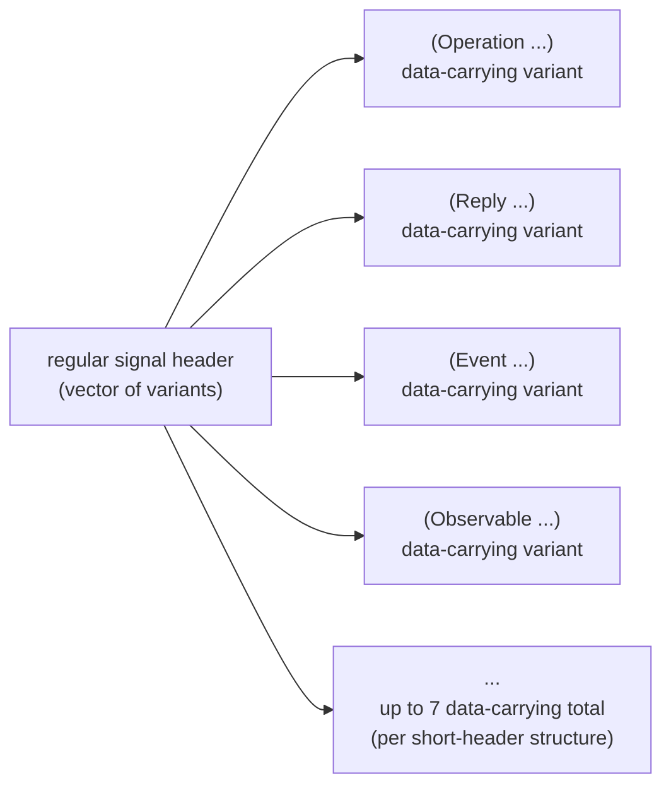
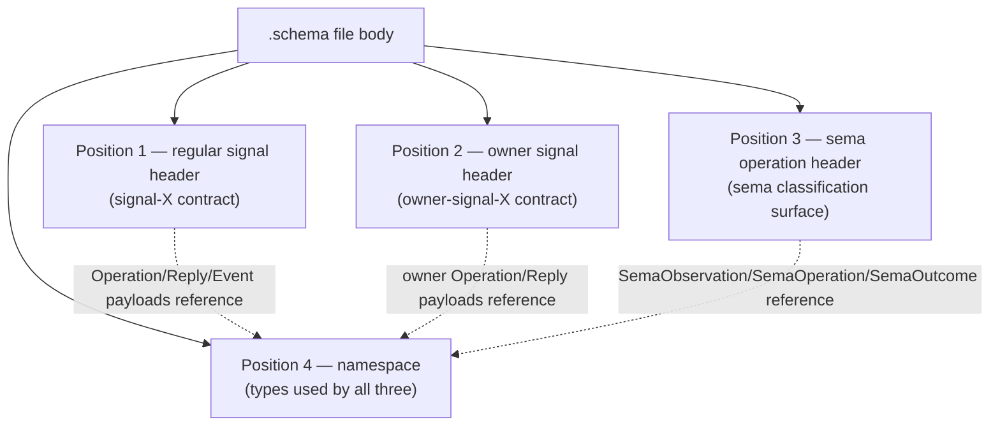
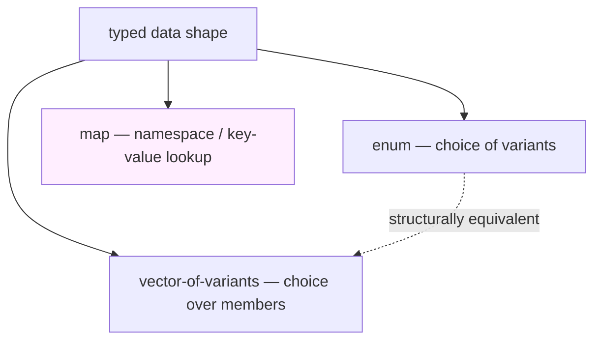
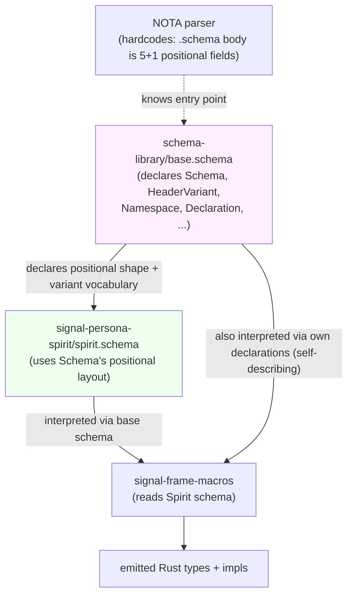
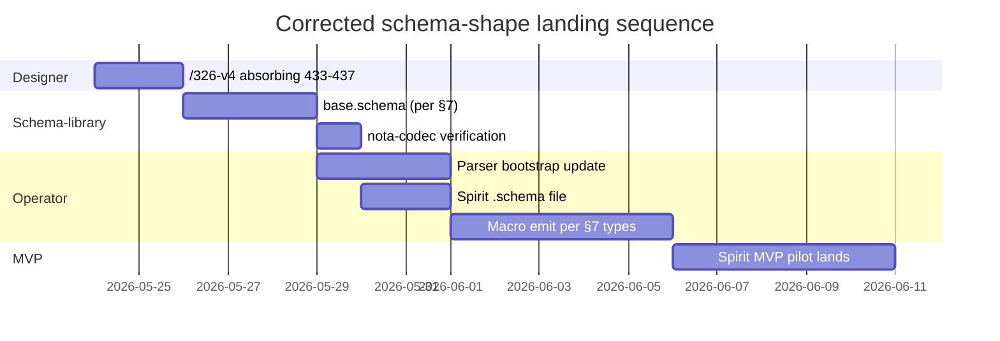

# Schema file shape — corrections post /326-v3

*Second-designer report — captures the psyche's third round of
corrections to the schema file shape (after /326-v1, /326-v2, and
/326-v3 each landed and were each corrected). Intent records
433-437 anchor this. Aim: ground the corrected shape so prime
designer can land /326-v4 without another round.*

Date: 2026-05-24
Lane: second-designer
Intent base: Spirit records 433-437 (the post-/326-v3 correction
batch), composed with the earlier corpus 388-432.

## 1 · TL;DR — three corrections to /326-v3

1. **`.schema` file extension supplies the type. NO outer
   parentheses.** /326-v3 §2.1 wraps everything in `(…)` — that's
   wrong. The file extension is the type witness; the schema
   struct's fields appear directly in the file body. Per intent
   433.

2. **Schema is multi-section: optional metadata/imports + THREE
   headers + namespace.** /326-v3 has 2 sections (channel block +
   namespace map). Per intent 434, the actual shape is: optional
   meta/imports first, then three short-header definitions
   (regular signal, owner signal, sema operation), then namespace
   map. Possibly with a final extension vector.

3. **Each header is a vector of variants `[Variant Variant …]`,
   not a tagged record.** /326-v3 represents the channel as
   `((Operation …) (Reply …) (Event …) (Observable …))` — a
   positional record. Per intent 435, the header section is more
   naturally `[variant variant …]` — a vector of header variants
   (up to 7 data-carrying per the 1-root + 7-sub-enums short-
   header structure from intent 388-389).

Plus two background principles ratifying the shape:

- **Selective imports** (intent 436): cross-schema imports name
  specific types from another namespace, not the whole namespace
  — keeps per-engine concerns separate.
- **Enum-or-vector preference** (intent 437): workspace data
  shape is always enum or vector-of-enum-variants UNLESS the
  object is specifically a map (namespace). Vector IS
  structurally an enum (choice over what's in it). NOTA's
  True/False as PascalCase confirms Bool is a two-unit-variant
  enum.

## 2 · What /326-v3 got wrong — the three deltas

### 2.1 · Outer `(…)` is redundant

/326-v3 §2.1:
```nota
(
  (
    (Operation ...) (Reply ...) (Event ...) (Observable ...))
  { Magnitude ... Topic ... Entry ... })
```

The outer `(…)` says "this is a 2-field positional struct." But
file context already says "this is a schema." Per intent 433: the
file extension `.schema` is the type marker; the schema struct's
fields appear directly in the file body without any wrapping
record. Two parens of nesting drop out.

### 2.2 · "Two-section" is undercount

/326-v3 has channel-block + namespace-map = 2 sections. Per
intent 434:

> "the schema definition from the schema repo… is going to define
> the header, the meta header, and then the header which
> represents the 64-bit object, and then the rest of the
> language, all the objects, how they fit inside that namespace.
> I mean there's different namespaces. There's the regular
> signal, the owner signal, and the SEMA operation also. So
> there's three headers at least to define first for each
> component."

So the actual sections per component:
- (optional) **Meta / imports** — first, possibly with selective
  cross-schema imports.
- **Regular signal header** — vector of variants for the
  ordinary `signal-<comp>` contract's short header.
- **Owner signal header** — vector of variants for the
  `owner-signal-<comp>` contract's short header.
- **Sema operation header** — vector of variants for the
  sema-message classification surface (per intent 390 — sema-side
  symmetric short header).
- **Namespace** — recursive type vocabulary used by all three
  headers' variants (Operation/Reply/Event payloads, Command/
  Effect, storage records, etc.).
- (optional) **Extension vector** — final position for
  optional sections (per intent 434 trailing "or it's a final
  vector of a bunch of different optional options, variant
  options").

### 2.3 · Channel block is a vector of variants, not a positional record

/326-v3 represents the channel as a positional record:
```nota
((Operation (...)) (Reply (...)) (Event (...)) (Observable (...)))
```

Per intent 435, the more natural representation is **a vector of
variants**:
```nota
[
  (Operation (State (Statement (engine assert))) ...)
  (Reply (RecordAccepted RecordAccepted) ...)
  (Event (StateChanged (StateChanged belongs DomainStream)) ...)
  (Observable (filter default) ...)
]
```

The reason: this IS an enum at heart — the header section is "an
enum definition" per the psyche. NOTA represents enums as vectors
of variants. A positional record forces a fixed-arity tuple shape
that doesn't compose with the up-to-7-data-carrying-variants
constraint from the short-header structure (intent 388-389:
1 root + 7 sub-enums = 8 enum slots total in the 64-bit header).

The per-variant data-carrying shape inside the vector — `(Operation
…)`, `(Reply …)`, `(Event …)`, `(Observable …)` — is the standard
NOTA data-carrying-variant pattern: parenthesized name + payload.

## 3 · The corrected `.schema` file shape

### 3.1 · Bare file body

A `signal-persona-spirit.schema` file (or wherever the convention
lands) looks like this — no outer wrapper:

```nota
;; meta / imports (optional, first position)
{
  Magnitude (Path ../signal-sema/magnitude.schema.nota)
  SemaOperation (Path ../signal-sema/operation.schema.nota)
  SemaOutcome (Path ../signal-sema/outcome.schema.nota)
  SemaObservation (Path ../signal-sema/observation.schema.nota)
}

;; regular signal header — vector of variants
[
  (Operation
    (State (Statement (engine assert)))
    (Record (Entry (engine assert)))
    (Observe (Observation (engine match)))
    (Watch (Subscription (engine subscribe)))
    (Unwatch (SubscriptionToken (engine retract))))
  (Reply
    (RecordAccepted RecordAccepted)
    (StateObserved StateObserved)
    (RecordsObserved RecordsObserved)
    (RecordProvenancesObserved RecordProvenancesObserved)
    (TopicsObserved TopicsObserved)
    (QuestionsObserved QuestionsObserved)
    (SubscriptionOpened SubscriptionOpened)
    (SubscriptionRetracted SubscriptionRetracted)
    (RequestUnimplemented RequestUnimplemented))
  (Event
    (StateChanged (StateChanged belongs DomainStream))
    (RecordCaptured (RecordCaptured belongs DomainStream)))
  (Observable
    (filter default)
    (operation_event OperationReceived)
    (effect_event EffectEmitted))
]

;; owner signal header — vector of variants (empty for Spirit MVP)
[]

;; sema operation header — vector of variants
;; (sema-message classification surface this component contributes)
[
  (SemaObservation (engine match))
]

;; namespace — recursive type vocabulary
{
  Kind (Kind Decision Principle Correction Clarification Constraint)
  ObservationMode (ObservationMode SummaryOnly WithProvenance)
  Presence (Presence Active Absent)
  UnimplementedReason (UnimplementedReason NotBuiltYet IntegrationNotLanded)

  Topic (Topic String)
  Summary (Summary String)
  Context (Context String)
  Quote (Quote String)
  StatementText (StatementText String)
  FocusArea (FocusArea String)
  RecordIdentifier (RecordIdentifier u64)
  QuestionIdentifier (QuestionIdentifier String)
  QuestionText (QuestionText String)
  StateSubscriptionToken (StateSubscriptionToken u64)
  RecordSubscriptionToken (RecordSubscriptionToken u64)

  Entry (Entry Topic Kind Summary Context Magnitude Quote)
  Statement (Statement StatementText)
  RecordQuery (RecordQuery [Option Topic] [Option Kind] ObservationMode)
  RecordSubscription (RecordSubscription [Option Topic] ObservationMode)
  RecordSummary (RecordSummary RecordIdentifier Topic Kind Summary Magnitude)
  RecordProvenance (RecordProvenance RecordSummary Context Date Time Quote)
  TopicCount (TopicCount Topic u64)
  State (State Presence [Option FocusArea])
  QuestionSummary (QuestionSummary QuestionIdentifier QuestionText)

  RecordObservation (RecordObservation RecordQuery)

  Observation (Observation State (Records RecordQuery) Topics Questions)
  Subscription (Subscription State (Records RecordSubscription))
  SubscriptionToken (SubscriptionToken (State StateSubscriptionToken) (Records RecordSubscriptionToken))

  StoredRecord (StoredRecord RecordIdentifier StampedEntry)
  StampedEntry (StampedEntry Entry Date Time)
  RecordIdentifierMint (RecordIdentifierMint u64)

  RecordAccepted (RecordAccepted RecordIdentifier)
  StateObserved (StateObserved State)
  RecordsObserved (RecordsObserved [Vec RecordSummary])
  RecordProvenancesObserved (RecordProvenancesObserved [Vec RecordProvenance])
  TopicsObserved (TopicsObserved [Vec TopicCount])
  QuestionsObserved (QuestionsObserved [Vec QuestionSummary])
  SubscriptionOpened (SubscriptionOpened SubscriptionToken SubscriptionSnapshot)
  SubscriptionRetracted (SubscriptionRetracted SubscriptionToken)
  RequestUnimplemented (RequestUnimplemented UnimplementedReason)
  SubscriptionSnapshot (SubscriptionSnapshot (State State) (Records [Vec RecordSummary]))

  StateChanged (StateChanged State)
  RecordCaptured (RecordCaptured RecordSummary)

  OperationReceived (OperationReceived OperationKind)
  EffectEmitted (EffectEmitted SemaObservation)
}
```

The `;;` comments above are just markup for THIS REPORT to label
positions for the reader; the actual `.schema` file carries no
comments per intent 419. The parser knows each position's
identity from the schema-for-a-schema (in the schema-library).

### 3.2 · Reading the file positionally

The schema-library's base `Schema` struct definition tells the
parser what each position is:

- Position 0: `{…}` map — meta/imports (selective cross-schema
  references).
- Position 1: `[…]` vector — regular signal header variants.
- Position 2: `[…]` vector — owner signal header variants.
- Position 3: `[…]` vector — sema operation header variants.
- Position 4: `{…}` map — namespace (recursive type vocabulary).
- Position 5 (optional): `[…]` vector — extension/optional sections.

No tags wrap the file. The parser hardcodes "the .schema file body
is N positional fields per the Schema struct definition"; the
Schema struct itself is declared in the schema-library schema file.

### 3.3 · Headers as vectors of variants



Each header section is a vector of header variants. Per intent
388-389, the short header is 1 root + 7 sub-enums = 8 enum slots
in the 64-bit prefix. The header VECTOR is the source of
truth — the macro derives the byte-layout from the order +
declarations here.

For Spirit's regular signal header today, only 4 of the 7
data-carrying slots are used (Operation, Reply, Event, Observable);
the other 3 are reserved for future expansion.

## 4 · Three headers per component — the trinity

Per intent 434, every triad component declares three header
sections:



**Shared namespace**: one map at position 4 holds the type
vocabulary used by ALL THREE headers. Per intent 436, selective
cross-schema imports keep concerns separated; each header's
variants reference the namespace's types as needed.

**Empty header `[]` for unused legs**: a component that doesn't
yet have an owner-signal contract uses `[]` at position 2. A
component that doesn't contribute to sema classification uses `[]`
at position 3. The macro recognises empty headers as "this leg
isn't emitted."

## 5 · Selective imports — concern separation

Per intent 436, cross-schema imports are SELECTIVE BY NAME, not
whole-namespace:

```nota
{
  ;; Position 0 — meta/imports map
  Magnitude (Path ../signal-sema/magnitude.schema.nota)
  ;; only Magnitude is brought in from signal-sema; not its
  ;; whole namespace
}
```

The map's keys are the LOCAL names brought into this schema's
namespace; the `(Path …)` values name the source file. The
schema reader resolves the path and pulls only the named type's
declaration into the local namespace. This:

- Keeps concerns separated per component (intent 436).
- Allows the same name to be reused across components without
  conflict (per-component scope).
- Avoids pulling unused vocabulary into a component's compile
  surface.

For MVP (per intent 422), Spirit defines all its types within
its own namespace; the selective imports only pull `Magnitude` +
the 3 sema-classification types from `signal-sema`. Other
components do the same against their needed dependencies.

## 6 · Enum-or-vector preference — and Bool as enum

Per intent 437, the workspace's data-extension shape is always
enum or vector-of-enum-variants UNLESS the object is specifically
a map (namespace).



The reasoning per intent 437: a vector "is itself a sort of
structurally an enum, because it gives you a choice of all the
things that can be in there." Maps are reserved for the cases
where you genuinely need named lookup (namespaces, configuration
keys, etc.).

NOTA's `True` / `False` as PascalCase is a worked example: Bool
is conceptually a two-unit-variant enum. The capitalization is
not stylistic — it's structural. The workspace's design
preference flows through this: when you need "yes or no," reach
for a 2-variant enum (Bool); when you need "one of N choices,"
reach for an N-variant enum; when you need "any of these things
in order," reach for a vector. Maps come out only for genuine
namespaces.

This Principle explains why the schema's structure is
`[header-variants] [header-variants] [header-variants]
{namespace-map}` — three enum-shaped headers plus one map for
the actual lookup namespace.

## 7 · The schema-for-a-schema, updated

Per the corrected shape, the schema-library's base
`schema-library.schema` file would itself be:

```nota
;; meta/imports — schema-library imports nothing
{}

;; regular signal header — schema-library has no wire surface
[]

;; owner signal header — same
[]

;; sema operation header — same
[]

;; namespace — declares the schema-language's own types
{
  Schema (Schema MetaImports SignalHeader OwnerHeader SemaHeader Namespace [Option ExtensionVector])

  MetaImports (MetaImports [Map Identifier Path])

  SignalHeader (SignalHeader [Vec HeaderVariant])
  OwnerHeader (OwnerHeader [Vec HeaderVariant])
  SemaHeader (SemaHeader [Vec HeaderVariant])

  HeaderVariant
    (Operation OperationDecl)
    (Reply ReplyDecl)
    (Event EventDecl)
    (Observable ObservableDecl)
    ;; Reserved positions for future variants
    (Reserved5)
    (Reserved6)
    (Reserved7)

  Namespace (Namespace [Map Identifier Declaration])

  Declaration
    (Inline TaggedRecord)
    (Cross Path)

  OperationDecl (OperationDecl Identifier [Vec OperationVariant])
  OperationVariant (OperationVariant Identifier PayloadRef EngineAnnotation)

  ReplyDecl (ReplyDecl Identifier [Vec ReplyVariant])
  ReplyVariant (ReplyVariant Identifier Identifier)

  EventDecl (EventDecl Identifier [Vec EventVariant])
  EventVariant (EventVariant Identifier Identifier StreamRef)

  ObservableDecl (ObservableDecl FilterMode OperationEventRef EffectEventRef)

  TaggedRecord (TaggedRecord Identifier [Vec FieldOrVariant])

  FieldOrVariant
    (Field Identifier)
    (Variant Identifier [Option PayloadRef])

  PayloadRef (PayloadRef Identifier)

  EngineAnnotation
    Assert
    Mutate
    Retract
    Match
    Subscribe
    Validate

  FilterMode
    (Default)
    (Custom Identifier)

  StreamRef (StreamRef Identifier)
  Path (Path String)
  Identifier (Identifier String)

  ExtensionVector (ExtensionVector [Vec ExtensionSection])
  ExtensionSection
    ;; placeholder for future optional schema sections
    (Reserved Identifier)
}
```

Key changes from /326-v3 §3.2's sketch:
- No outer wrapper.
- 5-field Schema struct (5 mandatory + 1 optional) instead of
  2-field — accommodates the meta-imports + three headers.
- Header variants explicitly enumerated as a closed enum
  (Operation/Reply/Event/Observable + reserved positions 5-7) to
  match the short-header 7-data-carrying constraint.
- The schema-library's own .schema file uses empty headers
  `[]` (no signal surface) and an empty meta-imports `{}` (no
  cross-schema dependencies — it's the root).

## 8 · Bootstrap chain — updated



The parser knows ONE thing: `.schema` files have 5 mandatory
positional fields (meta-imports, regular header, owner header,
sema header, namespace) plus an optional 6th (extension vector).
The schema-library's base.schema declares what each position's
TYPE is (Schema struct definition); from there every other type
flows recursively from the namespace.

## 9 · Implications for /326-v4 + operator pickup

### 9.1 · Prime designer needs /326-v4

The corrections in this report (intents 433-437) post-date
/326-v3 by ~1 hour. Prime designer should land /326-v4 absorbing:
- File extension `.schema` + no outer wrapper (intent 433).
- Multi-section structure with 3 headers (intent 434).
- Header-as-vector-of-variants (intent 435).
- Selective imports mechanism (intent 436).
- Enum-or-vector preference framing (intent 437).

### 9.2 · Operator (`primary-ezqx.1`) — parser bootstrap update

The operator implementing the schema reader needs to know:
- Hardcode: `.schema` file body is 5+1 positional fields (not 2
  per /326-v3 §8.3).
- Each field's expected type comes from the base schema's
  Schema struct definition.
- Header sections are vectors of variants (not positional
  records).
- Empty header `[]` is valid for unused legs.

### 9.3 · Spirit MVP impact

Spirit's MVP schema becomes ~120 lines instead of /326-v3's ~85
lines — the empty owner header `[]`, the sema header with one
entry `[(SemaObservation (engine match))]`, and the explicit
meta-imports `{Magnitude … SemaOperation … …}` add a few lines
each. Net: still ~80% reduction from the ~700 LoC hand-written
shape, and clearer structural decomposition.

### 9.4 · The .schema convention question

This report uses `.schema` as the file extension (per intent
433). Open: is it `.schema` or `.schema.nota`? The former is
shorter; the latter is more explicit that the format is NOTA.
Lean: `.schema` (matches psyche language). But the convention
should be pinned before the schema-library bootstraps.

## 10 · Open psyche questions

1. **File extension** — `.schema` or `.schema.nota`? (§9.4 lean:
   `.schema` per intent 433.)

2. **Empty header representation** — `[]` for unused legs (e.g.
   Spirit's owner header before owner-signal-persona-spirit is
   built) — acceptable to the macro? Or does an unused leg need
   to be omitted from the positional shape entirely (requiring
   optional-fields semantics)?

3. **Extension vector** — is position 5 (the optional final
   extension vector) part of MVP or post-MVP? The intent
   corpus mentions it as a possibility but doesn't pin scope.

4. **Reserved header variant positions** — positions 5/6/7 of
   each header vector are reserved per the 8-enum 64-bit
   short-header structure (1 root + 7 sub-enums). Should the
   schema explicitly list `Reserved5` / `Reserved6` / `Reserved7`
   placeholder variants (as in §7's sketch), or just trust the
   macro to fill out the byte layout?

## 11 · Trajectory — landing order



Total estimated path: ~21 days from /326-v4 to Spirit MVP pilot
landing. Critical path runs through schema-library `base.schema`
authorship + parser bootstrap.

## 12 · See also

### Intent records (this report's anchors)

- 433 — `.schema` extension + no outer wrapper
- 434 — multi-section schema (meta + 3 headers + namespace +
  extension)
- 435 — header as vector of variants
- 436 — selective cross-schema imports
- 437 — enum-or-vector preference + Bool as enum

### Earlier corpus this builds on

- 388-389 — short header structure (1 root + 7 sub-enums = the
  7-data-carrying-variant constraint on header sections)
- 390 — sema-side symmetric short header (the 3rd header per
  component)
- 391, 393-396 — schema language framing
- 401-402, 417-419, 424-426 — NOTA notation discipline
- 429-432 — self-describing meta-schema

### Designer reports

- `/326-v3` — current canonical (this report supersedes §2.1's
  outer-wrapper + §3.2's 2-field Schema struct)
- `/322` — Spirit MVP positional-schema worked example
- `/323` — MVP scope expansion
- `/324` — migration MVP

### Second-designer thread (mine)

- `/163` — signal-sema interaction + Spirit architecture
- `/164` — NOTA schema language v3 (needs v4 absorbing 433-437)
- `/165` — counter-ego audit of prime designer cluster
- `/166` — self-audit
- `/167/6` — MVP advance-and-fix meta-session overview
- `/168` — schema-system-from-intent synthesis (this report
  extends with 433-437 corrections)

### Source files

- `/git/github.com/LiGoldragon/nota-codec/` — codec implementation
  (map + vector + bracket-string + box-form all landed)
- `/git/github.com/LiGoldragon/nota-codec/tests/map_key_round_trip.rs`
  — name-value map verification (passes)
