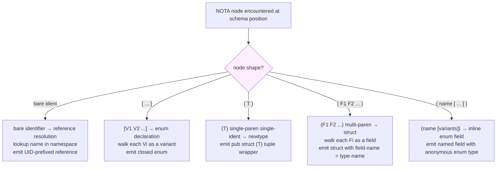
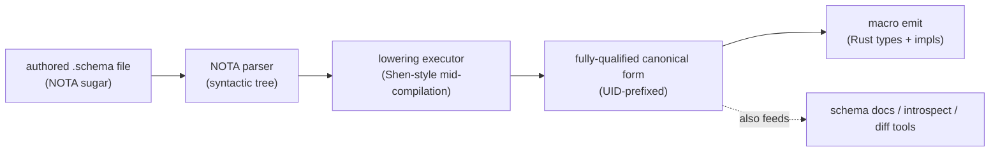
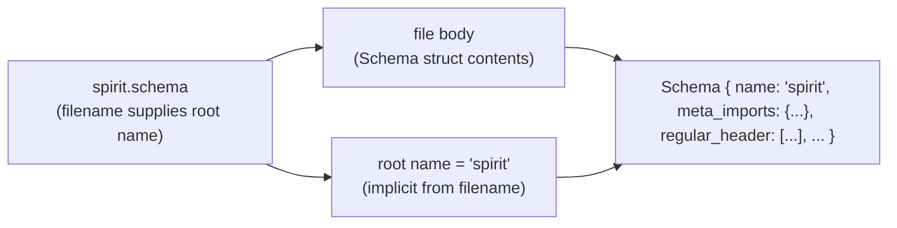
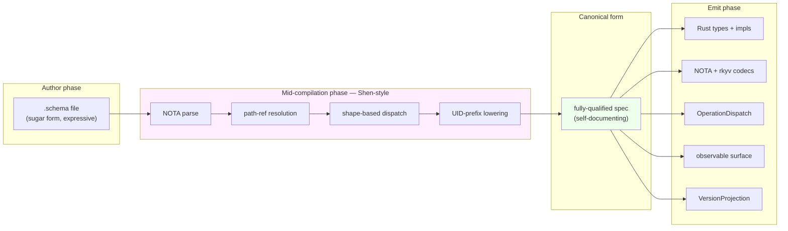

# Schema lowering executor — the recursive dispatch model

*Second-designer report — representing the psyche's
schema-language lowering model. Intent records 467-471 anchor this.
The schema language is NOT just a NOTA shape — it's a NOTA shape +
a recursive lowering executor that dispatches at each node based
on bracket/paren shape and assembles the schema into a
fully-qualified canonical form. The transient sugar gives
expressive authoring; the lowered form gives self-documentation +
machine consumption. Per psyche directive 2026-05-24: "run with
that and edit everything and represent the concept."*

Date: 2026-05-24
Lane: second-designer
Intent base: Spirit records 467-471 (this round) on top of the
earlier corpus 388-466 (schema-language thread).

## 1 · TL;DR — the five-piece model

1. **Field name = type name, expressed once.** In a struct, a
   `Kind` reference is BOTH the field name (lowered to `kind`
   for the Rust field) AND the type (`Kind` PascalCase). No
   separate field-naming syntax needed when the name matches the
   type. Per intent 467.

2. **The schema language has a lowering executor** — a recursive
   parser walks the NOTA tree, dispatches at each node based on
   shape (bare identifier / `[…]` vector / `(T)` single-paren /
   `(F1 F2 …)` multi-paren), and lowers transient sugar into a
   fully-specced canonical form. Per intent 468.

3. **Lowered output uses fully-qualified UIDs.** Every reference
   becomes namespace-path-prefixed so collisions across components
   are impossible. Lowered form = self-documenting,
   machine-consumable, correctness-verifiable by reading. Sugar
   form = human authoring expressive power. Per intent 469.

4. **This is the foundation for a custom-language library.**
   The recursive-parser + dispatch + lowering pattern works for
   ANY DSL the workspace wants to express in NOTA. Schema is the
   first application. Inspired by Shen-style mid-compilation
   assembly. Per intent 470.

5. **File path supplies the root name.** Spirit's `spirit.schema`
   is implicitly the schema named "spirit"; the file body is the
   Schema struct's contents, no inner naming. Each schema is a
   root enum named after its component. Per intent 471.

## 2 · The dispatch table

When the recursive parser encounters a NOTA node IN SCHEMA
POSITION, it dispatches by shape:

| Node shape | Schema meaning | Example | Lowered form |
|---|---|---|---|
| `Foo` (bare identifier) | Reference to a namespace entry | `Topic` | `spirit::namespace::Topic` (UID-prefixed) |
| `[V1 V2 V3 …]` | Enum declaration with variants V1, V2, V3 | `[Decision Principle Correction Clarification Constraint]` | Closed enum `Kind` with 5 unit variants |
| `(T)` single-paren one-identifier | Newtype (1-tuple) wrapping T | `(String)` | `pub struct <name>(<name>::String);` |
| `(F1 F2 F3 …)` multi-paren | Struct with positional fields F1, F2, F3 | `(Topic Kind Summary Context Magnitude Quote)` | Struct with 6 fields, each named after its type (lowered to lowercase) |
| `(name [V1 V2 …])` two-element with vector | Inline-named enum field | `(kind [Decision Principle Correction Clarification Constraint])` | Struct field `kind` with inline-anonymous enum type |
| `(name Type)` two-element with identifier | Explicit-named field (when name != type) | `(certaintyOf Magnitude)` | Struct field `certaintyOf` of type `Magnitude` |

The dispatch is **context-aware**: the SAME bracket characters
mean different things based on whether they sit at a namespace-
value-position, a field-list-position, or a variant-payload-position.



## 3 · Field name = type name (intent 467)

The unification per intent 467: in a struct, each field's
identity IS the type name. The same identifier expresses both
field-name and field-type; casing distinguishes them at code
emission time.

### 3.1 · Why this works

Workspace naming discipline (per ESSENCE.md §"Naming" +
skills/naming.md) already says: names don't carry their full
ancestry. Inside a `Profile` struct, the field is `size` not
`profileSize`. Here it goes one step further: when the field's
type is `Topic`, the field is `topic` — the SAME identifier,
just lowered for Rust field-name conventions.

When the field happens to need a different name from its type
(e.g., a `Magnitude`-typed field named `certaintyOf` because the
struct has multiple `Magnitude` fields with different meanings),
explicit `(certaintyOf Magnitude)` syntax kicks in. The
single-identifier shortcut is the COMMON CASE.

### 3.2 · Spirit's Entry as worked example

Schema form (sugar):
```
Entry (Topic Kind Summary Context Magnitude Quote)
```

Lowered Rust:
```rust
pub struct Entry {
    pub topic:     spirit::namespace::Topic,
    pub kind:      spirit::namespace::Kind,
    pub summary:   spirit::namespace::Summary,
    pub context:   spirit::namespace::Context,
    pub magnitude: signal_sema::Magnitude,
    pub quote:     spirit::namespace::Quote,
}
```

Six fields, each named after its type (lowercase camelCase from
the PascalCase identifier). The types resolve via namespace
lookup; `Magnitude` resolves via cross-schema import (selective,
per intent 436) to `signal_sema::Magnitude` rather than a local
declaration.

### 3.3 · When explicit field names are needed

If a struct has TWO `Magnitude` fields with different roles:

Sugar form:
```
Confidence ((certaintyOf Magnitude) (priorityOf Magnitude))
```

Lowered Rust:
```rust
pub struct Confidence {
    pub certaintyOf: signal_sema::Magnitude,
    pub priorityOf:  signal_sema::Magnitude,
}
```

The `(camelCaseName Type)` two-element form disambiguates. This
falls out of the dispatch table naturally: 2-element parens with
a bare identifier in the first slot = named field.

## 4 · The lowering executor (intent 468)

### 4.1 · The walker

The schema's lowering executor is conceptually one function:

```rust
fn lower_node(node: NotaNode, namespace: &Namespace, ctx: LoweringContext) -> LoweredNode {
    match node {
        // Bare identifier — resolve to namespace entry
        NotaNode::Identifier(name) => {
            let entry = namespace.lookup(&name).expect("undefined name");
            LoweredNode::Reference(entry.fully_qualified_uid())
        }

        // Vector — enum declaration
        NotaNode::Vector(variants) => {
            let lowered_variants = variants.into_iter()
                .map(|v| lower_variant(v, namespace, ctx.descend()))
                .collect();
            LoweredNode::EnumDecl { name: ctx.implied_name(), variants: lowered_variants }
        }

        // Single-paren single-ident — newtype
        NotaNode::Record(items) if items.len() == 1 && items[0].is_identifier() => {
            let inner = lower_node(items.into_iter().next().unwrap(), namespace, ctx.descend());
            LoweredNode::Newtype { name: ctx.implied_name(), inner: Box::new(inner) }
        }

        // Multi-paren — struct with positional fields
        NotaNode::Record(items) => {
            let fields = items.into_iter()
                .map(|item| lower_field(item, namespace, ctx.descend()))
                .collect();
            LoweredNode::StructDecl { name: ctx.implied_name(), fields }
        }
    }
}

fn lower_field(item: NotaNode, namespace: &Namespace, ctx: LoweringContext) -> LoweredField {
    match item {
        // Bare identifier — field-name=type-name (lowered casing)
        NotaNode::Identifier(type_name) => LoweredField {
            name: type_name.to_lowercase(),
            type_ref: namespace.lookup(&type_name).expect("undefined").fully_qualified_uid(),
        },

        // (name [variants]) — inline enum field
        NotaNode::Record(items) if items.len() == 2 && items[1].is_vector() => {
            let name = items[0].as_identifier().unwrap();
            let inline_enum = lower_node(items[1].clone(), namespace, ctx.descend());
            LoweredField { name, type_ref: inline_enum.fully_qualified_uid() }
        }

        // (name Type) — explicit-name field
        NotaNode::Record(items) if items.len() == 2 && items[1].is_identifier() => {
            let name = items[0].as_identifier().unwrap();
            let type_name = items[1].as_identifier().unwrap();
            LoweredField {
                name,
                type_ref: namespace.lookup(&type_name).expect("undefined").fully_qualified_uid(),
            }
        }

        // Other shapes — error
        _ => panic!("invalid field shape"),
    }
}
```

This is the conceptual sketch. The actual implementation lives in
the macro library + spec reader (per intent 408).

### 4.2 · Walking a Spirit example

Given the schema fragment:

```
Entry (Topic Kind Summary Context Magnitude Quote)
```

The executor:

1. Sees the namespace value position — needs to lower whatever's
   there.
2. Sees `(Topic Kind Summary Context Magnitude Quote)` — multi-
   paren with multiple identifiers → dispatch to **struct
   lowering** branch.
3. Implied name from context: `Entry` (the namespace key).
4. For each field item — `Topic`, `Kind`, etc. — dispatch to
   `lower_field`:
   - All are bare identifiers → field-name = lowercase type-name.
5. For each field's type — namespace lookup:
   - `Topic` → resolves to `spirit::namespace::Topic` (local).
   - `Magnitude` → resolves to `signal_sema::Magnitude` (cross-
     schema via meta-imports).
6. Emit:
   ```rust
   pub struct Entry {
       pub topic: spirit::namespace::Topic,
       pub kind: spirit::namespace::Kind,
       ...
       pub magnitude: signal_sema::Magnitude,
       pub quote: spirit::namespace::Quote,
   }
   ```

### 4.3 · Walking an enum example

Given the schema fragment:

```
Kind [Decision Principle Correction Clarification Constraint]
```

The executor:

1. Sees namespace value position.
2. Sees `[Decision Principle ...]` — vector → dispatch to **enum
   lowering** branch.
3. Implied name: `Kind` (the namespace key).
4. For each variant — `Decision`, `Principle`, etc.:
   - Each is a bare PascalCase identifier → unit variant.
   - (If a variant were `(Foo Bar)`, it would be a data-carrying
     variant; dispatched accordingly.)
5. Emit:
   ```rust
   pub enum Kind {
       Decision,
       Principle,
       Correction,
       Clarification,
       Constraint,
   }
   ```

### 4.4 · Walking a newtype example

Given the schema fragment:

```
Topic (String)
```

The executor:

1. Sees namespace value position.
2. Sees `(String)` — single-paren with one identifier → dispatch
   to **newtype lowering** branch.
3. Implied name: `Topic`.
4. Inner: `String` resolves to the primitive.
5. Emit:
   ```rust
   pub struct Topic(pub String);
   ```

### 4.5 · The dispatch is shape-only, not name-driven

A critical property: the dispatch examines ONLY the shape of the
NOTA node (vector? single-paren? multi-paren? bare ident?). It
does NOT examine the head tag or any specific identifier. This
makes the schema language extensible — adding new shapes is a
matter of adding new dispatch branches; no per-tag special-casing.

## 5 · Fully-qualified UIDs in lowered output (intent 469)

### 5.1 · The collision problem

Every component's schema declares types in its own namespace.
Naïvely, `spirit::Topic` and `mind::Topic` would both lower to
`Topic` — collision. Per intent 469, the lowered form uses
fully-qualified UIDs:

| Local name (sugar) | Lowered UID (canonical) |
|---|---|
| `Topic` (in spirit schema) | `spirit::namespace::Topic` |
| `Topic` (in mind schema) | `mind::namespace::Topic` |
| `Magnitude` (imported in spirit) | `signal_sema::namespace::Magnitude` |
| `SemaObservation` (imported in spirit) | `signal_sema::namespace::SemaObservation` |

The lowered form is unambiguous workspace-wide. Tools that
consume the lowered schema (introspection, schema-diff,
schema-doc) don't need name-resolution context — every reference
is universal.

### 5.2 · Why "self-documenting"

Read a lowered schema fragment in isolation:
```
Entry {
    topic:     spirit::namespace::Topic,
    kind:      spirit::namespace::Kind,
    magnitude: signal_sema::namespace::Magnitude,
}
```

You don't need to know which file declares `Topic` — the UID
tells you. You don't need to chase imports — `signal_sema` is
literally in the reference. Correctness is verifiable by reading:
all references resolve transparently.

### 5.3 · Why the sugar form for authoring

The sugar form lets the author write:
```
Entry (Topic Kind Summary Context Magnitude Quote)
```

…rather than:
```
Entry struct {
    topic:     spirit::namespace::Topic,
    kind:      spirit::namespace::Kind,
    summary:   spirit::namespace::Summary,
    context:   spirit::namespace::Context,
    magnitude: signal_sema::namespace::Magnitude,
    quote:     spirit::namespace::Quote,
}
```

The sugar is ~5x denser. Authors get expressive shorthand;
machines + reviewers get the unambiguous fully-qualified form.
Both equivalent.

### 5.4 · The transient nature

Per intent 469: *"it is transitory it does not matter. It is more
like for documentation and a mid."*

The lowered form is a build-time artifact, not committed source.
The sugar form is the AUTHORED truth; lowered form is generated
on demand for verification, code emission, doc generation, etc.

## 6 · Foundation for a custom-language library (intent 470)

The schema language's recursive-parser + dispatch + lowering
pattern is NOT specific to schemas. Any DSL the workspace wants
to express in NOTA can use the same machinery.

### 6.1 · The library's surface

```rust
pub trait NotaDispatch {
    type LoweredOutput;
    fn dispatch(&mut self, node: NotaNode, ctx: DispatchContext) -> Self::LoweredOutput;
}

pub struct LoweringExecutor<D: NotaDispatch> {
    dispatcher: D,
    namespace: Namespace,
}

impl<D: NotaDispatch> LoweringExecutor<D> {
    pub fn lower(&mut self, root: NotaNode) -> D::LoweredOutput {
        let ctx = DispatchContext::root(self.namespace.clone());
        self.dispatcher.dispatch(root, ctx)
    }
}
```

The schema language is ONE implementation of `NotaDispatch` — the
SchemaDispatcher. Future custom languages (e.g., a policy DSL, a
test-spec DSL, a configuration DSL) implement their own
NotaDispatch and reuse the LoweringExecutor.

### 6.2 · Shen as the lens

Per intent 470: *"based on Shen, S-H-E-N, how Shen has like a mid
compilation. So it is like it is assembling it."*

Shen (the Lisp dialect) has a mid-compilation phase where its
type checker runs over the source AST before code generation. The
schema lowering executor is analogous: the dispatch walk + UID
resolution + path-ref substitution is a mid-compilation phase
between authored NOTA and Rust emission.



The mid-compilation form is the integration point. Everything
downstream consumes the canonical form; everything upstream
authors the sugar form.

### 6.3 · Extensibility — adding a new schema shape

Adding a new node shape (e.g., `{key value}` map for the
namespace section itself) is a matter of adding a new dispatch
branch:

```rust
NotaNode::Map(entries) => {
    let mut namespace_table = BTreeMap::new();
    for (key, value) in entries {
        let lowered_value = self.dispatch(value, ctx.descend_in_namespace(&key));
        namespace_table.insert(key, lowered_value);
    }
    LoweredNode::Namespace(namespace_table)
}
```

The pattern: new shape → new branch → recursive descent
continues. No need to touch other branches.

## 7 · Filename-driven root naming (intent 471)

### 7.1 · The convention

The file `signal-persona-spirit/spirit.schema` is the schema
named `spirit`. The name comes from the filename's stem (before
`.schema`), not from any tag inside the file.



### 7.2 · Why this works

Per intent 471: *"we are like reading the file as if we are
reading a path knowing we were reading a struct which is the
schema struct. So it is like this self-embedded logic."*

The reader has TWO pieces of context that uniquely identify
"this is the spirit schema":
1. File extension `.schema` → "this is a Schema struct."
2. Filename stem `spirit` → "this schema's root name is spirit."

Neither needs to appear inside the file. The file body just
contains the positional fields of the Schema struct.

### 7.3 · Implications for namespace UIDs

The root name participates in the fully-qualified UID:
- `Topic` declared in `spirit.schema` becomes
  `spirit::namespace::Topic`.
- `Topic` declared in `mind.schema` becomes `mind::namespace::Topic`.
- The root name is the namespace-root prefix for all UID lowering.

Per intent 471, the root name "doesn't need to be inside the
file" — the filename IS the source of truth.

## 8 · Worked Spirit example — sugar form

The complete Spirit schema in the sugar form (per /169 §3.1's
shape with the corrected dispatch rules applied):

`signal-persona-spirit/spirit.schema`:
```
;; (no comments in the actual file; these are for THIS report)

;; position 0 — meta-imports (selective cross-schema)
{
  Magnitude (Path ../signal-sema/magnitude.schema)
  SemaOperation (Path ../signal-sema/operation.schema)
  SemaOutcome (Path ../signal-sema/outcome.schema)
  SemaObservation (Path ../signal-sema/observation.schema)
}

;; position 1 — regular signal header (vector of variants)
[
  (Operation
    (State (Statement (engine assert)))
    (Record (Entry (engine assert)))
    (Observe (Observation (engine match)))
    (Watch (Subscription (engine subscribe)))
    (Unwatch (SubscriptionToken (engine retract))))
  (Reply
    (RecordAccepted RecordAccepted)
    (StateObserved StateObserved)
    (RecordsObserved RecordsObserved)
    (RecordProvenancesObserved RecordProvenancesObserved)
    (TopicsObserved TopicsObserved)
    (QuestionsObserved QuestionsObserved)
    (SubscriptionOpened SubscriptionOpened)
    (SubscriptionRetracted SubscriptionRetracted)
    (RequestUnimplemented RequestUnimplemented))
  (Event
    (StateChanged (StateChanged belongs DomainStream))
    (RecordCaptured (RecordCaptured belongs DomainStream)))
  (Observable
    (filter default)
    (operation_event OperationReceived)
    (effect_event EffectEmitted))
]

;; position 2 — owner signal header (empty for Spirit MVP)
[]

;; position 3 — sema operation header (Spirit contributes one observation kind)
[
  (SemaObservation (engine match))
]

;; position 4 — namespace (recursive type vocabulary)
{
  Kind [Decision Principle Correction Clarification Constraint]
  ObservationMode [SummaryOnly WithProvenance]
  Presence [Active Absent]
  UnimplementedReason [NotBuiltYet IntegrationNotLanded]

  Topic (String)
  Summary (String)
  Context (String)
  Quote (String)
  StatementText (String)
  FocusArea (String)
  RecordIdentifier (u64)
  QuestionIdentifier (String)
  QuestionText (String)
  StateSubscriptionToken (u64)
  RecordSubscriptionToken (u64)

  Entry (Topic Kind Summary Context Magnitude Quote)
  Statement (StatementText)
  RecordQuery ([Option Topic] [Option Kind] ObservationMode)
  RecordSubscription ([Option Topic] ObservationMode)
  RecordSummary (RecordIdentifier Topic Kind Summary Magnitude)
  RecordProvenance (RecordSummary Context Date Time Quote)
  TopicCount (Topic u64)
  State (Presence [Option FocusArea])
  QuestionSummary (QuestionIdentifier QuestionText)

  RecordObservation (RecordQuery)

  Observation [State (Records RecordQuery) Topics Questions]
  Subscription [State (Records RecordSubscription)]
  SubscriptionToken [(State StateSubscriptionToken) (Records RecordSubscriptionToken)]

  StoredRecord (RecordIdentifier StampedEntry)
  StampedEntry (Entry Date Time)
  RecordIdentifierMint (u64)

  RecordAccepted (RecordIdentifier)
  StateObserved (State)
  RecordsObserved ([Vec RecordSummary])
  RecordProvenancesObserved ([Vec RecordProvenance])
  TopicsObserved ([Vec TopicCount])
  QuestionsObserved ([Vec QuestionSummary])
  SubscriptionOpened (SubscriptionToken SubscriptionSnapshot)
  SubscriptionRetracted (SubscriptionToken)
  RequestUnimplemented (UnimplementedReason)
  SubscriptionSnapshot [(State State) (Records [Vec RecordSummary])]

  StateChanged (State)
  RecordCaptured (RecordSummary)

  OperationReceived (OperationKind)
  EffectEmitted (SemaObservation)
}
```

Notice the dispatch rules in action:
- `Kind [Decision Principle ...]` — namespace key + vector value
  = enum declaration with 5 unit variants.
- `Topic (String)` — single-paren single-ident = newtype.
- `Entry (Topic Kind Summary Context Magnitude Quote)` — multi-
  paren = struct with 6 fields; each is bare PascalCase →
  field-name = lowered type-name.
- `Observation [State (Records RecordQuery) Topics Questions]` —
  vector with mixed unit + data-carrying variants = enum.
- `RecordQuery ([Option Topic] [Option Kind] ObservationMode)` —
  multi-paren with `[Option X]` containers as fields = struct
  with positional container-typed fields.

## 9 · Worked Spirit example — fully-lowered form

The same Spirit schema, fully lowered (sketch of canonical form):

```rust
// Schema { name: "spirit", ... }
//
// meta_imports = {
//     "Magnitude":      Path("signal-sema::namespace::Magnitude"),
//     "SemaOperation":  Path("signal-sema::namespace::SemaOperation"),
//     ...
// }
//
// regular_signal_header = [
//     Variant::Operation(OperationDecl {
//         variants: [
//             OperationVariant {
//                 name:    "State",
//                 payload: "spirit::namespace::Statement",
//                 engine:  EngineAnnotation::Assert,
//             },
//             OperationVariant {
//                 name:    "Record",
//                 payload: "spirit::namespace::Entry",
//                 engine:  EngineAnnotation::Assert,
//             },
//             ...
//         ],
//     }),
//     Variant::Reply(ReplyDecl { ... }),
//     Variant::Event(EventDecl { ... }),
//     Variant::Observable(ObservableDecl { ... }),
// ]
//
// owner_signal_header = []
//
// sema_operation_header = [
//     Variant::SemaObservation(SemaObservationDecl {
//         engine: EngineAnnotation::Match,
//     }),
// ]
//
// namespace = {
//     "spirit::namespace::Kind": EnumDecl {
//         variants: [
//             "spirit::namespace::Kind::Decision",
//             "spirit::namespace::Kind::Principle",
//             "spirit::namespace::Kind::Correction",
//             "spirit::namespace::Kind::Clarification",
//             "spirit::namespace::Kind::Constraint",
//         ],
//     },
//     "spirit::namespace::Topic": Newtype {
//         inner: "primitive::String",
//     },
//     "spirit::namespace::Entry": StructDecl {
//         fields: [
//             Field { name: "topic",     type_ref: "spirit::namespace::Topic" },
//             Field { name: "kind",      type_ref: "spirit::namespace::Kind" },
//             Field { name: "summary",   type_ref: "spirit::namespace::Summary" },
//             Field { name: "context",   type_ref: "spirit::namespace::Context" },
//             Field { name: "magnitude", type_ref: "signal_sema::namespace::Magnitude" },
//             Field { name: "quote",     type_ref: "spirit::namespace::Quote" },
//         ],
//     },
//     ...
// }
```

Every reference is fully qualified. You can read this in isolation
and verify every type resolves; no hidden context needed. The
schema-doc tool, the introspection daemon, the diff tool — all
consume this form directly.

## 10 · Shen-style mid-compilation lens

Per intent 470, the schema lowering is analogous to Shen's
mid-compilation:



The canonical form is the **integration point** between authoring
and emission. Everything that needs to consume the schema (Rust
codegen, NOTA codec generation, short-header dispatch table
emission, observable wiring, VersionProjection synthesis) reads
from the canonical form. The mid-compilation phase happens once
per build.

## 11 · Implications

### 11.1 · For prime designer (/326 thread)

The /326-vN thread captures the schema shape (file structure,
namespace map, etc.) but doesn't yet articulate the LOWERING
EXECUTOR + DISPATCH RULES this report covers. /326-v5 (if it
lands) should absorb:
- The dispatch table (§2 of this report).
- The field-name = type-name unification (§3).
- The lowering executor walker shape (§4).
- The fully-qualified UID convention (§5).

These are operational pieces the schema reader implementation
needs.

### 11.2 · For operator (`primary-ezqx.1`)

The schema reader implementation needs:
- A NOTA parser that produces the syntactic tree (already exists
  in `nota-codec`).
- The LoweringExecutor + dispatch table per §4.
- Path-ref resolution per /320 §2.7 (sandboxed).
- UID generation per §5 (namespace-prefix scheme).
- The macro emit phase that consumes the canonical form per §10.

This is ~3-5 days of operator work on top of the already-existing
`nota-codec` substrate.

### 11.3 · For my own thread

/164 needs a v5 absorbing the lowering executor model. /168
(schema-system-from-intent synthesis) needs an addendum noting
that intent records 467-471 add the lowering executor + dispatch
model on top of the file-shape decisions from 388-466.
/169 stands as the file-shape correction; this report (/170) is
the lowering-executor companion.

### 11.4 · For the custom-language library (intent 470)

Worth a separate bead: extract the LoweringExecutor +
NotaDispatch trait into a reusable library. Schema is its first
consumer; future DSLs (policy, configuration, test-spec) can
implement NotaDispatch to get a custom language for free.

## 12 · Open psyche questions

1. **UID format** — is `spirit::namespace::Topic` (Rust-pathlike)
   the right shape, or should it be something more NOTA-native
   (e.g., `(spirit namespace Topic)`)? Lean: Rust-pathlike for
   Rust emission, NOTA-form for the lowered canonical form (it
   IS NOTA after all). Confirm.

2. **Same-namespace shortcut** — when a type-ref is within the
   same namespace, does the lowered form still spell out the
   full path (`spirit::namespace::Topic` from inside spirit's
   namespace) or strip the local prefix (`Topic`)? Lean: spell
   it out — self-documenting forms shouldn't have
   context-dependent abbreviations. Confirm.

3. **Inline-named field shape** — is `(name [variants])` for
   inline enum field the right syntax, or do we want a more
   explicit marker (e.g., `(field name [variants])`)? Lean: the
   short form is fine because the dispatch is unambiguous.
   Confirm.

4. **Newtype vs single-field-struct** — `(String)` lowers to
   `pub struct Topic(pub String);`. But sometimes you want a
   single-field struct with a named field, not a tuple newtype.
   Should there be a separate syntax (e.g., `(value String)`
   for named-single-field vs `(String)` for tuple-newtype)?
   Lean: `(String)` = newtype tuple; `(value String)` =
   single-field struct with named field `value`. Confirm.

5. **The library extraction** — is the LoweringExecutor +
   NotaDispatch library extraction MVP-scope or post-MVP? It's
   ~50 LOC of trait + walker code; the dispatch rules add ~200
   LOC. Lean: post-MVP; for MVP the lowering logic lives inline
   in the macro, refactor later when a second DSL surfaces.
   Confirm.

## 13 · See also

### Intent records (this report's anchors)

- 467 — field name = type name unification
- 468 — schema lowering executor + dispatch rules
- 469 — fully-qualified UIDs + self-documenting canonical form
- 470 — custom-language library foundation + Shen reference
- 471 — filename-driven root naming

### Earlier corpus this builds on

- 388-389 — short header structure
- 391, 393-396 — schema language framing
- 397-400 — schema component triad
- 404 — boxes layout
- 405-408 — MVP direction + schema-as-library
- 417-419, 424-426 — schema sectioning + curly-brace + no-comments
- 421-422, 428, 431 — namespace + recursive references + cross-schema
- 429-432 — self-describing meta-schema
- 433-437 — .schema extension, multi-section structure, vector-of-variants headers, selective imports, enum-or-vector preference

### Designer reports

- `/326-v4` — current canonical schema shape (operator-facing)
- `/322` — Spirit MVP positional-schema worked example
- `/323` — MVP scope expansion
- `/324` — migration MVP

### Second-designer thread (mine)

- `/163` — signal-sema interaction (terminology pass landed)
- `/164` — NOTA schema language v3 (needs v5 absorbing
  467-471)
- `/165` — counter-ego audit of prime designer cluster
- `/166` — self-audit
- `/167/6` — MVP advance-and-fix meta-session overview
- `/168` — schema-system-from-intent synthesis (needs addendum
  for 467-471)
- `/169` — file-shape corrections post-/326-v3

### External references

- Shen language (S-H-E-N) — Lisp dialect with mid-compilation
  type-checking phase; conceptual lens for the lowering executor
  per intent 470.

### Source files

- `/git/github.com/LiGoldragon/nota-codec/` — NOTA parser the
  lowering executor builds on (parser layer already landed).
- `/git/github.com/LiGoldragon/nota/example.nota` — canonical
  NOTA positional-file example.
