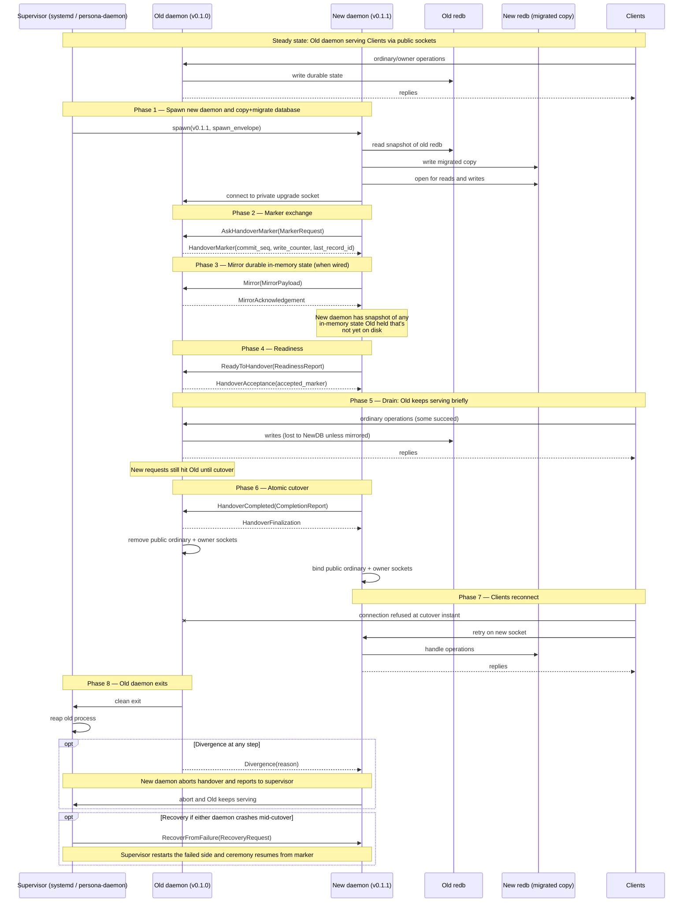
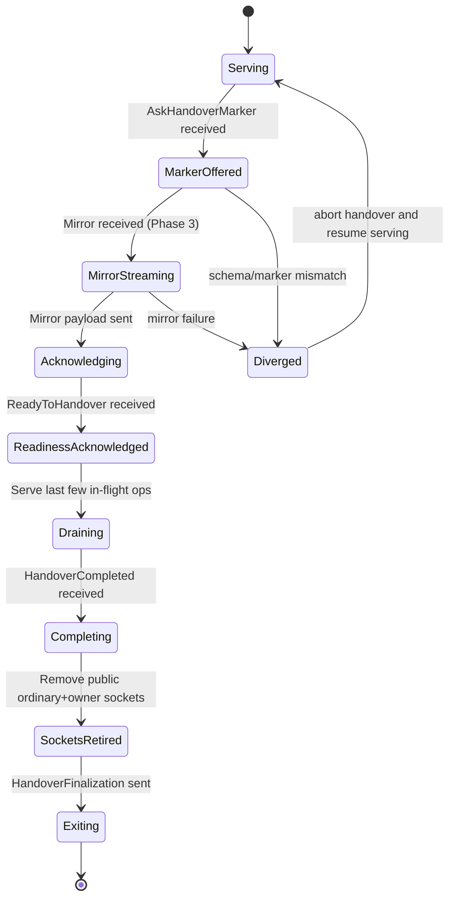
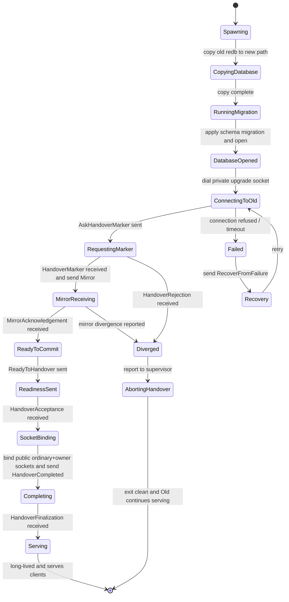

*Kind: Design + Visuals · Topic: upgrade-mechanism-full-design · Date: 2026-05-25 · Lane: second-designer*

# 175 — Upgrade mechanism full design — new daemon talks to old daemon

## §1 Frame

Per psyche directive 2026-05-25: "I want to see the full design of the upgrade mechanism with visual and how I intend it. And that's what we're going to talk about, and that's what we're going to implement." Reframes the earlier multi-endpoint question into the broader upgrade-mechanism design: **the new daemon talks to the old daemon** during cutover. The psyche asked whether this is what's tested + whether it's a good design + to come back with the full picture.

Captured as intent 542. Confirms intent 540 (worktree relocation = recreate under `~/wt` and rebase) and intent 541 (drain-with-mirror accepted, simplified per "acked == durable" empirical finding).

This report answers: what IS implemented and tested today; what the typed protocol intends FULLY; the design assessment (yes, it's good — and the gap from current to full); the visuals showing the ceremony end-to-end; what gets implemented next.

## §2 The psyche's intent in one paragraph

A live component (e.g., Spirit v0.1.0) is running, serving clients on its ordinary + owner sockets, persisting state to `persona-spirit.redb`. The new version (Spirit v0.1.1) needs to take over WITHOUT downtime. The mechanism: **the new daemon spawns alongside the old, opens a private channel TO the old daemon, coordinates handover via typed messages (marker / mirror / divergence / completion / recovery), then atomically takes over the public sockets — old daemon exits cleanly**. Clients see continuous service; one connection might error during the cutover instant and retry. The two daemons "talk to each other" through the private upgrade socket; that conversation is the upgrade mechanism.

## §3 What IS implemented and tested today (the marker ceremony)

Operator landed the **three-step handover marker ceremony**; designer's `spirit-nspawn-handover-socket` worktree drives it; designer's `spirit-nspawn-in-transition-probe` empirically tests handover durability semantics.

### §3.1 The three-step ceremony

The handover-driver (`spirit-nspawn-handover-socket/handover-driver/src/main.rs`) submits three operations against the v0.1.1 daemon's private upgrade socket:

1. **`AskHandoverMarker`** — pull the current marker from the old daemon. Marker = `{ commit_sequence, write_counter, last_record_identifier }`. This is the canonical "current write position" so the new daemon knows where to pick up.

2. **`ReadyToHandover`** — submit the marker back as the readiness report. The old daemon confirms acceptance (`HandoverAcceptance`).

3. **`HandoverCompleted`** — finalise. The old daemon removes its public ordinary + owner sockets after replying with `HandoverFinalization`. New daemon's already-bound public sockets become the live endpoints.

### §3.2 Empirical finding from the in-transition probe

The probe (`spirit-nspawn-in-transition-probe/probes/spirit-in-transition/src/main.rs`) tests durability semantics under disturbance:

- Spawn `BASELINE` parallel senders → spawn `INFLIGHT` parallel senders → after `KILL_AFTER` acks, SIGTERM the v0.1.0 daemon mid-stream → count acked vs errored.
- Readback phase against the v0.1.1 daemon: count records that survived.

**Invariant proven**: `records_in_post_db == baseline_acked + inflight_acked`. Every ack the client received corresponds to a durable record. Some `inflight_errored > 0` is expected — confirming the design is hard-cutover with client retry, no caching/replay actor.

**Implication**: the mirror (when wired) doesn't need to replay in-flight client messages. Only the durable state needs to transfer. Clients carry the retry burden across the cutover instant.

## §4 The full intended protocol (per `signal-version-handover` types)

The `signal-version-handover` crate already defines a richer protocol than the 3-step ceremony currently uses. Operations TYPED:

| Operation | Purpose | Wired today? |
|---|---|---|
| `AskHandoverMarker(MarkerRequest)` | New daemon asks old daemon for current marker | ✓ wired |
| `ReadyToHandover(ReadinessReport)` | New daemon signals readiness with the marker echoed | ✓ wired |
| `HandoverCompleted(CompletionReport)` | New daemon confirms takeover; old daemon retires public sockets | ✓ wired |
| `Mirror(MirrorPayload)` | Old daemon streams durable-state snapshot to new daemon | TYPED, not wired |
| `Divergence(DivergencePayload)` | Either daemon flags mismatch (schema, marker, payload) with a `DivergenceReason` | TYPED, not wired |
| `RecoverFromFailure(RecoveryRequest)` | Mid-handover failure recovery | TYPED, not wired |

Replies wired today: `HandoverAcceptance`, `HandoverFinalization`. Replies typed but not wired: `MirrorAcknowledgement`, `DivergenceAcknowledgement`, `RecoveryCompleted`, `HandoverRejection`.

## §5 The gap — current = marker-only; full = marker + mirror + divergence + recovery

**For Spirit MVP** (write-mostly state store, sync writes to disk), marker-only is sufficient: the new daemon COPIES the old daemon's redb, runs schema migration on the copy, and marker tells it the last commit position the old daemon reached. Mirror would carry nothing because there is no in-memory state to transfer (acked == durable, see §3.2).

**For orchestrate** (single-writer lane-claim authority with in-flight claim state), Mirror is needed: the new daemon must receive a snapshot of in-flight claim state from the old daemon — claims that have NOT yet been persisted but ARE held in memory. Without Mirror, lane claims are lost across cutover.

**For all components**, Divergence + Recovery are needed for production reliability — schema mismatch, marker conflict, mid-handover daemon crash should be handled cleanly rather than via process exit + restart.

## §6 Sequence diagram — the full upgrade ceremony

## §7 State machine — each daemon during cutover

### §7.1 Old daemon (the one being replaced)

### §7.2 New daemon (the one taking over)

## §7.3 Why copy+migrate, not shared database

The new daemon does NOT share the old daemon's redb file. It COPIES the old DB, runs schema migration on the copy, and opens the migrated copy as its own state. Rationale:

| Concern | Shared DB | Copy + migrate (chosen) |
|---|---|---|
| Schema change (v0.1.0 → v0.1.1) | Impossible — different schemas can't read same file | Required — new schema lives only in the copy |
| Rollback if new daemon fails post-cutover | Impossible — old DB has been written by new schema | Possible — old DB unchanged; supervisor can restart old daemon |
| In-flight writes during cutover window | Race conditions — both daemons writing | Clean separation — old writes to its DB until HandoverCompleted; new writes to migrated copy only |
| Cost | Cheap (no copy) | One file copy at spawn (O(N) in DB size; redb is single-file, fast block copy) |
| Same-version handover (no schema change) | Possible but loses rollback | Identity migration; rollback intact |

For Spirit (~MB-scale redb), the copy is sub-second. For larger components, the copy time becomes part of the spawn latency, but it's amortised across the whole upgrade — happens once per cutover, not per request.

**Important consequence for the Mirror operation**: during the copy + migration phase, the old daemon CONTINUES to accept writes. Any write the old daemon accepts AFTER the copy point is invisible to the new daemon's copy. That delta is what Mirror transfers (Phase 3 of the sequence). For Spirit's sync-write pattern with "acked == durable" + drain at HandoverCompleted, the delta is bounded: it's the writes between the copy timestamp and the HandoverCompleted timestamp, which clients can re-submit if their ack was missed. For orchestrate, this delta includes in-flight lane claims that haven't been persisted at all and Mirror must carry them.

## §8 The new-daemon-talks-to-old-daemon channel — what it carries

The "they talk to each other" channel = the **private upgrade socket** at `/run/persona/<component>-upgrade.sock` (or wherever the supervisor placed it via spawn envelope). This is NOT the ordinary socket clients use. It's a coordination channel between the two daemon versions, owned by the supervisor (only the supervisor-spawned new daemon can connect).

What flows on the channel:
- **State position** (marker) — both daemons agree on where the old daemon's last write was.
- **In-memory state snapshot** (mirror) — anything the old daemon held that's not durable yet. For Spirit: nothing (writes are sync to redb). For orchestrate: in-flight lane claims that haven't been committed.
- **Failure signals** (divergence + recovery) — schema mismatch, marker conflict, daemon crash mid-cutover.
- **Cutover trigger** (completion) — old daemon retires public sockets when this arrives.

The channel survives only for the cutover window (a few seconds). After `HandoverFinalization`, the old daemon exits; the channel closes.

## §9 Is the current design good? Per-component fit

| Component | DB write semantics | In-memory critical state | Current ceremony fit | Gap |
|---|---|---|---|---|
| Spirit | Sync to redb on every write; acked == durable per /330 §10 + probe | None — all state in redb | **YES, marker-only is sufficient** | none |
| Orchestrate | Mix: lane claims may be in-memory before persistence | In-flight claims; lane registry cache | **Marker-only is INSUFFICIENT** — need Mirror | Mirror wiring |
| Mind | Mostly persistent; some async write buffers | Possibly some buffered thoughts | Likely Mirror needed for buffer drain | Mirror wiring |
| Other components | Varies | Varies | Per-component assessment | Per-component |

**Verdict**: the current marker-only ceremony is GOOD for Spirit. For components with in-memory critical state, Mirror must be wired before they can use the same cutover ceremony. The typed surface in `signal-version-handover` already supports Mirror — the wiring (state-snapshot encoder on the old side, decoder on the new side) is the remaining work per component.

## §10 Multi-endpoint connection — the reframed Q3

The original Q3 was "should multi-endpoint + unit endpoint schema lowering support be part of Spirit schema epic or a separate slice?" The psyche reframed: "the multi-endpoint is through the... they talk to each other, right?"

Reading: "multi-endpoint" in this context = **the private upgrade socket as a SECOND ENDPOINT alongside the ordinary + owner sockets**. Each component daemon binds three sockets:

1. **Ordinary socket** — public, for clients
2. **Owner socket** — public, for the persona-owner principal
3. **Private upgrade socket** — supervisor-only, for the new-daemon-talks-to-old-daemon channel during cutover

The schema-language Q3 (multi-endpoint sub-variants per root header) is ORTHOGONAL — that's about contract grammar shape. The "multi-endpoint" the psyche connected to upgrade IS about the daemon's socket surface: ordinary + owner are public, upgrade is private + cutover-only.

The third socket is already part of the design — see `signal-version-handover` crate + the handover-driver wiring. The contract grammar question (multi-sub-variants per root) remains separate; lean still: post-Spirit-MVP slice driven by orchestrate + mind.

## §11 What gets implemented next — the basis for upcoming discussion

Per the psyche's "that's what we're going to talk about, and that's what we're going to implement", the implementation surface from this design:

1. **Wire Mirror for orchestrate** — `signal-version-handover::Operation::Mirror(MirrorPayload)` round-trip between old and new orchestrate daemons; payload carries in-flight claim state + lane registry cache.

2. **Wire Divergence reporting** — at least one error path (schema mismatch via `DivergenceReason::SchemaIncompatible`) exercised in tests; supervisor handles abort.

3. **Wire Recovery** — a basic "supervisor restarts new daemon on mid-cutover crash; new daemon resumes from marker" path.

4. **Per-component Mirror payload definitions** — each component's `MirrorPayload` carries what THAT component holds in-memory. Spirit's is empty; orchestrate's is non-empty.

5. **Multi-component sandbox test** — currently designer's spirit-nspawn worktrees test Spirit only; add an orchestrate-nspawn equivalent so the upgrade ceremony is tested across at least two components. Per intent 525, this is "constraints that pass a full sandbox test".

6. **Document the spawn-envelope side** — the supervisor passes the private upgrade socket path to BOTH the old and new daemons via spawn envelope. The contract for this handoff lives in `signal-engine-management::SpawnEnvelope` (recent mockup D adds `parent_authority` via SO_PEERCRED for sender verification).

## §12 Open psyche questions

1. **Mirror payload shape per component** — should `MirrorPayload` be a generic byte blob the component encodes/decodes, or should `signal-version-handover` define a typed-per-component variant set? Lean: typed-per-component — the contract crate gets a generic `MirrorPayload<T>` and each component's `T` is its in-memory critical state shape. Confirm?

2. **Drain semantics during Mirror** — during Phase 3 + 4 (Mirror sending + readiness), does the old daemon stop accepting new client ordinary operations, or does it keep serving until Phase 6 (HandoverCompleted)? Current implementation keeps serving through Phase 5. Lean: keep serving — drain at HandoverCompleted is sufficient; clients retry across the cutover instant. Confirm?

3. **Schema version compatibility check** — should AskHandoverMarker fail if the new daemon's schema version doesn't match what the old daemon expects? Currently no version check is implied. Lean: yes, both daemons assert (new.source_version == old.current_version) at AskHandoverMarker; mismatch returns `HandoverRejection` with reason. Confirm?

4. **Recovery scope** — `RecoverFromFailure` currently has typed shape but no defined semantics. What failures does it cover? Lean: (a) new daemon crashed mid-Mirror — old daemon's `Recovery` invocation tells supervisor to spawn a replacement; (b) old daemon crashed mid-cutover — new daemon takes over via marker + retry. Confirm or pull-back?

5. **Multi-component handover ordering** — when multiple components upgrade together (e.g., persona-engine + persona-spirit + persona-orchestrate), is each component's handover independent, or is there a coordinated sequence? Lean: independent per-component, scheduled by the persona-supervisor; coordination is supervisor responsibility, not contract responsibility. Confirm?

## §13 What is NOT covered in this report

- The Spirit-specific migration logic (Magnitude rename per /324) — that's in `upgrade-spirit-sandbox-test.rs` and `signal-persona-spirit/migration.rs`; separate from the handover ceremony.
- The schema-derived emission story (operator's main-track work) — orthogonal; this report covers the handover ceremony regardless of how the wire types are emitted.
- The full Cargo workspace topology for `signal-version-handover` consumers — that's documentation; the typed surface is the authority.
- The Pi-side / cluster-side spawn semantics — covered by `signal-engine-management::SpawnEnvelope` + the recent mockup D durable-identity work.

## §14 References

- `/git/github.com/LiGoldragon/signal-version-handover/src/lib.rs` — typed protocol (`AskHandoverMarker`, `Mirror`, `Divergence`, `RecoverFromFailure`, etc.)
- `~/wt/github.com/LiGoldragon/CriomOS-test-cluster/spirit-nspawn-handover-socket/handover-driver/src/main.rs` — the 3-step ceremony driver (designer-built, operator mirror)
- `~/wt/github.com/LiGoldragon/CriomOS-test-cluster/spirit-nspawn-in-transition-probe/probes/spirit-in-transition/src/main.rs` — empirical durability probe
- `/git/github.com/LiGoldragon/persona-spirit/src/daemon.rs` — handover socket binding in the daemon
- `/git/github.com/LiGoldragon/upgrade/src/bin/upgrade-spirit-sandbox-test.rs` — in-process sandbox witness
- `/git/github.com/LiGoldragon/upgrade/src/bin/upgrade-daemon.rs` — upgrade orchestrator daemon
- `/tmp/port-signal-orchestrate/src/upgrade_handover.rs` — second-designer's orchestrate drain-with-mirror skeleton (intent 541 simplification pending)
- `reports/designer/287-version-handover-component-explained.md` — original handover design
- `reports/designer/330-parallel-implementation-pivot-and-spirit-nspawn-plan.md` — designer's nspawn plan + probe rationale
- `reports/operator/161-spirit-private-handover-socket-2026-05-22.md` — operator's private upgrade socket work
- `reports/operator/177-schema-constraint-implementation-2026-05-24.md` — Spirit's current maturity reference
- `reports/second-designer/173-orchestrate-port-to-schema-engine-and-no-downtime-upgrade-2026-05-24.md` — orchestrate port + drain-with-mirror sketch
- `reports/second-designer/174-worktree-audit-and-rework-2026-05-25.md` — worktree audit context
- Intent records 540 (worktree relocation), 541 (drain-with-mirror accepted), 542 (this design directive)
