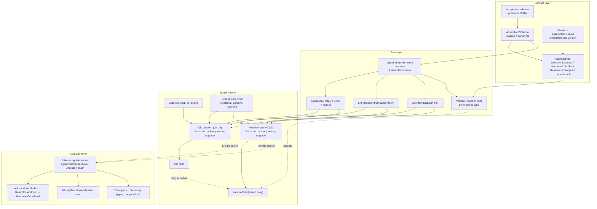

*Kind: Design + Visuals + Code Walk · Topic: upgrade-mechanism-soup-to-nuts · Date: 2026-05-25 · Lane: second-designer*

# 176 — Upgrade mechanism soup-to-nuts — every part, every method call, every deviation

## §1 Frame

Per psyche directive 2026-05-25 (intent 545): "I want to see all the code involved and all the operations, all the method calls. And this ideal upgrade mechanism. I want to see all the parts involved. I want to see where the header is, what it does, how it's used, how the upgrade paths are derived from the schema, how exactly is that done. I want to see it all." Plus intent 546 (test-unblocks-its-own-blockers principle): when a test hits a blocker, unblock IT IN the test rather than reporting back stalled.

Report goal: prove the design is understood end-to-end; identify exact deviations from the ideal; define a sub-agent task that actually EXERCISES the mechanism with permission to unblock blockers in the test.

Incorporates two parallel landings I just read:
- `reports/operator/178-primary-wdl6-spirit-v0-1-0-protocol-build-2026-05-25.md` — Spirit v0.1.0 rebuilt as protocol-aware maintenance build (`v0.1.0.1`), now has the third private upgrade socket + handles `AskHandoverMarker` / `ReadyToHandover` / `HandoverCompleted` via SpiritRoot. Deployed.
- `reports/second-operator/185-orchestrate-mirror-handover-implementation-2026-05-25.md` — Orchestrate `MirrorSnapshot` + `MirrorVersions` types implemented; `OrchestrateService::mirror_snapshot` / `mirror_payload` / `restore_mirror_payload` methods; tests prove two-service old→new mirror transfer.

## §2 The whole mechanism as one diagram



## §3 Where the upgrade comes from — schema is the source

Per intent 491 (upgrade knowledge belongs to the next version) + intent 405 (MVP Spirit runs on schema-derived code) + intent 391 (macro consumes NOTA schema, not Rust syntax): **the schema file IS the source of truth**. Every other artifact derives from it.

For Spirit:
- Current contract: `/git/github.com/LiGoldragon/signal-persona-spirit/spirit.schema` (six-position positional NOTA)
- Frozen previous: `/git/github.com/LiGoldragon/signal-persona-spirit/schemas/v0.1.0/schema.nota`
- Concept (v0.1 marker per /175 sweep): `/git/github.com/LiGoldragon/signal-persona-spirit/schema/signal-persona-spirit.concept.schema`

For orchestrate:
- Current contract: `/git/github.com/LiGoldragon/signal-orchestrate/orchestrate.schema` (per /173 phase 1; second-operator now extended via /185)
- Frozen previous: not yet created
- Concept: per operator's /175 sweep at `/git/github.com/LiGoldragon/signal-orchestrate/schema/...concept.schema`

**The schema file declares every type, every operation, every route, every feature, every engine annotation. Nothing else is authoritative.** Hand-written contract code (current Spirit `src/lib.rs` for v0.1.1, current orchestrate `src/lib.rs`) is operator-maintained mirror of what the schema says — the brilliant macro library (when complete) will EMIT the same code FROM the schema.

## §4 Schema → AssembledSchema → upgrade plan — the derivation algorithm

The full pipeline from authored `.schema` text to executable upgrade plan:

```mermaid
flowchart LR
    sugar["authored .schema<br/>sugar form"]
    parser["nota_codec parser"]
    document["Schema document<br/>(typed Rust structs)"]
    macro_variants["MacroVariant set<br/>(intent 506 — under construction)"]
    builtin_engine["BuiltinSchemaMacro engine<br/>(operator main: add builtin lowering engine)"]
    assembled["AssembledSchema<br/>(canonical lowered form)"]
    prev_assembled["Previous AssembledSchema<br/>(from previous version)"]
    plan_upgrade_from["AssembledSchema::plan_upgrade_from"]
    plan["UpgradePlan"]
    projections["Projection enum<br/>7 kinds"]
    rust_impls["VersionProjection impls<br/>(hand-written today, generated tomorrow)"]
    migration_catalogue["MigrationCatalogue<br/>(at upgrade-daemon)"]

    sugar --> parser
    parser --> document
    document --> macro_variants
    macro_variants --> builtin_engine
    builtin_engine --> assembled
    assembled --> plan_upgrade_from
    prev_assembled --> plan_upgrade_from
    plan_upgrade_from --> plan
    plan --> projections
    projections --> rust_impls
    rust_impls --> migration_catalogue
```



### §4.1 The seven projection kinds

In `schema/src/upgrade.rs`:

```rust
pub enum Projection {
    Identity { name: Name },                                          // unchanged type
    Standard { name: Name, kind: StandardProjection },                // safe inference (additive enum variant)
    Annotated { name: Name, annotation: UpgradeAnnotation },          // explicit annotation (Migrate / Custom)
    Added { name: Name },                                             // type appears in current, not previous
    Renamed { current: Name, previous: Name },                        // current name maps to previous name
    Dropped { name: Name },                                           // explicitly dropped (Drop annotation)
    Untranslatable { name: Name },                                    // explicitly untranslatable
}
```

### §4.2 Plan derivation logic

`AssembledSchema::plan_upgrade_from(&self, previous: &Self)` walks both schemas and emits projections:

| Case | Projection | Algorithm |
|---|---|---|
| Type body unchanged | `Identity` | Body equality check |
| Enum variant added (suffix-only) | `Standard { kind: AdditiveEnumVariant }` | Zip-prefix check on variants |
| Type body changed, has `Migrate` annotation | `Annotated { annotation: Migrate(name) }` | Annotation lookup |
| Type appears only in current | `Added` | Default for new types |
| Type missing in current, has `RenamedFrom` pointing to previous | `Renamed` | Annotation chases previous name |
| Type missing in current, has `Drop` annotation | `Dropped` | Annotation lookup |
| Type missing in current, has `Untranslatable` annotation | `Untranslatable` | Annotation lookup |
| Type missing in current, NO annotation | `Err(RemovedTypeRequiresAnnotation)` | Loud failure |
| Type body changed, NO annotation | `Err(MissingUpgradeAnnotation)` | Loud failure |

The plan is then handed to the **MigrationCatalogue** (at the upgrade-daemon — `/git/github.com/LiGoldragon/upgrade/src/`) which executes the actual migration against the new daemon's copy of the database.

### §4.3 Where today's migration LOGIC actually lives

Currently HAND-WRITTEN at:
- `signal-persona-spirit/src/migration.rs` — `From<v010::Certainty> for Magnitude`
- `upgrade/src/migration.rs` (or similar) — `MigrationCatalogue::prototype()` returning a hard-coded path for the v0.1.0→v0.1.1 case

The IDEAL: macro emits VersionProjection impls from the schema diff so the migration logic IS the projection chain — no hand-written `From` impls needed. Operator's `upgrade: use Spirit contract projection in migration` commit started this; the macro that derives projections from the schema diff is not yet emitting code.

## §5 The short header — every wire frame's discriminator

Per intent 388 (signal-short-header canonical name) + intent 392 (MVP scope: even-byte 7-sub-enum split) + intent 407 (short headers drive receive-side dispatch triage): every wire frame carries a 64-bit short header at offset 0.

### §5.1 Structure (`signal-frame/src/frame.rs:20`)

```rust
pub struct ShortHeader(u64);
```

Byte layout (8 bytes, little-endian):
- **Byte 0** — root operation discriminator (e.g., `State` / `Record` / `Observe` / `Watch` / `Unwatch` for Spirit; `Claim` / `Release` / `Retire` / `Observe` etc. for orchestrate)
- **Byte 1** — sub-variant discriminator within the root (per /326-v13 §1, every header root is `(Root [SubVariant ...])` even with one sub-variant; byte 1 = 0 for the single-sub-variant case)
- **Bytes 2-7** — reserved per /305-v2 (universal data variants — future sub-enum slots; currently zero)

### §5.2 Emit side

The brilliant macro emits `ShortHeader::from(&Operation)` per operation enum so that:

```rust
let operation = Operation::Record(Entry { ... });
let header = ShortHeader::from(&operation);  // byte 0 = 1 (Record), byte 1 = 0 (single sub-variant)
let frame = Frame::with_short_header(header, operation_rkyv_bytes);
socket.write(&frame.encode());
```

### §5.3 Receive side

The dispatch table (macro-emitted from AssembledSchema):

```rust
// macro-emitted on the daemon
impl OperationDispatch for SpiritDaemon {
    fn dispatch(&self, header: ShortHeader, body: &[u8]) -> Reply {
        match header.byte_0() {
            0 => self.handle_state(body),     // decode body as State payload
            1 => self.handle_record(body),    // decode body as Record payload
            2 => self.handle_observe(header.byte_1(), body),  // sub-variant matters
            3 => self.handle_watch(header.byte_1(), body),
            4 => self.handle_unwatch(header.byte_1(), body),
            _ => Reply::RequestUnimplemented(...),
        }
    }
}
```

### §5.4 During cutover

The short header tells the daemon WHICH operation to expect, but NOT which schema version. Schema version negotiation is supervisor-controlled (the supervisor knows which version it spawned). Within a daemon, every frame uses the daemon's compiled schema's byte assignments.

The IDEAL extension (not yet implemented): a `schema_short_hash` field in the short header so the receive side can REJECT frames from an incompatible schema. Per nota-designer/8 deviation #1 + operator/177, schema constraint checks are exposed on production daemon ingress — but they currently verify the schema is well-formed, not that the wire frame matches.

## §6 The wire codec

Two layers:
- **`nota-codec`** — inline NOTA encoding for sized fields (struct fields, enum discriminants, primitive values)
- **`nota-box`** — length-prefixed boxes for unsized fields (Strings, Vecs, Optionals containing growing types) per intent 408 + /325 design

Plus **rkyv** for zero-copy archival of the typed wire frame.

For Spirit's `Record(Entry { topic, kind, summary, context, certainty, quote })`:

```text
Frame wire layout (u32 length prefix omitted for brevity):
  ShortHeader (8 bytes — byte 0 = 1 (Record), byte 1 = 0 (Entry))
  rkyv-archived Entry body:
    Root region: Kind discriminant + Magnitude discriminant (~2 bytes)
    Box region: u32 box count, then 4 length-prefixed boxes:
      [Topic("...")] [Summary("...")] [Context("...")] [Quote("...")]
```

## §7 The handover ceremony (reference /175)

The three-step marker ceremony (`AskHandoverMarker` → `ReadyToHandover` → `HandoverCompleted`) is wired in operator's `primary-wdl6` (v0.1.0 protocol build) and earlier in `signal-persona-spirit` v0.1.1. The full design + sequence diagram + state machines are in `/175`.

Additional operations TYPED in `signal-version-handover/src/lib.rs` but NOT WIRED in any daemon yet:
- `Mirror(MirrorPayload)` — typed for orchestrate per second-operator/185 (`MirrorSnapshot { active_claims, lane_registrations }`), but no daemon listener handles it
- `Divergence(DivergencePayload)` — for schema-mismatch / marker-mismatch reporting
- `RecoverFromFailure(RecoveryRequest)` — for mid-cutover crash recovery

## §8 The Mirror payload per component (second-operator/185)

Each component owns its `MirrorPayload` body shape. Wire envelope is in `signal-version-handover`; payload bytes decode as a rkyv-archived component-specific struct.

**Orchestrate's `MirrorSnapshot`** (per second-operator/185 `src/handover.rs`):

```rust
pub struct MirrorSnapshot {
    pub active_claims: Vec<StoredClaim>,
    pub lane_registrations: Vec<LaneRegistration>,
}
```

Methods (per /185):
- `OrchestrateService::mirror_snapshot()` — builds the snapshot from the live store
- `OrchestrateService::mirror_payload()` — wraps + encodes as `MirrorPayload`
- `OrchestrateService::restore_mirror_payload(payload)` — decodes + writes into a fresh service

Validation enforced on decode:
- Component must be "orchestrate"
- Record kind must be `MirrorSnapshot`
- Target contract version must match orchestrate's current version marker
- Payload bytes must decode as rkyv `MirrorSnapshot`

**Spirit's MirrorPayload** — empty (no in-memory critical state; sync writes mean acked == durable per the in-transition probe finding in /330).

## §9 The database copy + migration phase

Per /175 §7.3 (copy+migrate, not shared) confirmed by psyche intent 544:

1. Supervisor spawns new daemon with spawn envelope naming old + new redb paths
2. New daemon **reads snapshot** of old redb (block-copy at filesystem level)
3. New daemon **runs schema migration** on the copy:
   - For each type in plan: apply the matching Projection (Identity / Standard / Annotated / etc.)
   - For Migrate annotations: invoke the hand-written or schema-derived migration function
   - Write transformed records into the new redb's tables
4. New daemon **opens the new redb** for reads + writes
5. (then handover ceremony begins)

Current implementation: `upgrade/src/bin/upgrade-spirit-sandbox-test.rs` does steps 2-4 in-process (single binary copies + migrates + reads back). The PRODUCTION cutover doesn't yet do this end-to-end — the v0.1.0.1 deployment (per operator/178) has the upgrade socket but the migration is still triggered out-of-band.

**Old redb policy**: preserve briefly after successful cutover for rollback; garbage-collect on next cutover or after 24h (per chat reply lean, awaiting psyche ratification).

## §10 The persona-supervisor side — cutover orchestration

The supervisor (currently systemd + the `lojix-cli (HomeOnly ... Activate)` deployment hook per operator/178) coordinates the cross-component cutover:

1. Build the new system toplevel (NixOS or component-flake)
2. Spawn the new daemon alongside the old (both have own systemd units in operator/178's deployment)
3. Each daemon binds its three sockets at its versioned state directory
4. Once new daemon is ready (via `AskHandoverMarker` reply received), the deployment hook triggers cutover
5. After cutover: deactivate the old daemon's systemd unit; reap

The IDEAL: a typed `persona-supervisor` daemon that owns this orchestration; today it's deployment-script + systemd-unit-pairs. The pattern is correct; the orchestrator is configuration not code.

## §11 The sema-engine catalog + kinds

Per intent 72 (sema database vocabulary) + intent 256 (constraint tests + integration tests):

`signal-sema/src/operation.rs` defines `SemaOperation::{Assert, Mutate, Retract, Match, Subscribe, Validate}` — the 6 engine kinds. Each kind maps to:
- An `OperationClass` (`Write` for Assert/Mutate/Retract; `Read` for Match/Subscribe; `Validate` is its own)
- A record-store table (records under Assert; ephemeral subscriptions under Subscribe)
- A SemaObservation (the typed effect of running the operation)

Engine annotations on schema variants (per /171 §4.2 + operator's main "add builtin lowering engine") let the schema declare WHICH engine kind each operation maps to. Currently stored on `Variant.engine` but not surfaced on `Route` (my mockup B's REBASE target).

## §12 All the binaries — file-by-file map

| Binary | Path | Role |
|---|---|---|
| `upgrade-daemon` | `upgrade/src/bin/upgrade-daemon.rs` | Long-running upgrade orchestrator daemon |
| `upgrade` | `upgrade/src/bin/upgrade.rs` | CLI for triggering upgrade operations |
| `upgrade-spirit-sandbox-test` | `upgrade/src/bin/upgrade-spirit-sandbox-test.rs` | In-process Spirit migration witness |
| `persona-spirit-daemon` | `persona-spirit/src/bin/daemon.rs` | Spirit runtime; binds 3 sockets; serves operations |
| `spirit` | `persona-spirit/src/bin/spirit.rs` (or wrapper) | Spirit CLI; submits operations via ordinary socket |
| `spirit-handover-driver` | `CriomOS-test-cluster/spirit-nspawn-handover-socket/handover-driver/src/main.rs` | Test driver that exercises the 3-step ceremony inside nspawn |
| `spirit-in-transition-probe` | `CriomOS-test-cluster/spirit-nspawn-in-transition-probe/probes/spirit-in-transition/src/main.rs` | Empirical durability probe (acked == durable witness) |
| (future) `orchestrate-daemon` | `orchestrate/src/bin/daemon.rs` | Orchestrate runtime; will bind 3 sockets including upgrade |
| (future) `orchestrate-handover-driver` | parallel of spirit-handover-driver | Test driver for orchestrate cutover |
| (future) `upgrade-orchestrate-sandbox-test` | `upgrade/src/bin/upgrade-orchestrate-sandbox-test.rs` | Orchestrate analog of spirit sandbox test |

## §13 What's wired today vs the ideal — concrete deviation table

| Concern | Ideal | Today | Deviation |
|---|---|---|---|
| Schema as single source | Macro emits all wire code + projections from .schema | Macro consumes schema; emits some types (operator main); projections still hand-written | Macro doesn't yet emit `VersionProjection` impls |
| ShortHeader on every frame | byte 0 + byte 1 always populated; reserved bits explicit | Spirit v0.1.0.1 + v0.1.1 both emit + consume ShortHeader; orchestrate hand-written contract doesn't yet | Orchestrate needs schema-emitted ShortHeader |
| 3-step marker ceremony | Both daemons of every component have it on upgrade socket | Spirit v0.1.0.1 + v0.1.1 ✓; orchestrate ✗ (daemon socket not wired per /185) | Wire orchestrate's upgrade listener |
| Mirror operation | Typed-per-component MirrorPayload; daemons exchange snapshot during Phase 3 | Orchestrate MirrorSnapshot TYPED + tested via in-process pair (/185); daemon listener ✗ | Wire orchestrate daemon listener + Mirror handler |
| Divergence + Recovery | Daemons report schema/marker mismatch + supervisor restarts on crash | TYPED in signal-version-handover ✓; no daemon emits ✗ | Wire at least one Divergence path (SchemaIncompatible) + Recovery on supervisor |
| Copy + migrate DB | New daemon copies + migrates old redb at spawn; old redb preserved 24h | upgrade-spirit-sandbox-test does this in-process; production cutover does NOT yet trigger this from supervisor side | Wire copy + migrate to spawn-time hook |
| Cross-component cutover | persona-supervisor daemon owns + sequences | systemd + lojix-cli deployment script; per-component cutover | Future persona-supervisor typed contract |
| Schema-derived projection | `VersionProjection` impls generated by macro from schema diff | Hand-written (`signal-persona-spirit/src/migration.rs::From<v010::Certainty> for Magnitude`) | Macro emission of projections |
| schema_short_hash in header | Receive side rejects frames from incompatible schema version | byte 2-7 reserved but unused | Schema-short-hash policy (post-MVP) |
| nspawn sandbox upgrade test | Full end-to-end test for every component | Spirit ✓ (designer's 2 worktrees prove durability + ceremony); orchestrate ✗ | Build orchestrate-nspawn-toplevel + upgrade test runner |
| End-to-end test of full mechanism | Schema → projection → daemon → handover → migration → readback, ALL wired | NONE yet — each piece tested in isolation; never the chain | THIS is what the sub-agent dispatch tests |

## §14 Sub-agent dispatch — the test that unblocks its own blockers

Per intent 546 (tests unblock their own blockers): the sub-agent's task is to BUILD AND RUN an end-to-end test of the orchestrate upgrade mechanism. The sub-agent has explicit permission — and instruction — to unblock blockers IN THE TEST: if the daemon listener isn't wired, the test wires it (or mocks it); if the schema-derived projection isn't generated, the test hand-codes the projection; if the supervisor cutover hook isn't built, the test invokes the cutover via direct shell. The test EXERCISES the full chain end-to-end and reports what worked, what didn't, what was unblocked.

Target: orchestrate v0.1.0 → v0.1.1 upgrade ceremony, including:
1. Old daemon running, accepting Claim/Release operations
2. New daemon spawns; copies old orchestrate.redb; runs migration on the copy
3. New daemon connects to old daemon's upgrade socket
4. 3-step marker ceremony + Mirror payload exchange (using /185's typed MirrorSnapshot)
5. Atomic socket cutover
6. Clients reconnect; lane claims survive cutover
7. Verify: every claim that was acked pre-cutover is queryable post-cutover

Worktree location per intent 515: `~/wt/github.com/LiGoldragon/<repo>/feature-orchestrate-upgrade-end-to-end-test/` (multiple repos as needed).

Output: a runnable test (passing OR failing), a report at `reports/second-designer/177-orchestrate-upgrade-end-to-end-test-2026-05-25.md` with concrete findings + bead with worktree pointers.

## §15 Open psyche questions (carry from chat replies + new)

1. **Old redb preservation policy** — 24h then GC vs different timing
2. **Schema-derived `VersionProjection` macro emission** — should this be part of Spirit MVP or a follow-up slice
3. **schema_short_hash in ShortHeader bytes 2-7** — post-MVP feature; when?
4. **persona-supervisor daemon typed contract** — when does the typed supervisor replace deployment scripts + systemd units?
5. **Per second-operator/185 questions** — (i) Mirror snapshot scope (claims+lanes vs include dynamic roles); (ii) contract version marker (semantic byte vs schema-derived hash); (iii) Mirror required before ReadyToHandover (vs Spirit's marker-only)

## §16 References

- `/175` upgrade-mechanism-full-design (this report's foundation)
- `/171` audit-second-operator-180-schema-v13
- `/172` design-mockup-dispatch (4 mockups, plus /172 §3.2 Engine-on-Route)
- `/173` orchestrate-port-to-schema-engine-and-no-downtime-upgrade
- `/174` worktree-audit-and-rework
- `operator/177` schema-constraint-implementation (Spirit current maturity)
- `operator/178` primary-wdl6 Spirit v0.1.0 protocol build (the v0.1.0.1 backport)
- `second-operator/183` orchestrate-worktree-audit-and-rework
- `second-operator/185` orchestrate-mirror-handover-implementation (the MirrorSnapshot landing)
- `nota-designer/8` nota-schema-lowering-deviation-audit
- `designer/326-v13` spirit-complete-schema-vision
- `designer/324` migration-mvp-spirit-handover-re-specification
- `designer/325` nota-box-library-design-and-implementation
- `designer/329` schema-macro-component-extensibility
- `designer/330` parallel-implementation-pivot-and-spirit-nspawn-plan
- Code: `signal-frame/src/frame.rs` (ShortHeader), `signal-version-handover/src/lib.rs` (handover types), `schema/src/upgrade.rs` (Projection enum), `schema/src/document.rs` (plan_upgrade_from), `orchestrate/src/handover.rs` (MirrorSnapshot), `persona-spirit/src/daemon.rs` (upgrade socket binding), `upgrade/src/bin/upgrade-spirit-sandbox-test.rs` (in-process witness), `CriomOS-test-cluster/spirit-nspawn-*` (3 designer worktrees)
- Intent records 388 (short-header canonical), 391 (macro consumes schema), 405 (Spirit on schema-derived code), 407 (short headers drive dispatch triage), 491 (upgrade knowledge on next version), 506 (extensible macro variants), 511 (audit cycle), 525 (until full sandbox test), 540-546 (this session)
