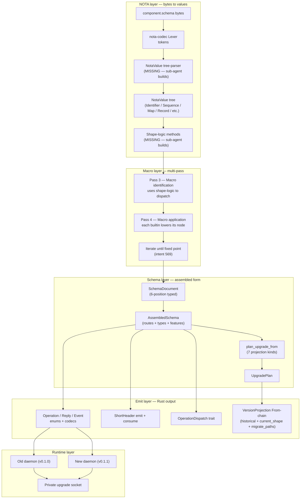

*Kind: Comprehensive Synthesis · Topic: nota + schema + macro system end-to-end · Date: 2026-05-25 · Lane: second-designer*

# 184 — Everything I understand about the fully-schema-and-nota system

## §1 Frame

Per psyche directive 2026-05-25 (intent 595): create an all-encompassing report on everything I understand about the nota + schema + macro system + create an MVP example with whatever worktrees needed to implement all blockers. "Fully-schema-and-nota: nota + schema nota-macro system with builtin macros (for reading macros) implementation."

This report is the SYNTHESIS half of the deliverable. The MVP implementation half is being built by a sub-agent (dispatched in parallel) which will land at `/183` with worktrees in `~/wt/github.com/LiGoldragon/{nota-codec,schema}/feature-*`. This report covers what I understand; the sub-agent's report will cover what runs.

## §2 The whole stack as one picture



The pieces that are WIRED today (operator-landed in past week):
- `nota-codec` lexer + streaming decoder
- `schema` crate: parser.rs + reader.rs + assembled.rs (`Schema::parse_str`, `LoadedSchema::read_path`, `Schema::assemble`, `AssembledSchema::plan_upgrade_from`)
- `signal-frame` macros emit wire types + codecs + ShortHeader + OperationDispatch per operator/180
- Operator/180 landed `SchemaField { name, schema_type }` so field names flow from .schema into emitted Rust
- Operator/178 landed Spirit v0.1.0.1 retrofit with three-socket topology

The pieces that are MISSING (sub-agent's MVP target):
- `nota-codec::NotaValue` tree-parser (per /334-v2 §3.2 + Q4)
- Shape-logic methods on `NotaValue` (per intent 588 + operator-prompt enumeration)
- Multi-pass macro pipeline using shape-logic dispatch (per intent 589 + /334-v2 6-pass model + intent 569 fixed-point)
- "Builtin macros for reading macros" meta-circularity (psyche's framing)
- Schema-derived `VersionProjection` macro emission (per /181 §3 + /182)

## §3 NOTA — current state + the missing tree-parser

### §3.1 What's wired

`nota-codec` exposes:
- `Lexer::next_token(&mut self) -> Option<Token>` — streaming token producer
- `Decoder` — streaming record/seq/map decoder, used by `schema/src/parser.rs::Parser` to consume schema files
- Per /334-v2 §3.1: "no schema-specific behavior, lives in nota-codec" — correct

### §3.2 What's missing

Per /334-v2 §3.2 + Q4 + intent 588:
- **NotaValue enum** — a tree representation of NOTA values that any consumer can introspect. Today every consumer (schema, sema, signal frames, intent records, lock files) builds its own tree assembler on top of the streaming Decoder.
- **`parse_str(text) -> NotaValue`** — single-value tree parser.
- **`parse_sequence(text) -> Vec<NotaValue>`** — for files like `.schema` that have multiple top-level values with no wrapper.
- **`Lexer::next_token_with_span` returning `(Token, ByteRange)`** — for diagnostics (per /334-v2 Q4).

### §3.3 The shape-logic layer (intent 588 + operator-prompt)

The psyche's "brilliant idea" framing: NotaValue gets a set of shape-detection methods that macros call instead of doing manual pattern-matching:

```rust
impl NotaValue {
    pub fn is_identifier(&self) -> bool;
    pub fn is_pascal_case_identifier(&self) -> bool;
    pub fn is_sequence(&self) -> bool;          // [...]
    pub fn is_map(&self) -> bool;               // {...}
    pub fn is_record(&self) -> bool;            // (...)
    pub fn record_arity(&self) -> Option<usize>;
    pub fn record_head(&self) -> Option<&NotaValue>;
    pub fn record_head_identifier(&self) -> Option<&str>;
    pub fn is_tagged_record(&self, head: &str) -> bool;
}
```

Plus the new shape from the psyche's prompt list: `[... | ...]` (square bracket with pipe). UNCERTAIN what this is — could be alternation syntax, or psyche misspoke. Worth clarifying.

The shape-logic layer is the UNIFYING SUBSTRATE: every macro variant uses the same predicates; every NOTA consumer (schema reader, intent decoder, sema record reader) shares the same shape interrogation.

## §4 Schema crate — current state per /182

Per /182 walkthrough: schema crate has 17 source files (~5K LoC) — real working code, not stub.

- `parser.rs` consumes `nota_codec::Decoder` → produces `Schema` (positional 6-field struct)
- `reader.rs` loads files, resolves imports recursively, detects cycles
- `assembled.rs` lowers Schema → AssembledSchema (canonical machine object)
- `upgrade.rs` enumerates 7 projection kinds + diff algorithm
- `engine.rs` has 5 BuiltinSchemaMacro variants (Import/Header/Type/Feature + one)
- `declaration.rs` has `SchemaField { name, schema_type }` per operator/180

What schema crate ALREADY DOES:
- Reads real `.schema` files
- Validates structure
- Computes upgrade plans between two AssembledSchemas

What schema crate DOESN'T do:
- Emit Rust code (that's the proc_macro `signal_channel!([schema])` in `signal-frame/macros`)
- Generate VersionProjection impls from diffs (still hand-written at `upgrade/src/migrations/persona_spirit/version_0_1_0_to_0_1_1.rs:100-318`)
- Layout-after-assemble (gap per /171 §4.3)

## §5 Multi-pass macro pipeline — per designer/334-v2 + intent 569 + my /170

Designer's /334-v2 enumerated 6 passes:

| Pass | Input | Output | Where it lives today | Where it should live |
|---|---|---|---|---|
| 0 lexical | text | tokens | nota-codec Lexer ✓ | (same) |
| 1 syntactic | tokens | NotaValue tree | NOT IMPLEMENTED | nota-codec (MVP sub-agent builds) |
| 2 structural | NotaValue | SchemaDocument positions | schema parser ✓ | (collapses onto Pass 1 once tree lands) |
| 3 macro-identification | SchemaDocument node | macro choice | schema engine ✓ (5 builtins) | (same; extends to 7 per /329) |
| 4 macro-application | macro choice + node | LoweredFragment | schema engine ✓ | (same; iterates per intent 569) |
| 5 assembly | LoweredFragment* | AssembledSchema | schema document::assemble ✓ | (same) |

Per intent 569: macro application is ITERATIVE TO A FIXED POINT — each pass may identify new macro positions; iterate until no macro positions remain.

Per my /170 §2 dispatch rules table — shape-based dispatch:
- `Foo` bare identifier → reference (lookup + UID-prefix)
- `[V1 V2 ...]` → enum declaration
- `(T)` single-paren single-ident → newtype tuple
- `(F1 F2 ...)` multi-paren → struct with positional fields
- `(name [variants])` → inline-named enum field
- (operator/180 added the named-field-in-record form: `((field T) ...)`)

The shape-logic layer (intent 588) IS the substrate Pass 3 uses to dispatch. Pass 3 asks NotaValue "is_sequence?" → enum; "is_record with arity 1?" → newtype; "is_record with named-field sub-records?" → struct with named fields.

## §6 Shape-logic library — the unifying substrate

This is the architectural unifier across:
- Operator's just-dispatched task (per the psyche prompt sub-agent will implement)
- /334-v2 Pass 3 (macro identification)
- My /170 §2 dispatch rules table
- Designer /329 SchemaMacro trait
- Nota-designer/8 §"Reusable Lowering Shape" — named input structs

All of these point at the same library: a set of shape-detection methods on NotaValue that macros call. Without it, every macro variant rebuilds the same pattern-matching by hand. With it, macros become small data-driven dispatch tables.

**Home decision** (per psyche soft-lean "nota codec or something"): `nota-codec`. Co-located with the tree parser. Every NOTA consumer benefits.

## §7 Builtin macros as macros for reading macros — the meta-circularity

The psyche's framing: "builtin macros (for reading macros)". Three layers of meta:

1. **Builtins** lower NOTA into typed schema structures (`ImportMacro`, `HeaderMacro`, `TypeMacro`, `FeatureMacro`, future `UpgradeMacro` per /181 §3, future `StorageMacro` per /181 §6).
2. **Builtins use shape-logic** to dispatch — so a builtin IS a small program that asks NotaValue "what shape are you?" and chooses what to do.
3. **The schema reader IS a macro pipeline** — Pass 3 (macro identification) is itself a macro: it reads a NotaValue, asks shape-logic predicates, and dispatches to the matching builtin.

So "builtin macros for reading macros" means: the macro system uses its OWN macros (the shape-dispatch ones) to read the macros declared in user schemas. Meta-circular but bounded — the bootstrap macros are hand-written in Rust; once they exist, user-declared macros run on the same substrate.

The future direction: user-defined macro variants (per /329 extensibility via registration) plug into the same shape-logic dispatch. Add a new variant `MyCustomLowerer { fn matches(&self, value: &NotaValue) -> bool; fn lower(&self, value: &NotaValue, context: &mut LoweringContext) -> Result<()> }` and the engine picks it up. The shape-logic layer is what makes this clean.

## §8 How upgrade-derivation fits in

Per /182's walkthrough + /181 §3 UpgradeMacro proposal:

The schema diff → VersionProjection chain runs ATOP the multi-pass pipeline:

1. Load v_prev.schema → NotaValue → multi-pass → AssembledSchema (v_prev)
2. Load v_next.schema → NotaValue → multi-pass → AssembledSchema (v_next)
3. `v_next.plan_upgrade_from(&v_prev)` → UpgradePlan (Vec of 7-kind Projections)
4. **UpgradeMacro** (new builtin) reads the schema's `(Upgrade (FromVersion ...) annotations)` feature + the UpgradePlan + emits Rust:
   - `mod historical { /* private rkyv reproduction of v_prev types */ }`
   - `mod current_shape { /* From<historical::T> for current_crate::T per Projection */ }`
   - `pub fn migrate_paths(source, target) { read v_prev, write v_next via From-chain }`
5. The macro library compiles this into the upgrade crate

Concrete Spirit example per /182 §4: ONE rename (`Certainty → Magnitude`); rest is Identity or Added. Macro emits ~200 lines of historical + ~50 lines of From impls + ~30 lines of migrate_paths. Byte-equivalent to the existing hand-written `upgrade/src/migrations/persona_spirit/version_0_1_0_to_0_1_1.rs`.

## §9 The 6-position .schema format unification

Per /326-v13 + operator/174-v5: every `.schema` is six top-level positions, no enclosing wrapper:

```
{imports}                  ; position 0 — map of binding → ImportDirective
[ordinary header]          ; position 1 — vector of (Root [SubVariant...])
[owner header]             ; position 2 — same shape for owner-principal ops
[sema header]              ; position 3 — same shape for sema-engine ops
{namespace}                ; position 4 — map of name → declaration body
[features]                 ; position 5 — vector of (Reply ...) / (Event ...) / etc.
```

All headers use uniform form `(VerbName [SubVariant ...])` even for single sub-variant (intent 494). Variants in namespace records use named-field form `((field Type) ...)` per operator/180. Type expressions use parens `(Option T)` / `(Vec T)` per intent 485.

The reader needs to consume 6 top-level NotaValues sequentially per /334-v2 §3.3 correction (a `.schema` file is six top-level values in sequence with no enclosing wrapper, not a single root tuple).

Spirit v0.1.0 (frozen at `signal-persona-spirit/schemas/v0.1.0/schema.nota`) is NOT yet in 6-position — it's a flat single-vector NOTA file. /182 §7 Step 1: mechanical retro-fit to 6-position. ~30 minutes of edit.

## §10 What the MVP sub-agent will demonstrate

Per the sub-agent dispatch (id elided, running in background), the MVP target:

- **Piece 1**: `NotaValue` enum + `parse_str` + `parse_sequence` + `Lexer::next_token_with_span` in `nota-codec` (worktree `~/wt/github.com/LiGoldragon/nota-codec/feature-notavalue-and-shape-logic/`)
- **Piece 2**: Shape-logic methods on NotaValue (the predicate set)
- **Piece 3**: Multi-pass macro pipeline `read_schema_six_position(text) -> SchemaDocument` driven by shape-logic dispatch with 4 builtins (ImportMacro / HeaderMacro / TypeMacro / FeatureMacro)
- **Piece 4**: End-to-end test against real `spirit.schema` — assertion-equivalent to canonical `schema::Schema::parse_str`
- **Piece 5**: Meta-circularity demonstration — show how a hypothetical user-defined macro plugs into the same dispatch

Sub-agent has explicit permission per intent 546 to unblock blockers in the implementation: hand-write any missing piece, mock anything not yet built. Deliverable: runnable code + a `/183` report with concrete findings + bead.

## §11 Complete deviation → action map

Putting it all together — what's wired, what's missing, what sub-agent is closing, what remains:

| Item | Wired today? | Sub-agent closes? | Remaining |
|---|---|---|---|
| `nota-codec` Lexer + Decoder | ✓ | — | — |
| `NotaValue` tree-parser | ✗ | ✓ Piece 1 | — |
| `Lexer::next_token_with_span` | ✗ | ✓ Piece 1 | — |
| Shape-logic methods | ✗ | ✓ Piece 2 | — |
| Schema crate parser + reader + assemble + plan_upgrade_from | ✓ (per /182) | — | — |
| 6-position SchemaDocument | ✓ | — | — |
| 5 BuiltinSchemaMacro variants | ✓ | — | extend to 7 per /329 |
| Multi-pass with shape-logic dispatch | partial (5 builtins exist; not driven by shape-logic) | ✓ Piece 3 (mini pipeline) | full collapse of schema/src/parser.rs onto multi-pass per /334-v2 §5 |
| Fixed-point iteration (intent 569) | ✗ | partial (Piece 3 demo) | full iteration in production schema reader |
| Meta-circular builtins (intent 595) | — | ✓ Piece 5 (doc/demo) | full user-extension registry per /329 |
| Schema-derived VersionProjection (UpgradeMacro) | ✗ | NOT in MVP (per /181 §3) | separate slice (3-step path in /182 §7) |
| Storage feature variant | ✗ | NOT in MVP (per /181 §6) | separate slice |
| Engine-on-Route | ✗ | NOT in MVP | mockup B rebase per /181 §4 |
| Component name + UID | ✗ | NOT in MVP | mockup A rebase per /181 §5 |
| primary-602y v0.1.0.1 ShortHeader backport | ✗ | NOT in MVP | P0 slice per /181 §2 |

Sub-agent's MVP focuses on Pieces 1-5 (the nota-side substrate); the schema-side downstream work (UpgradeMacro, Storage, Engine-on-Route, Component-UID, primary-602y) stays as separate operator slices per /181's MVP-leans plan.

## §12 Why this is the right MVP shape

Three reasons:

1. **Foundation-first**: shape-logic + NotaValue are SUBSTRATE — every other piece (UpgradeMacro, Storage macro, future user-defined macros) depends on them. Building them first unblocks downstream work.

2. **Demonstrable end-to-end**: Piece 4 (test against real spirit.schema) proves the multi-pass model works on production data, not just toy examples. The byte-equivalence vs canonical parser is a concrete pass/fail.

3. **Meta-circular demonstration**: Piece 5 proves the architecture extends. Without showing user-extension working, the meta-circularity claim is design-only; with Piece 5's demo, it's empirical.

## §13 Open questions for psyche

After all the leans applied, three genuine uncertainties remain:

1. **What is `[... | ...]` (square bracket with pipe)?** From the prompt psyche enumerated shape forms. Could be (a) alternation syntax (`[FieldA | FieldB | FieldC]` meaning "one of"), (b) misspoke (meant `[...]` separately), or (c) future feature. Unblocks the shape-logic method set spec.

2. **Where does the multi-pass schema reader's final form live** — replace `schema/src/parser.rs` (per /334-v2 §8 step 2 lean) or coexist as alternate entry point? Sub-agent's MVP coexists; production decision pending. Lean: replace (one canonical path) once Piece 4 byte-equivalence is proven.

3. **UpgradeMacro priority vs primary-602y vs other slices** — /181 §9 sequenced primary-602y first, then mockup rebases, then UpgradeMacro. Confirm sequence or re-prioritize? Lean: primary-602y unblocks production cutover so stays first; UpgradeMacro closes largest hand-written deviation so high priority but not P0.

## §14 References

- `reports/second-designer/182-schema-crate-state-and-version-projection-derivation-2026-05-25.md` — schema crate state walkthrough
- `reports/second-designer/181-counter-ego-mvp-leans-2026-05-25.md` — 5 MVP slices proposed
- `reports/second-designer/180-audit-second-operator-179-design-schema-language-v4-2026-05-25.md` — historical 4-vs-6 field disposition
- `reports/second-designer/179-audit-operator-180-schema-field-name-and-upgrade-context-2026-05-25.md` — field-name preservation landing
- `reports/second-designer/178-audit-second-operator-186-orchestrate-upgrade-socket-2026-05-25.md` — orchestrate Mirror wire audit
- `reports/second-designer/176-upgrade-mechanism-soup-to-nuts-2026-05-25.md` — full upgrade mechanism + deviation table
- `reports/second-designer/175-upgrade-mechanism-full-design-2026-05-25.md` — handover ceremony sequence + state machines
- `reports/second-designer/170-schema-lowering-executor-model-2026-05-24.md` — shape-based dispatch rules
- `reports/designer/334-v2-multi-pass-nota-first-schema-reader.md` — 6-pass NOTA-first reader design
- `reports/designer/333-upgrade-mechanism-full-design-explained.md` — parallel soup-to-nuts design
- `reports/designer/329-schema-macro-component-extensibility.md` — SchemaMacro trait + 7 builtins
- `reports/designer/326-v13-spirit-complete-schema-vision.md` — current 6-position schema design
- `reports/nota-designer/8-nota-schema-lowering-deviation-audit.md` — schema-stack vertical audit
- `reports/operator/180-schema-field-name-and-upgrade-context-2026-05-25/` — field-name preservation + primary-602y
- `reports/operator/175-schema-engine-prep/` — 75 concept schemas + NodeDefinitionPoint
- `reports/second-operator/186-orchestrate-upgrade-socket-implementation-2026-05-25.md` — orchestrate Mirror wire
- `reports/second-operator/185-orchestrate-mirror-handover-implementation-2026-05-25.md` — orchestrate MirrorSnapshot typed
- `reports/second-operator/180-schema-v13-model-and-upgrade-implementation-2026-05-24.md` — second-operator 6-field landing
- `reports/second-operator/179-design-schema-language-v4/4-overview.md` — historical 4-field proposal
- `/git/github.com/LiGoldragon/{nota,nota-codec,schema,signal-frame,signal-version-handover,signal-persona-spirit,persona-spirit,upgrade,orchestrate,signal-orchestrate}/` — implementation tree
- Intent records 388 (short-header canonical), 391 (macro consumes schema), 405 (Spirit on schema-derived code), 469 (UID form), 471 (filename-driven root), 485 (paren type expressions), 491 (upgrade on next version), 494 (uniform header form), 506 (data-carrying macro variants), 525 (until full sandbox test), 540 (worktree relocation), 541 (drain-with-mirror simplified), 542 (full design directive), 544 (database copy not share), 546 (test unblocks blockers), 549 (multi-pass NOTA-first), 561 (schema diff Add/Remove/Modify), 569 (iterative-to-fixed-point macro), 570 (dependency-ordered namespace), 571 (newtype = single-tuple struct), 585 (commit + push end of pass), 586 (lean on intent propose MVP), 587 (macro decides projection module), 588 (NOTA shape-logic layer), 589 (multi-pass passes generic NOTA), 595 (this fully-schema-and-nota-mvp directive)
