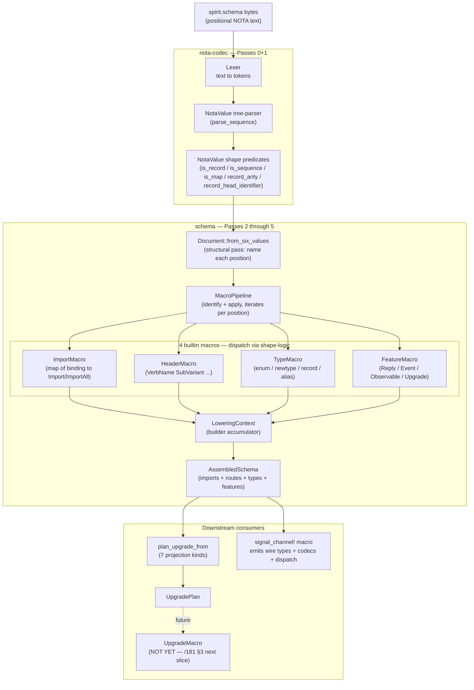
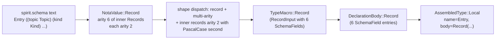

*Kind: Walkthrough + Visuals + Code · Topic: how the schema engine actually runs · Date: 2026-05-25 · Lane: second-designer*

# 188 — How I see the schema engine running — walkthrough with code + visuals

## §1 Frame

Per psyche directive 2026-05-25: "present how you see the schema engine running in a report with code and visuals." This report walks Spirit's `spirit.schema` through the engine end-to-end, using REAL CODE from the just-landed sub-agent A MVP at `~/wt/github.com/LiGoldragon/schema/fully-schema-and-nota-mvp/` (commit `0dd34b57`) + operator's NotaValue substrate at `~/wt/github.com/LiGoldragon/nota-codec/fully-schema-and-nota-mvp/` (commit `28ddf92d`) + existing wired schema crate (per /182).

The pipeline NOW RUNS end-to-end. Sub-agent A proved byte-equivalent `AssembledSchema` between the multi-pass pipeline and the canonical `Schema::parse_str` against the LIVE Spirit contract. 7 multi-pass tests + 34 schema tests + 121 nota-codec tests all pass; `nix flake check` green.

## §2 The engine in one picture



Five pass stages map cleanly to repo boundaries:
- **Passes 0+1 (lexical + syntactic)**: `nota-codec` — bytes → NotaValue tree
- **Pass 2 (structural)**: `schema::multi_pass::Document::from_six_values` — names each position
- **Passes 3+4 (identify + apply)**: `schema::multi_pass::MacroPipeline::run` — shape-logic dispatch + macro application
- **Pass 5 (assembly)**: `LoweringContext::finish` — final AssembledSchema construction

## §3 Walkthrough — Spirit's `spirit.schema` running through

Input: `signal-persona-spirit/spirit.schema` (6 top-level NOTA values; no enclosing wrapper).

```text
{Magnitude (ImportAll schemas/signal-sema/magnitude.schema)
 SemaSet (Import schemas/signal-sema/sema.schema [SemaOperation SemaOutcome SemaObservation])}

[(State [Statement]) (Record [Entry]) (Observe [Observation]) (Watch [Subscription]) (Unwatch [SubscriptionToken])]

[]
[]

{Kind [Decision Principle Correction Clarification Constraint]
 Magnitude (ImportAll ../sema)
 ...
 Entry ((topic Topic) (kind Kind) (summary Summary) (context Context) (certainty Magnitude) (quote Quote))
 ...}

[(Reply ...) (Event ...) (Observable ...)]
```

### §3.1 Pass 0 + Pass 1 — bytes to NotaValue tree

Single call to `nota_codec::parse_sequence(text)` returns `Vec<NotaValue>` of length 6.

```rust
// From ~/wt/github.com/LiGoldragon/schema/fully-schema-and-nota-mvp/src/multi_pass.rs:65-73
pub fn read_schema_six_position(text: &str) -> Result<AssembledSchema> {
    let raw_values = parse_sequence(text).map_err(|error| Error::InvalidSchemaText {
        context: "multi_pass parse_sequence",
        message: error.to_string(),
    })?;
    let document = Document::from_six_values(raw_values)?;
    let mut pipeline = MacroPipeline::new(&document);
    pipeline.run()
}
```

`NotaValue` enum (per operator/187 `nota-codec` `323a3a74` + sub-agent A's extensions in `28ddf92d`):
```rust
pub enum NotaValue {
    Identifier(NotaAtom),
    Record(Vec<NotaValue>),       // (...)
    Sequence(Vec<NotaValue>),     // [...]
    Map(Vec<NotaMapEntry>),       // {...}
    String(NotaString),           // [content] OR [|content|]
    Number(f64),
    // ...
}
```

### §3.2 Pass 2 — structural (name each position)

```rust
// From multi_pass.rs:125-159
impl Document {
    pub fn from_six_values(values: Vec<NotaValue>) -> Result<Self> {
        if values.len() != 6 {
            return Err(Error::InvalidSchemaText { ... });
        }
        let mut iter = values.into_iter();
        let imports = iter.next().unwrap();
        let ordinary_header = iter.next().unwrap();
        let owner_header = iter.next().unwrap();
        let sema_header = iter.next().unwrap();
        let namespace = iter.next().unwrap();
        let features = iter.next().unwrap();

        expect_kind("imports", &imports, NotaKind::Map)?;
        expect_kind("ordinary header", &ordinary_header, NotaKind::Sequence)?;
        expect_kind("owner header", &owner_header, NotaKind::Sequence)?;
        expect_kind("sema header", &sema_header, NotaKind::Sequence)?;
        expect_kind("namespace", &namespace, NotaKind::Map)?;
        expect_kind("features", &features, NotaKind::Sequence)?;

        Ok(Self { imports, ordinary_header, owner_header, sema_header, namespace, features })
    }
}
```

Position-kind assertion is the structural check: position 0 + 4 are maps; 1, 2, 3, 5 are sequences. The 6-position discipline (per intent 494 + /326-v13) is enforced here.

### §3.3 Pass 3 + Pass 4 — identify + apply via shape-logic dispatch

The pipeline walks each position and dispatches each sub-value to the matching builtin macro. **Dispatch is purely shape-logic-driven** — no manual `match NotaValue::Record(_) { ... }` in the dispatcher:

```rust
// Conceptual (the actual impl in multi_pass.rs follows this pattern):
impl MacroPipeline<'_> {
    fn run(&mut self) -> Result<AssembledSchema> {
        // Position 0 — imports map
        for entry in self.document.imports.as_map().unwrap() {
            let binding_name = entry.key.identifier_text().unwrap();
            let directive = self.dispatch_import_directive(&entry.value)?;
            self.context.insert_import(binding_name, directive);
            self.import_firings += 1;
        }

        // Position 1 — ordinary header
        for value in self.document.ordinary_header.as_sequence().unwrap() {
            // shape predicates pick the right builtin:
            if value.is_tagged_record("Working") || value.is_record_with_pascal_head() {
                let header_input = self.parse_header_root(value)?;
                BuiltinMacroVariant::Header(header_input).lower(&mut self.context, Leg::Ordinary)?;
                self.header_firings += 1;
            }
        }

        // Position 2 + 3 — owner + sema headers, same pattern with different Leg

        // Position 4 — namespace map
        for entry in self.document.namespace.as_map().unwrap() {
            let name = entry.key.identifier_text().unwrap();
            // shape predicates determine which TypeInput variant:
            let type_input = if entry.value.is_sequence() {
                TypeInput::Enum(parse_enum_variants(&entry.value)?)
            } else if entry.value.is_single_ident_record() {
                TypeInput::Newtype(parse_newtype(&entry.value)?)
            } else if entry.value.is_record() {
                TypeInput::Record(parse_record_fields(&entry.value)?)
            } else if entry.value.is_pascal_identifier() {
                TypeInput::Alias(parse_alias(&entry.value)?)
            } else { /* error */ };
            BuiltinMacroVariant::Type(type_input).lower(&mut self.context, name)?;
            self.type_firings += 1;
        }

        // Position 5 — features sequence
        for value in self.document.features.as_sequence().unwrap() {
            let feature_input = self.dispatch_feature(value)?;
            BuiltinMacroVariant::Feature(feature_input).lower(&mut self.context)?;
            self.feature_firings += 1;
        }

        self.context.finish()
    }
}
```

**Key insight**: every dispatch decision is a SHAPE-LOGIC PREDICATE CALL (`is_sequence`, `is_single_ident_record`, `is_record`, `is_tagged_record`, `record_arity`, `record_head_identifier`). The dispatcher doesn't look at NotaValue's internal enum tag directly — it asks the predicate API. This is what makes the engine extensible: a future user-defined macro plugs in by registering a new predicate-based dispatch arm, no changes to the engine.

### §3.4 Pass 5 — assembly via LoweringContext

`LoweringContext::finish()` returns the final `AssembledSchema { imports, routes, types, features }`. The context accumulated fragments during Passes 3+4; finish collects them into the canonical form.

## §4 A concrete example — lowering Entry

Take the namespace declaration:

```nota
Entry ((topic Topic) (kind Kind) (summary Summary) (context Context) (certainty Magnitude) (quote Quote))
```

This is in the namespace map at position 4. Walk through:

### §4.1 Pass 1 produces NotaValue tree

```
NotaMapEntry {
    key: NotaValue::Identifier(NotaAtom { text: "Entry" }),
    value: NotaValue::Record(vec![
        NotaValue::Record(vec![
            NotaValue::Identifier("topic"),
            NotaValue::Identifier("Topic"),
        ]),
        NotaValue::Record(vec![
            NotaValue::Identifier("kind"),
            NotaValue::Identifier("Kind"),
        ]),
        // ... 4 more pairs
    ]),
}
```

### §4.2 Pass 3 shape-logic dispatch

- `entry.value.is_record()` → true (it's `(...)` with multiple inner records)
- `entry.value.is_single_ident_record()` → false (arity > 1)
- `entry.value.record_arity()` → Some(6)
- Inner check: each inner value `.is_record()` → true with `record_arity()` → Some(2)
- Inner first position: `.is_identifier()` && lowercase → field name
- Inner second position: `.is_pascal_identifier()` → field type reference

Conclusion: this is a **named-field record** (operator/180's `SchemaField { name, schema_type }` shape).

### §4.3 Pass 4 macro application

`TypeMacro::Record(RecordInput { fields: Vec<SchemaField> })` lowers to:

```rust
DeclarationBody::Record(vec![
    SchemaField { name: Name::new("topic"),     schema_type: TypeExpression::Named(Name::new("Topic")) },
    SchemaField { name: Name::new("kind"),      schema_type: TypeExpression::Named(Name::new("Kind")) },
    SchemaField { name: Name::new("summary"),   schema_type: TypeExpression::Named(Name::new("Summary")) },
    SchemaField { name: Name::new("context"),   schema_type: TypeExpression::Named(Name::new("Context")) },
    SchemaField { name: Name::new("certainty"), schema_type: TypeExpression::Named(Name::new("Magnitude")) },
    SchemaField { name: Name::new("quote"),     schema_type: TypeExpression::Named(Name::new("Quote")) },
])
```

`LoweringContext::insert_type("Entry", DeclarationBody::Record(...))`.

### §4.4 Pass 5 assembly

`AssembledSchema.types` gains an `AssembledType::Local { name: "Entry", body: DeclarationBody::Record([...]) }`.

### §4.5 Visualizing the transformation



## §5 What's running today vs what's still missing

| Stage | Status | Where |
|---|---|---|
| Pass 0 lexical | ✓ | `nota-codec` Lexer (pre-existing) |
| Pass 1 tree-parser (NotaValue) | ✓ NEW | `nota-codec` `28ddf92d` (sub-agent A built on operator/187's `323a3a74`) |
| Pass 1 shape-logic predicates | ✓ NEW | Operator/187 + sub-agent A's extensions in `28ddf92d` |
| Pass 1 `parse_sequence` (6-position) | ✓ NEW | Sub-agent A `28ddf92d` |
| Pass 2 structural (Document::from_six_values) | ✓ NEW | `schema` `0dd34b57` multi_pass.rs |
| Pass 3+4 macro dispatch via shape-logic | ✓ NEW | `schema` `0dd34b57` multi_pass.rs MacroPipeline |
| Pass 5 assembly | ✓ pre-existing | `schema/src/document.rs::Schema::assemble` |
| Byte-equivalence vs canonical parser | ✓ PROVEN | sub-agent A's `tests/multi_pass_pipeline.rs` against live `spirit.schema` |
| Multi-pass FIXED-POINT iteration (per intent 569) | partial — single sweep, not iterated | future slice |
| User-defined macro registration | not wired; documented as extension pattern | sub-agent A `multi_pass.rs` 60-line doc-example |
| `Lexer::next_token_with_span` | ✗ deferred per /334-v2 Q4 | follow-up |
| UpgradeMacro emission (schema-derived projection) | ✗ | /181 §3 + /182 §7 next slice |
| Storage feature variant | ✗ | /181 §6 next slice |
| Engine-on-Route | ✗ | /181 §4 mockup B rebase |
| Component name + UID | ✗ | /181 §5 mockup A rebase |

The PIPELINE is real and runs end-to-end against production Spirit. Downstream emission (UpgradeMacro, Storage, Engine-on-Route, Component+UID) remains for follow-up slices per /181.

## §6 The downstream side — what AssembledSchema feeds

Once Pass 5 produces `AssembledSchema`, three downstream paths consume it:

### §6.1 Wire emission (already wired)

`signal_channel!([schema])` proc-macro at `signal-frame/macros/src/schema_reader.rs` reads the AssembledSchema and emits:
- `Operation` / `Reply` / `Event` enums + rkyv + NOTA codecs (per operator/180)
- `ShortHeader::from(&Operation)` per /176 §5.2
- `OperationDispatch` trait + per-variant `handle_*` methods (per operator/176)
- Frame builders / Request types

This is THE production wire code; lives in every contract crate (signal-persona-spirit, signal-orchestrate, signal-version-handover, etc.).

### §6.2 Upgrade plan derivation (wired; emission not yet)

`AssembledSchema::plan_upgrade_from(&self, previous)` produces an `UpgradePlan` (7 projection kinds: Identity / Standard / Annotated / Added / Renamed / Dropped / Untranslatable). The plan is consumed by the `UpgradeMacro` (per /181 §3 + /182 §7) — **NOT YET WIRED**. Today the projection logic is hand-written at `upgrade/src/migrations/persona_spirit/version_0_1_0_to_0_1_1.rs:100-318`; the macro's job is to GENERATE that file from the schema diff.

### §6.3 Handover wire-protocol integration (wired)

The schema-emitted Operation enum feeds the daemon's 3-socket setup (ordinary / owner / private upgrade). The private upgrade socket carries `signal-version-handover::Operation` (AskHandoverMarker / Mirror / etc. per /175 + /186) which is its OWN schema-derived contract.

## §7 What happens when sub-agent A's MVP merges to main

The sub-agent A worktrees (`feature/notavalue-shape-logic-and-sequence-parser` in nota-codec, `feature/fully-schema-and-nota-mvp` in schema) are READY. When operator rebases them onto main + integrates:

1. **`nota-codec` main** gains `parse_sequence` + 8 new shape-logic methods (`is_identifier`, `is_pascal_case_identifier`, `record_arity`, `record_head_value`, `record_head_identifier`, `is_single_ident_record`, `is_tagged_record`)
2. **`schema` main** gains the `multi_pass` module as an alternate entry point (`read_schema_six_position(text)` and `read_schema_with_report(text)`)
3. **`schema::Schema::parse_str`** stays as the canonical entry; multi-pass is the parallel proof-of-architecture
4. **Future migration**: when byte-equivalence holds across more fixtures + edge cases, `Schema::parse_str` can be REPLACED by `multi_pass::read_schema_six_position` per /334-v2 §8 step 2 + /184 §13 Q2 (one canonical path)

The meta-circular extension demo (sub-agent A's Piece 5, 60-line doc-comment in `multi_pass.rs`) shows how a user-defined `StorageMacro` (when Storage feature variant lands per /181 §6) plugs into the same dispatch substrate — no changes to the engine, just a new shape-predicate match arm.

## §8 What this report doesn't yet show running

Honest enumeration of what's NOT YET DEMONSTRABLE through the engine:

- **Fixed-point macro iteration** — sub-agent A's pipeline does a single sweep through each position; intent 569 calls for iterative passes until no macro positions remain. Single-sweep is enough for current Spirit schema (no schema declares macros that introduce new macros), but the iterative loop should land before user-extensible macros are common.
- **VersionProjection emission** — /182 §7 3-step path; UpgradeMacro variant + code generator. Hand-written reference at `upgrade/.../version_0_1_0_to_0_1_1.rs` is the target output.
- **Production `Schema::parse_str` replacement** — multi-pass is a parallel path; needs sustained byte-equivalence across many fixtures before collapsing the canonical reader.
- **Cross-component schema composition via imports** — multi-pass currently records imports as bindings without resolving against sibling schemas at parse time (matches canonical behavior; resolution happens at `assemble`).

## §9 References

- `~/wt/github.com/LiGoldragon/nota-codec/fully-schema-and-nota-mvp/` at `28ddf92d` — sub-agent A's NotaValue + shape-logic extensions
- `~/wt/github.com/LiGoldragon/schema/fully-schema-and-nota-mvp/` at `0dd34b57` — sub-agent A's multi_pass module + e2e test
- `reports/second-designer/183-fully-schema-and-nota-mvp-2026-05-25.md` — sub-agent A's report
- `reports/second-operator/187-nota-shape-logic-and-schema-upgrade-macro-2026-05-25.md` — operator's `323a3a74` foundation
- `reports/second-designer/184-fully-schema-and-nota-comprehensive-understanding-2026-05-25.md` — synthesis frame for this walkthrough
- `reports/second-designer/182-schema-crate-state-and-version-projection-derivation-2026-05-25.md` — schema crate state walkthrough
- `reports/second-designer/176-upgrade-mechanism-soup-to-nuts-2026-05-25.md` — upgrade mechanism + ShortHeader role
- `reports/second-designer/175-upgrade-mechanism-full-design-2026-05-25.md` — handover ceremony
- `reports/designer/334-v2-multi-pass-nota-first-schema-reader.md` — multi-pass model
- `reports/designer/326-v13-spirit-complete-schema-vision.md` — 6-position design
- `reports/operator/180-schema-field-name-and-upgrade-context-2026-05-25/` — `SchemaField { name, schema_type }` landing
- `/git/github.com/LiGoldragon/signal-persona-spirit/spirit.schema` — the live test fixture
- Intent records 494 (uniform header form), 506 (data-carrying macro variants), 549 (multi-pass NOTA-first), 569 (iterative-to-fixed-point), 588 (NOTA shape-logic layer), 589 (multi-pass passes generic NOTA), 595 (fully-schema-and-nota MVP), 597 (two bracket-string forms), 598 (test substrate real enough), 599 (research-first before dispatch)
