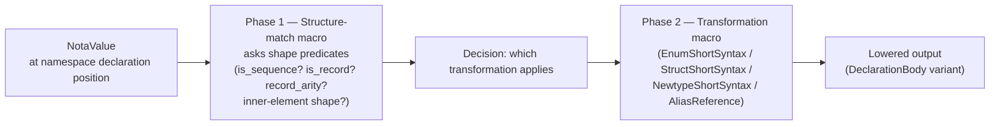
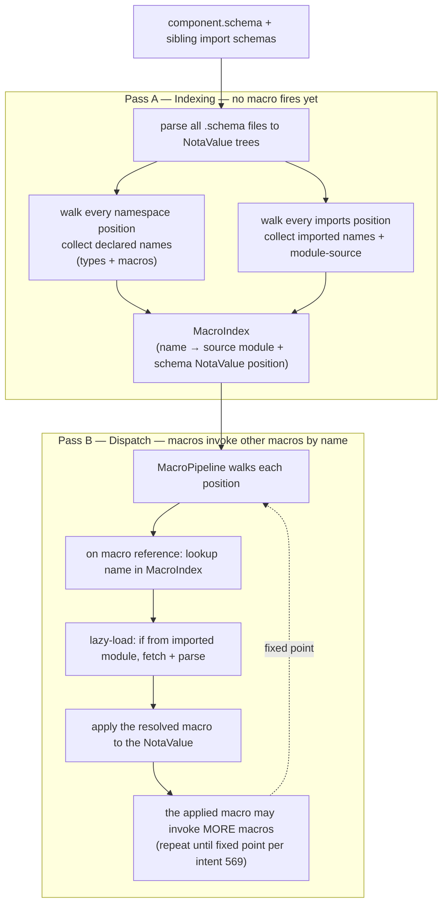
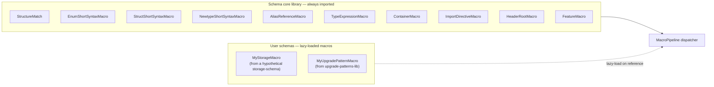

*Kind: Broader Design + Visuals + Concepts · Topic: macro system through and through — precedence, composition, micro-macros, library loading · Date: 2026-05-25 · Lane: second-designer*

# 189 — The macro system through and through

## §1 Frame

Per psyche directive 2026-05-25: "we might need the macros... macro precedence and reading order... lazy loading through... macro definitions are endpoints... macros, macro definitions are endpoints, right? They're, as long as it, like if they use macros inside, obviously then those macros are stored as part of that macro structure. So there's attachment points maybe for macros inside macros... micro-macros... they compose so you can reuse some of them... we need some way to like document all of this... we're going to write a lot of this logic in macros, the built-in stuff... built-in / core macros for showing how you assemble your data structure... lazy loaded by other, by name when you import a whole module... just run with this and come back to me with another report, like 188, but broader."

Captures: intent 603 (two-phase dispatch: structure-match → transformation) + 604 (micro-macros composable) + 605 (lazy-loading + indexing pass for forward references) + 606 (core vs extension macros, always-import core).

This report goes BROADER than /188 — covers macro precedence, lazy loading, composition, micro-macro pattern, library import semantics. Companion to /188's engine-walkthrough; /188 was "how it runs"; /189 is "how it composes + how it loads".

## §2 The two-phase dispatch — structure-match then transformation

The load-bearing insight from the prompt: in NOTA, the SAME syntactic placement can carry DIFFERENT shapes. A `(Identifier [vector])` form could be:
- **enum short-syntax**: `Kind [Decision Principle Correction]` — the bare identifier names the enum; the vector lists unit variants
- **struct short-syntax**: `Entry ((topic Topic) (kind Kind) ...)` — the bare identifier names the struct; the inner records are named fields

The dispatcher can't pre-commit to "vector means enum" because the same bracket could carry struct fields. So macro dispatch splits into TWO phases:



### §2.1 Phase 1 — Structure-match macro

The structure-match macro is a small program that asks shape-logic predicates and returns a CLASSIFICATION TAG:

```rust
// Conceptual — operator's nota-codec has the predicates per /187+/188
enum NamespaceValueShape {
    EnumShortSyntax,        // is_sequence + each element is_identifier
    StructShortSyntax,      // is_record + each inner element is record-of-arity-2 with PascalCase second
    NewtypeShortSyntax,     // is_single_ident_record + inner is_pascal_identifier
    AliasReference,         // is_pascal_identifier (bare)
    UnknownNeedsResolution, // anything else — error or further dispatch
}

fn structure_match(value: &NotaValue) -> NamespaceValueShape {
    if value.is_pascal_identifier() {
        NamespaceValueShape::AliasReference
    } else if value.is_sequence() && value.as_sequence().unwrap().iter().all(|v| v.is_identifier()) {
        NamespaceValueShape::EnumShortSyntax
    } else if value.is_single_ident_record() {
        NamespaceValueShape::NewtypeShortSyntax
    } else if value.is_record() && value.as_record().unwrap().iter().all(|inner|
        inner.record_arity() == Some(2) && inner.as_record().unwrap()[1].is_pascal_identifier()
    ) {
        NamespaceValueShape::StructShortSyntax
    } else {
        NamespaceValueShape::UnknownNeedsResolution
    }
}
```

### §2.2 Phase 2 — Per-shape transformation macro

Each shape has its own transformation macro that takes the NotaValue + the structure-match classification + the LoweringContext, and produces the lowered fragment:

```rust
fn apply_transformation(
    name: Name,
    value: &NotaValue,
    shape: NamespaceValueShape,
    context: &mut LoweringContext,
) -> Result<()> {
    match shape {
        NamespaceValueShape::EnumShortSyntax => EnumShortSyntaxMacro::apply(name, value, context),
        NamespaceValueShape::StructShortSyntax => StructShortSyntaxMacro::apply(name, value, context),
        NamespaceValueShape::NewtypeShortSyntax => NewtypeShortSyntaxMacro::apply(name, value, context),
        NamespaceValueShape::AliasReference => AliasReferenceMacro::apply(name, value, context),
        NamespaceValueShape::UnknownNeedsResolution => /* lazy-load user macro by head identifier; see §5 */,
    }
}
```

The two-phase split makes the engine extensible: adding a new shape means (a) adding a `NamespaceValueShape` variant; (b) adding the structure-match arm; (c) writing the transformation macro. The dispatcher is unchanged.

## §3 Micro-macros — the composable units

Each transformation macro is a MICRO-MACRO: small, single-purpose, composable. The set today:

| Micro-macro | What it does | When it fires |
|---|---|---|
| `StructureMatch` | Classifies NotaValue shape into NamespaceValueShape | First per declaration |
| `EnumShortSyntaxMacro` | Builds `DeclarationBody::Enum { variants: ... }` from `[V1 V2 V3]` | When shape is EnumShortSyntax |
| `StructShortSyntaxMacro` | Builds `DeclarationBody::Record { fields: ... }` from `((f1 T1) (f2 T2) ...)` | When shape is StructShortSyntax |
| `NewtypeShortSyntaxMacro` | Builds `DeclarationBody::Newtype(TypeExpression)` from `(T)` | When shape is NewtypeShortSyntax |
| `AliasReferenceMacro` | Builds `DeclarationBody::Alias(TypeExpression::Named(...))` from bare PascalCase | When shape is AliasReference |
| `ImportDirectiveMacro` | Lowers `(Import path [names])` / `(ImportAll path)` | At position 0 (imports map) |
| `HeaderRootMacro` | Lowers `(VerbName [SubVariant ...])` | At positions 1, 2, 3 (header sequences) |
| `FeatureMacro` | Lowers `(Reply ...)` / `(Event ...)` / `(Observable ...)` / `(Upgrade ...)` | At position 5 (features) |
| `UpgradeAnnotationMacro` | Lowers `(RenamedFrom New Old)` / `(Migrate T)` / `(Drop T)` etc | Inside Upgrade feature |
| `TypeExpressionMacro` | Lowers `(Option T)` / `(Vec T)` / `(Map K V)` | At field-type positions |
| `ContainerMacro` | Sub-macro of TypeExpression for container shapes | Recursive within TypeExpression |

These are all SMALL — typically 5-30 lines each. They COMPOSE because each one's output is the input to the next pass (e.g., StructShortSyntaxMacro calls TypeExpressionMacro on each field's type position; TypeExpressionMacro recursively calls itself for containers).

### §3.1 Composition example: StructShortSyntaxMacro

```rust
// Conceptual:
impl StructShortSyntaxMacro {
    fn apply(name: Name, value: &NotaValue, context: &mut LoweringContext) -> Result<()> {
        let inner_records = value.as_record().unwrap();
        let mut fields = Vec::new();
        for inner in inner_records {
            let field_record = inner.as_record().unwrap();
            assert_eq!(field_record.len(), 2);
            let field_name = field_record[0].identifier_text().unwrap();

            // CALLS the TypeExpressionMacro micro-macro recursively:
            let field_type = TypeExpressionMacro::lower(&field_record[1], context)?;

            fields.push(SchemaField { name: Name::new(field_name), schema_type: field_type });
        }
        context.insert_type(name, DeclarationBody::Record(fields));
        Ok(())
    }
}
```

`TypeExpressionMacro::lower` is itself a micro-macro:

```rust
impl TypeExpressionMacro {
    fn lower(value: &NotaValue, context: &mut LoweringContext) -> Result<TypeExpression> {
        if value.is_pascal_identifier() {
            // Bare PascalCase = named type reference; resolves later
            Ok(TypeExpression::Named(Name::new(value.identifier_text().unwrap())))
        } else if value.is_tagged_record("Option") {
            // (Option T) — composes with itself recursively
            let inner = TypeExpressionMacro::lower(&value.as_record().unwrap()[1], context)?;
            Ok(TypeExpression::Container(Container::Optional(Box::new(inner))))
        } else if value.is_tagged_record("Vec") {
            let inner = TypeExpressionMacro::lower(&value.as_record().unwrap()[1], context)?;
            Ok(TypeExpression::Container(Container::Vector(Box::new(inner))))
        } else if value.is_tagged_record("Map") {
            let parts = value.as_record().unwrap();
            let key = TypeExpressionMacro::lower(&parts[1], context)?;
            let val = TypeExpressionMacro::lower(&parts[2], context)?;
            Ok(TypeExpression::Container(Container::Map { key: Box::new(key), value: Box::new(val) }))
        } else { /* error or further dispatch */ }
    }
}
```

The composition is RECURSIVE — `TypeExpressionMacro` calls itself on inner positions until it hits a leaf (bare PascalCase). This is what makes the macro substrate extensible: new container types (e.g., `(Set T)`) add ONE arm to `TypeExpressionMacro::lower`; existing containers compose with the new one without changes.

## §4 Macro precedence + reading order — lazy loading via indexing pass

The load-bearing question: HOW do macros find each other when one macro references another macro by name?

The answer (per intent 605): a **first indexing pass** collects all macro names declared in the schema + its imports BEFORE any macro is invoked. Subsequent passes RESOLVE macro references by name from the index. This enables forward references and out-of-order definitions.



### §4.1 Why the indexing pass is necessary

Consider:

```nota
{
  Entry ((topic Topic) (kind Kind))   ; references Topic + Kind below
  Topic (String)
  Kind [Decision Principle]
}
```

When the dispatcher processes `Entry`'s declaration, the field-type lowering calls `TypeExpressionMacro::lower(&topic_type_value)` which produces `TypeExpression::Named("Topic")`. At THIS point, `Topic` hasn't been processed yet — but the NAME is already in the index from Pass A. The reference resolves; lowering continues. Later, when `Topic` is processed, its declaration goes into the index too. After Pass B completes, the LoweringContext has every type — references all resolve in the final assembly.

Without the indexing pass, forward references would fail: `Entry` would error because `Topic` hasn't been processed. The indexing pass decouples NAME RESOLUTION from MACRO APPLICATION.

### §4.2 What the index contains

For each declared name:
- The NAME (the local identifier)
- The SOURCE — local-schema vs imported-from-module
- The NOTAVALUE — the unprocessed declaration body (for lazy macro invocation)
- The DECLARATION-KIND classification (per structure-match from §2.1) — so the dispatcher knows which transformation macro to call
- For imported names: the imported MODULE'S MacroIndex (transitively)

### §4.3 Lazy loading from imports

When the schema declares `(Import schemas/signal-sema/sema.schema [SemaOperation])`, Pass A:
1. Records the import binding (`SemaOperation` available in this schema's local namespace)
2. RECURSIVELY loads `sema.schema` (Pass A on it too)
3. Validates `SemaOperation` exists in the imported module's MacroIndex
4. Adds `SemaOperation` to this schema's MacroIndex pointing at the imported module's definition

When dispatch (Pass B) hits a reference to `SemaOperation`, it finds the imported binding in the index and resolves to the imported module's typed definition. The MACRO that produced that definition only fires ONCE (when the imported module was parsed); subsequent uses just read the typed result.

## §5 Macro composition — attachment points within macros

The psyche's phrase: "attachment points maybe for macros inside macros, like a macro library thing."

Concretely: each macro has POSITIONS WHERE OTHER MACROS RUN. Examples:

| Macro | Attachment point | What runs there |
|---|---|---|
| `StructShortSyntaxMacro` | Each field's TYPE position | `TypeExpressionMacro` |
| `EnumShortSyntaxMacro` | Each variant's PAYLOAD position (if any) | `TypeExpressionMacro` or `StructShortSyntaxMacro` (for variants with named fields) |
| `TypeExpressionMacro` | Inner positions of `(Option T)`, `(Vec T)`, `(Map K V)` | Recursive `TypeExpressionMacro` |
| `FeatureMacro::Upgrade` | Annotations vector positions | `UpgradeAnnotationMacro` |
| `UpgradeAnnotationMacro::Migrate` | The type-name argument | `TypeExpressionMacro` (resolves the named type) |
| `ImportDirectiveMacro::Import` | The names vector positions | Identifier-validation (light micro-macro) |

A macro is, in a sense, a TEMPLATE WITH HOLES. The holes are attachment points; what fills the hole is determined by structure-match at that position. This is exactly the meta-circular meta from /184 §7: builtin macros use the same dispatch substrate they apply to user macros.

### §5.1 A concrete attachment-point demonstration

`Entry ((topic Topic) (kind Kind))` — the outer `StructShortSyntaxMacro` fires. At each field position, the attachment point is "field type". The macro running there is `TypeExpressionMacro`. So:

```text
StructShortSyntaxMacro(name=Entry, value=((topic Topic) (kind Kind)))
├── attachment-point "field 0 type" → TypeExpressionMacro(value=Topic)
│   └── returns TypeExpression::Named("Topic")
└── attachment-point "field 1 type" → TypeExpressionMacro(value=Kind)
    └── returns TypeExpression::Named("Kind")
```

If a field's type were `(Vec Topic)`, the attachment point would call `TypeExpressionMacro` which would itself call `TypeExpressionMacro` recursively on the inner `Topic`. Composition all the way down.

## §6 Library loading — core macros vs extension macros

Per intent 606: built-in core macros live in the basic schema library and are ALWAYS IMPORTED when a schema imports the schema module. User-defined macros are lazy-loaded by explicit reference.



### §6.1 What "always imported" means

A `.schema` file doesn't need to declare imports for the core macros. Writing `Kind [Decision Principle]` Just Works because `EnumShortSyntaxMacro` is in the core and the structure-match recognizes the enum shape.

This matches the psyche's framing: "when you import a whole module, which you would with the schema, you just always import it. You would get these built-in macros or built-in these core macros for showing how you assemble your data structure."

### §6.2 What "lazy-loaded by name" means

A user could write a `(MyStorage [...])` block in a schema. The dispatcher sees the `(Identifier ...)` shape, looks up `MyStorage` in the MacroIndex, finds it's an imported user macro from `extensions/my-storage-lib.schema`, lazy-loads that lib (Pass A on it), retrieves the typed definition, applies it.

If `MyStorage` isn't in the index, error: "unknown macro `MyStorage`" — same as unknown-type.

### §6.3 The split rationale

| Concern | Core macros | User macros |
|---|---|---|
| Substrate | non-negotiable | extensible |
| Discoverability | known to every reader | requires reading the import declaration |
| Lifecycle | shipped with schema crate | shipped with user libraries |
| Versioning | tied to schema crate version | per-user-library version |
| Default-load | always | on-reference |
| Documentation | in schema crate docs | in the providing library |

Core covers the schema FOUNDATION — enums, structs, newtypes, type expressions, imports, headers, features. User macros cover EXTENSIONS — storage descriptors, upgrade-pattern templates, custom protocol annotations.

## §7 Concrete walkthrough — Entry through the two-phase + composition pipeline

Showing how all the concepts compose on Spirit's `Entry`:

### §7.1 The schema declaration

```nota
{                    ; namespace map (position 4)
  ...
  Entry ((topic Topic) (kind Kind) (summary Summary) (context Context) (certainty Magnitude) (quote Quote))
  ...
}
```

### §7.2 Pass A — indexing

`Entry` added to MacroIndex with classification `StructShortSyntax`. The body NotaValue is held but not yet processed. Similarly: `Topic`, `Kind`, `Summary`, `Context`, `Quote`, `Magnitude` (imported from sema), `Statement`, `RecordSummary`, etc — all added to the index.

### §7.3 Pass B — dispatch starts on Entry

```text
1. MacroPipeline encounters Entry in the namespace
2. Lookup MacroIndex → classification is StructShortSyntax
3. Dispatch to StructShortSyntaxMacro::apply(name="Entry", value=((topic Topic)...), context)
```

### §7.4 StructShortSyntaxMacro walks the field positions

```text
4. Loop over 6 inner records:
   - inner 0: (topic Topic) — record-of-arity-2
     - field name: "topic"
     - field type position: Topic (NotaValue)
     - attachment point fires: TypeExpressionMacro::lower(Topic, context)
       - structure-match: is_pascal_identifier → AliasReference shape for type expr
       - returns TypeExpression::Named("Topic")
     - construct SchemaField { name: "topic", schema_type: Named("Topic") }
   - inner 1: (kind Kind) — same pattern → SchemaField { name: "kind", schema_type: Named("Kind") }
   - inner 2-4: same pattern for summary/context/certainty
   - inner 5: (quote Quote) — same → SchemaField { name: "quote", schema_type: Named("Quote") }
5. context.insert_type("Entry", DeclarationBody::Record(vec![6 SchemaFields]))
```

### §7.5 Pass B continues to other declarations

```text
6. Topic — lookup → NewtypeShortSyntax
7. Dispatch to NewtypeShortSyntaxMacro::apply(name="Topic", value=(String), context)
   - inner: String
   - attachment point: TypeExpressionMacro::lower(String)
     - structure-match: is_pascal_identifier → AliasReference for type expr
     - special-case: String is a Primitive — returns TypeExpression::Primitive(Primitive::String)
   - construct DeclarationBody::Newtype(TypeExpression::Primitive(String))
8. context.insert_type("Topic", DeclarationBody::Newtype(...))
```

Etc for each declaration. Pass B continues until all namespace + features positions are processed.

### §7.6 Pass 5 — assembly

`context.finish()` returns `AssembledSchema` with all types resolved (named references match index entries).

### §7.7 What this demonstrates

- **Two-phase dispatch**: each declaration goes through structure-match → transformation. The dispatcher doesn't pre-commit; it asks shape predicates per declaration.
- **Composition**: StructShortSyntaxMacro calls TypeExpressionMacro at attachment points; TypeExpressionMacro recursively calls itself on container inner positions; AliasReferenceMacro resolves bare PascalCase to TypeExpression::Named.
- **Lazy resolution**: when StructShortSyntaxMacro creates SchemaField with `Named("Topic")`, Topic might not be processed YET. The reference resolves later at assembly time using the MacroIndex.
- **Micro-macros**: each macro is small (5-30 lines), composes with others, lives in the core library.

## §8 The enum-vs-struct ambiguity case the psyche named

The psyche's example: "you flip a vector with a parentheses identifier and a vector as an enum in a certain context. That's a kind of a macro... that actually is a sub-operation that is done because in that placement you could probably have a struct also, possibly. So the method would have to first find out what it is on that object."

Concretely: a namespace declaration like

```nota
Watch [State Records Questions]
```

vs

```nota
Watch ((state StateSubscription) (records RecordSubscription))
```

Both have the form `Identifier <vector-or-record>`. Which transformation applies depends on the SHAPE of the right-hand side. Structure-match (§2.1):

| Right-hand side | Inner element check | Shape classification |
|---|---|---|
| `[State Records Questions]` | all is_identifier (no nested structure) | EnumShortSyntax — unit-variant enum |
| `[(State StateSubscription) (Records RecordSubscription)]` | inner records of arity 2 with PascalCase second | EnumShortSyntax — data-carrying enum (per /326-v13 §2 + uniform header form) |
| `((state StateSubscription) (records RecordSubscription))` | outer record + inner records arity 2 with LOWERCASE first | StructShortSyntax — named-field record |
| `(StateSubscription)` | single-ident record | NewtypeShortSyntax |

The structure-match doesn't just look at the outer bracket — it INSPECTS THE INNER ELEMENTS. The dispatcher composes shape predicates: `is_record() && record_arity() == Some(N) && inner.iter().all(|i| ...)`. This is exactly the "micro-macro chain" pattern.

## §9 What this means for the implementation today vs the broader vision

Current state (per /188 + sub-agent A's MVP):
- Pass A (indexing) is partially wired — the `Schema::assemble()` walks declarations and inserts into LoweringContext which IS an indexed map; but it does this DURING dispatch not as a SEPARATE FIRST PASS
- Pass B dispatch happens — sub-agent A's `MacroPipeline::run` walks each position and dispatches
- Structure-match is implicit — the dispatcher reads NotaValue shape via predicates (the predicates ARE the structure-match)
- Transformations are inline — the dispatcher does the lowering directly rather than calling a separate per-shape macro module

To match the broader vision (per intents 603-606):
- **Land an explicit Pass A indexing step** that PRE-COLLECTS all names before Pass B starts. Solves forward-reference issues cleanly.
- **Extract structure-match into a named macro** — `StructureMatchMacro` becomes a first-class micro-macro callable from anywhere
- **Extract each transformation into a named micro-macro** — `EnumShortSyntaxMacro::apply`, `StructShortSyntaxMacro::apply`, etc. — instead of inline code in MacroPipeline
- **Add lazy loading for user-defined macros** — MacroIndex grows to include not just names but the SOURCE (core vs user-library) and the lazy-load mechanism for user macros
- **Fixed-point iteration** — Pass B reruns until no new macros are discovered (matches intent 569). Today's pipeline is single-sweep; user-defined macros that introduce more macros would need iteration.

These are NEXT-SLICE work, not blockers for the current MVP. The current MVP proves the substrate works for the CORE macros against a real schema. Extensibility for user macros builds on top.

## §10 Implications for the upgrade-mechanism story

The macro composition pattern matters for the UpgradeMacro slice (/181 §3 + /182 §7):

- `UpgradeMacro` is a feature-position macro that takes `(Upgrade (FromVersion 0 1 0) (RenamedFrom Magnitude Certainty) ...)`
- It has ATTACHMENT POINTS for upgrade annotations
- Each annotation type (RenamedFrom / Migrate / Drop / Untranslatable) is itself a MICRO-MACRO (`UpgradeAnnotationMacro` family)
- The UpgradeMacro composes with the existing `plan_upgrade_from` machinery: lower the annotations → feed them into the diff algorithm → emit the `From`-chain Rust

So `UpgradeMacro` is not monolithic — it's a composition of micro-macros following the same pattern as `StructShortSyntaxMacro` composing with `TypeExpressionMacro`. The pattern transfers cleanly.

## §11 What's still uncertain — psyche call needed

1. **Pass A explicit-vs-implicit** — should the indexing pass be a SEPARATE PHASE that runs to completion before Pass B starts, or interleaved with Pass B (current state)? **Lean: separate** — cleaner; matches intent 605's "first indexing pass collects all macro names". Confirm?

2. **Built-in macro source organization** — should all built-in macros live in ONE file (`schema/src/builtin_macros.rs`) or spread per-category (`enum_short_syntax.rs`, `struct_short_syntax.rs`, etc.)? **Lean: per-category** — each micro-macro is small and self-contained. Easier to extend. Confirm?

3. **User macro registration mechanism** — explicit `(MacroLibrary [path])` import directive vs implicit-via-Import? **Lean: explicit** — keep macro imports visible and auditable. Confirm or pull-back?

4. **Macro versioning** — when a user macro library bumps version, schemas referencing it need to handle the upgrade. Should macros declare their own version + compatibility constraints? **Lean: defer to post-MVP** — solve when user macros actually proliferate. Confirm.

5. **Fixed-point iteration termination** — what if user macros INFINITE-LOOP introducing new macros? **Lean: bounded iteration count** (say 16 passes max) + error if exceeded. Confirm.

## §12 References

- `reports/second-designer/188-schema-engine-running-walkthrough-2026-05-25.md` — companion engine walkthrough
- `reports/second-designer/184-fully-schema-and-nota-comprehensive-understanding-2026-05-25.md` — full-stack synthesis
- `reports/second-designer/183-fully-schema-and-nota-mvp-2026-05-25.md` — sub-agent A's MVP
- `reports/second-designer/182-schema-crate-state-and-version-projection-derivation-2026-05-25.md` — schema crate state
- `reports/second-designer/170-schema-lowering-executor-model-2026-05-24.md` §2 — original dispatch rules
- `reports/designer/334-v2-multi-pass-nota-first-schema-reader.md` — multi-pass model
- `reports/designer/329-schema-macro-component-extensibility.md` — SchemaMacro trait + 7 builtins
- `reports/designer/336-designer-leans-on-27-psyche-questions-and-mvp-plan.md` — designer's parallel leans
- `reports/nota-designer/8-nota-schema-lowering-deviation-audit.md` — named-input-struct pattern
- `reports/second-operator/187-nota-shape-logic-and-schema-upgrade-macro-2026-05-25.md` — NotaValue + shape API foundation
- `~/wt/github.com/LiGoldragon/schema/fully-schema-and-nota-mvp/src/multi_pass.rs` — sub-agent A's pipeline (the current substrate)
- `/git/github.com/LiGoldragon/signal-persona-spirit/spirit.schema` — the test fixture
- Intent records 549 (multi-pass NOTA-first), 569 (iterative-to-fixed-point), 588 (shape-logic layer), 589 (multi-pass passes generic NOTA), 597 (two bracket-string forms), 603 (two-phase dispatch), 604 (micro-macros composable), 605 (lazy-loading + indexing pass), 606 (core vs extension macros)
