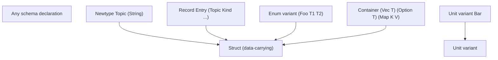
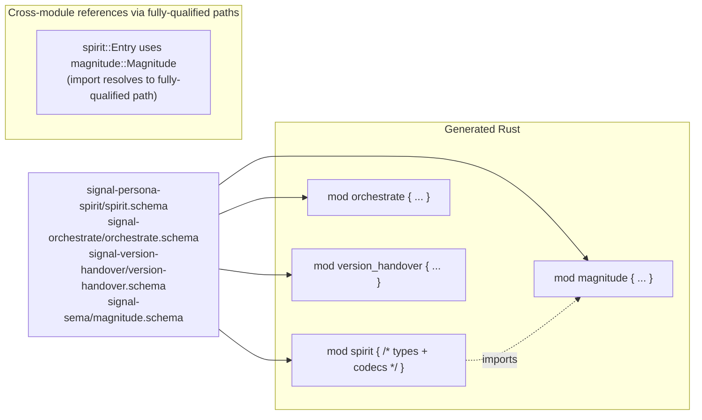

*Kind: Design + Visuals + Migration Analysis · Topic: field-naming-from-type-names + module-per-schema macro output + name-clash strategy · Date: 2026-05-25 · Lane: second-designer*

# 193 — Field naming derived from type names + module-per-schema macro output

## §1 Frame

Per psyche directive 2026-05-25: "the field name is derived from that type name. So we have to know what kind of type this is... we don't define the field name directly in schema. We just name the type there. The field name is derived from that type name... If something needs to be more specific, then it has to be a longer name internally... Can the macro output modules, separate files, that sort of mirror the schema file world?"

Captures: intent 614 (field-names-derived-from-type-names Decision) + 615 (divergent-field-names-via-newtype Decision) + 616 (everything-reduces-to-structs Principle) + 620 (macro-output-module-per-schema Decision) + 621 (fully-qualified-names-internal-representation Principle).

This report does five things: (1) states the new field-naming rule explicitly; (2) shows the concrete migration impact on Spirit's current schema; (3) reconciles the rule with operator/180's `SchemaField { name, schema_type }` direction; (4) proposes module-per-schema macro output structure with name-clash analysis; (5) surfaces the genuine open questions on name clashes that need psyche call.

## §2 The new field-naming rule

**Rule**: in struct/record declarations the field NAMES are DERIVED from the PascalCase type names by lowercasing. No explicit field-name syntax in schema.

Form:
```nota
Entry (Topic Kind Summary Context Certainty Quote)
```

Lowers to:
```rust
pub struct Entry {
    pub topic: Topic,
    pub kind: Kind,
    pub summary: Summary,
    pub context: Context,
    pub certainty: Certainty,
    pub quote: Quote,
}
```

The field name `topic` derives from the type name `Topic` by lowercasing the first character. This is symmetric with how enum variants name themselves — same identifier serves as both type name and field/variant name in its position.

## §3 Divergent field names → via newtype

If you want a field named `certainty` of type `Magnitude` (the current Spirit case), the rule says: **declare a newtype giving the type its specific name**:

```nota
Certainty (Magnitude)
Entry (Topic Kind Summary Context Certainty Quote)
```

Now `Certainty` is a newtype wrapping `Magnitude`; the field in Entry uses `Certainty` (lowercases to `certainty`); the type is the newtype wrapper. Rust emission:

```rust
pub struct Certainty(pub Magnitude);
pub struct Entry {
    pub topic: Topic,
    pub kind: Kind,
    pub summary: Summary,
    pub context: Context,
    pub certainty: Certainty,
    pub quote: Quote,
}
```

The newtype carries the field-naming intent. Field names are mechanical (lowercase of type name); divergent names require divergent type names.

## §4 Operator/180's `SchemaField { name, schema_type }` direction — reversed

Operator/180 added `SchemaField { name, schema_type }` to support explicit field naming at the schema-declaration level — Spirit's `(certainty Magnitude)` shape. Per intent 614, this is REVERSED: explicit field-name syntax is removed; field names derive from type names.

**What this changes vs operator/180**:
- The macro emission stops carrying field-name overrides at the schema declaration site
- `(certainty Magnitude)` schema form becomes invalid; must be `(Certainty)` referring to newtype `Certainty (Magnitude)`
- The Spirit-specific hardcoding gap that operator/180 closed (no more `Entry + Magnitude => certainty` hack in the macro) STAYS CLOSED — but for a different reason now: the schema has `Certainty` (not `Magnitude`) at that position, so the macro doesn't need any special case
- `SchemaField` struct in nota-codec / schema can be simplified to just hold the type expression; the `name` field becomes derivable

**Operator/180's intent stays valid**: macros should NOT contain component-specific field-name knowledge. The mechanism CHANGES: instead of carrying explicit names in `SchemaField`, the schema uses newtype declarations to express the naming. Same end (no Spirit-specific hardcoding); different means (newtype vs explicit-name).

## §5 Everything reduces to structs — the simplification claim

Per intent 616: every shape in the schema reduces to a STRUCT (data-carrying) or UNIT VARIANT.

| Schema form | Reduces to |
|---|---|
| Newtype `Topic (String)` | Struct with one field: `pub struct Topic(pub String)` |
| Record `Entry (Topic Kind ...)` | Struct with N fields |
| Data-carrying enum variant `(Foo Type1 Type2)` | The data-carrying portion IS a struct with N fields; the enum-tag wraps it |
| Unit enum variant `Bar` | A unit struct or unit variant; degenerate |
| Vec `(Vec Topic)` | A struct with one field of `Vec<Topic>` (or container directly) |
| Option `(Option Topic)` | A struct with one field of `Option<Topic>` |
| Map `(Map Topic Count)` | A struct with one field of `Map<Topic, Count>` |

The reduction means: every type in the schema is INSPECTABLE the same way (it has fields; fields have types). Field naming follows the same rule everywhere. The macro emission is uniform: emit a Rust struct definition + its codecs.

Enum variants are slightly special — they wrap structs in an enum-tag. But the variant PAYLOAD is still a struct (the data-carrying portion). Unit variants are the simplest case (no struct; just a tag).



Field naming rule applies to every box on the right: lowercase of type name in field position.

## §6 Module-per-schema macro output

Per intent 620: macro output organizes by MODULE per schema. One `.schema` file → one Rust module.



Generated structure (per crate):

```text
crate-root/
├── src/
│   ├── lib.rs                 // re-exports or pub use of modules
│   ├── spirit/
│   │   ├── mod.rs             // generated from spirit.schema
│   │   ├── operation.rs       // Operation enum + codec
│   │   ├── reply.rs
│   │   └── types.rs           // Entry, Topic, Statement, etc.
│   └── magnitude/
│       └── mod.rs             // generated from magnitude.schema (imported)
```

Or simpler — flat modules, one file per schema:

```text
crate-root/
├── src/
│   ├── lib.rs
│   ├── spirit.rs              // all of spirit's types + codecs in one file
│   └── magnitude.rs
```

**Choice**: flat single-file modules are simpler; subdirectory-per-schema gives finer organization for large schemas. **Lean: flat single-file per schema for MVP** — matches the 1-to-1 file mapping; can split into subdirectories later if a schema grows beyond ~1000 LoC.

## §7 Fully qualified names + name-clash strategy

Per intent 621: internal representation uses fully-qualified names (`crate::module::type` form). The AssembledSchema prefixes module name; the macro emission preserves this all the way through.

```rust
// Internal AssembledSchema reference for Spirit's Entry.certainty field:
TypeReference::FullyQualified {
    crate_name: "signal_persona_spirit",
    module: "spirit",
    type_name: "Certainty",
}

// Rust emission:
pub struct Entry {
    pub certainty: signal_persona_spirit::spirit::Certainty,
}
// Or with use statement:
use signal_persona_spirit::spirit::Certainty;
pub struct Entry {
    pub certainty: Certainty,
}
```

**Single thing per name per context invariant** (per psyche): within a module, every name binds to exactly one thing. If an import would clash with a local name in the same module, that's an ERROR — not silent shadow.

```nota
{
  Magnitude (ImportAll ../signal-sema/magnitude.schema)
}

{
  Magnitude [Maximum Medium Minimum]   ; ERROR — clashes with import
}
```

Module qualification prevents most cross-component clashes because each schema's types live in their own module. Within-module clashes (import + local) are the only remaining case; they error.

### §7.1 What about imported names that clash with each other?

```nota
{
  SemaA (Import ../signal-sema/operation.schema [Operation])
  SemaB (Import ../other/operation.schema [Operation])
}
```

Two imports both bring `Operation` into local namespace → ERROR per operator/174-v5 §"Collision Rule" + the schema crate's `DuplicateImportedName` error (per /171 §3.5). This is already enforced; the new rule doesn't change anything here.

### §7.2 What if a SCHEMA wants two struct fields of the same type?

Under the new rule: `Entry (Topic Kind Topic Quote)` — two `Topic` fields? Field names would clash (`topic` + `topic`). Need a way to disambiguate.

Options:
- (a) Declare two distinct newtypes: `EntryTopic (Topic)` + `SecondTopic (Topic)` → fields `entry_topic` + `second_topic`. Heavy.
- (b) Allow field-name suffix on type reference: `(Topic Topic2)` — implicit numbered suffix. Magical.
- (c) Restore SchemaField for THIS case only — allow `((field_name Topic))` form when needed. Hybrid.

**Lean: (a) for MVP** — forces explicit type names that carry the semantic distinction. (b) is magical. (c) brings back what we just removed. If two-of-same-type fields prove common, revisit.

**Genuine open psyche question**: is (a) acceptable as the rule, or do you want hybrid (c) to coexist for this case?

## §8 Concrete Spirit migration — current vs new shape

Current `signal-persona-spirit/spirit.schema` namespace (excerpt per /182 §3.2):

```nota
{
  ...
  Entry ((topic Topic) (kind Kind) (summary Summary) (context Context) (certainty Magnitude) (quote Quote))
  Statement ((text StatementText))
  RecordQuery ((topic (Option Topic)) (kind (Option Kind)) (mode ObservationMode))
  RecordSummary ((identifier RecordIdentifier) (topic Topic) (kind Kind) (summary Summary) (certainty Magnitude))
  StateObserved ((state State))
  RecordsObserved ((records (Vec RecordSummary)))
  ...
}
```

Under the new field-naming rule:

```nota
{
  ...
  Certainty (Magnitude)                   ; NEW newtype to give Magnitude the field-name "certainty"
  Identifier (RecordIdentifier)           ; NEW newtype to give RecordIdentifier the field-name "identifier"
  Mode (ObservationMode)                  ; NEW newtype to give ObservationMode the field-name "mode"
  State (PresenceFocusArea)               ; NEW newtype if State needs that field-name; otherwise rename type
  Records ((Vec RecordSummary))           ; NEW newtype wrapper around Vec<RecordSummary>
  Records2 ((Vec RecordProvenance))       ; NEW newtype wrapper around Vec<RecordProvenance> — different field-name needed
  Text (StatementText)                    ; NEW newtype to give StatementText the field-name "text"

  Entry (Topic Kind Summary Context Certainty Quote)
  Statement (Text)
  RecordQuery ((Option Topic) (Option Kind) Mode)
  RecordSummary (Identifier Topic Kind Summary Certainty)
  StateObserved (State)
  RecordsObserved (Records)
  ...
}
```

Issues surfaced:
- **Significant newtype proliferation**: many fields that currently have explicit names (mode / state / identifier / records / certainty / etc.) need their own newtype declarations
- **Container fields are awkward**: `RecordsObserved` currently has a field `records: Vec<RecordSummary>`; under new rule, needs a newtype like `Records ((Vec RecordSummary))` then `RecordsObserved (Records)`. But "Records" as a type name might be too generic; might want `ObservedRecords` etc. Each occurrence needs thought.
- **`(Option Topic)` and `(Option Kind)` in RecordQuery** — these are NOT named newtypes; they're inline containers. Field name would derive from what? Possibly the inner type: `Topic`-as-`Option`-of-Topic → field `topic`? Genuine open question — how do inline-container field positions derive field names?

**Genuine open psyche question**: what's the rule for INLINE-CONTAINER field positions like `(Option Topic)`? Three options:
- (i) Field name from inner type: `(Option Topic)` → field `topic`
- (ii) Require named newtype: must declare `MaybeTopic ((Option Topic))` and use `MaybeTopic` → field `maybe_topic`
- (iii) Field name from container head: `(Option Topic)` → field `option_topic`

**Lean: (i)** — most ergonomic; `(Option Topic)` is conceptually still about Topic. (ii) is heavy. (iii) is awkward.

## §9 Vec-as-struct-with-one-field — uniformity claim

Per intent 616: "we have these special vec type, which is basically a struct with a single field. So there's no... It's just vec and then the type. That's how we... Everything is basically a struct at the end."

Concretely: `(Vec Topic)` in a field position represents a struct with one field of type `Vec<Topic>`. The macro emission produces:

```rust
// If Vec appears as a top-level newtype:
pub struct TopicList(pub Vec<Topic>);   // Field-name "topic_list" from type name

// If Vec appears INLINE in a field position:
pub struct Container {
    pub topic: Vec<Topic>,   // Per §8 option (i) lean
}
```

The uniformity claim: there's only one canonical kind (struct), with two flavors (named newtype wrapping container; inline container at field position). The macro doesn't need separate code paths for "regular struct" vs "Vec-containing struct" — both are just structs.

This simplifies macro emission per intent 616. The same struct-emission code handles all cases.

## §10 Implementation impact — what changes from /190 + /181

Operator landed (per /190) + correction in /182:
- `SchemaField { name, schema_type }` in declaration model — **needs simplification** (drop the `name` field; derive from type)
- `Schema::parse_str` reading `((field_name Type) ...)` form — **needs change** to read `(Type1 Type2 ...)` form
- `multi_pass.rs` namespace dispatch — **same shape but simpler**: structure-match recognizes `(Type Type Type)` form as named-positional record where field names derive from types
- `tests/fixtures/schema-e2e/spirit-v0-1-1.schema` — **needs migration** to the new field-naming form (add newtype declarations for divergent field names)
- `BuiltinSchemaMacro::TypeMicroMacro::Record` recognizer — **simpler**: no field-name parsing; just type-list parsing

This is a NON-TRIVIAL migration. Risk: breaking the byte-equivalence test against the canonical reader path. Mitigation: keep the dual-witness pattern (per /181 §"Test View") through the migration; both paths must continue to produce the same AssembledSchema.

**Sequencing**:
1. Land the rule in `schema/src/declaration.rs` + parser + multi_pass + node_shape (per operator/182's `NamespaceValueShape::Record` boundary)
2. Update Spirit's `spirit.schema` to the new form
3. Run dual-witness: shape parser vs streaming parser must agree (both updated)
4. Run multi-pass vs Schema::assemble: must agree (both updated)
5. Update other components' schemas (orchestrate, signal-version-handover)
6. Per operator/180: schema field-name preservation work — most of `SchemaField { name, schema_type }` machinery becomes obsolete; field-name derivation logic replaces it

## §11 Module-per-schema implementation impact

Macro output reorganization:
- Generated code moves from inline `signal_channel!([schema])` expansion to a typed `mod component_name { ... }` block
- Each schema file's emission lands in its own module
- Cross-schema imports compile to `use other_module::Type` statements
- Fully-qualified internal AssembledSchema references (`crate::module::type`) feed the emission

**Implementation paths**:
- (a) `signal_channel!([schema])` macro EMITS a module wrapper: `mod spirit { /* all generated code */ }`. Single macro invocation site; module structure derived from schema name.
- (b) Multiple per-type modules: macro emits `mod operations { ... }` + `mod types { ... }` + `mod codecs { ... }` within a single schema's module. Finer organization.

**Lean: (a) for MVP** — single module per schema; refine to (b) if a schema gets too large.

## §12 Open psyche questions

After applying all the leans, these are the genuine uncertainties:

1. **Two-fields-of-same-type rule** (per §7.2): three options (newtypes / numbered suffix / explicit name). Lean: (a) newtypes-only-for-MVP. Confirm or hybrid?

2. **Inline-container field-name derivation** (per §8): `(Option Topic)` → field name `topic` (lean i), `(Option Topic)` requires newtype wrapper (lean ii), or `(Option Topic)` → field `option_topic` (lean iii)? Lean: (i) for ergonomics. Confirm?

3. **Module organization granularity** (per §11): one big module per schema OR multiple sub-modules per concern (operations/types/codecs)? Lean: (a) one module per schema for MVP. Confirm?

4. **Module naming convention from schema filename**: `spirit.schema` → `mod spirit { }`; `signal-version-handover.schema` → `mod signal_version_handover { }` or `mod handover { }`? Lean: derive from filename, snake_cased + hyphen-to-underscore. Confirm.

5. **Cross-crate module qualification**: when Spirit imports Magnitude from signal-sema, the AssembledSchema reference is `signal_sema::magnitude::Magnitude`. But the GENERATED RUST might use `use signal_sema::magnitude::Magnitude;` then `Magnitude` unqualified. Either is valid; which is the canonical form? Lean: `use` statements at the top of each module; type references unqualified inline. Confirm.

## §13 Migration recommendation

Land in this order:

1. **Capture rule + close prior gap**: this report (/193) documents the rule + reverses operator/180's explicit `SchemaField { name, schema_type }` direction.
2. **Migrate Spirit's spirit.schema to new form** — add newtypes for divergent field names (Certainty, Identifier, Mode, etc.). Run dual-witness; both paths must produce identical AssembledSchema.
3. **Simplify `SchemaField` declaration in schema crate** — remove explicit name; derive in the recognizer.
4. **Add module-per-schema emission to brilliant macro library** — `signal_channel!([schema])` wraps generated code in `mod <component> { ... }`.
5. **Update other components' schemas** as they migrate (orchestrate, signal-version-handover).
6. **Resolve open psyche questions §12** as they hit during implementation.

Estimated effort: 2-3 operator sessions for Spirit migration + macro emission update; per-component migration as each lands.

## §14 References

- `reports/second-designer/192-audit-operator-182-second-operator-schema-node-shape-2026-05-25.md` — most recent macro-system boundary work
- `reports/second-designer/189-macro-system-broader-understanding-2026-05-25.md` — two-phase dispatch + micro-macros + intent 603-606
- `reports/operator/180-schema-field-name-and-upgrade-context-2026-05-25/` — the direction this report partially REVERSES (explicit SchemaField → derived from type)
- `reports/operator/182-second-operator-schema-node-shape-audit-2026-05-25.md` — NodeDefinitionShape + NamespaceValueShape boundary correction
- `reports/second-operator/190-schema-mainline-macro-index-port-2026-05-25.md` — MacroIndex + TypeMicroMacro foundation that needs the new field-naming rule
- `reports/second-designer/182-schema-crate-state-and-version-projection-derivation-2026-05-25.md` — schema crate state + Spirit's current spirit.schema form
- `reports/second-designer/188-schema-engine-running-walkthrough-2026-05-25.md` — engine walkthrough (the runtime side)
- `reports/designer/326-v13-spirit-complete-schema-vision.md` — current 6-position design
- `/git/github.com/LiGoldragon/signal-persona-spirit/spirit.schema` — needs migration per §8
- Intent records 506 (data-carrying macro variants), 569 (iterative-to-fixed-point macro), 603 (two-phase dispatch), 614 (field-names-derived-from-type-names), 615 (divergent-field-names-via-newtype), 616 (everything-reduces-to-structs), 620 (macro-output-module-per-schema), 621 (fully-qualified-names-internal-representation)
