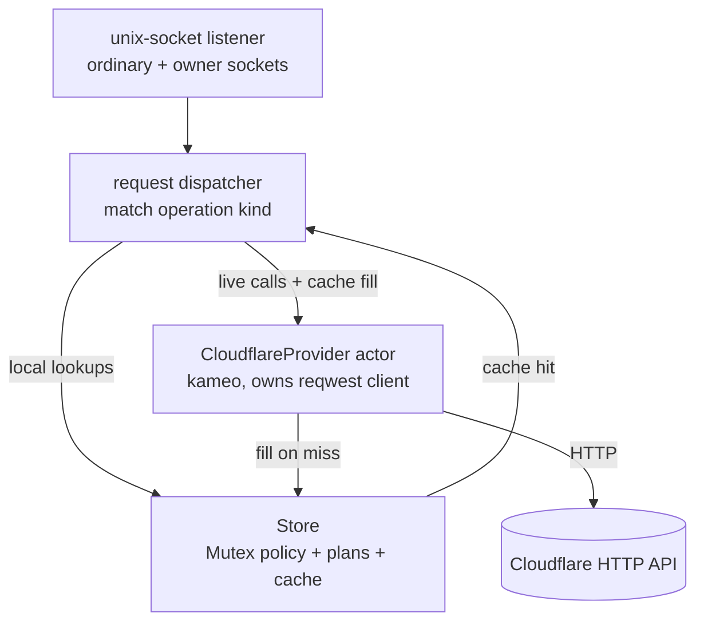
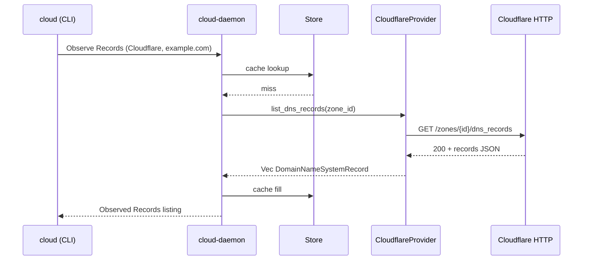

# 196 — Cloud component production design

*Per psyche directive 2026-05-25 + intent records 684-689. The cloud daemon's path from the present runtime-branch scaffold to a deployed Cloudflare-DNS-management daemon on CriomOS, skipping the schema engine for this push.*

## §1 Frame

The psyche directive narrows the cloud component's first production target to **manage my Cloudflare DNS at minimum**. The component is allowed to skip the schema-engine migration entirely for this push; persistent storage is deferred; the cache for last-known-state can be runtime-only because Cloudflare is source of truth.

What the directive supersedes from prior framing:
- Cloud's schema-engine migration is **NOT a blocker for production shipping**. The `signal_channel!`-emitted hand-written contract in `signal-cloud` + `owner-signal-cloud` is the production wire surface for this push. The schema-engine port lands later, on its own schedule, per the schema-per-channel framing in designer/345.
- Cloud's persistent storage (sema-engine policy store + plan store) is **deferred** until state worth preserving emerges. The runtime cache is in-memory only — losing it on restart is acceptable because every Cloudflare resource the daemon knows about is re-queryable.
- The "right actor topology" debate (kameo actors per ARCHITECTURE.md vs the current Mutex-guarded Store in the runtime branch) does NOT need to be resolved before shipping. Both shapes are valid under intent 666; the existing Mutex shape is fine for MVP.

What the directive ADDS:
- Cloudflare auth: env-var-with-password-manager works (FEMOS pattern), but explore safer alternatives during this design pass.
- Cloudflare CLI shell-out preferred if easier than HTTP — explicit choice for ergonomics over purity.
- A signal language for cloud management — already exists in `signal-cloud` + `owner-signal-cloud`; this push exercises it end-to-end against live Cloudflare.

## §2 What's already built (runtime branch state)

The `cloud-domain-criome-runtime` branch in `/git/github.com/LiGoldragon/cloud` (and matching branches in `signal-cloud` + `owner-signal-cloud`) is substantially further along than main. Files on the branch:

```
cloud/
  src/bin/cloud-daemon.rs    ← daemon binary
  src/bin/cloud.rs           ← CLI binary
  src/client.rs              ← unix-socket signal client
  src/daemon.rs              ← daemon main loop
  src/frame_io.rs            ← signal-frame I/O helpers
  src/lib.rs                 ← Store + handle_ordinary/handle_owner + dispatch
  tests/runtime.rs           ← end-to-end runtime tests
  schema/cloud.concept.schema ← (future schema-engine input)
  docs/first-cloudflare-slice.md
  ARCHITECTURE.md
```

`src/lib.rs` is the meat. It defines:

- `DaemonConfiguration { ordinary_socket_path, ordinary_socket_mode, owner_socket_path, owner_socket_mode }` — single NOTA-record config per `nota-config` + AGENTS.md single-argument rule.
- `Store` holding `Mutex<Vec<AccountBinding>>`, `Mutex<Policy>`, `Mutex<Vec<Plan>>`, `Mutex<Vec<PlanIdentifier>>` for approved plans.
- `handle_ordinary_request` + `handle_owner_request` matching on each operation kind.
- `capabilities()` matching the build's compiled providers and returning per-provider state: `Compiled` / `Configured` / `Authorized` / `Unsupported` / `Unauthorized`.
- Proper `RequestUnsupported` with `UnsupportedReason::{ProviderNotCompiled, ProviderNotConfigured, CapabilityNotCompiled, CapabilityNotConfigured, CapabilityUnauthorized}` per intent 342's directive.

What's stubbed:
- `Observation::Records` returns `RecordListing { records: vec![] }` always — no Cloudflare HTTP call.
- `Observation::Redirects` returns `RedirectListing { rules: vec![] }` always.
- `Observation::Zones` returns `self.zones()` which is presumably stubbed.
- No actual credential resolution (no secret-provider integration).
- No live `ApplyPlan` execution path — owner ceremony exists but doesn't talk to Cloudflare.

What the contracts move means: `signal-cloud` ordinary now has just `Observe + Validate` (Plan moved to owner as `PreparePlan`), per the bead `primary-kbmi.4` closure. This IS reflected in the runtime branch's imports.

## §3 The MVP scope under intent 684-689

The shortest path from the current runtime branch to a deployed cloud daemon managing Cloudflare DNS:

```
Step 1: Cloudflare adapter actor (HTTP, scoped token)
        ─ list zones, list records, list redirect rules (read-only)
Step 2: Wire adapter into Store::observe (no more vec![] stubs)
Step 3: Last-known-state cache layer (in-memory keyed by zone)
Step 4: Secret-provider integration (env var → systemd LoadCredential)
Step 5: NixOS user service + agenix secret file
Step 6: Deploy on goldragon; query from the cloud CLI
Step 7: Owner-approved mutation path (PreparePlan + ApplyPlan calls Cloudflare)
```

Steps 1-6 give a useful, read-only daemon. Step 7 unlocks mutation. The split lets the psyche start using the cache + observability before any write authority is wired up.

## §4 Cloudflare auth — the ladder + recommendation

Layered from least-safe to safer. Each layer assumes everything below is rejected.

**(a) Global API Key in env var** — the old `X-Auth-Key` + email pair. Cloudflare has been steering off this for years; it grants account-wide power and has no scoping. **Don't.**

**(b) Scoped API Token in env var** — `CF_API_TOKEN` carrying a Bearer token created from a Dashboard "Edit zone DNS" template. Scoped per-zone, IP-allowlistable, TTL-expirable, revocable independently. **The Cloudflare-recommended pattern.** The single largest jump in safety from the global key.

**(c) systemd `LoadCredential=`** — token written to a root-owned 0400 file; systemd injects via `$CREDENTIALS_DIRECTORY` at service start. Off `/proc/<pid>/environ`, off `ps`, off journald, off forked child processes. The daemon reads the file path once at startup, then mlocks/zeros as wanted.

**(d) sops-nix / agenix** — token encrypted at rest in the Nix repo, decrypted at activation under `/run/secrets`. Pairs naturally with `LoadCredential=` (the decrypted file is what systemd loads). agenix is simpler for a single token; sops-nix scales to bundles. Encrypted in git, reproducible, no manual seeding across reboots.

**(e) 1Password CLI fetch at startup** — service wrapper `op read 'op://Vault/Cloudflare/token'` writes the file before daemon exec. Single source of truth lives in 1Password; rotation happens there. Adds a runtime dependency on `op` + a network round-trip at boot.

**Recommendation for this push**: layer **(b) + (c) + (d) together**.

1. Create one scoped API Token in Cloudflare Dashboard with `Zone:Read` + `Zone:DNS:Edit` for the zones I actually manage.
2. Encrypt it with **agenix** (simpler than sops for a single secret) into the CriomOS-home repo.
3. NixOS user service for `cloud-daemon` declares `LoadCredential=cloudflare_token:/run/agenix/cloudflare-token`.
4. Daemon reads `$CREDENTIALS_DIRECTORY/cloudflare_token` once at startup; threads the token into the Cloudflare HTTP actor; never logs it.

Upgrade path: if the secret count grows, move agenix → sops-nix without changing the daemon. If a rotating source-of-truth is wanted later, layer 1Password via `ExecStartPre=` that writes the file before `LoadCredential=` reads it — the daemon code never changes; it only ever reads a file path.

This avoids the FEMOS pattern's two risks (env vars leak through `/proc`, `ps`, journald; password-manager-at-startup adds a runtime network dependency) while costing ~10 lines of NixOS config.

## §5 CLI shell-out vs Rust crate

The psyche's "use their CLI if it's easier" — the actual answer is **the Rust crate is easier** for this daemon, despite the prompt's lean. Reasoning:

| Concern | Shell out to `flarectl` | `cloudflare` Rust crate |
|---|---|---|
| Auth | Reads `CF_API_TOKEN` env var (back to env-leak risk) | Bearer token threaded as a struct field |
| Async fit | Subprocess spawn-and-wait per operation | Native `async fn` returning typed responses |
| Error surface | Parse stderr text; brittle | `thiserror`-friendly typed errors |
| Typed DNS records | Stringly-typed flag soup | `DnsRecord` struct with `RecordType` enum |
| Deploy artifacts | Adds Go binary to closure | Pure Rust, no extra closure node |
| Debugging the daemon | Hard — adapter is opaque | Direct trace through Rust code |

`flarectl` (or the new `cf` preview CLI) remains useful as a **dev-shell debugging tool** — install it in `nix-shell` for the operator to poke at Cloudflare by hand, but the daemon's adapter actor calls the `cloudflare` crate directly.

The crate: `cloudflare` (`cloudflare/cloudflare-rs`) at v0.14.0 (March 2025), official-but-WIP, actively maintained. `cloudflare::endpoints::dns` covers CRUD for `DnsRecord`. The Cloudflare DNS surface I need is small — ~6 endpoints (`GET /zones`, `GET /zones/{id}/dns_records`, POST/PUT/PATCH/DELETE single record). A hand-roll with `reqwest` + `serde` is a half-day of work if the crate's WIP-ness ever bites; for now use the crate.

## §6 Cache shape — intent 686 + 687

The psyche wants the cloud daemon's cache to be:

- **Almost stateless**: nothing the daemon must persist for correctness.
- **Last-known-accepted-state** of resources the daemon has queried and Cloudflare has returned as valid.
- **Runtime/volatile**: in-memory only; losing it on restart is acceptable.
- **Re-fillable on demand**: every cache miss is one Cloudflare HTTP call.

Cache shape proposal — extend the existing `Store`:

```rust
pub struct Store {
    // Existing policy + plan state (also in-memory for MVP)
    accounts: Mutex<Vec<AccountBinding>>,
    policy: Mutex<owner_signal_cloud::Policy>,
    plans: Mutex<Vec<Plan>>,
    approved_plans: Mutex<Vec<PlanIdentifier>>,

    // NEW: last-known-state cache (runtime-only)
    cache: Mutex<Cache>,
}

#[derive(Debug, Default)]
pub struct Cache {
    zones: HashMap<(Provider, ProviderAccount), CachedZones>,
    records: HashMap<(Provider, ZoneIdentifier), CachedRecords>,
    redirects: HashMap<(Provider, ZoneIdentifier), CachedRedirects>,
}

#[derive(Debug, Clone)]
pub struct CachedZones {
    fetched_at: SystemTime,
    zones: Vec<Zone>,
}
```

Lookup rule: on `Observe::Records(query)`, try cache first; if absent or older than the cache TTL (call it 60 seconds for MVP), fetch from Cloudflare, replace cache entry, return. Apply-plan completion invalidates the affected zone's cache entries so the next read picks up the truth.

The cache is NOT semantically authoritative — it is a latency optimization. Every reply carries `fetched_at` so consumers know how fresh the data is (add a `fetched_at` field to `Zone` and `DomainNameSystemRecord` or wrap as `Cached<T> { fetched_at, value: T }`).

Worth deciding now (open question §11): does the wire contract change to expose freshness, or does the cache stay opaque? Lean: opaque for MVP; revisit when the user notices stale answers.

## §7 Actor topology — current Mutex shape vs ARCHITECTURE.md kameo plan

The runtime branch implements the Store as `Mutex<Vec<...>>` fields and synchronous methods on `Store`. `cloud/ARCHITECTURE.md` §"Actor Shape" specifies "one actor per concern":

- `CloudflareProvider` — Cloudflare HTTP calls
- `PlanStore` — prepared plans and approval state
- `PolicyStore` — account, credential-handle, capability, zone policy
- `RateLimitGate` — provider rate-limit + retry state
- `RemoteOperationTracker` — async provider operations

Per intent 666 ("methods are interactions; no separate trait layer above ordinary Rust methods is needed"), BOTH shapes are valid. The Mutex shape gives synchronous method-call semantics; the kameo shape gives mailbox-isolated method-call semantics. The interaction IS the method call in both cases.

**Recommendation for the production push**: keep the Mutex shape for `PolicyStore` + `PlanStore` (they're just maps; mailbox isolation buys nothing). Make `CloudflareProvider` an actual kameo actor because it owns the HTTP client and its calls are async-with-timeouts that must not block the request listener. `RateLimitGate` can be a per-provider field inside `CloudflareProvider`. `RemoteOperationTracker` is YAGNI for the first push (DNS operations are synchronous to Cloudflare's API — there are no long-running operation handles to track for DNS CRUD).

Concrete topology:



The dispatcher's match on the operation kind decides: pure cache hit → reply from Store; cache miss → ask CloudflareProvider; mutation (owner side) → ask CloudflareProvider after approval lookup in Store. The CloudflareProvider mailbox serialises HTTP calls so rate limiting can be enforced in one place; the Store's mutexes serialise local state writes.

This is the simplest topology consistent with both intent 666 (no Interact-trait formalism) and the read-only-first slice in cloud/docs/first-cloudflare-slice.md.

## §8 The first end-to-end slice — read-only Cloudflare DNS

What the psyche should be able to do once this lands:

```sh
# 1. CLI queries capabilities
cloud '(Observe (Capabilities (None None)))'
# → (Observed (Capabilities (... Cloudflare DomainNameSystemRecords Configured ...)))

# 2. CLI lists zones for Cloudflare
cloud '(Observe (Zones ((Some Cloudflare) None)))'
# → (Observed (Zones ((Zone Cloudflare <account> <zone-id> "example.com") ...)))

# 3. CLI lists DNS records for a zone
cloud '(Observe (Records (Cloudflare "example.com")))'
# → (Observed (Records ((... AddressV4 "1.2.3.4" Direct ...) ...)))

# Repeat (3) within the TTL → cache hit, no HTTP call
# Restart daemon → next call is cache miss → fresh HTTP fetch
```

Sequence flow for case 3 with cache miss:



Cache hit collapses to: `CLI → Dae → Sto → CLI` with no HTTP call.

## §9 Owner-approved mutation slice (post-MVP)

Read-only is step 6 in §3. Mutation is step 7. The owner ceremony is already defined:

```
owner: RegisterAccount {Cloudflare, <name>, <credential-handle>}
       → daemon binds the handle to the resolved token

ordinary or owner: (eventually) Validate {DesiredState}
                                → daemon returns ValidationReport

owner: PreparePlan {DesiredState}
       → daemon diffs desired vs cached/live state
       → returns Plan {id, records_to_create, records_to_update, ...}

owner: ApprovePlan {plan_id}
       → daemon marks plan as approved

owner: ApplyPlan {plan_id}
       → daemon executes the diff against Cloudflare
       → invalidates affected cache entries
       → returns PlanApplied
```

For the MVP push, the ceremony exists in the contracts but the `ApplyPlan` handler should refuse with `RequestRejected { reason: CapabilityUnauthorized }` until live mutation is explicitly wired up. Read-only ships first; mutation arrives as a follow-on commit.

## §10 NixOS deployment

Two CriomOS-home changes wire the daemon onto a host:

```nix
# CriomOS-home/modules/cloud.nix (new)
{ config, lib, pkgs, ... }:
{
  age.secrets.cloudflare-token = {
    file = ../secrets/cloudflare-token.age;
    owner = "li";
    mode  = "0400";
  };

  systemd.user.services.cloud-daemon = {
    description = "cloud component daemon (Persona / Criome)";
    serviceConfig = {
      ExecStart = "${pkgs.cloud}/bin/cloud-daemon ${config.persona.cloud.configPath}";
      LoadCredential = "cloudflare_token:${config.age.secrets.cloudflare-token.path}";
      Restart = "on-failure";
      RestartSec = "5s";
    };
    wantedBy = [ "default.target" ];
  };
}
```

The daemon's config file is itself a single NOTA file per `nota-config`:

```
(DaemonConfiguration
  [/run/user/1001/cloud/ordinary.sock]
  0o600
  [/run/user/1001/cloud/owner.sock]
  0o600)
```

The daemon reads `$CREDENTIALS_DIRECTORY/cloudflare_token` at startup before binding sockets. If the credential is missing, the daemon still starts and binds sockets, but reports `CapabilityState::Unauthorized` for Cloudflare — so a `cloud '(Observe (Capabilities (None None)))'` call to a tokenless daemon tells the operator what's wrong.

Secret rotation: regenerate the token in Cloudflare Dashboard → `agenix -e cloudflare-token.age` → commit → `home-manager switch` → systemd reloads the daemon → new token in effect. No daemon code touches a string literal.

## §11 The runtime-branch → main → deploy path

Concrete sequence to get from "runtime branch with stubs" to "deployed daemon managing Cloudflare DNS":

1. **Rebase runtime branch** onto current main (small — last touch 2026-05-25 19:36). Worktree shape per intent 515: designer feature branches in `~/wt`. Operator owns main + rebase.
2. **Implement `CloudflareProvider` actor** in `cloud/src/cloudflare.rs`:
   - kameo actor with `reqwest::Client`.
   - Token loaded from `CREDENTIALS_DIRECTORY/cloudflare_token` (or env var fallback).
   - Methods: `list_zones()`, `list_dns_records(zone_id)`, `list_redirect_rules(zone_id)`.
   - Uses the `cloudflare` crate's typed endpoints.
3. **Extend `Store` with `Cache`** per §6 — `HashMap` keyed by `(Provider, ZoneIdentifier)`, with `SystemTime` freshness.
4. **Wire CloudflareProvider into `Store::observe`** — replace the `vec![]` stubs in `Records` / `Redirects` / `Zones` with cache-lookup-then-fetch flow.
5. **Add `CloudflareProvider` ActorRef to daemon main** — `cloud-daemon.rs` spawns the actor, passes the handle to Store.
6. **NixOS module + agenix secret** as in §10. PR on CriomOS-home.
7. **Smoke-test on goldragon** — `cloud '(Observe (Zones ((Some Cloudflare) None)))'`; check journalctl for the daemon's startup log.
8. **Land owner mutation in a follow-on commit** — `ApplyPlan` calls into CloudflareProvider's create/update/delete methods; invalidates cache entries.

Steps 1-7 are the production-shippable slice. Step 8 unlocks management.

## §12 Gaps + open questions for the psyche

1. **Cache TTL choice**. 60-second TTL is a guess. Cloudflare DNS records change rarely (manual edits); 5 minutes might be more appropriate. Lean: 60s for MVP; revisit when usage shows a pattern. **Question**: any preference?

2. **Cache freshness in the wire contract**. Should reply records carry `fetched_at`, or should the cache stay opaque to consumers? Opaque means consumers can't tell stale-from-cache apart from fresh-from-Cloudflare. Lean: opaque for MVP; add `Cached<T>` wrapper only if it becomes a problem. **Question**: confirm?

3. **Read-after-write coherence**. After `ApplyPlan` succeeds, the daemon invalidates the affected zone's cache. But Cloudflare's edge takes seconds-to-minutes to propagate. Do we want the daemon to refuse reads-for-N-seconds after a write, or report stale and let the consumer judge? Lean: invalidate + let the next read pick up whatever Cloudflare returns; the operator's already aware they just changed something. **Question**: agree?

4. **Multiple Cloudflare accounts**. The contracts support `ProviderAccount` keying; the runtime branch stores `Vec<AccountBinding>`. For MVP, is one account enough, or should the first push handle 2+ (personal + work, say)? Lean: build for one but don't hard-code — contracts already support N. **Question**: how many accounts on day one?

5. **Redirect rules — Rulesets API or Page Rules?** The Cloudflare Rulesets API is current; Page Rules is legacy (sunset path). docs/first-cloudflare-slice.md explicitly says "Do not implement Page Rules as a first-class mutation surface. They are legacy import/read-only material." Confirming this is still the intent — MVP reads-only via Rulesets API; legacy Page Rules surface skipped. **Question**: still right?

6. **Token scope on creation**. The recommendation is to scope the token to `Zone:Read` + `Zone:DNS:Edit` for specific zones. But the daemon also wants to know about redirects (Rulesets) and eventually settings. **Question**: scope the first token broadly (all zones + DNS + Rulesets) or narrowly (just the zones you actively manage today)? Lean: broadly, since rotation is cheap.

7. **CLI binary naming**. The thin CLI per AGENTS.md is `cloud`; the daemon is `cloud-daemon`. Already correct in the branch. **No action**.

8. **The schema-engine port — when?** Per designer/345's schema-per-channel framing, the cloud crate eventually gets three schemas: `signal-cloud/cloud.schema` (wire ordinary), `signal-cloud/owner-cloud.schema` (wire owner), `cloud/cloud-cache.schema` (storage — when persistence lands), plus maybe `cloud/cloud-policy.schema` and `cloud/cloud-plans.schema`. This is post-MVP work; **no blocker for shipping**.

## §13 What's NOT in this design

- **`domain-criome`** — sibling daemon per bead `primary-kbmi.2`. Separate scope.
- **Other providers** (Google Cloud DNS, Hetzner Cloud) — gated by `Provider::*` already, build-time opt-in per intent 295/342. Add as future work; not blocking.
- **Hosting / cloud-compute mgmt** (Hetzner servers, networks) — per ARCHITECTURE.md is in scope eventually, but DNS is the explicit first target per intent 685.
- **Persistent policy / plan store via sema-engine** — deferred per intent 687 ("persistent storage deferred until state worth preserving emerges"). The runtime cache is the trigger to revisit, not the daemon's policy store: when the psyche says "I don't want to lose my account bindings on restart", that's when sema-engine integration lands.

## §14 References

- Intent records 281-284, 294-296, 311, 325, 342 (prior cloud-topic intent — established triad shape + owner/ordinary split)
- Intent records **684-689** (this turn's capture — production push + Cloudflare-first + cache discipline + auth ladder)
- `/git/github.com/LiGoldragon/cloud/ARCHITECTURE.md` — triad + actor shape + first implementation slice
- `/git/github.com/LiGoldragon/cloud/docs/first-cloudflare-slice.md` — 7-step read-first plan
- `/git/github.com/LiGoldragon/signal-cloud/src/lib.rs` — ordinary wire contract (Observe + Validate)
- `/git/github.com/LiGoldragon/owner-signal-cloud/src/lib.rs` — owner wire contract (RegisterAccount, RotateCredential, SetPolicy, ApprovePlan, ApplyPlan, RetireAccount)
- `cloud-domain-criome-runtime` branch — current scaffold (cloud + signal-cloud + owner-signal-cloud)
- Bead `primary-kbmi` + children `.1` (cloud daemon runtime) + `.2` (domain-criome daemon runtime)
- `reports/designer/345-schemas-as-channel-contracts-2026-05-25.md` — schema-per-channel framing (future-state for cloud's schema-engine port; not blocking this push)
- Cloudflare API Tokens: https://blog.cloudflare.com/api-tokens-general-availability/
- `cloudflare/cloudflare-rs` v0.14.0 (March 2025) — typed Rust client
- `flarectl` (Go CLI from `cloudflare-go`) — dev-shell debugging tool
- `agenix` + systemd `LoadCredential=` — auth wiring on NixOS
