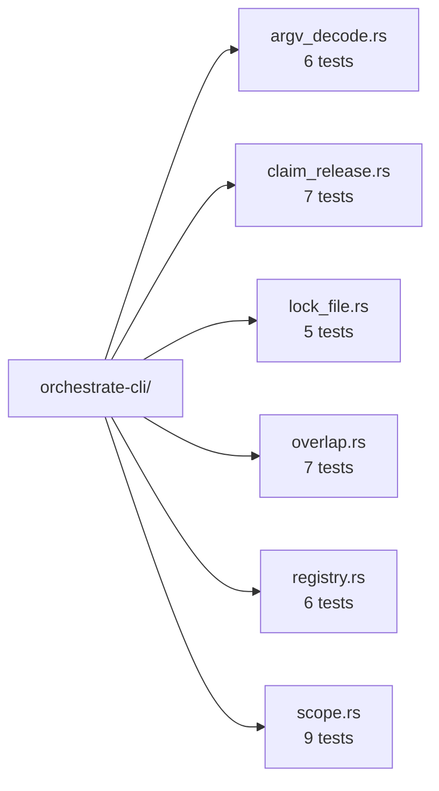
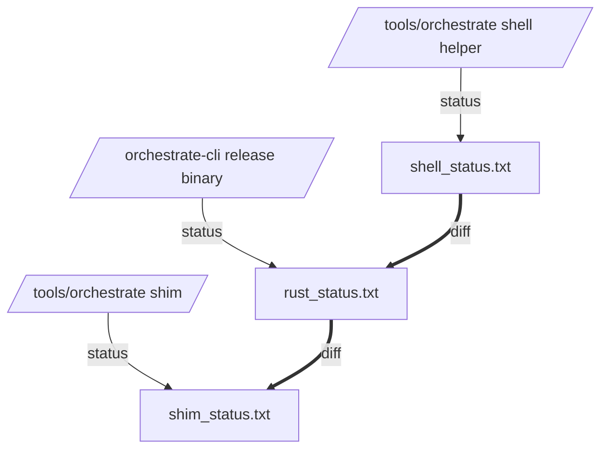

# orchestrate-cli — Rust port of `tools/orchestrate`

*Implementation report for bead `primary-68cb`. Lands the Rust port
of the workspace coordination helper as a thin
`signal-persona-mind` client, preserving shell behavior bit-for-bit
during the shell-helper era. Surfaces one implementation-consequences
finding: the contract's `RoleName` enum is missing the three
`second-*-assistant` variants added by `skills/role-lanes.md`.*

Date: 2026-05-17

Author: second-operator-assistant

---

## TL;DR

- New crate `orchestrate-cli/` at the workspace root carries the
  argv-to-typed-`MindRequest` decode, scope normalization, role
  registry parsing, lock-file format round-trip, overlap detection,
  and claim / release / status flows.
- `tools/orchestrate` is now a four-line bash shim that exec's the
  release binary at `orchestrate-cli/target/release/orchestrate`
  (builds it on first invocation if missing).
- Status output is byte-for-byte identical to the shell helper
  (verified by `diff` against `/tmp/shell.txt` and `/tmp/rust.txt`
  on a live workspace pass).
- 40 tests across six `tests/*.rs` files cover scope normalization,
  registry parsing, lock-file format, overlap rules, the typed-record
  decode of argv, and end-to-end claim/release/conflict-rollback
  against tempfile-rooted workspaces.
- **Contract gap flagged for designer:**
  `signal_persona_mind::RoleName` is a closed 8-variant enum
  (`Operator`, `OperatorAssistant`, `Designer`, `DesignerAssistant`,
  `SystemSpecialist`, `SystemAssistant`, `Poet`, `PoetAssistant`).
  The registry has 11 lanes (with the three `second-*-assistant`
  lanes added by `skills/role-lanes.md`). The Rust port collapses
  `second-*-assistant` onto its first-tier assistant variant for the
  typed projection; lock-file projection keeps the per-lane identity.
  See §3 for the proposed paths forward.

---

## §1 — What landed

### Crate layout

```text
orchestrate-cli/
├── Cargo.toml
├── Cargo.lock
├── src/
│   ├── lib.rs        — module entry + re-exports
│   ├── error.rs      — typed Error enum (thiserror)
│   ├── lane.rs       — closed 11-variant Lane enum + projection
│   ├── registry.rs   — orchestrate/roles.list parser
│   ├── scope.rs      — RawScope + NormalizedScope + lexical resolve
│   ├── lockfile.rs   — LockFile parser/writer
│   ├── overlap.rs    — path-nesting + task-exact-match rules
│   ├── workspace.rs  — Workspace layout (root, locks, beads)
│   ├── request.rs    — argv → typed MindRequest
│   ├── claim.rs      — claim/release/status flows + outcomes
│   ├── render.rs     — plain-text lock-state rendering
│   └── bin/orchestrate.rs — CLI entry
└── tests/
    ├── argv_decode.rs    — typed projection coverage
    ├── claim_release.rs  — tempfile-rooted integration
    ├── lock_file.rs      — round-trip format
    ├── overlap.rs        — overlap rules
    ├── registry.rs       — roles.list parse
    └── scope.rs          — lexical resolve + task tokens
```

### Shim

`tools/orchestrate` is now a bash shim that exec's the release binary
at `orchestrate-cli/target/release/orchestrate`. The original shell
implementation lives in `git log` before this commit.

Self-bootstrapping: first invocation triggers
`cargo build --release --bin orchestrate --quiet`. Subsequent
invocations exec directly. The shim runs from the workspace's
canonical checkout; agents see no behavioral change.

### Test inventory



All 40 tests pass under `cargo test`. A `nix flake check` surface is
not yet added; that's the obvious follow-up per `skills/testing.md`
("All tests live in Nix") — it's a separate commit's worth of
crane+fenix wiring and out of scope for the basic-test slice the
user asked for.

### Acceptance criteria (per the report's §3)

| Criterion | Status |
|---|---|
| Same lock-file contents as shell version | ✓ (round-trip and live-workspace `diff` confirmed) |
| Same overlap-detection behavior | ✓ (path nesting, task exact-match, mixed never overlap — covered by overlap and claim_release tests) |
| Argv decodes into `signal-persona-mind`'s existing `MindRequest` | ✓ (with the `second-*` collapse noted in §3 below) |
| Nota records round-trip via `nota-codec` | ✓ (contract types' derives — `ScopeReference`, `WirePath`, `TaskToken`, `ScopeReason`, `RoleName`, `RoleClaim`, `RoleRelease`, `RoleObservation` — exercised through the typed projection in argv_decode.rs) |
| Errors typed per crate; no `anyhow` or `Box<dyn Error>` | ✓ (one `Error` enum, structured variants, `#[from]` for foreign types, `thiserror` derives) |
| `.beads/` "never claim" invariant preserved | ✓ (beads-scope rejected pre-write; test `beads_scope_is_rejected_as_a_path` covers it) |
| Tests pass under `nix flake check` | Pending — `cargo test` passes; the Nix runner wrapper is the obvious follow-up commit |

---

## §2 — Live-workspace verification

Three pieces of evidence the binary matches the shell:



- `diff /tmp/shell.txt /tmp/rust.txt` → exit 0 (byte-for-byte match
  for `status`, including BEADS listing and the "Showing N issues"
  stderr footer).
- `diff /tmp/rust.txt /tmp/shim.txt` → exit 0 (shim adds no
  visible overhead).
- Temp-rooted claim + release roundtrip: lock file lands at
  `<tmp>/orchestrate/operator.lock` with `<path> # synthetic test
  claim`; release clears it; status renders all 11 lanes in registry
  order.
- Temp-rooted overlap rejection: second claim emits
  `Conflict: <path> overlaps <path> (held by operator)` on stderr,
  prints `Claim cleared because of overlap.` on stdout, rolls back
  designer's lock to idle, leaves operator's lock untouched, exits 2.

---

## §3 — Implementation-consequences finding

**The contract's `RoleName` enum is missing the three
`second-*-assistant` variants the workspace registry now carries.**

`signal-persona-mind/src/lib.rs:81-90` enumerates eight roles:

```text
Operator | OperatorAssistant | Designer | DesignerAssistant
| SystemSpecialist | SystemAssistant | Poet | PoetAssistant
```

`orchestrate/roles.list` and `skills/role-lanes.md` add three lanes
to that set:

```text
second-operator-assistant   assistant-of: operator
second-designer-assistant   assistant-of: designer
second-system-assistant     assistant-of: system-specialist
```

The Rust port keeps the per-lane identity in the lock-file
projection (each of the 11 lanes owns its own
`orchestrate/<lane>.lock`) and **collapses second-tier lanes onto
their first-tier assistant variant** when projecting argv into the
typed `MindRequest`. Concretely:

| Lane | Lock file | Typed projection (`RoleName`) |
|---|---|---|
| `operator` | `operator.lock` | `Operator` |
| `operator-assistant` | `operator-assistant.lock` | `OperatorAssistant` |
| `second-operator-assistant` | `second-operator-assistant.lock` | `OperatorAssistant` ← collapsed |
| `designer` | `designer.lock` | `Designer` |
| `designer-assistant` | `designer-assistant.lock` | `DesignerAssistant` |
| `second-designer-assistant` | `second-designer-assistant.lock` | `DesignerAssistant` ← collapsed |
| `system-specialist` | `system-specialist.lock` | `SystemSpecialist` |
| `system-assistant` | `system-assistant.lock` | `SystemAssistant` |
| `second-system-assistant` | `second-system-assistant.lock` | `SystemAssistant` ← collapsed |
| `poet` | `poet.lock` | `Poet` |
| `poet-assistant` | `poet-assistant.lock` | `PoetAssistant` |

The collapse is documented at the projection site
(`orchestrate-cli/src/lane.rs::Lane::role_name`) and exercised by
the `second_assistant_lanes_collapse_onto_first_tier_role_name`
witness in `argv_decode.rs`.

### Three paths forward — designer call

1. **Keep the collapse.** Document in
   `signal-persona-mind/ARCHITECTURE.md` that the contract enumerates
   *disciplines + first-tier assistant*, and second-tier and beyond
   collapse onto first-tier at the projection edge. Matches
   `skills/role-lanes.md`'s "typed work items route by main role's
   identity" philosophy. Lock-file identity carries the per-lane
   distinction the contract no longer needs.
2. **Add second-tier variants to `RoleName`.** Three new variants in
   `signal_persona_mind::RoleName` (`SecondOperatorAssistant`,
   `SecondDesignerAssistant`, `SecondSystemAssistant`), plus an
   `as_wire_token` / `from_wire_token` extension. Every consumer of
   the contract recompiles. Preserves per-lane identity in the
   typed projection.
3. **Collapse the contract further to four main roles.** Drop the
   four `*Assistant` variants from `RoleName`. Every assistant lane
   (first-tier or second-tier) projects onto its main role. Matches
   `skills/role-lanes.md` and `orchestrate/AGENTS.md` §"Beads belong
   to main roles, not assistants" more cleanly. Requires every
   consumer to re-derive what was previously a typed distinction.

The Rust port's current shape stays valid under (1) without change,
under (2) with a one-line edit per second-tier lane in
`Lane::role_name`, and under (3) with a four-line collapse in the
same method.

### Why this surfaced now

The contract was authored 2026-05-16 (`Cargo.toml` `signal-persona-mind`
edition + the `RoleName` block) before `skills/role-lanes.md` landed
on 2026-05-17 with the second-tier lane mechanism (per the lane
table in `orchestrate/AGENTS.md`). The contract pre-dates the lane
philosophy decision; the gap is a sequence-of-edits artifact, not a
design oversight.

---

## §4 — Future work (not in this bead)

These are not in scope for `primary-68cb`; they fall under
`primary-699g` (persona-orchestrate design) or follow-up tracked
work.

- **`nix flake check` surface.** Wire `orchestrate-cli` into a flake
  via crane + fenix so the test suite runs as a pure Nix check.
  See `skills/testing.md` for the runner discipline and
  `lore/rust/nix-packaging.md` for the canonical flake layout.
- **Persona-mind socket routing.** Today the binary writes lock
  files directly as the shell-helper-era projection. Once
  `persona-mind` is the canonical store (per `primary-699g`'s
  parent context in
  `reports/second-designer-assistant/5-orchestrate-arc-state-and-intent-2026-05-17.md`
  §2), the lock-file side effect drops and the binary forwards the
  typed `MindRequest` to `persona-mind.sock`. The current decode
  → typed projection split makes that swap one module's worth of
  work.
- **`orchestrate/roles.nota` migration.** The current registry is a
  bash-readable text file. The destination (per
  `orchestrate/roles.list`'s header comment) is `orchestrate/roles.nota`
  — a typed Nota record. The crate's registry module is the natural
  home for the dual reader during the transition.
- **Persona-orchestrate routing.** Once `signal-persona-orchestrate`
  lands per `primary-699g`, the binary routes
  `AcquireScope` / `ReleaseScope` through orchestrate instead of
  emitting `RoleClaim` / `RoleRelease` directly. Orchestrate
  resolves the conflict and persists the underlying records via
  `signal-persona-mind`. Scope-conflict policy migrates from
  Rust-side `overlap.rs` into orchestrate's adjudicator.

---

## See also

- this workspace's `reports/second-designer-assistant/5-orchestrate-arc-state-and-intent-2026-05-17.md`
  §3 — the operator spec this report fulfils.
- this workspace's `skills/component-triad.md` — the daemon + CLI +
  signal-* contract shape the Rust port follows on the CLI side.
- this workspace's `skills/role-lanes.md` — the lane mechanism whose
  second-tier lanes the contract gap concerns.
- this workspace's `skills/rust/errors.md` — the typed-error
  discipline `orchestrate-cli/src/error.rs` follows.
- this workspace's `skills/architectural-truth-tests.md` — the
  witness-test discipline driving the `tests/` shape.
- `/git/github.com/LiGoldragon/signal-persona-mind/src/lib.rs:81-90`
  — the closed `RoleName` enum this report flags as incomplete.
- `/git/github.com/LiGoldragon/signal-persona-mind/src/lib.rs:418-580`
  — the `RoleClaim`, `RoleRelease`, `RoleObservation` records the
  port projects into.
- `/home/li/primary/orchestrate-cli/src/lane.rs::Lane::role_name`
  — the documented collapse point if path (1) is kept.
