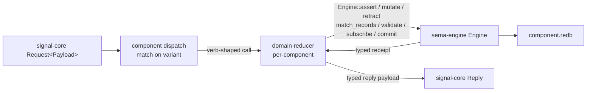

# signal-core ↔ sema-engine fit — audit per brief 118

*Code-grounded audit answering "do `signal-core` and `sema-engine`
play well together today?" Verdict: **partial fit, right shape**.
The six wire verbs map onto verb-shaped engine methods one-for-one;
the kernel split is clean. Three real gaps require adapter code in
every component: write-`Validate` is not a first-class engine call;
cross-table atomic commits go through the kernel escape hatch; and
the contract-to-reducer dispatch boilerplate repeats per daemon.
Recommendation: keep sema-engine's shape; add three thin helper
APIs; emit one boilerplate-eliminating macro extension.*

Date: 2026-05-17

Author: second-operator-assistant

---

## §0 — TL;DR

Per brief 118 §6, this report names:

1. **Verdict** — partial fit. The shape is right; three named gaps
   require glue today.
2. **Verb → engine API table** — §1. All six verbs are
   verb-shaped methods on `Engine`; structural atomicity rides on
   `CommitRequest`.
3. **Boilerplate list** — §3. Per-daemon match-on-variant dispatch,
   stringified actor-call errors at the kernel boundary, locally
   re-implemented write-validation.
4. **Recommendation** — §4. Keep sema-engine as the kernel; add
   `Engine::validate_write`, `Engine::commit_multi`, and
   `Engine::unsubscribe`; emit a `signal_channel!`-driven
   dispatcher trait. Do not reshape the kernel into a full Signal
   operation executor — the contract's domain validation, actor
   topology, and socket policy belong in components.
5. **Witness-test plan** — §5. Most brief-named witnesses are
   not yet wired; persona-mind has the first two; the rest land
   alongside the helper APIs.



The arrows that work cleanly today: every `signal-core` verb has a
verb-shaped engine method; the engine's commit log carries each
operation's verb; subscriptions emit typed deltas; receipts name
the verb that produced them.

The arrows that need adapter code today: the **match on variant**
edge (boilerplate per daemon), the **typed receipt → reply
payload** edge (each daemon shapes its own typed reply), and the
**reducer-side validate** path (sema-engine cannot dry-run a write
through component reducer logic).

---

## §1 — Verb → sema-engine API table

Concrete mapping at `/git/github.com/LiGoldragon/sema-engine/src/engine.rs`.

| `SignalVerb` | sema-engine call | Receipt | Touches commit log | Emits subscription delta |
|---|---|---|---|---|
| `Assert` | `Engine::assert(Assertion<RecordValue>)` (engine.rs:67) | `MutationReceipt` (verb=Assert) | yes — `CommitLogOperation::new(SignalVerb::Assert, …)` | yes (`DeltaKind::Assert`) |
| `Mutate` | `Engine::mutate(Mutation<RecordValue>)` (engine.rs:130) | `MutationReceipt` (verb=Mutate) | yes | yes (`DeltaKind::Mutate`) |
| `Retract` | `Engine::retract(Retraction<RecordValue>)` (engine.rs:193) | `MutationReceipt` (verb=Retract) | yes | yes (`DeltaKind::Retract`) |
| `Match` | `Engine::match_records(QueryPlan<RecordValue>)` (engine.rs:404) | `QuerySnapshot` (verb=Match) | no | no |
| `Subscribe` | `Engine::subscribe(QueryPlan, Arc<dyn SubscriptionSink>)` (engine.rs:514) | `SubscriptionReceipt` carrying `InitialSnapshot` | no (subscription registration persists separately) | yes (initial + post-commit deltas) |
| `Validate` | `Engine::validate(QueryPlan<RecordValue>)` (engine.rs:466) | `ValidationReceipt` (verb=Validate) | no | no |
| *(structural atomicity)* | `Engine::commit(CommitRequest<RecordValue>)` (engine.rs:259) | `CommitReceipt` carrying `operation_count` | yes — one `CommitLogEntry` with `NonEmpty<CommitLogOperation>` | yes — one delta per `CommittedEffect` |

The engine internally stamps the verb on every commit-log entry and
mutation receipt (engine.rs:99, 162, 222, 300, 323, 343). The
six-root spine round-trips end-to-end: the wire-level
`Operation<Payload>::verb` is carried into the engine; the engine
writes the verb into the durable log; the receipt carries the verb
back; the subscription delta's `DeltaKind` converts to
`SignalVerb` via `DeltaKind::verb` (subscribe.rs:218).

---

## §2 — Answers to the brief's seven questions

### Q1. Does `signal_channel!` emit enough metadata for sema-engine?

**Partial.** The macro emits:

- per-variant `signal_verb()` (the `RequestPayload` trait
  implementation; signal-core round-trip tests assert
  `operation.verb == request.signal_verb()`);
- the typed request / reply / event enums and their NOTA codecs;
- `Frame` aliases (`MindFrame` etc.) plus typed frame bodies;
- stream relation witnesses (`opened_stream()`, `closed_stream()`,
  `stream_kind()`) when streams are declared.

What it does **not** emit:

- a per-variant dispatcher trait the daemon can implement (so each
  daemon writes its own match-on-variant — see §3.A);
- a metadata reflection API (e.g. "give me all variants tagged
  `Mutate`, or all variants that open a specific stream") that
  would let consumers route by capability without enumerating
  variants by hand;
- the ordinary-vs-owner contract distinction — a contract crate is
  either ordinary or owner by repo identity, not by per-variant
  flag. (This is correct per the triad's "permission as shape, not
  as runtime gate" stance — the wrong contract simply cannot
  express the wrong frames.)

The missing dispatcher trait is the main usability gap. The
metadata is there at runtime; consumers just rewrite the
boilerplate that mechanically maps it onto handler methods.

### Q2. Does sema-engine expose verb-shaped operations?

**Yes.** Six methods, one per `SignalVerb` root, plus
`Engine::commit` for structural multi-op atomicity. See §1.

The engine names them with workspace-shaped nouns (`Assertion`,
`Mutation`, `Retraction`, `QueryPlan`, `CommitRequest`) — full
English words; no `Op` or `Req` abbreviation. The wrapper types
(`Assertion`, etc.) bind a `TableReference<RecordValue>` to a
record, which keeps the type system carrying the table identity.

### Q3. Where does `Validate` live?

**Read-side only.** `Engine::validate` (engine.rs:466) is
implemented as `match_records` plus receipt wrapping — it dry-runs
a query without mutating storage. It does **not** dry-run a write
through reducer logic.

What `Validate` cannot do today:

- check that a candidate `Assert` would not collide with an
  existing key (the `DuplicateAssertKey` check fires only inside
  `Engine::assert` / `Engine::commit`, after the engine has
  decided to write);
- check that a candidate `Mutate` would find an existing record
  (the `RecordNotFound` check is the same shape);
- run component-supplied precondition checks (the engine knows
  nothing about component-level invariants — those run in the
  reducer);
- validate a multi-operation `CommitRequest` end-to-end.

Concrete consequence: a `Validate (Mutate record)` request that
the wire kernel accepts has no engine-side execution path. The
daemon would have to write a parallel "dry-run" implementation of
each reducer to satisfy the contract's `Validate` verb on writes.
That parallel implementation is the highest drift risk in the
brief's gap list.

This is the most consequential gap. §4 names a thin helper API
that closes it without reshaping the engine.

### Q4. Where do subscriptions come from?

**Engine-native, with two real gaps.**

What works (engine.rs:514, subscribe.rs):

- initial state delivered as `SubscriptionEvent::InitialSnapshot`
  carrying a `QuerySnapshot`;
- post-commit deltas delivered as
  `SubscriptionEvent::Delta<RecordValue>` carrying
  `DeltaKind::{Assert, Mutate, Retract}`;
- typed `SubscriptionHandle` carrying id + table + snapshot;
- per-query filter (`QueryFilter::accepts(key)`) so a subscription
  ignores deltas on other rows;
- detached or inline delivery mode (`SubscriptionDeliveryMode`);
- durable registration persisted to a known engine slot
  (`SUBSCRIPTIONS` table, engine.rs:625) so registrations survive
  process restart.

Real gaps:

- **No `Engine::unsubscribe(SubscriptionHandle)`.** The wire-side
  `Subscribe` opens a stream; the wire-side
  `Retract SubscriptionRetraction` closes it (per persona-mind's
  signal-channel grammar). The engine has no symmetric close
  method. Each consumer manages this externally (e.g.
  persona-mind's `SubscriptionSupervisor` decides when to stop
  delivering); the engine's `SubscriptionRegistry` keeps growing
  for the daemon's lifetime.
- **No flow-control protocol.** `SubscriptionSink::deliver`
  returns `Result<(), SinkError>`; if the sink is slow, the engine
  spawns a detached thread per delta (subscribe.rs:415). There is
  no backpressure signal back to the engine; no demand-driven
  delivery; no bounded buffer per subscription.

The post-commit delivery itself is not polled. The engine calls
`SubscriptionRegistry::deliver_delta` synchronously inside the
write transaction's downstream (engine.rs:114, 177, 240, 387). The
push-not-pull discipline is satisfied at the engine layer; the
gaps are about closing streams cleanly and bounding memory.

### Q5. What is the transaction boundary?

**Per-table, structural atomicity.**

- A single-op `Assert` / `Mutate` / `Retract` commits in one redb
  write transaction, writing one `CommitLogEntry`.
- A multi-op `Engine::commit(CommitRequest)` commits in one redb
  write transaction, writing one `CommitLogEntry` whose
  `NonEmpty<CommitLogOperation>` carries every op's verb.
- The `CommitRequest` is **single-table** by shape: it takes one
  `TableReference<RecordValue>` and the per-op `WriteOperation`
  values share that record type. Multi-table atomic commits go
  through `Engine::storage_kernel()` and a hand-written
  `storage.write(|transaction| ...)` closure — the named escape
  hatch.
- Domain side effects (PTY spawn, network IO, subprocess
  invocation) are **not** in the transaction. Per sema-engine ARCH
  §"Constraints": *"Component domain validation happens before
  calling Engine. Component actors own ordering, supervision,
  sockets, and delivery."* — the daemon sequences side effects
  around the typed commit; the durable record names the *intent*,
  not the side-effect's success.

The single-table shape of `CommitRequest` is the second
consequential gap. Concrete: a `RoleClaim` Mutate that updates
both the `claims` table and appends to the `activities` table
needs cross-table atomicity. Today the consumer either does two
separate commits (atomicity lost) or escapes through
`storage_kernel()` (typed engine API bypassed). §4 names the
`Engine::commit_multi` helper that closes this.

### Q6. Are owner-signal operations first-class?

**Not yet, by design.** The engine is contract-blind — `assert`,
`mutate`, etc. don't carry caller identity; the table + verb +
record is the entire input. The contract / socket layer enforces
the boundary (per `skills/component-triad.md` invariant 5 and
`reports/designer-assistant/116` §13).

The clean shape this enables: ordinary and owner contracts call
the *same* engine methods on the *same* tables; the dispatch in
the daemon (one actor per contract surface) decides which contract
is allowed to issue which write. The engine doesn't grow a parallel
write API per permission class.

The gap is that no `owner-signal-*` crates exist yet to exercise
this shape. Once `owner-signal-persona-orchestrate` lands, the
witness `owner-signal-request-uses-same-reducer-through-owner-socket`
becomes implementable as a pure dispatch-routing test.

### Q7. Can errors stay typed from wire to state and back?

**Mostly. Two stringly seams.**

Typed all the way:

- engine errors (`sema_engine::Error`) are a structured enum:
  `TableNotRegistered { table }`, `RecordNotFound { table, key }`,
  `DuplicateAssertKey { table, key }`, `DuplicateWriteKey`,
  `EmptyCommit { table }`, `UnsupportedReadPlan { operator }`,
  `SubscriptionRegistryPoisoned`, `SubscriptionSink { message }`;
- `signal-core::Reply` is a typed sum (`Accepted { outcome,
  per_operation }` / `Rejected { reason }`) with per-op
  `SubReply::{Ok, Invalidated, Failed, Skipped}`;
- per-channel reply payloads (`MindReply::*`) are typed records.

Stringly seams:

- `SinkError { message: String }` (subscribe.rs:228) — when a
  subscription delivery fails, the engine loses the typed cause
  and carries a string back to the caller.
- Consumer actor-call boundaries — persona-mind's dispatch path
  (`persona-mind/src/actors/dispatch.rs:130-200`) maps every
  Kameo `SendError` into
  `crate::Error::ActorCall(error.to_string())`. The actor's typed
  reply error is preserved through `SendError::HandlerError`, but
  the *transport* error is flattened to a string. The dispatch
  layer then maps the actor-call error to
  `PersistenceRejection::reply(error)` which produces a typed
  `MindReply::Rejection` — so the wire reply is typed again, just
  with the inner cause as a string.

Both seams are component-side, not engine-side. The engine's
typed-error surface is honest.

---

## §3 — Boilerplate / adapter code repeated in components

Three patterns repeat across triad daemons.

### §3.A — Match-on-variant dispatch

Every daemon writes a `match request.payload() { Variant(_) => ... }`
to route a typed payload to the right handler. The match
re-enumerates information the macro already encodes (the variant
exists; its verb is declared).

Worked example: `persona-mind/src/actors/dispatch.rs:55-119` has
the full match across all `MindRequest` variants — 26 arms, each
delegating to a `self.<method>(envelope, trace)` call that itself
unpacks the typed payload. The same shape repeats in every other
component daemon that consumes `signal-core` frames.

What a macro extension could emit: a `MindDispatcher` trait with
one method per request variant
(`async fn handle_submit_thought(&self, payload: SubmitThought)
-> MindReply` etc.). The dispatch loop becomes
`request.dispatch(&self).await`. Consumers implement the trait;
the macro emits the routing.

### §3.B — Engine-call-to-reply shaping

After the engine returns a typed receipt (`MutationReceipt`,
`QuerySnapshot`, `SubscriptionReceipt`, `CommitReceipt`,
`ValidationReceipt`), the daemon must shape it into a
contract-typed reply payload. Today this happens in each
component's reply-shaper code; the mapping is mechanical (the
receipt carries the verb, table, key, snapshot; the reply carries
some subset of those plus domain-specific fields).

Worked example: `persona-mind/src/actors/store/graph.rs` returns
the kernel reply from a per-message handler; the
`PipelineReply::new(reply, trace)` wraps it; the `ReplyShaper`
actor maps it onto `MindReply::*`. Each component re-implements
this collapse.

This is unavoidable when the reply payload carries domain content
beyond the engine receipt — but for the basic shape (mutation
succeeded; here's the snapshot/key/verb), a contract-emitted
default could absorb the common case.

### §3.C — Reducer-side write validation

Because `Engine::validate` only dry-runs reads (Q3), each
component re-implements the engine's own duplicate-key /
record-found checks in its reducer when it wants to support
`Validate` on write payloads. The component reducer thus carries:

- the same `if storage.get(key).is_some() { reject as duplicate }`
  shape as `Engine::assert`;
- the same `if storage.get(key).is_none() { reject as missing }`
  shape as `Engine::mutate`;
- plus the component's own preconditions (e.g. persona-mind's
  `SubmitRelation` endpoint validator that rejects relations
  pointing at missing thought IDs — this is genuinely component
  logic, not engine work).

Today persona-mind hasn't wired `Validate` for its graph records,
so the boilerplate is latent. The moment any contract grows
`Validate (Mutate X)` semantics, this duplication lands as drift.

---

## §4 — Recommendation

**Keep sema-engine's shape; add three helper APIs; emit one macro
extension. Do not reshape sema-engine into a full Signal operation
executor.**

The kernel split is correct: sema-engine is a verb-shaped database
library; the daemon owns actors, sockets, authorization, and
domain validation. The brief's bottom-line sentence holds:

> *"Signal Core is the wire grammar of operations; sema-engine is
> the durable execution substrate for those operations."*

The three helper APIs close the three real engine-side gaps.

### §4.1 — `Engine::validate_write` (closes Q3 / §3.C)

```text
fn validate_write(&self, request: CommitRequest<RecordValue>)
    -> Result<WriteValidationReceipt, Error>;
```

Runs the same pre-flight checks `Engine::commit` runs
(duplicate-assert-key, duplicate-write-key, record-not-found,
empty-commit) without writing. Returns a typed receipt carrying
the per-op pass/fail verdict. The component's reducer still owns
domain preconditions; the engine owns the storage-layer
preconditions.

This single addition lets every component support `Validate` on
write payloads without re-implementing the engine's own integrity
checks.

### §4.2 — `Engine::commit_multi` (closes Q5)

```text
fn commit_multi(&self, request: MultiTableCommitRequest)
    -> Result<CommitReceipt, Error>;
```

Same atomicity as `Engine::commit`, but the `CommitRequest`
variant takes a `Vec<TableWriteSet>` where each `TableWriteSet`
binds a `TableReference<R>` to its `WriteOperation<R>`s. The
implementation wraps every per-table write in one
`storage.write(|transaction| ...)` closure. Receipt shape:
existing `CommitReceipt` extended (or new `MultiCommitReceipt`)
carrying per-table snapshot/op-count.

Closes the multi-table-atomicity gap without exposing
`storage_kernel()` as a routine API. A `RoleClaim` that updates
both `claims` and `activities` atomically becomes one
`commit_multi` call.

### §4.3 — `Engine::unsubscribe` (closes Q4 gap A)

```text
fn unsubscribe(&self, handle: SubscriptionHandle) -> Result<(), Error>;
```

Removes the active subscription from the registry and persistent
registration. Pair with a typed `SubscriptionClose` event the sink
may receive so consumers can drain cleanly. The wire-side
`SubscriptionRetraction` request becomes one `unsubscribe` call.

Backpressure (Q4 gap B) is a larger design choice; defer until a
consumer actually saturates a sink. The detached-spawn-per-delta
pattern is a known band-aid (subscribe.rs:415); the long-term
shape is demand-driven delivery, which belongs in a follow-up
design pass.

### §4.4 — `signal_channel!` dispatcher trait (closes §3.A)

Emit a `<Channel>Dispatcher` trait alongside the existing types:

```text
trait MindDispatcher {
    async fn handle_submit_thought(&self, payload: SubmitThought)
        -> Result<MindReply, MindError>;
    async fn handle_role_claim(&self, payload: RoleClaim)
        -> Result<MindReply, MindError>;
    // … one method per request variant
}
```

Plus an `Operation<MindRequest>::dispatch(&impl MindDispatcher)`
method that does the routing. Each daemon implements the trait;
the match-on-variant boilerplate retires.

This is purely additive — consumers that prefer their own dispatch
keep matching on the request enum directly.

### §4.5 — What not to add

- **Do not move domain validation into the engine.** Per-component
  preconditions (e.g. relation endpoint validation) are domain
  logic; they don't belong in the kernel.
- **Do not move actor topology, sockets, or authorization into the
  engine.** That defeats the kernel-vs-daemon split.
- **Do not invent a parallel API per permission class.** Owner and
  ordinary contracts call the same engine methods; the contract +
  socket boundary is where the distinction lives.

---

## §5 — Witness-test plan

The brief §5 names seven witnesses. Status today:

| Witness | Status |
|---|---|
| `signal-core-request-executes-through-sema-engine-assert` | **landed in persona-mind** as `typed_thought_append_uses_sema_engine_operation_log` (per `persona-mind/ARCHITECTURE.md` §10). Generalize the shape to a workspace pattern. |
| `signal-core-request-executes-through-sema-engine-mutate` | **not yet** — no consumer issues `Mutate` against typed sema-engine records today (persona-mind's graph records are append-only). Lands when channel-grant or status-change mutations port. |
| `signal-core-validate-does-not-commit` | **not yet** — blocked on §4.1 (`Engine::validate_write`) plus a consumer wiring `Validate` on a write payload. |
| `signal-core-subscribe-receives-initial-state-then-delta` | **landed in persona-mind** as `typed_thought_subscription_delivers_live_delta_through_subscription_actor` and the relation analogue (per `persona-mind/ARCHITECTURE.md` §10). Same generalization opportunity. |
| `owner-signal-request-uses-same-reducer-through-owner-socket` | **not yet** — blocked on the first owner-signal contract crate. |
| `wrong-contract-frame-does-not-reach-reducer` | **not yet** — same blocker. |
| `multi-operation-request-has-clear-commit-semantics` | **not yet** — blocked on §4.2 (`Engine::commit_multi`) plus a consumer issuing a multi-op `CommitRequest`. |

Minimal implementation order:

1. **§4.1 (`validate_write`) lands first.** Smallest API surface;
   immediately unblocks the `Validate` witness above.
2. **§4.4 (dispatcher trait) lands second.** Pure additive
   compile-time work in the macro crate; no engine churn.
3. **§4.2 (`commit_multi`) lands third.** Needs a typed
   `MultiTableCommitRequest` shape; check downstream code paths in
   persona-mind, persona-router, persona-harness for cross-table
   atomicity needs before fixing the API surface.
4. **§4.3 (`unsubscribe`) lands fourth.** Symmetric pair for
   `subscribe`; small.
5. **Witness tests follow each helper** — each helper ships with
   the witness that exercises it.

---

## §6 — What's outside this audit

- **Backpressure / demand-driven delivery.** Real concern; not a
  fit problem between the crates. Defer to a separate design
  pass when a consumer saturates a sink.
- **Stringly seams** (Q7) — the engine's `SinkError` carries a
  `String`; persona-mind's actor-call errors carry a `String`.
  Operator-side fixes inside each component; not a kernel-shape
  issue.
- **Cross-domain federation / schema versioning** — out of scope
  for the today-stack audit.
- **Owner contract surfaces** — designed in DA/116; once first
  owner contract lands, the two owner-shaped witnesses above
  become implementable.

---

## See also

- `~/primary/skills/component-triad.md` — the five invariants this
  audit is grounded in (especially invariant 4: daemon state goes
  through sema-engine).
- `~/primary/skills/architectural-truth-tests.md` — the witness
  shape every gap-closing helper should ship with.
- `~/primary/orchestrate/ARCHITECTURE.md` — the orchestrate
  surface that consumes sema-engine as its eventual state backend.
- `/git/github.com/LiGoldragon/sema-engine/ARCHITECTURE.md` — the
  engine's own ARCH; this audit cross-checks against it.
- `/git/github.com/LiGoldragon/sema-engine/src/engine.rs` — the
  six verb-shaped methods and structural commit; primary surface
  this audit reads against.
- `/git/github.com/LiGoldragon/sema-engine/src/subscribe.rs` — the
  subscription sink + delivery mode; Q4's gaps live here.
- `/git/github.com/LiGoldragon/sema-engine/src/mutation.rs` —
  `CommitRequest` / `WriteOperation` shape; Q5's single-table
  constraint is here.
- `/git/github.com/LiGoldragon/signal-core/ARCHITECTURE.md` — the
  wire kernel; verb-direction framing.
- `/git/github.com/LiGoldragon/signal-core/src/lib.rs` — the
  public re-exports and the `signal_channel!` macro entry point.
- `/git/github.com/LiGoldragon/signal-persona-mind/src/lib.rs:1746` —
  the `signal_channel!` invocation that shapes the existing
  consumer surface.
- `/git/github.com/LiGoldragon/persona-mind/src/actors/dispatch.rs:55` —
  the canonical match-on-variant boilerplate (§3.A).
- `/git/github.com/LiGoldragon/persona-mind/src/actors/store/graph.rs` —
  one real consumer's reducer path; the receipt → reply shaping
  (§3.B) is in adjacent files.
- `~/primary/reports/designer-assistant/118-signal-core-sema-engine-fit-investigation-brief-2026-05-17.md` —
  the brief this audit answers.
