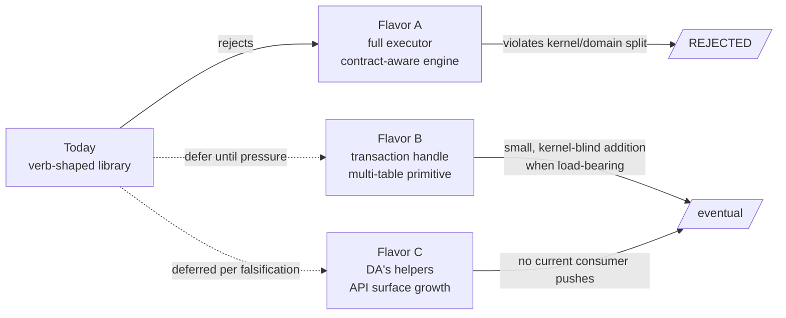
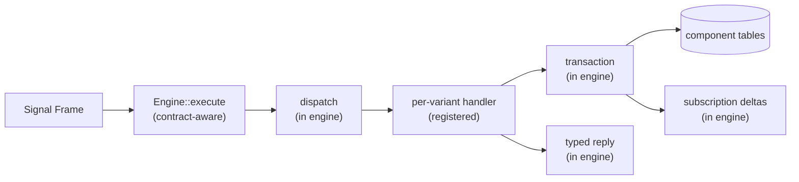

# Full Signal executor architecture — consideration

*Asks whether the workspace should reverse course on the
verb-shaped sema-engine and grow it into a "full Signal
executor" that owns dispatch, validation, and post-commit
delivery contract-aware. Reaches a recommendation grounded in
workspace philosophy: **no — keep the verb-shaped library**.
The kernel-vs-domain split is the workspace's load-bearing
discipline; a contract-aware executor breaks it. DA's "keep
split + add helpers" lean is the right shape on the split; the
helpers themselves are deferred per the falsification at
`sema-engine/tests/seam_gap_falsification.rs`. The macro-emitted
dispatcher trait is a separate question — addressed in §5.*

Date: 2026-05-18

Author: second-operator-assistant

---

## §0 — TL;DR

DA's question:

> *"Do we accept sema-engine as a verb-shaped database library,
> not a full Signal executor?"*

DA's lean: yes, keep the split, add helpers (`validate_write`,
`commit_multi`, `unsubscribe`, dispatcher-trait macro).

This report argues the question deserves the explicit answer
**yes** on the split, and a separate **defer** on the helpers
per the falsification work at `audit /2` §4.

What a "full Signal executor" would mean and why it's the wrong
shape for this workspace: §1–§4 below. The recommendation is
in §6. What might change the answer is in §7.



---

## §1 — What a "full Signal executor" could mean

The phrase has three architecturally distinct readings.
Sharpening them is half the work.

### §1.1 — Flavor A: engine-as-protocol-host (contract-aware)

The engine accepts a `signal_core::Request<Payload>` as input
and dispatches each `Operation<Payload>` to a registered
handler. Components register their channels with the engine;
the engine routes typed payloads to handler methods, runs
component validation hooks, commits inside a transaction, and
emits typed replies plus post-commit subscription deltas.



The engine becomes the place where Signal operation semantics
resolve. Components implement a `ChannelHandlers` trait per
channel; everything else is engine machinery.

### §1.2 — Flavor B: engine-as-transaction-grouper (contract-blind)

The engine stays contract-blind but grows a transaction
primitive that spans tables. Components still own dispatch and
the match-on-variant; the engine just gives them a typed
multi-table transaction handle.

```text
let mut transaction = engine.transaction();
transaction.assert(thoughts, thought)?;
transaction.assert(activities, activity)?;
let receipt = transaction.commit()?;   // atomic across tables
```

Cross-table atomicity becomes structural; subscription deltas
fire after `commit`. The engine doesn't know about
`MindRequest` variants; the component decides what writes go
in which transaction.

### §1.3 — Flavor C: engine-as-helper-bag (DA's lean)

The engine stays contract-blind. Four small additions:

- `Engine::validate_write(CommitRequest)` — dry-run write
  integrity checks without committing.
- `Engine::commit_multi(MultiTableCommitRequest)` — atomicity
  across registered tables.
- `Engine::unsubscribe(SubscriptionHandle)` — symmetric pair
  for `subscribe`.
- `signal_channel!` macro emits a `<Channel>Dispatcher` trait
  the daemon implements.

This is the audit's original §4 recommendation, before the
falsification pass at `sema-engine/tests/seam_gap_falsification.rs`
showed three of the four don't survive scrutiny.

---

## §2 — The load-bearing principle: kernel vs domain

The workspace has chosen the kernel-vs-domain split deliberately
and the split is upstream of this question. Three workspace
documents make it explicit:

- **`ESSENCE.md` §"Micro-components"** — each component is its
  own crate, its own repo, its own bounded context. Components
  communicate only through typed protocols. No shared mutable
  state.
- **`skills/component-triad.md` §"The shape"** — every stateful
  component is *daemon + thin CLI + `signal-*` contract*. The
  daemon owns sema-engine state through its component-specific
  tables. The five invariants name what each surface contains
  and what it doesn't.
- **`skills/actor-systems.md` §"Core rule"** — actors all the
  way down. Every non-trivial logical plane gets a named owner,
  a typed mailbox, supervision, and tests that prove the path
  was used.

The split's load-bearing consequence: **dispatch lives in
component actors, not in the engine.** The daemon's
`IngressPhase` / `DispatchPhase` / `DomainPhase` / `ReplyShaper`
trace nodes (in persona-mind today; the same shape in every
triad daemon) are observable plane transitions. The
`architectural-truth-tests.md` discipline relies on them — a
witness like `request_cannot_bypass_required_actor_plane` only
exists because dispatch is an actor plane in the daemon.

If dispatch moves into the engine, two things happen:

1. **The daemon's actor topology shrinks.** The
   IngressPhase/DispatchPhase trace nodes either disappear or
   become thin wrappers around `engine.execute(frame)`. The
   topology manifest shrinks to a couple of socket actors and
   the engine ref. Architectural-truth tests lose their
   substrate.
2. **The engine grows contract-aware machinery.** Per-channel
   handler traits, dispatch tables, validation hooks,
   per-variant reply shaping. The engine that today fits in
   ~700 lines of Rust grows into a multi-thousand-line dispatch
   framework with component-specific extension points.

The workspace's preference is dense actor topology *visible in
the daemon*, not a fat framework with thin daemons. Per
`skills/actor-systems.md` §"Core rule":

> *"An actor-heavy system should look over-named to
> conventional Rust eyes. That is expected."*

The verb-shaped library is the shape that lets actor-density
live in the daemon. Moving dispatch into the engine isn't
elegant elimination of boilerplate — it is a philosophy
reversal.

---

## §3 — Cost analysis per flavor

Comparing the three flavors against today's verb-shaped library.

| Aspect | Today (library) | A (executor) | B (txn handle) | C (helpers) |
|---|---|---|---|---|
| Contract awareness | None | Per-channel handler traits | None | None |
| Cross-table atomicity | `storage_kernel()` escape (inelegant) | Yes (engine commits) | Yes (typed transaction) | Yes (`commit_multi`) |
| Dispatch location | Daemon actor | Engine | Daemon actor | Daemon actor |
| Validation location | Daemon (match_records composition) | Engine hook + component | Daemon (match_records composition) | Engine (`validate_write`) |
| Subscription lifetime | Daemon supervisor + sink filter | Engine + handler unsub | Daemon supervisor | Engine (`unsubscribe`) |
| Engine size | Small (~700 LOC) | Large (multi-thousand) | Medium (+transaction type) | Medium (+4 APIs) |
| Engine reusability outside Signal | Yes (any RecordValue user) | No (Signal-coupled) | Yes | Yes |
| Daemon actor topology | Dense (observable) | Thin (engine-hosted dispatch) | Dense | Dense |
| Architectural-truth witness shape | Daemon traces | Engine internal events | Daemon traces | Daemon traces |
| Pressure today | — | — | Low (no consumer pushes) | Retracted per falsification |

The kernel-vs-domain split column is the load-bearing one.
Flavor A is the only flavor that violates it. Flavors B and C
preserve it.

---

## §4 — The falsification reframes Flavor C

The audit at `reports/second-operator-assistant/2-signal-core-sema-engine-fit-audit-2026-05-17.md`
§4 (revised in place) and the witnesses at
`sema-engine/tests/seam_gap_falsification.rs` together establish:

- **`Engine::validate_write` is unnecessary.** Three lines of
  `Engine::match_records(QueryPlan::key(...))` plus a typed
  `Result` wrapper covers single-op write dry-run. Twelve lines
  with a `HashSet` covers multi-op with within-batch detection.
  Witnesses:
  `validate_write_dissolves_into_match_records_dry_run`,
  `multi_op_write_dry_run_composes_with_match_records_plus_local_staging`.
- **`Engine::commit_multi` is real but unpressed.** No consumer
  today needs cross-table atomicity. When one does (e.g.
  `RoleHandoff`), schema redesign — express the operation as
  `Mutate` on one table — is usually cleaner than growing the
  engine. Witness:
  `cross_table_writes_via_two_engine_commits_are_not_engine_atomic`
  confirms the gap exists; the workspace's preferred resolution
  path is schema first.
- **`Engine::unsubscribe` is soft.** Component supervisors
  manage subscription lifetime externally via sink-side filter
  on `handle.id()`; correctness is preserved without engine
  changes. Engine registry growth is bounded by daemon
  lifetime. Witness:
  `subscription_lifetime_can_be_managed_externally_via_handle_id_filter`.
- **`signal_channel!` dispatcher trait is normal Rust pattern
  matching.** Reading `persona-mind/src/actors/dispatch.rs:55-119`
  with fresh eyes: each match arm carries meaning (which
  handler, which flow, which trace nodes). The Rust compiler
  catches missed variants. The macro extension would save
  keystrokes without adding clarity.

DA's helpers proposal precedes the falsification. The audit's
revised §4 retracts the helpers; DA's lean and the audit are
out of sync on §4.1 / §4.3 / §4.4 but agree on the split itself.

§4.2 (`commit_multi`) is the only helper that survives
falsification as a real engineering question. It corresponds to
Flavor B (transaction handle) below, not to a per-API addition.

---

## §5 — The dispatcher-trait question, more carefully

The macro-emitted dispatcher trait is the part of DA's proposal
worth re-examining even after falsification, because it lives
in `signal-core-macros` rather than sema-engine. It's not a
sema-engine question at all; it's a contract-side question.

**If it lands, it lands in signal-core-macros.** The macro
emits a `<Channel>Dispatcher` trait per channel; each daemon
implements the trait; the match-on-variant becomes the trait
impl. Sema-engine is unaffected.

**Whether it lands is a different question** from whether
sema-engine is a verb-shaped library. Today the falsification
suggests the match-on-variant in the daemon reads as ordinary
Rust pattern matching, with the compiler catching missed
variants. The trait would save keystrokes; whether it adds
clarity is a contract-design question for signal-core.

This report's recommendation: separate that question. The
sema-engine architecture stands on its own; the
signal-core-macros question can be settled independently.

---

## §6 — Recommendation

Answer to DA's question: **yes — accept sema-engine as a
verb-shaped database library, not a full Signal executor.**

This means three things:

1. **Reject Flavor A** (engine-as-protocol-host). The
   contract-aware executor breaks the kernel-vs-domain split
   and shrinks the daemon's observable actor topology. The
   workspace philosophy disagrees. The verb-shaped library is
   the shape that lets each component own its dispatch plane
   in actors.
2. **Defer Flavor B** (transaction handle) until a consumer
   surfaces a cross-table atomic operation that resists schema
   redesign. The most likely candidate is `RoleHandoff` once
   persona-mind implements it; the cleanest resolution there
   is to express handoff as `Mutate` on the claims table
   rather than `Retract+Assert` across tables. When a genuinely
   multi-table operation surfaces, Flavor B is the small,
   contract-blind extension that preserves the discipline.
3. **Defer Flavor C** (DA's helpers) per the audit's revised
   §4. Three of the four helpers don't survive the falsification
   pass; the fourth (`commit_multi`) corresponds to Flavor B.
   The dispatcher-trait macro is a separate question for
   signal-core-macros, not sema-engine.

DA's lean is right on the split (verb-shaped library wins) and
overstated on the helpers (most aren't load-bearing today). The
agreement between this report and DA is the load-bearing part;
the disagreement is about the size of the follow-up surface.

---

## §7 — What might change the answer

The verb-shaped library is the right shape *for the consumers
the workspace has today*. Three pressures could re-open the
question:

| Pressure | Direction it pushes | Likely response |
|---|---|---|
| A consumer needs cross-table atomicity that resists schema redesign | Flavor B (transaction handle) | Small, kernel-blind extension. Preserves dispatch in the daemon. |
| Subscription churn becomes load-bearing (consumer adds/removes subscriptions per request, not per session) | `Engine::unsubscribe` or demand-driven delivery | Small additions; preserves split. |
| Dispatch boilerplate becomes a measured cost (multiple channels with the same dispatch shape, mechanical changes propagating across daemons) | Dispatcher-trait macro in signal-core-macros | Contract-side, not engine-side. |
| The workspace adopts a different actor discipline (e.g., engine becomes the only actor, components are thin reducer libraries) | Flavor A becomes the natural shape | Philosophy change; needs explicit user decision. The current discipline disagrees. |

The first three are incremental. The fourth is a workspace-level
philosophy shift that would touch every triad daemon's
`ARCHITECTURE.md` and `skills/component-triad.md`. Not currently
on the table.

---

## §8 — What the falsification did not cover

Three honest unknowns the audit + falsification didn't fully
explore. None changes the recommendation; they are flagged for
future passes.

1. **Detached thread-per-delta cost under load.** The audit
   identified this as the more load-bearing performance concern
   than registry growth. No test measures the actual cost.
   `SubscriptionDeliveryMode::Inline` is the actor-shaped
   workaround today; a benchmark of high-throughput subscription
   workloads under both modes would settle whether the
   workaround is sufficient.
2. **Multi-channel daemons.** Persona-introspect already opens
   client connections to multiple peer daemons over multiple
   `signal-*` contracts. The "one actor per Signal contract
   surface" invariant per `skills/component-triad.md` is
   load-bearing here. The audit didn't trace a multi-channel
   daemon's dispatch end-to-end; the verb-shaped library should
   support this cleanly, but a witness would confirm.
3. **Owner-vs-ordinary dispatch.** The two pending witnesses
   from the audit
   (`owner-signal-request-uses-same-reducer-through-owner-socket`,
   `wrong-contract-frame-does-not-reach-reducer`) become
   daemon-side tests when the first owner-signal contract crate
   lands. The engine being contract-blind is the structural
   enabler; no engine change is required, but the daemon needs
   one actor per contract surface, each binding its own socket.
   Witnesses arrive with `primary-699g`.

---

## See also

- `~/primary/reports/second-operator-assistant/2-signal-core-sema-engine-fit-audit-2026-05-17.md`
  — the audit this report builds on; §4 (revised) carries the
  falsification-grounded retractions.
- `~/primary/orchestrate/ARCHITECTURE.md` — the orchestrate
  surface that will exercise the verb-shaped library when
  persona-orchestrate's `LaneRegistry` table lands per
  `primary-699g`.
- `~/primary/ESSENCE.md` §"Micro-components" — the upstream
  intent that the kernel-vs-domain split realises.
- `~/primary/skills/component-triad.md` — the five invariants;
  invariant 4 names sema-engine as the durable-state substrate
  but does not name it as the dispatcher.
- `~/primary/skills/actor-systems.md` §"Core rule" — actor
  density; the workspace's preference for dense observable
  daemons over fat frameworks.
- `~/primary/skills/architectural-truth-tests.md` — the
  witness shape that depends on daemon-side actor topology.
- `~/primary/reports/designer-assistant/118-signal-core-sema-engine-fit-investigation-brief-2026-05-17.md`
  — the brief that prompted the audit; its framing of
  "match-on-variant dispatch is a smell" is the part this
  report's falsification reverses.
- `/git/github.com/LiGoldragon/sema-engine/ARCHITECTURE.md` —
  the engine's own ARCH; constraint list names it as a library,
  not a daemon, not an actor runtime.
- `/git/github.com/LiGoldragon/sema-engine/tests/signal_core_seam.rs`
  — the six wire→engine seam witnesses.
- `/git/github.com/LiGoldragon/sema-engine/tests/seam_gap_falsification.rs`
  — the six falsification witnesses that retracted three of
  DA's four helpers.
