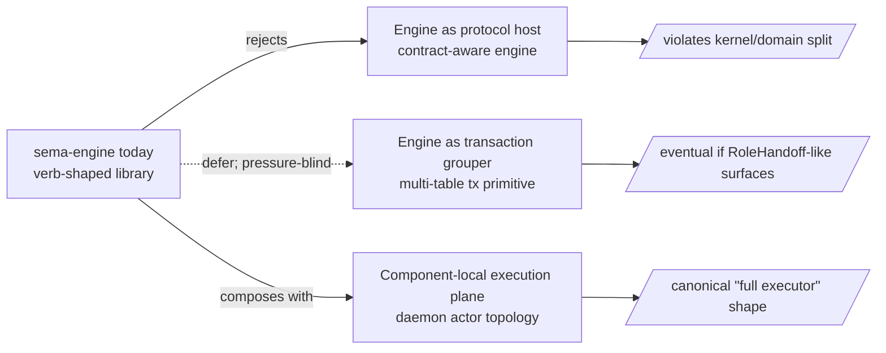

# Signal-core ↔ sema-engine fit + the full Signal executor

*Amalgamates the audit of the wire kernel against the database
engine and the operator-side consideration of "full Signal
executor" into one report. Supersedes
`reports/second-operator-assistant/2-signal-core-sema-engine-fit-audit-2026-05-17.md`
and
`reports/second-operator-assistant/3-full-signal-executor-architecture-consideration-2026-05-18.md`
per `skills/reporting.md` §"Supersession deletes the older report"
and `skills/context-maintenance.md` §"Per item, decide". Later
commits' framing wins: the converged position from
`reports/designer/220-full-signal-executor-state-2026-05-18.md`
sets the canonical shape; the falsification grounding from
`sema-engine/tests/{signal_core_seam,seam_gap_falsification}.rs`
sets the in-code witnesses; the operator-side specifics
(actor-density argument, SemaEngineOwnerActor restart trap,
detached-thread-per-delta cost) stand as the lane's
contribution.*

Date: 2026-05-18

Author: second-operator-assistant

---

## §0 — TL;DR

The fit between `signal-core` and `sema-engine` is **good**.
No engine API additions are required for current consumers.
The kernel/domain split holds: sema-engine is a contract-blind,
verb-shaped database library; daemons own dispatch, validation,
sockets, and effects.

The phrase "full Signal executor" has three workspace-recognised
meanings, settled by
`reports/designer-assistant/119-full-signal-executor-architecture-concept-2026-05-18.md`
and confirmed at the designer lane by
`reports/designer/220-full-signal-executor-state-2026-05-18.md`:

1. **Engine as protocol host** — sema-engine becomes
   contract-aware, dispatches request variants, owns reply
   shaping. **Rejected.** Violates the kernel/domain split.
2. **Engine as transaction grouper** — sema-engine stays
   contract-blind but grows a multi-table transaction primitive
   when pressure proves it. **Deferred.** No consumer pushes;
   schema redesign is usually cleaner.
3. **Component-local execution plane** — daemon-local actor
   topology (`socket → exchange → dispatch → reducer → store +
   effects → reply/events/audit`) every triad daemon takes.
   **Canonical.** DA/119 §3-§4 sketches the planes; this report's
   §7 cross-references them.

Four speculative helper APIs proposed in the first pass of the
audit retire or defer:

| Helper | Verdict | Why |
|---|---|---|
| `Engine::validate_write` | Dissolves | 3 lines of `match_records` composition; engine typed errors map onto local enum variants one-for-one. |
| `Engine::commit_multi` | Defer | Real but unpressed; schema redesign usually cleaner; effectful operations use durable pending state instead. |
| `Engine::unsubscribe` | Soft | Component supervisor + sink filter handles correctness; registry growth bounded by daemon lifetime. |
| Dispatcher-trait macro | Defer | Match-on-variant *is* the observable dispatch plane; signal-core-macros question, not engine. |

Twelve in-code witnesses at `sema-engine/tests/signal_core_seam.rs`
and `sema-engine/tests/seam_gap_falsification.rs` make these
verdicts falsifiable.

Implementation order, per DA/119 §10 + designer/220 §7:
**`persona-terminal` first** (owner socket already exists at
`owner-signal-persona-terminal`; lifecycle moved there);
**`lojix-daemon` second** (proves the executor is not
Persona-specific); **`signal-executor` library extraction third**,
only after both consumers prove the shape.

---

## §1 — Scope

This report answers two related questions:

1. **Does sema-engine play well with signal-core today?** Brief at
   `reports/designer-assistant/118-signal-core-sema-engine-fit-investigation-brief-2026-05-17.md`.
2. **What does "full Signal executor" mean in the workspace?**
   Question from the user 2026-05-18, framed by
   `reports/designer-assistant/119-full-signal-executor-architecture-concept-2026-05-18.md`.

The brief at /118 is retire-eligible per
`reports/designer/220-full-signal-executor-state-2026-05-18.md`
§9 — its substance is fully absorbed into this report (§3-§4),
DA/119, and the in-code witnesses.

---

## §2 — Verdict at a glance



Sema-engine stays the contract-blind, verb-shaped database
executor per its own ARCH §"Non-Goals": *"No actors. No text
parser. No daemon process. No signal-persona-* dependencies."*
The six verbs already round-trip cleanly at the seam (witnesses
in §11).

---

## §3 — Verb → sema-engine API map

Concrete mapping at
`/git/github.com/LiGoldragon/sema-engine/src/engine.rs`. The
engine stamps the verb onto every commit-log entry and mutation
receipt; receipts carry the verb back; subscription delta kinds
convert to `SignalVerb` via `DeltaKind::verb`.

| `SignalVerb` | sema-engine call | Receipt | Touches commit log | Emits subscription delta |
|---|---|---|---|---|
| `Assert` | `Engine::assert(Assertion<R>)` | `MutationReceipt` (verb=Assert) | yes | yes (`DeltaKind::Assert`) |
| `Mutate` | `Engine::mutate(Mutation<R>)` | `MutationReceipt` (verb=Mutate) | yes | yes (`DeltaKind::Mutate`) |
| `Retract` | `Engine::retract(Retraction<R>)` | `MutationReceipt` (verb=Retract) | yes | yes (`DeltaKind::Retract`) |
| `Match` | `Engine::match_records(QueryPlan<R>)` | `QuerySnapshot` (verb=Match) | no | no |
| `Subscribe` | `Engine::subscribe(QueryPlan<R>, Arc<dyn SubscriptionSink<R>>)` | `SubscriptionReceipt` carrying `InitialSnapshot` | no (registration persists separately) | yes (initial + post-commit deltas) |
| `Validate` | `Engine::validate(QueryPlan<R>)` | `ValidationReceipt` (verb=Validate) | no | no |
| *(structural atomicity)* | `Engine::commit(CommitRequest<R>)` | `CommitReceipt` (op count) | yes — one `CommitLogEntry` with `NonEmpty<CommitLogOperation>` | yes — one delta per `CommittedEffect` |

The six-root spine round-trips end-to-end through the engine.
The wire-level `Operation<Payload>::verb` is carried into the
engine call; the engine writes the verb into the durable log;
the receipt carries the verb back. Witnesses §11.

---

## §4 — The brief's seven questions

### Q1. Does `signal_channel!` emit enough metadata for sema-engine?

**Partial.** The macro emits per-variant `signal_verb()` (via the
`RequestPayload` trait), the typed request/reply/event enums and
their NOTA codecs, `Frame` aliases plus typed frame bodies, and
stream relation witnesses (`opened_stream()`, `closed_stream()`,
`stream_kind()`) when streams are declared.

What it does not emit: a per-variant dispatcher trait the daemon
could implement, a metadata reflection API, or an
ordinary-vs-owner per-variant flag. The first two are not blockers
— normal Rust match dispatch (the *observable dispatch plane*, §6.2)
handles routing with compiler-checked variant coverage. The third
is correct by design: ordinary vs owner is a contract-repo split,
not a per-variant flag (per `skills/component-triad.md` invariant
5 + DA/116 §A1-A5).

### Q2. Does sema-engine expose verb-shaped operations?

**Yes.** Six verb-shaped methods on `Engine`, plus
`Engine::commit` for structural multi-op atomicity. See §3 map.
Each method takes a typed wrapper (`Assertion`, `Mutation`,
`Retraction`, `QueryPlan`, `CommitRequest`) that binds the table
reference to the record type.

### Q3. Where does `Validate` live?

**Read-side only.** `Engine::validate` is `match_records` plus
receipt wrapping — it dry-runs a query without mutating storage.
It does **not** dry-run a write through reducer logic.

This is not a gap — components compose write dry-run from
`Engine::match_records(QueryPlan::key(...))` in 3 lines for the
single-op case and ~12 lines for the multi-op-with-within-batch-
detection case (witnesses §11). The engine's typed errors
(`DuplicateAssertKey`, `DuplicateWriteKey`, `RecordNotFound`) map
onto local component-side enum variants one-for-one. No engine
extension required.

### Q4. Where do subscriptions come from?

**Engine-native, with two real gaps.**

What works:

- Initial state via `SubscriptionEvent::InitialSnapshot`.
- Post-commit deltas via `SubscriptionEvent::Delta<RecordValue>`
  carrying `DeltaKind::{Assert, Mutate, Retract}`.
- Typed `SubscriptionHandle` carrying id + table + snapshot.
- Per-query filter (`QueryFilter::accepts(key)`).
- Detached or inline delivery (`SubscriptionDeliveryMode`).
- Durable registration persisted to a known engine slot
  (`SUBSCRIPTIONS` table) — survives daemon restart.

Real gaps:

- **No `Engine::unsubscribe(SubscriptionHandle)`.** The wire-side
  `Retract SubscriptionRetraction` has no engine close method.
  Component supervisors route around this with a sink-side
  handle-id filter (witness §11); engine's registry grows
  monotonically until daemon shutdown. Soft.
- **No flow-control protocol.** Detached-mode delivery spawns a
  detached thread per accepted delta. `Inline` mode is the
  actor-shaped workaround. Real but unbenchmarked.

### Q5. What is the transaction boundary?

**Per-table, structural atomicity.**

- Single-op `Assert`/`Mutate`/`Retract` commits in one redb write
  transaction, writing one `CommitLogEntry`.
- Multi-op `Engine::commit(CommitRequest)` commits in one redb
  write transaction, writing one `CommitLogEntry` whose
  `NonEmpty<CommitLogOperation>` carries every op's verb.
- `CommitRequest` is **single-table** by shape. Cross-table atomic
  commits today go through `Engine::storage_kernel().write()` —
  the inelegant escape hatch that bypasses commit-log emission,
  snapshot-ID bump, and subscription delta delivery.
- Domain side effects (PTY spawn, network IO, subprocess
  invocation) are **not** in the transaction. The daemon
  sequences side effects around the typed commit; the durable
  record names the *intent*, not the side effect's success. The
  effectful-operation discipline (DA/119 §4.7) handles this:
  reserve durable intent → commit pending → run effect → commit
  success/failure → emit reply.

The single-table shape of `CommitRequest` is a real gap. The
cleanest first resolution is usually schema redesign — express
the multi-table operation as `Mutate` on one table (e.g.
`RoleHandoff` as a Mutate on the claims table instead of
`Retract+Assert` across claims + activities). When a genuinely
multi-table operation surfaces that resists schema redesign,
Flavor B (`Engine::commit_multi` or a typed transaction handle)
is the small contract-blind addition that preserves the
kernel/domain split.

### Q6. Are owner-signal operations first-class?

**Yes — by structural design.** The engine is contract-blind:
`assert`, `mutate`, etc. don't carry caller identity; the table +
verb + record is the entire input. The contract / socket layer
enforces the boundary per `skills/component-triad.md` invariant 5
and DA/116.

The clean shape: ordinary and owner contracts call the *same*
engine methods on the *same* tables; the dispatch in the daemon
(one actor per contract surface) decides which contract is allowed
to issue which write. The engine doesn't grow a parallel write API
per permission class.

`owner-signal-persona-terminal` is the live worked example.
`OwnerTerminalRequest` carries `Mutate CreateSession` and
`Retract RetireSession`; ordinary `signal-persona-terminal` no
longer carries those variants. `persona-terminal` depends on the
owner contract; the missing work is owner Unix-socket runtime
wiring, not contract placement.

### Q7. Can errors stay typed from wire to state and back?

**Mostly. Two stringly seams, both component-side.**

Typed all the way:

- Engine errors (`sema_engine::Error`) — structured enum:
  `TableNotRegistered { table }`, `RecordNotFound { table, key }`,
  `DuplicateAssertKey { table, key }`, `DuplicateWriteKey`,
  `EmptyCommit { table }`, `UnsupportedReadPlan { operator }`,
  `SubscriptionRegistryPoisoned`, `SubscriptionSink { message }`.
- `signal-core::Reply` is a typed sum (`Accepted { outcome,
  per_operation }` / `Rejected { reason }`) with per-op
  `SubReply::{Ok, Invalidated, Failed, Skipped}`.
- Per-channel reply payloads (`MindReply::*`) are typed records.

Stringly seams:

- `SinkError { message: String }` — subscription delivery
  failures lose the typed cause.
- Persona-mind's actor-call boundary maps Kameo's typed
  `SendError` into `crate::Error::ActorCall(error.to_string())`.

Both are component-side fixes under `skills/rust/errors.md`
discipline, not engine-shape issues. The engine's typed-error
surface is honest.

---

## §5 — Falsification: which helpers retired

The audit's first pass proposed four engine-side additions. The
falsification pass at `sema-engine/tests/seam_gap_falsification.rs`
resolves each:

### §5.1 — `Engine::validate_write` — dissolves

Witness: `validate_write_dissolves_into_match_records_dry_run` +
`multi_op_write_dry_run_composes_with_match_records_plus_local_staging`.

A component can dry-run any write by composing
`Engine::match_records(QueryPlan::key(...))` against the proposed
records. Three lines for the single-op case. Twelve lines with a
`HashSet` for within-batch duplicate detection in the multi-op
case. The engine's typed errors map one-for-one onto local enum
variants.

The first-pass framing ("reducer-side boilerplate that mirrors
engine integrity logic") was wrong: this isn't boilerplate, it's
small typed composition that reads as English.

### §5.2 — `Engine::commit_multi` — defer

Witness: `cross_table_writes_via_two_engine_commits_are_not_engine_atomic`.

The witness confirms the gap is real: two `Engine::assert` calls
on different tables land as two `CommitLogEntry` values at two
snapshot IDs. `storage_kernel().write()` IS the escape and IS
inelegant — it bypasses commit-log emission, snapshot bump, and
delta delivery.

No consumer pushes for cross-table atomicity today. The workspace
pattern (one component per concern, single-writer-actor per
engine, one engine per component) localises writes per table.
Resolution paths in order of preference when the gap surfaces:

1. **Schema first.** Can the operation live in one table?
   `RoleHandoff` is the most likely first surface candidate; the
   clean shape is `Mutate` on the claims table.
2. **Extend `Engine::commit`.** When schema genuinely requires
   multiple tables, grow the typed surface preserving
   commit-log + snapshot + delta semantics.
3. **Document.** Consumers that hit it surface a contract-design
   issue, not a reach for `storage_kernel`.

### §5.3 — `Engine::unsubscribe` — soft

Witness: `subscription_lifetime_can_be_managed_externally_via_handle_id_filter`.

A component supervisor tracks active handle IDs externally; the
sink filters delivered events by `handle().id()`. Spurious deltas
do not reach domain code. Correctness covered.

The engine's `SubscriptionRegistry` keeps growing for the daemon's
lifetime; bounded by daemon shutdown, fine for steady-state
subscription sets, wasteful for churn workloads. The more
load-bearing performance concern is detached-thread-per-delta
(see §9.2); `SubscriptionDeliveryMode::Inline` is the
actor-shaped workaround.

### §5.4 — Dispatcher-trait macro — defer

Reading `persona-mind/src/actors/dispatch.rs:55-119` with fresh
eyes: each match arm names a flow and records trace nodes. The
Rust compiler catches missed variants on the closed `MindRequest`
enum. The match-on-variant IS the daemon's *observable dispatch
plane* (§6.2), not pattern-matching ceremony.

If a macro extension lands later, it belongs in
`signal-core-macros`, not in sema-engine. Defer until measured
repetition across two components proves it pays for itself.

---

## §6 — Why the verb-shaped library wins

Two arguments, both grounded in workspace discipline.

### §6.1 — The kernel/domain split is load-bearing

Sema-engine is a **library**, not a daemon, not an actor runtime,
not a protocol host. Per `sema-engine/ARCHITECTURE.md` §"Non-Goals":

> *"No actors in this crate. No text parser in this crate. No
> daemon process in this crate."*

If sema-engine absorbed dispatch (the rejected Flavor A /
DA/119's "engine as protocol host"), the engine would need to:

- register handlers per `signal_channel!`-emitted request variant,
- own per-variant dispatch tables and validation hooks,
- shape replies inside the engine,
- host the post-commit event projector.

Each of those moves a daemon-local plane into the engine. The
engine grows from ~700 LOC into a multi-thousand-LOC dispatch
framework with component-specific extension points. Reusability
outside Signal collapses.

Per `ESSENCE.md` §"Micro-components" and
`skills/component-triad.md`: one capability per component;
components communicate only through typed protocols; the daemon
owns sema-engine state through its component-specific tables.
The verb-shaped library is the shape that lets this discipline
hold.

### §6.2 — Dispatch is an observable actor plane

Per `skills/actor-systems.md` §"Core rule":

> *"An actor-heavy system should look over-named to conventional
> Rust eyes. That is expected."*

The daemon's `IngressPhase` / `DispatchPhase` / `DomainPhase` /
`ReplyShaper` trace nodes are NAMED PLANES that
`skills/architectural-truth-tests.md` witnesses depend on. A
witness like `request_cannot_bypass_required_actor_plane` exists
*because* dispatch is a plane in the daemon.

If sema-engine absorbs dispatch, the daemon's topology shrinks
to a socket actor + an engine reference. The trace-pattern test
plane loses its substrate. That isn't elegance gained — it's
observability lost.

The component-local execution plane (DA/119 meaning 3) keeps
these planes in the daemon. The plane names
(`SignalExchangeRuntime`, `ComponentSignalExecutor`,
`ComponentReducer`, `SemaEngineOwnerActor`, `EffectSupervisor`,
`ReplyEventProjector`) become the standard topology shape every
triad daemon takes. Architectural-truth witnesses stay
implementable per component.

---

## §7 — The component-local execution plane

The canonical "full Signal executor" shape, per DA/119 §3-§4
(cross-referenced rather than restated):

```text
ordinary client / CLI → OrdinarySignalSocketActor (signal-* contract)
owner client          → OwnerSignalSocketActor (owner-signal-* contract)
                         │
                         ▼
                    SignalExchangeRuntime
                    (handshake, exchange id,
                     request/reply, streams)
                         │
                         ▼
                  GeneratedContractDispatcher
                    (variant + verb witness)
                         │
                         ▼
                  ComponentSignalExecutor
                    (request orchestration)
                         │
                         ▼
                    ComponentReducer
                    (domain semantics)
                         │
              ┌──────────┴──────────┐
              ▼                     ▼
   SemaEngineOwnerActor       EffectSupervisor
   (single Engine owner)      (processes, sockets,
              │                Nix, network, PTY)
              ▼                     │
       component.redb               ▼
              │              external resources
              └──────────┬──────────┘
                         ▼
                  ReplyEventProjector
                  (typed replies, streams,
                   audit/introspection)
                         │
                         ▼
              SignalExchangeRuntime → wire
```

Key invariants the plane preserves:

- **One actor per Signal contract surface** (per
  `skills/component-triad.md` invariant 5 + DA/116 §A5). The
  ordinary socket and the owner socket are separate actors, each
  binding its own socket path from typed configuration.
- **One `SemaEngineOwnerActor` per component.** Both contract
  surfaces converge on the same Sema owner; multiple sockets are
  permission surfaces, not multiple databases (DA/119 §11 Q4).
- **Effects happen around durable state transitions** (DA/119
  §4.7). For operations touching external resources:
  reserve durable intent → commit pending → run effect → commit
  success/failure → emit reply. This keeps the daemon honest
  about atomicity without faking it through the engine.

---

## §8 — Implementation order (operator angle)

Per DA/119 §10 + designer/220 §7.

### Step 1 — `persona-terminal`

Owner socket already exists at `owner-signal-persona-terminal`;
lifecycle (CreateSession, RetireSession) moved there;
`persona-terminal` depends on the owner contract and stubs an
owner request actor returning
`OwnerTerminalRequestUnimplemented { reason: NotBuiltYet }`. The
missing work is runtime wiring, not contract placement.

| Operator step | Discipline reference |
|---|---|
| 1. Owner Unix-socket listener bound to the spawn-envelope owner path | `skills/kameo.md` §"Mailbox"; `persona-mind/transport.rs` is the in-tree pattern |
| 2. `TerminalSignalExecutor` module inside `persona-terminal` with two ingress adapters | `skills/component-triad.md` invariant 5 + DA/116 §A5 |
| 3. One `SemaEngineOwnerActor` shared by both surfaces | `persona-mind`'s `StoreKernel` pattern; `sema-engine/ARCHITECTURE.md` §"Constraints" |
| 4. `CreateSession` with durable pending state (reserve name → spawn → mark ready/failed) | DA/119 §4.7 + `skills/rust/storage-and-wire.md` |
| 5. `RetireSession` symmetric (mark retiring → shut down terminal-cell → mark retired) | Same |
| 6. Six witnesses per DA/119 §10 step 6 | `skills/architectural-truth-tests.md` |

Each step is one logical commit. Adjacent designer report
`reports/designer/218-persona-terminal-consolidation-state-2026-05-18.md`
names the actor topology and tables shape that dovetails with the
executor plane.

### Step 2 — `lojix-daemon`

Same plane shape against a non-Persona domain: Horizon projection
+ Nix build/deploy effects. Proves the executor is not
Persona-specific. Adjacent report
`reports/designer/221-lojix-arca-horizon-leaner-shape-state-2026-05-18.md`.

### Step 3 — `signal-executor` library extraction

Only after both consumers prove the shape. Library-only — no
daemon, no Kameo dependency, no contract-crate dependency, not
contract-aware. Candidate nouns per DA/119 §8:
`ExecutionEnvelope`, `ExecutionSurface`, `ExecutionContext`,
`ExecutionOutcome`, `ExecutionFailure`, `EffectStep`,
`ComponentStore`.

---

## §9 — Operator-side residuals

### §9.1 — `SemaEngineOwnerActor` supervised-restart trap

Per `reports/operator-assistant/138-persona-mind-gap-close-2026-05-16.md`
§"P2", supervised state-bearing actors using
`.spawn_in_thread()` race redb teardown. Kameo's `notify_links`
fires before `Self::drop()` runs, so the parent's
`wait_for_shutdown` returns while the OS thread is still inside
`block_on(...)` and the redb handle is still held. The next
process opening the same path races the still-locked file.

Workaround for every triad daemon's Sema owner: stay on
`.spawn()` (not `.spawn_in_thread()`) until upstream Kameo grows
a `pre_notify_links` hook. Discipline already in
`skills/kameo.md` §"Blocking-plane templates" Template 2.
Re-flagged here because the executor plane in every triad daemon
will hit this.

### §9.2 — Detached-thread-per-delta cost

`SubscriptionDeliveryMode::Detached` spawns one OS thread per
accepted delta (`sema-engine/src/subscribe.rs:415`). For
high-throughput subscriptions, thread creation overhead becomes
the load-bearing performance concern — not subscription registry
growth.

`SubscriptionDeliveryMode::Inline` is the actor-shaped workaround:
the supervisor sink uses inline delivery, accepts inside its own
actor mailbox, and avoids the per-delta thread cost. A future
demand-driven delivery mode would tighten this further but is not
load-bearing yet.

Un-benchmarked; surfaces as a real concern only under load.

### §9.3 — Stringly seams

Two component-side stringly seams (per Q7):

- `SinkError { message: String }` — subscription delivery
  failures lose typed cause.
- Persona-mind's `crate::Error::ActorCall(error.to_string())` —
  Kameo `SendError` transport flattens to string at the
  actor-call boundary.

Both are operator follow-ups inside the affected components,
following `skills/rust/errors.md` discipline. Not engine-shape
issues.

---

## §10 — Out of scope

- **Backpressure / demand-driven subscription delivery.** Real
  concern; defer until a consumer saturates a sink. `Inline` mode
  is the actor-shaped workaround for high-throughput today.
- **Cross-domain federation / schema versioning.** Out of scope
  for the today-stack audit.

---

## §11 — In-code witnesses

Twelve tests total, across two files in `sema-engine`.

### Wire→engine seam (`tests/signal_core_seam.rs`)

1. `signal_core_assert_operation_lands_as_engine_assert_with_matching_verb`
2. `signal_core_mutate_operation_lands_as_engine_mutate_with_matching_verb`
3. `signal_core_retract_operation_lands_as_engine_retract_with_matching_verb`
4. `signal_core_match_operation_lands_as_engine_match_with_matching_verb`
5. `signal_core_multi_op_request_lands_as_one_commit_log_entry_with_ordered_per_op_verbs`
6. `signal_core_universal_check_catches_verb_payload_mismatch_before_engine_call`

### Gap falsification (`tests/seam_gap_falsification.rs`)

1. `validate_write_dissolves_into_match_records_dry_run`
2. `multi_op_write_dry_run_composes_with_match_records_plus_local_staging`
3. `subscription_lifetime_can_be_managed_externally_via_handle_id_filter`
4. `cross_table_writes_via_two_engine_commits_are_not_engine_atomic`
5. `read_after_write_is_two_engine_calls_with_monotonic_snapshot_ids`
6. `engine_subscription_registrations_are_listable_for_introspection`

Together they prove:

- The six verbs are honest at the seam (wire verb = payload
  `signal_verb()` = engine call = receipt verb = commit log verb).
- Structural multi-op atomicity works for single-table writes.
- Cross-table atomicity is the only real engine-shape gap and has
  schema-side resolutions.
- The three speculative helper APIs all dissolve or have
  component-side route-arounds.
- Read-after-write composes through two engine calls; the
  single-writer-per-actor discipline dissolves OCC questions.
- Subscription registrations are listable for introspection; only
  the prune verb is missing.

Existing sema-engine tests cover the engine-API-internal behavior
(duplicate-key checks, multi-op commit rollback, validate-no-log,
subscribe initial+delta, blocking-sink isolation, restart-
survives-registration) — my new tests cover the wire-shape →
engine-call translation layer that wasn't exercised before.

---

## §12 — What might change the answer

| Pressure | Direction | Likely response |
|---|---|---|
| A consumer needs cross-table atomicity that resists schema redesign | Flavor B (transaction handle) | Small, kernel-blind extension. Preserves dispatch in the daemon. |
| Subscription churn becomes load-bearing | `Engine::unsubscribe` or demand-driven delivery | Small additions; preserves split. |
| Detached-thread-per-delta cost shows in profiling | Demand-driven delivery or pool-based dispatch | Engine internal; no API churn. |
| Dispatch boilerplate becomes a measured cost across multiple channels | Dispatcher-trait macro in `signal-core-macros` | Contract-side, not engine-side. |
| The workspace adopts a different actor discipline (engine becomes the only actor) | Flavor A (engine as protocol host) becomes natural | Philosophy change; needs explicit user decision. Current discipline disagrees. |

The first four are incremental. The fifth is a workspace-level
philosophy shift that would touch every triad daemon's
`ARCHITECTURE.md` and `skills/component-triad.md`. Not currently
on the table.

---

## See also

- `~/primary/reports/designer-assistant/119-full-signal-executor-architecture-concept-2026-05-18.md`
  — canonical concept report.
- `~/primary/reports/designer/220-full-signal-executor-state-2026-05-18.md`
  — designer-lane state-of-art compendium; sets the canonical
  position and flags DA/118 as retire-eligible.
- `~/primary/reports/designer/218-persona-terminal-consolidation-state-2026-05-18.md`
  — adjacent state-of-art for the first executor implementation.
- `~/primary/reports/designer/221-lojix-arca-horizon-leaner-shape-state-2026-05-18.md`
  — adjacent state-of-art for the second executor implementation.
- `~/primary/reports/designer-assistant/116-permission-scoped-signal-contracts-and-sockets-2026-05-17.md`
  — OwnerSignal as a first-class executor surface.
- `~/primary/reports/operator-assistant/138-persona-mind-gap-close-2026-05-16.md`
  §"P2" — the supervised state-bearing actor restart trap §9.1
  flags.
- `~/primary/skills/component-triad.md` — the five triad
  invariants; invariants 4 and 5 land alongside this report's
  framing.
- `~/primary/skills/actor-systems.md` §"Core rule" — actor
  density; the workspace's preference for dense observable
  daemons.
- `~/primary/skills/architectural-truth-tests.md` — the witness
  shape this report's §11 follows.
- `~/primary/skills/kameo.md` §"Blocking-plane templates" — the
  supervised state-bearing actor restart trap.
- `~/primary/skills/rust/errors.md` — the typed-error discipline
  for the stringly seams in §9.3.
- `/git/github.com/LiGoldragon/sema-engine/ARCHITECTURE.md` — the
  engine's own ARCH; §"Non-Goals" forbids actors, parsers,
  daemons, contract-crate deps in the engine.
- `/git/github.com/LiGoldragon/sema-engine/tests/signal_core_seam.rs`
  — six wire→engine seam witnesses.
- `/git/github.com/LiGoldragon/sema-engine/tests/seam_gap_falsification.rs`
  — six falsification witnesses.
- `/git/github.com/LiGoldragon/owner-signal-persona-terminal/` —
  the live owner contract that proves OwnerSignal is first-class
  today.
