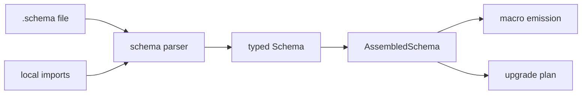
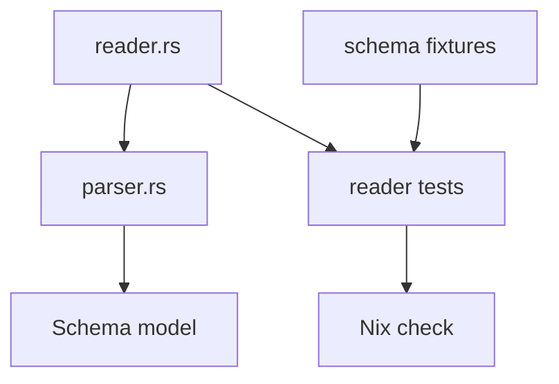
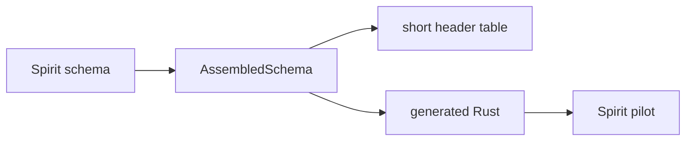

# 181 — schema e2e reader and current redesign

*Kind: Implementation Report · Topic: schema-e2e-reader · Date: 2026-05-24*

## Current Understanding

The schema redesign has crossed from Rust-only modelling into an actual
language path. The durable shape is:

- authored `.schema` files are six positional objects with no outer wrapper;
- imports are a map of explicit variants: `Import` or `ImportAll`;
- every header root uses the v13 vector form `(Root [SubVariant ...])`;
- namespace declarations define bodies and route payloads;
- features carry reply/event/observable/upgrade metadata;
- `AssembledSchema` is the fully resolved machine object used by later macro
  emission, short-header dispatch, layout, and upgrade projection.



## What Landed

Implemented in `/git/github.com/LiGoldragon/schema`:

- `Schema::parse_str` parses real `.schema` text through
  `nota-codec::Decoder`.
- `LoadedSchema::read_path` reads a schema file, resolves local relative
  imports, validates selected imports, resolves `ImportAll`, and assembles.
- Parser support covers:
  - six positional schema objects;
  - import map values `(Import ./path.schema [Names...])` and
    `(ImportAll ./path.schema)`;
  - uniform headers `(State [Statement Declaration])`;
  - namespace enum/newtype/record declarations;
  - container type expressions `(Option Topic)`, `(Vec RecordSummary)`,
    `(Map Key Value)`;
  - `Reply`, `Event`, `Observable`, and `Upgrade` features.
- Nix source filtering now includes `tests/fixtures/**`, so the remote builder
  tests the same `.schema` files as local Cargo.

## E2E Fixtures

Actual schema files added under:

```text
tests/fixtures/schema-e2e/
├── magnitude.schema
├── sema.schema
├── shared.schema
├── spirit-v0-1.schema
└── spirit-v0-1-1.schema
```

The next Spirit fixture imports three local files:

```nota
{
  Magnitude (ImportAll ./magnitude.schema)
  SemaSet (Import ./sema.schema [SemaOperation SemaObservation])
  Shared (Import ./shared.schema [Source Stamp])
}
```

The route header is v13 uniform:

```nota
[
  (State [Statement Declaration])
  (Record [Entry])
  (Observe [Records])
]
```

The next version carries upgrade knowledge:

```nota
(Upgrade (FromVersion v0.1)
  (Migrate Entry))
```

## Witness Tests

Added `tests/reader.rs`:

- `reads_schema_file_with_local_imports_and_lowers_routes`
  - reads `spirit-v0-1-1.schema`;
  - resolves `./magnitude.schema`, `./sema.schema`, `./shared.schema`;
  - verifies imported types appear in `AssembledSchema`;
  - verifies lowered route slots and route bodies.
- `plans_upgrade_from_schema_files`
  - reads previous and next schema files;
  - calls `AssembledSchema::plan_upgrade_from`;
  - verifies `Entry` is accepted through `(Migrate Entry)`.
- `rejects_scalar_header_form`
  - rejects the retired `(State Statement)` shape.

Verification passed:

```text
cargo test
cargo clippy --all-targets -- -D warnings
nix flake check --option max-jobs 0
```

## Implementation Map



| Node | Path | Role |
|---|---|---|
| parser | `src/parser.rs` | Parses one `.schema` text into typed `Schema`. |
| reader | `src/reader.rs` | Reads files and resolves local imports. |
| fixtures | `tests/fixtures/schema-e2e/` | Actual `.schema` files used by tests. |
| tests | `tests/reader.rs` | End-to-end witness. |
| Nix check | `flake.nix` | Includes fixtures in clean source and runs checks remotely. |

## Design Pressure Found

1. Version `0.1` is now represented only as upgrade source metadata
   `(FromVersion v0.1)`. The six-position schema file still has no explicit
   current-version field. If concept schemas must carry their own current
   version, that needs a settled location: filename/catalogue metadata,
   feature variant, or a schema-header metadata section.
2. `LoadedSchema` currently treats an imported schema's assembled type set as
   exportable for later imports. That allows transitive re-export. If import
   surfaces should export only local namespace declarations, the reader should
   narrow that rule.
3. The `State` namespace collision remains rejected. A route-root body
   declaration reserves its key in the flat namespace; a normal data type with
   the same name must be renamed or the architecture must add a separate
   route-body section.

## Best Next Work

The next operator slice should connect this reader to the macro pilot:



That is the direct bridge from schema language to `primary-ezqx.1`: Spirit
through `.schema` input, route table emission, and generated contract code.
