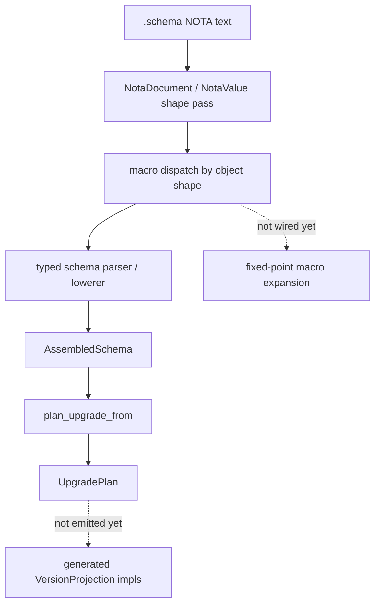

# 187 — NOTA shape logic and schema upgrade macro state

## Frame

Psyche asked whether the schema macro and schema-change-upgrade machinery is
real, design-only, or mixed, then directed implementation of a reusable NOTA
shape-logic layer for macro dispatch. The target behavior was a layer that can
inspect generic NOTA object shapes before committing to schema semantics:
PascalCase identifiers, `[...]` sequence objects, `[|...|]` block strings,
`{...}` maps, and parenthesized records with one, two, or many identifiers.

This pass landed the first real substrate for that idea in `nota-codec`, then
proved it in `schema` against a real `.schema` fixture with multiple local
`./*` imports and an `Upgrade` feature.

## Implemented

### `nota-codec`

Commit: `323a3a74` — `nota-codec: add structural value shape layer`

New public types:

- `NotaDocument`
- `NotaValue`
- `NotaMapEntry`
- `NotaAtom`
- `NotaString`
- `NotaStringKind`

The new `NotaDocument::parse` and `NotaValue::parse` APIs build a generic
structural tree from NOTA text. This is not the typed decoder replacement. It
is the macro-front layer: parse enough structure to decide what kind of object
is present, then hand subobjects down to later passes.

Shape API now available on `NotaValue`:

- `is_record`
- `is_sequence`
- `is_map`
- `is_block_string`
- `is_pascal_identifier`
- `identifier_text`
- `as_record`
- `as_sequence`
- `as_map`
- `record_head`
- `has_record_head`
- `record_item_count`
- `data_field_count`
- `has_data_shape`

Tests landed in `nota-codec/tests/value_shape.rs` for:

- multi-value NOTA documents;
- macro candidate map shapes like `{ Topic (Newtype String) ... }`;
- data-carrying record shape checks like `(Upgrade ... ...)`;
- distinguishing `[...]` sequences from `[|...|]` block strings;
- PascalCase identifier detection for macro dispatch.

### `schema`

Commit: `420e13ea` — `schema: prove nota macro shape pass`

`schema` now locks to `nota-codec` commit `323a3a74`. The new
`schema/tests/nota_shape.rs` reads the existing real fixture:

`tests/fixtures/schema-e2e/spirit-v0-1-1.schema`

That fixture contains:

- three local import directives: `./magnitude.schema`, `./sema.schema`,
  `./shared.schema`;
- the six-position schema file shape;
- namespace declarations using sequence, record, newtype-like, and container
  shapes;
- an `Upgrade` feature from `v0.1` with a `Migrate Entry` annotation.

The test proves that the generic first pass can classify:

- top-level six `.schema` positions;
- `ImportAll` and `Import` directives with local paths;
- route enum/body declarations from `[...]`;
- single-identifier record candidates like `(String)`;
- multi-identifier record candidates like `(Topic Kind Summary ...)`;
- container candidates like `(Vec RecordSummary)`;
- upgrade macro shape `(Upgrade (FromVersion v0.1) (Migrate Entry))`.

`schema/ARCHITECTURE.md` now documents the generic macro-front pass:
`nota_codec::NotaDocument` / `NotaValue` preserve structural shape for macro
dispatch, while the existing typed parser remains the semantic lowering path.

## Current reality

Real now:

- generic NOTA structural parsing exists in `nota-codec`;
- schema-side tests prove that real `.schema` files can be inspected by that
  first pass;
- schema already parses `Upgrade` features and lowers them into
  `Feature::Upgrade`;
- `AssembledSchema::plan_upgrade_from` already infers identity projections,
  additive enum-variant projections, explicit migrate annotations, renamed
  types, drops, and untranslatable removals.

Still design / not yet wired:

- fixed-point macro expansion over generic `NotaValue` spaces;
- user-declared macros that expand into later schema objects;
- deriving and emitting concrete Rust `VersionProjection` implementations from
  the `UpgradePlan`;
- production schema parser handoff from `NotaValue` nodes instead of raw
  `Decoder` stream positions.

## Important design edge

`NotaValue` deliberately treats bare `[` as a sequence and `[|` as a block
string. Inline bracket strings like `[content]` remain schema-positioned in the
typed `Decoder`, because without a target type, `[content]` is ambiguous with a
one-element sequence. This matches the current architecture: shape pass handles
macro structure; typed passes interpret string positions.

If psyche wants `[content]` to become a generic scalar string in the macro
front, the generic parser will need either a different delimiter rule or schema
context earlier than it currently has.

## Upgrade macro answer

The upgrade macro is partly real.

Real:

- authored schema can contain `(Upgrade (FromVersion v0.1) ...)`;
- parser lowers it into `Feature::Upgrade`;
- `UpgradeRuleMacro` pushes that feature through the builtin macro engine;
- `plan_upgrade_from` compares previous and current assembled schemas and
  returns a typed `UpgradePlan`.

Not real yet:

- no schema-diff macro generates code yet;
- no schema macro emits `VersionProjection` implementations yet;
- no fixed-point macro pass repeatedly expands macro spaces until no macros
  remain;
- no end-to-end Spirit database upgrade is driven from `.schema` output yet.

The clean next slice is to define a `SchemaMacroInput` wrapper around
`NotaValue`, then wire one macro node through both paths: generic shape match
first, typed lowering second, and generated `UpgradePlan` evidence third.

## Verification

`nota-codec`:

- `cargo fmt`
- `cargo test`
- `cargo clippy --all-targets -- -D warnings`
- `cargo fmt --check`

`schema`:

- `cargo fmt`
- `cargo test`
- `cargo clippy --all-targets -- -D warnings`
- `cargo fmt --check`
- `nix flake check --option max-jobs 0`

All passed.

## Questions

1. Should generic `[content]` be treated as a string without schema context, or
   is the current rule correct: generic `[` means sequence, `[|...|]` means
   block string, and inline bracket strings are typed-decoder-only?
2. Should `Upgrade` stay only as a feature-vector item, or should upgrade rules
   also be legal namespace-level macro objects in the future fixed-point macro
   space?
3. Should the next implementation slice replace part of `schema::Parser` with
   `NotaValue` traversal, or keep `schema::Parser` as-is while adding a
   parallel macro-front API for generated macro crates?
