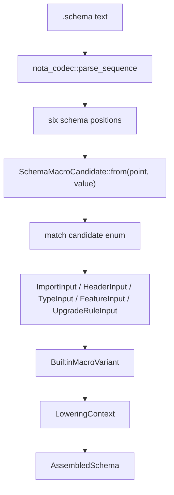

# 188 — Situation: real schema parsing through NOTA-node-method macros

## Bottom line

The system is not yet at "real schema parsed 100% by methods on NOTA nodes".
The current mainline is at the foundation-plus-proof stage:

- `nota-codec` main has a real generic `NotaValue` / `NotaDocument` tree and
  shape methods.
- `schema` main has a real test that parses the actual Spirit v0.1.1
  `.schema` fixture through `parse_sequence` and classifies all six schema
  positions with NOTA-node methods.
- Production `Schema::parse_str` still uses the streaming
  `nota_codec::Decoder`, not `NotaValue` traversal.
- Production macro lowering still receives typed input structs
  (`ImportInput`, `HeaderInput`, `TypeInput`, `FeatureInput`,
  `UpgradeRuleInput`), not generic `NotaValue` nodes.

So: real schema text is being parsed by the node-shape layer in tests, but the
canonical schema reader is not yet a 100% node-method-driven macro pipeline.

## What is real on main

`nota-codec` commit `6a851eb6`:

- `NotaDocument`
- `NotaValue`
- `NotaMapEntry`
- `NotaAtom`
- `NotaString`
- `NotaStringKind`
- `parse_str`
- `parse_sequence`
- `Lexer::next_token_with_span`
- `ByteRange`

Mainline node predicates already present:

- `kind` is not on main yet; see operator worktree below.
- `is_record`
- `is_sequence`
- `is_map`
- `is_block_string`
- `is_identifier`
- `is_pascal_identifier`
- `is_pascal_case_identifier`
- `identifier_text`
- `as_record`
- `as_sequence`
- `as_map`
- `record_head`
- `record_head_identifier`
- `has_record_head`
- `is_tagged_record`
- `record_item_count`
- `record_arity`
- `data_field_count`
- `has_data_shape`

`schema` commit `370220c0` proves the generic node parser against:

`/git/github.com/LiGoldragon/schema/tests/fixtures/schema-e2e/spirit-v0-1-1.schema`

The proof covers:

- top-level six schema positions;
- local `./*` imports;
- `Import` / `ImportAll` directive shapes;
- header roots as `(Root [Endpoint...])`;
- namespace enum / record / newtype / container candidates;
- `(Upgrade (FromVersion v0.1) (Migrate Entry))` feature shape.

This is the important fact: real `.schema` text is no longer only hypothetical
input for the shape layer. It parses and classifies through `NotaValue`.

## What is not real yet

`/git/github.com/LiGoldragon/schema/src/parser.rs` still owns the production
schema reader. It reads directly from `nota_codec::Decoder` and calls methods
like:

- `parse_imports`
- `parse_header`
- `parse_namespace`
- `parse_features`
- `parse_declaration_body`
- `parse_upgrade_feature`

That parser is conventional recursive-descent over token/decoder operations.
It is not a macro registry and it does not dispatch from `NotaValue` methods.

`/git/github.com/LiGoldragon/schema/src/engine.rs` has the macro-looking layer:

- `NodeDefinitionPoint`
- `BuiltinMacroVariant`
- `SchemaMacro<Input>`
- `LoweringContext`
- `ImportMacro`
- `HeaderMacro`
- `TypeMacro`
- `FeatureMacro`
- `UpgradeRuleMacro`

But those macros lower already-typed inputs. They do not yet parse or identify
macro candidates from generic `NotaValue` nodes.

## Operator worktree status

Operator is working at:

`/home/li/wt/github.com/LiGoldragon/nota-codec/fully-schema-and-nota-mvp`

Current branch:

`feature/notavalue-shape-logic-and-sequence-parser`

Relevant commits:

- `364b4fe9` — adds more structural shape helpers for schema macros.
- `9d4447b1` — makes the flake source remote-builder safe.
- `28ddf92d` — excludes `target/` artifacts from flake source.

The branch adds good API pieces that align with psyche intent record `600`:

- `NotaValueKind`
- `NotaRecordShape`
- `NotaSequenceShape`
- `NotaMapShape`
- `NotaValue::kind`
- `NotaValue::string_text`
- `NotaValue::record_head_value`
- `NotaValue::is_single_ident_record`
- shape wrapper methods like `as_record_shape`, `as_sequence_shape`,
  `as_map_shape`

This moves the design closer to "enum matching with another enum or against
methods." The likely canonical dispatch surface is:

```rust
match value.kind() {
    NotaValueKind::Map => ...
    NotaValueKind::Sequence => ...
    NotaValueKind::Record => match value.record_head_identifier() {
        Some("Import") => ...
        Some("Upgrade") => ...
        _ if value.is_single_ident_record() => ...
        _ => ...
    },
    NotaValueKind::Identifier => ...
    _ => ...
}
```

Merge caution: the operator branch is forked behind `nota-codec` main. It must
preserve main's `parse_str`, `ByteRange`, `Lexer::next_token_with_span`, and
the span tests during rebase. A naive branch merge would regress those
mainline APIs.

## The right "100%" implementation shape

The clean architecture is not a complicated trait object system. It should be
a small enum-dispatch layer over node methods:



Recommended new schema-side enum:

```rust
enum SchemaMacroCandidate<'value> {
    ImportDirective(&'value NotaValue),
    HeaderRoot(&'value NotaValue),
    NamespaceDeclaration(&'value NotaValue),
    FeatureItem(&'value NotaValue),
    UpgradeRule(&'value NotaValue),
}
```

Or, if the point and shape should stay separated:

```rust
enum SchemaNodeKind {
    ImportMapValue,
    HeaderRoot,
    NamespaceValue,
    FeatureItem,
    UpgradeRule,
}
```

Then:

```rust
match (point, value.kind()) {
    (SchemaNodeKind::ImportMapValue, NotaValueKind::Record) => ...
    (SchemaNodeKind::HeaderRoot, NotaValueKind::Record) => ...
    (SchemaNodeKind::NamespaceValue, NotaValueKind::Sequence) => ...
    (SchemaNodeKind::NamespaceValue, NotaValueKind::Record)
        if value.is_single_ident_record() => ...
    (SchemaNodeKind::FeatureItem, NotaValueKind::Record)
        if value.is_tagged_record("Upgrade") => ...
    _ => ...
}
```

This fits psyche's direction: the macro reader should be enum matching against
another enum or against node methods. The `NotaValue` methods are the shape
predicates; the schema enum is the node-definition-point context.

## Exact next slice

Implement this without replacing the production parser first:

1. Add a schema-side `node_reader.rs` or `macro_reader.rs`.
2. Parse schema text using `nota_codec::parse_sequence`.
3. Validate there are exactly six top-level nodes.
4. Convert each position into typed schema structs by matching on
   `NotaValueKind` and node methods.
5. Produce `Schema`.
6. Add a test:

```rust
let decoder_schema = Schema::parse_str(fixture)?;
let node_schema = Schema::parse_nodes_str(fixture)?;
assert_eq!(node_schema, decoder_schema);
assert_eq!(node_schema.assemble(...), decoder_schema.assemble(...));
```

Once that equality passes for the real Spirit fixture and local imports, the
schema reader has proof that 100% node-method-driven parsing is equivalent to
the current decoder parser. Only then should `schema/src/parser.rs` be
collapsed or retired.

## Current risk

The biggest practical risk is split-brain API convergence between:

- mainline `nota-codec` at `6a851eb6`, which already has spans and parse
  helpers;
- operator worktree `feature/notavalue-shape-logic-and-sequence-parser`, which
  has better enum/wrapper shape APIs but is behind main.

The best outcome is to rebase the operator worktree onto current main and keep
only the additive improvements:

- keep `NotaValueKind`;
- keep `NotaRecordShape` / `NotaSequenceShape` / `NotaMapShape` if they remain
  clean after review;
- keep `is_single_ident_record`;
- keep `record_head_value`;
- keep the flake source cleanup;
- preserve main's span API and `parse_str`.

## Answer to "how real is it?"

Real today:

- NOTA generic node parsing: yes.
- Real Spirit `.schema` fixture parsed through node methods: yes, in tests.
- Macro candidate shape detection over real schema: yes, in tests.
- Schema production parsing 100% through node methods: no.
- Builtin macro lowering fed directly from `NotaValue` nodes: no.
- Fixed-point macro expansion: no.
- Schema-derived upgrade code generation: no.

The next implementation is straightforward and should be small: a node-method
schema reader that mirrors the existing `Parser`, proves equality on the real
fixture, and then becomes the substrate for fixed-point macro expansion.

## Follow-up After Designer 336, Operator 181, And Second-Designer 183

`reports/designer/336-designer-leans-on-27-psyche-questions-and-mvp-plan.md`
sets the broader MVP direction: use the schema engine and upgrade mechanism
end-to-end on Spirit, with real-world nspawn testing and in-test unblockers for
production gaps like DivergenceAction, selector flip, and cross-version
ShortHeader retrofit.

Two newer dirty reports materially update this report's branch status:

- `reports/operator/181-fully-schema-and-nota-mvp-2026-05-25/4-overview.md`
  says the operator pushed two feature branches:
  `nota-codec:feature/notavalue-shape-logic-and-sequence-parser` and
  `schema:feature/fully-schema-and-nota-mvp`.
- `reports/second-designer/183-fully-schema-and-nota-mvp-2026-05-25.md`
  says the schema feature branch now has `schema/src/shape_parser.rs` and
  `schema/src/multi_pass.rs`, proving byte-equivalent assembly for the live
  Spirit schema through shape-logic dispatch.

Updated situation:

- **Mainline reality:** still as described above. `schema` main proves
  `NotaValue` classification in tests, but production `Schema::parse_str` on
  main is still decoder-parser based.
- **Feature-branch reality:** the operator/second-designer MVP branch appears
  to implement the next slice: canonical `Schema::parse_str` driven by
  `NotaValue` shapes plus a separate multi-pass macro pipeline producing an
  `AssembledSchema`.

The merge order from `reports/operator/181.../4-overview.md` is correct:

1. Land the `nota-codec` feature branch, preserving main's newer span helpers
   and `parse_str` API.
2. Repoint the schema feature branch dependency back to `nota-codec` main.
3. Land the schema feature branch.
4. Start UpgradeMacro emission against `AssembledSchema` / `UpgradePlan`.

The key warning remains convergence: the `nota-codec` feature branch was forked
behind main and must not regress `ByteRange`, `Lexer::next_token_with_span`,
or `parse_str`. Once that is rebased and merged, the answer to "is real schema
100% parsed by methods on NOTA nodes?" changes from "feature branch yes,
main no" to "main yes for schema parsing; fixed-point user macro expansion and
VersionProjection emission still remain."
