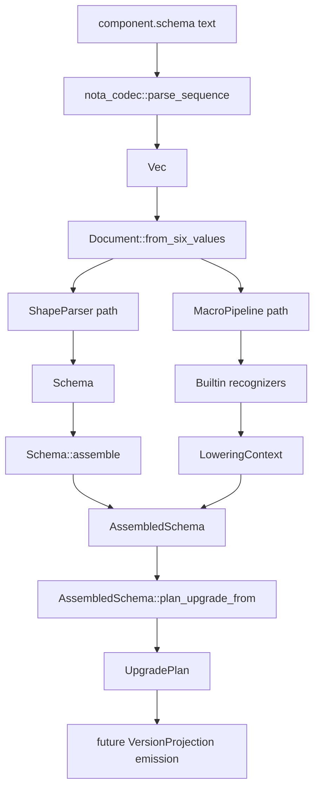
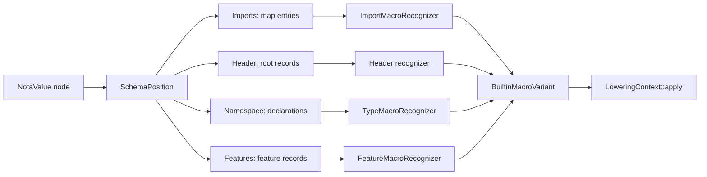
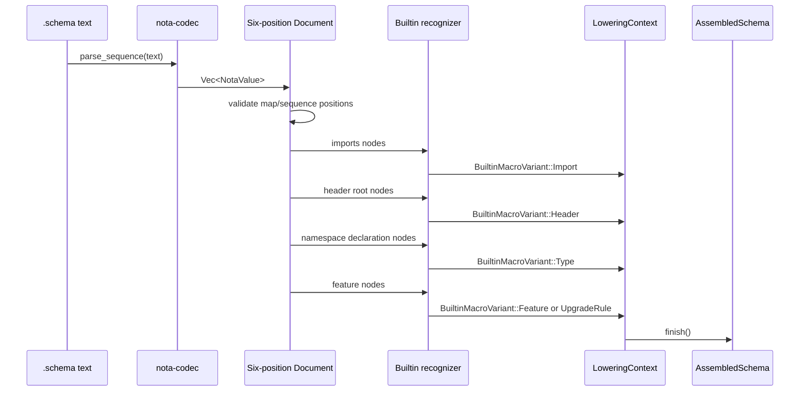
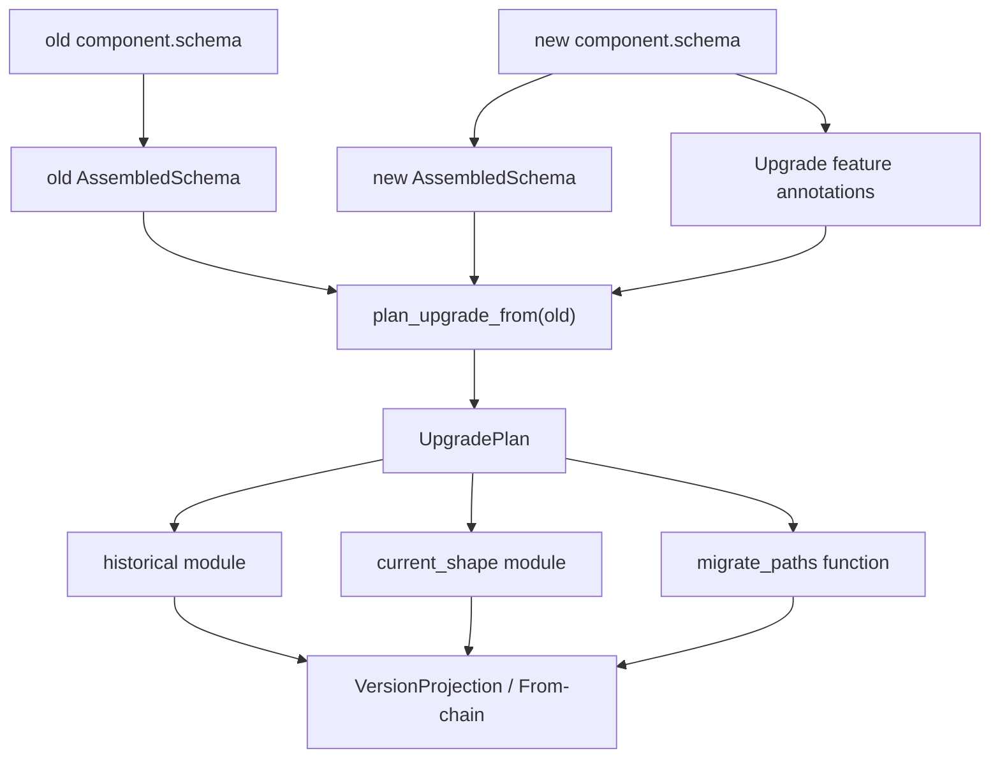

# 189 - Schema engine running model

Kind: Operator design report  
Topic: How the schema engine runs with NotaValue shape macros  
Lane: second-operator  
Date: 2026-05-25

## Bottom Line

I see the schema engine as a small, staged compiler for `.schema` files.
The language surface is the six-position `.schema` file; the parse substrate
is `nota_codec::NotaValue`; the first real semantic layer is shape-method
dispatch; the target object is `AssembledSchema`; the upgrade target is an
`UpgradePlan` and later generated `VersionProjection` code.

The important point is that macros do not need a large macro language first.
The first macro system is just this:

```rust
match (schema_position, value.kind()) {
    (SchemaPosition::Imports, NotaValueKind::Map) => lower_import_map(value),
    (SchemaPosition::OrdinaryHeader, NotaValueKind::Sequence) => lower_header(value, Leg::Ordinary),
    (SchemaPosition::OwnerHeader, NotaValueKind::Sequence) => lower_header(value, Leg::Owner),
    (SchemaPosition::SemaHeader, NotaValueKind::Sequence) => lower_header(value, Leg::Sema),
    (SchemaPosition::Namespace, NotaValueKind::Map) => lower_namespace(value),
    (SchemaPosition::Features, NotaValueKind::Sequence) => lower_features(value),
    _ => Err(schema_shape_error(schema_position, value.kind())),
}
```

Inside each position, the schema engine asks more specific node-shape
questions: `is_tagged_record`, `record_arity`, `record_head_identifier`,
`is_single_ident_record`, `is_sequence`, `is_map`, `identifier_text`, and
`string_text`. That is the "methods on Nota nodes driven macro" model.

## Current Reality Split

There are two live realities.

Mainline reality:

- `nota-codec` main has the generic value tree and the first shape methods.
- `schema` main has tests that parse real Spirit `.schema` fixtures through
  the value tree.
- `schema` main still keeps the canonical reader mostly in the older parser
  shape.

Feature-branch reality:

- `~/wt/github.com/LiGoldragon/nota-codec/fully-schema-and-nota-mvp`
  adds the fuller shape vocabulary: `NotaValueKind`, `NotaRecordShape`,
  `NotaSequenceShape`, `NotaMapShape`, `string_text`, `record_head_value`,
  `is_single_ident_record`, and shape wrapper accessors.
- `~/wt/github.com/LiGoldragon/schema/fully-schema-and-nota-mvp` makes
  `Schema::parse_str` use `ShapeParser::new(input)?.parse_schema()`.
- The same schema worktree adds `schema::multi_pass`, which proves a
  macro-pipeline path over real `.schema` text and compares it against the
  canonical assembly result.

The branch work is the model I am describing here. The remaining operator job
is to converge it onto main without losing main's span-aware `nota-codec`
surface.

## Whole Run Visual



The ShapeParser path is the production-reader replacement. The MacroPipeline
path is the proof that the same `NotaValue` nodes can drive builtin macro
recognition and lowering. The two paths need to converge so the engine has one
semantic center instead of a parser path and a macro path that merely agree by
test.

## The Six Positions

The `.schema` file is not wrapped in an outer record because the file extension
already supplies the type. The schema engine reads exactly six top-level Nota
values:

```nota
{ Magnitude (ImportAll ./sema.schema) }
[(State [Statement Declaration]) (Record [Entry])]
[]
[]
{
  State [(Statement Statement) (Declaration Declaration)]
  Record [(Entry Entry)]
  Topic (String)
  Kind [Decision Principle Correction Clarification Constraint]
  Entry (Topic Kind)
}
[(Reply RecordAccepted) (Upgrade (FromVersion v0.1.0) (Migrate Entry))]
```

Position meaning:

1. imports map
2. ordinary working header roots
3. owner/policy header roots
4. sema-operation header roots
5. namespace map
6. feature vector

The engine first validates only these container shapes. It does not interpret
the whole file at once. It enters each position with position context and then
dispatches on node shape.

## Position Dispatch Visual



The shape question alone is not enough; the same record shape can mean
different things in different positions. `(Import ./foo [Bar])` is meaningful
inside imports, while `(Reply RecordAccepted)` is meaningful inside features.
The dispatch key is therefore `(schema position, NotaValue shape)`.

## Shape Parser Path

The feature branch has the parser replacement in `schema/src/shape_parser.rs`:

```rust
impl Schema {
    pub fn parse_str(input: &str) -> Result<Self> {
        ShapeParser::new(input)?.parse_schema()
    }
}

struct ShapeParser {
    values: Vec<NotaValue>,
}

impl ShapeParser {
    fn new(input: &str) -> Result<Self> {
        let values =
            nota_codec::parse_sequence(input).map_err(|error| nota_error("schema", error))?;
        Ok(Self { values })
    }

    fn parse_schema(self) -> Result<Schema> {
        if self.values.len() != 6 {
            return Err(Error::InvalidSchemaText {
                context: "schema",
                message: format!("expected 6 top-level values, got {}", self.values.len()),
            });
        }

        Schema::new(
            self.parse_imports(&self.values[0])?,
            self.parse_header(&self.values[1], "ordinary header")?,
            self.parse_header(&self.values[2], "owner header")?,
            self.parse_header(&self.values[3], "sema header")?,
            self.parse_namespace(&self.values[4])?,
            self.parse_features(&self.values[5])?,
        )
    }
}
```

This is not yet "macro all the way down"; it is the direct parser path over
`NotaValue`. It is still valuable because it makes the generic tree parser the
canonical reader substrate.

## Multi-Pass Macro Path

The macro path in `schema/src/multi_pass.rs` is the more important proof:

```rust
pub fn read_schema_six_position(text: &str) -> Result<AssembledSchema> {
    let raw_values = parse_sequence(text).map_err(|error| Error::InvalidSchemaText {
        context: "multi_pass parse_sequence",
        message: error.to_string(),
    })?;
    let document = Document::from_six_values(raw_values)?;
    let mut pipeline = MacroPipeline::new(&document);
    pipeline.run()
}

impl Document {
    pub fn from_six_values(values: Vec<NotaValue>) -> Result<Self> {
        if values.len() != 6 {
            return Err(Error::InvalidSchemaText {
                context: "multi_pass structural pass",
                message: format!(
                    "expected six top-level values for a .schema file, got {}",
                    values.len()
                ),
            });
        }

        let mut iter = values.into_iter();
        let imports = iter.next().unwrap();
        let ordinary_header = iter.next().unwrap();
        let owner_header = iter.next().unwrap();
        let sema_header = iter.next().unwrap();
        let namespace = iter.next().unwrap();
        let features = iter.next().unwrap();

        expect_kind("imports", &imports, NotaKind::Map)?;
        expect_kind("ordinary header", &ordinary_header, NotaKind::Sequence)?;
        expect_kind("owner header", &owner_header, NotaKind::Sequence)?;
        expect_kind("sema header", &sema_header, NotaKind::Sequence)?;
        expect_kind("namespace", &namespace, NotaKind::Map)?;
        expect_kind("features", &features, NotaKind::Sequence)?;

        Ok(Self { imports, ordinary_header, owner_header, sema_header, namespace, features })
    }
}
```

This is where the engine becomes a macro engine: `Document` names the positions,
`MacroPipeline` walks them in order, and recognizers turn generic nodes into
typed macro inputs.

## Macro Application Visual



The recognizer is not an external string preprocessor. It is the semantic
adapter between a generic Nota node and a typed schema macro input.

## Import Recognition

Imports are the cleanest example of node-method-driven dispatch:

```rust
impl ImportMacroRecognizer {
    fn recognize(binding: &Name, value: &NotaValue) -> Result<RecognizedImport> {
        if !value.is_record() {
            return Err(Error::InvalidSchemaText {
                context: "multi_pass import",
                message: format!(
                    "import directive for `{binding}` must be a `(Import ...)` or `(ImportAll ...)` record"
                ),
            });
        }

        if value.is_tagged_record("Import") {
            if value.record_arity() != Some(3) {
                return Err(Error::InvalidSchemaText {
                    context: "multi_pass import",
                    message: format!(
                        "`(Import <path> [<name>...])` for `{binding}` requires 3 positions"
                    ),
                });
            }
            let items = value.as_record().unwrap();
            let path = identifier_or_string(&items[1])?;
            let names_value = &items[2];
            if !names_value.is_sequence() {
                return Err(Error::InvalidSchemaText {
                    context: "multi_pass import",
                    message: format!("`(Import ...)` for `{binding}` requires a `[name ...]` list"),
                });
            }
            /* lower selected import names */
        }

        if value.is_tagged_record("ImportAll") {
            /* lower whole import binding */
        }

        /* reject unknown import directive */
    }
}
```

The macro sees the node only through affordances: record-ness, tag, arity,
sequence-ness, identifier/string text. That is the right layer boundary.

## Type Recognition

The type macro is the real center of the schema language. It converts the
namespace map's value shapes into declarations:

```rust
impl TypeMacroRecognizer {
    fn recognize(value: &NotaValue) -> Result<DeclarationBody> {
        if value.is_sequence() {
            return Self::recognize_enum(value);
        }
        if value.is_record() {
            return Self::recognize_record_or_newtype(value);
        }
        if value.is_identifier() {
            let expr = lower_type_expression(value)?;
            return Ok(DeclarationBody::Alias(expr));
        }
        Err(Error::InvalidSchemaText {
            context: "multi_pass type",
            message: format!("namespace value cannot be lowered: shape is unsupported ({value:?})"),
        })
    }
}
```

My read of the intended semantic table:

```text
Foo                  -> alias/reference to type Foo or primitive Foo
(Foo)                -> newtype over Foo
(field Foo)          -> named field, when field is lowercase instance name
(Foo Bar Baz)        -> positional record over type expressions
[A B C]              -> enum with unit variants
[(A Foo) (B Bar Baz)] -> enum with data-carrying variants
(Vec Foo)            -> vector type expression
(Option Foo)         -> optional type expression
(Map Key Value)      -> map type expression
```

This table is intentionally small. The macro power comes from composing these
few node shapes with position context, not from adding a second language inside
Nota.

## Feature And Upgrade Recognition

Features are a vector of records. The record head selects the feature macro:

```rust
match head {
    "Reply" => lower_reply(items),
    "Event" => lower_event(items),
    "Observable" => lower_observable(items),
    "Upgrade" => UpgradeFeatureRecognizer::recognize(value).map(Feature::Upgrade),
    other => Err(unknown_feature(other)),
}
```

Upgrade currently lowers to schema data:

```nota
(Upgrade (FromVersion v0.1.0) (Migrate Entry) (RenamedFrom Magnitude Certainty))
```

That is not yet generated migration code. It is the marker that gives
`AssembledSchema::plan_upgrade_from` and the future upgrade emitter the human
annotations they need when pure structural diff is not enough.

## Upgrade Run Visual



The upgrade macro should not guess intent. It should combine structural diff
with explicit schema annotations. Identity, added, removed, renamed,
untranslatable, custom, and container/field transformations are all outputs of
that comparison plus annotation pass.

## What I Think The Runtime API Should Become

The durable shape is a small set of nouns with methods:

```rust
pub struct SchemaDocument {
    imports: NotaValue,
    ordinary_header: NotaValue,
    owner_header: NotaValue,
    sema_header: NotaValue,
    namespace: NotaValue,
    features: NotaValue,
}

impl SchemaDocument {
    pub fn from_text(text: &str) -> Result<Self>;
    pub fn into_schema(&self) -> Result<Schema>;
    pub fn into_assembled_schema(&self) -> Result<AssembledSchema>;
}

pub struct MacroPipeline<'document> {
    document: &'document SchemaDocument,
    context: LoweringContext,
}

impl<'document> MacroPipeline<'document> {
    pub fn run(&mut self) -> Result<AssembledSchema>;
}
```

The current feature branch has these pieces in less-polished names. The logic
is present; the next refinement is making the noun boundaries explicit and
public only where they are real API.

## Where Fixed-Point Macros Fit

The current MVP has one pass over builtin macro positions. That is enough for
the present Spirit schema because all builtin macro nodes are already visible.

The eventual fixed-point model is:

```rust
loop {
    let before = space.macro_count();
    space.expand_next_pass(&registry)?;
    if space.macro_count() == before {
        break;
    }
}
```

But I do not think this should land as an abstract registry before the builtin
path is clean on main. The safe progression is:

1. land `NotaValue` shape API on main;
2. land `SchemaDocument` over six top-level values;
3. land builtin recognizers that produce `AssembledSchema`;
4. unify `Schema::parse_str` and `multi_pass::read_schema_six_position`;
5. add fixed-point only when a real macro can emit new macro nodes.

## Test Surface That Matters

The feature branch already has the right kind of tests.

`tests/multi_pass.rs` proves:

```rust
#[test]
fn shape_parser_is_equivalent_to_streaming_decoder_for_spirit_fixture() {
    let text = include_str!("fixtures/schema-e2e/spirit-v0-1-1.schema");

    let shape_parser_schema = Schema::parse_str(text).expect("shape parser accepts fixture");
    let streaming_schema =
        Schema::parse_str_with_streaming_decoder(text).expect("streaming parser accepts fixture");

    assert_eq!(shape_parser_schema, streaming_schema);
}
```

`tests/multi_pass_pipeline.rs` proves the stronger assembled-object claim:

```rust
#[test]
fn pipeline_lowers_live_spirit_schema_byte_equivalent_to_canonical_reader() {
    let multi_pass = read_schema_six_position(LIVE_SPIRIT_TEXT).expect("multi-pass reads ok");
    let canonical_schema = Schema::parse_str(LIVE_SPIRIT_TEXT).expect("canonical parser reads ok");

    let resolutions = vec![
        ImportResolution::new(
            Name::new("Magnitude").unwrap(),
            vec![Name::new("Magnitude").unwrap()],
        )
        .unwrap(),
    ];
    let canonical = canonical_schema
        .assemble(&resolutions)
        .expect("canonical assemble ok");

    assert_eq!(
        format!("{multi_pass:#?}"),
        format!("{canonical:#?}"),
        "multi-pass pipeline diverges from canonical Schema::parse_str + assemble"
    );
}
```

The next test I would add after merge is an actual local-import fixture with
multiple `./*` imports, not only the Spirit fixture's known imported names. The
engine needs one end-to-end proof where two sibling `.schema` files are loaded,
their namespace exports are resolved, and a downstream schema imports a selected
subset from each.

## Merge And Implementation Order

The merge order should stay conservative:

1. Rebase and land the `nota-codec` feature branch onto current main.
2. Preserve main's `ByteRange`, `Lexer::next_token_with_span`, `parse_str`,
   `parse_sequence`, and span tests.
3. Repoint the `schema` feature branch back to `nota-codec` main after the
   `nota-codec` merge.
4. Land the `schema` feature branch.
5. Collapse the duplicated parser/macro paths so `Schema::parse_str` and
   `read_schema_six_position` do not diverge.
6. Start upgrade-code emission from `UpgradePlan`.

## Questions I Would Put In Front Of The Psyche

1. Should the old streaming schema parser remain as a temporary diagnostic
   backstop after the shape parser lands, or should it be deleted immediately
   once equivalence tests pass? My lean is delete after one clean branch cycle
   because two canonical readers will drift.

2. Is the six-position `SchemaDocument` type allowed to become the public
   stable API of the schema crate, or should the public API stay at
   `Schema::parse_str` and `AssembledSchema` only? My lean is public
   `SchemaDocument` for introspection, but keep recognizers private until user
   macros are real.

3. Should import resolution happen before builtin macro lowering, or should
   imports lower into unresolved `AssembledSchema` entries and resolve later?
   My lean is imports lower first into an explicit import table, then type
   lowering can produce local/imported declarations against that table.

4. For fixed-point macros, do we need a first-class `MacroSpace` object now,
   or can the first mainline release keep `MacroPipeline` as the object and
   add `MacroSpace` only when user macros emit new nodes? My lean is defer the
   larger object until a real macro needs it.

## Operator Lean

The implementation is close enough to make the architecture real, but not
yet shaped enough to call done. The two most important cleanups are:

- make `SchemaDocument` the obvious noun for the six-position file;
- make the macro recognizers the only place where schema-specific shape
  recognition happens.

Everything else should hang off those two nouns. If a future function wants to
ask "what kind of schema thing is this node?", the answer should be a method or
recognizer on one of those nouns, not a new free helper scattered through the
crate.
