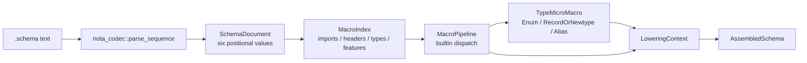

*Kind: Implementation Report · Topic: schema macro-index mainline port · Date: 2026-05-25 · Lane: second-operator*

# 190 — Schema mainline macro-index port

## What Landed

I ported the strongest slice from `reports/second-designer/188-schema-engine-running-walkthrough-2026-05-25.md`, `reports/second-designer/189-macro-system-broader-understanding-2026-05-25.md`, and this lane's earlier schema reports onto production `main`.

Production commits:

- `nota-codec` main: `d00fbf53808f` — `nota-codec: exclude target artifacts from flake source`
- `schema` main: `da7b6d0a10f9` — `schema: drive reader and multi-pass pipeline from NotaValue shapes`
- `schema` main: `b754a0e492f2` — `schema: index macro candidates before lowering`

## Current Running Shape



The important change from `/188` is that the end-to-end path is no longer only a feature-branch proof. `schema::Schema::parse_str` now reads through `nota_codec::parse_sequence` and `shape_parser`, and `schema::multi_pass::read_schema_with_report` runs the macro-front pipeline against real `.schema` text.

The important change from `/189` is that the engine now has a real indexing pass and the first explicit micro-macro selector:

- `MacroIndex` records import, header, namespace type, and feature candidates before macro firing.
- `MacroIndexReport` is exposed through `PipelineReport` so tests can assert the pass observed the expected endpoints.
- `TypeMicroMacro` performs the first structure-match step for namespace values, selecting `Enum`, `RecordOrNewtype`, or `Alias` before the transformation logic runs.
- `ARCHITECTURE.md` now names the NotaValue parser, macro index, micro-macro selector, and old streaming parser's temporary compatibility role.

## Tests

Verified in `schema` after rebasing onto current main:

```text
cargo test
nix flake check --option max-jobs 0 --print-build-logs
```

Both passed. The Nix check covered build, fmt, clippy, docs, full tests, and the targeted upgrade-rule macro variant test.

The live fixture coverage includes real local relative imports:

- `tests/fixtures/schema-e2e/spirit-v0-1.schema`
- `tests/fixtures/schema-e2e/spirit-v0-1-1.schema`
- imported sibling files `./magnitude.schema`, `./sema.schema`, and `./shared.schema`

The multi-pass live test still compares byte-equivalent `AssembledSchema` output against the canonical reader path.

## Remaining Holes

The next production slices are now sharply bounded:

1. Fixed-point macro iteration is not implemented yet. Current builtins are single-pass over indexed candidates.
2. User/extension macro loading is not implemented yet. Core macros are in Rust recognizers, not authored schema macro libraries.
3. Lazy imported macro lookup is not implemented yet. The `MacroIndex` is the foothold, but import resolution still records schema imports rather than loading macro libraries by name.
4. Upgrade derivation is still at the existing `Upgrade` / `plan_upgrade_from` model. The schema-change upgrade macro is not yet emitted from this macro-front pipeline.
5. The streaming parser still exists as a compatibility/equivalence backstop. It can be deleted after the shape parser and macro-front path have one clean integration cycle across Spirit and Orchestrate.

## Questions

1. Should the next schema slice prioritize fixed-point iteration for builtin macros, or user macro library loading?
2. Should macro-library imports use the ordinary imports map with a distinct directive, or a separate schema position / feature form?
3. Should we delete the streaming parser as soon as Spirit and Orchestrate both consume the shape parser, or keep it until code generation lands?
