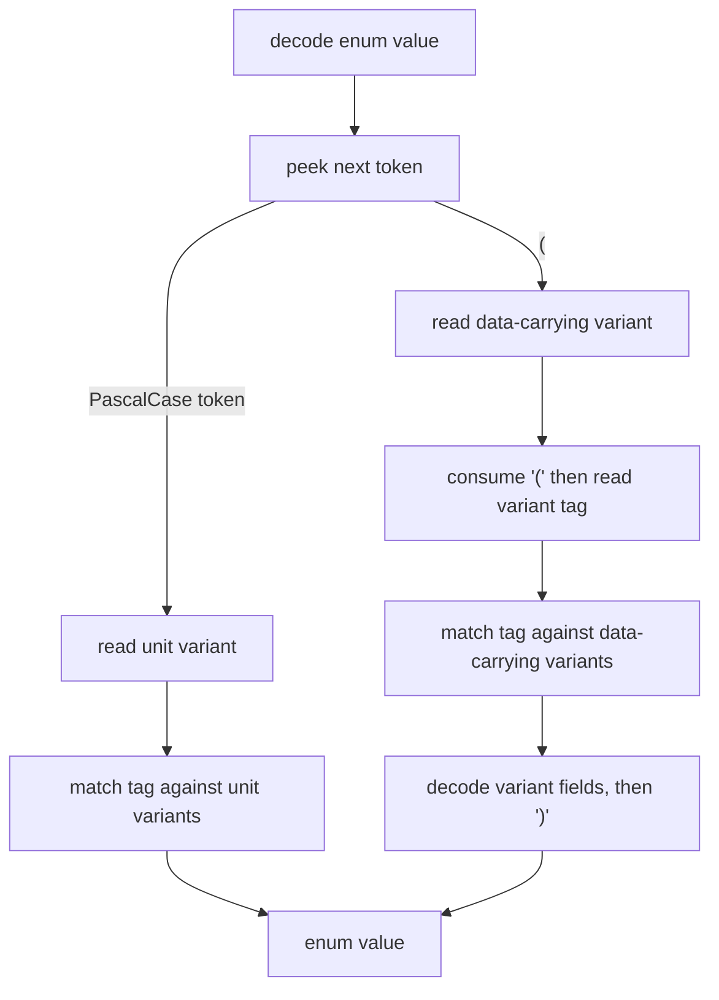

# 4 — NOTA mixed-enum support vision

## 0 · Summary

`reports/system-assistant/27-nota-mixed-enum-support.md` is right on
the essential shape: NOTA needs one enum derive that supports both
non-data-carrying variants and data-carrying variants in the same Rust
enum. The grammar already has the distinction:

```nota
UnitVariant
(DataVariant <fields...>)
(<struct-fields...>)
```

The implementation should pay the complexity cost once in
`nota-derive` and `nota-codec`, not force every domain enum to split
or pretend unit variants carry empty data. The source report's broad
downstream sweep is not necessary to prove this design. Downstream
repositories only matter after the codec/derive shape lands and the
workspace performs the mechanical `NotaSum` retirement.

This is a research / implementation-vision report. Destination home:
`nota`'s `README.md` for the grammar statement, `nota-derive`'s
`ARCHITECTURE.md` / `README.md` for derive ownership, and
`nota-codec` tests for the executable witness.

## 1 · The Shape

The current split is wrong because it makes Rust enum shape depend on
the codec's convenience:

| Current derive | Allows | Wire form |
|---|---|---|
| `NotaEnum` | unit variants only | `Variant` |
| `NotaSum` | data-carrying variants only | `(Variant fields...)` |

The right derive is simply `NotaEnum` over every legal Rust enum
variant shape that NOTA can express:

| Rust variant | NOTA form |
|---|---|
| `Variant` | `Variant` |
| `Variant(Type)` | `(Variant <encoded Type>)` |
| `Variant { field, ... }` | `(Variant <field> ...)` |

This follows the three-case rule instead of adding a second conceptual
category. `NotaSum` is not a separate language feature; it is the
data-carrying half of enum support that should have lived under
`NotaEnum` from the start.

## 2 · Decoder Model

The unified enum decoder dispatches on the next token:



`nota-codec` already has a pushback queue and `peek_token()`. The
implementation can either use `peek_token()` directly or add a tiny
`peek_is_record_start()` helper for readability. A new helper is
convenience, not the hard part.

The important point: a bare PascalCase token is legal only for unit
variants; an opening parenthesis means the enum value must be one of
the data-carrying variants. This keeps errors precise:

| Input shape | If tag is unknown |
|---|---|
| `Mystery` | unknown enum variant `Mystery` |
| `(Mystery ...)` | unknown enum variant `Mystery` |
| `(UnitVariant)` | error: unit variant appeared in data-carrying form |
| `DataVariant` | error: data-carrying variant appeared without fields |

## 3 · Derive Model

`nota-derive` should make `nota_enum.rs` the unified implementation.
It partitions variants into two generated arm groups:

| Group | Variant shapes | Encode arm | Decode arm |
|---|---|---|---|
| Unit | `Fields::Unit` | write PascalCase identifier | read bare PascalCase |
| Data | one-field tuple or named fields | start tagged record, encode fields, close record | consume tagged record, decode fields, close record |

Multi-field tuple variants should remain rejected. They have the same
problem as multi-field tuple structs: positional values exist, but
field names do not live in the Rust schema.

`NotaSum` then retires. Keeping it as an alias is a transitional
shape, and this workspace explicitly rejects transitional shapes when
the clean break is available. The old `UnknownKindForVerb` error can
either retire with `NotaSum` or stay only as a compatibility variant
until no public API mentions it. The cleaner API is one
`UnknownVariant` failure for all enum derives.

## 4 · Implementation Sequence

The implementation path I would hand to operator is:

1. In `nota-codec`, expose a small predicate for the unified enum
   decoder if direct `peek_token()` usage makes generated code noisy.
   Keep it protocol-shaped: a method on `Decoder`, not a helper
   function.
2. In `nota-derive`, rewrite `NotaEnum` to accept unit, newtype, and
   named-field variants. Reuse the existing `NotaSum` field-generation
   logic, but avoid double-reading the variant tag.
3. Add `nota-codec/tests/nota_mixed_enum_round_trip.rs` with one enum
   containing at least one unit variant, one newtype variant, and one
   named-field variant. This is the primary witness.
4. Add negative tests for `(UnitVariant)`, bare `DataVariant`, unknown
   bare tag, unknown parenthesized tag, and multi-field tuple variant.
5. Remove `NotaSum` from re-exports, docs, and derive entry points.
6. Run `nix flake check` in `nota-derive` and `nota-codec`.
7. Only after the core lands, do the workspace mechanical sweep from
   `NotaSum` to `NotaEnum` and migrate authored data that used
   `(UnitVariant)` for empty struct workarounds.

Step 7 is downstream cleanup, not design validation.

## 5 · Acceptance Witnesses

The tests that matter are small and direct:

| Witness | Proves |
|---|---|
| `mixed_enum_round_trips_unit_variant` | `Variant` decodes and re-encodes as bare PascalCase |
| `mixed_enum_round_trips_newtype_variant` | `(Variant inner)` remains valid |
| `mixed_enum_round_trips_struct_variant` | `(Variant fields...)` remains valid |
| `unit_variant_rejects_parenthesized_empty_form` | no more `(TailnetClient)` workaround |
| `data_variant_rejects_bare_form` | data-carrying variants must carry data |
| `multi_field_tuple_variant_is_rejected` | positional fields stay named in Rust schema |

The architectural truth test is: one Rust enum type can contain both
unit and data variants, and the derive emits the natural NOTA form for
each. A downstream enum like `NodeService` is a good example, but it is
not the proof.

## 6 · Judgment

I would implement this as a hard `NotaSum` retirement, not a staged
compatibility period. The old split encodes a false distinction in the
public API, and keeping both names would teach future agents the wrong
model.

The durable rule is simple enough to state in one sentence:

`NotaEnum` means Rust enum; each variant chooses its NOTA shape by
whether it carries data.

That is the model agents should carry forward.
