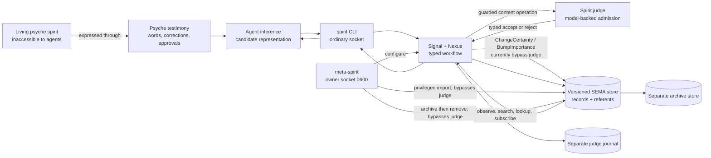
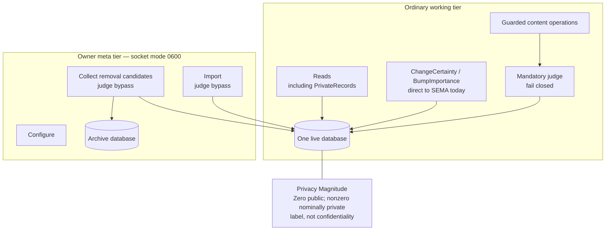
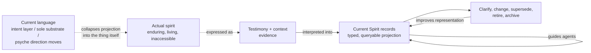

# Spirit: current architecture, vision, and dilemma

Status: corroborated synthesis prepared 2026-08-01 from recovered first-party
psyche vision, checked-in source, deployed composition, direct read-only runtime
observation, and an independent architecture audit. The production store and
protected queued capture were not opened.

## At a glance



The intended object and the deployed object are not identical:

```text
psyche's actual spirit  ≠  Spirit's current recorded representation
ordinary intent         ≠  spirit
read-only consultation  ≠  approval-gated capture or mutation
```

## Recovered psyche vision

The target session recovers four governing points:

1. **Spirit holds a computer representation of the psyche's spirit.** The living
   spirit itself is not directly available to an agent; agents infer it, as they
   infer psyche vision.
2. **The content is spirit, not intent.** “Intent” is freed for ordinary
   intention—what the psyche wants—which is distinct from the more enduring
   substance represented by Spirit.
3. **Correctness is an explicit example of spirit.** Added machinery is justified
   when greater correctness makes later growth simpler and more natural; the
   psyche characterized this as enduring rather than merely expedient.
4. **The immediate desired state is reliable restoration.** Bring Spirit back
   through its declarative operating-system owners, validate the queued
   approved capture against the live contract without changing its protected
   wording, and restore a guarded consultation facility—not merely green
   processes.

The vocabulary change is semantic, not a global search-and-replace. Each use of
“intent” must be classified as either Spirit-content or ordinary intention.
Read-only consultation and capture/mutation remain separate authority classes.
Exact replacement doctrine and the routine consultation policy were left for
psyche review.

## Observed current architecture and runtime

### Component and authority map

| Layer | Current owner | Observed responsibility |
|---|---|---|
| Human/agent text edge | `spirit` and `meta-spirit` CLIs | Parse and render DOTOS; daemon wire remains typed binary rkyv. |
| Ordinary contract | `signal-spirit` | Record/propose/clarify/supersede/retire, query/search/lookup, public/private shortcuts, and subscriptions. |
| Privileged contract | `meta-signal-spirit` | Configure, import, removal collection, and head observation. |
| Runtime | `spirit` | Signal admission, Nexus orchestration, SEMA persistence, judge bridge, subscriptions, migration, and optional source-only Criome/mirror paths; mirroring is absent from the deployed daemon package. |
| Semantic admission | `signal-spirit-judge` → `spirit-judge` → `judge` → configured model | Typed request/reply, Spirit-specific prompt adaptation, provider mechanics, fail-closed verdict. |
| Durable state | `sema-engine` through Spirit's `Store` | One versioned live corpus; a separate unversioned judge audit and separate archive database. |
| Deployment | `CriomOS-home`, pinned through `CriomOS` | Declares the judge and daemon services, their dependency, sockets, model adapter, and binary configuration. |

### Authority and privacy boundary



Public/private is currently a query and handling policy over one database, not a
security boundary. `PrivateRecords` is on the ordinary working surface. The
architecture explicitly reports no encryption, storage segregation, or enforced
access gate; genuinely sensitive material therefore has no safe home in this
store. Private judge diagnostics are redacted, but content may cross the
explicitly configured model-provider boundary for judgment.

### Runtime observation on 2026-08-01

| Unit | Observed state | Consequence |
|---|---|---|
| `spirit-judge.service` | `failed`, `start-limit-hit`, exit 203 | An unmanaged systemd drop-in overrides the declared wrapper with an obsolete collected Nix path. |
| `spirit-daemon.service` | `inactive`, `dead` | It requires the judge; the corpus cannot currently be consulted or mutated through the service. |

The checked-in Home configuration already declares the corrected judge wrapper
and the fail-closed service dependency. This is deployed-state drift from its
declarative owner, not proof that the checked-in topology itself is defective.
No judge socket exists, and the ordinary/meta socket pathnames are stale files,
not listeners.
The recovery must remove or migrate the stale override declaratively and prove
activation, store identity, socket ownership, judge failure behavior, and
restart recovery. This report did not read the production corpus or mutate any
service.

The runtime is also architecturally transitional: Spirit still builds on the
legacy schema toolchain while its accepted destination is Ethos-based generation.
That migration has not landed. The deployed closure is older and independently
pinned, so working-tree source describes the implemented direction but is not by
itself proof of the exact deployed binary.

### Corroborated contract gaps

| Gap | Operational consequence |
|---|---|
| The source `intent-log` skill contains classification rules but no query syntax, transport, capture envelope, approval bridge, or unavailable-service behavior. | The manual demands routine consultation, but agents have no executable consultation contract. |
| `ChangeCertainty` and `BumpImportance` bypass the judge although certainty controls visibility and removal candidacy. | “Every corpus-changing working write is judged” is false; the authority model is internally uneven. |
| The service makes the whole daemon require the judge although reads need no semantic judgment in code. | A judge packaging failure removes consultation as well as write admission—the mechanism of the present total outage. |
| The manual promises operations and identity shapes absent from the schema/runtime. | Documentation mixes target design with implemented behavior and cannot be treated as a wire reference. |
| Removal archives to one database and then retracts from another, per item. | Failure is reported and preserves the live row, but archive/removal is not one atomic cross-store transition. |

## The central dilemma



Spirit's recorded representation must be **authoritative enough to guide work**
and **fallible enough to be corrected** without claiming that the psyche's
actual spirit changed. Today the system strongly protects admission, yet it has
no executable agent consultation bridge, and judge failure removes the read side
along with the write side. The current ontology and deployment do not state or
serve the distinction cleanly:

- The manual still calls Spirit the “intent layer” and explicitly argues that
  “Intent stays”; the wire exposes `PublicIntent`, `SubscribeIntent`, and
  `IntentEvent`. This conflicts with the later psyche ruling.
- The lifecycle prose says records change as the psyche's direction moves. That
  is coherent for ordinary intention, but spirit was characterized as enduring.
  Clarification and supersession need to mean correction of the representation,
  not mutation of the spirit itself.
- The deployed store is called the sole substrate/source of truth. It can be
  canonical for the **current recorded projection and its evidence**, but cannot
  be the ontological source of the inaccessible living spirit.
- Nominal private records give a false-looking but explicitly disclaimed
  confidentiality boundary.
- Admission authority is uneven: most content operations are judged, while
  certainty and importance mutations are not; the owner tier deliberately
  bypasses judgment for import and collection.

The smallest coherent conceptual architecture is:

```text
living psyche spirit
    ↓ expressed through
verbatim testimony and context
    ↓ interpreted into
current typed Spirit projection
    ↺ revised when the interpretation becomes more faithful
```

This also exposes a sequencing dilemma. Spirit is offline and therefore cannot
serve as the consultation surface needed to guide its own semantic migration.
Recovery and redesign are both necessary, but coupling them would make failure
attribution and store safety worse. The evidence-backed boundary is: restore the
existing pinned contract and prove the unchanged store first; perform the
spirit-vocabulary and Ethos migration separately against an isolated copy.

## Decisions requiring psyche answers

1. **Eternity boundary:** Is “eternal and unchanging” required of every admitted
   Spirit record, or is it the character of the underlying spirit while recorded
   projections may remain provisional?
2. **Lifecycle meaning:** May the system canonically define clarification,
   supersession, and retirement as corrections to the recorded projection rather
   than changes to the psyche's spirit?
3. **Confidentiality posture:** Should Spirit remain public-only until key-gated
   storage exists, with private testimony held elsewhere, or is a separate
   secure-private Spirit store required now?
4. **Vocabulary migration:** Should old `Intent*` wire nouns break immediately,
   or remain only as narrow migration aliases until the production store is
   folded onto the new contract?
5. **Consultation policy:** When must agents consult Spirit, what evidence should
   be returned, and how should a read influence work without authorizing a write?
6. **Doctrine wording:** What exact replacement prose should own the workspace's
   current “Intent” section and the source skill that governs Spirit capture?

## Compact evidence ledger

| Claim | Evidence |
|---|---|
| Recovered meaning, rename, correctness principle, and reliable-restoration aim | [vision recovery](/home/li/primary/reports/spirit-vision-recovery-019fad58.md:5), [approved rulings](/home/li/primary/design/ProtosEngine/traitStandardAndSpiritRename-2026-08-01.md:8) |
| Revival is declarative; queued capture envelope must be validated without altering protected text | [revival handoff](/home/li/primary/handoffs/spirit-revival-prompt.md:6) |
| Rename is semantic; exact doctrine and consultation design remain review surfaces | [revival handoff](/home/li/primary/handoffs/spirit-revival-prompt.md:22), [recovered ambiguity](/home/li/primary/reports/spirit-vision-recovery-019fad58.md:136) |
| Ordinary/meta contract split and runtime triad | [Spirit architecture](/git/github.com/LiGoldragon/spirit/ARCHITECTURE.md:21), [ordinary schema](/git/github.com/LiGoldragon/signal-spirit/schema/signal.schema:44), [meta schema](/git/github.com/LiGoldragon/meta-signal-spirit/schema/meta-signal.schema:9) |
| Content admission is judge-gated, but certainty/importance mutations and owner import/removal bypass it | [guarded record path](/git/github.com/LiGoldragon/spirit/src/nexus.rs:702), [direct mutation routes](/git/github.com/LiGoldragon/spirit/src/nexus.rs:1285), [owner operations](/git/github.com/LiGoldragon/spirit/ARCHITECTURE.md:343) |
| Public/private shortcuts share one nominally private store | [read shortcuts](/git/github.com/LiGoldragon/spirit/ARCHITECTURE.md:530), [known privacy limit](/git/github.com/LiGoldragon/spirit/ARCHITECTURE.md:1009), [judge privacy boundary](/git/github.com/LiGoldragon/spirit-judge/ARCHITECTURE.md:33) |
| Home source declares the corrected judge and daemon dependency | [judge wrapper](/git/github.com/LiGoldragon/CriomOS-home/modules/home/profiles/min/spirit.nix:138), [services](/git/github.com/LiGoldragon/CriomOS-home/modules/home/profiles/min/spirit.nix:202) |
| Current vocabulary contradicts the later ruling | [manual introduction](/git/github.com/LiGoldragon/spirit/manual.md:1), [“Intent stays”](/git/github.com/LiGoldragon/spirit/manual.md:148), [wire nouns](/git/github.com/LiGoldragon/signal-spirit/schema/signal.schema:44) |
| Current lifecycle language treats direction as moving | [record lifecycle](/git/github.com/LiGoldragon/spirit/manual.md:357) |
| Agent doctrine lacks the consultation/capture bridge promised by the manual | [manual consultation](/git/github.com/LiGoldragon/spirit/manual.md:163), [actual source skill](/git/github.com/LiGoldragon/skills/skills/intent-log.md:1) |
| Judge service availability currently gates the entire read/write daemon | [service dependency](/git/github.com/LiGoldragon/CriomOS-home/modules/home/profiles/min/spirit.nix:239), [independent audit](/home/li/primary/agent-outputs/SpiritArchitectureAudit/Audit-Current-Spirit-Architecture.md:181) |
| Archive then retract is fail-loud but not one cross-store atomic transition | [collection implementation](/git/github.com/LiGoldragon/spirit/src/store/mod.rs:643) |
| Current generator is legacy; Ethos port is pending | [Spirit purpose and transition](/git/github.com/LiGoldragon/spirit/ARCHITECTURE.md:3) |
| The store is currently described as the sole substrate/source of truth | [primary architecture](/home/li/primary/ARCHITECTURE.md:22), [intent-layer wording](/home/li/primary/ARCHITECTURE.md:77) |

## Audit outcome and remaining unknowns

The independent audit corroborated the runtime outage, authority split, nominal
privacy boundary, vocabulary conflict, absent consultation bridge, and central
representation dilemma. It corrected the earlier overbroad claim that all
working writes are judged and confirmed that mirroring is not in the deployed
daemon package.

Unknowns remain unknown: production corpus contents, whether the queued capture
duplicates an existing record, and whether deployment changed after the
2026-08-01 observation. The three-layer representation model and
recovery-before-migration boundary are architectural synthesis, not additional
psyche rulings.
