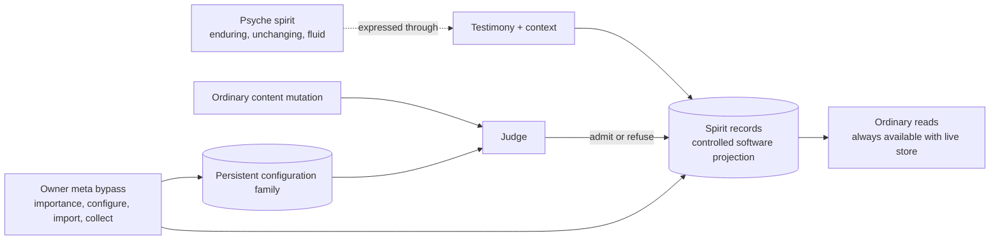
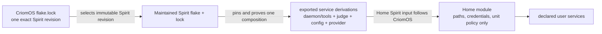
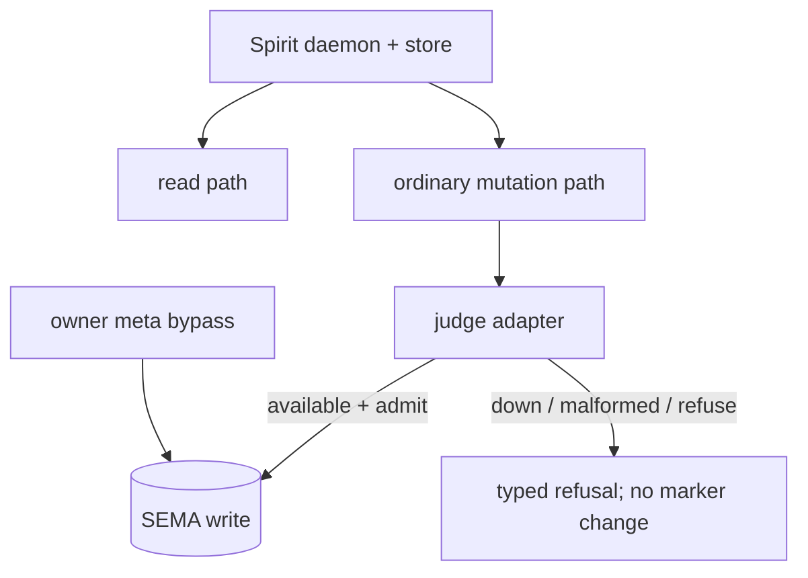
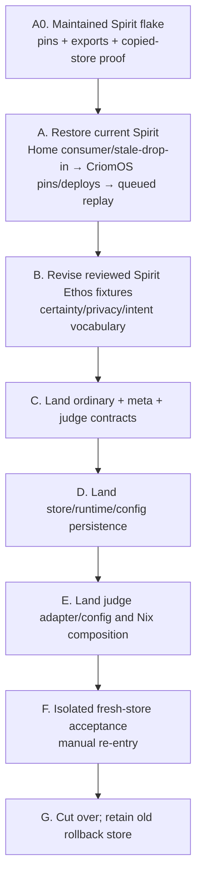

# Spirit enduring projection and availability change design

Status: design only, 2026-08-03. No implementation, service, store, skill, or
bead was changed. This report translates psyche rulings 9–14 into an ordered
cross-repository change surface while keeping immediate restoration independent
from the Protos semantic migration.

## Outcome

Spirit remains an enduring authority that agents may not casually manipulate,
while its software records remain a fallible projection with explicit mutation
authority. The base component loses certainty and every privacy-shaped concept.
Reads survive judge failure; ordinary mutations fail closed; owner-meta bypass
operations remain explicitly privileged. Effective runtime configuration becomes
durable database state. Recovery is reproducible only through service
derivations exported by the maintained Spirit flake; CriomOS pins that flake and
Home instantiates its outputs without becoming a package-version authority.



The diagram does not mean the record *is* the psyche's spirit. Record changes
correct or maintain the software projection; they do not establish that the
underlying spirit changed.

## Authority recovered from the psyche

| Ruling | Design constraint | Evidence |
|---|---|---|
| Spirit is unchanging and fluid | Resist casual agent manipulation, but retain a controlled software mutation path; no exact append-only or revision model was ruled. | [ruling 9](/home/li/primary/design/ProtosEngine/traitStandardAndSpiritRename-2026-08-01.md:187) |
| Remove certainty and privacy | Delete certainty. Core Spirit has no privacy field, query, behavior, judgment scope, or deployment promise; confidentiality belongs to a separate higher-layer Spirit in another environment. | [ruling 10](/home/li/primary/design/ProtosEngine/traitStandardAndSpiritRename-2026-08-01.md:203) |
| Judge failure bars mutation, not reads | The data daemon remains live and serves consultation while ordinary judged writes fail closed. | [ruling 11](/home/li/primary/design/ProtosEngine/traitStandardAndSpiritRename-2026-08-01.md:215) |
| Importance mutation is owner authority | Remove `ChangeCertainty`; move any surviving importance mutation off the ordinary signal and onto meta bypass. | [ruling 12](/home/li/primary/design/ProtosEngine/traitStandardAndSpiritRename-2026-08-01.md:225) |
| Configuration is database state | Meta `Configure` must durably commit effective configuration and restart must reload it. | [ruling 13](/home/li/primary/design/ProtosEngine/traitStandardAndSpiritRename-2026-08-01.md:235) |
| Restore now | Recovery is owned by the existing service goals and must not wait for certainty/privacy removal, Protos, or higher-layer confidentiality design. | [ruling 14](/home/li/primary/design/ProtosEngine/traitStandardAndSpiritRename-2026-08-01.md:245) |
| Recovery comes from the maintained Spirit flake | The Spirit flake pins and proves the complete compatible service composition and exports its derivations. CriomOS pins that flake revision; Home deploys its outputs without choosing component versions. No loose 0.24.1 executable or independently reconstructed closure is a recovery asset. | [ruling 15](/home/li/primary/design/ProtosEngine/traitStandardAndSpiritRename-2026-08-01.md:267) |

## Current ground truth driving the change

| Observation | Exact evidence | Consequence |
|---|---|---|
| The deployed/current Signal contract still exposes certainty, privacy, public/private reads, `ChangeCertainty`, and `BumpImportance`. | [signal.schema](/git/github.com/LiGoldragon/signal-spirit/schema/signal.schema:44), fields and selectors at [196](/git/github.com/LiGoldragon/signal-spirit/schema/signal.schema:196) and [230](/git/github.com/LiGoldragon/signal-spirit/schema/signal.schema:230) | Rulings 10 and 12 require a breaking contract and store migration; they are not restoration prerequisites. |
| `ChangeCertainty` and `BumpImportance` are ordinary Signal inputs routed directly to SEMA writes. | [nexus.rs](/git/github.com/LiGoldragon/spirit/src/nexus.rs:1285) | Remove the first; move any surviving importance setter to the owner meta contract. |
| Daemon construction opens the store and installs guardian configuration without connecting to the judge. Read inputs are classified immediate and route directly to SEMA. | [daemon.rs](/git/github.com/LiGoldragon/spirit/src/daemon.rs:97), lane classification at [173](/git/github.com/LiGoldragon/spirit/src/daemon.rs:173), read routing at [nexus.rs:1264](/git/github.com/LiGoldragon/spirit/src/nexus.rs:1264) | Current code already admits judge-independent reads; restoration needs deployment decoupling and a process witness, not a runtime redesign. |
| Home currently makes Spirit require the judge unit. | [spirit.nix](/git/github.com/LiGoldragon/CriomOS-home/modules/home/profiles/min/spirit.nix:239), specifically `After`/`Requires` at [260](/git/github.com/LiGoldragon/CriomOS-home/modules/home/profiles/min/spirit.nix:260) | `Requires=` is the concrete obstacle to ruling 11. |
| Meta `Configure` mutates live memory, does not enter SEMA, and can partially apply: archive target changes before later mirror validation can reject. | [engine.rs](/git/github.com/LiGoldragon/spirit/src/engine.rs:636), mutation before validation at [657](/git/github.com/LiGoldragon/spirit/src/engine.rs:657) | Lane B needs validate-then-commit of one complete typed value before live application. |
| Store open resets archive configuration to `Default`; `set_archive_target` only assigns the in-memory field. | [store/mod.rs](/git/github.com/LiGoldragon/spirit/src/store/mod.rs:330), setter at [379](/git/github.com/LiGoldragon/spirit/src/store/mod.rs:379) | Ruling 13 is not satisfied by the current startup archive or meta echo. |
| An existing daemon test proves a missing judge refuses a record and the working socket still answers `Observe`; the deployment check instead asserts `Requires=`. | [meta_configure.rs](/git/github.com/LiGoldragon/spirit/tests/meta_configure.rs:171), read witness at [212](/git/github.com/LiGoldragon/spirit/tests/meta_configure.rs:212), [deployment check](/git/github.com/LiGoldragon/CriomOS-home/checks/spirit-deployment/default.nix:166) | Invert the deployment assertion and add the missing process/systemd judge-stop witness. |
| Spirit already locks its internal source composition and exports daemon/CLI/tool packages, but it does not pin or export the `spirit-judge` executable or judge-config data. | [Spirit inputs](/git/github.com/LiGoldragon/spirit/flake.nix:4), [package outputs](/git/github.com/LiGoldragon/spirit/flake.nix:827), [locked source composition](/git/github.com/LiGoldragon/spirit/flake.lock:270) | Extend the maintained Spirit flake as the one release-composition authority; do not create a parallel recovery flake or retain a loose store path. |
| Home currently chooses three independent inputs—Spirit, judge, and judge config—and selects their packages itself. | [Home inputs](/git/github.com/LiGoldragon/CriomOS-home/flake.nix:147), [module selection](/git/github.com/LiGoldragon/CriomOS-home/modules/home/profiles/min/spirit.nix:18) | Remove judge/config version selection from Home. Its only Spirit-side input is an injected maintained Spirit composition. |
| CriomOS already pins one Spirit revision and makes Home's Spirit input follow it, but the judge and config remain nested Home selections. | [CriomOS follows edge](/git/github.com/LiGoldragon/CriomOS/flake.nix:46), [locked Spirit revision](/git/github.com/LiGoldragon/CriomOS/flake.lock:4196), separately locked judge/config at [4254](/git/github.com/LiGoldragon/CriomOS/flake.lock:4254) | Preserve the existing root-to-Home follows edge, move the remaining composition under Spirit, and leave one root Spirit pin in the deployment lock. |
| The daemon and current judge source select different `signal-spirit-judge` revisions. | [Spirit contract dependency](/git/github.com/LiGoldragon/spirit/Cargo.toml:194), [judge contract dependency](/git/github.com/LiGoldragon/spirit-judge/Cargo.toml:29) | The Spirit flake must select and prove one wire-compatible daemon/judge pair; merely building both independent defaults is insufficient. |

## Two independent lanes

### Lane A — restore usable Spirit now

Lane A keeps the current semantic wire and production corpus. It does not rename
types, remove fields, perform the Protos/manual-re-entry migration, or wait for
the blocked Protos Stream work. A store-format migration is permitted only from
the same maintained exported composition after a copied-store proof.

1. In the maintained `spirit` repository, pin the compatible daemon, migration
   tool, judge adapter, judge contract/config data, and any version-bearing
   provider executable needed by the service. Export the resulting service
   derivations and prove their process-level compatibility. This is a current
   recovery composition, not a separately preserved 0.24.1 executable.
2. Complete the narrow Home-owned stale-drop-in migration in `home-giq`, remove
   Home's independent judge/config pins, and consume only the injected Spirit
   flake's service derivations.
3. Relax deployment coupling from `Requires=spirit-judge.service` to
   `Wants=` plus `After=`. A missing/failed judge must not stop or tear down the
   data daemon.
4. Keep the current daemon's guardian requirement. An ordinary mutation with no
   judge must return its typed unavailable/refusal outcome before any store
   write. Reads never call the judge.
5. Commit and push the maintained Spirit revision, then the Home consumer
   revision. CriomOS pins both immutable revisions, with Home's Spirit input
   following the single CriomOS Spirit pin, and deploys through the existing
   `CriomOS-dag` activation path.
6. Prove reads with the judge stopped, fail-closed mutation with an unchanged
   database marker, then judge recovery and accepted mutation without restarting
   the data daemon.
7. Replay the protected queued capture under `primary-7z3.1` only after the
   current contract and judge are healthy; its content remains outside public
   artifacts.

The current deployment uses a binary startup configuration and has transient
meta configuration. Lane A must not depend on a meta `Configure` value surviving
a restart. Persistent configuration is a Lane B contract/store change.

### Lane A version-authority topology



The Spirit flake owns version selection; CriomOS owns deployment revision
selection; Home owns service instantiation. Home may choose paths, auth-secret
references, model/effort/timeout policy, restart policy, and unit relationships,
but not alternate daemon, judge, judge-contract/config, migration-tool, or
provider package revisions.

### Maintained flake output contract

The concrete output name is an implementation design choice; use one typed set,
for example `serviceDerivations.${system}`, containing:

| Export | Required closure |
|---|---|
| `spirit` | Daemon, ordinary/meta CLIs, configuration writer, renderer, and the store migrator built from one Spirit source/lock composition. |
| `judge` | The compatible `spirit-judge` executable built against the selected judge wire contract. |
| `judgeConfig` | Immutable derivation containing the exact compatible prompt/manifest/config data; it is data in the closure, not a Home-selected source checkout. |
| `provider` | The supported external provider executable when the judge service requires a versioned executable path. Secret/auth references remain deployment input. |

Keep the substantial composition and checks in a focused Nix helper/check file,
with `flake.nix` as the readable output index. `flake.lock` owns portable source
pins. `Cargo.lock` and the vendored/patch source map must converge on the same
contract revisions; a green build with two independently selected judge wire
crates is not a compatibility proof.

Home should retain a single injectable `spirit` input handle but no release pin
of its own. A local stub that fails clearly when no caller supplies Spirit is
preferable to a branch URL that silently creates a second release authority.
CriomOS supplies that handle through the existing `follows = "spirit"` edge.

### Lane B — semantic and authority migration

Lane B lands on the Protos Spirit train. It changes public and stored types and
therefore uses a clean new contract/store rather than mutating the restored
production database in place.

The current `primary-vq6.8` wording couples revival to the Protos landing, but
its Stream dependency is presently blocked on psyche decisions. Ruling 14 now
requires that coupling to be removed from the work graph: current-stack recovery
proceeds; `primary-vq6.8` remains the later semantic replacement.

## Lane B contract design

### Record and query vocabulary

Start from the current record shape and apply these closed changes:

- delete `Certainty`, `CertaintySelection`, `ChangeCertainty`, certainty filters,
  zero-certainty removal candidacy, and every certainty default;
- delete `Privacy`, `PrivacySelection`, privacy filters/defaults, `PublicRecords`,
  `PrivateRecords`, `PublicIntent`, `PublicTextSearch`, and privacy-shaped
  validation/refusal vocabulary;
- replace public/private shortcuts with neutral `Records` and `TextSearch`, while
  retaining the canonical general `Observe(Query)` surface;
- rename remaining Spirit-content `Intent*` types to `Spirit*` under the already
  approved semantic vocabulary port;
- retain `Importance` as the one qualitative magnitude axis unless the psyche
  separately removes it. `Magnitude` no longer needs `Zero`; `Minimum` through
  `Maximum` remain values of `Importance`.

The resulting content record is the current `Entry` minus certainty and privacy:

```text
Entry { Domains Kind Description Importance Referents }
```

This is a design projection of the existing contract, not an instruction to
preserve the legacy generator. The reviewed Protos fixture must be revised so
its single `Magnitude` position is named as `Importance`, not left semantically
ambiguous.

### Operation authority

| Tier | Operations after migration | Judge behavior |
|---|---|---|
| Ordinary read | `Observe`, `Records`, `TextSearch`, `Lookup`, `Count`, marker/version, Spirit subscriptions | Never consult judge. |
| Ordinary content mutation | `Record`, `Propose`, `Clarify`, `ResolveClarification`, `Supersede`, `Retire`, `ChangeRecord`, referent registration, and any state shorthand that can write | Must obtain a judge verdict; judge absence or malformed reply refuses before SEMA. |
| Owner meta bypass | `Configure`, `Import`, explicit archive/remove collection, `ChangeImportance` | Does not use judge; authority is the protected meta transport. Each write remains typed, journalable, and marker-bearing. |

`ChangeImportance { RecordIdentifier Importance }` replaces ordinary
`BumpImportance`. Setting an explicit value is idempotent and auditable; a
relative bump is not. `ChangeCertainty` has no replacement.

Removing zero certainty also removes the current discovery mechanism for
`CollectRemovalCandidates`. Replace its certainty-filter query with an explicit
identifier set, preserving archive-before-retract and per-record failure
reporting. The exact record revision model remains deliberately open: ruling 9
did not choose append-only revisions. The minimum migration retains current
guarded `ChangeRecord`/clarify/supersede semantics and interprets them as changes
to the projection.

### No confidentiality vocabulary in core

Core Spirit must not contain a disguised replacement for privacy:

- no audience, visibility, public/private, sensitivity, confidentiality, or
  judgment-scope field in core contracts or storage;
- no `PrivateContent` guardian reason;
- no deployment documentation claiming a core query filter protects data;
- no raw-versus-redacted diagnostic branch selected from record metadata.

Diagnostics should remain content-minimizing for every request, without calling
that a privacy mode. A separate higher-layer deployment owns authentication,
socket reachability, encryption/key custody, provider/egress policy, backups,
and process/environment isolation. Its exact contract is outside this change.

### Read availability and judge lifecycle

The daemon owns the store and ordinary read socket. The judge is a mutation
dependency, not a daemon-lifecycle dependency:



`Wants=` may request judge startup and `After=` may preserve ordering, but neither
unit failure nor stopping the judge may stop Spirit. Owner meta bypass remains an
intentional exception to judge-down mutation closure because ruling 12 names it
as the privileged mutation authority.

## Persistent configuration design

Current meta `Configure` applies runtime policy in memory; restart loses it. The
corrected model distinguishes the unavoidable locator from effective Spirit
configuration:

| Object | Contents | Persistence / authority |
|---|---|---|
| `SpiritBootstrap` | Database path plus ordinary/meta socket paths needed to locate and open state; optional test trace endpoint | Immutable process-launch input owned by deployment. It is a locator, not effective domain policy. |
| `StoredConfiguration` | Configuration schema version, judge endpoint, archive target, and any compiled runtime policy such as Criome/mirror target | Singleton typed family in Spirit's SEMA database, written only by owner meta `Configure`. |

The configuration family shares the database engine and marker lineage, but is
not part of the Spirit record corpus. Ordinary record queries, subscriptions,
manual data re-entry, guardian context, and collection must never expose it.

Startup order:

1. decode `SpiritBootstrap` and open the database;
2. register the configuration family and read its singleton;
3. if absent, bind reads and meta administration but fail ordinary mutation as
   unconfigured;
4. owner `Configure` commits the full replacement atomically, returns the new
   database marker, and only then updates in-memory runtime handles;
5. every restart reloads the committed configuration before serving mutation.

This avoids two effective sources of truth. Deployment may provide an explicit
one-time initialization request for a new empty database, but it must use the
same owner-meta write path and must not overwrite an existing configuration on
restart. Provider/model/prompt policy remains owned by the external judge
deployment; Spirit stores only the endpoint and Spirit-owned runtime policy.
The current `GuardianPromptTarget` is compatibility-only and echo-only; remove
it in the clean contract cut rather than persist a meaningless value.

## Repository and file change map

| Owner | Primary authored changes | Generated / validation consequences |
|---|---|---|
| `signal-spirit` | `schema/signal.schema`; Protos `interface.ethos` when seated; `src/lib.rs` validation/default/lowering | Regenerate `src/schema/*`; update contract, round-trip, help, dependency, and schema-convergence tests. |
| `meta-signal-spirit` | `schema/meta-signal.schema`; future meta Interface Ethos | Add persistent `Configure`, `ChangeImportance`, and explicit archive/remove identifiers; remove certainty-based collection shape; update round-trip/frame tests. |
| `spirit` | Lane A: `flake.nix`, `flake.lock`, focused Nix composition/check helpers. Lane B: `schema/nexus.schema`, `schema/sema.schema`; Protos `nexus.ethos`/`sema.ethos`; `src/nexus.rs`, `src/store/mod.rs`, `src/engine.rs`, `src/config.rs`, daemon binder | Export and prove the complete service derivation set. Later remove certainty/privacy logic and routes; guard every ordinary writer; add configuration family/load/apply; move importance mutation to meta; update generated artifacts only from authored sources. |
| `signal-spirit-judge` | Spirit judge request/reply contract | Remove public/private `JudgmentScope` and privacy-shaped diagnostics; keep one content-minimizing diagnostic posture. |
| `spirit-judge` + `spirit-judge-config` | Request projection, prompt manifests/prose, verdict examples; their immutable revisions are selected by the Spirit flake | Remove scope branches and `PrivateContent`; preserve fail-closed parser/provider behavior. Their standalone defaults are not the deployment authority. |
| `CriomOS-home` | `flake.nix`, `flake.lock`, a failing no-Spirit stub, `modules/home/profiles/min/spirit.nix`, `checks/spirit-deployment/default.nix` | Lane A stale-drop-in migration, consumption of `inputs.spirit` exported derivations, removal of judge/config/provider version choices, and `Wants`/`After` proof. Lane B changes only bootstrap/config instantiation. |
| `CriomOS` | `flake.nix`, `flake.lock`, `docs/spirit-judge-cutover.md`, Home pin/deployment | Pin the exact maintained Spirit and Home revisions; keep Home's Spirit input following the root pin. Update failure procedure: stopping judge preserves read service while refusing ordinary mutation. Prove isolated new store then cut over. |
| Primary/docs/skills | Spirit architecture/manual and approved `spirit-log` source through owning repositories | Remove stale intent/certainty/privacy doctrine only after exact skill wording approval; never edit generated skill copies. |

## Compatibility and data disposition

Removing fields and enum variants changes rkyv layouts, short-header/schema
identity, generated Rust APIs, query shapes, event vocabulary, and stored row
archives. This is not wire- or store-compatible with deployed Spirit 0.24.1.

Here, “deployed 0.24.1” identifies the old wire/store generation; it does not
name an executable that recovery preserves. Do not copy its Nix store path,
reconstruct its closure, make a one-off flake around it, or teach Home to select
it. The current maintained Spirit source is already 0.25.0 and exports a
production migrator ([Cargo package](/git/github.com/LiGoldragon/spirit/Cargo.toml:1),
[migration derivation](/git/github.com/LiGoldragon/spirit/flake.nix:778)), but its
suitability for this specific production store remains a proof obligation, not
an inference from the version number.

Lane A therefore selects a maintained Spirit flake revision only after its
exported composition proves, against a private copied store, one of two valid
paths:

1. open the current-format store without mutation and serve the required read
   and judge paths; or
2. migrate the copy with the migrator from that same exported composition, then
   open it with the paired daemon and prove marker/history invariants.

If neither path works, the repair belongs inside the maintained Spirit flake as
a pinned, tested recovery composition. Failure does not authorize falling back
to a loose old executable.

The psyche has already ruled manual data re-entry for the Protos Spirit: no fold,
compatibility reader, or six-slot bridge. Therefore:

1. restore and preserve the current store as the rollback/reference corpus;
2. build the new contract with a new versioned socket and a fresh database path;
3. initialize persistent configuration through the owner-meta path;
4. manually re-enter only approved records into the new store through the new
   admission path; do not mechanically transfer privacy-marked legacy data into
   the base deployment;
5. compare non-content markers/counts and perform read/judge/meta witnesses;
6. atomically switch the CLI/service selection only after acceptance; retain the
   old store privately for bounded rollback.

The old queued capture may be accepted into the restored store first and later
included in manual re-entry. This is duplication of operator effort, not a reason
to keep Spirit unusable until the Protos Stream gate clears.

## Ordering



Lane A does not depend on B–G, but it does depend on A0; this is composition
maintenance, not semantic migration. Within Lane B, authored contract sources precede
generated artifacts; contract and storage identities precede runtime consumers;
the judge adapter follows its contract; deployment pins only pushed immutable
producer revisions.

## Smallest proof

### Lane A proof

One process/systemd scenario is load-bearing:

1. evaluate the maintained Spirit output set and prove every service binary/data
   path comes from its locked composition; evaluate CriomOS and prove Home's
   Spirit edge follows the single root Spirit pin with no independent
   judge/config package input;
2. use only the exported migrator/daemon against a private copied production
   store, proving migration/open and marker/history invariants before activation;
3. start that exported Spirit daemon with the copied/current-format store and no
   judge socket;
4. prove `Version`, marker, `Observe`, `TextSearch`/current equivalent, and lookup
   succeed;
5. submit one representative ordinary mutation and prove a typed unavailable
   refusal plus an unchanged marker;
6. start/restart the exported judge, prove one accepted mutation, then stop the judge and
   prove reads still succeed without a Spirit-daemon PID change;
7. prove activation removed the stale override and restart does not re-create it.

The Nix proof and process proof are separate: successful evaluation does not
prove runtime compatibility, and runtime success from an ad hoc local binary
does not prove the deployable closure.

### Lane B proof

- contract absence tests: no certainty/privacy/public/private/`Intent*` Spirit
  symbols or fields in generated public/meta/judge APIs;
- contract authority test: `ChangeImportance` decodes only on meta; ordinary
  short headers refuse it;
- process test: every ordinary write family with judge absent leaves the marker
  unchanged while all reads succeed; meta importance/configuration writes work;
- persistence test: configure, restart, and observe the identical typed stored
  configuration and marker lineage;
- lifecycle test: explicit owner identifier collection archives before retract,
  reports per-record failure, and uses no certainty predicate;
- fresh-store end-to-end witness: admit, query, subscribe, restart, judge-down
  read, owner-meta mutation, and manual re-entry on an isolated database;
- expose every durable witness through a Nix check.

## Bead reconciliation before implementation

Current relevant goals are open: `primary-7z3`, `.1`, `.2`, `.3`,
`primary-vq6.8`, `primary-whb`, `skills-anu`, `home-giq`, and `CriomOS-dag`.
Before code work, their designs need a non-destructive reconciliation:

- Spirit needs an owning release-composition goal before `home-giq`: pin and
  export the compatible service derivations and prove them against a copied
  store. It must explicitly reject loose 0.24.1 preservation/reconstruction;
- `home-giq`: retain declarative stale-override recovery, but replace its
  “daemon still Requires judge” criterion and independent judge/config inputs
  with exported-derivation consumption plus `Wants`/`After`;
- `CriomOS-dag`: pin the exact pushed Spirit composition and Home consumer
  revisions, then add the judge-independent read acceptance. It may not obtain
  component paths from the old live unit or Nix store as recovery inputs;
- `primary-vq6.8`: remove the claim that immediate revival waits for Protos;
- `primary-7z3.2`: replace compatibility ambiguity with the ruled clean new
  Protos store/manual re-entry posture, and add certainty/privacy/configuration
  scope;
- `primary-7z3.3` / `skills-anu`: keep exact doctrine/skill wording separately
  approval-gated;
- `primary-whb`: close or supersede through the handover acquisition protocol;
  it is stale as an open transfer envelope after acquisition.

No dependency should cross Beads databases; cross-repository prerequisites stay
named in descriptions.

## Explicit non-decisions

- The psyche did not choose append-only revisions versus in-place versioned
  replacement. This design keeps the minimum controlled current mutation family.
- The higher-layer confidential Spirit's contract, encryption, keys, provider,
  and deployment environment are not designed here.
- Whether Importance should ultimately survive is not settled; this design keeps
  it because ruling 12 explicitly assigns any surviving mutation to meta.
- Immediate restoration does not authorize semantic contract changes or live
  store inspection beyond the existing recovery proofs.
- No exact maintained Spirit revision is selected by this report. Selection
  follows copied-store and daemon/judge interoperability proof; “0.24.1” is not
  itself a selection rule.
- The flake output attribute name is design, not psyche ruling. The authority
  boundary is fixed: one Spirit-owned locked composition, one CriomOS pin, no
  Home component-version selection.

## Evidence classification

Rulings are cited above. Current behavior and file ownership are observations;
the persistent configuration schema, explicit importance setter, neutral query
names, proposed service-output set/no-Spirit stub, and recovery/migration
ordering are design inferences. Unknowns remain listed rather than filled with
assumed psyche intent.
