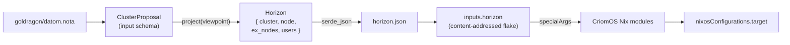

# 12 — Horizon re-engineering: combined schema audit and CriomOS coverage map

Date: 2026-05-13 (rewrite — prior framing in git log)
Role: system-assistant
Combines: `~/primary/reports/system-assistant/11-horizon-schema-re-engineering-research.md` (internal audit of `horizon-rs`) + `~/primary/reports/system-specialist/119-horizon-data-needed-to-purge-criomos-literals.md` (external audit of CriomOS literal leaks).
Reads (this session, post-compaction): `horizon-rs/lib/src/{lib,horizon,cluster,node,machine,species,name,proposal}.rs`, `lojix-cli/src/project.rs`, `CriomOS/{flake.nix,ARCHITECTURE.md}`, `CriomOS/modules/nixos/{router/default.nix,network/wifi-eap.nix,nix/cache.nix}`, `CriomOS-home/modules/home/profiles/min/{pi-models.nix,dictation.nix}`, `CriomOS-lib/lib/default.nix`, `goldragon/datom.nota`.

---

## Frame

Two parallel audits of the horizon schema landed today:

- **Report 11** (this role): 15 findings inside `horizon-rs/lib/src/` — flag soups, derived predicates, tag-dependent optionality. Framed as "delete" or "restructure."
- **Report 119** (system-specialist): 9 record categories the schema is missing because CriomOS / CriomOS-home still carry production cluster/user policy as Nix literals. Framed as "add."

This combined report distinguishes **where each change is motivated** by treating the schema as having two boundaries with different consumers and different beauty criteria.

### The boundary principle

`horizon-rs` sits between two consumers. Each boundary has its own beauty criterion.

**Input boundary** — `ClusterProposal` and its fields, authored as positional Nota records in `goldragon/datom.nota`, parsed by `ClusterProposal::project`. The consumer is the Rust parser + the cluster operator. Beauty here is ESSENCE's typed-correctness criterion: data-bearing variants, no stringly-typed dispatch, no illegal-state crosses, perfect specificity at the type level. R11's input-side findings (data-bearing `Machine`, `KnownModel` direct, `TailnetRole` collapse, plural-WLAN `RouterInterfaces`) live here.

**Output boundary** — `Horizon`, `Node`, `Cluster`, `User` serialized as JSON and consumed by ≈15 CriomOS / CriomOS-home Nix modules. The consumer is Nix code reading `inputs.horizon.horizon` through `specialArgs`. Beauty here is *consumer ergonomics*: predicate-named flags read as English at gate sites; the derivation lives once in `horizon-rs` instead of splitting across every consumer; grouped records reduce destructure noise; typed payloads replace boolean-plus-hardcoded-data anti-patterns. R119's findings live here.

The boundaries have different consumers, so they need different criteria. Several of R11's findings (delete `BehavesAs`, delete `TypeIs`, delete `ComputerIs`, delete `AtLeast`, delete the pure-redundancy `has_*` flags) applied the Rust-side criterion to the output and concluded the predicate-named structs should go. **That is a category error.** Those structs pay consumer ergonomics at every read site; deleting them forces inline species-set derivation at each consumer, which splits the source of truth between Rust and ≈15 Nix modules for a wire-size win measured in bytes. This rewrite drops those deletions.

### Split in language to reflect split in practice

The fix is structural, not just procedural: **the type vocabulary itself reflects the split.** Today `horizon-rs` carries that partway — `proposal.rs` holds the input wrappers (`ClusterProposal`, `NodeProposal`, `UserProposal`, `DomainProposal`); `node.rs` / `cluster.rs` / `user.rs` / `horizon.rs` hold the output types. But several compound types straddle both sides: `Machine` (used as `NodeProposal.machine` and `Node.machine`), `Io`, `NodeServices`, `NodePubKeys`, `RouterInterfaces`, `WireguardProxy`, plus the `WifiNetwork`/`VpnProfile`/`LanNetwork`/etc. that this re-engineering will add. A change "to `Machine`" automatically lands on both sides because there's one `Machine` — which is exactly where the category error originated.

Each compound type gets a distinct name on each side, even when shape-equivalent today: `proposal::Machine` and `view::Machine`, translated by the projection. They can diverge as input correctness (data-bearing variants, illegal-state elimination) and output ergonomics (predicate-named flags, grouped records, typed payload) pull in different directions, without the changes accidentally crossing boundaries.

Naming: `proposal::*` for the authoring side; `view::*` for the projected side (matching the existing `Viewpoint` type and the "what one node sees" semantics). Pure value-carrying enums without per-side derivation (`NodeSpecies`, `Arch`, `KnownModel`, `Keyboard`, `Bootloader`, `MotherBoard`, `Magnitude`) stay shared — they have no projected variant beyond their authored form. Compound records with derivation cross the boundary explicitly via `proposal::X::project(ctx) -> view::X`.

The split is the structural prerequisite to every row in the inventory below. Without it, every input-side or output-side change still ripples through the other side by default; with it, each side evolves under its own criterion.

Output-side change is motivated when:

1. **Typed payload replaces a literal leak** — `isNixCache: bool` becomes `binaryCache: Option<BinaryCache>` because the consumer's "yes" branch needs endpoint + signing-key + retention, currently hardcoded in CriomOS. The bool disappears as a side effect; the new check is `field != null`. This is R119 territory.
2. **Genuine dead code** — `hasSshPubKey` is always `true` (ssh is required in the proposal). Delete.

Output-side change is *not* motivated by Rust-source aesthetics: wire-size reduction alone is too thin to pay the per-consumer cost.

---

## The wire path

CriomOS does not depend on `horizon-rs` as a Rust crate. It depends on `inputs.horizon`, a content-addressed flake `lojix-cli` produces per deploy. The flake's only output is the projected `Horizon`; CriomOS modules destructure it through `specialArgs`.



Schema migration is gated on `horizon-rs` + `lojix-cli` + CriomOS bumping together. Each cycle is: schema change → projection update → CriomOS consumer reads updated → deploy.

Typical CriomOS read sites:

```
inherit (horizon.node) behavesAs;          # router/default.nix:9 — predicate group
inherit (horizon.node) isNixCache;         # nix/cache.nix:8 — boolean hides payload
inherit (horizon.node) hasWifiCertPubKey;  # wifi-eap.nix:10 — boolean hides payload
inherit (horizon.node.io) keyboard;        # consumer reading viewpoint Io
horizon.node.routerInterfaces              # router/default.nix:13 — destructure
horizon.exNodes                            # pi-models.nix:23 — scan ex_nodes
horizon.node.typeIs.largeAiRouter          # pi-models.nix:24 — one-hot dispatch
```

The first, fourth, sixth, and seventh are predicate-named flags or grouped records — consumer-ergonomic, kept. The second, third, and fifth are payload-hiding booleans or destructure points — change is motivated, replacement is a typed record.

---

## Unified inventory

Every change classified by boundary and motivation. 18 rows total.

| # | Change | Origin | Boundary | Motivation |
|---|---|---|---|---|
| 1 | `Machine` data-bearing enum (`Metal { … } \| Pod { … }`) | R11 F1 | Input + Output | Input correctness: eliminates illegal `Pod`-without-`super_node` state. |
| 2 | `ModelName: String` → `KnownModel` direct | R11 F2 | Input | Stringly-typed dispatch on input. |
| 3 | `TailnetRole ::= Client \| Server { port, base_domain }` (collapse `TailnetMembership` + `TailnetControllerRole`) | R11 F8 | Input + Output | Input: `Option<()>` + mutually-exclusive fields. |
| 4 | `RouterInterfaces.wlans: Vec<WlanInterface>` (plural radios) | R11 F13 + R119 §4 | Input + Output | Single `wlan` cannot model the dual-radio decision. |
| 5 | `Cluster.identity { internal_zone, public_zone }` | R11 F11 + R119 §1 | Output | Replaces hardcoded `.criome` / `.criome.net` derivation in `name.rs:81` and `user.rs:92-93`. |
| 6 | `Cluster.wifi_networks: Vec<WifiNetwork>` + `WifiAuthentication ::= Wpa3Sae \| EapTls` + `CertificateAuthority` + `CertificateProfile` | R11 F11 + R119 §4 | Output | Replaces literal SSID + country + SAE password in `router/default.nix:88-99`. |
| 7 | `Cluster.lan: LanNetwork { cidr, gateway, bridge, dhcp_pool, lease_policy }` | R119 §2 | Output | Replaces `10.18.0.0/24` literals in `CriomOS-lib` + DHCP timers/pool in `router/default.nix`. |
| 8 | `Cluster.resolver: ResolverPolicy { upstreams, fallbacks, listens }` | R119 §3 | Output | Replaces Cloudflare/Quad9 literals in `dnsmasq.nix`, `resolver.nix`, `networkd.nix`. |
| 9 | `Cluster.tailnet: Option<TailnetConfig { base_domain, tls }>` | R11 F11 + R119 §5 + F8 | Output | Replaces headscale TLS literals + factors out base domain currently inside `TailnetRole::Server`. |
| 10 | `Cluster.ai_providers` (or per-node `NodeCapabilities.ai_provider`) | R119 §8 | Output | Replaces `pi-models.nix:23-27` largeAiRouter scan + hardcoded port `11434` + provider name `criomos-local`. |
| 11 | `Cluster.vpn_profiles` + per-node `vpn_memberships` | R119 §6 | Output | Replaces NordVPN literals in `nordvpn.nix`, WireGuard literals in `wireguard.nix`, user wrapper in `min/default.nix:240-267`. |
| 12 | `SecretReference` primitive | R119 §9 | Both | Every typed-payload record carries one or more. |
| 13 | User tool credential references | R119 §9 | Output | Replaces gopass-path literals in `dictation.nix`, `med/default.nix`, `med/cli-tools.nix`, `pi/default.nix`. (Open decision §1: cluster Horizon vs user-profile layer.) |
| 14 | `NodeCapabilities { binary_cache, build_host, container_host, public_endpoint }` | R11 F7 + R119 §7 | Output | Typed payload replaces `isNixCache` / `isRemoteNixBuilder` booleans that hide endpoint + signing-key + retention + max-jobs. |
| 15 | `NodePubKeys.wifi_cert: Option<WifiCertEntry>` / `nordvpn: Option<NordvpnEntry>` / `wireguard: Option<WireguardEntry>` | R11 F7 + R119 §§4,6 | Output | Typed entries replace three `has_*` booleans + the loose proposal bools (`nordvpn`, `wifi_cert`). |
| 16 | Address grouping in `Node` (preserve `YggPubKeyEntry { pub_key, address, subnet }` instead of unpacking) | R11 F15 | Output | Projection at `node.rs:341-343` currently unpacks the proposal's already-grouped record into three Node fields; the fix is to *not* unpack. |
| 17 | Delete `hasSshPubKey` | R11 F6 | Output | Always `true` (ssh is required in proposal). Dead. |
| 18 | Source-constraint tests over `CriomOS/modules` + `CriomOS-home/modules` forbidding production literals | R119 (tests) | Tests | Locks in the gains; future drift fails at `nix flake check`. |
| 19 | `proposal::` / `view::` type-vocabulary split — every compound straddling type splits into two distinct types translated by the projection | (this rewrite, in response to user direction) | Rust-side structure | Structural prerequisite: each side evolves under its own criterion without accidental crossover. |

Row 19 is the structural prerequisite to every other row. Rows 1–4 and 17 are pure schema changes. Rows 5–11 grow the cluster. Rows 12–15 grow per-node typed payload. Row 16 is a small projection fix. Row 18 is the constraint test.

The two reports independently named the same shape for rows 4, 6, 9, 14, 15 — strong evidence both audits arrived at the same conclusions from opposite ends.

---

## What changes (the motivated cases)

### Input-side restructuring

`Machine` becomes a data-bearing enum:

```
Machine ::= Metal { arch, cores, ram_gb, model?, motherboard?, chip_gen? }
         |  Pod   { host, super_user?, cores, ram_gb }   -- arch derived from host
```

`MachineSpecies` unit-variant disappears. The "Pod without super_node" error class is unrepresentable. The output's `Node.machine` field follows the same shape — CriomOS shifts from `node.machine.species == "Pod" && node.machine.superNode` to a tagged-union read (e.g. `if node.machine ? pod then …`).

`ModelName: String` becomes `KnownModel` directly. The `model.known()` lookup dance disappears. See open decision §2 for the closed-vs-open-enum choice; today's `"GMKtec EVO-X2"` literal in `datom.nota:89` needs to land in the enum either way.

`TailnetMembership::Client` (a unit-variant enum, equivalent to `Option<()>`) and `TailnetControllerRole::Server { port, base_domain }` collapse into one `TailnetRole ::= Client | Server { port, base_domain }` carried on `NodeServices.tailnet: Option<TailnetRole>`. One field replaces two; mutual exclusion is type-enforced.

### Cluster growth

Today's `Cluster { name, trusted_build_pub_keys }` absorbs the cluster-wide policy currently scattered as CriomOS literals:

```
Cluster {
  name,
  identity         { internal_zone, public_zone },
  trusted_build_pub_keys,
  wifi_networks    Vec<WifiNetwork>,
  lan              LanNetwork,
  resolver         ResolverPolicy,
  tailnet?         TailnetConfig { base_domain, tls? },
  secret_bindings  Vec<ClusterSecretBinding>,
  ai_providers?    BTreeMap<Name, AiProvider>,
  vpn_profiles?    BTreeMap<Name, VpnProfile>,
}
```

Cluster-wide policy lives once on `Cluster`; per-node references (`node.vpn_memberships`, `node.ai_endpoints`) name cluster entries.

### Per-node typed payload

`NodeCapabilities` replaces the `isNixCache` / `isRemoteNixBuilder` booleans with records whose "yes" branch carries authored data:

```
NodeCapabilities { binary_cache, build_host, container_host, public_endpoint }
BinaryCache      { endpoint, public_key, signing_key: SecretReference, retention_policy }
BuildHost        { max_jobs, cores_per_job, systems, trust }
```

`NodePubKeys.wifi_cert: Option<WifiCertEntry>`, `nordvpn: Option<NordvpnEntry>`, `wireguard: Option<WireguardEntry>` replace the three boolean+secret-path-elsewhere patterns. Each entry carries its `SecretReference`.

### Router interfaces — plural radios

`RouterInterfaces { wan, wlans: Vec<WlanInterface> }` (the dual-radio decision). Each `WlanInterface` names its interface, band, channel, standard, and a reference to a `cluster.wifi_networks` entry by name. Cluster-level `WifiNetwork` carries SSID + country + authentication policy. The legacy WPA3-SAE network's password becomes a `SecretReference` (no value in Horizon — see open decision §11).

### Small output cleanup

`hasSshPubKey` deletes (always true). The yggdrasil-fields-unpacked-then-regrouped projection mistake corrects: `Node.yggdrasil: Option<YggdrasilEntry>` (matching the proposal's `YggPubKeyEntry`), not three sibling `ygg_pub_key` / `ygg_address` / `ygg_subnet` fields.

---

## What stays (correcting report 11's overreach)

Report 11 proposed deleting `BehavesAs`, `TypeIs`, `ComputerIs`, `AtLeast`, and ~10 pure-derived `has_*` / `is_*` flags from the output for wire-size or schema-aesthetic reasons. **None of those deletions are motivated.** The output's consumer is Nix code reading JSON; those flags pay consumer ergonomics at every read site.

| Field group | Why it stays |
|---|---|
| `BehavesAs { center, router, edge, large_ai, low_power, … }` | Predicate group for role gating. `mkIf node.behavesAs.router { … }` is the canonical gate in CriomOS modules. Deleting it forces inline species-set derivation at every consumer (splits the role mapping between `horizon-rs` and ≈15 Nix modules). The derivation lives once in `horizon-rs`; consumers read named English. |
| `TypeIs { center, edge, hybrid, large_ai_router, … }` | One-hot encoding of `NodeSpecies`. `node.typeIs.largeAiRouter` is how `CriomOS-home/.../pi-models.nix` discovers the AI provider host. Same shape and same argument as `BehavesAs`. |
| `ComputerIs { thinkpad_x230, thinkpad_t14_gen2_intel, … }` | One-hot encoding of `KnownModel`. Per-model config branches read as English. |
| `AtLeast { min, medium, large, max }` | Nix-convenience layer. `node.size.medium` reads better than `lib.elem node.size [ "Medium" "Large" "Max" ]` at every size/trust comparison. |
| `hasNixPubKey`, `hasYggPubKey`, `hasWireguardPubKey`, `hasBasePubKeys`, `hasVideoOutput`, `chipIsIntel`, `modelIsThinkpad`, `isFullyTrusted`, `isLargeEdge`, `enableNetworkManager`, `isDispatcher` | Pure-derived flags. Wire-size win is too small to pay per-consumer rewrite cost. |
| `sshPubKeyLine`, `nixPubKeyLine`, `cacheUrls`, `dispatchersSshPubKeys`, etc. | Pre-rendered strings consumed directly as Nix attribute values (`programs.ssh.knownHosts.<host>.publicKey = node.sshPubKeyLine`). Moving the derivation behind a Rust method doesn't help Nix consumers. |

The four booleans that *do* disappear (`isNixCache`, `isRemoteNixBuilder`, `hasWifiCertPubKey`, `hasNordvpnPubKey`) only go because typed payload replaces them — the consumer's new check is `field != null`, not because the bool itself is unmotivated.

The principle: **output beauty is consumer ergonomics**. ESSENCE's diagnostic readings (predicate-name structs, one-hot booleans, stringly-typed dispatch) describe ugliness in *source language* — they apply at the boundary where the type is *written*. The output boundary's consumer is Nix code; the discipline there is "the read site reads as English."

---

## What changes for CriomOS consumers

| Today | After re-engineering |
|---|---|
| `inherit (horizon.node) isNixCache;`<br>`services.nix-serve.enable = isNixCache;`<br>`services.nix-serve.secretKeyFile = "/var/lib/nix-serve/nix-secret-key";` | `let cache = horizon.node.capabilities.binaryCache or null; in services.nix-serve = lib.optionalAttrs (cache != null) { enable = true; port = cache.endpoint.port; secretKeyFile = cache.signingKey.materializedAt; };` |
| `inherit (horizon.node) hasWifiCertPubKey;`<br>`mkIf hasWifiCertPubKey { … }` | `let cert = horizon.node.pubKeys.wifiCert or null; in mkIf (cert != null) { … }` |
| `inherit (horizon.node) behavesAs;`<br>`mkIf behavesAs.router { … }` | **Unchanged.** Predicate group stays. |
| `node.typeIs.largeAiRouter` in `pi-models.nix` | **Unchanged.** One-hot stays. |
| `node.size.medium` in size-gated modules | **Unchanged.** `AtLeast` stays. |
| `node.sshPubKeyLine` as `programs.ssh.knownHosts.<host>.publicKey` | **Unchanged.** Pre-rendered line stays. |
| `lib.removePrefix "${node.name}." node.criomeDomainName` (domain-suffix hack) | `horizon.cluster.identity.internalZone` |
| `node.machine.species == "Pod" && node.machine.superNode` | Pattern-match on `node.machine` tagged union (e.g. `if node.machine ? pod then node.machine.pod.host else null`) |
| `"leavesarealsoalive"` literal SAE password in `router/default.nix:98` | `(lib.findFirst (n: n.id == "criome-legacy") null horizon.cluster.wifiNetworks).authentication.password.materializedAt` |
| `inventory.serverPort or 11434` hardcoded in `pi-models.nix` | `horizon.cluster.aiProviders.<name>.endpoint.port` |
| `services.resolved.fallbackDns = [ "1.1.1.1#…" "9.9.9.9" … ];` in `resolver.nix` | `services.resolved.fallbackDns = horizon.cluster.resolver.fallbacks;` |

Estimated CriomOS module rewrites: ≈10-12 module files. Each substitution is text-level; type-checking happens at evaluation time. Predicate reads and `AtLeast` reads stay untouched — only payload-bearing reads change.

---

## Open design decisions

Each is stated with substance inline; no report cross-link is load-bearing for the answer.

### 1. User tool secret references — cluster Horizon or user-profile layer?

Today's literal references in CriomOS-home: `openai/api-key` (`dictation.nix:22`), `nordvpn/account-token` (`min/default.nix:240-267`), GitHub CLI tokens (`med/default.nix:17-34`), Linkup API key (`pi/default.nix:62-65`), Anna's Archive key (`med/cli-tools.nix:14-45`).

Options:
- **(a) Cluster Horizon grows.** `UserProposal.tool_credentials: Vec<ToolCredentialReference>`. Cluster proposal carries per-user per-tool secret references.
- **(b) Separate user-profile Horizon layer.** A second Horizon-shaped input owned per user. Cluster proposal stays cluster-facts only.
- **(c) Stay in CriomOS-home as implementation policy.** Literal paths (not values) are CriomOS-home's own decision.

Recommendation: **(a)**. The cluster proposal already has a `users` map with per-user trust and preferences; adding tool credentials is the same shape, one record deeper. (b) is over-engineered for a single-operator cluster; (c) hides the gopass-path policy where source-constraint tests can't catch violations.

### 2. `KnownModel` — closed enum or `Other(String)` escape hatch?

Today: `model: Option<ModelName>` (free string). `datom.nota:89` has `"GMKtec EVO-X2"` — not in the current enum.

Options:
- **(a) Closed enum.** New machine → one-line variant addition.
- **(b) Open enum with `Other(String)`.** Unknown parseable; consumers fall back.
- **(c) Two-field.** `KnownModel` strict + `model_label: Option<String>` for inventory display.

Recommendation: **(a)**. Bounded surface; unknown is a signal that the schema needs a one-line addition, not a fallback path. ESSENCE §"Domain values are types."

### 3. `Pod` vs `Metal` shared resource fields

Both variants in row 1 carry `cores` and `ram_gb`. But on `Metal` these are *hardware*; on `Pod` they're *allocations inside the host*.

Options:
- **(a) Same names.** Downstream consumers want a number; they don't care which.
- **(b) Different names.** `cores` / `ram_gb` on Metal; `allocated_cores` / `allocated_ram_gb` on Pod.
- **(c) Shared sub-record.** `Resources { cores, ram_gb }` reused under different field names per variant.

Recommendation: **(a)**. Qualifier-by-variant is clearer than qualifier-by-name. Same downstream policy consumers.

### 4. Is `br-lan` cluster policy or implementation convention?

`router/default.nix:17` declares `lanBridgeInterface = "br-lan"`.

Options:
- **(a) CriomOS implementation constant.** Lives in `CriomOS-lib`.
- **(b) Cluster-tunable.** `LanNetwork.bridge_interface` — alternate clusters can choose.

Recommendation: **(a)**. Kernel interface name with no operational meaning at the cluster-policy level.

### 5. `NodeCapabilities` vs `NodePubKeys` boundary

R11 F7 split: "what the node can do" vs "what credentials/keys the node holds." But `BinaryCache.signing_key: SecretReference` is a credential; `NodePubKeys.wifi_cert` represents a trust posture.

Options:
- **(a) Keep the split.** Capabilities hold behavior + secret refs the role needs; PubKeys hold public material.
- **(b) Collapse.** One `NodeKeyring`.
- **(c) Three records.** Capabilities (behavioral), PubKeys (public), Secrets (references only).

Recommendation: **(a)**. The split reads as "what this node does" vs "what this node IS." A signing key is a runtime resource the cache role needs, not an identity claim.

### 6. Tailnet TLS — Horizon or runtime trust distribution?

R119 §5: CA fingerprint + server's public certificate. Today these are runtime-generated by ClaviFaber; the fingerprint comes into existence after first deploy.

Options:
- **(a) Literal fingerprint in `datom.nota`.** Operator pastes after first generation.
- **(b) Symbolic reference.** Horizon carries `tailnet.tls.ca: ClusterCaReference`; literal fingerprint flows through runtime trust distribution (signal-criome).
- **(c) Hybrid.** Horizon carries expected server identity (CN/SAN) + CA reference; runtime enforces fingerprint.

Recommendation: **(b) or (c)**. Putting a fingerprint literal in datom couples cluster proposal to PKI lifecycle. ESSENCE §"Don't put secret values in Horizon" extends naturally: trust references yes, attestation outputs no.

### 7. Cluster vs node ownership of VPN profile data

A VPN profile is partly cluster (this cluster uses these endpoints) and partly node (this node has a private key for this mesh).

Options:
- **(a) Cluster pool + node membership.** `cluster.vpn_profiles` for shape; `node.vpn_memberships` for per-node references with secret references.
- **(b) Per-node only.** Duplicate the profile per participating node.
- **(c) NordVPN server lock externalised.** Public provider data lives as a separate flake input referenced from Horizon.

Recommendation: **(a) + (c)**. Cluster owns shape; node owns membership; provider-data has its own cadence and stays external.

### 8. Cluster identity granularity

Current: `<node>.<cluster>.criome` in `name.rs:81`; `<cluster>.criome.net` in `user.rs:92-93`; `nix.<…>` subdomain pattern in `name.rs:85`.

Options:
- **(a) Two fields.** `internal_zone` (today `.criome`), `public_zone` (today `.criome.net`). Service labels (`nix`, `wg`) stay as protocol constants.
- **(b) Three fields.** Add `service_labels: BTreeMap<…>` for tunable per-service subdomains.
- **(c) URL template.** Per-purpose template string. Most flexible, loses typed structure.

Recommendation: **(a)**. Service labels are protocol hints, not cluster policy.

### 9. Rename `criomeDomainName` now or later

Options:
- **(a) Rename now.** `node.criomeDomainName` → `node.fqdn` or `node.internalFqdn`. One breaking change covers both rename and shape.
- **(b) Defer.** Keep the name for one migration cycle.

Recommendation: **(a)**. The migration is already breaking; the cost of stacking the rename is zero.

### 10. WiFi password during transition

The current literal `"leavesarealsoalive"` (in `router/default.nix:98`) must stay functional during the dual-radio migration.

Options:
- **(a) `SecretReference` from day one.** Operator moves the value to gopass/sops before the schema migrates.
- **(b) Mixed.** `WifiAuthentication::Wpa3Sae { password: Password }` where `Password ::= Literal(String) | Reference(SecretReference)`.
- **(c) Drop legacy from Horizon entirely.** Legacy stays in CriomOS as transition debt.

Recommendation: **(a)**. "Do not put the literal password into Horizon as a value" (R119 §4). One-time operator work moving the literal; discipline holds from day one.

### 11. `lojix-cli` schema bump strategy

Each schema change is also a `lojix-cli` projection update.

Options:
- **(a) One coordinated bump per inventory row.** Many small migrations.
- **(b) Atomic schema bump.** Land all rows; rewrite CriomOS reads en bloc; deploy once.
- **(c) Two-phase compat shim.** Add new fields with `serde(default)`; consumers migrate; remove old after last read disappears.

Recommendation: **(c)**. Matches the typed-records-over-flags pattern; smallest blast radius per cycle.

---

## Proposed migration order

Each step is one typed-records-over-flags cycle: schema additions land with `serde(default)`; consumers migrate; old fields delete after the last read disappears.

| # | Step | Rows | Why this order |
|---|---|---|---|
| 1 | `proposal::` / `view::` type-vocabulary split | 19 | Structural prerequisite — every row below either changes the proposal side, the view side, or both, and the split makes that distinction enforceable at the type level. |
| 2 | `SecretReference` primitive + decision §1 (user tool refs) | 12, 13 | Everything below uses it. |
| 3 | `view::Cluster.identity` (internal + public zones) + rename `criomeDomainName` per §9 | 5 | Highest leverage: removes `.criome` derivation; one breaking-rename bundled. |
| 4 | `view::Cluster.lan` + `view::Cluster.resolver` | 7, 8 | Independent of node-side; LAN constants + DNS upstreams move out. |
| 5 | `view::Cluster.wifi_networks` + `proposal::RouterInterfaces.wlans` (plural) + cert records | 4, 6 | Dual-radio enables EAP-TLS; SAE password becomes `SecretReference` per §10. |
| 6 | `view::Cluster.ai_providers` | 10 | `pi-models.nix` node-scan disappears. |
| 7 | `view::Cluster.vpn_profiles` + per-node `vpn_memberships` | 11 | Resolves §7. |
| 8 | `view::NodeCapabilities` typed payload + `view::NodePubKeys` typed entries | 14, 15 | Four booleans disappear as side effect (`isNixCache`, `isRemoteNixBuilder`, `hasWifiCertPubKey`, `hasNordvpnPubKey`). |
| 9 | `proposal::Machine` + `view::Machine` data-bearing enum + `KnownModel` direct | 1, 2 | Apex input-correctness change. CriomOS rewrites `node.machine.species` reads. |
| 10 | `TailnetRole` collapse (both sides) + `view::Cluster.tailnet` factor-out (TLS material per §6) | 3, 9 | Resolves base-domain ownership. |
| 11 | Address grouping in `view::Node` (preserve `YggdrasilEntry`) + delete `hasSshPubKey` | 16, 17 | Small output cleanup. |
| 12 | Source-constraint tests forbidding production literals | 18 | Locks in the gains; future drift fails `nix flake check`. |

The unmotivated deletions (`BehavesAs`, `TypeIs`, `ComputerIs`, `AtLeast`, 10 pure-derived `has_*` / `is_*` flags, pre-rendered `*Line` fields as methods) are **not in the migration order**. They stay as output consumer ergonomics.

The `Horizon.viewpoint` split (R11 F9) is also not in the order — the current encoding (`Option<T>` on viewpoint-only Node fields) works transparently for Nix consumers (`null` on ex_nodes, the value on the viewpoint), and the wire bloat is ≈32 `null` fields total for goldragon. The split would cost ≈15 consumer read-site path shifts (`horizon.node.io` → `horizon.viewpoint.io`) for a small wire-size win. Reopen if a future change significantly increases the count of viewpoint-only fields.

---

## Out of scope

- **`Horizon::project` algorithm rewrite.** Shape shifts; strategy holds.
- **`Error` enum expansion.** New typed records need new error variants; trivial.
- **`User` schema redesign.** Same kinds of derived fields as `Node`; consumer surface smaller; follow-up audit once `Node` lands.
- **`DomainProposal` data-bearing variant.** `Cloudflare { account_id, … }` deferred until a second domain provider lands.
- **Nota wire compatibility.** Migration assumes coordinated CriomOS + `lojix-cli` + `horizon-rs` bumps; positional-vs-named-record decisions at the `nota-codec` level stay out of scope.
- **Eventual Sema-on-Sema rewrite.** ESSENCE §"Today and eventually": this report describes today's `horizon-rs` (Rust on redb/JSON/Nix), not the eventual self-hosting form.

---

## Sources

- Schema audited: `horizon-rs/lib/src/` at main commit `1e09ab48` and observed shape this session.
- Wire path verified: `CriomOS/flake.nix:53,65,89-97`, `CriomOS/ARCHITECTURE.md` §"What this repo defines", `lojix-cli/src/project.rs`.
- Consumer evidence: 7 module read patterns listed in §"The wire path" — grepped and read this session.
- Reports merged: `~/primary/reports/system-assistant/11-horizon-schema-re-engineering-research.md` + `~/primary/reports/system-specialist/119-horizon-data-needed-to-purge-criomos-literals.md`.
- User direction earlier this conversation: `MachineSpecies` data-bearing variant (row 1); dual-radio Wi-Fi (rows 4, 6); no node names in CriomOS (motivates rows 5, 2 — system-specialist confirmed module gates are clean).
- User pushback this conversation: motivation to change the *output* is weaker than report 11's framing implied. This rewrite distinguishes input-boundary beauty (Rust typed correctness) from output-boundary beauty (Nix consumer ergonomics), and pulls every output-side deletion that isn't driven by typed-payload growth (R119) or genuinely dead code.
- User direction this conversation (final pass): "we should have a split in the language to reflect the split in practice; what goes in and what comes out." Translated into row 19 + step 1 of the migration order: `proposal::*` and `view::*` as distinct type namespaces, with shape-equivalent compound types split into two distinct types translated by the projection.
