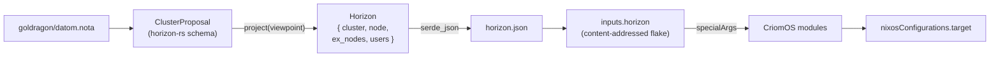

# 12 — Horizon re-engineering: combined schema audit and CriomOS coverage map

Date: 2026-05-13
Role: system-assistant
Combines: `~/primary/reports/system-assistant/11-horizon-schema-re-engineering-research.md` (internal audit — what's ugly inside `horizon-rs`) and `~/primary/reports/system-specialist/119-horizon-data-needed-to-purge-criomos-literals.md` (external audit — what's missing from `horizon-rs` that CriomOS still hardcodes).
Reads (this session, post-compaction): `horizon-rs/lib/src/{lib,horizon,cluster,node,machine,species,name,proposal}.rs`, `lojix-cli/src/project.rs`, `CriomOS/{flake.nix,ARCHITECTURE.md}`, `CriomOS/modules/nixos/{router/default.nix,network/wifi-eap.nix,nix/cache.nix}`, `CriomOS-home/modules/home/profiles/min/{pi-models.nix,dictation.nix}`, `CriomOS-lib/lib/default.nix`, `goldragon/datom.nota`.

---

## Frame

Two parallel audits landed today. They look at the same boundary from
opposite sides:

- **Report 11** (this role): surveys the ≈1450 lines of `horizon-rs/lib/src/`
  for redundancy, derived predicates, and tag-dependent optionality. 15
  findings inside the existing schema; the answer to most is *delete* or
  *restructure*.
- **Report 119** (system-specialist): surveys CriomOS and CriomOS-home modules
  for cluster/user policy still living as Nix literals. 9 record
  categories the schema is missing; the answer is *add* new typed records.

The two are **complementary**. Report 11 asks *what's already in
`horizon-rs` that's ugly?* Report 119 asks *what's not in `horizon-rs`
that should be?* Combined, they describe the full re-engineering:
shrink the existing surface; grow it where coverage is missing; emerge
with a schema that admits no illegal states and leaves CriomOS as a
pure renderer.

This report is the synthesis. It maps the two together, names the
design decisions that need the author's input before implementation,
and proposes a single migration order.

---

## The wire path

CriomOS does not depend on `horizon-rs` as a Rust crate. It depends on
**`inputs.horizon`** — a content-addressed flake that `lojix-cli`
generates per deploy. The flake's only output is the projected
`Horizon`: `cluster`, `node`, `ex_nodes`, `users`. CriomOS modules
destructure that record through `specialArgs` and gate behavior on its
fields.



The flake stub at `CriomOS/stubs/no-horizon` is overridden per deploy.
`CriomOS/flake.nix:65` shows the destructure: `horizon = inputs.horizon.horizon;`
threaded into every module's `specialArgs`. Schema migration is therefore
**gated on `lojix-cli` + CriomOS bumping together**: until lojix-cli emits
the new shape, CriomOS modules cannot read it.

Typical CriomOS read sites (from this session's grep + reads):

```
inherit (horizon.node) behavesAs;          # router/default.nix:9 — gates the whole router
inherit (horizon.node) isNixCache;         # nix/cache.nix:8 — gates nix-serve
inherit (horizon.node) hasWifiCertPubKey;  # network/wifi-eap.nix:10 — gates EAP-TLS deploy
horizon.node.routerInterfaces              # router/default.nix:13 — destructured for hostapd
horizon.exNodes                            # pi-models.nix:23 — scanned for largeAiRouter
horizon.node.typeIs.largeAiRouter          # pi-models.nix:24 — derived boolean dispatch
```

Every change in this report's inventory ends with one of these read
sites being rewritten.

---

## Unified inventory

The 24 distinct changes (15 from report 11; 9 from report 119) sort
into three categories: **delete**, **add**, **restructure**. The first
two are independent tracks; the third sets the apex shape that the
first two compose with.

| # | Change | Origin | Category | CriomOS read sites |
|---|---|---|---|---|
| 1 | `MachineSpecies` → data-bearing `Machine { Metal, Pod }` enum | R11 F1 | Restructure | `machine.species`, `machine.model`, `machine.superNode` (8 fields collapse) |
| 2 | `ModelName: String` → typed `KnownModel` directly | R11 F2 | Restructure | `machine.model.known()` dance disappears |
| 3 | Delete `BehavesAs` (9 derived booleans) | R11 F3 | Delete | router gate, edge gate, large-AI gate, ISO gate |
| 4 | Delete `TypeIs` (9 one-hot `matches!` flags) | R11 F4 | Delete | `pi-models.nix` largeAiRouter scan, builder filter |
| 5 | Delete `ComputerIs` (5 model-derived booleans) | R11 F5 | Delete | per-model config branches |
| 6 | Delete 14 `has_*`/`is_*` redundant booleans on `Node` | R11 F6 | Delete | `wifi-eap.nix` `hasWifiCertPubKey` gate, etc. |
| 7 | `NodeCapabilities { binary_cache, build_host, … }` typed records | R11 F7 + R119 §7 | Add | `nix/cache.nix`, `nix/builder.nix`, `nix/client.nix` |
| 8 | Collapse `tailnet` + `tailnet_controller` into `TailnetRole` enum | R11 F8 | Restructure | `headscale.nix`, `tailscale.nix` |
| 9 | Viewpoint split: `Horizon.viewpoint: ViewpointData` | R11 F9 | Restructure | viewpoint-only `io`, `useColemak`, `builderConfigs`, etc. |
| 10 | Drop `AtLeast` (4-bool projection of `Magnitude`) | R11 F10 | Delete | `size.min`, `trust.max` predicates |
| 11 | `Cluster` grows: tld, domain, wifi networks, secret bindings, tailnet, lan, resolver | R11 F11 + R119 §§1–3,5 | Add | every module reading `criomeDomainName` |
| 12 | `NodeProposal` shrinks 18 → ~15 fields | R11 F12 | Restructure | (consequence of #7, #8, #11) |
| 13 | `RouterInterfaces` grows to `Vec<WlanInterface>` (dual-radio) | R11 F13 + R119 §4 | Restructure | `router/default.nix`, `network/wifi-eap.nix` |
| 14 | Pre-rendered `*Line` fields → derived methods | R11 F14 | Delete | `sshPubKeyLine` consumers |
| 15 | Group addresses into `NodeAddresses`; pubkeys into `NodePubKeys` | R11 F15 | Restructure | `network/yggdrasil.nix`, `network/wireguard.nix` |
| 16 | `ClusterIdentity` — replace hardcoded `.criome` / `.criome.net` derivation | R119 §1 | Add | `name.rs::CriomeDomainName::for_node`, `user.rs` email/Matrix derivations |
| 17 | `LanNetwork`, `AccessPortPolicy`, optional `HotplugNetwork` | R119 §2 | Add | `CriomOS-lib/lib/default.nix` LAN constants, `router/default.nix`, `network/networkd.nix` |
| 18 | `ResolverPolicy`, `TailnetDnsPolicy` | R119 §3 | Add | `network/dnsmasq.nix`, `network/resolver.nix`, `network/networkd.nix` |
| 19 | `WifiNetwork`, `WifiAuthentication`, `RouterRadio` (list), `CertificateAuthority`, `CertificateProfile` | R119 §4 (+ R11 F13) | Add | `router/default.nix`, `wifi-pki.nix`, `wifi-eap.nix` |
| 20 | Tailnet controller TLS material (CA fingerprint, server cert) | R119 §5 | Add | `network/headscale.nix` |
| 21 | `VpnProfile { Nordvpn, WireguardMesh, … }` + selected exits, secret refs | R119 §6 | Add | `network/nordvpn.nix`, `network/wireguard.nix`, `data/config/nordvpn/update-servers` |
| 22 | `AiProvider` / `LlmService` record | R119 §8 | Add | `modules/nixos/llm.nix`, `CriomOS-home/.../pi-models.nix` |
| 23 | `SecretReference` + `DictationProfile` + `ToolCredentialProfile` (or user-profile Horizon layer) | R119 §9 | Add | `CriomOS-home` profile modules referencing gopass paths |
| 24 | Source-constraint tests forbidding production literals in modules | R119 (tests section) | Add | new `checks/` derivations |

Row count is the action count. Findings overlap: rows 7, 11, 13, 19 are
where the two reports independently named the same shape. The overlap is
strong evidence — both audits arrived at the same conclusion from
different ends.

---

## What gets deleted

Report 11 territory. Pure removals: no information is lost because each
deleted field is recoverable from another field in the same record.

### Three derived-predicate structs

`BehavesAs` (9 booleans), `TypeIs` (9 booleans), `ComputerIs` (5
booleans). All three are deterministic projections of one source:
`(NodeSpecies, MachineSpecies, ModelName)`. The derivations live in
`node.rs::TypeIs::from_species`, `node.rs::BehavesAs::derive`, and
`node.rs::ComputerIs::from_model` — every output bit is recoverable.

After deletion, consumers pattern-match `node.species` and `node.machine`
directly, or call methods (`node.is_edge()`, `node.is_router()`). The
CriomOS substitution is mechanical:

| Before | After |
|---|---|
| `mkIf node.behavesAs.router` | `mkIf node.isRouter` (method on Node) or `lib.elem node.species [ "Router" "Hybrid" "LargeAiRouter" ]` |
| `mkIf node.typeIs.largeAiRouter` | `mkIf (node.species == "LargeAiRouter")` |
| `node.computerIs.thinkpadX230` | `(node.machine.metal.model or null) == "ThinkPadX230"` (after F1) |

### 14 redundant booleans on `Node`

8 are `field.is_some()` (e.g. `hasNixPubKey = nixPubKey != null`); 5 hide
typed payload (e.g. `isNixCache` — the "yes" branch carries endpoint
URL + signing key + retention; see "what gets added" below); 1
(`hasSshPubKey`) is always true. All 14 disappear after the typed-records
refactor in row 7.

### `AtLeast` 4-bool projection

`AtLeast { min, medium, large, max }` is the public size/trust shape on
`Node`. `Magnitude { Zero, Min, Medium, Large, Max }` is the input.
After deletion, consumers use `Magnitude` directly. Net: 16 booleans
disappear per typical horizon (4 each × 4 nodes × {size, trust}).

### Pre-rendered `*Line` fields

`ssh_pub_key_line: SshPubKeyLine` and `nix_pub_key_line:
Option<NixPubKeyLine>` carry the same data as their parent key fields in
a Nix-friendly serialized string. After the refactor: methods on
`SshPubKey` and `NixPubKey` (`key.line()`) produce them at serialization
time. 2 fields per Node + 1 per ex-node entry disappear.

### Viewpoint-as-`Option<T>` misencoding

9 fields on `Node` are `Option<T>` where the `None` case means "this is
an ex-node, not the viewpoint." Examples: `io: Option<Io>`,
`builderConfigs: Option<Vec<BuilderConfig>>`,
`exNodesSshPubKeys: Option<Vec<SshPubKeyLine>>`. The viewpoint-vs-not
distinction is a tag on the Horizon, not on each Node — encoding it as
optionality forces every consumer to unwrap. After the refactor:
`Horizon.viewpoint: ViewpointData` carries the viewpoint-only data once;
`Node` is the same shape for everyone in the horizon.

---

## What gets added

Report 119 territory. Each addition replaces a production literal in
CriomOS or CriomOS-home with a typed record sourced from the cluster
proposal.

### Cluster identity and domains

Current `Cluster` (output) carries only `name` and
`trustedBuildPubKeys`. The domain derivation
`<node>.<cluster>.criome` is hardcoded in
`horizon-rs/lib/src/name.rs:81`; the public `<cluster>.criome.net`
suffix appears in `user.rs:92-93` for email/Matrix IDs.

Needed: a record on `Cluster` carrying internal node zone, public
user/service zone, and any cluster-specific service labels
(`nix.<…>`, `wg.<…>`) that aren't protocol constants.

### LAN and DHCP policy

`CriomOS-lib/lib/default.nix` declares `lan.subnetPrefix = "10.18.0"`,
`gateway = "10.18.0.1"`, `subnet = "10.18.0.0/24"`. `router/default.nix`
hardcodes the DHCP pool `.100 - .240`, lease/renew/rebind timers, the
`br-lan` bridge name, and a USB-Ethernet auto-bridge matcher. A
`networkd.nix:36-43` hotplug subnet declares a separate DHCP shape for
center-node USB ethernet.

Needed: `LanNetwork { cidr, gateway, bridge_interface, dhcp_pool,
lease_policy }` plus an optional `HotplugNetwork` for the center-node
USB case. Open question: is `br-lan` an implementation convention or a
cluster-tunable? (See decisions §3 below.)

### Resolver and DNS policy

`network/dnsmasq.nix:34-43` hardcodes Cloudflare + Quad9 upstreams.
`network/dnsmasq.nix:119-123` hardcodes Tailscale's `100.100.100.100`
MagicDNS address. `network/resolver.nix:23-24` and `network/networkd.nix:52-58`
duplicate the Cloudflare/Quad9 fallback list.

Needed: `ResolverPolicy { upstream_servers, fallback_servers,
local_listen_addresses }` and `TailnetDnsPolicy { base_domain,
dns_server_address }` (or fold the latter into
`TailnetRole::Server`).

### Wi-Fi policy and PKI (transitional debt + target shape)

`router/default.nix:88-99` hardcodes Polish regulatory country, SSID
`"criome"`, WPA3-SAE mode, and the **literal SAE password**
`"leavesarealsoalive"`. `wifi-eap.nix` already exists but is gated on
the soon-to-be-deleted `hasWifiCertPubKey` flag.

Needed (combining R11 F13 + R119 §4):

```
WifiNetwork { id, ssid, country, authentication }
WifiAuthentication ::= Wpa3Sae { password: SecretReference }
                    |  EapTls { ca, server_identity, client_profile, authorization }
RouterRadio { interface, band, channel, standard, network, bridge }  -- list, not single

CertificateAuthority + CertificateProfile records
WifiClientProfile  -- per-node EAP identity, outer identity,
                   -- CA fingerprint, domain-suffix match, client cert
```

The transitional WPA3-SAE network stays explicitly marked as transition
debt on the built-in radio; the new EAP-TLS network lands on the USB
dongle radio (per the dual-radio decision earlier in this session). The
literal password becomes a `SecretReference` for the duration of the
migration, never a value in Horizon.

### Tailnet controller TLS

`network/headscale.nix:22-63` picks TLS materialization paths and
generates a first-boot self-signed certificate. The CA's
*public* material (fingerprint, public cert) and the service's
certificate **policy** are cluster facts; the *private* key is runtime
trust-distribution territory (ClaviFaber).

Needed: `dns_server_address` + TLS/cert policy on
`TailnetRole::Server` (or a shared `ServiceCertificate` record); CA
fingerprint or public cert reference.

### VPN profiles

`network/nordvpn.nix:19-24` reads a committed NordVPN server-lock file;
`update-servers:18-26` chooses specific countries/regions;
`nordvpn.nix:35-60` derives NetworkManager connection names from that
lock. `network/wireguard.nix:40,47,65` hardcodes the `wg.` alias, the
private key path, and the `51820` listen port. `CriomOS-home/.../min/default.nix:240-267`
hardcodes the NordVPN gopass path, the private-key destination, and the
API endpoint in a user wrapper.

Needed: `VpnProfile` sum with `Nordvpn { exits, account: SecretReference,
private_key: SecretReference, dns_policy }` and
`WireguardMesh { endpoint, listen_port, private_key: SecretReference,
peers, … }` variants.

### Nix cache and build capabilities

`nix/cache.nix:30-35` treats `isNixCache: bool` as a flag but the "yes"
branch carries endpoint, port (80), signing-key path
(`/var/lib/nix-serve/nix-secret-key`), and retention policy.
`nix/builder.nix:35-48` renders builder config from projected booleans
with protocol + speed factor hardcoded in the module.

Needed (R11 F7 = R119 §7 — same shape, independently named):

```
NodeCapabilities { binary_cache, build_host, build_dispatcher, container_host, public_endpoint }
BinaryCache       { endpoint, public_key, signing_key: SecretReference, retention_policy }
BuildHost         { max_jobs, cores_per_job, systems, trust }
BuildDispatcher   { policy }   -- if not derived
```

### Local AI provider

`modules/nixos/llm.nix:23-31,113-123` starts llama.cpp from an
inventory shipped in `CriomOS-lib/data/largeAI/llm.json`.
`CriomOS-home/.../pi-models.nix:19-27` scans cluster nodes for
`typeIs.largeAiRouter` or `behavesAs.largeAi` to discover a provider;
`pi-models.nix:39-44` derives a base URL with hardcoded provider name
`criomos-local` and fallback port `11434`.

Needed: `AiProvider { name, serving_node, protocol, port_or_base_url,
api_key: Option<SecretReference>, models }`. The public open-model
catalog (fetch URLs, hashes) stays in `CriomOS-lib`; the cluster
decision *this node serves these models on this endpoint* moves to
Horizon.

### User tool secret references

OpenAI key (`dictation.nix:22`), GitHub CLI + hub token paths
(`med/default.nix:17-34`), NordVPN account token
(`min/default.nix:240-267`), Linkup API key
(`pi/default.nix:62-65`), Anna's Archive secret key
(`med/cli-tools.nix:14-45`).

Needed: `SecretReference { backend, path, purpose }` (or
`UserSecretReference { name, purpose }` with a host-local backend
mapping), `DictationProfile { backend, model, language, vocabulary,
api_key }`, and `ToolCredentialProfile` for each per-user service.
**Open question (R119 §9):** these are user-private preferences. Do
they live in cluster Horizon, or in a separate user-profile Horizon
layer? See decisions §10 below.

---

## What gets restructured (the apex changes)

Four shape changes set the structure that everything else composes
with.

### `Machine` becomes a data-bearing enum (R11 F1)

The user's prompted refactor, formalised. Before:

```
MachineSpecies ::= Metal | Pod                          (unit-variant enum)
Machine { species, arch?, cores, model?, motherboard?,  (7 fields conditional
          super_node?, super_user?, chip_gen?, ram_gb? } on species)
```

After:

```
Machine ::= Metal { arch, cores, ram_gb, model?, motherboard?, chip_gen? }
         |  Pod   { host, super_user?, cores, ram_gb }
                  -- arch derived from host at projection time
```

`MachineSpecies` disappears. The two variants carry the fields that are
only meaningful for that variant. The illegal cross (`Metal` with
`super_node` set; `Pod` with no `host`) becomes unrepresentable.

### `Cluster` grows (R11 F11 + R119 §§1–3,5)

Today's `Cluster { name, trusted_build_pub_keys }` absorbs every
cluster-wide policy currently scattered across CriomOS literals:

```
Cluster {
  name,
  identity,            -- internal zone + public zone + service labels (R119 §1)
  trusted_build_pub_keys,
  wifi_networks,       -- Vec<WifiNetwork>            (R11 F11 + R119 §4)
  secret_bindings,     -- Vec<ClusterSecretBinding>   (R11 F11)
  tailnet,             -- Option<TailnetConfig>       (R11 F8 base domain)
  lan,                 -- LanNetwork                  (R119 §2)
  resolver,            -- ResolverPolicy              (R119 §3)
}
```

No removals. Cluster-wide policy lives on Cluster, not duplicated
per-node.

### `NodeProposal` shrinks 18 → ~15 fields (R11 F12)

Three booleans (`nordvpn`, `wifi_cert`, `wireguard_pub_key`) and one
free `number_of_build_cores` move into typed records. Two genuine
no-payload booleans (`wants_printing`, `wants_hw_video_accel`) stay as
bools. `services` and `capabilities` absorb cluster-role data.

### `Horizon` top-level split (R11 F9)

```
Horizon {
  cluster,                                  -- grown per above
  node,                                     -- universal Node shape
  viewpoint: ViewpointData,                 -- viewpoint-only stuff lives here
  ex_nodes: BTreeMap<NodeName, Node>,
  users: BTreeMap<UserName, User>,
}

ViewpointData {
  io, computer, builder_configs, cache_urls,
  ex_nodes_ssh_pub_keys, dispatchers_ssh_pub_keys,
  admin_ssh_pub_keys, wireguard_untrusted_proxies,
}
```

CriomOS consumers shift from `horizon.node.io.unwrap().keyboard` to
`horizon.viewpoint.io.keyboard`.

---

## What changes for CriomOS consumers

Mostly mechanical. The shape stays "Nix destructures the Horizon JSON
into module locals"; the destructure paths change.

| Today's read site | Re-engineered read site |
|---|---|
| `inherit (horizon.node) behavesAs;`<br>`mkIf behavesAs.router` | `mkIf (lib.elem horizon.node.species [ "Router" "Hybrid" "LargeAiRouter" ])` or a method `horizon.node.isRouter` |
| `inherit (horizon.node) isNixCache;`<br>`services.nix-serve.enable = isNixCache;` | `let cache = horizon.node.capabilities.binaryCache or null; in services.nix-serve = { enable = cache != null; port = cache.endpoint.port; secretKeyFile = cache.signingKey.materialized_at; … }` |
| `inherit (horizon.node) hasWifiCertPubKey;` | `let cert = horizon.node.pubKeys.wifiCert or null; in mkIf (cert != null) {…}` |
| `inherit (horizon.node.io) keyboard;` | `inherit (horizon.viewpoint.io) keyboard;` |
| `node.typeIs.largeAiRouter` | `node.species == "LargeAiRouter"` |
| `lib.removePrefix "${node.name}." node.criomeDomainName` (the CriomOS domain hack) | `horizon.cluster.identity.internalZone` (one source of truth) |
| `"leavesarealsoalive"` literal SAE password | `let wifi = lib.findFirst (n: n.id == "criome-legacy") null horizon.cluster.wifiNetworks; in wifi.authentication.password.materialized_at` |
| `inventory.serverPort or 11434` in `pi-models.nix` | `horizon.cluster.aiProviders.<name>.endpoint.port` (or per-node capability) |

Estimated CriomOS module rewrites: ≈15 module files. Each substitution
is text-level; type-checking happens at evaluation time. A migration
helper (`tools/migrate-criomos-horizon-references`) could batch the
trivial cases (the predicate-flag substitutions especially).

---

## Open design decisions

The author should resolve these before implementation begins. Each is
stated with the substance the user needs inline; no report cross-link
is load-bearing for the answer.

### 1. `Pod` vs `Metal` shared resource fields

Both variants in R11 F1 carry `cores: u32` and `ram_gb: u32`. But a
Pod's cores/ram are *allocations inside the host*, while a Metal's
cores/ram are *hardware*. The names line up by accident; the meanings
differ.

Options:

- **(a) Same names, same types.** `cores` and `ram_gb` on both variants.
  Downstream consumers don't care that one is hardware and one is
  allocation — they just want a number. Simplest schema.
- **(b) Different names.** `cores`, `ram_gb` on `Metal`;
  `allocated_cores`, `allocated_ram_gb` on `Pod`. Reads more honestly.
- **(c) Shared sub-record.** `Resources { cores, ram_gb }` field
  named differently on each variant (`hardware: Resources` on Metal,
  `allocation: Resources` on Pod). Most structural, most ceremony.

**Recommendation: (a).** Pod and Metal are different enough that
qualifier-by-context (which variant carries the value) is clearer than
qualifier-by-name. The values feed the same downstream policies
(`maxJobs`, llama.cpp model size).

### 2. `KnownModel` — closed enum vs `Other(String)` escape hatch

After R11 F2 lands, `model: Option<KnownModel>`. Today
`goldragon/datom.nota` has `(Machine Metal X86_64 8 "GMKtec EVO-X2" …)`
with the model as a free string — that string is not currently in
`KnownModel`.

Options:

- **(a) Closed enum, add variants as needed.** New machine → new
  variant. The set is small (current: 5 ThinkPads + Rpi3B; plus
  Edge15/T14Gen5/etc. that operators deploy). Every value has a name.
- **(b) Open enum with `Other(String)` escape hatch.** Unknown models
  still parseable; downstream consumers that don't care branch on
  known variants and fall back. Today's GMKtec stays a string.
- **(c) Two-field encoding.** `model: Option<KnownModel>` strict for
  known dispatches; `model_label: Option<String>` for the human-readable
  inventory label. Two fields, both Option, more ceremony but lossless.

**Recommendation: (a).** ESSENCE §"Domain values are types, not
primitives" + §"Stringly-typed dispatch is forbidden." Every operator
machine earns a name; the model surface is small and bounded; an
unknown model is a signal that the schema needs a one-line addition,
not a fallback path that hides typified data in a string.

### 3. Is `br-lan` cluster policy or implementation convention?

`CriomOS/modules/nixos/router/default.nix:17` declares
`lanBridgeInterface = "br-lan"`. R119 §2 names this as an open
question.

Options:

- **(a) Stays a CriomOS constant.** Every cluster's LAN bridge is named
  `br-lan` by CriomOS convention. The name lives in
  `CriomOS-lib/lib/default.nix:lan.bridge` (a new constant).
- **(b) Cluster-tunable.** `LanNetwork { bridge_interface, … }` —
  alternate clusters can choose a different name.

**Recommendation: (a).** It's a kernel-interface name with no
operational meaning at the cluster-policy level. Moving it to Horizon
adds surface area without changing any decision the operator actually
makes.

### 4. `BuildDispatcher` — record or derived predicate?

R119 §7 lists `BuildDispatcher { policy }` as part of `NodeCapabilities`.
Today `is_dispatcher` is purely derived: `!behaves_as.center &&
is_fully_trusted && sized_at_least.min` (per `node.rs:366`).

Options:

- **(a) Stay derived.** `is_dispatcher` becomes a method on `Node` that
  evaluates the predicate. No new record.
- **(b) Typed record.** `Option<BuildDispatcher>` with policy fields if
  policy ever appears. Today the field would be `BuildDispatcher {}` (no
  payload) — a degenerate record.

**Recommendation: (a).** The predicate carries no authored data today.
If policy fields emerge later, the migration is one-cycle (R11 F7
pattern). For now, a method on `Node` reads clearly.

### 5. `NodeCapabilities` vs `NodePubKeys` boundary

R11 F7 splits "what the node can do" (capabilities) from "what
credentials/keys the node holds" (pub_keys). But:

- `BinaryCache.signing_key: SecretReference` is a credential.
- `NodePubKeys.wifi_cert: Option<WifiCertEntry>` represents a trust
  posture (this node holds an EAP-TLS cert).

The boundary is fuzzy. Options:

- **(a) Keep the split.** Capabilities hold the *behavior*; secret
  references inside them point at credentials. PubKeys hold *public*
  key material the cluster trusts.
- **(b) Collapse into one `NodeKeyring { capabilities, public_keys,
  secret_references }`.**
- **(c) Three records.** `NodeCapabilities` (behavioral),
  `NodePubKeys` (public material), `NodeSecrets` (references only).

**Recommendation: (a).** The split reads as "what this node does"
vs "what this node IS (in terms of identity)". A `BinaryCache.signing_key`
isn't an identity claim — it's a runtime resource the cache role needs.
NodePubKeys stays public-material-only, capabilities own everything else.

### 6. Tailnet TLS — Horizon or runtime trust distribution?

R119 §5 says the CA fingerprint and the server's public certificate
should live in Horizon. But the CA is generated *at runtime* by
ClaviFaber; the fingerprint comes into existence after first deploy.

Options:

- **(a) Literal fingerprint in datom.nota.** Operator pastes the
  fingerprint after first generation; subsequent deploys carry it. Out
  of band before; in-band after.
- **(b) Symbolic reference.** Horizon carries
  `tailnet.tls.ca: ClusterCaReference` — the literal fingerprint flows
  through a runtime trust-distribution channel (e.g. signal-criome
  attestations) that resolves the symbol to bytes at deploy time.
- **(c) Hybrid.** Horizon carries the *server certificate's expected
  identity* (CN/SAN) and the CA reference; the fingerprint check is
  enforced by the runtime trust layer, not by Nix evaluation.

**Recommendation: (b) or (c).** Putting the fingerprint literal in
datom.nota couples cluster proposal evolution to PKI lifecycle events —
re-issuance of a CA requires a datom edit. ESSENCE §"Don't put secret
values or private keys in Horizon" naturally extends: trust references
yes, attestation outputs no.

### 7. Cluster vs node ownership of VPN profile data

R119 §6 details VPN. But a profile is *partly* cluster (this cluster
recognizes WireguardMesh + uses these endpoints) and *partly* node
(this node has a wireguard private key for this mesh).

Options:

- **(a) Cluster-level pool, node-level membership.**
  `cluster.vpn_profiles: BTreeMap<VpnProfileName, VpnProfile>` for the
  shape definitions; `node.vpn_memberships: Vec<VpnMembership>` for
  per-node references with the node's secret references.
- **(b) Per-node only.** Each node carries the full `VpnProfile` for
  every VPN it participates in. Duplication across nodes but no
  reference indirection.
- **(c) NordVPN server lock externalised.** R119 §6 raises: the
  server-lock JSON is public provider data, not cluster proposal data.
  Reference from Horizon, source from a separate flake input.

**Recommendation: (a) + (c).** Cluster owns the *shape* of each VPN
profile (this is a Nordvpn profile vs this is a WG mesh); node owns the
*membership* (this node is a member, here are its secret references).
The NordVPN server lock is public data with its own cadence and lives
as a separate cluster-referenced flake input.

### 8. Cluster identity — granularity

R119 §1 names internal zone, public zone, service labels (`nix`,
`wg`). The current `name.rs:81` derivation is
`<node>.<cluster>.criome`; `nix_subdomain()` adds `nix.` prefix;
`user.rs:92-93` uses `<cluster>.criome.net` for email/Matrix.

Options:

- **(a) Two fields.** `internal_zone: DomainSuffix` (today
  `.criome`), `public_zone: DomainSuffix` (today `.criome.net`).
  Service labels (`nix`, `wg`) stay as protocol constants in
  CriomOS-lib.
- **(b) Three fields.** Add `service_labels: BTreeMap<ServiceLabel,
  String>` for tunable per-service subdomains.
- **(c) Full URL template.** A per-purpose `domain_template:
  String` field (e.g. `"nix.{node}.{cluster}.criome"`). Most flexible,
  loses typed structure.

**Recommendation: (a).** Service labels (`nix`, `wg`) are protocol
hints: `nix` because nix-serve speaks HTTP at that subdomain; `wg`
because that's where the wireguard endpoint lives. They're not cluster
policy. Two zones is enough.

### 9. Rename `criomeDomainName` now or later

R119 §1: "eventually rename output fields away from `criomeDomainName`
once the compatibility cost is acceptable." The schema migration is
already a breaking change.

Options:

- **(a) Rename now.** `node.criomeDomainName` → `node.fqdn` (or
  `node.internalFqdn`). One breaking change covers both rename and
  shape.
- **(b) Defer.** Keep `criomeDomainName` for one migration cycle; rename
  in a subsequent commit.

**Recommendation: (a).** The migration is already breaking. The cost
of stacking the rename is zero; the cost of deferring is one more
breaking cycle later.

### 10. User tool secret references — cluster Horizon or user profile Horizon?

R119 §9 open question. Today: per-user gopass paths
(`openai/api-key`, `nordvpn/account-token`, `linkup/api-key`,
`gh/token`, `aa/api-key`) hardcoded in CriomOS-home modules.

Options:

- **(a) Cluster Horizon grows.** `UserProposal.tool_credentials:
  Vec<ToolCredentialReference>`. Cluster proposal carries per-user
  per-tool secret references. Simple; one schema.
- **(b) Separate user-profile Horizon layer.** A second Horizon-shaped
  input (`inputs.userHorizon` ?) owned per user, projected
  independently from cluster proposal. Cluster proposal stays cluster-
  facts only.
- **(c) Stay in CriomOS-home, accept the literal references as
  CriomOS-home implementation policy.** The literal *paths* (not values)
  are CriomOS-home's own decision; only the values come from gopass at
  runtime.

**Recommendation: (a).** The cluster proposal is already per-user (it
has a `users` map; every user has trust + preferences). Adding
per-user tool credential references is the same shape, one record
deeper. Option (b) is over-engineered for the current cluster of one
operator; option (c) leaves the gopass-path policy hidden in CriomOS-home
Nix code where source-constraint tests (R119 tests) can't catch
violations.

### 11. Migration order — Report 11 vs Report 119

The two reports' orders are compatible but emphasize differently:

- R11 order: F2 → F11 → F14 → F8 → F7 → F1 → F3-F6 → F9 → F10 → F13 → F15
  (cheap cleanups first; apex change F1 middle; flag deletion last).
- R119 order: §1 → §9 → §2-3 → §4 → §8 → §6 → §7 → tests/literal removal
  (cluster identity first; then user secrets; then per-domain records;
  then capability records; tests last).

Options:

- **(a) Add-first.** Land R119's new records before R11's deletions.
  CriomOS modules read the new fields alongside the old; the old fields
  retire when no consumer remains.
- **(b) Delete-first.** Land R11's cleanups before R119's additions.
  Smaller surface to migrate; new records sit on the cleaned-up base.
- **(c) Interleave by impact.** Per-CriomOS-rewrite-cost ordering: the
  changes with the smallest CriomOS surface go first regardless of
  which report they originate in.

**Recommendation: (a).** R119's records absorb production literals;
each one is a concrete leak today. Landing them first means CriomOS
loses literals immediately. R11's deletions are pure cleanup with no
operational urgency — they ride after.

A reconciled ordered list lives in the next section.

### 12. The viewpoint-vs-not split (R11 F9)

R11 F9 proposes `Horizon { cluster, node, viewpoint: ViewpointData,
ex_nodes, users }`. R119 doesn't address this.

This is the largest structural change for CriomOS consumers: today
`horizon.node.io` is `Option<Io>`, and modules read
`horizon.node.io.keyboard` because they only ever run on the viewpoint
node. After F9: `horizon.viewpoint.io.keyboard`.

Options:

- **(a) Accept F9.** Schema reads cleaner; consumers shift one path
  segment. ≈15 read-site edits across CriomOS + CriomOS-home.
- **(b) Defer F9.** Land everything else first; leave viewpoint
  encoding alone. F9 lands later as its own migration.

**Recommendation: (a).** The viewpoint structure is the load-bearing
mental model for what Horizon IS — one cluster, projected from one
seat. Encoding that as `Option<T>` on every field forces every
consumer to remember the encoding. The shift is small and once.

### 13. `WifiNetwork.password` representation during transition

The current Wi-Fi password `"leavesarealsoalive"` (literal in
`router/default.nix:98`) must stay functional during the dual-radio
migration. R119 §4 says "use a SecretReference if the old network must
be represented during the transition."

Options:

- **(a) `SecretReference` from day one.** Even the legacy WPA3-SAE
  password resolves through a secret backend. Operator stores the value
  there (gopass / sops / age) before the schema migrates.
- **(b) Inline `String` for legacy + `SecretReference` for new.**
  `WifiAuthentication::Wpa3Sae { password: Password }` where `Password`
  is `Literal(String) | Reference(SecretReference)`. Two variants;
  literals only allowed during named transition windows.
- **(c) Drop legacy from Horizon entirely.** The legacy network stays
  in CriomOS as an explicitly-marked piece of transition debt until
  EAP-TLS is cluster-wide. Horizon only models the new network.

**Recommendation: (a).** The principle from R119: "do not put the
literal password into Horizon as a value." A SecretReference from day
one keeps the discipline straight; the operator does the one-time work
of moving `"leavesarealsoalive"` from a Nix literal to gopass before
the schema migrates.

### 14. `lojix-cli` projection — incremental or atomic schema bump?

The wire path means horizon-rs schema migration is also a lojix-cli
projection bump. Each schema change has a corresponding projection
change.

Options:

- **(a) One coordinated bump per row in the inventory.** Each row of
  the unified inventory lands as: horizon-rs schema change +
  lojix-cli projection update + CriomOS consumer updates + deploy.
  Many small migrations.
- **(b) Atomic schema bump.** Land all 24 changes in horizon-rs;
  update lojix-cli; rewrite CriomOS module reads en bloc; deploy
  once. One large migration.
- **(c) Two-phase: (i) add new fields with `serde(default)` so both
  old and new consumers can read; (ii) remove old fields after all
  CriomOS reads migrate.** Compat shim per
  `~/primary/skills/typed-records-over-flags.md`.

**Recommendation: (c).** Smaller blast radius per cycle; consumers can
migrate at their own pace; deletes land after the last read disappears.
Matches the typed-records-over-flags migration pattern already used in
this workspace.

---

## Proposed migration order

Reconciling R11 and R119 per decision §11. Each step is one
typed-records-over-flags cycle: schema additions land with
`serde(default)`; consumers migrate; old fields delete after the last
read disappears.

| # | Step | From | Why this order |
|---|---|---|---|
| 1 | `ClusterIdentity` (internal + public zone fields on `Cluster`) | R119 §1 | Highest leverage: replaces `name.rs::for_node` + `user.rs` email derivations. Unblocks the `criomeDomainName` rename. |
| 2 | `SecretReference` baseline + decision on user-profile layer | R119 §9 | Everything below uses it. |
| 3 | `LanNetwork` + `ResolverPolicy` records on `Cluster` | R119 §§2,3 | Independent of node-side changes; CriomOS-lib LAN constants and dnsmasq/resolved upstreams move now. |
| 4 | `WifiNetwork` + `RouterRadio` list + `CertificateAuthority`/`CertificateProfile` | R119 §4 + R11 F13 | Dual-radio decision needs schema. SAE password moves to SecretReference. |
| 5 | `AiProvider` record | R119 §8 | `pi-models.nix` node-scan disappears. |
| 6 | `VpnProfile` (cluster pool + node membership per decision §7) | R119 §6 | NordVPN literals + WireguardMesh listen port move out. |
| 7 | `NodeCapabilities { binary_cache, build_host, container_host, public_endpoint }` | R11 F7 + R119 §7 | Cache + builder modules read typed records. Drops 5 `is_*` flags. |
| 8 | `Machine` data-bearing enum (R11 F1) + `KnownModel` direct (R11 F2) | R11 | The apex change for schema beauty. `MachineSpecies` unit-variant disappears; ModelName String drops. |
| 9 | `TailnetRole` collapse (R11 F8) | R11 | Two `Option` fields become one; controller TLS material adds per decision §6. |
| 10 | Delete `BehavesAs`, `TypeIs`, `ComputerIs` + 14 `has_*`/`is_*` flags + `AtLeast` | R11 F3-F6, F10 | Pure cleanup; lands after typed records are in place because some derivations depend on `Machine` (F1). |
| 11 | `Horizon.viewpoint: ViewpointData` split (R11 F9) | R11 | Last because every CriomOS read site shifts one segment. |
| 12 | Address grouping + pubkey grouping (R11 F15) | R11 | Small cleanup. |
| 13 | Pre-rendered `*Line` fields → methods (R11 F14) | R11 | Smallest cleanup; finishes the audit. |
| 14 | Source-constraint tests over `CriomOS/modules` + `CriomOS-home/modules` forbidding production literals (R119 tests section) | R119 | Locks in the gains; future drift fails at `nix flake check`. |

Each step is its own commit + lojix-cli projection bump + CriomOS
deploy. Steps 1–6 are additive (no consumer breaks until reads
migrate); steps 7–13 are restructuring (one breaking cycle each).
Step 14 is the constraint test that prevents regression.

---

## Out of scope

Both reports' explicit non-goals, restated:

- **`Horizon::project` algorithm rewrite.** The projection logic shifts
  shape but not strategy.
- **`Error` enum expansion.** New typed records need new error
  variants; trivial.
- **`User` schema redesign.** `User` has the same kinds of derived
  fields (`is_code_dev`, `is_multimedia_dev`, `use_colemak`,
  `enable_linger`, `has_pub_key`). A follow-up audit once Node lands;
  not in scope here.
- **`DomainProposal` data-bearing variant.** `DomainProposal { species:
  DomainSpecies::Cloudflare }` wants to become
  `Cloudflare { account_id, … }`. Defer until a second provider lands.
- **Nota wire compatibility.** The migration assumes coordinated
  CriomOS + lojix-cli + horizon-rs bumps; positional-vs-named-record
  tradeoffs at the nota-codec level are out of scope.
- **Eventual Sema-on-Sema rewrite.** ESSENCE §"Today and eventually"
  applies: this report describes today's horizon-rs (Rust on
  redb/JSON/Nix), not the eventual self-hosting form.

---

## Sources

- Schema audited: `horizon-rs/lib/src/` at main commit
  `1e09ab48` and the in-flight rewrites observed in this session.
- Wire path verified: `CriomOS/flake.nix:53,65,89-97`,
  `CriomOS/ARCHITECTURE.md` §"What this repo defines",
  `lojix-cli/src/project.rs`.
- Consumer evidence: the 11 module reads listed in §"The wire path"
  above were grepped and read this session.
- Reports merged: `~/primary/reports/system-assistant/11-horizon-schema-re-engineering-research.md`
  + `~/primary/reports/system-specialist/119-horizon-data-needed-to-purge-criomos-literals.md`.
- User direction (this conversation): combine the two reports; surface
  ambiguities and design decisions where intent isn't clear.
- User direction (earlier this conversation): `MachineSpecies` data-bearing
  variant (decision §1); dual-radio Wi-Fi migration (rows 13, 19);
  no node names in CriomOS (motivates rows 16, 11; system-specialist
  confirmed the current modules are clean of this).
