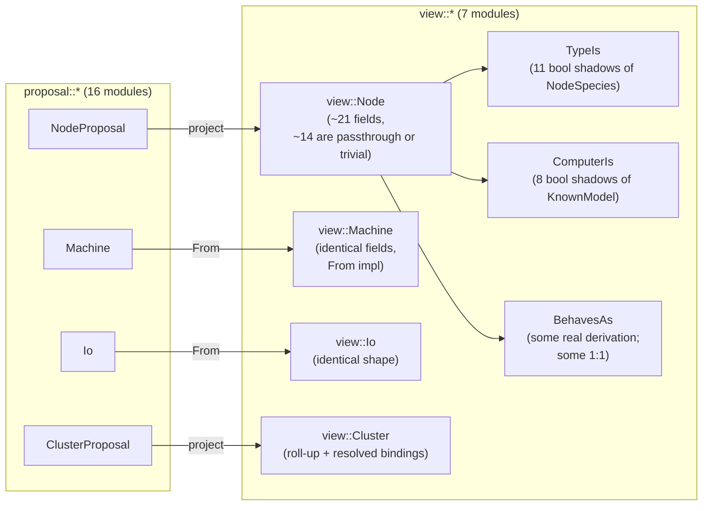

# 17 — horizon-rs overbuild audit, 2026-05-16

*Where the 7,585 lines of `horizon-rs/horizon-re-engineering` come
from, and which of them carry their weight. The job is "derive a
data-tree from an input tree"; the shape this work has taken is
considerably bigger than the job demands.*

> **Status (2026-05-16):** Read-only audit. Focuses on structural
> overbuild and gratuitous repetition — distinct from /16, which
> audited lojix. Asked by user after /16: "it shouldn't be so big,
> only derives a data-tree from an input tree. look for inefficient
> design and outright bullshit."

## 0 · TL;DR

The job: read a typed NOTA cluster proposal, produce a
viewpoint-scoped JSON `Horizon` for Nix consumers.

The work in flight does that, plus:

1. **Re-states almost every input record as a near-identical
   "view" record.** `proposal::Machine` and `view::Machine` carry
   the same six fields with a one-line `From` impl in between.
   Same shape on `Io`. The proposal/view split — sold in the
   module docstring as "two beauty criteria" — is in many records
   a violation of ESSENCE §"One type per concept": *"No `Item`/
   `ItemDetails` companions … pairs of types around one suffix
   are one concept fragmented across two because the base was
   designed too thin."*
2. **Expands closed enums into structs-of-booleans.** `TypeIs`
   has 11 booleans, each `matches!(species, NodeSpecies::X)`.
   `ComputerIs` has 8 booleans, each `matches!(model,
   KnownModel::X)`. Both are *pure shadow* of the source enum.
   Nix consumers can gate on `(node.species == "Center")` just as
   easily as `(node.typeIs.center)`; the two structs add no
   information, only restatement.
3. **Carries multiple field names for the same value.**
   `view::Node` exposes both `max_jobs: u32` and `build_cores:
   u32` — assigned `let build_cores = max_jobs;` (node.rs:175).
   Also `has_video_output: bool` = `behaves_as.edge` (node.rs:150).
   Also three `handle_lid_switch*` fields derived from `behaves_as`,
   which is itself on the same record. Each duplicate is a place
   future drift can happen and a place the consumer has to choose
   between equivalent forms.
4. **Stringly-typed fields scattered across records that
   otherwise lean heavily on newtypes.** Twelve `pub …: String`
   fields in `proposal/`, five in `view/`, while the surrounding
   record decorates every other identifier as a typed newtype.
   The discipline isn't applied consistently; the result is
   the boundary the type system was supposed to make perfect
   has gaps.
5. **`ARCHITECTURE.md` is 41 lines for 7,585 lines of code, and
   most of those 41 lines are wrong.** It still names
   `lojix-cli` as the consumer (it's `lojix-daemon` now per
   `~/wt/.../lojix/horizon-re-engineering/Cargo.toml:36`); it
   says nothing about the proposal/view split, the projection
   pipeline, validation, or any of the typed records the crate
   exists to carry. The real shape lives nowhere documented.

The substantive structural finding underneath all five: **the view
namespace is a JSON-friendly re-encoding of the proposal namespace
for Nix consumption**, dressed up as a typed projection. If that's
what it is, name it that, and pick a leaner shape (see §6).



## 1 · Where the bulk comes from

Total: 7,585 lines (`find lib cli -name '*.rs' | xargs wc -l`).

| Block | Lines | % | What it carries |
|---|---|---|---|
| `lib/tests/` (21 files) | 3,463 | 46% | Round-trip + projection witnesses; `view_json_roundtrip.rs` alone is 849 (one test per record kind × multiple permutations) |
| `lib/src/proposal/` (16 files) | 2,032 | 27% | Input records, one per concept |
| `lib/src/view/` (7 files) | 691 | 9% | Output records — mostly the same fields plus a few derived |
| `lib/src/{address,disk,error,magnitude,name,pub_key,species}.rs` | 1,047 | 14% | Shared value types |
| `lib/src/{lib,view,proposal}.rs` (mod entries) | 122 | 2% | Re-exports |
| `cli/src/main.rs` | unread | — | small CLI |

The 46% tests are mostly OK — JSON round-trip discipline applied
per `skills/contract-repo.md`. The 27% + 9% (proposal + view) is
where the structural overbuild lives.

## 2 · The proposal/view split is a fragmentation, not a separation

The module-level docstrings make the split sound principled:

```text
// proposal.rs:1-4
//! Input schema: `proposal::*` types form the authored shape goldragon
//! emits as `datom.nota`. Beauty here is typed-correctness: data-bearing
//! variants, no stringly-typed dispatch, perfect specificity.

// view.rs:1-4
//! Output schema: `view::*` types form the wire shape consumed by Nix
//! modules in CriomOS / CriomOS-home through `inputs.horizon`. Beauty
//! here is consumer ergonomics: predicate-named flags read as English
//! at gate sites; derivation lives once in projection.
```

In practice, the split materialises as type fragmentation. Cases
collected:

### 2.1 Shape-equivalent record pairs

`proposal::Machine` (machine.rs) vs `view::Machine` (view/machine.rs)
carry the **identical six fields** in identical order. The view file
explicitly documents this:

```rust
//! Shape-equivalent to `proposal::Machine` today; will diverge as the
//! arc lands data-bearing variants in later steps. `arch` is `Option`
//! on the proposal side (pods defer to their super-node) but is filled
//! in here by the projection.

impl From<proposal::Machine> for Machine { … }   // field-by-field clone
```

The same shape appears on `proposal::Io` and `view::Io` (file lengths
23 vs 34 lines; mostly the same fields).

This is **exactly** the anti-pattern ESSENCE §"Perfect specificity at
boundaries" §"One type per concept" prohibits. The honest reading is
that one type covers the concept; `arch: Option<Arch>` widening at
projection time is a *method on Machine*, not a separate type. The
"will diverge" promise has been on the books since step 1 landed;
when it eventually diverges, the diverged shape is the real type,
and the input/output distinction is two methods on one record.

### 2.2 Pass-through fields dominate `view::Node`

`view::Node` has ~21 always-derived fields. Walked through
`NodeProposal::project()` (proposal/node.rs:108-241):

- **9 pure passthroughs**: `name`, `species`, `nordvpn`, `wifi_cert`,
  `wants_printing`, `wants_hw_video_accel`, `router_interfaces`,
  `services`, `placement`, `node_ip`, `wireguard_pub_key`.
- **5 trivial extractions**: `ssh_pub_key`, `nix_pub_key`,
  `yggdrasil` from `pub_keys`; `size.ladder()`, `trust.ladder()`;
  `ssh_pub_key_line` = `.line()`; `nix_pub_key_line` =
  `.line(&domain)`.
- **1 trivial format**: `system = ctx.resolved_arch.system()`;
  `chip_is_intel = arch.is_intel()`.
- **1 trivial constant-fold**: `max_jobs =
  number_of_build_cores.unwrap_or(1)`; `build_cores = max_jobs;`.
- **4 genuinely derived**: `is_remote_nix_builder`,
  `is_dispatcher`, `is_large_edge`, `enable_network_manager`.
- **3 sub-record materialisations**: `behaves_as`, `type_is`,
  `nix_cache`.

So of the 21 fields, **~14 are passthrough or one-line-trivial** and
3 of the rest are the flag-shadow structs critiqued in §3.

A leaner shape is to **expose the passthrough fields by re-publishing
the proposal record, and add a `Derived` (or `Projected`) sub-record
for the few genuinely computed booleans**. The current shape spreads
the same data across two structs and three flag-shadow records.

### 2.3 What the split honestly buys

The split is *not* all overbuild — three real wins:

- **Computed booleans are materialised once** (the *"derivation lives
  once in projection"* claim is real for `is_remote_nix_builder`,
  `is_dispatcher`, etc.).
- **`view::Cluster.secret_bindings: BTreeMap<SecretName, SecretBackend>`**
  is a real shape transformation from the proposal's `Vec` (resolution
  table, duplicate detection at projection time).
- **Viewpoint-only fields** (`io`, `computer_is`, `builder_configs`,
  `cache_urls`, `ex_nodes_ssh_pub_keys`, …) belong on the view only;
  the proposal doesn't carry them.

These three wins justify *some* view-side machinery — but not 691
lines of view modules with shape-equivalent records to match.

## 3 · `TypeIs` and `ComputerIs` — pure enum shadowing

`view::TypeIs` (node.rs:161-191):

```rust
#[derive(Serialize, Deserialize)] pub struct TypeIs {
    pub center: bool, pub edge: bool, pub edge_testing: bool,
    pub cloud_host: bool, pub hybrid: bool, pub large_ai: bool,
    pub large_ai_router: bool, pub media_broadcast: bool,
    pub router: bool, pub router_testing: bool, pub publication: bool,
}

impl TypeIs {
    pub(crate) fn from_species(s: NodeSpecies) -> Self {
        TypeIs { center: matches!(s, NodeSpecies::Center), … (11 lines) }
    }
}
```

This is **a struct of 11 booleans, each
`matches!(species, NodeSpecies::Variant)`**. It carries no
information that `species` doesn't already carry. The serialized
form expands the enum tag into 11 separate JSON fields, all but
one always `false`.

`view::ComputerIs` (node.rs:262-287) is the same shape: 8 booleans,
each `matches!(model, KnownModel::Variant)`.

The justification offered is "predicate-named flags read as English
at gate sites" in Nix. The cost is:

- Every new `NodeSpecies` variant requires touching three places:
  the enum, `TypeIs`, `TypeIs::from_species`. The compiler can't
  force this — exhaustiveness checks `from_species` but not whether
  `TypeIs` has a corresponding field.
- The JSON payload is wider for every node (11 booleans per node
  instead of one species string).
- The Nix-side `(node.typeIs.center)` reads no better than
  `(node.species == "Center")`.

Drop both structs; serialize `NodeSpecies` and `KnownModel` as
camelCase strings; Nix consumers gate on equality. Net: one
~26-line `TypeIs` block + one ~25-line `ComputerIs` block + the
two `from_*` calls in projector + Nix-side gate rewrites. Modest
churn, lasting saving.

(`BehavesAs` is different: most of its 9 booleans actually compose
multiple inputs, so it's a legitimate derived record. A few of its
fields are still 1:1 — `bare_metal = matches!(placement,
NodePlacement::Metal {})`, `virtual_machine = matches!(placement,
NodePlacement::Contained { .. })` — those could move to methods on
`NodePlacement` and be inlined where used.)

## 4 · Same-value-twice fields on `view::Node`

Three concrete cases:

| First name | Second name | Body | view/node.rs |
|---|---|---|---|
| `max_jobs: u32` | `build_cores: u32` | `let build_cores = max_jobs;` | proposal/node.rs:174-175 |
| `behaves_as.edge: bool` | `has_video_output: bool` | `let has_video_output = behaves_as.edge;` | proposal/node.rs:150 |
| `behaves_as.center/edge/low_power` | `handle_lid_switch*` (3 fields) | `BehavesAs::lid_switch_policy()` decomposes the same flags | node.rs:225-247 + projection lines 227-229 |

Each "second name" is what the consumer wants to gate on. Each
"first name" is the thing it was derived from, also on the same
struct. The consumer can read either; the JSON carries both;
drift between the two is invisible until it bites.

The right move depends on whether the consumer *needs* the
underlying form:

- If only `build_cores` is consumed, drop `max_jobs`.
- If only `handle_lid_switch*` is consumed, drop `behaves_as`'s
  three lid inputs (or drop `behaves_as` and only derive what's
  needed).
- If both are read by different consumers — pick one as the
  canonical form and the other as an alias on the consumer side,
  not on the wire.

The current shape says "expose both; let the consumer pick" —
which is what JSON APIs do when they don't trust their consumers
to understand the schema. For a *typed* output read by *known*
Nix modules, it's wasted bytes and a place for typed-meaning to
slip.

## 5 · Stringly-typed fields where the discipline says newtypes

`grep -nE "pub [a-z_]+: String" lib/src/*/*.rs`:

```text
proposal/cluster.rs:84:    pub public_domain: String,
proposal/ai.rs:118:        pub descriptor: String,
proposal/ai.rs:161,175:    pub url: String,
proposal/ai.rs:163,177:    pub filename: String,
proposal/wireguard.rs:18:  pub endpoint: String,
proposal/vpn.rs:72,73,77:  pub hostname / endpoint / city: String,
proposal/router.rs:22:     pub ssid: String,
proposal/router.rs:25:     pub country: String,

view/user.rs:31:           pub email_address: String,
view/user.rs:32:           pub matrix_id: String,
view/node.rs:132:          pub url: String,                   // NixCache.url
view/node.rs:293-294:      pub ssh_user / ssh_key: String,    // BuilderConfig
```

Two notable instances:

- `proposal::ClusterProposal` has both `domain: ClusterDomain`
  (a typed newtype) **and** `public_domain: String` (a stringly-
  typed field) — within the same struct, at lines 81 and 84.
  Either the public domain merits a newtype too (it's the suffix
  for every user email and matrix ID), or `ClusterDomain` doesn't
  earn its newtype either. The inconsistency makes the *intent*
  invisible.

- `proposal::router.country: String` carries "ISO 3166-1 alpha-2
  country code (e.g. 'PL', 'ES')" per the doc comment. The doc
  comment is doing the type system's job. An `IsoCountryCode`
  newtype with `try_new` validates "two ASCII uppercase letters"
  at the boundary and the doc comment retires.

Most of the others are similar (`Url`, `Endpoint`, `Hostname`,
`SshUser`, `Ssid`, `SecretId`, `CredentialName`). Some — `Url`,
`Endpoint` for external infrastructure — might justifiably stay
as `String` because they're opaque-to-us and have no shape we
own. The rest are domain values per ESSENCE §"Perfect specificity
at boundaries — Domain values are types, not primitives."

## 6 · What a leaner shape looks like

Not a prescription — a sketch of where the savings live:

```text
lib/src/
  records/         (was proposal/)
    cluster.rs        ← one ClusterRecord type
    node.rs           ← one NodeRecord with .project() method
    machine.rs        ← one MachineRecord
    io.rs             ← one IoRecord
    …
  derived.rs          ← only the fields the consumer needs that
                        aren't on the source records:
                          DerivedNode {
                              is_remote_nix_builder, is_dispatcher,
                              is_large_edge, enable_network_manager,
                              criome_domain_name, system,
                              ssh_pub_key_line, nix_pub_key_line,
                              nix_cache, behaves_as,
                              … (≈10 fields, not 21)
                          }
  horizon.rs          ← Horizon { records, derived, viewpoint, cluster }
                        Nix consumers read both record + derived for
                        a node; no shape-duplication.
```

What goes away:

- `view::Machine`, `view::Io` (use the records directly).
- `TypeIs` (use the species enum tag in JSON).
- `ComputerIs` (use the model enum tag in JSON).
- The redundant fields (`build_cores`, `has_video_output`, the
  three lid fields).
- The shape-doc on `view::Machine` ("will diverge later") —
  if it diverges, *that's* when the second type earns its place.

What stays:

- The validated newtypes (`ClusterName`, `NodeName`,
  `CriomeDomainName`, `Magnitude`, `AtLeast`, `Arch`, `System`,
  `KnownModel`, `NodeSpecies`, `SecretReference`,
  `SecretBackend`, …).
- The projection logic that genuinely computes (`is_remote_nix_builder`
  composes `online && !type_is.edge && is_fully_trusted && (size_at_least.medium
  || behaves_as.center) && has_base_pub_keys` — that's real work).
- `view::Cluster.secret_bindings: BTreeMap<…>` resolution.
- Viewpoint-only fields (`builder_configs`, `cache_urls`, etc.)
  belong on the projected view; they aren't on the input.
- The 21 test files (they witness real behaviour; their length
  is a function of what's being witnessed, not of overbuild).

Rough savings: the `view/` module set drops from ~691 lines to
maybe ~150-200; the proposal `From` impls retire; per-record
JSON round-trip tests that exist only because there's a duplicate
view-side type drop. Order-of-magnitude guess: ~1,500 lines of
code + test code retires; the resulting crate covers the same
ground with the same correctness guarantees.

## 7 · `ARCHITECTURE.md` is stale to the point of misleading

`horizon-rs/ARCHITECTURE.md` is 41 lines. Its current claims:

| Claim | Truth |
|---|---|
| "Rust types and source files for nixos modules; linked in-process by **lojix-cli**'s deploy path" | lojix-cli is being retired; the active consumer is `lojix-daemon` (per `~/wt/.../lojix/horizon-re-engineering/Cargo.toml:36`). The crate is also consumed by the cli binary in `cli/src/main.rs`. |
| "Today, this is in-process — a Rust dep, not a daemon boundary" | True for lojix-daemon (which imports horizon-lib), but the framing is misleading: there is a CLI binary too. |
| "Detailed design lives in `docs/DESIGN.md`" | The pattern `skills/architecture-editor.md` rejects: ARCH must describe the system, not point at a separate doc. |
| Says nothing about the proposal/view split | The dominant architectural pattern is unmentioned. |
| Says nothing about projection, validation, or secret bindings | All load-bearing. |
| Says nothing about which records exist | None of the 23 modules are named. |
| Says nothing about JSON wire shape | Output format is the contract with Nix consumers. |

Per `skills/architecture-editor.md` §"ARCH says what the repo
is," a 41-line stub for a 7,500-line crate is a documentation
abdication. The right ARCH would name: the boundary
(input NOTA in, JSON horizon out), the projection contract,
the closed-enum + newtype discipline, the validation
guarantees, the consumer (lojix-daemon), the constraints
(positional NOTA tail-safety on `#[serde(default)]` fields,
all-record JSON round-trip witnesses, projection-time
validation of trust/tailnet/secrets).

## 8 · Smaller findings

- **`ClusterTrust` is a four-field struct that's mostly
  defaulted-empty.** `cluster: Magnitude` is the only required
  field; `clusters` / `nodes` / `users` all default-empty
  `BTreeMap`. Fine, but the pattern is repeated enough that
  "open-with-overrides" might be its own typed shape across
  the codebase.
- **`from_species` and `from_model` on the flag-shadow structs
  are free functions in disguise.** They belong as methods on
  `NodeSpecies` / `KnownModel` per `skills/abstractions.md`
  §"verb belongs to noun." (Moot if the structs themselves
  retire per §3.)
- **`SecretPurpose` is `#[derive(NotaEnum, …)]`** with the
  comment "Closed set of documented secret-bearing roles … Open
  list — add new variants as new typed records introduce new
  secret-bearing fields; never widen via a free-string fallback."
  Both adjectives are right; the comment could say so once and
  the enum could just be the enum. Minor.
- **Three pre-existing red tests** per DA/84 §5
  (`metal_arch_unresolvable_when_no_arch_set` — string-match
  drift; `node_proposal_size_zero_decodes_via_renamed_variant`
  and `nordvpn_profile_decodes_from_nota_record` — nota-codec
  decode panics). Not introduced by the horizon-re-engineering
  arc; flagged here so they don't get inherited into the leaner
  shape's test set without a separate fix.
- **`docs/DESIGN.md`** and **`docs/BUILD_CORES.md`** exist but
  were not read in this pass. If they describe the proposal/view
  split as load-bearing rather than as a refactoring waypoint,
  they're carrying the same overbuild justification at the
  prose layer.

## 9 · See also

- `~/primary/ESSENCE.md` §"Perfect specificity at boundaries —
  One type per concept" — the rule §2 cites.
- `~/primary/ESSENCE.md` §"Domain values are types, not
  primitives" — the rule §5 cites.
- `~/primary/skills/abstractions.md` §"verb belongs to noun" —
  the rule §8's `from_*` finding cites.
- `~/primary/skills/architecture-editor.md` — the discipline §7
  says the current ARCH violates.
- `~/primary/reports/system-specialist/119-horizon-data-needed-to-purge-criomos-literals.md`
  — names the steps the refactor is working through; this audit
  is critique of the *shape* the work has taken, not of which
  steps have landed.
- `~/primary/reports/designer-assistant/84-horizon-rs-schema-fixes-and-json-roundtrip-seed.md`
  — DA's prior horizon-rs schema-fix report; carries the three
  pre-existing red-test caveat referenced in §8.
- `~/primary/reports/system-assistant/16-lojix-current-code-audit-2026-05-16.md`
  — sister audit of `lojix` on the same branch; same
  authorship-context.
- `~/wt/github.com/LiGoldragon/horizon-rs/horizon-re-engineering/`
  — the audited worktree. All line references above are from
  this checkout.

*End report 101.*
