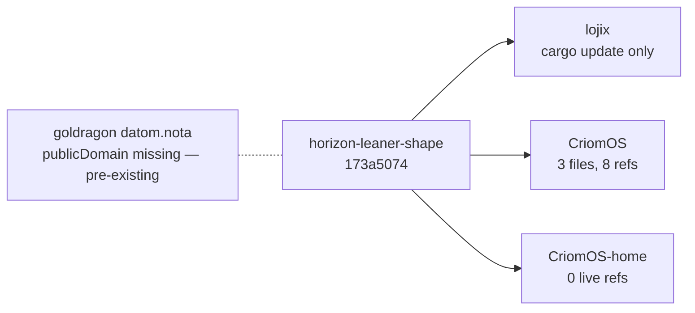
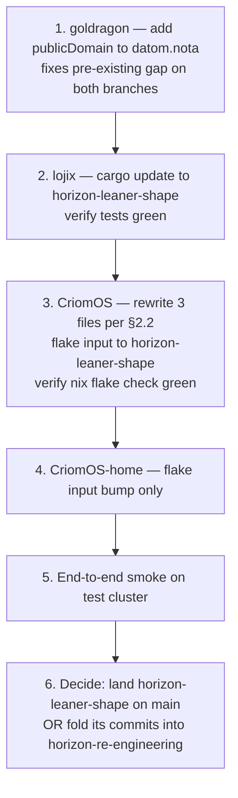

# 18 — horizon-leaner-shape downstream pickup, 2026-05-17

*Handoff report. The `horizon-leaner-shape` sibling branch of
horizon-rs implements the structural cleanups from /17 and is
green at the library level. This report names the downstream
consumer rewrites needed to land the wire-format break end-to-end,
file by file, so operator / system-specialist can pick up the work
without re-deriving the scope.*

> **Status (2026-05-17):** Pickup-ready. horizon-rs/horizon-leaner-shape
> is at commit `173a5074`, five commits ahead of horizon-re-engineering,
> 197 tests green, ARCHITECTURE.md rewritten. No downstream
> consumer has been updated yet — by design, per the user's
> "sibling branch" coordination decision in
> `reports/system-assistant/16-lojix-current-code-audit-2026-05-16.md`'s
> follow-up dialogue.

## 0 · TL;DR

The leaner shape changes the JSON wire form that Nix consumers
read. Five things break:

1. `node.typeIs.*` (struct of 11 booleans) is gone. Gate on
   `node.species == "Center"` instead.
2. `node.computerIs.*` (struct of 8 booleans) is gone. Gate on
   `(node.machine.model or null) == "Rpi3B"` etc.
3. `node.handleLidSwitch{,ExternalPower,Docked}` (three systemd
   lid-action strings) are gone. The Nix lid module derives them
   locally from `node.behavesAs.{center, edge, lowPower}`.
4. `node.hasVideoOutput` is gone (= `node.behavesAs.edge`).
5. `node.buildCores` is gone (= `node.maxJobs`).

The actual consumer surface — across CriomOS + CriomOS-home —
is **three live files** with **eight live references**. Smaller
than the audit's "~1,500 lines retired" framing implied; that
estimate was for the more aggressive scope. Within the
itemized §6 scope actually implemented, downstream pickup is
half a day of focused edits.



## 1 · The pinned source

| Repo | Branch | Tip SHA | Commits added |
|---|---|---|---|
| `horizon-rs` | `horizon-leaner-shape` | `173a5074` | 5 (Phase A–E) |

The 5 commits, in landing order:

- `3d58209b` — drop `TypeIs` + `ComputerIs` (enum-shadow structs)
- `9aa6abe0` — drop same-value-twice fields (`build_cores`,
  `has_video_output`, `handle_lid_switch*`, `LidSwitchAction`,
  `LidSwitchPolicy`)
- `13d6c14b` — add typed newtypes (`PublicDomain`, `EmailAddress`,
  `MatrixId`, `Ssid`, `IsoCountryCode`)
- `289d2c9f` — drop shape-equivalent `view::Machine` and `view::Io`
- `173a5074` — rewrite ARCHITECTURE.md

To consume: change a downstream flake-input pin from
`?ref=horizon-re-engineering` to `?ref=horizon-leaner-shape`.

## 2 · Per-repo punch list

### 2.1 `lojix` (the daemon + thin CLI)

**Scope: cargo update.** Zero source edits required.

Grep across `/home/li/wt/github.com/LiGoldragon/lojix/horizon-re-engineering/src/`
for every wire-broken field name returns nothing. The daemon reads:

| Field | Status |
|---|---|
| `horizon.node.is_remote_nix_builder` | unchanged, used at `deploy.rs:1244, 1255` |
| `horizon.node.system` | unchanged (`System` enum, untouched) |
| `horizon.node.criome_domain_name` | unchanged |
| `horizon.node.nix_cache` | unchanged |
| `horizon.node.nix_pub_key_line` | unchanged |
| `horizon.node.ssh_pub_key` | unchanged |

The daemon does not read `type_is.*`, `computer_is.*`,
`handle_lid_switch*`, `has_video_output`, `build_cores`, or
`view::Machine` / `view::Io` as separately-imported types.

**Action:**

```sh
# Pin horizon-lib to the leaner-shape branch
git -C ~/wt/.../lojix/<branch>/ edit Cargo.toml
# horizon-lib = { git = "...", branch = "horizon-leaner-shape", package = "horizon-lib" }
cargo update -p horizon-lib
cargo test --jobs 1 -- --test-threads=1
```

If `cargo test` passes, lojix is done. Branch this work as
`lojix/horizon-leaner-shape` in a parallel worktree if combining
with system-specialist's in-flight sema work; otherwise land on the
existing `lojix/horizon-re-engineering` branch when ready.

### 2.2 `CriomOS` — three live files, eight references

Branch: `horizon-re-engineering`. All references found via
`git grep` against the branch tip.

#### 2.2.1 `modules/nixos/metal/default.nix`

Five live edits + one comment cleanup:

| Line | Current | After |
|---|---|---|
| `24` | `computerIs` (destructure from horizon) | drop from destructure list |
| `25–27` | `handleLidSwitch / handleLidSwitchExternalPower / handleLidSwitchDocked` | drop from destructure list; derive locally |
| `277` | `(if computerIs.rpi3b then ...)` | `(if (node.machine.model or null) == "Rpi3B" then ...)` |
| `449` | `# !typeIs.center; # Broken` (commented out) | delete the dead comment |
| `453–455` | `HandleLidSwitch = handleLidSwitch; HandleLidSwitchExternalPower = handleLidSwitchExternalPower; HandleLidSwitchDocked = handleLidSwitchDocked;` | derive from `node.behavesAs` — see policy below |

The lid-switch policy, ported from `view/node.rs:BehavesAs::lid_switch_policy()`:

```nix
let
  behavesAs = horizon.node.behavesAs;
  onBattery = if behavesAs.center then "ignore" else "suspend";
  onExternalPower =
    if behavesAs.center then "ignore"
    else if behavesAs.lowPower then "suspend"
    else "lock";
  docked = if behavesAs.edge then "lock" else "ignore";
in {
  HandleLidSwitch = onBattery;
  HandleLidSwitchExternalPower = onExternalPower;
  HandleLidSwitchDocked = docked;
}
```

The policy is identical to what horizon-rs used to ship; the
discipline change is *where the policy lives* — now in the
consumer that uses it, not on the projection.

#### 2.2.2 `modules/nixos/normalize.nix`

| Line | Current | After |
|---|---|---|
| `26` | `hasVideoOutput` (destructure) | replace with `behavesAs` |
| `30` | `hasAudioOutput = hasVideoOutput;` | `hasAudioOutput = behavesAs.edge;` (or destructure `behavesAs` and use its `.edge`) |

#### 2.2.3 `modules/nixos/nix/client.nix`

| Line | Current | After |
|---|---|---|
| `67` | `build-cores = node.buildCores;` | `build-cores = node.maxJobs;` |

#### 2.2.4 `checks/nix-role-policy/default.nix` (test fixture)

| Line | Current | After |
|---|---|---|
| `15` | `buildCores = 2;` | `maxJobs = 2;` |
| `26` | `buildCores = 8;` | `maxJobs = 8;` |

This is a synthetic horizon fixture for the role-policy check.
Sibling fields like `maxJobs` should also already be present;
the rename is mechanical.

### 2.3 `CriomOS-home` — zero live references

Only hit was `modules/home/profiles/min/pi-models.nix:24` — and
that line is *already a comment* on horizon-re-engineering
(`# — lib.findFirst (n: n.typeIs.largeAiRouter) ...`). The live
consumer was already removed during the refactor arc.

No action needed for CriomOS-home.

### 2.4 `goldragon` — pre-existing gap, not introduced by this arc

The leaner-shape branch (like horizon-re-engineering before it) has
`pub public_domain: PublicDomain` on `ClusterProposal` — a *required*
field with no `#[serde(default)]`. Goldragon's `datom.nota` on
`horizon-re-engineering` does NOT carry a `publicDomain` value
(verified by `git show horizon-re-engineering:datom.nota | tail`;
the cluster record ends with the `domain: ClusterDomain` literal
`"criome"`).

This means **end-to-end projection of goldragon's datom currently
fails on both horizon-re-engineering and horizon-leaner-shape**. The
unit tests pass because they use synthetic fixtures that supply
`public_domain` explicitly. The gap is pre-existing — system-
specialist's step 3 ("criomeDomainName rename / cluster-domain
policy") landed the field in horizon-rs but the matching
goldragon datom edit didn't follow.

**Action (independent of leaner-shape, but blocks the
end-to-end smoke):**

Add `"criome.net"` at the tail of the `ClusterProposal` record in
`/git/.../goldragon/datom.nota`, after the `"criome"` ClusterDomain
literal. Per `PublicDomain::try_new` validation, `"criome.net"` is
valid (non-empty). After the edit, goldragon's datom round-trips
through both `horizon-re-engineering` and `horizon-leaner-shape`.

## 3 · Cutover strategy

The cleanest landing sequence keeps each repo on a sibling branch
matching `horizon-leaner-shape`:



Step 6 is a designer/user decision, not an operator one. Two
options:

- **(a) Land as-is on main.** `horizon-leaner-shape` merges to
  main. `horizon-re-engineering` rebases on the new main (the
  in-flight system-specialist work continues from there). The
  leaner shape becomes the production design.
- **(b) Cherry-pick into horizon-re-engineering.** The five Phase
  A–E commits land on horizon-re-engineering directly; the
  sibling branch retires. Simpler history but disrupts
  system-specialist's in-flight sema work mid-arc.

Recommendation: **(a)**. The Phase A–E commits are self-contained,
the wire-break is honest, and folding into an active branch
multiplies coordination cost.

## 4 · Risks and known gaps

### 4.1 The pre-existing goldragon gap

§2.4 above. Fixing it is a one-line datom edit but it's a
prerequisite for any end-to-end test — and it's needed regardless
of whether the leaner shape lands.

### 4.2 Pre-existing clippy lint in lib/tests/vpn.rs

`infallible_destructuring_match` on `VpnProfile` at line 59.
Predates this arc. Suggested fix in the lint hint:

```rust
let VpnProfile::NordvpnProfile(nordvpn) = &profile;
```

Not a blocker; runs as `cargo test`. Only fails `cargo clippy --
-D warnings`. Worth fixing alongside the leaner-shape merge.

### 4.3 Strict-Edge gate subtlety

`proposal/node.rs:142` previously used `!type_is.edge` (true only
for literal `Edge` species) as a remote-builder gate. The leaner
shape replaces it with `!matches!(self.species, NodeSpecies::Edge)`
to preserve the narrow reading (`EdgeTesting` and `Hybrid` remain
eligible builders). If `BehavesAs` ever inherits this gate, the
test `edge_node_at_least_medium_with_keys_is_remote_nix_builder`
will surface the regression. Inline comment in the code names why.

### 4.4 ARCHITECTURE.md vs `docs/DESIGN.md`

The new ARCHITECTURE.md describes the leaner shape honestly.
`docs/DESIGN.md` and `docs/BUILD_CORES.md` were not touched in
this pass. If they describe the proposal/view split as
load-bearing rather than as a refactoring waypoint, they're
carrying the same overbuild narrative at the prose layer; a
sweep over them is worth folding into the cutover or a follow-up.

## 5 · Verification at each step

Each step has a clear green/red gate:

| Step | Witness |
|---|---|
| 1 (goldragon) | `horizon-cli project goldragon --viewpoint goldragon:prometheus` writes JSON without error |
| 2 (lojix) | `cargo test --jobs 1 -p lojix -- --test-threads=1` green; `nix build .#checks.x86_64-linux.daemon-cli-integration` green |
| 3 (CriomOS) | `nix flake check` on CriomOS-test-cluster green (all 5 named checks: cluster-contracts, full-module-contracts, projections-match-fieldlab, multiple-tailnet-controllers-rejected, source-constraints) |
| 4 (CriomOS-home) | Flake lock updates cleanly; `nix flake check` on CriomOS-home (if separate) green |
| 5 (end-to-end smoke) | `nix run .#persona-dev-stack-smoke` (or equivalent) prints `passed`; one full deploy through `lojix-daemon` to the test cluster succeeds |

If step 5 fails for a reason that traces to the wire-break, the
fix is mechanical — find the Nix consumer that's still reading a
retired field and update it per §2.

## 6 · Why this scope and not bigger

The audit in `/17 §6` sketched a more aggressive leaner shape
(retire `view::Cluster`/`view::User`/`view::Node`, factor a
`Derived` sub-record). I implemented the narrower "what goes
away" list from the same section:

- ✅ `view::Machine` and `view::Io` retired (shape-equivalent
  duplications)
- ✅ `TypeIs` and `ComputerIs` retired (pure enum shadows)
- ✅ Same-value-twice fields retired (`build_cores` /
  `has_video_output` / `handle_lid_switch*`)
- ❌ `view::Cluster` / `view::Node` / `view::User` kept

`view::Cluster` carries `secret_bindings: BTreeMap<…>` resolution
(genuine projection work, not duplication). `view::Node` carries
the seven derived booleans + `BehavesAs` + viewpoint-only fields
that only exist after projection. `view::User` carries trust
ladder + the computed booleans + typed `EmailAddress` / `MatrixId`.
Per /17 §6 "What stays," all three earn their place.

The aggressive `Derived` sub-record refactor is a separate
arc — worth considering once this lands, but not load-bearing
for the immediate cleanup. The pickup work above gets the
honest wire shape into production without that extra structural
churn.

## 7 · See also

- `reports/system-assistant/16-lojix-current-code-audit-2026-05-16.md`
  — companion audit; coordination decision context.
- `reports/system-assistant/17-horizon-rs-overbuild-audit-2026-05-16.md`
  — the audit this arc implements.
- `reports/system-specialist/119-horizon-data-needed-to-purge-criomos-literals.md`
  — the system-specialist's refactor step list. The
  `public_domain` gap (§2.4) is one of step 3's incomplete
  pieces.
- `~/wt/github.com/LiGoldragon/horizon-rs/horizon-leaner-shape/`
  — the worktree carrying the five Phase A–E commits.
- `~/wt/github.com/LiGoldragon/horizon-rs/horizon-leaner-shape/ARCHITECTURE.md`
  — the rewritten ARCH describing today's leaner shape.
- `~/primary/ESSENCE.md` §"Backward compatibility is not a
  constraint" — frames the wire-break as the right shape, not as
  disruption to manage.

*End report 102.*
