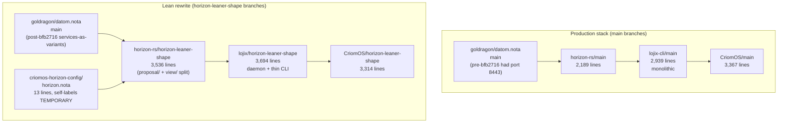
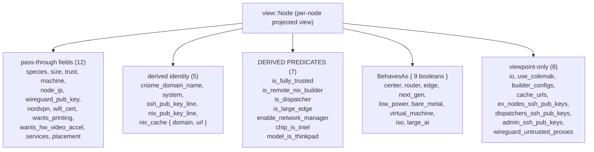

# 26 — lean-rewrite shape analysis (Logix/Horizon/CriomOS)

System-assistant analysis of the lean-rewrite stack (lojix daemon + thin
CLI; horizon-rs lean-shape; CriomOS lean-shape; criomos-horizon-config;
goldragon cluster proposal) measured against psyche-stated intent on
cluster-data shape, horizon scope, and naming. Sister upstream:
psyche statements logged to `intent/horizon.nota`,
`intent/nota.nota`, `intent/nix.nota` on `mmvsxskm 9b96c052` (system-
assistant: log psyche intent on lean-rewrite analysis kickoff).

## 0 · TL;DR

The lean rewrite is **mostly on direction**. The new horizon-rs lean
shape already favors variants (NodeSpecies, NodePlacement, NodeServices),
already eliminated the `is_nix_cache + nix_cache_domain + nix_url` trio
into a typed `NixCache { domain, url }` record, and already collapsed
the `ygg_pub_key + ygg_address + ygg_subnet` trio into a typed
`YggPubKeyEntry`. Goldragon's recent commit `bfb2716` (services →
variant vector with `(TailnetClient) (NixBuilder None) (PersonaDevelopment …)`)
retroactively validates the variants-over-booleans rule and pulled port
`8443` and the domain string `"tailnet.goldragon.criome"` out of cluster
data into where they belong (Nix code).

But the rewrite is **not finished on this direction**. Three structural
gaps remain at high signal:

1. **`view::Node` still emits seven derived-predicate booleans** plus a
   nine-boolean `BehavesAs` record — sixteen boolean leaves in total
   computed from the same variant data that already crosses the wire.
   The psyche's intent says horizon should be a clean projector; per the
   beautiful-horizon-over-beautiful-nix principle, those derivations
   move to Nix.
2. **Four bare booleans survive on `NodeProposal`**: `nordvpn`,
   `wifi_cert`, `wants_printing`, `wants_hw_video_accel`. Plus one
   `Option<bool>` (`online`) that's really operational state in disguise.
3. **Horizon constructs `nix_cache.url = format!("http://{domain}")`** —
   one of two domain-construction recipes the psyche explicitly named as
   belonging in Nix, not in horizon. The other (CriomeDomainName
   assembly) is more defensible because it's a typed identity, not a
   transport URL.

Below: tree visuals, field-by-field tables, current-vs-proposed
sketches, naming gaps, and the seven intent-clarification questions
worth psyche attention before the next round of refactor.

## 1 · The two stacks side by side



Line counts only show the surface. The lean horizon is bigger because
input/output finally have a clean split (proposal/ produces, view/
consumes); the lean lojix is bigger because the daemon adds socket
handling and signal-lojix wire types. The relevant question isn't
"how many lines" but "what shape do those lines carry."

## 2 · Cluster data shape (goldragon's `NodeProposal`)

`NodeProposal` is the per-node positional record goldragon writes; horizon
reads it as input. The psyche-stated destination: very minimal — node
type + disk + maybe nothing else one day. Field-by-field assessment
(positional declaration order, per `horizon-rs/lib/src/proposal/node.rs:31`):

| # | Field | Type | Category | Verdict |
|---|---|---|---|---|
| 1 | `species` | `NodeSpecies` enum | role | ✓ good — variant |
| 2 | `size` | `Magnitude` enum | dial | ✓ good — variant ladder |
| 3 | `trust` | `Magnitude` enum | dial | ✓ good — variant ladder |
| 4 | `machine` | `Machine` record | hardware | ✓ good — typed record |
| 5 | `io` | `Io` record (disks, kbd, bootloader) | disk | ✓ good — psyche's "last convoluted thing" |
| 6 | `pub_keys` | `NodePubKeys` record | identity | ✓ good — typed record |
| 7 | `link_local_ips` | `Vec<LinkLocalIp>` | network | ⚠ transitional — duplicates Yggdrasil substrate |
| 8 | `node_ip` | `Option<NodeIp>` | network | ✓ acceptable — the Yggdrasil IPv6 identity |
| 9 | `wireguard_pub_key` | `Option<WireguardPubKey>` | identity | ✓ good — presence-as-Option |
| 10 | `nordvpn` | **`bool`** | feature | ✗ **GAP — bare boolean** |
| 11 | `wifi_cert` | **`bool`** | feature | ✗ **GAP — bare boolean** |
| 12 | `wireguard_untrusted_proxies` | `Vec<WireguardProxy>` | network | ⚠ empty for all 5 nodes; may be dead |
| 13 | `wants_printing` | **`bool`** | feature | ✗ **GAP — bare boolean, "wants_" prefix** |
| 14 | `wants_hw_video_accel` | **`bool`** | feature | ✗ **GAP — bare boolean, "wants_" prefix** |
| 15 | `router_interfaces` | `Option<RouterInterfaces>` | network | ⚠ acknowledged hack (Yggdrasil/network-daemon successor) |
| 16 | `online` | **`Option<bool>`** | operational | ✗ **CATEGORY ERROR — operational state in cluster facts** |
| 17 | `number_of_build_cores` | `Option<u32>` | dial | ⚠ ok if real cluster fact; review whether it belongs in Nix |
| 18 | `services` | `Vec<NodeService>` | role | ✓ **EXCELLENT — variants vector (recent refactor bfb2716)** |
| 19 | `placement` | `NodePlacement` enum | role | ✓ good — variant |

Of 19 fields, three categories are good (variant, typed record,
optional-by-presence), one is the acknowledged interface-name hack,
one is the new exemplar (services), and **five fail the variants-over-
booleans rule** (#10, #11, #13, #14) or **the cluster-facts-not-
operational-state rule** (#16).

### 2.1 · Boolean → variant — the four gaps

**`nordvpn: bool`**. Today: `true` means the node runs the nordvpn
client. The variant form depends on whether nordvpn has parameters
worth surfacing in cluster data (server choice, kill-switch, etc.). If
yes: `Option<NordvpnProfile>` with the profile carrying the inline
config. If it's pure on/off with a single configured behavior: fold it
into `services` as `(NordvpnClient)` — same place as `(TailnetClient)`.

**`wifi_cert: bool`**. Today: `true` means the node carries a wifi
certificate (eduroam-style). Same question: data carried by the variant?
A cert identifier? A `(WifiCert (CertReference …))` variant in
`services` reads better than a sibling boolean.

**`wants_printing`, `wants_hw_video_accel`**. Today: bare opt-ins. The
`wants_` prefix is the smell — it reads as imperative-from-user, but
it's actually capability-of-node. A `features: Vec<NodeFeature>` field
with `Printing` and `HwVideoAccel { decoder: Option<DecoderHint> }`
variants both groups them and opens room for inline tuning. Or fold
into `services` if these are conceptually services.

The **shape of the answer is the intent-clarification question**: is
the right form (a) presence-as-Option-of-data-record for each opt-in
separately, (b) a `features: Vec<NodeFeature>` collected vector, or
(c) extend `services` to carry these too (so `services` becomes the
single "what does this node do" list)? Psyche-precedent is (c) —
because the bfb2716 services refactor named that vector as the role
list, and `(NixCache)` + `(TailnetClient)` are exactly the "what does
this node do" answer.

### 2.2 · `online: Option<bool>` — category error

`online` declares whether the node is administratively reachable, so
dispatchers don't list it as a build target. That's deployment-time
observe-ability, not a cluster fact. The cluster description says what
nodes exist and what they do; whether a given node is currently up is a
lojix-daemon question, not a goldragon datom question. Carrying it in
cluster data couples the source-of-truth file (datom.nota) to
operational state that changes on the order of minutes.

The intent-clarification question: does `online` belong (a) in a separate
ledger the lojix daemon maintains (operational view, not cluster fact),
(b) in cluster data as today but renamed to reflect it's a manual
administrative override, or (c) removed entirely (let dispatchers
discover reachability)?

### 2.3 · `router_interfaces` — the acknowledged hack

Already covered by `intent/horizon.nota` 2026-05-20 — short-term hack
pending a network daemon. No design action now; flagged so future
shape work doesn't deepen the interface-name model.

### 2.4 · `link_local_ips: Vec<LinkLocalIp>`

Currently empty for all 5 nodes in datom.nota. Per the Yggdrasil
principle (`intent/horizon.nota` 2026-05-20), per-node IPv6 identity is
the `node_ip` field; routing bootstraps from there. `link_local_ips` may
be vestigial from the IPv4 era. Worth a removal pass after
intent-clarification confirms it's dead.

## 3 · Horizon's type tree

The lean horizon already gets the big structural decision right:
**`view::Node` reuses input types directly** (no `InputMachine` /
`OutputMachine` duplication). `Machine`, `Io`, `NodePlacement`,
`NodeServices`, and `RouterInterfaces` flow through with no second-
shape twin. Per the no-passthrough-duplication principle: clean.

But `view::Node` adds **sixteen derived predicate booleans** that the
consumer (CriomOS Nix) could compute itself from the variant inputs it
already gets. Tree:



### 3.1 · The sixteen derived booleans

All sixteen are computed from `species` + `placement` + `size` + `trust`
+ `machine.arch` — variants horizon already emits. Example
(`proposal/node.rs:147-156`):

```rust
let is_remote_nix_builder = online
    && !matches!(self.species, NodeSpecies::Edge)
    && is_fully_trusted
    && (sized_at_least.medium || behaves_as.center)
    && has_base_pub_keys;
let is_dispatcher = !behaves_as.center && is_fully_trusted && sized_at_least.min;
let is_nix_cache = behaves_as.center && sized_at_least.min && has_base_pub_keys;
let is_large_edge = sized_at_least.large && behaves_as.edge;
let enable_network_manager =
    sized_at_least.min && !behaves_as.iso && !behaves_as.center && !behaves_as.router;
```

`BehavesAs::derive` (`view/node.rs:144`) is similarly a `matches!`-fest
over the same `species` + `placement` inputs that already go to Nix.

Per the beautiful-horizon principle, this entire predicate-derivation
layer can live in CriomOS Nix. Nix already has the same input data
(species, placement, size, trust come across the wire); deriving
`is_remote_nix_builder = !(species == "edge") && fully_trusted && …`
in Nix is ordinary `let` bindings. Removing all sixteen predicates
shrinks `view::Node` by half its boolean leaves; horizon's projection
logic gets correspondingly smaller; Nix gains a few `let` expressions.

**The intent-clarification question**: does the psyche want all sixteen
removed, or only the ones whose derivation is trivially a `matches!`
on one variant (the BehavesAs nine), keeping the multi-input
predicates (is_remote_nix_builder etc.) in horizon as documented
business logic?

Argument for "remove all sixteen": horizon stays a projector, not a
business-logic emitter. Argument for "keep the multi-input ones":
they're real cluster decisions that benefit from typed Rust + tests.
Per `disregard implementation cost completely; the better long-term
logic always wins` (`intent/workspace.nota` 2026-05-20T00:30:00Z), the
choice is on long-term logic, not on how easy each move is.

### 3.2 · `nix_cache.url` — the domain-construction example

`view::node.rs:159-165`:

```rust
let nix_cache = if is_nix_cache {
    let domain = criome_domain_name.nix_subdomain();
    let url = format!("http://{domain}");
    Some(view::NixCache { domain, url })
} else {
    None
};
```

The `format!("http://{domain}")` is exactly the psyche's example of "how
to construct such and such domain name" that belongs in Nix, not in
horizon. The shape per psyche intent: horizon emits
`nix_cache: Option<CriomeDomainName>` (just the domain); CriomOS Nix
formats `"http://${horizon.nixCache}"` at the consumption site, near
the other constants (port 80 lives in `modules/nixos/nix/cache.nix:12`
already — perfect place for the URL prefix too).

This is small (4 lines), but it's the canonical example: any time
horizon hands Nix a string that's "X" prepended/appended to typed data,
the formatter belongs on the Nix side.

### 3.3 · `BuilderConfig` — string-bag growth

`view::node.rs:174` and onward defines `BuilderConfig` with
`supported_features: Vec<String>` and several SSH-key-formatted
strings. The string-typed `supported_features` (line 180) is a
typed-records-over-flags violation in waiting — features in Nix's
`nix.buildMachines.<n>.supportedFeatures` are a small closed enum
(`big-parallel`, `kvm`, `nixos-test`, etc.). Per `skills/typed-records-
over-flags.md`: name them as a typed variant set in horizon and let Nix
render the strings.

## 4 · The horizon-vs-nix split — where each constant lives

Current state (per CriomOS lean and horizon-rs lean):

| Constant | Currently in | Should be in | Status |
|---|---|---|---|
| Nix-serve port 80 | CriomOS Nix (`modules/nixos/nix/cache.nix:12,34`) | CriomOS Nix | ✓ correct |
| Nix-serve UID 199 | CriomOS Nix (`modules/nixos/nix/cache.nix:19,25`) | CriomOS Nix | ✓ correct |
| `http://` URL prefix for nix cache | **Horizon (`view/node.rs:161`)** | CriomOS Nix | ✗ leak |
| `criome_domain_name` assembly | Horizon (`view/node.rs:111`) | Horizon (typed identity, not transport URL) | ✓ defensible |
| `nix_pub_key_line` line-format | Horizon (`view/node.rs:158`) | depends — see §6 | ⚠ borderline |
| Headscale ports / tailnet domain | (absent in lean — was port 8443 in pre-bfb2716 goldragon) | CriomOS Nix | ✓ correct after bfb2716 |
| DNS resolver list (public) | (not surveyed; likely CriomOS Nix) | CriomOS Nix | ✓ correct |
| Firewall rules (port 80 for cache) | CriomOS Nix (`modules/nixos/nix/cache.nix:12`) | CriomOS Nix | ✓ correct |

Pattern: **constants stay in CriomOS Nix gated by horizon predicates**
(`node.nixCache != null` opens the cache module which applies port 80).
Two leaks remain: the `http://` URL prefix, and (debatable) the
SSH/Nix key line-format strings.

## 5 · Lojix lean vs lojix-cli production

The lojix lean rewrite is a clean shape on the daemon-vs-CLI split (the
daemon owns effect logic; the CLI is a thin wire-frame adapter). On the
shape we care about for this report — what types cross the wire, and
whether constants leak in:

| Concern | lojix-cli (prod) | lojix (lean) |
|---|---|---|
| Verb-set entry point | `LojixRequest { FullOs, OsOnly, HomeOnly, CheckHostKeyMaterial }` | `signal-lojix` wire contract (`Deploy`, `Pin`, `Query`, `WatchDeployments` etc.) |
| Port numbers in types | none | none |
| DNS / domain construction in types | none | none |
| Type duplication in deploy verbs | **near-duplicate `FullOs`/`OsOnly`/`HomeOnly` carry identical fields** (cluster, node, source, criomos, builder, substituters); differ only in flake ref + which activation runs | **Single `Deploy(DeploymentRequest)`** — DeploymentRequest is one typed record |

The lean shape's collapse to `Deploy(DeploymentRequest)` already fixes
the verb-near-duplication problem. The production stack's
FullOs/OsOnly/HomeOnly trio is a real type-duplication smell — but it's
the production stack, and the destination is the lean rewrite.

## 6 · Naming gaps

Beyond the boolean→variant gap and the `wants_` prefix smell already
covered:

| Gap | Where | Suggested form |
|---|---|---|
| `is_remote_nix_builder` predicate | `view::Node:79` | If it survives the §3.1 removal pass: rename to `serves_as_nix_builder` to lose the `is_` prefix (read as English, not as a predicate). Better still: move to Nix and drop. |
| `is_dispatcher` | `view::Node:80` | Same — `serves_as_dispatcher` or move to Nix. |
| `enable_network_manager` | `view::Node:82` | Imperative naming (`enable_X`) for a derived predicate. If it stays: `network_manager_eligible` or move to Nix. |
| `wants_printing`, `wants_hw_video_accel` | `NodeProposal:56,63` | Pluralize-and-collect: `features: Vec<NodeFeature>` with `Printing`, `HwVideoAccel { decoder: Option<DecoderHint> }` variants. |
| `BehavesAs { 9 bools }` | `view::Node:132` | If it survives §3.1: rename to `Behaves` (the field already names the role: `behaves_as: Behaves`). Drop the helper struct entirely if Nix derives the predicates. |
| `link_local_ips` | `NodeProposal:41` | If confirmed dead post-Yggdrasil: delete. |
| `online: Option<bool>` | `NodeProposal:79` | Either (a) remove (let dispatchers discover reachability), (b) move to operational ledger, or (c) rename `administratively_offline: bool` to flip the polarity and clarify it's the operator-set field, not the live state. |

The `is_` / `wants_` / `enable_` prefix family is the broader smell: any
field whose name reads as a question ("is this X?", "does this want
Y?", "should we enable Z?") tends to be a boolean that's hiding a
variant or that belongs on the consumer side.

## 7 · Surprises worth noting

1. **goldragon's services refactor (bfb2716) is the model.** That commit
   message says *"cluster data carries selectors, not ports or domains."*
   Same direction the psyche restated in this turn; the precedent
   exists and a new agent looking at the codebase can find it. The
   refactor that removed port 8443 + the domain string from datom.nota
   is exactly the shape this report recommends extending to the four
   remaining bare booleans.

2. **`view::NixCache { domain, url }` was already a collapse-win.** The
   doc comment on `view::Node:88-94` records that `is_nix_cache: bool +
   nix_cache_domain: Option<…> + nix_url: Option<String>` (three sibling
   fields) became one typed `Option<NixCache>` record. Same shape as the
   `ygg_pub_key + ygg_address + ygg_subnet → YggPubKeyEntry` collapse.
   The pattern is "presence ⇔ feature; entry carries the data." Apply
   it to `nordvpn`, `wifi_cert`, `wants_printing`, `wants_hw_video_accel`.

3. **`criomos-horizon-config/horizon.nota` is 13 lines** and the one
   transitional field self-labels as TEMPORARY. This is the destination
   shape for cluster data: small, dial-only, transitional concessions
   marked transitional. Use as the gold standard.

4. **lojix-cli's FullOs / OsOnly / HomeOnly trio is the only stack-side
   verb duplication.** The lean rewrite already converged on one
   `Deploy(DeploymentRequest)` shape; production remains
   pre-convergence. No action needed against production (it's the
   bootstrap stack); the lean shape is the destination.

5. **forge is `todo!()`-as-design.** Confirms the psyche framing —
   concept only. No threat to this analysis; named only so future
   horizon shape choices don't accidentally hardcode Nix assumptions
   beyond what's already there.

## 8 · The intent-clarification questions

Seven questions the psyche should answer before the next round of
refactor. Listed with enough substance that the answer can stand on
its own.

### 8.1 · What variant shape should the four bare booleans take?

`nordvpn`, `wifi_cert`, `wants_printing`, `wants_hw_video_accel` on
`NodeProposal`. Three candidate shapes:

- **(a) Extend `services` to carry them**: `(NordvpnClient)`,
  `(WifiCert (CertReference …))`, `(Printing)`, `(HwVideoAccel
  (DecoderHint …))` as additional variants in the existing
  `services: Vec<NodeService>`. Single "what does this node do" list.
- **(b) Add a sibling `features: Vec<NodeFeature>`**: separate vector
  for user-side opt-ins distinct from cluster-role services. Keeps
  `services` for cluster-role concepts (NixBuilder, NixCache) and
  `features` for user-side toggles.
- **(c) Optional-record-per-field**: `nordvpn: Option<NordvpnProfile>`,
  `wifi_cert: Option<WifiCertCapability>`, etc. — presence-as-Option
  with a data-carrying record. Same pattern as `wireguard_pub_key:
  Option<WireguardPubKey>`.

The bfb2716 precedent leans (a). The role-vs-feature distinction leans
(b). Pure presence-as-data leans (c).

### 8.2 · Should the sixteen derived predicates move from horizon to Nix?

`view::Node` carries seven derived booleans (`is_remote_nix_builder`,
`is_dispatcher`, `is_large_edge`, etc.) plus `BehavesAs { 9 booleans }`
that horizon computes from `species + placement + size + trust + arch`
inputs that already cross the wire. CriomOS Nix could derive them
itself.

- **Remove all sixteen**: horizon stays a clean projector; Nix gains
  ~30 lines of `let` bindings.
- **Keep the multi-input ones, remove the BehavesAs nine**:
  `BehavesAs::derive` is pure `matches!` on `species` + `placement`;
  trivially Nix-able. The multi-input predicates (`is_remote_nix_builder`)
  combine three inputs with business logic worth keeping in typed Rust
  with tests.
- **Keep all sixteen**: horizon documents the derivation in Rust where
  it's testable; Nix consumes ready-to-gate booleans.

Per the beautiful-horizon principle, leaning (remove all). But this is
the kind of decision worth psyche affirmation because it inverts the
current direction.

### 8.3 · Does `online: Option<bool>` belong in cluster data?

It's operational state in a cluster-facts file. Three resolutions:

- **Remove**: let dispatchers discover reachability at deploy time.
- **Move to operational ledger** (lojix daemon's state).
- **Keep but rename** `administratively_offline: bool` (default false)
  so it reads as the operator-set field, not the live state.

### 8.4 · Should `nix_cache.url` formatting move from horizon to Nix?

`view::node.rs:161` does `format!("http://{domain}")`. The psyche's
explicit example. Removing the `url` field from `view::NixCache` and
letting CriomOS format it (`"http://${horizon.nixCache.domain}"`) is
the obvious move. Confirming because it sets precedent: any future
URL/path/cert-bundle string that horizon emits as a formatted string
should follow the same rule.

### 8.5 · Is `link_local_ips: Vec<LinkLocalIp>` dead?

Empty for all 5 nodes in datom.nota. Yggdrasil substrate makes
link-local addressing obsolete (per `intent/horizon.nota` 2026-05-20).
Confirming "yes, delete" lets the lean rewrite drop a field and a type.

### 8.6 · Should `services` rename to acknowledge it's the role list?

After absorbing nordvpn / wifi_cert / wants_* as variants (option (a)
from §8.1), `services` becomes the single answer to "what does this
node do." `services` is fine but reads narrower than the actual scope.
`roles: Vec<NodeRole>`? `does: Vec<NodeFunction>`? Or keep `services`
because the variants themselves carry the scope?

### 8.7 · `BuilderConfig.supported_features: Vec<String>` — typed enum?

`view::node.rs:180` types this as a `String` bag. Nix's
`nix.buildMachines.<n>.supportedFeatures` is a small closed set
(`big-parallel`, `kvm`, `nixos-test`). Worth typing as
`Vec<NixBuilderFeature>` enum and letting Nix render the strings? Or
is it fine as `String` because the set is small and stable enough that
the typed enum buys little?

## 9 · What the lean rewrite already gets right

For the record (and so future passes don't re-litigate):

1. **No input/output type duplication for pass-through data.** `Machine`,
   `Io`, `NodePlacement`, `NodeServices`, `RouterInterfaces` flow from
   proposal/ to view/ with no twin output type. Direct serde
   pass-through. ✓ Compliant with `intent/horizon.nota` 2026-05-20
   no-duplication principle.
2. **Sibling-fields-to-typed-record collapses already done.** `NixCache`
   replaced `is_nix_cache + nix_cache_domain + nix_url`; `YggPubKeyEntry`
   replaced `ygg_pub_key + ygg_address + ygg_subnet`. Right pattern.
3. **Services as variant vector (bfb2716).** Pulled port 8443 and a
   domain string out of cluster data. Cluster file now reads role
   directly: `(NixBuilder None) (NixCache) (PersonaDevelopment …)`.
4. **`criomos-horizon-config/horizon.nota` is 13 lines and self-labels
   transitional fields.** Gold-standard shape.
5. **lojix lean collapsed FullOs/OsOnly/HomeOnly to one
   `Deploy(DeploymentRequest)`.** Real duplication fixed.
6. **CriomOS Nix correctly hosts the operational constants** (port 80,
   UID 199, firewall rules) gated by horizon predicates.
7. **Lean horizon's `view::Node` doc comments record collapse history**
   (`view/node.rs:118-122` explains why the NixCache trio became one
   typed record). Future agents see the precedent inline.

## 10 · Reading list

- `intent/horizon.nota` — the nine cluster-data principles logged
  2026-05-20 (this analysis kickoff).
- `intent/nota.nota` 2026-05-20 — Bool/Option breaking-change
  completion record.
- `intent/nix.nota` 2026-05-20 — Forge-as-Nix-successor record.
- `/git/github.com/LiGoldragon/horizon-rs/lib/src/proposal/node.rs` —
  input `NodeProposal` shape (line 31).
- `/git/github.com/LiGoldragon/horizon-rs/lib/src/view/node.rs` —
  output `view::Node` shape (line 25); `NixCache` (line 125);
  `BehavesAs` (line 132); `BuilderConfig` (line 174).
- `/git/github.com/LiGoldragon/goldragon/datom.nota` — current cluster
  proposal (post-bfb2716).
- `/git/github.com/LiGoldragon/criomos-horizon-config/horizon.nota` —
  the destination-shape gold standard (13 lines).
- `/git/github.com/LiGoldragon/CriomOS/modules/nixos/nix/cache.nix` —
  port 80 + UID 199, gated on horizon predicate.

## 11 · Next-session pickup

This report doesn't propose a refactor; it surfaces the seven
intent-clarification questions in §8. Once psyche answers, follow-up
work:

- Per §8.1 answer: refactor `NodeProposal` to remove the four booleans,
  add their variant form (services-extension OR features-vector OR
  optional-records-per-field).
- Per §8.2 answer: if "remove all sixteen", strip the predicate fields
  from `view::Node` and `BehavesAs`; move derivation to CriomOS Nix.
- Per §8.3 answer: handle `online` accordingly.
- Per §8.4 answer: remove `nix_cache.url`; let CriomOS format.
- Per §8.5 answer: delete `link_local_ips` if dead.
- Per §8.6 answer: rename `services` if psyche picks new name.
- Per §8.7 answer: type `supported_features` if psyche picks enum form.

Each is a small mechanical refactor once the shape decision is made.
The bottleneck is psyche attention on the seven shape questions; the
agent work is straightforward after.
