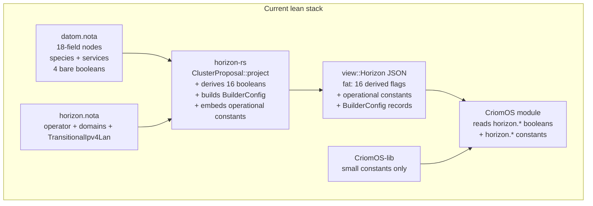
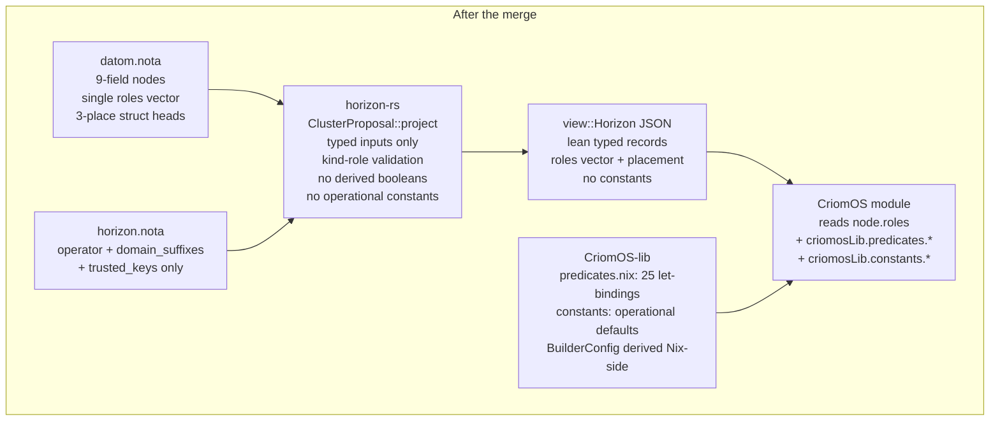

# lean horizon cluster-data shape

## Scope

The destination shape for cluster data and the horizon projection
on the rewrite stack (`horizon-leaner-shape` branches in
`horizon-rs`, `goldragon`, `criomos-horizon-config`, and
`CriomOS-lib`).

Synthesises every settling from the 2026-05-20 → 2026-05-21
psyche review arc, plus the broader cluster-data and NOTA-format
intent on disk:

- `intent/horizon.nota` (variants-over-booleans, no-constants-in-
  horizon, Yggdrasil substrate, beautiful-horizon-over-Nix, the
  roles-merge that landed 2026-05-21);
- `intent/nota.nota` (three-case rule, Bool/Option, mixed-enum,
  `{key value}` map syntax, typed map keys);
- `intent/deploy.nota` (where owner-signal-lojix, criome auth,
  and lojix-daemon-mesh sit — out of scope here, see /28).

Excludes: production `main`-branch stacks; `lojix` migration shape
(`reports/system-specialist/154` + `reports/system-assistant/28`);
owner-signal-lojix authority surface (`/28`).

## Compass

The cluster data is dial-shaped: *what role does this node play,
plus the unavoidable disk-and-interface specifics.* No port
numbers, no domain construction, no operational constants. Roles
are variants — unit when nothing needs configuring, data-carrying
when inline tuning is part of the dial. Horizon is a small clean
projector lowering cluster data into a Nix-consumable shape; the
predicates and constants Nix needs live in `CriomOS-lib`. Beautiful
horizon > beautiful Nix. Forge is the eventual Nix successor; Nix
is the bootstrap substrate.

## What got settled (2026-05-20 → 2026-05-21)

The chronology of decisions, all logged to `intent/horizon.nota`
and `intent/nota.nota`:

| Decision | Source intent record |
|---|---|
| Variants over booleans; data-carrying variants for inline tuning | `horizon.nota` 2026-05-19T12:26 / 2026-05-20 14:50 |
| No port numbers / domain constants / operational constants in horizon | `horizon.nota` 2026-05-20 14:50 |
| 16 view-side derived predicates move Nix-side to `CriomOS-lib` | `horizon.nota` 2026-05-20 15:30 |
| Forge eventual; Nix bootstrap-only | `nix.nota` |
| No input/output type duplication for passthrough | `horizon.nota` 2026-05-20 14:50 |
| 4 bare booleans on NodeProposal fold into the services vector | `horizon.nota` 2026-05-20T18:31 |
| `online: Option<bool>` drops | `horizon.nota` 2026-05-20T18:31 |
| `view::BuilderConfig` drops entirely; Nix iterates exNodes | `horizon.nota` 2026-05-20T18:31 |
| `HorizonProposal.transitional_ipv4_lan` retires from Rust; constants move to `CriomOS-lib` | `horizon.nota` 2026-05-20T18:31 |
| NodeProposal field order: placement → position 2 (after species) | `horizon.nota` 2026-05-20T18:31 |
| `wireguard` joins `NodePubKeys` as `Option<Wireguard>` | `horizon.nota` 2026-05-20T18:31 |
| Wireguard-IP derivation approved; implementation deferred; `node_ip` drops now | `horizon.nota` 2026-05-20T18:45 |
| `NodePlacement::Contained` → `Pod` | `horizon.nota` 2026-05-20T18:45 |
| LargeAi + Router move to NodeService; complex species names retire | `horizon.nota` 2026-05-20T19:00 |
| Categorical model (no constraint logic; no pre-selection defaults) | `horizon.nota` 2026-05-20T19:15 |
| Testing posture moves to a feature variant; species cleaner | `horizon.nota` 2026-05-20T19:15 |
| `CloudHost` stays as a (kind) role; trust ceiling | `horizon.nota` 2026-05-20T19:15 |
| `MediaBroadcast`, `Publication` drop entirely; restore when load-bearing | `horizon.nota` 2026-05-20T19:15 |
| Merge species + services into one `roles: Vec<Role>` field, first position | `horizon.nota` 2026-05-21T00:00 |
| Mutual exclusivity for kind-roles; enum is `Role` (no Node prefix); CloudHost data-carrying with provider | `horizon.nota` 2026-05-21T00:15 |
| NOTA `{key value …}` map syntax; typed map keys land in parallel | `nota.nota` 2026-05-20T18:31 + T18:45 |
| NOTA `True`/`False` PascalCase; `(Some inner)` wrapped | `nota.nota` 2026-05-19 21:30 |
| NOTA three-case rule for PascalCase; struct heads drop | `nota.nota` 2026-05-19 21:00 (eighth restatement 2026-05-20T17:30) |
| Empty-struct variants retire; mixed enums supported by codec | `nota.nota` 2026-05-20 16:30 + `/27` |

The rest of this report is the final shape these decisions
compose to.

## The final shape

### `Role` enum — 15 variants

The merged surface: every kind-role and capability-role lives
here.

```rust
#[derive(NotaEnum)]
pub enum Role {
    // kinds — exactly one of these must appear in a node's roles
    Center,
    Edge,
    CloudHost(CloudProvider),

    // infrastructure capabilities
    TailnetClient,
    TailnetController,
    NixBuilder { maximum_jobs: Option<u32> },
    NixCache,
    PersonaDevelopment { capabilities: Vec<PersonaDevelopmentCapability> },
    Router(RouterInterfaces),

    // node-class capabilities (formerly species compounds)
    LargeAi,
    Testing,

    // opt-in features (formerly bare bools on NodeProposal)
    Nordvpn,
    WpaEnterpriseClient,
    Printing,
    HardwareVideoAccel,
}

#[derive(NotaEnum)]
pub enum CloudProvider {
    Linode,
    Hetzner,
    AwsLightsail,
    // grow as real cloud nodes land
}
```

Naming: bare `Role` (no `Node` prefix) per the no-ancestry rule
— the type lives inside `proposal::node` and the surrounding
namespace already supplies "node" context.

The pre-merge `NodeSpecies` enum (11 variants) and `NodeService`
enum (today 5 variants) both retire entirely. The 4 bare booleans
on `NodeProposal` fold in. `NodeProposal.router_interfaces` folds
in. Total surface collapses from 11 species + 5 services + 4
booleans + 1 RouterInterfaces field = 21 declaration sites → 1
unified `roles` field.

### `NodeProposal` — 9 positional fields (was 18)

```rust
#[derive(NotaRecord)]
pub struct NodeProposal {
    pub roles: Vec<Role>,                       // position 1 — most important
    pub placement: NodePlacement,               // position 2
    pub size: Magnitude,
    pub trust: Magnitude,
    pub machine: Machine,
    pub io: Io,
    pub pub_keys: NodePubKeys,                  // now includes wireguard
    pub link_local_ips: Vec<LinkLocalIp>,       // transitional
    // RETIRED: species, services, router_interfaces, online, node_ip,
    //          wireguard_pub_key, wireguard_untrusted_proxies,
    //          nordvpn, wifi_cert, wants_printing, wants_hw_video_accel
}
```

Pseudonota — the full ouranos node entry inside
`cluster.nodes` map:

```text
ouranos (
  [                                            ;; roles
    Edge
    Testing
    TailnetClient
    TailnetController
    (NixBuilder None)
    HardwareVideoAccel
  ]
  Metal                                        ;; placement
  Large                                        ;; size
  Max                                          ;; trust
  (X86_64 12 ThinkPadT14Gen5Intel None 12 32)  ;; machine
  (Colemak Uefi {                              ;; io
    "/"     ("/dev/disk/by-uuid/38a8…" Ext4 [])
    "/boot" ("/dev/disk/by-uuid/725A…" Vfat ["fmask=0022" "dmask=0022"])
  } [])
  (                                            ;; pub_keys
    "AAAAC3Nz…"                                ;;   ssh
    (Some "5dAiX…")                            ;;   nix
    (Some ("6487…" "201:…" "301:…"))           ;;   yggdrasil
    None)                                      ;;   wireguard
  [])                                          ;; link_local_ips
```

NOTA shape applied throughout:

- struct heads dropped (`(NodeProposal …)` → `(…)`,
  `(Machine …)` → `(…)`, etc. per three-case rule);
- `{key value …}` map syntax (no more `[(Entry k v) …]`);
- empty-struct variants written bare (`Metal`, `TailnetClient`,
  `Testing`, etc.);
- typed map keys at NodeName / MountPath positions when the
  in-parallel typed-map-key codec work lands.

Per-node migration from today's `datom.nota`:

| node | before | after |
|---|---|---|
| balboa | species: `Center`, services: `[]` | roles: `[Center]` |
| ouranos | species: `EdgeTesting`, services: `[TailnetClient, TailnetController, (NixBuilder None), HardwareVideoAccel]` | roles: `[Edge, Testing, TailnetClient, TailnetController, (NixBuilder None), HardwareVideoAccel]` |
| prometheus | species: `LargeAiRouter`, services: `[TailnetClient, (NixBuilder 6), NixCache]` + `router_interfaces: Some(…)` | roles: `[Center, TailnetClient, (NixBuilder 6), NixCache, LargeAi, (Router …)]` |
| tiger | species: `EdgeTesting`, services: `[]` | roles: `[Edge, Testing]` |
| zeus | species: `Edge`, services: `[]` | roles: `[Edge]` |

### `NodePubKeys` — wireguard joins

```rust
#[derive(NotaRecord)]
pub struct NodePubKeys {
    pub ssh: SshPubKey,
    pub nix: Option<NixPubKey>,
    pub yggdrasil: Option<YggPubKeyEntry>,
    pub wireguard: Option<Wireguard>,           // new — mesh-membership presence
}

#[derive(NotaRecord)]
pub struct Wireguard {
    pub pub_key: WireguardPubKey,
    pub untrusted_proxies: Vec<WireguardProxy>,
}
```

NodePubKeys is now the canonical home for every per-node key
bundle. `wireguard.pub_key` is the source of truth; the wireguard
internal IP derives from it Nix-side (see §"Wireguard-IP
derivation").

### `NodePlacement` — Pod rename + position 2

```rust
#[derive(NotaEnum)]
pub enum NodePlacement {
    Metal,                                       // bare unit
    Pod {                                        // renamed from Contained
        host: NodeName,
        user: UserName,
        substrate: Substrate,
        resources: Resources,
        network: PodNetwork,                     // renamed from ContainedNetwork
        state: PodState,                         // renamed from ContainedState
        trust: Magnitude,
        user_namespace_policy: UserNamespacePolicy,
    },
}
```

Promoted from last position to position 2 in `NodeProposal` so
bare-metal-vs-pod reads alongside roles at the head of the
record. `ContainedNetwork` → `PodNetwork` and `ContainedState`
→ `PodState` follow from the variant rename.

### Validation — kind-role mutual exclusivity

The categorical model is enforced by **projection-time
validation**, not by structural decomposition (decomposing would
re-create the species/services split the merge eliminates):

```rust
pub enum Error {
    // …existing variants…
    NoKindRole { node: NodeName },
    MultipleKindRoles { node: NodeName, kinds: Vec<&'static str> },
}
```

`ClusterProposal::project` walks each node's `roles` vector,
counts members of the kind-group `{ Center, Edge, CloudHost(_) }`,
loud-fails on != 1. No other role groups are mutex-checked —
features and capabilities compose freely per the categorical
direction.

```rust
fn validate_kind_roles(node: &NodeName, roles: &[Role]) -> Result<()> {
    let kinds: Vec<&'static str> = roles.iter().filter_map(|r| match r {
        Role::Center => Some("Center"),
        Role::Edge => Some("Edge"),
        Role::CloudHost(_) => Some("CloudHost"),
        _ => None,
    }).collect();
    match kinds.len() {
        0 => Err(Error::NoKindRole { node: node.clone() }),
        1 => Ok(()),
        _ => Err(Error::MultipleKindRoles { node: node.clone(), kinds }),
    }
}
```

### `view::Node` — shrunken

```rust
#[derive(serde::Serialize, serde::Deserialize)]
pub struct Node {
    // pass-through from NodeProposal
    pub name: NodeName,
    pub roles: Vec<Role>,
    pub placement: NodePlacement,
    pub size: AtLeast,                          // ladder; from input Magnitude
    pub trust: AtLeast,                         // ladder; from input Magnitude
    pub machine: Machine,
    pub io: Io,                                 // always-present (was viewpoint-only)
    pub link_local_ips: Vec<LinkLocalAddress>,  // rendered
    pub pub_keys: NodePubKeys,

    // derived identity (genuinely needs Rust-side computation)
    pub criome_domain_name: CriomeDomainName,
    pub system: System,

    // pubkey-lines for direct Nix consumption (cheap render-of-typed-key)
    pub ssh_pub_key_line: SshPubKeyLine,
    pub nix_pub_key_line: Option<NixPubKeyLine>,

    // RETIRED — derive Nix-side:
    // 7 is_* booleans, 9 BehavesAs.*, BuilderConfig (whole record),
    // nix_cache, max_jobs, use_colemak, builder_configs, cache_urls,
    // ex_nodes_ssh_pub_keys, dispatchers_ssh_pub_keys,
    // admin_ssh_pub_keys, wireguard_untrusted_proxies, node_ip
}
```

`BehavesAs::derive` retires entirely; the viewpoint-fill plane
(`view/node.rs:240-301`) collapses. Every former Rust-side
derivation becomes a Nix-side let-binding reading `node.roles +
node.placement + node.pubKeys`.

### `view::Horizon` — top level

```rust
pub struct Horizon {
    pub cluster: Cluster,
    pub node: Node,                              // viewpoint node
    pub ex_nodes: BTreeMap<NodeName, Node>,
    pub users: BTreeMap<UserName, User>,
    pub contained_nodes: BTreeMap<NodeName, PodView>,  // renamed from ProjectedNodeView
}
```

`ProjectedNodeView` → `PodView` to align with the Pod rename.

### `HorizonProposal` — three fields

```rust
#[derive(NotaRecord)]
pub struct HorizonProposal {
    pub operator: OperatorName,
    pub domain_suffixes: DomainSuffixes,
    pub trusted_keys: Vec<HorizonTrustedKey>,
}
```

`transitional_ipv4_lan` retires from Rust entirely; the
CIDR/gateway/DHCP-pool constants move to
`CriomOS-lib/lib/default.nix` under
`constants.network.transitionalIpv4Lan` with a big warning Nix
comment:

```nix
# !!! TRANSITIONAL — single-router IPv4 LAN until IPv6-first
# !!! networking via Yggdrasil lands. Hard-coded here because
# !!! the workspace has exactly one cluster (LiGoldragon's) and
# !!! clusters do not share internal IPv4 addressing.
transitionalIpv4Lan = {
  cidr = "10.18.0.0/24";
  gateway = "10.18.0.1";
  dhcpPool = { start = "10.18.0.100"; end = "10.18.0.240"; };
};
```

`tailnet_base_domain`, `service_domain`, `lan_network`,
`resolver_policy` methods on `HorizonProposal` all retire — they
were operational-constant constructors. The `TAILNET_SERVICE_LABEL`
constant moves to CriomOS-lib alongside the other domain-
construction templates.

`horizon.nota` (the pan-horizon config file) shrinks to the three
fields above.

## What moves to `CriomOS-lib`

### Derived predicates (~25 let-bindings) — `CriomOS-lib/lib/predicates.nix`

Every former `view::Node.is_*` boolean, every `view::BehavesAs.*`
flag, and every species-driven Nix gate becomes a let-binding
over `node.roles + node.placement`:

```nix
{ horizon, criomosLib, ... }:
let
  hasRole = role: node: builtins.any (r:
    if builtins.isAttrs r then r ? ${role}
    else r == role
  ) node.roles;
in {
  predicates = rec {
    isCenter         = node: hasRole "Center" node;
    isEdge           = node: hasRole "Edge" node;
    isCloudHost      = node: builtins.any (r: r ? "CloudHost") node.roles;
    isTailnetController = node: hasRole "TailnetController" node;
    isNixCache       = node: hasRole "NixCache" node;
    isRouter         = node: builtins.any (r: r ? "Router") node.roles;
    isLargeAi        = node: hasRole "LargeAi" node;
    isTesting        = node: hasRole "Testing" node;

    isBareMetal      = node: node.placement == "Metal";
    isPod            = node: builtins.isAttrs node.placement && node.placement ? "Pod";
    isFullyTrusted   = node: node.trust == "Max";

    chipIsIntel      = node: node.machine.arch == "X86_64";
    modelIsThinkpad  = node: builtins.elem (node.machine.model or null)
                          [ "ThinkPadX230" "ThinkPadX240"
                            "ThinkPadT14Gen2Intel" "ThinkPadT14Gen5Intel"
                            "ThinkPadE15Gen2Intel" ];

    sizedAtLeast = node: {
      min   = builtins.elem node.size [ "Min" "Med" "Large" "Max" ];
      med   = builtins.elem node.size [ "Med" "Large" "Max" ];
      large = builtins.elem node.size [ "Large" "Max" ];
      max   = node.size == "Max";
    };

    # Composed predicates (formerly view::Node.is_*)
    isDispatcher = node: !(isCenter node) && (isFullyTrusted node) && (sizedAtLeast node).min;
    isRemoteNixBuilder = node:
      (isNixCache node || isNixBuilder node)
      && (isFullyTrusted node)
      && ((sizedAtLeast node).med || isCenter node)
      && node.pubKeys.nix != null
      && node.pubKeys.yggdrasil != null;
    isLargeEdge = node: (sizedAtLeast node).large && isEdge node;
    enableNetworkManager = node:
      (sizedAtLeast node).min && !(isCenter node) && !(isRouter node);
  };
}
```

### Operational constants — `CriomOS-lib/lib/default.nix:constants`

| Constant | Today | Tomorrow |
|---|---|---|
| ssh-user for remote builder | `view/node.rs:208` (`"nix-ssh"`) | `constants.nixBuilder.sshUser` |
| ssh-key path | `view/node.rs:215` (`"/etc/ssh/…"`) | `constants.nixBuilder.sshKey` |
| supported features | `view/node.rs:222` (`["big-parallel" "kvm"]`) | `constants.nixBuilder.supportedFeatures` (function of `isEdge node`) |
| cache URL prefix | `proposal/node.rs:156` (`"http://"`) | `constants.nixCache.urlPrefix` |
| resolver listens | `horizon_proposal.rs:139` (`["::1" "127.0.0.1"]`) | `constants.resolver.listens` |
| tailnet service label | `horizon_proposal.rs:16` (`"tailnet"`) | `constants.tailnet.serviceLabel` |
| transitional IPv4 LAN | `HorizonProposal.transitional_ipv4_lan` | `constants.network.transitionalIpv4Lan` |

The `view::BuilderConfig` per-builder Rust record drops entirely.
Each consumer of `nix.buildMachines` iterates `horizon.exNodes`
filtering on `isRemoteNixBuilder` and constructs the attrset
directly from per-node typed data + the constants table.

## Wireguard-IP derivation — approved, deferred

Approved direction (`intent/horizon.nota` 2026-05-20T18:45
Maximum): hash-based wireguard IP derivation works; `node_ip`
drops from cluster data now. The derivation function lands when
Wireguard becomes load-bearing in a deployment.

### The mechanism

Yggdrasil derives its IPv6 address from a hash of its Ed25519
pub key, mapped into the `200::/7` mesh prefix. Pure identity,
deterministic, mesh-routed at runtime.

The wireguard equivalent (as a workspace convention, not protocol-
level): hash `wireguard.pub_key` with SHA-256 or BLAKE3, take 14
bytes, prepend a workspace-chosen ULA prefix
(e.g. `fd00:ad:…::/108`). Per-peer `allowedIPs` becomes
`[ "${criomosLib.deriveWireguardIp peerKey}/128" ]`; the local
wireguard interface IP becomes `deriveWireguardIp selfKey`.

### Routing-table impact: zero

Wireguard installs one route per peer (`/128` leaf, no prefix
summarisation). Under derivation the route count stays the same;
addresses just come from `hash(key)` instead of authored
`node_ip`. Linux's IPv6 route lookup is O(log n); cluster has ~5
nodes. The real concern is prefix overlap with other ULAs the
node uses (Docker bridges, other meshes) — a long random ULA
prefix makes collision probability negligible.

### TODO markers

Until the derivation function lands, the wireguard consumer sites
in `CriomOS/modules/nixos/network/wireguard.nix:33, 61` carry:

```nix
# TODO(wireguard-ip-derivation): once Wireguard becomes load-
# bearing in a deployment, restore allowedIPs / interface IP using
# `criomosLib.deriveWireguardIp peer.pubKeys.wireguard.pubKey`
# (hash-based, Yggdrasil-style). Direction approved per
# intent/horizon.nota 2026-05-20T18:45; deferred until Wireguard
# is depended on.
```

Same TODO at the top of `proposal/pub_keys.rs` near the
`Wireguard` struct.

## Migration sequence

The implementation order, each step a separate commit on
`horizon-leaner-shape`:

1. **NOTA codec prerequisites** — mixed-enum support (already
   landed per `/27`), `{key value …}` map syntax (landed per
   `reports/second-system-assistant/5`), typed map keys (landing
   in parallel per `intent/nota.nota` 2026-05-20T18:45).
2. **Define `Role` enum + `CloudProvider`** in
   `proposal/services.rs` (file rename candidate; or just collapse
   the contents and rename the file to `role.rs`). Add
   `Wireguard` struct in `proposal/pub_keys.rs`.
3. **`NodeProposal` rewrite** to the 9-field shape:
   - replace `species: NodeSpecies` + `services: Vec<NodeService>`
     + the 4 booleans + `router_interfaces` with single
     `roles: Vec<Role>` at position 1;
   - promote `placement` to position 2;
   - drop `online`, `node_ip`, `wireguard_pub_key`,
     `wireguard_untrusted_proxies`;
   - add `wireguard: Option<Wireguard>` inside `NodePubKeys`.
4. **`NodePlacement` rename:** `Contained` → `Pod`;
   `ContainedNetwork` → `PodNetwork`; `ContainedState` → `PodState`;
   `ProjectedNodeView` → `PodView`.
5. **Sweep `datom.nota`** with the new shape: roles vector,
   placement at position 2, struct heads dropped per three-case
   rule, `{key value …}` map syntax, empty-struct unit variants
   bare. Per-node migration table above.
6. **Sweep `horizon.nota`** (`/git/.../criomos-horizon-config/`):
   drop `(TransitionalIpv4Lan …)` field; shrink to operator +
   domain_suffixes + trusted_keys.
7. **Kind-role validation** in `ClusterProposal::project`: add
   `Error::NoKindRole` and `Error::MultipleKindRoles`; walk each
   node's roles and check exactly-one-of `{Center, Edge,
   CloudHost(_)}`.
8. **Drop the 16 derived booleans + `BehavesAs::derive`** from
   `view::Node`; add `CriomOS-lib/lib/predicates.nix` with the
   roles-based let-bindings; migrate every consumer in `CriomOS/`
   and `CriomOS-home/` from `node.is*` / `node.behavesAs.*` to
   `criomosLib.predicates.*`.
9. **Drop operational constants** from horizon-rs per the
   constants table above; add to
   `CriomOS-lib/lib/default.nix:constants`; migrate consumer
   sites.
10. **Drop `view::BuilderConfig` entirely;** rewrite the
    `nix.buildMachines` consumer to iterate `horizon.exNodes`
    Nix-side.
11. **Drop `HorizonProposal.transitional_ipv4_lan`;** move the
    constants to `CriomOS-lib`; drop the methods
    (`tailnet_base_domain`, `service_domain`, `lan_network`,
    `resolver_policy`) and `TAILNET_SERVICE_LABEL`.
12. **Drop `node_ip`** from view, `NodeIp` newtype, datom
    consumers in CriomOS; add the wireguard-ip-derivation TODO
    comments at the consumer sites.
13. **(Future, TODO-marked) Wireguard-IP derivation lands when
    Wireguard becomes load-bearing.** Add `deriveWireguardIp` to
    `CriomOS-lib/lib/default.nix`; replace the TODO comments at
    consumer sites with the derivation call.

No cutover to production `main` — both stacks remain parallel
until the rewrite is feature-complete (per `INTENT.md` §"Two
deploy stacks coexist").

## Horizon-rs shrinkage estimate

| File | Lines | Action | After |
|---|---:|---|---:|
| `proposal/node.rs` | 269 | drop 8 fields (species + services + 4 bools + router_interfaces + online + node_ip + 2 wireguard), reorder placement, drop the projector's predicate block, add roles + validation | ~110 |
| `proposal/services.rs` → `proposal/role.rs` | 174 | replace `NodeService` + `NodeServiceKind` with unified 15-variant `Role` enum | ~140 |
| `proposal/species.rs` | (was 11 species variants) | delete entirely | 0 |
| `view/node.rs` | 303 | drop 16 derived fields, `BehavesAs::derive`, whole `BuilderConfig`+`from_node`, whole `fill_viewpoint` | ~70 |
| `proposal/placement.rs` | 136 | drop `{}` on unit variants; rename Contained → Pod, ContainedNetwork/State → PodNetwork/State | ~125 |
| `proposal/pub_keys.rs` | 30 | add `Wireguard` struct + `wireguard` field | ~55 |
| `horizon_proposal.rs` | 146 | drop transitional_ipv4_lan + 5 methods + TAILNET_SERVICE_LABEL | ~50 |
| `view/network.rs` | 98 | drop `ResolverPolicy` + `LanNetwork` (Nix-side now) | ~50 |
| `address.rs` | (NodeIp definition) | drop `NodeIp` newtype | ~-15 |

Net horizon-rs shrinkage: **~610 lines** (~42% of touched files),
driven by the species enum disappearing entirely plus the
view-side derivation collapse. ~25 predicate let-bindings + ~20
lines of constants appear in `CriomOS-lib/lib/`.

## Data flow — current vs proposed





Same code-locality property, different language. The Nix gets a
small predicates file; the Rust loses a fat derivation layer.

## Naming improvements — table

| Site | Current | Proposed | Reason |
|---|---|---|---|
| `NodeProposal.{nordvpn, wifi_cert, wants_printing, wants_hw_video_accel}` | 4 bare booleans | `Role::Nordvpn / WpaEnterpriseClient / Printing / HardwareVideoAccel` in `roles` | variants over booleans; `wifi_cert` was abbreviation |
| `NodeProposal.online` | `Option<bool>` | (removed) | operational state, not cluster intent |
| `NodeProposal.{wireguard_pub_key, wireguard_untrusted_proxies}` | two flat siblings | `NodePubKeys.wireguard: Option<Wireguard>` | grouped with the keys bundle |
| `NodeProposal.node_ip` | `Option<NodeIp>` | (removed; derive from wireguard pub key Nix-side) | per 2026-05-20T18:45 |
| `NodeProposal.{species, services, router_interfaces}` | 11+5+1 variants/fields | `roles: Vec<Role>` (single 15-variant enum) | merge eliminates species/services duplication |
| `NodePlacement::Contained` | `Contained` | `Pod` | shorter, more vivid noun |
| `view::ProjectedNodeView` | `ProjectedNodeView` | `PodView` | follows the Pod rename |
| `view::Node.use_colemak`, `max_jobs`, `is_*` (7), `behavesAs.*` (9), `nix_cache`, `builder_configs`, `cache_urls`, `*_ssh_pub_keys`, `wireguard_untrusted_proxies` | derived in horizon-rs | derived Nix-side in `CriomOS-lib/lib/predicates.nix` | beautiful-horizon-over-Nix |
| `view::BuilderConfig.{ssh_user, ssh_key, supported_features, systems}` | hard-coded strings | `CriomOS-lib/lib/default.nix:constants.nixBuilder.*` | operational constants belong Nix-side |
| `view::NixCache.url` | `format!("http://{domain}")` | derived Nix-side | constant prefix |
| `HorizonProposal::{tailnet_base_domain, service_domain, lan_network, resolver_policy}` | methods | derived Nix-side from `domain_suffixes` + CriomOS-lib constants | constant + concat |
| `HorizonProposal.transitional_ipv4_lan` | required field | (removed; constants in CriomOS-lib) | per 2026-05-20T18:31 |

## See also

- `reports/system-assistant/26-lean-rewrite-shape-analysis.md` —
  earliest gap audit on the lean stack; superseded sections noted
  there.
- `reports/system-assistant/27-nota-mixed-enum-support.md` — the
  NotaSum/NotaEnum unification this report's `Role` enum depends on.
- `reports/system-assistant/28-lojix-vision-gap-audit.md` — the
  deployment-side companion (owner-signal-lojix, criome auth,
  daemon mesh).
- `reports/second-system-assistant/5-nota-syntax-exception-audit.md`
  — `{key value …}` map syntax and no-tuple, applied throughout
  the pseudonota above.
- `intent/horizon.nota` — the chronological psyche-decision record
  for this arc; all 20+ Decisions land here.
- `intent/nota.nota` — three-case rule, Bool/Option, mixed-enum,
  map syntax, typed map keys.
