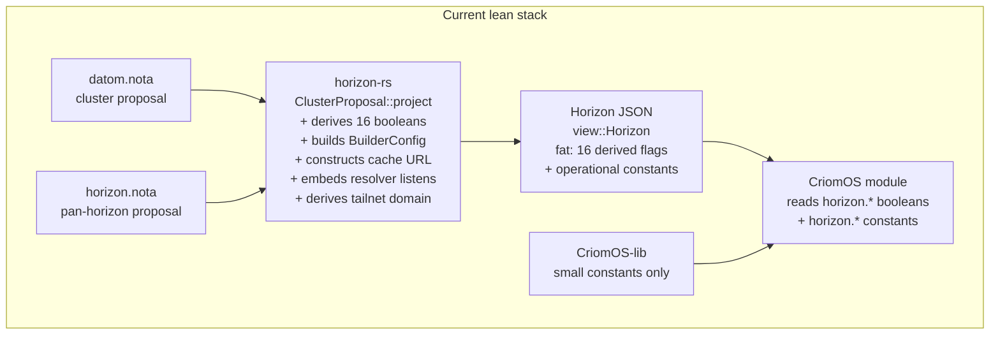
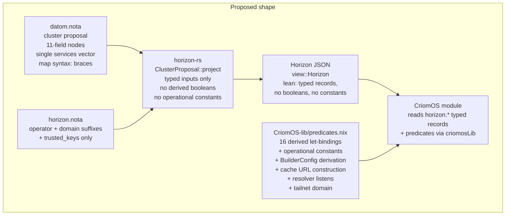

# lean horizon cluster-data shape

## Scope

Sketches the destination shape for cluster data and the horizon
projection on the rewrite stack (`horizon-leaner-shape` branches in
`horizon-rs`, `goldragon`, `criomos-horizon-config`, and `CriomOS-lib`).

Synthesises:

- `intent/horizon.nota` (2026-05-20 14:50 cluster + 2026-05-20 15:30
  derived-predicate decision);
- `intent/nota.nota` (2026-05-19 21:00 three-case rule, 21:30
  Option/Bool changes, 2026-05-20 16:30 mixed-enum support);
- current code state at
  `wt/.../horizon-rs/horizon-leaner-shape/lib/src/`,
  `wt/.../goldragon/horizon-leaner-shape/datom.nota`,
  `/git/.../criomos-horizon-config/horizon.nota`,
  `/git/.../CriomOS-lib/lib/default.nix`;
- prior analysis in `reports/system-assistant/26` (gaps audit) +
  `27` (NOTA mixed-enum support).

Excludes:

- production `main`-branch stacks;
- `lojix` migration shape (covered in `reports/system-specialist/154` +
  `reports/system-assistant/28`);
- owner-signal-lojix authority surface (active per `/28` + new intent
  `intent/deploy.nota` 2026-05-20T17:10:00Z).

## Compass

The psyche's destination, in one paragraph: *cluster data is dial-
shaped — which type of node is this, what features it carries, plus
the unavoidable disk-and-interface specifics. No port numbers, no
domain construction, no operational constants. Variants over
booleans, with data-carrying variants for inline tuning. Horizon is
the small clean projector that lowers cluster data into a Nix-
consumable shape; the predicates and constants Nix needs live in
`CriomOS-lib`, not in horizon. Beautiful horizon > beautiful Nix.
Forge is the eventual Nix successor; Nix is the bootstrap substrate
we move on from.*

Everything below is the gap between today's lean stack and that
compass.

## Where the lean stack already is

The rewrite stack has internalised the variants-over-booleans and
no-passthrough-duplication directions in several places:

- **Services as a typed vector.** `proposal::NodeProposal.services`
  is `Vec<NodeService>` with named variants
  (`TailnetClient`, `TailnetController`, `NixBuilder { maximum_jobs
  }`, `NixCache`, `PersonaDevelopment { capabilities }`). Strict-
  Edge gate, max-jobs derivation, and tailnet-controller validation
  all read from this vector — no more inferring from node names.
- **`BehavesAs` as a typed sub-record.** The species/placement-
  derived sibling booleans (`center`, `router`, `edge`, …) live
  inside one `BehavesAs` field on `view::Node`, not as nine sibling
  flags on `Node`.
- **Yggdrasil presence collapsed.** `view::Node.yggdrasil:
  Option<YggPubKeyEntry>` replaced the `has_ygg_pub_key`/
  `ygg_address`/`ygg_subnet` trio; consumers gate on
  `node.yggdrasil != null` and read the typed sub-record.
- **`nix_cache` collapsed.** `view::Node.nix_cache:
  Option<NixCache>` replaced the `is_nix_cache`/`nix_cache_domain`/
  `nix_url` trio with the same presence-is-the-flag shape.
- **View re-uses proposal types for passthrough.** `view::Node`
  re-uses `proposal::Machine`, `Io`, `NodeService`, `NodePlacement`,
  `WireguardProxy` directly. `view::ProjectedNodeView` re-uses
  `Substrate`, `Resources`, `ContainedNetwork`, `ContainedState`,
  `UserNamespacePolicy`. The duplication the production stack had is
  gone on those types.
- **Trust folding.** `ClusterTrust` clamps min(node-trust,
  per-node-override, cluster-trust) into one `Magnitude` per node;
  `Magnitude::Zero` drops the node entirely from the horizon.
- **Single secret-resolution table.** `ClusterSecretBinding` list →
  `BTreeMap<SecretName, SecretBackend>` in `view::Cluster`;
  duplicates loud-fail at projection.

## What is still in the way

### Empty-struct workarounds — now retire

Per `intent/nota.nota` 2026-05-19 21:00 (three-case rule), bare
PascalCase = unit variant; `(VariantName)` = data-carrying variant
with no data, which is the wrong shape. Per the Correction
(2026-05-20 16:30, Maximum) the `NotaSum`/`NotaEnum` split that
forced this contortion has been retired in favour of mixed-enum
support; the unification is what `reports/system-assistant/27`
specifies.

Eight call-sites in the lean stack still carry the empty-struct
workaround:

| Enum | Variants with `{}` | File |
|---|---|---|
| `NodeService` | `TailnetClient {}`, `TailnetController {}`, `NixCache {}` | `proposal/services.rs:26-38` |
| `PersonaDevelopmentCapability` | `GitoliteServer {}` | `proposal/services.rs:52` |
| `NodePlacement` | `Metal {}` | `proposal/placement.rs:14` |
| `Substrate` | `NixosContainer {}`, `MicrovmCloudHypervisor {}` | `proposal/placement.rs:30-31` |

`datom.nota` writes these as `(TailnetClient)`, `(TailnetController)`,
`(NixCache)`, `(Metal)`, etc. (lines 47, 82-85, 124-125, 159).

Action: drop the `{}` on each unit-shaped variant; sed the datom from
`(TailnetClient)` → `TailnetClient`, `(Metal)` → `Metal`, etc.
Data-carrying variants stay parenthesised (`(NixBuilder None)`,
`(NixBuilder 6)`, `(PersonaDevelopment [GitoliteServer])`).

### Bare booleans against the variants-over-booleans principle

`NodeProposal` carries four bare `bool` fields:

```rust
pub nordvpn: bool,                // proposal/node.rs:47
pub wifi_cert: bool,              // proposal/node.rs:49
pub wants_printing: bool,         // proposal/node.rs:56
pub wants_hw_video_accel: bool,   // proposal/node.rs:63
```

The datom encodes each one literally: `false false … false false`
(lines 39-44 for balboa, 73-76 for ouranos, etc.). Reading these
lines reveals nothing about the node — `false false false false`
looks like padding, not configuration.

`intent/horizon.nota` 2026-05-19T12:26:44Z Principle Maximum:
*"reading the cluster data, it just says true or false … instead, you
might as well just have a vector of features."* Restated 2026-05-20
14:50 (Maximum) with the data-carrying-variant emphasis: *"emphasize
variants with possibly data carrying variants if a little bit of
tuning can be done."*

The cleanest fold (sketched in §"Proposed shape" below) extends
`NodeService` with the four capabilities as variants — `Nordvpn`,
`WpaEnterpriseClient` (wifi_cert renamed), `Printing`,
`HardwareVideoAccel`. The 4 sites in `NodeProposal` retire entirely
and the `services` vector becomes the single feature surface.

### `online: Option<bool>` — category disguised as boolean

```rust
#[serde(default)]
pub online: Option<bool>,         // proposal/node.rs:79
```

The default-`Some(true)` pattern is the boolean smell with an opt-out
escape hatch. Two issues with shape:

1. *Online* is operational state, not cluster intent. A node being
   reachable on the network right now is a runtime observation, not a
   declaration the cluster author makes. The believed-topology home
   for this is the lojix-daemon (per `intent/deploy.nota`
   2026-05-17T11:00:00Z), not the cluster file.
2. If a node really is administratively offline (e.g. waiting on a
   hardware swap), that is a deliberate cluster-author choice. The
   right shape names the choice as a variant, not flips an `online`
   bit.

Proposal: delete `online` from `NodeProposal` entirely. The runtime
observation lives in lojix's believed-topology state. If
administratively-offline is needed before that lands, model it as a
variant on a `NodeStatus` field — but defer until the use case is
real.

### View-side derived booleans — move Nix-side

Sixteen derived predicates currently live in `view::*`:

```rust
// view/node.rs:78-84 (7 sibling booleans on Node)
pub is_fully_trusted: bool,
pub is_remote_nix_builder: bool,
pub is_dispatcher: bool,
pub is_large_edge: bool,
pub enable_network_manager: bool,
pub chip_is_intel: bool,
pub model_is_thinkpad: bool,

// view/node.rs:132-142 (9 sibling booleans on BehavesAs)
pub center, router, edge, next_gen, low_power,
    bare_metal, virtual_machine, iso, large_ai: bool,
```

`intent/horizon.nota` 2026-05-20 15:30 Maximum settles the
direction: *"View-side derived predicates (the 16 booleans on
view::Node + BehavesAs in horizon-rs lean) move out of horizon.
Derivation lives Nix-side in a single shared location — likely
CriomOS-lib."*

What stays on `view::Node`:

- the typed inputs the predicates derive from (species, placement,
  size, trust, machine, pubkey presence, service membership);
- the typed sub-records the predicates would otherwise hide (the
  `Option<NixCache>`, `Option<YggPubKeyEntry>`).

What moves Nix-side (CriomOS-lib):

- 16 let-bindings turning the typed inputs into the predicate
  booleans Nix modules gate on. Single shared file (probably
  `CriomOS-lib/lib/predicates.nix`) imported by every consumer.
- The `BehavesAs::derive` body in `view/node.rs:144-172`. It is
  pure-function logic over (species, placement, io-disks-empty);
  three matches and a `!virtual_machine && io_disks_empty`. Trivial
  to express in Nix.
- The Strict-Edge gate logic for `is_remote_nix_builder` (currently
  `proposal/node.rs:140-143`: `has_service(NixBuilder) && online &&
  is_fully_trusted && has_base_pub_keys`). Becomes a let-binding
  reading `node.services` and `node.{nixPubKey, yggdrasil}`.

This is the load-bearing horizon shrinkage. Per
`intent/horizon.nota` 2026-05-20 14:50 Principle Maximum: *"Prefer
beautiful Horizon over beautiful Nix code."* Predicate let-bindings
in Nix are not ugly; they are the natural Nix shape. The horizon-rs
code that derives them is ceremony horizon doesn't earn.

### Operational constants embedded in horizon

The psyche named this directly (`intent/horizon.nota` 2026-05-20
14:50 Maximum): *"we don't need to put all these constants like port
numbers, and how to construct such and such domain name into the
horizon. … keep some of this dirty stuff like port numbers into the
Nixcode."*

Concrete constants in horizon-rs today:

| Constant | Site | Action |
|---|---|---|
| `nix-ssh` (ssh-user for remote builder) | `view/node.rs:208` | move to CriomOS-lib |
| `/etc/ssh/ssh_host_ed25519_key` (ssh-key path) | `view/node.rs:215` | move to CriomOS-lib |
| `["big-parallel", "kvm"]` (builder features) | `view/node.rs:222` | move to CriomOS-lib (derive Nix-side from `node.behaves_as.edge`) |
| `format!("http://{domain}")` (cache URL) | `proposal/node.rs:156` | move to CriomOS-lib |
| `::1`, `127.0.0.1` (resolver listens) | `horizon_proposal.rs:139` | move to CriomOS-lib |
| `TAILNET_SERVICE_LABEL = "tailnet"` | `horizon_proposal.rs:16` | move to CriomOS-lib (domain construction is Nix-side) |
| `tailnet_base_domain` / `service_domain` / `lan_network` / `resolver_policy` methods on `HorizonProposal` | `horizon_proposal.rs:120-144` | derive Nix-side; horizon emits the inputs only |

After this move, `view::BuilderConfig` collapses into a leaner
record carrying only the per-builder *data* (host name, system,
max jobs, pubkeys); the rest is Nix-derived.
`HorizonProposal::resolver_policy` and `lan_network` go away.

### Two acknowledged hacks marked for retirement

The psyche has explicitly named both as temporary
(`intent/horizon.nota` 2026-05-20 14:50 Maximum, two records):

1. **`router_interfaces` on `NodeProposal`.** The future network
   daemon discovers connectivity and assigns interface roles. Until
   it lands, cluster data carries `eno1` / `wlp195s0` / etc. so
   deploy can wire the system. Do not deepen.
2. **`TransitionalIpv4Lan` on `HorizonProposal`.** Single-router
   IPv4 LAN until Yggdrasil-first networking lands. The warning
   string lives inside the record itself
   (`horizon_proposal.rs:55-58`).

Both keep their current shape; both are flagged with the same
"transitional — do not generalise" stance in code comments. The
report names them so they don't accidentally become permanent
fixtures.

### Single-variant enums prepared for growth

Two enums in the proposal layer have one variant today:

- `VpnProfile::NordvpnProfile(NordvpnProfile)` (`proposal/vpn.rs:13`)
- `AiProviderProfile::CriomosLocalLlama` (`proposal/ai.rs:51`)

Per the Rule-1-of-NOTA-design test (`intent/nota.nota`
2026-05-19T20:45 Maximum), a single-variant enum should be a struct.
But both are explicitly forward-looking (`WireguardMesh later` on
VPN; future cloud-AI profiles on AI). Keeping them as enums is
right *because the second variant is on the roadmap*. Worth noting
so a future cleanup pass doesn't reach for a sed wrongly.

### Naming smells

| Current name | Concern | Suggested |
|---|---|---|
| `wifi_cert` | abbreviation; doesn't say what cert | `wpa_enterprise_client_certificate` (or fold into `NodeService::WpaEnterpriseClient`) |
| `nordvpn` (bool) | provider name as a bare bool | `NodeService::Nordvpn` variant |
| `wants_printing`, `wants_hw_video_accel` | `wants_*` prefix reads as wish-list | `NodeService::Printing`, `NodeService::HardwareVideoAccel` |
| `NodeService::PersonaDevelopment` | namespaces a future expansion | keep (it's the right scope) |
| `BehavesAs` | adjectival-noun, reads cleanly today | keep (but moves Nix-side) |
| `wifi_cert` vs `WlanBand` / `wlan_*` | sibling Wi-Fi terms diverge | settle on `wlan_*` everywhere |

`wifi_cert` is the prominent abbreviation against
`skills/naming.md`'s offender table. The other three (`nordvpn`,
`wants_*`) read as English but smell more as a discipline (variant
or boolean?) question than a naming one.

## Proposed cluster-data shape

### `NodeProposal` in pseudonota — destination

Two NOTA-side rules drive the shape below:

1. **Three-case rule** (`intent/nota.nota` 2026-05-19 21:00
   Maximum): PascalCase at the start of `(…)` is always a variant.
   `(fields…)` with no leading PascalCase = struct. Bare
   `VariantName` = unit variant. Struct type names drop because
   schema position determines the type — every record is read at a
   known schema position.
2. **Map syntax `{key value …}`** (`reports/second-system-
   assistant/5`): maps are flat alternating key/value pairs inside
   curly braces. The `[(Entry key value)]` shape is retired.

Today's `datom.nota` violates both — every struct carries a type-
name header (`(NodeProposal …)`, `(Machine …)`, `(Io …)`,
`(NodePubKeys …)`, `(Disk …)`, `(YggPubKeyEntry …)`); maps still
use `[(Entry … …)]`. The codec accepts the old form leniently but
both are the wrong shape. The pseudonota below applies the rules;
the existing datom needs a migration sweep.

The whole cluster-nodes map at the top level:

```text
{
  balboa     (Center        Metal Zero Min  …)
  ouranos    (EdgeTesting   Metal Large Max …)
  prometheus (LargeAiRouter Metal Max   Max …)
  tiger      (EdgeTesting   Metal Max   Max …)
  zeus       (Edge          Metal Max   Max …)
}
```

`balboa`, `ouranos`, … are the typed map keys (NodeName, a
String newtype — typed-map-key support pending per `intent/
nota.nota` 2026-05-20T18:31:00Z; treated as bare-string keys today).

The ouranos value, expanded — 10 positional fields (down from 18
in the current lean shape):

```text
;; ouranos — Center node hosts the cluster tailnet controller and
;; receives remote builds. Shape applied:
;; - {key value …} for maps (per /5)
;; - typed map keys (per intent/nota.nota 2026-05-20T18:45 Maximum)
;; - struct type names drop (three-case rule)
;; - empty-struct variants retire to bare PascalCase
;; - placement promoted to position 2 (after species)
;; - NodePlacement::Contained renamed to NodePlacement::Pod
;; - wireguard moves inside pub_keys alongside yggdrasil
;; - online removed
;; - node_ip removed (wireguard IP derives from pub key Nix-side;
;;   deferred TODO — see Wireguard-IP-derivation section below)
;; - 4 feature booleans folded into services
(
  EdgeTesting                                   ;; species (variant — kept)
  Metal                                         ;; placement (Metal | Pod …; promoted to pos 2)
  Large                                         ;; size
  Max                                           ;; trust
  (X86_64 12 ThinkPadT14Gen5Intel None 12 32)   ;; machine (struct — head dropped)
  (Colemak Uefi {                               ;; io (struct); disks is now a map
    "/"     ("/dev/disk/by-uuid/38a8…" Ext4 [])
    "/boot" ("/dev/disk/by-uuid/725A…" Vfat ["fmask=0022" "dmask=0022"])
  } [])
  (                                             ;; pub_keys (struct, now 4 fields)
    "AAAAC3Nz…"                                 ;;   ssh: SshPubKey
    (Some "5dAiX…")                             ;;   nix: Option<NixPubKey>
    (Some ("6487…" "201:…" "301:…"))            ;;   yggdrasil: Option<YggPubKeyEntry>
    None)                                       ;;   wireguard: Option<Wireguard>
  []                                            ;; link_local_ips (transitional)
  None                                          ;; router_interfaces (until network daemon)
  [                                             ;; services — single feature vector
    TailnetClient
    TailnetController
    (NixBuilder None)
    HardwareVideoAccel
  ])
```

The eight fields removed from `NodeProposal` (18 → 10):

- 4 bare booleans (`nordvpn`, `wifi_cert`, `wants_printing`,
  `wants_hw_video_accel`) folded into `services` as named
  variants;
- `wireguard_pub_key` + `wireguard_untrusted_proxies` moved into
  `pub_keys.wireguard: Option<Wireguard>`;
- `online` dropped (operational state belongs in lojix-daemon's
  believed-topology);
- `node_ip` dropped (`intent/horizon.nota` 2026-05-20T18:45
  Maximum — derivation from wireguard pub key approved-but-
  deferred; in-code TODO marks the future derivation site).

Field order: placement moves from position 18 to position 2
(`intent/horizon.nota` 2026-05-20T18:31:00Z) so bare-metal-vs-
pod reads as visually load-bearing alongside species.

Rename: `NodePlacement::Contained` → `NodePlacement::Pod`
(`intent/horizon.nota` 2026-05-20T18:45 Medium). `Pod { host,
user, substrate, resources, network, state, trust,
user_namespace_policy }` is the data-carrying variant; `Metal`
stays bare.

### Wireguard joins NodePubKeys

`intent/horizon.nota` 2026-05-20T18:31:00Z Maximum: *"the wire
guard thing. Why don't we put the wire guard key with all of the
other keys?"* NodePubKeys becomes the canonical home for every
per-node key bundle, including mesh-membership sub-records:

```rust
pub struct NodePubKeys {
    pub ssh: SshPubKey,
    pub nix: Option<NixPubKey>,
    pub yggdrasil: Option<YggPubKeyEntry>,
    pub wireguard: Option<Wireguard>,        // new
}

pub struct Wireguard {
    pub pub_key: WireguardPubKey,
    pub untrusted_proxies: Vec<WireguardProxy>,
}
```

Presence of `wireguard` means the node is on the mesh; absence
means it isn't. `untrusted_proxies` defaults empty inside the
sub-record. Field name `wireguard` (no `_pub_key` suffix) per
`skills/naming.md`'s no-ancestry rule — at the use site,
`node.pub_keys.wireguard.pub_key` reads at the right level
without redundancy.

The grouping symmetry with `yggdrasil` is the win — both are
mesh-membership presences whose pub key is the identity. Today
every node in `datom.nota` has `wireguard_pub_key: None` and
`wireguard_untrusted_proxies: []`, so no awkward "proxies-but-no-
key" cases to migrate.

A separate brainstorm — see §"Wireguard-IP derivation" below —
considers whether `node_ip` then retires entirely once the
wireguard interface IP and `allowedIPs` become functions of
`wireguard.pub_key` Nix-side (parallel to how Yggdrasil derives
IP from pub key).

### `node_ip` and `link_local_ips` — status

**`node_ip: Option<NodeIp>` — drops now**
(`intent/horizon.nota` 2026-05-20T18:45 Maximum).

The hash-based Wireguard-IP-derivation direction was approved (see
§"Wireguard-IP derivation" below). Implementation is deferred —
Wireguard is in the code but not load-bearing in any current
deployment, so the two Wireguard consumer sites (`wireguard.nix:33,
61`) aren't actively exercised. The other three consumers
(`dnsmasq.nix:68-70` DNS fallback, `network/default.nix:32-49`
hosts-file entries, and one of the checks) are non-blocking.

The retirement:

- Drop `node_ip: Option<NodeIp>` from `proposal/node.rs` and
  `view/node.rs`.
- Drop `NodeIp` and `IpAddress` (if unused elsewhere) types from
  `address.rs`.
- Sweep `datom.nota` to drop the `node_ip` position.
- Update `CriomOS/modules/nixos/network/wireguard.nix:33, 61` to
  the TODO form below.
- Update `CriomOS/modules/nixos/network/dnsmasq.nix:68-70` to drop
  the fallback (yggdrasil address is the only DNS-resolution path).
- Update `CriomOS/modules/nixos/network/default.nix:32-49` to drop
  the per-node host entries.
- Update `CriomOS/checks/wireguard-untrusted-proxy/default.nix` and
  any other check that asserted on `nodeIp`.

In-code TODO marker at each Wireguard consumer site:

```nix
# TODO(wireguard-ip-derivation): once Wireguard becomes load-
# bearing in a deployment, restore allowedIPs / interface IP using
# `criomosLib.deriveWireguardIp peer.pubKeys.wireguard.pubKey`
# (hash-based, Yggdrasil-style). Direction approved per
# intent/horizon.nota 2026-05-20T18:45; deferred until Wireguard
# is depended on.
```

Mirror Rust-side TODO at the top of `proposal/pub_keys.rs` next
to the `Wireguard` struct:

```rust
// TODO(wireguard-ip-derivation): per-node Wireguard internal IP
// is derived from `pub_key` via `criomosLib.deriveWireguardIp`
// Nix-side (intent/horizon.nota 2026-05-20T18:45). The address
// is not stored in cluster data because it is a pure function of
// the public key.
```

**`link_local_ips: Vec<LinkLocalIp>` — partly transitional.**

Consumer sites:

- `modules/nixos/network/default.nix:34, 52` — feeds
  `preNodeHosts` (host-file aliases for `fe80::…%iface` literal
  link-local addresses);
- `checks/resolver-role-policy/default.nix:34, 79` — test
  fixtures.

`address.rs:222` renders the proposal-side `LinkLocalIp { suffix,
iface }` into `view::LinkLocalAddress` as `fe80::{suffix}%{iface}`.
The mechanism predates the cluster's Yggdrasil + `node_ip`
addressing and persists for the `preNodeHosts` surface. Not
strictly vestigial — code reads it — but the surface it serves is
the older link-local-addressing path. If `preNodeHosts` retires
under the IPv6-first direction, this field retires with it.

### `NodeService` in Rust — extended

```rust
#[derive(NotaEnum)]                 // unified per /27
pub enum NodeService {
    TailnetClient,                  // unit
    TailnetController,              // unit
    NixBuilder { maximum_jobs: Option<u32> },
    NixCache,                       // unit
    PersonaDevelopment { capabilities: Vec<PersonaDevelopmentCapability> },
    Nordvpn,                        // unit (was bool on NodeProposal)
    WpaEnterpriseClient,            // unit (was wifi_cert: bool)
    Printing,                       // unit (was wants_printing: bool)
    HardwareVideoAccel,             // unit (was wants_hw_video_accel: bool)
}
```

This is a mixed enum: 7 unit variants + 2 data-carrying. The post-
unification `NotaEnum` derive handles both per `reports/system-
assistant/27`'s three-case rule.

`PersonaDevelopmentCapability` similarly retires its empty struct:

```rust
#[derive(NotaEnum)]
pub enum PersonaDevelopmentCapability {
    GitoliteServer,                 // bare
}
```

### Shrunken `view::Node`

```rust
pub struct Node {
    // input pass-through — re-uses proposal types directly
    pub name: NodeName,
    pub species: NodeSpecies,
    pub placement: NodePlacement,           // promoted to pos 2
    pub size: AtLeast,
    pub trust: AtLeast,
    pub machine: Machine,
    pub io: Io,                             // viewpoint-only today; can become always-present
    pub link_local_ips: Vec<LinkLocalAddress>,
    pub node_ip: Option<NodeIp>,            // candidate for retirement
    pub router_interfaces: Option<RouterInterfaces>,
    pub services: Vec<NodeService>,         // single feature vector
    pub pub_keys: NodePubKeys,              // now includes wireguard

    // derived identity (genuinely needs Rust-side computation)
    pub criome_domain_name: CriomeDomainName,
    pub system: System,

    // pubkey-lines for direct Nix consumption (cheap to keep
    // because the line form is a render of the typed key)
    pub ssh_pub_key_line: SshPubKeyLine,
    pub nix_pub_key_line: Option<NixPubKeyLine>,

    // RETIRED — derive Nix-side in CriomOS-lib:
    // - 7 is_* booleans (is_fully_trusted, is_remote_nix_builder,
    //   is_dispatcher, is_large_edge, enable_network_manager,
    //   chip_is_intel, model_is_thinkpad)
    // - 9 BehavesAs.* booleans (center, router, edge, next_gen,
    //   low_power, bare_metal, virtual_machine, iso, large_ai)
    // - nix_cache (becomes Nix-derived from services + domain)
    // - max_jobs (Nix-derived from services.find(NixBuilder))
    // - builder_configs (Nix iterates exNodes directly per Q3)
    // - cache_urls, ex_nodes_ssh_pub_keys, dispatchers_ssh_pub_keys,
    //   use_colemak, wireguard_untrusted_proxies — all derivable
    //   from horizon.exNodes + horizon.users walks Nix-side
    // - admin_ssh_pub_keys — Nix-side walk over users × exNodes
}
```

The viewpoint-fill plane (`view/node.rs:240-301`) collapses
entirely. All eight viewpoint-only fields move Nix-side. `Io`
becomes always-present (it's small; viewpoint-only was an
artifact of the projector's filling logic, not a real privacy
boundary).

### Shrunken `HorizonProposal`

```rust
pub struct HorizonProposal {
    pub operator: OperatorName,
    pub domain_suffixes: DomainSuffixes,
    pub trusted_keys: Vec<HorizonTrustedKey>,
}
```

`transitional_ipv4_lan` retires from Rust entirely
(`intent/horizon.nota` 2026-05-20T18:31:00Z Maximum). Its three
fields (cidr, gateway, dhcp_pool) move to
`CriomOS-lib/lib/default.nix` under `constants.network` with a
big warning Nix comment:

```nix
# !!! TRANSITIONAL — single-router IPv4 LAN until IPv6-first
# !!! networking via Yggdrasil lands. Hard-coded here because
# !!! the workspace has exactly one cluster (LiGoldragon's) and
# !!! clusters do not share internal IPv4 addressing.
transitionalIpv4Lan = {
  cidr = "10.18.0.0/24";
  gateway = "10.18.0.1";
  dhcpPool = { start = "10.18.0.100"; end = "10.18.0.240"; };
};
```

The `tailnet_base_domain`, `service_domain`, `lan_network`,
`resolver_policy` methods on `HorizonProposal` all retire — those
were operational-constant constructors. Consumers read
`domain_suffixes` directly Nix-side and apply the constants
(label = "tailnet", resolver listens = `["::1" "127.0.0.1"]`, etc.)
from CriomOS-lib.

`TAILNET_SERVICE_LABEL` constant retires from `horizon_proposal.rs`.

`horizon.nota` (the pan-horizon proposal file) similarly shrinks —
the `(TransitionalIpv4Lan …)` record drops; only the operator,
domain suffixes, and trusted_keys list remain.

## Data flow — current vs proposed





The shift in arrows: derivation moves from the horizon-rs box (one
Rust crate) to the CriomOS-lib box (one Nix attrset). Same code-
locality property, different language. The cluster-data shape gets
simpler in NOTA; the Nix gets a small (~16 let-binding) predicate
file.

## Naming improvements — table

| Site | Current | Proposed | Reason |
|---|---|---|---|
| `NodeProposal.wifi_cert` | `wifi_cert: bool` | `NodeService::WpaEnterpriseClient` | abbreviation; should be a service variant |
| `NodeProposal.nordvpn` | `nordvpn: bool` | `NodeService::Nordvpn` | provider as variant, not bool |
| `NodeProposal.wants_printing` | `wants_printing: bool` | `NodeService::Printing` | `wants_*` prefix; variant |
| `NodeProposal.wants_hw_video_accel` | `wants_hw_video_accel: bool` | `NodeService::HardwareVideoAccel` | `wants_*` prefix; variant |
| `NodeProposal.online` | `online: Option<bool>` | (removed) | operational state, not cluster intent |
| `view::Node.use_colemak` | `Option<bool>` | (removed; derive Nix-side) | derivable from `io.keyboard` |
| `view::Node.max_jobs` | `u32` (always 1 unless NixBuilder service set) | (removed; derive Nix-side from `services`) | predicate-shaped |
| `view::Node.is_*` (7 fields) | `bool` | (removed; derive Nix-side) | per psyche intent 2026-05-20 15:30 |
| `view::BehavesAs.*` (9 fields) | `bool` | (removed; derive Nix-side) | same |
| `view::BuilderConfig.{ssh_user, ssh_key, supported_features, systems}` | hard-coded strings/lists | (derived Nix-side) | operational constants |
| `view::NixCache.url` | `format!("http://{domain}")` | (derived Nix-side) | constant prefix |
| `HorizonProposal::tailnet_base_domain` etc. | methods | (derived Nix-side from `domain_suffixes`) | constant + concat |
| `HorizonProposal::resolver_policy` | injects `::1`, `127.0.0.1` | (derived Nix-side from `lan_network`) | operational constants |
| `NodePlacement::Contained` (variant) | `Contained` | `Pod` | shorter, more vivid noun; per 2026-05-20T18:45 Medium |
| `NodeProposal.wireguard_pub_key` + `wireguard_untrusted_proxies` | two flat siblings on NodeProposal | `NodePubKeys.wireguard: Option<Wireguard>` (pub_key + untrusted_proxies) | grouped under the keys-bundle home; matches the yggdrasil pattern |
| `NodeProposal.node_ip` | `Option<NodeIp>` | (removed; derive from wireguard pub key Nix-side when load-bearing) | per 2026-05-20T18:45 Maximum; TODO in code marks the future derivation site |

## Horizon-rs shrinkage estimate

Approximate line-count deltas after all the settled changes
(worktree at `horizon-leaner-shape`, today):

| File | Lines | Action | After |
|---|---:|---|---:|
| `view/node.rs` | 303 | drop 16 derived fields, `BehavesAs::derive`, whole `BuilderConfig`+`from_node`, whole `fill_viewpoint` (8 viewpoint-only fields all move Nix-side) | ~70 |
| `proposal/node.rs` | 269 | drop 4 booleans + `online` + 2 wireguard fields, reorder placement, drop the projector's 30-line predicate block | ~150 |
| `proposal/services.rs` | 174 | drop `{}` workarounds; add 4 new unit variants (`Nordvpn`, `WpaEnterpriseClient`, `Printing`, `HardwareVideoAccel`) | ~165 |
| `proposal/placement.rs` | 136 | drop `{}` on `Metal`, `NixosContainer`, `MicrovmCloudHypervisor` | ~130 |
| `proposal/pub_keys.rs` | 30 | add `wireguard: Option<Wireguard>` field + `Wireguard` struct | ~55 |
| `horizon_proposal.rs` | 146 | drop `tailnet_base_domain`, `service_domain`, `lan_network`, `resolver_policy`, `TAILNET_SERVICE_LABEL`, `TransitionalIpv4Lan` struct | ~50 |
| `view/network.rs` | 98 | drop `ResolverPolicy` + `LanNetwork` (both Nix-side now) | ~50 |

Net: ~460 lines shrink from horizon-rs (~32% of the touched
files, includes the immediate `node_ip` + `NodeIp` drop per
2026-05-20T18:45); ~16 predicate let-bindings + ~20 lines of
constants appear in `CriomOS-lib/lib/`. If the router-as-
NodeService-variant fold is approved (§"Router-as-NodeService-
variant"), another ~80 lines drop from horizon-rs (router_
interfaces field + Hybrid/Router/RouterTesting/LargeAiRouter
species variants + `BehavesAs.router` derivation + every Rust
match on the retired species variants).

## Settled — what the 2026-05-20T18:31:00Z psyche review decided

The four prior open questions are settled
(`intent/horizon.nota` 2026-05-20T18:31:00Z, four Decision
records, Maximum):

1. **Fold 4 booleans into NodeService.** `Nordvpn`,
   `WpaEnterpriseClient`, `Printing`, `HardwareVideoAccel` join the
   services vector as named variants. The 4 `NodeProposal` bool
   positions retire. Pseudonota and Rust shape above reflect this.
2. **Drop `online` entirely.** Operational reachability belongs in
   lojix-daemon's believed-topology state, not cluster intent. The
   `is_remote_nix_builder` gate's `online` check moves to a Nix-
   side query against lojix's believed-topology surface when that
   lands; in the meantime, dispatchers may briefly stall on TCP
   timeouts for offline nodes — acceptable per the psyche.
3. **Drop `view::BuilderConfig` entirely.** Nix iterates
   `horizon.exNodes` filtering on Nix-derived
   `nodeIsRemoteNixBuilder` and builds the `nix.buildMachines`
   attrset directly. *"cheap to do in Nix anyway. It's just a
   bunch of like boolean checks and like value mapping."*
4. **Drop `HorizonProposal.transitional_ipv4_lan` entirely; move
   the constants to CriomOS-lib.** Not per-cluster, not on
   HorizonProposal at all — clusters do not share internal IPv4
   addressing in the destination shape, and there's only one
   cluster today. The CIDR/gateway/DHCP-pool constants live under
   `CriomOS-lib/lib/default.nix:constants.network` with a big
   warning Nix comment. The `warning` field disappears (Nix
   comment carries it).

Plus three additions from the same review:

5. **NodeProposal field order: placement → position 2.** Placement
   variant (Metal vs Contained) belongs visually alongside
   species; promoted from last to second position.
6. **wireguard joins NodePubKeys** alongside ssh, nix, yggdrasil.
   The Wireguard sub-record (pub_key + untrusted_proxies) lives
   inside NodePubKeys, not as a separate NodeProposal field.
7. **NOTA map syntax change absorbed** (per
   `reports/second-system-assistant/5`): `{key value …}` replaces
   `[(Entry key value)]`. Rust tuple impls removed. Pseudonota
   above uses the new syntax.

## Wireguard-IP derivation — approved, deferred

Approved direction (`intent/horizon.nota` 2026-05-20T18:45 Maximum):
hash-based wireguard IP derivation works, and `node_ip` drops from
cluster data now. Implementation is deferred — Wireguard is in the
code but not currently load-bearing, so the derivation function
lands when Wireguard is depended on. In-code TODO markers preserve
the design (see §"node_ip and link_local_ips" above for the exact
comment text).

The brainstorm rationale follows (kept as design rationale for the
future implementation):

### How Yggdrasil derives its address

Yggdrasil takes the IPv6 address from a hash of the node's Ed25519
public key, mapped into the `200::/7` reserved-by-the-mesh
prefix. Every node's address is deterministic from its key; the
mesh routing fabric finds the path on demand. The address itself
carries no routing metadata — it's pure identity.

The protocol is built around this. Wireguard isn't.

### The translation to wireguard

`wireguard.pub_key` is a 32-byte Curve25519 public key. Hash it
(SHA-256 or BLAKE3, either works), take 14 bytes, prepend a
workspace-chosen IPv6 prefix (e.g. `fd00:ad:…::/108`) — and you
have a 128-bit address derived from the key with collision
probability indistinguishable from zero.

Per-node consequences:

- `wireguard.allowedIPs` for a peer becomes `[ (deriveWireguardIp
  peerKey) "/128" ]` — Nix derives at evaluation time.
- The local wireguard interface IP becomes `deriveWireguardIp
  selfKey` — same function, Nix-side.
- `node_ip` in cluster data drops entirely; the address is a
  function of the key already present in `pub_keys.wireguard`.
- DNS fallback in `dnsmasq.nix:68-70` retargets to use the
  derived wireguard IP instead of `node_ip`.

### Routing-table concern — addressed

The psyche's flag was *"I just don't know how well this will do
for like a routing table"*. Two parts:

- **Per-peer route entries.** Wireguard installs one route per
  peer with the peer's `allowedIPs` as the destination. Today
  these come from `node_ip`; under derivation they come from
  `deriveWireguardIp peerKey`. Same number of routes, same per-
  /128 specificity. No routing-table size change.
- **Routing scalability.** Wireguard does not aggregate routes —
  every peer is a /128 leaf, no prefix summarisation, just like
  today. Linux's IPv6 route lookup is O(log n) (LPM trie); the
  cluster has ~5 nodes, so route-table size is irrelevant. Even
  at 10,000 peers the trie stays trivially fast.

The genuine concern is different: **prefix overlap with other
networks the node belongs to**. The chosen wireguard prefix
(`fd00:ad:…::/108`) must not collide with `fc00::/7` ranges any
node uses for other purposes (Docker bridges, other Wireguard
meshes, etc.). Pick a long random ULA prefix and the collision
probability is negligible.

### Cost

- Single Nix function `deriveWireguardIp` in
  `CriomOS-lib/lib/default.nix` (~10 lines: hash key, slice
  bytes, format IPv6 string). Same shape as Yggdrasil's
  derivation but Nix-side instead of in-protocol.
- `node_ip` drops from `NodeProposal`, `view::Node`, `datom.nota`,
  and 5 Nix consumer sites in `CriomOS/`.
- One test in `CriomOS/checks/wireguard-untrusted-proxy/` updates
  to expect the derived IP.

### Recommendation

Worth doing once the wireguard-in-NodePubKeys landing settles.
Mechanics are simple, routing table is unaffected, and the
cluster data loses a transitional field. Not urgent — `node_ip`
works today — but flagged as the natural next step once the
pub_keys reshape is in.

## Router-as-NodeService-variant — brainstorm

Psyche-flagged direction (`intent/horizon.nota` 2026-05-20T18:45
Minimum, brainstorm-only): *"the router interfaces. So how do we
currently define if a node is a router? Is it just a species? Or
do we put that into the feature vector? In which case, the router
interfaces could be the data of that particular variant in the
feature vector. Just an idea, it might actually be cleaner. I
don't know."*

### Current dual encoding

Router-ness lives in two places today:

```rust
// Species enum (proposal/species.rs)
pub enum NodeSpecies {
    Center,
    LargeAi,
    LargeAiRouter,    // ← router-flavored
    CloudHost,
    Hybrid,           // ← edge + router compound
    Edge,
    EdgeTesting,
    MediaBroadcast,
    Router,           // ← router-flavored
    RouterTesting,    // ← router-flavored
    Publication,
}

// NodeProposal field
pub router_interfaces: Option<RouterInterfaces>,
```

`BehavesAs::derive` reads from species:

```rust
let router = matches!(species, Hybrid | Router | LargeAiRouter);
```

And the actual interface-role data lives in the standalone
`router_interfaces` field on `NodeProposal`. The data and the
"is-a-router" flag are split between two surfaces.

### The fold

Move router-ness into the services vector as a data-carrying
variant:

```rust
pub enum NodeService {
    TailnetClient,
    TailnetController,
    NixBuilder { maximum_jobs: Option<u32> },
    NixCache,
    PersonaDevelopment { capabilities: Vec<PersonaDevelopmentCapability> },
    Router(RouterInterfaces),         // new — router-ness lives here
    Nordvpn,
    WpaEnterpriseClient,
    Printing,
    HardwareVideoAccel,
}
```

`NodeProposal.router_interfaces` retires entirely. `NodeSpecies`
drops `Router`, `RouterTesting`, `LargeAiRouter`, and possibly
`Hybrid` — leaving species = "what kind of cluster member"
orthogonal to services = "what specific things this node does":

```rust
pub enum NodeSpecies {
    Center,
    LargeAi,           // (router-ness in services now)
    CloudHost,
    Edge,
    EdgeTesting,
    MediaBroadcast,    // (could fold to services too — see below)
    Publication,       // (could fold to services too — see below)
}
```

`Hybrid` ("edge + router") becomes `species = Edge, services
includes Router(…)`. `LargeAiRouter` becomes `species = LargeAi,
services includes Router(…)`. `RouterTesting` becomes `species =
EdgeTesting, services includes Router(…)`. Pure `Router` becomes
`species = ?` — which species variant fits a node whose ONLY job
is to be a router? Maybe a new lightweight `Appliance` or
`Infrastructure` species, or the existing `Edge` species reads
fine ("an edge node whose only service is Router").

In `datom.nota`, the prometheus node becomes:

```text
prometheus (
  LargeAi             ;; species (no longer LargeAiRouter)
  Metal
  Max Max
  …
  [
    TailnetClient
    (NixBuilder 6)
    NixCache
    (Router (
      eno1 wlp195s0 TwoG 6 Wifi4
      (SecretReference "router-wifi-sae-passwords" WifiPassword) "PL"))
  ]
)
```

### Why it's cleaner

- **Variants-over-compounds.** `LargeAiRouter` is the species
  equivalent of a boolean compound (`isLargeAi && isRouter`); the
  fold breaks it into orthogonal axes per the same principle that
  retired the cluster-data bare bools.
- **One feature surface.** The cluster reads "what does this node
  do" from one place (services), not two.
- **Data and presence travel together.** `Router(RouterInterfaces)`
  carries the configuration with the role; today the presence and
  data are in different fields.

### Open consequences

- Species enum shrinks (current 11 variants → 7 or 8). Worth a
  separate naming pass on what stays.
- `BehavesAs.router` retires (it's just `services.contains(Router
  …)` — and `BehavesAs` is already moving Nix-side per the 16-
  predicates direction).
- `MediaBroadcast` and `Publication` species variants are
  candidates for the same fold (`Services::MediaBroadcast`,
  `Services::Publication`). Out of scope for the router fold; flag
  as the natural follow-up.

### Question for psyche

Approve the fold? If yes, two sub-decisions:

1. What replaces the species values that were router-flavored —
   does `Hybrid` → `Edge`, `LargeAiRouter` → `LargeAi`,
   `RouterTesting` → `EdgeTesting`, `Router` → `Edge` (or a new
   `Appliance` species)?
2. Do `MediaBroadcast` and `Publication` also fold into services
   on the same pass, or stay as species today?

## Remaining clarifications

Both of the previous open items are now settled:

- **A. `Pod` rename** — settled `Contained` → `Pod`
  (`intent/horizon.nota` 2026-05-20T18:45 Medium).
- **B. Typed map keys** — landing in parallel
  (`intent/nota.nota` 2026-05-20T18:45 Maximum).

The active clarification is the router-as-service-variant fold
above.

## Migration steps — sketch

Implementation sequence after the 2026-05-20T18:31 + 18:45
settlings:

1. **NOTA codec unifications.** Mixed-enum support (per
   `reports/system-assistant/27`) + `{key value …}` map syntax
   (per `reports/second-system-assistant/5`) have landed; typed
   map keys land in parallel with this work (per
   `intent/nota.nota` 2026-05-20T18:45 Maximum). These are
   prerequisites for the datom sweep below.
2. **Cluster data migration sweep** on `datom.nota`,
   `horizon.nota`, and every Rust fixture/test:
   - drop struct type-name heads per the three-case rule
     (`(NodeProposal …)` → `(…)`, same for Machine, Io,
     NodePubKeys, Disk, YggPubKeyEntry, and every other NotaRecord);
   - convert maps from `[(Entry k v) …]` to `{k v …}` syntax
     (cluster nodes map, Io.disks map, user pub_keys maps, etc.);
   - drop `{}` on unit-shaped variants (`(TailnetClient)` →
     `TailnetClient`, `(Metal)` → `Metal`, etc.);
   - apply typed map keys at NodeName / UserName / SecretName /
     SopsFilePath positions once the codec support lands.
3. **NodeService extension:** add `Nordvpn`, `WpaEnterpriseClient`,
   `Printing`, `HardwareVideoAccel` variants; remove the 4
   bare-bool fields from `NodeProposal`; rewrite `datom.nota` to
   fold the booleans into the services vector.
4. **Wireguard relocation:** add `Wireguard { pub_key,
   untrusted_proxies }` struct; add `wireguard: Option<Wireguard>`
   to `NodePubKeys`; remove `wireguard_pub_key` and
   `wireguard_untrusted_proxies` from `NodeProposal`; rewrite
   `datom.nota` to nest wireguard inside `pub_keys`.
5. **Drop `node_ip`** from `NodeProposal` and `view::Node`; sweep
   `datom.nota`; update CriomOS consumers (`wireguard.nix:33, 61`
   carry the TODO marker for future `deriveWireguardIp`;
   `dnsmasq.nix:68-70` drop the fallback;
   `network/default.nix:32-49` drop per-node host entries; the
   `wireguard-untrusted-proxy` check updates).
6. **Rename `NodePlacement::Contained` → `NodePlacement::Pod`;
   reorder placement to position 2** of `NodeProposal` (right
   after species). Rewrite `datom.nota`; update every Rust
   `match` on the variant; update every Nix `destructure`.
7. **Drop `online: Option<bool>`** from `NodeProposal`; rewrite
   `datom.nota`. The `is_remote_nix_builder` gate's `online`
   check moves Nix-side against (eventually) lojix's believed-
   topology query; until then, the gate just drops the `online`
   condition.
8. **Drop the 16 derived booleans** from `view::Node` +
   `view::BehavesAs`; add `CriomOS-lib/lib/predicates.nix` with
   the 16 let-bindings; migrate every consumer site in `CriomOS/`
   and `CriomOS-home/`.
9. **Drop operational constants from horizon-rs:** ssh_user,
   ssh_key, supported_features, systems on `BuilderConfig` (whole
   record retires per step 10 below); `format!("http://{domain}")`
   cache URL; `["::1", "127.0.0.1"]` resolver listens;
   `TAILNET_SERVICE_LABEL`; `tailnet_base_domain`,
   `service_domain`, `lan_network`, `resolver_policy` methods on
   `HorizonProposal`. All move to
   `CriomOS-lib/lib/default.nix:constants`.
10. **Drop `view::BuilderConfig` entirely.** Nix iterates
    `horizon.exNodes` filtering on Nix-derived
    `nodeIsRemoteNixBuilder` and builds `nix.buildMachines`
    directly.
11. **Drop `HorizonProposal.transitional_ipv4_lan` entirely;**
    move the CIDR/gateway/DHCP-pool constants to
    `CriomOS-lib/lib/default.nix:constants.network` with a big
    warning Nix comment. Strip `transitional_ipv4_lan` from
    `horizon.nota`. `HorizonProposal` shrinks to
    `{ operator, domain_suffixes, trusted_keys }`.
12. **(Conditional on §"Router-as-NodeService-variant" approval)
    Router fold:** add `NodeService::Router(RouterInterfaces)`;
    drop `NodeProposal.router_interfaces`; drop `Router`,
    `RouterTesting`, `LargeAiRouter`, `Hybrid` variants from
    `NodeSpecies` (or whichever subset the psyche affirms);
    rewrite `datom.nota` accordingly; update `BehavesAs::derive`
    (which is itself moving Nix-side per step 8).
13. **(Future, TODO-marked) Wireguard-IP derivation lands when
    Wireguard becomes load-bearing.** Add `deriveWireguardIp` to
    `CriomOS-lib/lib/default.nix`; restore the Wireguard consumer
    sites in `wireguard.nix` using the derived IP. The horizon-rs
    side is already clean (step 5 dropped `node_ip` ahead of
    time).

Each step is a separate commit on `horizon-leaner-shape`; CriomOS-
side changes go on a parallel `horizon-leaner-shape` worktree
there. No cutover to production `main` — both stacks remain
parallel until the rewrite is feature-complete (per
`INTENT.md` §"Two deploy stacks coexist").

## See also

- `reports/system-assistant/26-lean-rewrite-shape-analysis.md` —
  prior gap audit; this report supersedes its §8 boolean-shape and
  §8.2 derived-predicate sections.
- `reports/system-assistant/27-nota-mixed-enum-support.md` — the
  NotaSum/NotaEnum unification that makes the `{}` retirement
  possible.
- `reports/system-assistant/28-lojix-vision-gap-audit.md` —
  the deployment-side audit; this report is the cluster-data
  companion.
- `reports/second-system-assistant/5-nota-syntax-exception-audit.md`
  — the map-syntax (`{key value …}`) + no-tuple changes the
  pseudonota here applies.
- `intent/horizon.nota` — the psyche intent records driving the
  direction, including the 2026-05-20T18:31:00Z settlement.
- `intent/nota.nota` — three-case rule, Bool/Option/mixed-enum
  decisions, typed-map-key future direction.
