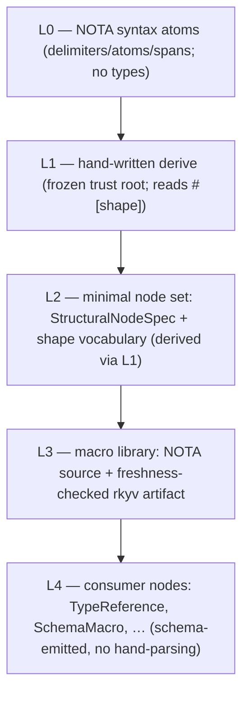

# 103 — Structural macro nodes as schema-data: DSLs written as configuration

*Design exploration (system-designer lane), grounding the psyche's epiphany:
"we're creating a bunch of domain-specific languages and we're just writing
them with data, with our schema … the structural macro node can be represented
in schema too … you can write the NOTA configuration for all the different
types of structural macro nodes in NOTA that match the spec." This is the
research/design contribution; the **intent capture is the designer's** and the
**implementation is the operator's** — this report is neither, it is the shape.*

## The insight

A structural macro node — `TypeReference`, `SchemaMacro`, `MacroPattern` — is
"a kind of thing that takes a certain number of objects to be constructed." Its
**shape** (its head, how many children, whether each child is a sub-node, an
atom-leaf, a numeric, or a body) is *itself data*. Today that shape is written
as Rust: `#[shape(head = "Vec", arity = 2)]` derive attributes plus, for the
harder nodes, hand-written `impl StructuralMacroNode` blocks. That is a
hand-maintained dispatch table in source — exactly the smell language-design
**#15** names ("every dispatch table in source code is a bug; types are derived
from declarative data; the fix is generation, not vigilance"), and exactly the
drift that bit `TypeReference`'s five copied `match head` sites.

The epiphany inverts the authority: **the spec of a structural macro node
becomes a schema, and each concrete node becomes a NOTA configuration matching
that spec.** The same tri-form we already use for records flows here too —
**schema** (the typed spec), **NOTA** (the configuration: the most human- and
LLM-intelligible form), **rkyv** (the binary the programs run). The Rust derive
stops being the source of truth and becomes the *freshness-checked bootstrap*.

## Where the line is today (data vs code)

| Layer | Today | |
|---|---|---|
| Macro *definitions* (which macros exist, their patterns/templates) | **data** — serialized `schema-next/schemas/builtin-macros.macro-library` (rkyv), with `builtin-macros.schema` as the freshness-checked bootstrap source | already there |
| Macro-node *shapes* (head/arity/child-kinds per variant) | **code** — `#[shape(…)]` derive attributes (`nota-next derive/src/lib.rs`), 6-variant `StructuralVariantShape` vocabulary | the gap |
| Five nodes (`SchemaMacro`, `MacroPattern`, `MacroTemplateObject`, `SourceVariantName`, `SourceVariantPayload`) | **code** — hand-written `impl StructuralMacroNode` | the gap |

So the definitions are data; the *shapes* are not. "The part we're missing" is
the shape as data: a `StructuralNodeSpec` schema, and the node shapes as NOTA
configs loaded (and freshness-checked) like the macro library already is.

## The design

### 1. The spec — a schema for a macro node's shape

The current derive vocabulary (`PascalAtom`, `Keyword`, `Headed{head,arity}`,
`HeadedAtom{head}`, `HeadedBody{head}`, `PascalHead{arity}`) generalizes into a
typed record. In schema-next `.schema` syntax:

```schema
[]
[]
{
  StructuralNodeSpec { node_name Name variants (Vec VariantSpec) }
  VariantSpec        { name Name shape VariantShape children (Vec ChildSpec) }
  VariantShape       { kind ShapeKind head (Optional String) arity (Optional Integer) }
  ShapeKind          [PascalAtom Keyword Headed HeadedAtom HeadedBody PascalHead]
  ChildSpec          { position Integer child_kind ChildKind }
  ChildKind          [(SubNode Name) (AtomLeaf Name) Body (Numeric Integer)]
}
```

`ChildKind` is the load-bearing addition the `TypeReference` work surfaced:
`SubNode` (a recursive macro-node child, e.g. `(Vec T)`), `AtomLeaf` (a scalar
like `Name`), `Numeric` (the `(Bytes 32)` width that needed the new
`HeadedAtom`), `Body`. Every shape the derive can express is one configuration
of this record.

### 2. The configuration — `TypeReference` as NOTA data

`TypeReference`, instead of carrying `#[shape]` attributes in Rust, is a NOTA
value matching the spec (condensed to representative variants):

```nota
(StructuralNodeSpec TypeReference [
  (VariantSpec String     (VariantShape PascalAtom None None)        [])
  (VariantSpec Plain      (VariantShape PascalAtom None None)        [(ChildSpec 1 (AtomLeaf Name))])
  (VariantSpec Vector     (VariantShape Headed     (Some Vec)    (Some 1)) [(ChildSpec 1 (SubNode TypeReference))])
  (VariantSpec Map        (VariantShape Headed     (Some Map)    (Some 2)) [(ChildSpec 1 (SubNode TypeReference)) (ChildSpec 2 (SubNode TypeReference))])
  (VariantSpec FixedBytes (VariantShape HeadedAtom (Some Bytes)  None)     [(ChildSpec 1 (Numeric 64))])
])
```

This is human-readable, LLM-intelligible, typed against the spec (it validates
arity and child counts), and serializes straight to rkyv. The "everything is a
structural macro" mandate (`v0n6`) is satisfied not by *more* derives but by the
node shapes living as data the structural layer reads.

### 3. The loader and the freshness-check inversion

- **Source of truth = the NOTA config**, serialized to a binary artifact
  (`builtin-nodes.rkyv`) alongside the existing macro-library artifact, loaded
  at startup.
- **Derive = the bootstrap witness.** `#[derive(StructuralMacroNode)]` stays on
  the Rust enum, but at expansion it re-encodes the Rust shapes to a
  `StructuralNodeSpec` and freshness-checks against the canonical NOTA config;
  on mismatch it errors. The artifact is authoritative; the attributes are
  stale-detection. (This is the same shape as the existing
  `builtin-macros.schema` ↔ `.macro-library` freshness check — generalized.)

## The bootstrap is sound (the self-hosting layering)

The chicken-and-egg — "the spec is a schema, parsed by structural macro nodes,
which are defined by the spec" — resolves by explicit layering, not by a
shortcut:



The derive (L1) is the one hand-authored trust root — a *named, narrow*
bootstrap exception to "types from data" (the same class as nota's
bare-identifier carve-out). It bootstraps the minimal node set (L2) that can
read the schema that defines everything above it. From L4 down, no node
hand-parses; every shape that appears is a config. This is language-design **#10
(no shortcuts; self-hosting requires the full grammar)** honored, not dodged.

## The generalization — one substrate, and it's already half-built

The deeper claim is that **config = typed NOTA against a schema, everywhere**,
with rkyv as its binary form: the *same* schema/NOTA/rkyv tri-form serves
records, wire contracts, macro definitions, **and** daemon configuration.

The system-designer observation: **daemon configuration is already an instance
of this.** The component-process rule says a daemon takes exactly one
pre-generated rkyv startup message, authored from typed NOTA by the deploy tool
(`skills/spirit-cli.md` §"Daemon startup is binary-only"). That *is*
schema (the config type) + NOTA (what the deploy tool authors) + rkyv (what the
daemon eats). The macro library is the same pattern one level up. So this isn't
a new mechanism — it's recognizing that the macro-node shapes are the last
hand-coded island in a stack that is otherwise already "data against a schema,
binary for the machine." And NOTA+schema being the most LLM-intelligible
notation is not incidental: an agent reads and writes a `StructuralNodeSpec`
config far more reliably than it reads a proc-macro's `#[shape]` attribute
soup — the format is the interface for both the machine and the model.

## Now vs later

**Implementable / realistic now** (operator's call on sequencing):
- The `TypeReference` structural-macro conversion + the `HeadedAtom` shape are
  already done on branches (`102/6`) — integrate them.
- Define the `StructuralNodeSpec` schema; emit its Rust via schema-rust-next;
  serialize the builtin node shapes into a `builtin-nodes` artifact with the
  existing freshness-check pattern.
- Convert the five remaining hand-written `impl StructuralMacroNode` nodes to
  the data-driven path (they're the concrete `v0n6` violations remaining).

**Longer-horizon / research:**
- Closing the loop so the *macro substrate's own* types (`StructuralNodeSpec`,
  the shape vocabulary) are themselves schema-emitted, not hand-authored — the
  full self-host.
- The uniform-config generalization (any new daemon config, cross-crate macro
  libraries) made explicit as one documented substrate.

## Risks and the honest boundaries

- **Dual source of truth (derive vs config).** The freshness-check must be
  airtight or the two drift — the exact failure that produced the five copied
  `match head` sites. The check has to compare *semantics*, not just "artifact
  is current"; a content hash (blake3) of the canonical config is the robust
  form, not byte-exact rkyv (which is architecture/endianness-sensitive).
- **The derive-as-bootstrap is a real, named exception** to "types from data" —
  keep it narrow and frozen; if it accretes special cases, the trust root
  erodes into the very thing it replaced.
- **Over-abstraction.** If every layer demands a freshness-checked artifact,
  build time and dependency closure grow. The win is real only where the shape
  genuinely varies as data; nota-design's "when to hand-write the codec"
  carve-out stays legitimate for narrow-domain leaves.
- **Performance.** Data-driven dispatch must not regress the hot decode path
  versus generated code; the derive can still *generate* the fast path *from*
  the config, keeping data as the source and codegen as the realization.

## Hand-offs

- **Designer** owns the intent capture for this direction (the psyche assigned
  it there; only one lane captures).
- **Operator** owns what lands now (the conversions, the `StructuralNodeSpec`
  artifact) and the spirit-lock/async-capture mechanics that were the other half
  of the psyche's message — out of scope here.
- **Open questions for the psyche/designer:** the freshness-check form
  (semantic hash vs byte-exact); whether `StructuralNodeSpec`'s own types are
  schema-emitted in this pass or held as the bootstrap; and how far to push the
  uniform-config generalization now versus naming it and deferring.
