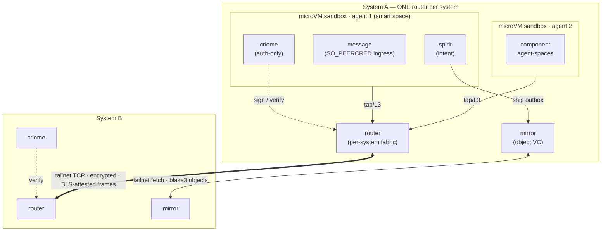
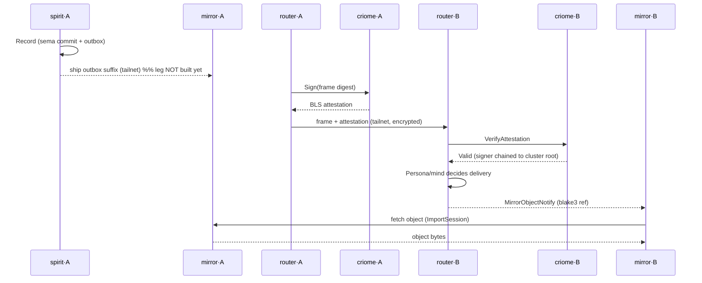
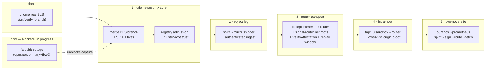

# 117 — Where we are: criome / spirit / router — full picture

*A "where is everything" status with visuals, requested by the psyche. Covers what
is built, what is decided, what is intended, and the current blocker. Consolidates
reports 112–116, the SO audit 225, and the live design discussion. Spirit is down
(`primary-4bw6`), so the three decisions below are queued in `spiritbackup.nota`, not
yet in the intent store.*

## Status at a glance

| Layer | State | Where |
|---|---|---|
| criome real BLS sign/verify | **built, tested** (branch, unmerged) | `criome-auth-pilot`; reports 113/114 |
| criome audit P1 fixes | **open** (7 mine + the registry gap) | SO audit 225; `kr40` |
| criome registry admission / trust root | **decided, not built** | decision A; `kr40` |
| spirit criome-auth pilot (per-op attestation) | **decided, not built** | `5zur`; `w2g3`/`2st7` |
| CriomOS comms architecture | **decided, not built** | report 116; queued in `spiritbackup.nota` |
| router network transport | **intended** | report 116 staged plan |
| intra-host sandbox↔router (tap/L3) | **decided, not built** | decision B |
| mirror per-system + auth ingest | **decided, not built** | decision D; corrects `0yx5` |
| spirit→mirror shipper (e2e leg 1) | **does not exist** | report 116 |
| spirit-daemon | **DOWN** (outage) | `primary-4bw6` |

## The target topology (intended)

criome **signs**, router **transports** (cross-sandbox + cross-network), mirror
**moves bytes**, the tailnet **encrypts**, BLS **authenticates**. One router per
system; one microVM per agent.

## The end-to-end flow (intended)

The two legs that do not exist yet: **spirit→mirror ship** (no mirror dep in spirit)
and **real cross-router auth** (criome registry has no admission control; BLS is real
only on the unmerged branch).

## The roadmap (staged)

## Decisions captured (queued in spiritbackup.nota until spirit returns)

- **Architecture** (Decision): per-agent microVM sandboxes; one per-system router as
  the cross-sandbox + cross-network fabric; criome auth-only, router transports,
  mirror moves bytes, tailnet encrypts, BLS authenticates; intra-host tap/L3. Realizes
  `i99x`; narrows `l3k4` (harness-ack → local path only); refines `a4i6`; keeps `alom`.
- **Trust root** (Decision): a cluster-root identity signs member keys = criome's
  registry admission gate; peers trust keys chained to the root. The #1 prerequisite.
- **Mirror** (Correction of `0yx5`): per-system mirror with authenticated object
  ingest; router carries the notify, mirror keeps its fetch transport.

## The blocker

spirit-daemon is down on ouranos since 13:06 — a deployed `spirit-migrate-store`
rejects the live store's schema 10 (`primary-4bw6`; same v9/v10 root as `9cop`). Store
data is intact; a rollback of the 13:06 deploy (or a migrate-store fix to no-op on
schema 10) recovers it. Operator is on it. Until then, all intent capture queues in
`spiritbackup.nota` and replays through the guardian on recovery.

## What's mine to do next (once spirit is back / on your steer)

1. Replay `spiritbackup.nota` through spirit (the 3 decisions).
2. The **criome security core**: merge `criome-auth-pilot` + land the SO `225` P1
   fixes + build registry admission control + the cluster-root trust bootstrap
   (decision A). This is the foundation; networking builds on it.
3. Then the object leg (spirit→mirror shipper), the router transport, intra-host, and
   the two-node e2e — in that order.
